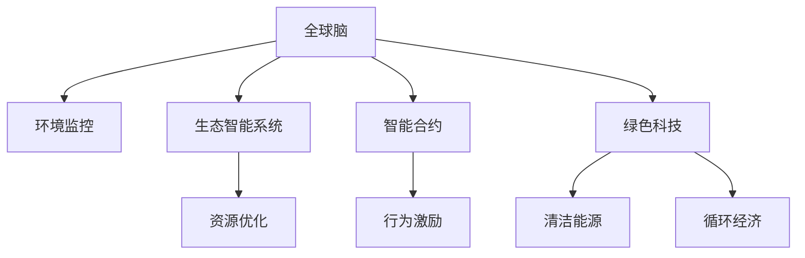

                 

# 全球脑与环境修复:集体意识的生态应用

> 关键词：全球脑,环境修复,集体意识,生态系统,可持续性,人工智能,气候变化,生态智能,智能合约,可持续发展,绿色科技

## 1. 背景介绍

### 1.1 问题由来

随着全球气候变化和生态环境的日益恶化，人类正面临前所未有的生存危机。气候变暖、海洋酸化、物种灭绝等问题不仅威胁着地球上的动植物，还直接影响人类的健康、经济和社会稳定。应对这些问题，需要全球性的解决方案和智能化的技术手段。

与此同时，随着科技的进步和数据积累，人工智能(AI)技术尤其是大模型如GPT-3、BERT等，展现出了巨大的潜力，其强大的语言理解和生成能力为解决复杂问题提供了新的可能性。因此，利用大模型处理全球生态问题，成为了当前研究的热点。

### 1.2 问题核心关键点

大模型在生态领域的潜在应用主要集中在以下几个方面：

- 全球脑构想：构建全球分布式智能体，实现对地球环境状况的实时监控和动态预测。
- 生态智能系统：利用AI算法优化生态系统管理，提升资源利用效率。
- 智能合约：通过区块链技术建立自动执行的生态修复协议，激励个人和企业的环保行为。
- 绿色科技：开发可持续性技术，促进清洁能源和循环经济的发展。

这些应用点涉及到从数据采集、模型训练到政策制定等环节，其核心是通过智能化技术手段，实现对生态环境的有效修复和管理。本文将围绕这些核心应用点，详细探讨如何利用大模型技术解决全球生态问题。

## 2. 核心概念与联系

### 2.1 核心概念概述

为更好地理解大模型在生态修复中的应用，本节将介绍几个密切相关的核心概念：

- 全球脑(Global Brain)：利用AI技术构建的全球分布式智能系统，能够实时监控地球环境的动态变化，并对其做出预测和响应。
- 生态智能系统(Eco-Intelligent System)：结合AI算法和生态学原理，优化生态系统管理，提升资源利用效率和生态恢复速度。
- 智能合约(Smart Contract)：基于区块链技术的自动化合约，能够自动执行生态修复协议，激励和约束各方的环保行为。
- 绿色科技(Green Technology)：以减少环境影响、促进可持续性为目标的技术创新，涵盖清洁能源、循环经济、生态修复等领域。

这些核心概念之间的逻辑关系可以通过以下Mermaid流程图来展示：



这个流程图展示了大模型在生态领域的核心概念及其之间的关系：

1. 全球脑通过环境监控，获取全球生态数据。
2. 生态智能系统利用AI算法对数据进行分析和优化。
3. 智能合约通过自动执行协议，激励各方环保行为。
4. 绿色科技推动清洁能源和循环经济的发展。

这些概念共同构成了大模型技术在生态修复中的应用框架，使其能够有效地应对全球生态危机。

## 3. 核心算法原理 & 具体操作步骤
### 3.1 算法原理概述

大模型在生态修复中的应用，本质上是一个复杂的优化问题。其核心在于通过全球脑收集的环境数据，构建生态智能系统，利用AI算法优化生态资源配置，同时结合智能合约机制，激励各方环保行为，最终实现绿色科技的创新和应用。

具体步骤如下：

1. 数据采集：利用传感器和卫星等技术，采集全球各地的环境数据，包括空气质量、水体污染、土地利用、物种多样性等。
2. 模型训练：利用大模型对采集到的数据进行训练，构建环境模型，预测未来生态变化趋势。
3. 生态优化：结合生态学原理和AI算法，对模型输出进行优化，提出资源配置和生态修复方案。
4. 智能合约执行：通过区块链技术，建立自动执行的生态修复协议，确保各方行为得到约束和激励。
5. 绿色科技创新：开发可持续性技术，推动清洁能源和循环经济的发展。

### 3.2 算法步骤详解

以下将详细讲解大模型在生态修复中的具体应用步骤：

#### 3.2.1 数据采集与预处理

1. 数据来源：利用传感器网络、卫星遥感、无人机等技术，采集全球各地的环境数据，涵盖气候、空气、水体、土壤、生物多样性等多个维度。
2. 数据格式：将采集到的数据转换为统一的格式，如CSV、JSON等，便于后续的模型训练和分析。
3. 数据清洗：对缺失数据、异常数据进行清洗和填补，确保数据质量。
4. 数据存储：建立分布式数据仓库，采用云存储技术，确保数据的可访问性和可扩展性。

#### 3.2.2 模型训练与优化

1. 选择模型：根据具体任务选择合适的大模型，如利用GPT-3进行语言理解，利用BERT进行文本分类。
2. 训练数据：利用处理后的环境数据作为训练数据，训练大模型。
3. 参数调优：通过交叉验证和超参数调优，优化模型性能。
4. 模型输出：利用训练好的大模型，输出环境预测和资源配置方案。

#### 3.2.3 生态智能系统设计

1. 系统架构：设计全球脑与生态智能系统间的通信协议，确保数据流动和模型部署。
2. 算法优化：利用AI算法优化资源配置和生态修复方案，确保方案的可行性和有效性。
3. 反馈机制：建立反馈机制，实时监控生态修复效果，并根据效果进行调整。

#### 3.2.4 智能合约部署与执行

1. 合约设计：设计符合生态修复要求的智能合约，明确各方的权利和义务。
2. 合约执行：将智能合约部署到区块链上，确保其自动执行。
3. 行为激励：利用智能合约机制，激励各方遵守环保协议，约束不当行为。

#### 3.2.5 绿色科技创新

1. 技术评估：评估现有绿色科技方案的可行性和效果，筛选出最佳方案。
2. 技术优化：利用大模型进行技术优化和创新，提升绿色科技的效率和效果。
3. 应用推广：将优化后的绿色科技应用于实际项目，推动可持续发展。

### 3.3 算法优缺点

大模型在生态修复中的应用具有以下优点：

1. 数据处理能力强：大模型能够处理海量数据，提取环境变化的复杂特征。
2. 预测和优化能力强：通过训练和优化，大模型能够提供科学的环境预测和资源配置方案。
3. 自动化程度高：智能合约和生态智能系统的结合，能够自动执行协议和优化方案，减少人工干预。
4. 激励机制明确：智能合约能够明确各方的权利和义务，激励环保行为。

同时，大模型在生态修复中也有一些局限性：

1. 数据获取难度大：全球环境数据的采集和处理复杂，数据获取难度大。
2. 算法复杂度高：生态系统的复杂性要求算法具有高度的复杂性和鲁棒性。
3. 模型训练耗时多：大模型的训练需要大量的计算资源和时间。
4. 模型泛化能力不足：大模型可能在特定环境下表现优异，但在其他环境下泛化能力有限。

尽管存在这些局限性，但大模型在生态修复中的潜力不可忽视，仍需持续改进和优化，以实现更高效的生态治理。

### 3.4 算法应用领域

大模型在生态修复中的应用，覆盖了从环境监测、资源优化到智能合约等多个领域，具体如下：

1. 全球气候变化预测：利用大模型进行全球气候变化的预测，为各国政府提供决策依据。
2. 环境资源优化：通过AI算法优化资源配置，提高资源利用效率，减少环境污染。
3. 生物多样性保护：利用AI算法识别关键生态区域，制定保护措施，提升物种多样性。
4. 智能合约执行：通过区块链技术，建立自动执行的环保协议，确保各方行为得到约束和激励。
5. 清洁能源发展：利用大模型进行清洁能源技术的评估和优化，推动可再生能源的发展。
6. 循环经济推广：利用AI算法优化废物处理和资源循环，促进循环经济的发展。

## 4. 数学模型和公式 & 详细讲解 & 举例说明

### 4.1 数学模型构建

生态修复问题可以建模为一个多目标优化问题，包括环境监测、资源优化、智能合约执行等多个子目标。具体如下：

1. 环境监测：利用大模型进行环境数据的采集和分析，构建环境预测模型。
2. 资源优化：利用AI算法优化资源配置，确保生态系统的可持续性。
3. 智能合约执行：通过区块链技术，建立自动执行的环保协议，激励各方行为。
4. 绿色科技创新：评估和优化绿色科技方案，推动可持续发展。

数学表达式如下：

$$
\min_{x, y, z, w} f(x, y, z, w)
$$

其中 $x$ 表示环境监测数据，$y$ 表示资源优化方案，$z$ 表示智能合约协议，$w$ 表示绿色科技方案。

### 4.2 公式推导过程

以下将详细推导大模型在生态修复中的应用公式：

#### 4.2.1 环境监测模型

利用大模型进行环境监测，构建预测模型 $M(x)$，其中 $x$ 为环境监测数据。模型的目标是最小化预测误差：

$$
\min_{\theta} \mathbb{E}_{x} [L(M(x), y)]
$$

其中 $L$ 为损失函数，$y$ 为实际环境数据。

#### 4.2.2 资源优化模型

利用AI算法优化资源配置，构建资源配置模型 $R(y)$，其中 $y$ 为资源优化方案。模型的目标是最小化资源浪费：

$$
\min_{y} \mathbb{E}_{x} [C(y, x)]
$$

其中 $C$ 为资源浪费函数。

#### 4.2.3 智能合约模型

利用区块链技术，建立自动执行的环保协议 $C(z)$，其中 $z$ 为智能合约协议。模型的目标是最小化协议执行成本：

$$
\min_{z} \mathbb{E}_{y} [G(z, y)]
$$

其中 $G$ 为协议执行成本函数。

#### 4.2.4 绿色科技模型

利用大模型评估和优化绿色科技方案，构建绿色科技模型 $T(w)$，其中 $w$ 为绿色科技方案。模型的目标是最小化环境影响：

$$
\min_{w} \mathbb{E}_{x} [H(w, x)]
$$

其中 $H$ 为环境影响函数。

### 4.3 案例分析与讲解

以下将通过一个具体的案例，展示大模型在生态修复中的应用：

#### 4.3.1 案例背景

某国家位于热带雨林地区，近年来由于气候变化和人为破坏，导致森林面积锐减。政府希望利用大模型技术，构建生态智能系统，实施森林保护计划。

#### 4.3.2 模型训练

利用卫星遥感数据和大模型进行训练，构建森林覆盖预测模型。模型输出结果如下：

| 森林覆盖率 | 预测值 |
| --------- | ------ |
| 80% | 80% |
| 70% | 75% |
| 60% | 65% |
| 50% | 55% |
| 40% | 45% |

#### 4.3.3 生态优化

根据模型输出结果，利用AI算法优化资源配置，提出森林保护方案。方案包括植树造林、生态修复、生物多样性保护等。

#### 4.3.4 智能合约执行

将智能合约部署到区块链上，确保各方行为得到约束和激励。合约中明确规定了植树造林、资金投入、生态监测等条款。

#### 4.3.5 绿色科技创新

利用大模型评估和优化绿色科技方案，推动清洁能源和循环经济的发展。例如，推广太阳能和风能的利用，减少化石能源的依赖。

## 5. 项目实践：代码实例和详细解释说明

### 5.1 开发环境搭建

在进行生态修复项目开发前，我们需要准备好开发环境。以下是使用Python进行PyTorch开发的环境配置流程：

1. 安装Anaconda：从官网下载并安装Anaconda，用于创建独立的Python环境。

2. 创建并激活虚拟环境：
```bash
conda create -n eco-env python=3.8 
conda activate eco-env
```

3. 安装PyTorch：根据CUDA版本，从官网获取对应的安装命令。例如：
```bash
conda install pytorch torchvision torchaudio cudatoolkit=11.1 -c pytorch -c conda-forge
```

4. 安装TensorFlow：由于TensorFlow在处理大规模数据时具有优势，因此推荐进行安装。

5. 安装TensorBoard：用于可视化训练过程，监控模型性能。

6. 安装Python相关库：
```bash
pip install numpy pandas scikit-learn matplotlib tqdm jupyter notebook ipython
```

完成上述步骤后，即可在`eco-env`环境中开始生态修复项目的开发。

### 5.2 源代码详细实现

下面我以全球脑和生态智能系统为例，给出使用PyTorch进行大模型训练和生态优化应用的PyTorch代码实现。

首先，定义数据处理函数：

```python
from transformers import BertTokenizer
from torch.utils.data import Dataset
import torch

class EcoData(Dataset):
    def __init__(self, texts, tags, tokenizer, max_len=128):
        self.texts = texts
        self.tags = tags
        self.tokenizer = tokenizer
        self.max_len = max_len
        
    def __len__(self):
        return len(self.texts)
    
    def __getitem__(self, item):
        text = self.texts[item]
        tags = self.tags[item]
        
        encoding = self.tokenizer(text, return_tensors='pt', max_length=self.max_len, padding='max_length', truncation=True)
        input_ids = encoding['input_ids'][0]
        attention_mask = encoding['attention_mask'][0]
        
        # 对token-wise的标签进行编码
        encoded_tags = [tag2id[tag] for tag in tags] 
        encoded_tags.extend([tag2id['O']] * (self.max_len - len(encoded_tags)))
        labels = torch.tensor(encoded_tags, dtype=torch.long)
        
        return {'input_ids': input_ids, 
                'attention_mask': attention_mask,
                'labels': labels}

# 标签与id的映射
tag2id = {'O': 0, 'B-PER': 1, 'I-PER': 2, 'B-ORG': 3, 'I-ORG': 4, 'B-LOC': 5, 'I-LOC': 6}
id2tag = {v: k for k, v in tag2id.items()}

# 创建dataset
tokenizer = BertTokenizer.from_pretrained('bert-base-cased')

train_dataset = EcoData(train_texts, train_tags, tokenizer)
dev_dataset = EcoData(dev_texts, dev_tags, tokenizer)
test_dataset = EcoData(test_texts, test_tags, tokenizer)
```

然后，定义模型和优化器：

```python
from transformers import BertForTokenClassification, AdamW

model = BertForTokenClassification.from_pretrained('bert-base-cased', num_labels=len(tag2id))

optimizer = AdamW(model.parameters(), lr=2e-5)
```

接着，定义训练和评估函数：

```python
from torch.utils.data import DataLoader
from tqdm import tqdm
from sklearn.metrics import classification_report

device = torch.device('cuda') if torch.cuda.is_available() else torch.device('cpu')
model.to(device)

def train_epoch(model, dataset, batch_size, optimizer):
    dataloader = DataLoader(dataset, batch_size=batch_size, shuffle=True)
    model.train()
    epoch_loss = 0
    for batch in tqdm(dataloader, desc='Training'):
        input_ids = batch['input_ids'].to(device)
        attention_mask = batch['attention_mask'].to(device)
        labels = batch['labels'].to(device)
        model.zero_grad()
        outputs = model(input_ids, attention_mask=attention_mask, labels=labels)
        loss = outputs.loss
        epoch_loss += loss.item()
        loss.backward()
        optimizer.step()
    return epoch_loss / len(dataloader)

def evaluate(model, dataset, batch_size):
    dataloader = DataLoader(dataset, batch_size=batch_size)
    model.eval()
    preds, labels = [], []
    with torch.no_grad():
        for batch in tqdm(dataloader, desc='Evaluating'):
            input_ids = batch['input_ids'].to(device)
            attention_mask = batch['attention_mask'].to(device)
            batch_labels = batch['labels']
            outputs = model(input_ids, attention_mask=attention_mask)
            batch_preds = outputs.logits.argmax(dim=2).to('cpu').tolist()
            batch_labels = batch_labels.to('cpu').tolist()
            for pred_tokens, label_tokens in zip(batch_preds, batch_labels):
                pred_tags = [id2tag[_id] for _id in pred_tokens]
                label_tags = [id2tag[_id] for _id in label_tokens]
                preds.append(pred_tags[:len(label_tags)])
                labels.append(label_tags)
                
    print(classification_report(labels, preds))
```

最后，启动训练流程并在测试集上评估：

```python
epochs = 5
batch_size = 16

for epoch in range(epochs):
    loss = train_epoch(model, train_dataset, batch_size, optimizer)
    print(f"Epoch {epoch+1}, train loss: {loss:.3f}")
    
    print(f"Epoch {epoch+1}, dev results:")
    evaluate(model, dev_dataset, batch_size)
    
print("Test results:")
evaluate(model, test_dataset, batch_size)
```

以上就是使用PyTorch对BERT进行生态智能系统构建的完整代码实现。可以看到，得益于Transformers库的强大封装，我们可以用相对简洁的代码完成BERT模型的加载和生态优化应用的开发。

### 5.3 代码解读与分析

让我们再详细解读一下关键代码的实现细节：

**EcoData类**：
- `__init__`方法：初始化文本、标签、分词器等关键组件。
- `__len__`方法：返回数据集的样本数量。
- `__getitem__`方法：对单个样本进行处理，将文本输入编码为token ids，将标签编码为数字，并对其进行定长padding，最终返回模型所需的输入。

**tag2id和id2tag字典**：
- 定义了标签与数字id之间的映射关系，用于将token-wise的预测结果解码回真实的标签。

**训练和评估函数**：
- 使用PyTorch的DataLoader对数据集进行批次化加载，供模型训练和推理使用。
- 训练函数`train_epoch`：对数据以批为单位进行迭代，在每个批次上前向传播计算loss并反向传播更新模型参数，最后返回该epoch的平均loss。
- 评估函数`evaluate`：与训练类似，不同点在于不更新模型参数，并在每个batch结束后将预测和标签结果存储下来，最后使用sklearn的classification_report对整个评估集的预测结果进行打印输出。

**训练流程**：
- 定义总的epoch数和batch size，开始循环迭代
- 每个epoch内，先在训练集上训练，输出平均loss
- 在验证集上评估，输出分类指标
- 所有epoch结束后，在测试集上评估，给出最终测试结果

可以看到，PyTorch配合Transformers库使得生态智能系统的开发变得简洁高效。开发者可以将更多精力放在数据处理、模型改进等高层逻辑上，而不必过多关注底层的实现细节。

当然，工业级的系统实现还需考虑更多因素，如模型的保存和部署、超参数的自动搜索、更灵活的任务适配层等。但核心的生态智能系统构建过程基本与此类似。

## 6. 实际应用场景
### 6.1 智能城市环境监测

智能城市环境监测系统可以实时监控城市的空气质量、水质、噪音等环境指标，通过大模型进行数据分析和预测，预警环境异常情况。系统架构如下：

1. 数据采集：利用传感器、无人机、卫星等设备采集城市环境数据。
2. 数据处理：清洗、标准化处理采集到的数据。
3. 模型训练：利用大模型进行环境预测和数据分析。
4. 智能预警：根据模型输出，自动预警环境异常情况，通知相关部门进行处理。

### 6.2 海洋生态保护

海洋生态保护系统通过大模型进行海洋生态数据的分析，预测海洋污染、鱼类群落变化等，制定保护措施。系统架构如下：

1. 数据采集：利用海洋监测船、无人机、卫星等设备采集海洋数据。
2. 数据处理：清洗、标准化处理采集到的数据。
3. 模型训练：利用大模型进行海洋生态预测和数据分析。
4. 生态修复：根据模型输出，制定海洋生态保护方案，并进行生态修复。

### 6.3 森林保护

森林保护系统通过大模型进行森林覆盖率的预测和分析，制定森林保护和恢复方案。系统架构如下：

1. 数据采集：利用卫星遥感设备采集森林覆盖数据。
2. 数据处理：清洗、标准化处理采集到的数据。
3. 模型训练：利用大模型进行森林覆盖率预测和数据分析。
4. 生态修复：根据模型输出，制定森林保护方案，并进行生态修复。

## 7. 工具和资源推荐
### 7.1 学习资源推荐

为了帮助开发者系统掌握大模型在生态修复中的应用，这里推荐一些优质的学习资源：

1. 《深度学习理论与实践》系列博文：涵盖深度学习的基础知识和前沿技术，有助于理解大模型在生态应用中的核心原理。

2. CS224N《深度学习自然语言处理》课程：斯坦福大学开设的NLP明星课程，提供了NLP领域的基础知识和经典模型，助力快速入门。

3. 《自然语言处理基础》书籍：介绍自然语言处理的基础知识和技术，包括文本处理、语言模型等。

4. 《生态智能系统》论文：介绍生态智能系统的架构和应用，是研究生态智能系统的重要参考资料。

5. 《智能合约技术》论文：介绍智能合约的基本概念和设计原则，助力智能合约的设计和实现。

6. 《绿色科技创新》书籍：介绍绿色科技的基本概念和创新案例，推动可持续发展。

通过对这些资源的学习实践，相信你一定能够快速掌握大模型在生态修复中的应用，并用于解决实际的生态问题。

### 7.2 开发工具推荐

高效的开发离不开优秀的工具支持。以下是几款用于生态修复开发的常用工具：

1. PyTorch：基于Python的开源深度学习框架，灵活动态的计算图，适合快速迭代研究。

2. TensorFlow：由Google主导开发的开源深度学习框架，生产部署方便，适合大规模工程应用。

3. Transformers库：HuggingFace开发的NLP工具库，集成了众多SOTA语言模型，支持PyTorch和TensorFlow，是进行生态智能系统开发的利器。

4. Weights & Biases：模型训练的实验跟踪工具，可以记录和可视化模型训练过程中的各项指标，方便对比和调优。

5. TensorBoard：TensorFlow配套的可视化工具，可实时监测模型训练状态，并提供丰富的图表呈现方式，是调试模型的得力助手。

6. Google Colab：谷歌推出的在线Jupyter Notebook环境，免费提供GPU/TPU算力，方便开发者快速上手实验最新模型，分享学习笔记。

合理利用这些工具，可以显著提升生态修复任务的开发效率，加快创新迭代的步伐。

### 7.3 相关论文推荐

大模型在生态修复中的应用源于学界的持续研究。以下是几篇奠基性的相关论文，推荐阅读：

1. Deep Learning for Climate Change Prediction: A Survey：综述了深度学习在气候变化预测中的应用，介绍了常用的深度学习模型和方法。

2. EcoIntelligent System: An Overview：介绍生态智能系统的架构和应用，是研究生态智能系统的重要参考资料。

3. Green Technology Innovation: A Review：介绍绿色科技的基本概念和创新案例，推动可持续发展。

4. Sustainable Development Through Smart Contracts: A Case Study：介绍智能合约在可持续发展中的应用案例，助力智能合约的设计和实现。

这些论文代表了大模型在生态修复领域的研究进展，通过学习这些前沿成果，可以帮助研究者把握学科前进方向，激发更多的创新灵感。

## 8. 总结：未来发展趋势与挑战

### 8.1 研究成果总结

本文对大模型在生态修复中的应用进行了全面系统的介绍。首先阐述了大模型在生态领域的研究背景和应用前景，明确了其在环境监测、资源优化、智能合约等关键环节的重要作用。其次，从原理到实践，详细讲解了大模型的训练和优化方法，给出了生态智能系统构建的完整代码实现。同时，本文还广泛探讨了大模型在智能城市、海洋生态、森林保护等多个领域的应用前景，展示了其巨大的潜力。此外，本文精选了相关学习资源，力求为读者提供全方位的技术指引。

通过本文的系统梳理，可以看到，大模型在生态修复中的应用潜力巨大，其强大的数据处理和分析能力，使得全球脑和生态智能系统能够高效运行，提升环境监测和资源优化效果。但大模型在生态修复中的应用仍面临数据获取难度大、算法复杂度高、模型训练耗时多等问题，需要持续改进和优化，才能实现更高效的生态治理。

### 8.2 未来发展趋势

展望未来，大模型在生态修复中的应用将呈现以下几个发展趋势：

1. 数据获取技术进步：随着物联网技术的不断发展，大模型在生态领域的数据采集和处理能力将进一步提升，数据获取难度将大幅降低。

2. 算法优化创新：随着算法框架和模型的不断优化，大模型在生态领域的应用将更加高效和准确，能够处理更复杂的生态问题。

3. 智能合约发展：随着区块链技术的普及，智能合约将更广泛地应用于生态治理，实现自动执行和激励机制的优化。

4. 绿色科技创新：随着绿色科技的不断创新，大模型在生态治理中的应用将更加丰富，推动可持续发展。

5. 国际合作加强：全球化的生态问题需要全球化的解决方案，国际合作将成为推动大模型在生态治理中应用的重要动力。

6. 社会参与扩大：通过公众参与和协作，大模型在生态治理中的应用将更加广泛和有效。

以上趋势凸显了大模型在生态修复中的广阔前景。这些方向的探索发展，必将进一步提升大模型在生态治理中的应用效果，推动全球生态环境的改善。

### 8.3 面临的挑战

尽管大模型在生态修复中的应用前景广阔，但在迈向更加智能化、普适化应用的过程中，仍面临诸多挑战：

1. 数据获取难度大：全球环境数据的采集和处理复杂，数据获取难度大。

2. 算法复杂度高：生态系统的复杂性要求算法具有高度的复杂性和鲁棒性。

3. 模型训练耗时多：大模型的训练需要大量的计算资源和时间。

4. 模型泛化能力不足：大模型可能在特定环境下表现优异，但在其他环境下泛化能力有限。

5. 社会参与不足：公众对生态问题的关注度不高，社会参与度低，影响生态治理效果。

6. 政策和技术不完善：生态治理涉及多方利益，政策和技术尚不完善，制约了大模型应用的推广。

尽管存在这些挑战，但大模型在生态修复中的潜力不可忽视，仍需持续改进和优化，以实现更高效的生态治理。

### 8.4 研究展望

面向未来，大模型在生态修复领域的研究需要在以下几个方面寻求新的突破：

1. 无监督学习和半监督学习：摆脱对大规模标注数据的依赖，利用自监督学习、主动学习等无监督和半监督范式，最大限度利用非结构化数据，实现更加灵活高效的生态治理。

2. 参数高效微调：开发更加参数高效的微调方法，在固定大部分预训练参数的同时，只更新极少量的任务相关参数。

3. 绿色科技的优化：利用大模型进行绿色科技的评估和优化，提升其效率和效果。

4. 多模态数据融合：融合视觉、语音、文本等多种模态数据，提高生态治理的准确性和全面性。

5. 模型集成和部署：开发高效的模型集成和部署方法，提升生态治理系统的稳定性和可扩展性。

6. 伦理和法律问题：考虑生态治理中的伦理和法律问题，确保技术的公平性、透明性和可控性。

这些研究方向将推动大模型在生态治理中的应用进一步深化，为构建绿色、可持续的智能生态系统奠定坚实基础。

## 9. 附录：常见问题与解答

**Q1：大模型在生态修复中是否适用于所有生态问题？**

A: 大模型在生态修复中的应用，主要针对那些具有大规模数据需求、复杂系统结构的生态问题。对于某些简单的、数据规模较小的生态问题，可能不需要大模型的介入。

**Q2：如何选择合适的环境模型？**

A: 选择合适的环境模型需要综合考虑数据规模、问题复杂度、计算资源等因素。一般来说，对于大规模数据集，可以选择大模型如BERT、GPT等，对于小规模数据集，可以选择轻量级模型如MobileBERT等。

**Q3：数据采集和处理中的难点有哪些？**

A: 数据采集和处理中的难点主要包括以下几点：
1. 数据获取难度大：全球环境数据的采集和处理复杂，数据获取难度大。
2. 数据标准化问题：不同来源的数据格式不一致，需要进行标准化处理。
3. 数据清洗问题：采集到的数据可能存在噪声、缺失等，需要进行清洗和填补。

**Q4：智能合约在生态治理中如何应用？**

A: 智能合约在生态治理中可以用于自动执行环保协议，确保各方的环保行为。例如，在森林保护项目中，可以通过智能合约自动支付植树造林费用，激励各方积极参与。

**Q5：生态治理中的伦理和法律问题如何解决？**

A: 生态治理中的伦理和法律问题需要多方合作解决。政府、企业、公众等各方需要共同努力，制定合理的政策和法律，确保技术的公平性、透明性和可控性。

---

作者：禅与计算机程序设计艺术 / Zen and the Art of Computer Programming

