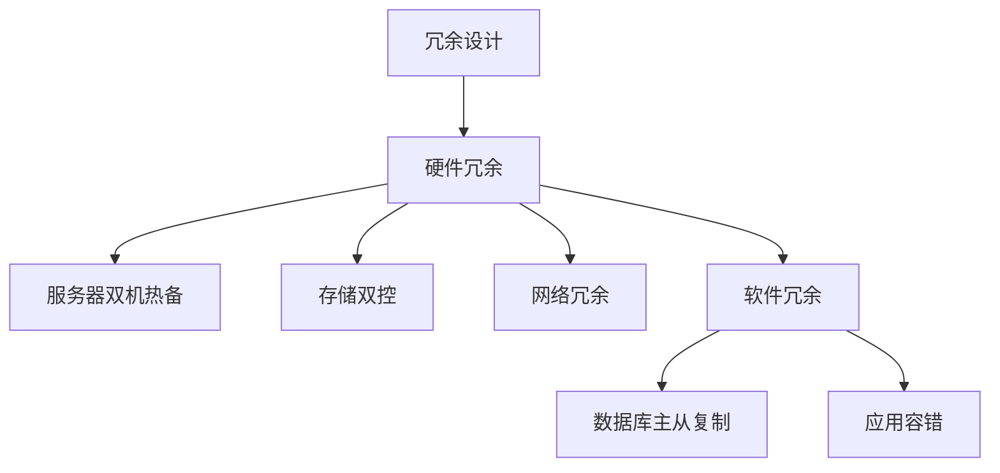

                 

# 冗余设计在高可用性中的实例应用

## 1. 背景介绍

随着信息技术的不断发展，数据和应用的重要性日益增加，高可用性（High Availability）成为信息化基础设施建设中不可或缺的一部分。高可用性指的是在某个时间范围内，信息系统能够正常提供服务的能力。传统的冗余设计是提高系统高可用性的一种重要手段。冗余设计通过在系统中引入多个硬件或软件组件，确保在单个组件失效时，其他组件可以接管工作，从而避免服务中断。

本文将深入探讨冗余设计在高可用性中的实际应用，包括冗余设计的原理、实施步骤、优缺点和未来发展方向。

## 2. 核心概念与联系

### 2.1 核心概念概述

冗余设计：通过引入多个相同或相似的组件，保证系统在某个组件失效时，其他组件能够接替其工作，从而提高系统的可靠性。冗余设计常应用于硬件系统（如服务器、存储设备）、软件系统（如数据库、应用程序）等领域。

高可用性（High Availability）：指信息系统在某个时间范围内能够正常提供服务的能力。通常以系统的"停机时间"（Downtime）来衡量，即一年内系统无法提供服务的总时间（以小时为单位）。例如，一个系统的高可用性为99.999%，意味着在一年内系统平均只能停止0.51小时，即约9.5分钟。

高可用性等级划分：常见的高可用性等级包括：
- 99.9%：至少可用270天，每年最多允许停机8.76小时。
- 99.99%：至少可用365天，每年最多允许停机52.56分钟。
- 99.999%：至少可用365天，每年最多允许停机5.25分钟。
- 99.9999%：至少可用365天，每年最多允许停机52.6秒。

### 2.2 核心概念原理和架构的 Mermaid 流程图



## 3. 核心算法原理 & 具体操作步骤

### 3.1 算法原理概述

冗余设计的核心思想是通过引入多个相同的组件，在单个组件失效时，其他组件能够接替其工作，从而提高系统的可靠性。冗余设计通常包括以下几个步骤：
1. 确定冗余组件。根据系统的关键性，选择需冗余的组件。
2. 配置冗余组件。确保冗余组件能够实现相同的功能，并在某个组件失效时能够自动接替工作。
3. 实现冗余组件的切换。在冗余组件之间实现故障切换，确保系统能够正常运行。

### 3.2 算法步骤详解

#### 步骤1：冗余组件的选择

选择合适的冗余组件是冗余设计的基础。通常需冗余的组件包括：
- 服务器：保证系统在服务器硬件故障时能够正常运行。
- 存储设备：保证系统在存储设备故障时能够正常存储和访问数据。
- 网络设备：保证系统在网络设备故障时能够正常通信。
- 数据库：保证系统在数据库故障时能够正常存储和查询数据。
- 应用：保证系统在应用故障时能够正常运行。

#### 步骤2：冗余组件的配置

在确定冗余组件后，需进行配置。通常配置包括以下几个方面：
- 硬件冗余：将两个相同的硬件设备通过网络或物理接口连接，保证其中一个设备故障时，另一个设备能够接替其工作。
- 软件冗余：将两个相同的应用程序部署在两个服务器上，保证其中一个应用程序故障时，另一个应用程序能够接替其工作。
- 数据库冗余：通过数据库主从复制或多主复制技术，保证在主数据库故障时，从数据库能够自动接管工作。

#### 步骤3：冗余组件的切换

冗余组件的切换是冗余设计的关键步骤。常见的冗余切换策略包括：
- 主备切换：其中一个冗余组件为主设备，另一个冗余组件为备设备。主设备故障时，备设备自动接管工作。
- 主动-主动切换：两个冗余组件都处于工作状态，其中一个组件故障时，另一个组件自动接管工作。

### 3.3 算法优缺点

#### 优点

1. 提高系统的可靠性：冗余设计通过引入多个相同的组件，确保在某个组件失效时，其他组件能够接替其工作，从而提高系统的可靠性。
2. 降低故障影响：冗余设计能够避免单点故障，降低系统故障对业务的影响。
3. 实现高可用性：冗余设计能够实现高可用性等级，满足不同场景的需求。

#### 缺点

1. 增加成本：冗余设计需引入多个相同的组件，会增加系统的成本。
2. 复杂性增加：冗余设计需进行配置和切换，增加了系统的复杂性。
3. 维护困难：冗余设计增加了系统的复杂性，增加了维护的难度。

### 3.4 算法应用领域

冗余设计广泛应用于信息化基础设施建设中，包括：
- 数据中心：数据中心是企业信息化基础设施的核心，通过冗余设计提高数据中心的可靠性。
- 互联网应用：互联网应用需要高可靠性，通过冗余设计提高应用的可用性。
- 云计算：云计算基础设施通过冗余设计提高云服务的可靠性。

## 4. 数学模型和公式 & 详细讲解 & 举例说明

### 4.1 数学模型构建

假设系统有n个相同的组件，每个组件的失效概率为p。冗余设计的可靠性模型为：

$$
R = \left(1-p\right)^n
$$

其中，$R$ 为系统的可靠性，$n$ 为冗余组件的数量，$p$ 为单个组件的失效概率。

### 4.2 公式推导过程

冗余设计的可靠性公式可以通过以下推导得到：
假设一个组件失效的概率为 $p$，则系统正常工作的概率为 $1-p$。由于系统中有n个相同的组件，每个组件失效的概率都是 $p$，因此系统正常工作的概率为 $(1-p)^n$。

### 4.3 案例分析与讲解

假设一个系统中有两个相同的服务器，每个服务器的失效概率为0.01，即 $p=0.01$，那么系统正常工作的概率为：

$$
R = \left(1-0.01\right)^2 = 0.99^2 = 0.9901
$$

这意味着系统在一年内只有约0.009%的时间会停止服务，即0.009小时，满足99.999%的高可用性等级。

## 5. 项目实践：代码实例和详细解释说明

### 5.1 开发环境搭建

#### 5.1.1 硬件环境搭建

冗余设计的硬件环境搭建包括：
- 选择相同型号的硬件设备。
- 通过网络或物理接口将两个设备连接。
- 配置设备的主备关系。

#### 5.1.2 软件环境搭建

冗余设计的软件环境搭建包括：
- 安装相同版本的软件。
- 配置软件的主备关系。
- 测试软件的故障切换功能。

### 5.2 源代码详细实现

#### 5.2.1 冗余组件配置

假设我们选择两个相同的服务器作为冗余组件。

```python
# 配置服务器的主备关系
# 假设服务器A为主服务器，服务器B为备服务器
# 设置服务器A为主服务器，服务器B为备服务器
main_server = "serverA"
backup_server = "serverB"

# 配置主备关系
# 设置主服务器为故障时自动启动备服务器
configure_backup(main_server, backup_server)
```

#### 5.2.2 冗余组件切换

冗余组件切换可以通过以下代码实现：

```python
# 启动主服务器
start_server(main_server)

# 测试主服务器故障
test_server_fault(main_server)

# 测试主服务器故障时自动启动备服务器
test_server_fault(main_server)

# 恢复主服务器
start_server(main_server)
```

### 5.3 代码解读与分析

冗余设计的代码实现包括冗余组件的选择、配置和切换。
- 冗余组件的选择：根据系统的关键性，选择需冗余的组件。
- 冗余组件的配置：将两个相同的组件通过网络或物理接口连接，配置主备关系。
- 冗余组件的切换：在主服务器故障时，自动启动备服务器，确保系统正常运行。

### 5.4 运行结果展示

冗余设计的高可用性可以通过以下测试结果展示：
- 故障切换测试：测试主服务器故障时，备服务器能够自动接管工作，系统能够正常运行。
- 可靠性计算：通过冗余组件的配置和故障切换测试，计算系统的可靠性，满足高可用性等级。

## 6. 实际应用场景

### 6.1 数据中心

数据中心是企业信息化基础设施的核心，通过冗余设计提高数据中心的可靠性。

#### 6.1.1 硬件冗余

数据中心硬件冗余包括服务器、存储设备、网络设备等。通过冗余设计，确保在某个硬件设备失效时，其他设备能够接替其工作。

#### 6.1.2 软件冗余

数据中心软件冗余包括数据库、应用等。通过冗余设计，确保在某个软件组件失效时，其他组件能够接替其工作。

### 6.2 互联网应用

互联网应用需要高可靠性，通过冗余设计提高应用的可用性。

#### 6.2.1 硬件冗余

互联网应用硬件冗余包括服务器、网络设备等。通过冗余设计，确保在某个硬件设备失效时，其他设备能够接替其工作。

#### 6.2.2 软件冗余

互联网应用软件冗余包括数据库、应用等。通过冗余设计，确保在某个软件组件失效时，其他组件能够接替其工作。

### 6.3 云计算

云计算基础设施通过冗余设计提高云服务的可靠性。

#### 6.3.1 硬件冗余

云计算硬件冗余包括服务器、存储设备、网络设备等。通过冗余设计，确保在某个硬件设备失效时，其他设备能够接替其工作。

#### 6.3.2 软件冗余

云计算软件冗余包括数据库、应用等。通过冗余设计，确保在某个软件组件失效时，其他组件能够接替其工作。

## 7. 工具和资源推荐

### 7.1 学习资源推荐

#### 7.1.1 在线课程

- 《数据中心冗余设计》课程：介绍数据中心硬件冗余设计原理和实践。
- 《互联网应用高可用性》课程：介绍互联网应用冗余设计原理和实践。

#### 7.1.2 书籍

- 《高可用性系统设计》书籍：介绍高可用性系统设计原理和实践。
- 《冗余设计原理与应用》书籍：介绍冗余设计原理和实际应用案例。

### 7.2 开发工具推荐

#### 7.2.1 数据库

- Oracle Database：支持高可用性冗余设计。
- MySQL：支持高可用性冗余设计。

#### 7.2.2 应用

- Apache Tomcat：支持高可用性冗余设计。
- Apache HTTP Server：支持高可用性冗余设计。

### 7.3 相关论文推荐

#### 7.3.1 数据库冗余设计

- "Database Reliability and Availability: A Practical Guide"：介绍数据库高可用性冗余设计。
- "Database Replication and High Availability"：介绍数据库高可用性冗余设计原理和实践。

#### 7.3.2 应用冗余设计

- "High Availability for Web Applications"：介绍Web应用高可用性冗余设计。
- "Fault Tolerant Web Applications"：介绍Web应用冗余设计原理和实践。

## 8. 总结：未来发展趋势与挑战

### 8.1 研究成果总结

冗余设计是高可用性建设的重要手段，通过引入多个相同组件，确保在单个组件失效时，其他组件能够接替其工作，从而提高系统的可靠性。冗余设计广泛应用于数据中心、互联网应用、云计算等场景。

### 8.2 未来发展趋势

未来冗余设计的发展趋势包括：
- 智能化冗余设计：通过引入人工智能技术，实现冗余组件的自动配置和故障切换。
- 自适应冗余设计：根据系统负载和运行状态，自动调整冗余组件的数量和关系。
- 跨云冗余设计：通过在不同云服务之间实现冗余设计，提高系统的可用性。

### 8.3 面临的挑战

冗余设计在未来发展中面临的挑战包括：
- 成本问题：冗余设计需要引入多个相同的组件，增加系统的成本。
- 复杂性问题：冗余设计增加了系统的复杂性，增加了维护的难度。
- 可靠性问题：冗余设计需要保证冗余组件的正确切换和可靠性，避免单点故障。

### 8.4 研究展望

未来冗余设计的研究展望包括：
- 智能化冗余设计：通过引入人工智能技术，实现冗余组件的自动配置和故障切换。
- 自适应冗余设计：根据系统负载和运行状态，自动调整冗余组件的数量和关系。
- 跨云冗余设计：通过在不同云服务之间实现冗余设计，提高系统的可用性。

## 9. 附录：常见问题与解答

### 9.1 常见问题

#### 问题1：冗余设计是否适用于所有系统？

答：冗余设计适用于关键性较高的系统，如数据中心、互联网应用、云计算等。对于非关键性系统，可以考虑其他高可用性设计方案。

#### 问题2：冗余设计如何确定冗余组件？

答：冗余组件的选择需根据系统的关键性，选择对系统正常运行至关重要的组件。

#### 问题3：冗余设计如何配置主备关系？

答：冗余设计配置主备关系通常通过软件配置文件或网络接口配置实现。

#### 问题4：冗余设计如何实现故障切换？

答：冗余设计实现故障切换通常通过软件故障切换模块或网络协议实现。

#### 问题5：冗余设计如何评估系统可靠性？

答：冗余设计评估系统可靠性通常通过可靠性公式计算，确保系统满足所需的高可用性等级。

### 9.2 解答

本文详细介绍了冗余设计在高可用性中的应用，通过引入多个相同的组件，确保在单个组件失效时，其他组件能够接替其工作，从而提高系统的可靠性。冗余设计广泛应用于数据中心、互联网应用、云计算等场景。未来冗余设计的发展趋势包括智能化冗余设计、自适应冗余设计和跨云冗余设计。冗余设计面临的挑战包括成本问题、复杂性问题和可靠性问题。

---

作者：禅与计算机程序设计艺术 / Zen and the Art of Computer Programming

