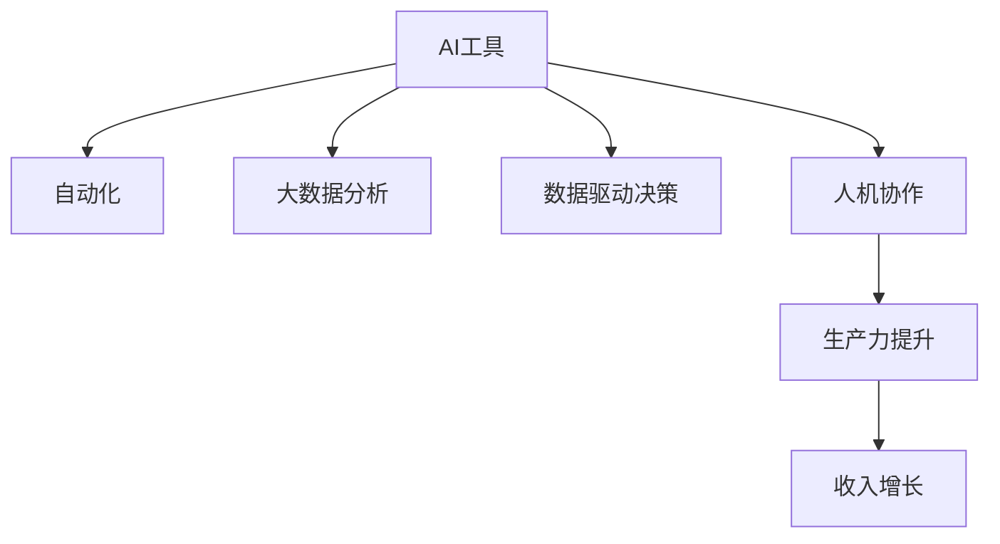

                 

# 利用AI工具提升工作效率与收入

> 关键词：AI工具,生产力提升,收入增长,自动化,数据驱动决策

## 1. 背景介绍

### 1.1 问题由来

随着信息技术的发展，人工智能(AI)已经成为改变工作方式、提升效率的关键技术之一。AI工具能够自动化处理重复性高、劳动强度大的工作，释放人力资源，让员工专注于更有创造性和战略性的任务。此外，AI在数据分析、决策支持等方面也能提供强大的辅助能力，从而提高决策的准确性和效率。

AI工具在各行各业的应用已经初见成效，例如在金融、医疗、制造、零售等行业中，企业通过引入AI工具，显著提升了工作效率，降低了运营成本，从而实现了收入的增长。AI技术已经成为企业竞争力的重要组成部分。

### 1.2 问题核心关键点

AI工具的核心在于其能够利用先进算法和大数据分析，自动化完成各类任务，提高生产效率，进而提升企业的盈利能力。关键点包括：

- AI算法的自动化处理能力。如机器学习、深度学习、自然语言处理等，可以处理大量复杂数据，实现自动化决策。
- 大数据分析的应用。AI工具能够处理和分析海量数据，发现潜在规律和趋势，提供数据驱动的决策支持。
- 人机协作的新模式。AI工具与人类操作者的协作，可以实现更高的工作质量和效率。
- 生产力提升与收入增长。通过提高生产效率，优化运营流程，企业能够降低成本，增加收入，实现利润增长。

## 2. 核心概念与联系

### 2.1 核心概念概述

为更好地理解AI工具如何提升工作效率与收入，本节将介绍几个密切相关的核心概念：

- AI工具：利用AI技术构建的软件工具，能够自动化处理任务，提高生产效率，例如聊天机器人、自动化数据分析、决策支持系统等。
- 自动化：指通过AI算法，自动完成特定任务，减少人工干预。自动化是AI工具的核心能力之一。
- 大数据分析：指利用先进算法处理和分析海量数据，提取有用信息和知识。大数据分析是AI工具的重要应用场景之一。
- 数据驱动决策：指基于数据分析结果，进行决策和行动。AI工具通过大数据分析，提供数据支持的决策建议，帮助企业做出更科学的决策。
- 人机协作：指AI工具与人类操作者之间的互动，通过协同工作，提高工作质量和效率。
- 生产力提升与收入增长：AI工具通过自动化和数据分析，提升生产效率，降低成本，提高利润，从而实现收入的增长。

这些核心概念之间的逻辑关系可以通过以下Mermaid流程图来展示：



这个流程图展示AI工具的核心能力及其与生产力提升、收入增长的关联：

1. AI工具通过自动化实现任务处理。
2. 自动化处理的数据经大数据分析，提取有用信息。
3. 基于数据分析结果，进行数据驱动的决策。
4. 人机协作提高工作质量和效率。
5. 提升的生产力带来收入增长。

## 3. 核心算法原理 & 具体操作步骤
### 3.1 算法原理概述

AI工具通过先进算法和大数据分析，自动化完成各类任务，提高生产效率。其中，机器学习、深度学习等算法是核心。

以机器学习为例，其基本原理是通过算法学习大量数据中的规律，构建模型，然后利用该模型对新数据进行预测或分类。机器学习算法通常分为监督学习、无监督学习和强化学习。监督学习需要标注数据进行训练，无监督学习则利用未标注数据自学习，强化学习则通过试错的方式优化决策策略。

### 3.2 算法步骤详解

AI工具的核心算法步骤如下：

**Step 1: 数据准备**
- 收集和整理相关数据，确保数据质量。
- 进行数据清洗和预处理，去除噪音和异常值。
- 将数据分成训练集、验证集和测试集，用于模型训练、调参和评估。

**Step 2: 模型选择与构建**
- 根据任务类型选择合适的机器学习或深度学习模型，如回归、分类、聚类等。
- 构建模型，调整超参数，如学习率、批大小、迭代轮数等。
- 使用训练集对模型进行训练，最小化损失函数，如均方误差、交叉熵等。

**Step 3: 模型评估与调优**
- 使用验证集评估模型性能，调整模型参数以提高准确率、召回率等指标。
- 使用测试集对模型进行最终评估，确保模型泛化能力。
- 应用正则化、dropout等技术，防止过拟合。

**Step 4: 模型应用与优化**
- 将训练好的模型部署到实际应用中。
- 根据实际应用反馈，优化模型参数和算法策略。
- 引入新数据，持续训练和优化模型，保持模型更新。

**Step 5: 反馈与改进**
- 收集用户反馈，评估AI工具的效果。
- 根据反馈调整AI工具的功能和参数，提高用户满意度。
- 定期评估AI工具对生产力和收入的影响，优化工具设计。

### 3.3 算法优缺点

AI工具具有以下优点：
1. 自动化处理：能够自动化完成繁琐、重复性高的任务，提升工作效率。
2. 数据驱动决策：基于数据分析，提供科学决策支持，减少人工错误。
3. 人机协作：与人类操作者协同工作，提升工作质量和效率。
4. 降低成本：通过自动化和优化流程，降低运营成本。
5. 提高收入：提高生产效率，优化运营流程，增加利润。

同时，AI工具也存在一定的局限性：
1. 数据质量要求高：需要大量高质量的数据进行训练，数据偏差会影响模型效果。
2. 模型复杂度高：复杂模型可能过拟合，需要大量计算资源进行训练。
3. 需要专业人才：开发和维护AI工具需要具备专业技能的人才，成本较高。
4. 难以应对不确定性：AI工具依赖数据和算法，难以应对未知和不确定情况。
5. 安全与隐私问题：AI工具可能泄露用户隐私，需要严格的数据保护措施。

尽管存在这些局限性，AI工具在提升生产力和增加收入方面，已显示出巨大的潜力。未来，随着技术的不断进步和应用的深入，AI工具将成为各行各业的重要生产力工具。

### 3.4 算法应用领域

AI工具在多个领域已得到了广泛应用，例如：

- 金融领域：通过AI工具进行风险评估、信用评分、投资决策等，提高金融服务的效率和准确性。
- 医疗领域：利用AI工具进行疾病诊断、治疗方案推荐、患者管理等，提升医疗服务的质量和效率。
- 制造业：通过AI工具进行生产流程优化、质量控制、设备维护等，提高生产效率和产品质量。
- 零售行业：利用AI工具进行客户分析、商品推荐、库存管理等，提升销售额和客户满意度。
- 物流与运输：通过AI工具进行路径规划、配送调度、物流监控等，提高物流效率和降低成本。

此外，AI工具在人力资源管理、市场营销、能源管理等众多领域中，也展现出了显著的优势。通过引入AI工具，企业能够大幅提升生产力，降低成本，实现收入增长。

## 4. 数学模型和公式 & 详细讲解 & 举例说明
### 4.1 数学模型构建

以回归问题为例，我们利用线性回归模型来构建数学模型。设 $y$ 为输出变量，$x_1, x_2, ..., x_n$ 为输入变量，$\theta_0, \theta_1, ..., \theta_n$ 为模型参数。则线性回归模型的表达式为：

$$ y = \theta_0 + \theta_1 x_1 + \theta_2 x_2 + ... + \theta_n x_n $$

我们将模型参数 $\theta$ 放入训练集 $D=\{(x_i, y_i)\}_{i=1}^N$ 进行训练，目标是找到最优参数 $\hat{\theta}$，使得模型在训练集上的损失函数最小化：

$$ \hat{\theta} = \mathop{\arg\min}_{\theta} \frac{1}{N} \sum_{i=1}^N (y_i - f(x_i))^2 $$

其中 $f(x) = \theta_0 + \theta_1 x_1 + \theta_2 x_2 + ... + \theta_n x_n$。

### 4.2 公式推导过程

根据上述模型，我们可以推导模型的梯度更新公式：

$$ \frac{\partial}{\partial \theta} (\frac{1}{N} \sum_{i=1}^N (y_i - f(x_i))^2) = \frac{2}{N} \sum_{i=1}^N (y_i - f(x_i)) \frac{\partial f(x_i)}{\partial x_i} \frac{\partial x_i}{\partial \theta} $$

将 $f(x)$ 带入上述公式，并利用链式法则，得到梯度公式：

$$ \frac{\partial}{\partial \theta} (\frac{1}{N} \sum_{i=1}^N (y_i - \theta_0 - \theta_1 x_{i,1} - ... - \theta_n x_{i,n})^2) = 2(\frac{1}{N} \sum_{i=1}^N (y_i - \theta_0 - \theta_1 x_{i,1} - ... - \theta_n x_{i,n})) $$

则梯度更新公式为：

$$ \theta \leftarrow \theta - \eta \nabla_{\theta} \mathcal{L}(\theta) $$

其中 $\nabla_{\theta} \mathcal{L}(\theta)$ 为损失函数对参数 $\theta$ 的梯度，$\eta$ 为学习率。

### 4.3 案例分析与讲解

假设我们有一个电商平台的销售数据，目标是预测未来一个月的销售额。我们可以收集过去一年的销售数据，将月销售额 $y$ 作为输出变量，将月销售量 $x_1$、广告支出 $x_2$ 等作为输入变量，构建线性回归模型：

$$ y = \theta_0 + \theta_1 x_1 + \theta_2 x_2 $$

使用历史数据进行训练，求解最优参数 $\hat{\theta}$。然后，我们可以利用求解出的模型对新数据进行预测，帮助电商平台进行库存管理和广告投放决策。

## 5. 项目实践：代码实例和详细解释说明
### 5.1 开发环境搭建

在进行AI工具开发前，我们需要准备好开发环境。以下是使用Python进行TensorFlow开发的环境配置流程：

1. 安装Anaconda：从官网下载并安装Anaconda，用于创建独立的Python环境。

2. 创建并激活虚拟环境：
```bash
conda create -n tf-env python=3.8 
conda activate tf-env
```

3. 安装TensorFlow：根据CUDA版本，从官网获取对应的安装命令。例如：
```bash
pip install tensorflow
```

4. 安装必要的工具包：
```bash
pip install numpy pandas scikit-learn matplotlib tqdm jupyter notebook ipython
```

完成上述步骤后，即可在`tf-env`环境中开始AI工具的开发。

### 5.2 源代码详细实现

下面我们以预测销售额为例，给出使用TensorFlow进行线性回归模型的PyTorch代码实现。

首先，定义数据处理函数：

```python
import numpy as np
from sklearn.model_selection import train_test_split
from sklearn.metrics import mean_squared_error

def load_data():
    # 加载数据集
    # ...
    # 数据预处理
    # ...
    return X, y

# 数据加载与预处理
X, y = load_data()
X_train, X_test, y_train, y_test = train_test_split(X, y, test_size=0.2, random_state=42)
```

然后，定义模型和优化器：

```python
import tensorflow as tf
from tensorflow.keras import Sequential
from tensorflow.keras.layers import Dense

model = Sequential([
    Dense(32, activation='relu', input_shape=(X_train.shape[1],)),
    Dense(1)
])

optimizer = tf.keras.optimizers.Adam()
```

接着，定义训练和评估函数：

```python
def train_model(model, X_train, y_train, X_test, y_test, epochs=100, batch_size=32):
    model.compile(optimizer=optimizer, loss='mse', metrics=['mae', 'mse'])
    
    # 训练模型
    history = model.fit(X_train, y_train, epochs=epochs, batch_size=batch_size, validation_data=(X_test, y_test))
    
    # 评估模型
    loss, mae, mse = model.evaluate(X_test, y_test)
    print(f'Test Loss: {loss:.3f}, Test MAE: {mae:.3f}, Test MSE: {mse:.3f}')
    
    return history

# 训练模型并评估
history = train_model(model, X_train, y_train, X_test, y_test)
```

最后，使用训练好的模型进行预测并输出结果：

```python
# 使用模型进行预测
y_pred = model.predict(X_test)

# 输出预测结果
print(f'Prediction Results: {y_pred}')

# 输出模型训练过程中的各项指标
print(f'Training Results: {history.history}')
```

以上就是使用TensorFlow进行线性回归模型训练和预测的完整代码实现。可以看到，TensorFlow提供了丰富的API和工具，使得模型构建和训练过程变得简洁高效。

### 5.3 代码解读与分析

让我们再详细解读一下关键代码的实现细节：

**数据加载与预处理**：
- `load_data`函数：加载数据集并进行预处理，如数据清洗、归一化等。
- `train_test_split`函数：将数据集分成训练集和测试集，确保模型训练和评估的公正性。

**模型定义与优化器设置**：
- `Sequential`类：定义序列模型，能够方便地添加不同层。
- `Dense`层：定义全连接层，包括激活函数和输出层。
- `Adam`优化器：定义优化器，设置学习率和优化策略。

**训练与评估**：
- `compile`方法：设置模型的损失函数、优化器、评估指标等。
- `fit`方法：在训练集上训练模型，并使用验证集评估模型性能。
- `evaluate`方法：在测试集上评估模型的预测性能。
- `predict`方法：使用模型对新数据进行预测。

通过上述代码实现，我们可以快速搭建并训练一个简单的线性回归模型，用于预测未来销售额。这为我们实际应用AI工具提供了重要参考。

## 6. 实际应用场景
### 6.1 智能客服系统

智能客服系统利用AI工具实现自动化客服，通过自然语言处理(NLP)技术，自动解答客户咨询，提升服务效率和客户满意度。例如，通过预训练语言模型对客户咨询进行文本分析，识别出客户意图和问题类型，然后使用预训练模型对常见问题进行匹配回答。对于不常见问题，可以通过主动学习机制，逐步提升系统的回复能力。

智能客服系统的实际应用包括：
- 自动解答客户咨询。
- 记录客户反馈，提升客服质量。
- 集成多渠道客服，统一处理客户需求。

通过智能客服系统，企业能够显著降低人力成本，提高客户服务水平，从而提升客户满意度和忠诚度，增加销售额。

### 6.2 金融风控系统

金融风控系统利用AI工具进行信用评估、风险控制等，提升金融服务的质量和效率。例如，通过机器学习模型分析客户的交易行为、信用历史等数据，构建风险评估模型，进行贷款审批、信用评分等工作。AI工具可以实时监控客户的交易行为，预警潜在的风险事件。

金融风控系统的实际应用包括：
- 客户信用评分。
- 贷款审批决策。
- 交易行为监控。

通过金融风控系统，金融机构能够降低贷款违约风险，提高金融服务的可靠性和安全性，从而吸引更多客户，增加收益。

### 6.3 人力资源管理

人力资源管理系统利用AI工具进行员工招聘、绩效评估、培训推荐等，提升人力资源管理的效率和质量。例如，通过自然语言处理技术分析员工的绩效评估报告，提取关键指标，进行综合分析。通过机器学习模型分析员工的历史培训数据，推荐适合的培训课程，提升员工技能。

人力资源管理系统的实际应用包括：
- 员工绩效评估。
- 员工培训推荐。
- 招聘信息筛选。

通过人力资源管理系统，企业能够优化人力资源配置，提升员工素质，降低人力成本，从而提高企业的运营效率和市场竞争力。

### 6.4 未来应用展望

未来，随着AI工具的不断进步和应用场景的拓展，其在提升工作效率与收入方面的潜力将进一步释放。

1. **AI驱动的自动化生产**：在制造业、物流等领域，AI工具可以优化生产流程、提高设备利用率，降低生产成本。例如，利用机器视觉技术进行质量检测，利用机器人进行自动化装配等。

2. **智能营销系统**：在零售、广告等领域，AI工具可以分析消费者行为数据，进行个性化营销，提升转化率和客户满意度。例如，通过推荐系统推荐商品，通过情感分析评估客户满意度等。

3. **智能医疗系统**：在医疗领域，AI工具可以辅助医生进行疾病诊断、治疗方案推荐等，提高医疗服务的质量和效率。例如，通过深度学习模型分析医学影像，辅助医生进行疾病检测；通过自然语言处理技术分析医学文献，发现潜在的治疗方法等。

4. **智能交通系统**：在交通领域，AI工具可以优化交通流量、降低事故率，提高交通安全。例如，通过机器学习模型预测交通拥堵情况，进行交通流量调控；通过自动驾驶技术提升交通效率等。

5. **智能供应链管理**：在供应链管理领域，AI工具可以优化库存管理、物流调度等，降低运营成本，提高供应链效率。例如，通过预测模型分析市场需求，优化库存策略；通过路径规划算法优化物流路线等。

## 7. 工具和资源推荐
### 7.1 学习资源推荐

为了帮助开发者系统掌握AI工具的理论基础和实践技巧，这里推荐一些优质的学习资源：

1. 《Python深度学习》系列书籍：由Google深度学习团队撰写，系统介绍了深度学习的基本概念、算法和实践技巧，是入门深度学习的经典教材。

2. 《TensorFlow实战》系列书籍：由TensorFlow官方团队撰写，详细介绍了TensorFlow的使用方法和技巧，包括模型构建、训练和部署等。

3. 《自然语言处理综论》系列书籍：由斯坦福大学NLP研究组撰写，系统介绍了自然语言处理的理论基础和实践方法，是NLP领域的重要参考。

4. 《机器学习实战》系列书籍：由Peter Harrington撰写，通过大量实际案例，介绍了机器学习算法的应用和实现。

5. 《Deep Learning with Python》系列书籍：由Francois Chollet撰写，详细介绍了深度学习模型的构建和训练，包括TensorFlow和Keras的使用。

6. Coursera、Udacity等在线课程平台：提供丰富的AI课程，涵盖深度学习、自然语言处理、计算机视觉等多个领域，适合不同层次的学习者。

通过对这些资源的学习实践，相信你一定能够快速掌握AI工具的理论基础和实践技巧，并用于解决实际的AI应用问题。

### 7.2 开发工具推荐

高效的开发离不开优秀的工具支持。以下是几款用于AI工具开发的常用工具：

1. Python：作为AI开发的主要语言，Python提供了丰富的科学计算和数据处理库，如NumPy、Pandas、SciPy等，方便进行数据处理和模型训练。

2. TensorFlow：由Google主导开发的开源深度学习框架，生产部署方便，适合大规模工程应用。TensorFlow提供了丰富的API和工具，支持模型构建、训练和部署。

3. PyTorch：由Facebook主导开发的开源深度学习框架，灵活动态的计算图，适合快速迭代研究。PyTorch提供了丰富的API和工具，支持模型构建、训练和部署。

4. Jupyter Notebook：提供交互式的编程环境，支持Python、R、Julia等多种语言，适合数据科学和机器学习研究。

5. Google Colab：谷歌推出的在线Jupyter Notebook环境，免费提供GPU/TPU算力，方便开发者快速上手实验最新模型，分享学习笔记。

合理利用这些工具，可以显著提升AI工具的开发效率，加快创新迭代的步伐。

### 7.3 相关论文推荐

AI工具的发展源于学界的持续研究。以下是几篇奠基性的相关论文，推荐阅读：

1. "Deep Learning" by Ian Goodfellow：介绍深度学习的基本概念、算法和实践技巧，是深度学习领域的经典教材。

2. "Neural Computation" by Geoffrey Hinton, Yoshua Bengio, and David Rumelhart：介绍神经网络的基本原理和算法，是神经网络领域的经典教材。

3. "Natural Language Processing" by Christopher D. Manning and Hinrich Schütze：介绍自然语言处理的基本概念、算法和应用，是NLP领域的重要参考。

4. "Pattern Recognition and Machine Learning" by Christopher Bishop：介绍机器学习的基本概念、算法和应用，是机器学习领域的经典教材。

5. "Reinforcement Learning: An Introduction" by Richard S. Sutton and Andrew G. Barto：介绍强化学习的基本概念、算法和应用，是强化学习领域的经典教材。

这些论文代表了大语言模型微调技术的发展脉络。通过学习这些前沿成果，可以帮助研究者把握学科前进方向，激发更多的创新灵感。

## 8. 总结：未来发展趋势与挑战

### 8.1 总结

本文对AI工具如何提升工作效率与收入进行了全面系统的介绍。首先阐述了AI工具在各行各业中的广泛应用，明确了AI工具在提高生产效率、降低成本、增加收入方面的独特价值。其次，从原理到实践，详细讲解了AI工具的数学模型构建和关键算法步骤，给出了AI工具开发的完整代码实例。同时，本文还广泛探讨了AI工具在智能客服、金融风控、人力资源管理等多个行业领域的应用前景，展示了AI工具的巨大潜力。

通过本文的系统梳理，可以看到，AI工具通过自动化处理和数据分析，能够显著提高工作效率，降低成本，增加收入，成为各行各业的重要生产力工具。未来，随着AI技术的不断进步和应用的深入，AI工具必将在更多领域带来变革性影响。

### 8.2 未来发展趋势

展望未来，AI工具的发展将呈现以下几个趋势：

1. **多模态融合**：AI工具将融合视觉、听觉、语言等多种模态信息，提升对复杂场景的理解能力。例如，通过多模态深度学习模型，将视觉图像、语音和文本信息结合起来，实现智能监控、智能客服等功能。

2. **自监督学习**：AI工具将更多地利用自监督学习，摆脱对标注数据的依赖，提升模型的泛化能力。例如，通过无监督学习的预训练和微调，提升模型的语言理解和生成能力。

3. **分布式训练**：随着数据规模的不断增大，AI工具将需要更强大的计算资源。分布式训练技术将使得AI工具能够在更大规模的数据集上进行训练，提高模型的泛化能力。

4. **联邦学习**：联邦学习技术使得AI工具能够在保护数据隐私的前提下，进行分布式训练和模型优化。例如，通过联邦学习技术，将用户数据保存在本地，只上传模型参数进行训练，提升模型的通用性。

5. **AI辅助开发**：AI工具将更多地应用于软件开发领域，辅助代码生成、缺陷检测、性能优化等任务，提升软件开发效率和质量。例如，通过AI工具进行代码自动生成和智能优化，提升软件开发速度和代码质量。

6. **跨领域应用**：AI工具将更多地应用于交叉领域，提升跨领域任务的处理能力。例如，通过跨领域知识图谱和AI工具的结合，提升医疗、金融、物流等多个领域的应用效果。

以上趋势凸显了AI工具的广阔前景。这些方向的探索发展，必将进一步提升AI工具的性能和应用范围，为各行各业带来更高效、更智能的解决方案。

### 8.3 面临的挑战

尽管AI工具已经取得了显著的进展，但在迈向更加智能化、普适化应用的过程中，仍面临诸多挑战：

1. **数据隐私和安全**：AI工具需要大量数据进行训练，但数据的隐私和安全问题也随之而来。如何保护用户数据，防止数据泄露，是一个重要问题。

2. **模型解释性和透明性**：AI工具的决策过程往往难以解释，对于金融、医疗等高风险领域，模型的透明性和可解释性尤为重要。

3. **数据质量和标注成本**：高质量的数据和标注数据是AI工具训练的基石，但获取高质量数据和标注数据的成本较高，特别是在小众领域，难以获得充足标注数据。

4. **模型泛化能力**：AI工具需要在不同场景下进行微调，如何提高模型的泛化能力，避免过拟合，是一个重要问题。

5. **跨领域应用难度**：AI工具在不同领域的应用需要具备一定的专业知识，如何结合领域知识进行模型设计和优化，是一个重要问题。

6. **伦理和社会责任**：AI工具的应用需要考虑到伦理和社会责任，如何避免偏见、歧视等问题，确保AI工具的公平性和安全性，是一个重要问题。

正视这些挑战，积极应对并寻求突破，将是大语言模型微调走向成熟的必由之路。相信随着学界和产业界的共同努力，这些挑战终将一一被克服，AI工具必将在构建智能社会中扮演越来越重要的角色。

### 8.4 研究展望

面对AI工具所面临的种种挑战，未来的研究需要在以下几个方面寻求新的突破：

1. **隐私保护技术**：引入隐私保护技术，如差分隐私、联邦学习等，保护用户数据的隐私和安全。

2. **模型透明性和解释性**：开发可解释性强的AI工具，利用因果推断、知识图谱等技术，提升模型的透明性和可解释性。

3. **数据增强技术**：利用数据增强技术，提高数据质量和标注数据的丰富性，缓解数据质量和标注成本的问题。

4. **模型泛化技术**：引入跨领域迁移学习和自监督学习技术，提高模型的泛化能力和适应性。

5. **领域知识结合**：将领域知识与AI工具相结合，提升模型在特定领域的应用效果。

6. **伦理和社会责任**：引入伦理和社会责任的评估指标，确保AI工具的公平性、透明性和安全性。

这些研究方向的探索，必将引领AI工具技术迈向更高的台阶，为构建智能社会和智能服务提供更可靠、更高效的解决方案。面向未来，AI工具还需要与其他人工智能技术进行更深入的融合，如知识表示、因果推理、强化学习等，多路径协同发力，共同推动智能交互系统的进步。只有勇于创新、敢于突破，才能不断拓展AI工具的边界，让智能技术更好地造福人类社会。

## 9. 附录：常见问题与解答

**Q1：AI工具是否适用于所有应用场景？**

A: AI工具在提升生产效率和增加收入方面具有显著优势，但并不适用于所有应用场景。例如，对于一些需要高精度的任务，如外科手术、桥梁设计等，AI工具可能无法替代人类专家的判断。此外，对于需要高度创意和情感交流的任务，如艺术创作、心理咨询等，AI工具也存在局限性。因此，需要根据具体应用场景，结合人类专家的经验，进行AI工具的合理应用。

**Q2：AI工具是否需要大量数据进行训练？**

A: 是的，AI工具需要大量高质量的数据进行训练，数据质量和数量直接影响模型效果。对于数据量较小的应用场景，可以使用数据增强、迁移学习等技术，缓解数据不足的问题。但在一些特定领域，如金融、医疗等，数据获取难度较大，如何高效利用已有数据进行模型训练，是一个重要问题。

**Q3：AI工具是否需要高成本的硬件设备？**

A: 是的，AI工具需要高性能的计算资源进行模型训练和推理，例如GPU、TPU等。对于一些小型企业或个人开发者，硬件成本较高，难以承担。因此，引入云计算平台或分布式训练技术，降低硬件成本，是一个重要方向。例如，通过AWS、Google Cloud等云平台进行模型训练和部署，可以显著降低硬件成本。

**Q4：AI工具是否需要高水平的技术人才？**

A: 是的，开发和维护AI工具需要具备高水平的技术人才，包括数据科学家、算法工程师等。对于小型企业或个人开发者，技术人才的获取和培训成本较高，难以满足AI工具开发的需求。因此，引入开源社区和在线学习平台，培养技术人才，是一个重要方向。例如，通过Kaggle等开源社区，获取数据和代码资源，通过Coursera等在线平台进行技术培训，提升开发者技能。

**Q5：AI工具是否需要持续更新和优化？**

A: 是的，AI工具需要持续更新和优化，以适应数据分布的变化和业务需求的变化。例如，通过在线学习平台获取最新数据和算法，进行模型微调和优化，提升AI工具的性能和适应性。但持续更新和优化需要投入大量时间和资源，如何平衡成本和效果，是一个重要问题。

通过这些常见问题的解答，可以看到，AI工具在提升工作效率与收入方面具有显著优势，但也需要结合具体应用场景和业务需求，进行合理应用和优化。相信随着AI技术的不断进步和应用的深入，AI工具必将在更多领域带来变革性影响，推动各行各业实现数字化转型和智能化升级。

