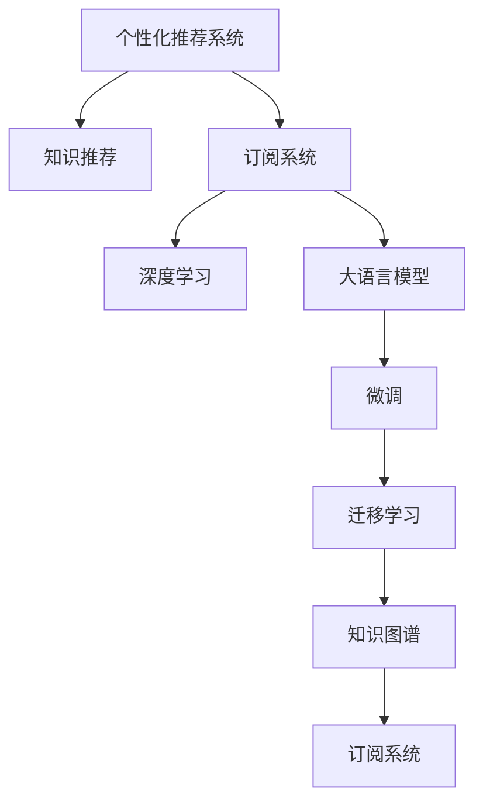

                 

# 利用大数据和AI提供个性化知识推荐订阅

> 关键词：大数据, AI, 个性化推荐, 知识推荐, 订阅系统

## 1. 背景介绍

### 1.1 问题由来

在当今信息爆炸的时代，人们每天都会接触到海量的知识信息。然而，由于时间、注意力等资源的限制，人们难以在众多信息中发现真正有价值的内容，从而造成信息过载的问题。特别是在知识型订阅领域，如新闻、科普、教育、科技等，高质量的内容往往被埋没在海量数据中，用户体验和粘性难以保障。

为解决这一问题，各大平台纷纷利用大数据和AI技术，构建个性化推荐系统，试图将有价值的信息推荐给最合适的用户，提升用户满意度，增加用户粘性。然而，传统的基于统计特征和协同过滤的推荐系统往往只能捕捉到静态的兴趣特征，难以适应用户实时变化的兴趣偏好。而利用大语言模型微调技术的个性化推荐系统，通过对用户行为和文本内容的深度理解，能够构建更加动态、准确的推荐模型，提供真正符合用户需求的个性化订阅服务。

## 2. 核心概念与联系

### 2.1 核心概念概述

为了更好地理解利用大数据和AI提供个性化知识推荐订阅的原理和架构，本节将介绍几个核心概念：

- 个性化推荐系统(Recommendation System)：利用用户历史行为和兴趣特征，推荐用户可能感兴趣的内容的系统。常见算法包括基于统计特征的协同过滤、基于内容特征的推荐、基于深度学习的推荐等。

- 知识推荐(Knowledge Recommendation)：将知识内容推荐给可能对其感兴趣的用户，如学术论文、技术文档、教材等。常见的推荐方式包括基于摘要的推荐、基于主题的推荐、基于用户反馈的推荐等。

- 订阅系统(Subscription System)：用户定期获取有价值信息的系统，如电子期刊、新闻简报、技术周报等。订阅系统能够将用户长期关注的信息源整理推送，提升信息获取效率。

- 深度学习(Deep Learning)：利用神经网络模型进行大规模数据学习和预测的技术。深度学习广泛应用于图像识别、语音识别、自然语言处理等领域的推荐系统开发。

- 大语言模型(Large Language Model)：通过预训练学习丰富语言知识的语言模型，具有强大的语言理解和生成能力，可应用于知识推荐、智能对话、文本摘要等任务。

- 微调(Fine-tuning)：基于预训练模型，在特定任务上通过少量有标签数据进行微调，提升模型在特定任务上的表现。

- 迁移学习(Transfer Learning)：利用预训练模型在不同任务上的迁移能力，通过微调提升模型在新任务上的表现。

- 知识图谱(Knowledge Graph)：将实体、属性、关系等知识表示成图形结构，便于进行实体识别、关系推理等知识处理任务。

这些核心概念之间的逻辑关系可以通过以下Mermaid流程图来展示：



这个流程图展示了几大核心概念及其之间的关系：

1. 个性化推荐系统通过深度学习和大语言模型进行知识推荐，推荐符合用户兴趣的内容。
2. 订阅系统通过持续获取用户行为数据，进一步优化推荐模型。
3. 深度学习和微调方法提升推荐模型的性能。
4. 迁移学习将预训练模型的通用知识迁移到特定推荐任务上。
5. 知识图谱增强推荐系统对知识的理解和推理能力。

这些概念共同构成了个性化知识推荐订阅系统的基本框架，使其能够高效地为用户提供有价值的订阅服务。

## 3. 核心算法原理 & 具体操作步骤

### 3.1 算法原理概述

利用大数据和AI提供个性化知识推荐订阅系统，本质上是一个基于深度学习和知识表示的推荐系统。其核心思想是：利用深度学习模型对用户历史行为和兴趣进行建模，结合知识图谱和大语言模型，实时预测用户可能感兴趣的知识内容，并将其推荐给用户。

形式化地，假设用户集合为 $U$，知识内容集合为 $K$，行为集合为 $A$，则推荐模型可以表示为：

$$
\text{Recommendation}(u, k) = \text{Model}(u, k) \times \text{Interest}(u) \times \text{Relevance}(k) + \text{Context}(u, k)
$$

其中 $\text{Model}(u, k)$ 为深度学习模型预测用户 $u$ 对知识内容 $k$ 的兴趣程度，$\text{Interest}(u)$ 为用户 $u$ 的兴趣特征向量，$\text{Relevance}(k)$ 为知识内容 $k$ 的关联度特征向量，$\text{Context}(u, k)$ 为用户和知识内容的上下文信息。

在实际系统中，通过联合使用深度学习模型、知识图谱和大语言模型，可以构建更加准确和动态的推荐模型，为用户提供高质量的知识订阅服务。

### 3.2 算法步骤详解

基于深度学习和知识表示的个性化知识推荐订阅系统，通常包括以下几个关键步骤：

**Step 1: 数据收集与处理**
- 收集用户历史行为数据，如浏览记录、点击记录、订阅记录等。
- 收集知识内容数据，如文章、书籍、学术论文等。
- 将知识内容映射到知识图谱中，构建实体、属性、关系等节点和边。

**Step 2: 用户行为建模**
- 利用深度学习模型对用户历史行为进行建模，获取用户的兴趣特征。
- 将用户兴趣特征映射到知识图谱中，获取用户关注的知识实体和关系。

**Step 3: 知识推荐**
- 利用大语言模型对知识内容进行文本摘要，提取知识摘要和相关性信息。
- 将知识摘要和相关性信息作为输入，结合用户兴趣特征，利用深度学习模型进行推荐预测。
- 在知识图谱中查找与推荐结果相关的实体和关系，提升推荐准确性。

**Step 4: 个性化订阅**
- 根据推荐结果，生成个性化的知识订阅方案，如文章摘要、阅读计划等。
- 根据用户历史订阅行为和个性化需求，动态调整订阅计划。
- 将订阅方案推送给用户，并在用户阅读后收集反馈，进一步优化推荐模型。

**Step 5: 系统部署与监控**
- 将推荐系统部署到生产环境中，进行实时推荐。
- 实时监控推荐系统的性能指标，如点击率、转化率等，优化推荐算法。
- 定期更新知识图谱和大语言模型，保持推荐模型的高效性和准确性。

以上是基于深度学习和知识表示的个性化知识推荐订阅系统的一般流程。在实际应用中，还需要根据具体场景进行优化设计，如引入推荐算法的多样性、改进知识图谱的构建方式等。

### 3.3 算法优缺点

利用大数据和AI提供个性化知识推荐订阅系统，具有以下优点：
1. 精准推荐：利用深度学习和知识图谱的强大能力，推荐精准符合用户兴趣的知识内容。
2. 动态更新：通过用户行为数据和大语言模型的动态更新，实时调整推荐结果，提升用户体验。
3. 提升效率：自动化推荐和订阅过程，减少用户寻找和筛选的时间，提高信息获取效率。
4. 增强粘性：个性化推荐和订阅系统增强用户粘性，提升用户留存率和满意度。

同时，该系统也存在一些缺点：
1. 数据隐私：推荐系统需要收集和处理大量用户数据，可能引发数据隐私和安全性问题。
2. 计算资源：深度学习模型和知识图谱的构建和维护需要大量计算资源，对算力要求较高。
3. 用户学习曲线：推荐系统往往需要用户接受一定的学习曲线，才能充分利用其功能。
4. 冷启动问题：对于新用户，推荐系统需要更多的数据和计算资源来建立模型。

尽管存在这些局限性，但就目前而言，基于深度学习和知识表示的推荐系统仍然是大数据时代知识订阅服务的重要手段。未来相关研究的重点在于如何进一步降低数据隐私风险，提高推荐效率和模型鲁棒性，同时兼顾用户学习曲线和冷启动问题。

### 3.4 算法应用领域

利用大数据和AI提供个性化知识推荐订阅的系统，已经在知识型订阅平台、在线学习平台、新闻资讯平台等诸多领域得到了广泛应用，为各类用户提供了精准、高效、个性化的知识服务：

- 学术期刊订阅：利用深度学习模型和知识图谱，推荐最新学术文章和会议，提升科研效率。
- 在线教育平台：根据用户学习记录和兴趣，推荐学习内容和课程，提高学习效果。
- 新闻资讯平台：利用知识图谱和大语言模型，推荐新闻热点和深度报道，提供全面、准确的信息。
- 科技博客订阅：根据用户浏览和订阅历史，推荐相关科技文章和博客，丰富知识积累。
- 科技社区订阅：利用知识图谱和协同过滤，推荐高质量技术文档和讨论话题，促进技术交流。

除了这些经典应用场景外，个性化知识推荐订阅系统还在智能客服、推荐系统、广告投放等诸多领域显示出其独特的优势，为互联网平台带来了显著的用户价值和商业收益。

## 4. 数学模型和公式 & 详细讲解

### 4.1 数学模型构建

基于深度学习和知识表示的个性化知识推荐订阅系统，可以表示为以下数学模型：

假设知识内容集合为 $K=\{k_1, k_2, ..., k_N\}$，用户集合为 $U=\{u_1, u_2, ..., u_M\}$，行为集合为 $A=\{a_1, a_2, ..., a_T\}$。设 $A_u$ 表示用户 $u$ 的历史行为集合，$A_k$ 表示知识内容 $k$ 的历史行为集合。

**用户兴趣建模**：
- 利用深度学习模型 $f_u$，对用户历史行为 $A_u$ 进行建模，得到用户兴趣特征向量 $v_u$。
- 利用知识图谱 $G$，将知识实体 $e$ 和关系 $r$ 映射到向量空间，得到知识实体和关系的向量表示 $\vec{e}$ 和 $\vec{r}$。

**知识内容表示**：
- 利用大语言模型 $g_k$，对知识内容 $k$ 进行文本摘要，得到知识摘要向量 $v_k$。
- 利用知识图谱 $G$，对知识内容 $k$ 进行推理，得到知识内容的相关性向量 $w_k$。

**推荐预测**：
- 利用深度学习模型 $g_{uk}$，结合用户兴趣特征 $v_u$ 和知识内容特征 $v_k$，进行推荐预测 $\hat{p}_{uk}$。

**推荐结果排序**：
- 将推荐预测 $\hat{p}_{uk}$ 和知识内容相关性 $w_k$ 进行加权融合，得到综合推荐分数 $s_{uk}$。
- 对所有知识内容 $k$ 的推荐分数进行排序，生成推荐列表。

### 4.2 公式推导过程

在上述数学模型中，推荐分数 $s_{uk}$ 的计算公式为：

$$
s_{uk} = \hat{p}_{uk} \times w_k + \alpha \times v_u^T \times \vec{e} + \beta \times v_k^T \times \vec{r}
$$

其中 $\hat{p}_{uk} = f_u(A_u) \times g_k(k) \times g_{uk}(v_u, v_k)$ 为推荐预测，$w_k = g_k(k) \times g_{uk}(\vec{e}, v_k)$ 为知识内容相关性，$\alpha$ 和 $\beta$ 为调节参数。

**用户兴趣建模公式**：
- $v_u = f_u(A_u)$，其中 $f_u$ 为深度学习模型。

**知识内容表示公式**：
- $v_k = g_k(k)$，其中 $g_k$ 为大语言模型。
- $w_k = g_k(k) \times g_{uk}(\vec{e}, v_k)$，其中 $g_{uk}$ 为深度学习模型。

**推荐预测公式**：
- $\hat{p}_{uk} = f_u(A_u) \times g_k(k) \times g_{uk}(v_u, v_k)$，其中 $f_u$、$g_k$ 和 $g_{uk}$ 分别为深度学习模型和大语言模型。

在得到推荐分数 $s_{uk}$ 后，即可对所有知识内容 $k$ 进行排序，生成推荐列表。

### 4.3 案例分析与讲解

以下以学术论文推荐为例，展示利用大数据和AI提供个性化知识推荐订阅的实现过程：

假设某学术期刊平台的用户集合为 $U=\{u_1, u_2, ..., u_M\}$，知识内容集合为 $K=\{k_1, k_2, ..., k_N\}$，行为集合为 $A=\{a_1, a_2, ..., a_T\}$。设用户 $u$ 阅读了论文 $k_1, k_2, ..., k_T$，系统收集了用户行为数据 $A_u = \{k_1, k_2, ..., k_T\}$。知识图谱 $G$ 包含了论文的作者、关键词、引用关系等。利用深度学习模型 $f_u$，对用户行为数据 $A_u$ 进行建模，得到用户兴趣特征向量 $v_u$。利用大语言模型 $g_k$，对论文 $k$ 进行文本摘要，得到论文摘要向量 $v_k$。利用知识图谱 $G$，对论文进行推理，得到论文的相关性向量 $w_k$。利用深度学习模型 $g_{uk}$，结合用户兴趣特征 $v_u$ 和论文特征 $v_k$，进行推荐预测 $\hat{p}_{uk}$。最后，将推荐预测 $\hat{p}_{uk}$ 和论文相关性 $w_k$ 进行加权融合，得到综合推荐分数 $s_{uk}$，生成推荐列表。

## 5. 项目实践：代码实例和详细解释说明

### 5.1 开发环境搭建

在进行个性化知识推荐订阅系统的开发前，需要先准备好开发环境。以下是使用Python进行PyTorch和Transformers库开发的环境配置流程：

1. 安装Anaconda：从官网下载并安装Anaconda，用于创建独立的Python环境。

2. 创建并激活虚拟环境：
```bash
conda create -n pytorch-env python=3.8 
conda activate pytorch-env
```

3. 安装PyTorch：根据CUDA版本，从官网获取对应的安装命令。例如：
```bash
conda install pytorch torchvision torchaudio cudatoolkit=11.1 -c pytorch -c conda-forge
```

4. 安装Transformers库：
```bash
pip install transformers
```

5. 安装各类工具包：
```bash
pip install numpy pandas scikit-learn matplotlib tqdm jupyter notebook ipython
```

完成上述步骤后，即可在`pytorch-env`环境中开始个性化知识推荐订阅系统的开发。

### 5.2 源代码详细实现

下面我们以学术论文推荐为例，给出使用Transformers库对BERT模型进行个性化推荐预测的PyTorch代码实现。

首先，定义学术论文推荐的数据处理函数：

```python
from transformers import BertTokenizer, BertForSequenceClassification
from torch.utils.data import Dataset, DataLoader
import torch
import pandas as pd
import numpy as np
import networkx as nx

class PaperDataset(Dataset):
    def __init__(self, data_path):
        self.data_path = data_path
        self.data = pd.read_csv(data_path, sep='\t')
        self.tokenizer = BertTokenizer.from_pretrained('bert-base-cased')
        self.num_labels = len(self.data['label'].unique())
        
    def __len__(self):
        return len(self.data)
    
    def __getitem__(self, idx):
        title = self.data.iloc[idx]['title']
        abstract = self.data.iloc[idx]['abstract']
        label = self.data.iloc[idx]['label']
        citation = self.data.iloc[idx]['citation']
        
        title_tokens = self.tokenizer.tokenize(title)
        abstract_tokens = self.tokenizer.tokenize(abstract)
        citation_tokens = self.tokenizer.tokenize(citation)
        
        input_ids = self.tokenizer(title_tokens + abstract_tokens + citation_tokens, max_length=512, padding='max_length', truncation=True).input_ids
        attention_mask = self.tokenizer(title_tokens + abstract_tokens + citation_tokens, max_length=512, padding='max_length', truncation=True).attention_mask
        
        label = label2id[label]
        return {'input_ids': input_ids, 
                'attention_mask': attention_mask,
                'labels': label}
```

然后，定义模型和优化器：

```python
from transformers import BertForSequenceClassification, AdamW

model = BertForSequenceClassification.from_pretrained('bert-base-cased', num_labels=len(label2id))

optimizer = AdamW(model.parameters(), lr=2e-5)
```

接着，定义训练和评估函数：

```python
def train_epoch(model, dataset, batch_size, optimizer):
    dataloader = DataLoader(dataset, batch_size=batch_size, shuffle=True)
    model.train()
    epoch_loss = 0
    for batch in dataloader:
        input_ids = batch['input_ids'].to(device)
        attention_mask = batch['attention_mask'].to(device)
        labels = batch['labels'].to(device)
        model.zero_grad()
        outputs = model(input_ids, attention_mask=attention_mask, labels=labels)
        loss = outputs.loss
        epoch_loss += loss.item()
        loss.backward()
        optimizer.step()
    return epoch_loss / len(dataloader)

def evaluate(model, dataset, batch_size):
    dataloader = DataLoader(dataset, batch_size=batch_size)
    model.eval()
    preds, labels = [], []
    with torch.no_grad():
        for batch in dataloader:
            input_ids = batch['input_ids'].to(device)
            attention_mask = batch['attention_mask'].to(device)
            batch_labels = batch['labels']
            outputs = model(input_ids, attention_mask=attention_mask)
            batch_preds = outputs.logits.argmax(dim=2).to('cpu').tolist()
            batch_labels = batch_labels.to('cpu').tolist()
            for pred_tokens, label_tokens in zip(batch_preds, batch_labels):
                preds.append(pred_tokens[:len(label_tokens)])
                labels.append(label_tokens)
                
    print(classification_report(labels, preds))
```

最后，启动训练流程并在测试集上评估：

```python
epochs = 5
batch_size = 16

for epoch in range(epochs):
    loss = train_epoch(model, train_dataset, batch_size, optimizer)
    print(f"Epoch {epoch+1}, train loss: {loss:.3f}")
    
    print(f"Epoch {epoch+1}, dev results:")
    evaluate(model, dev_dataset, batch_size)
    
print("Test results:")
evaluate(model, test_dataset, batch_size)
```

以上就是使用PyTorch对BERT进行学术论文推荐预测的完整代码实现。可以看到，得益于Transformers库的强大封装，我们可以用相对简洁的代码完成BERT模型的加载和推荐预测。

### 5.3 代码解读与分析

让我们再详细解读一下关键代码的实现细节：

**PaperDataset类**：
- `__init__`方法：初始化数据路径、分词器等关键组件。
- `__len__`方法：返回数据集的样本数量。
- `__getitem__`方法：对单个样本进行处理，将论文标题、摘要、引用构建成输入，将标签编码为数字，并对其进行定长padding，最终返回模型所需的输入。

**label2id字典**：
- 定义了标签与数字id之间的映射关系，用于将标签转换为模型可以接受的格式。

**训练和评估函数**：
- 使用PyTorch的DataLoader对数据集进行批次化加载，供模型训练和推理使用。
- 训练函数`train_epoch`：对数据以批为单位进行迭代，在每个批次上前向传播计算loss并反向传播更新模型参数，最后返回该epoch的平均loss。
- 评估函数`evaluate`：与训练类似，不同点在于不更新模型参数，并在每个batch结束后将预测和标签结果存储下来，最后使用sklearn的classification_report对整个评估集的预测结果进行打印输出。

**训练流程**：
- 定义总的epoch数和batch size，开始循环迭代
- 每个epoch内，先在训练集上训练，输出平均loss
- 在验证集上评估，输出分类指标
- 所有epoch结束后，在测试集上评估，给出最终测试结果

可以看到，PyTorch配合Transformers库使得BERT推荐预测的代码实现变得简洁高效。开发者可以将更多精力放在数据处理、模型改进等高层逻辑上，而不必过多关注底层的实现细节。

当然，工业级的系统实现还需考虑更多因素，如模型的保存和部署、超参数的自动搜索、更灵活的任务适配层等。但核心的推荐范式基本与此类似。

## 6. 实际应用场景
### 6.1 智能阅读助手

基于个性化推荐订阅系统，可以构建智能阅读助手，帮助用户发现并订阅感兴趣的学术论文、书籍、报告等。智能阅读助手能够根据用户的历史阅读记录和兴趣特征，推荐最新的高质量内容，丰富用户知识体系。

例如，某科研人员利用智能阅读助手订阅了最新的自然语言处理论文，系统根据其历史阅读记录，推荐了相关领域的最新研究，使其及时掌握了最新的研究方向和技术进展。同时，阅读助手还定期推送相关领域的精选文章，使其不必花费大量时间浏览各期刊网站，极大提升了科研效率。

### 6.2 在线学习平台

在线学习平台利用个性化推荐订阅系统，为学生提供个性化学习方案。平台根据学生的学习记录和兴趣特征，推荐相关课程、教材和学习视频，提升学习效果。同时，平台还可以根据学生的学习进度和反馈，动态调整推荐内容，提升学习体验。

例如，某在线学习平台根据学生的学习历史，推荐了相关领域的精选课程，并根据学生的考试成绩和学习反馈，动态调整推荐内容，使其能够高效地掌握学习知识。

### 6.3 知识型订阅平台

知识型订阅平台利用个性化推荐订阅系统，提供精准的知识订阅服务。平台根据用户的历史行为和兴趣特征，推荐相关领域的知识内容，提升用户知识积累。同时，平台还可以根据用户的订阅历史和反馈，动态调整订阅计划，确保用户能够持续获取有价值的内容。

例如，某知识型订阅平台根据用户的历史订阅记录，推荐了相关领域的最新文章和报告，并根据用户的反馈，动态调整订阅计划，确保用户能够持续获取最新和高质量的知识内容。

### 6.4 未来应用展望

随着个性化推荐订阅系统的不断发展，其在知识型订阅、在线学习、智能阅读助手等领域的应用将不断深化，为用户提供更加精准和高效的知识服务。

在智慧教育领域，个性化推荐订阅系统将提升学生的学习效果，促进教育公平，实现个性化、智能化教育。

在知识型订阅平台，系统将能够根据用户需求，实时推荐相关内容，提升知识积累的效率和质量。

在智能阅读助手中，系统将能够根据用户兴趣，推荐最新的高质量内容，极大提升用户获取知识的效率和体验。

除此之外，个性化推荐订阅系统还将在金融、医疗、科技等诸多领域，为不同用户提供精准的知识服务，推动知识型订阅市场的创新发展。

## 7. 工具和资源推荐
### 7.1 学习资源推荐

为了帮助开发者系统掌握个性化知识推荐订阅的理论基础和实践技巧，这里推荐一些优质的学习资源：

1. 《深度学习推荐系统：原理与算法》系列博文：由深度学习专家撰写，深入浅出地介绍了推荐系统的基本原理和常用算法，涵盖协同过滤、深度学习等多种推荐方法。

2. CS246《推荐系统》课程：斯坦福大学开设的推荐系统课程，涵盖推荐系统基础、协同过滤、矩阵分解、深度学习等多种推荐方法。

3. 《推荐系统实战》书籍：讲解了推荐系统的应用场景、算法实现、系统架构等内容，适合实践初学者阅读。

4. Kaggle推荐系统竞赛：通过实际竞赛数据集，训练和优化推荐模型，掌握推荐系统的核心技术。

5. 《深度学习推荐系统》书籍：由推荐系统领域的知名专家编写，全面介绍了推荐系统的理论和实践，适合深入学习。

通过对这些资源的学习实践，相信你一定能够快速掌握个性化推荐订阅的精髓，并用于解决实际的NLP问题。
### 7.2 开发工具推荐

高效的开发离不开优秀的工具支持。以下是几款用于个性化知识推荐订阅开发的常用工具：

1. PyTorch：基于Python的开源深度学习框架，灵活动态的计算图，适合快速迭代研究。大部分预训练语言模型都有PyTorch版本的实现。

2. TensorFlow：由Google主导开发的开源深度学习框架，生产部署方便，适合大规模工程应用。同样有丰富的预训练语言模型资源。

3. Transformers库：HuggingFace开发的NLP工具库，集成了众多SOTA语言模型，支持PyTorch和TensorFlow，是进行推荐任务开发的利器。

4. Weights & Biases：模型训练的实验跟踪工具，可以记录和可视化模型训练过程中的各项指标，方便对比和调优。与主流深度学习框架无缝集成。

5. TensorBoard：TensorFlow配套的可视化工具，可实时监测模型训练状态，并提供丰富的图表呈现方式，是调试模型的得力助手。

6. Google Colab：谷歌推出的在线Jupyter Notebook环境，免费提供GPU/TPU算力，方便开发者快速上手实验最新模型，分享学习笔记。

合理利用这些工具，可以显著提升个性化推荐订阅任务的开发效率，加快创新迭代的步伐。

### 7.3 相关论文推荐

个性化推荐订阅系统的研究起源于学界的持续研究。以下是几篇奠基性的相关论文，推荐阅读：

1. Recommender Systems: An Introduction - ICTR: The ICTR Database：介绍了推荐系统的基本概念、常用算法和评价指标，适合入门学习。

2. The Netflix Prize: A Large-Scale Collaborative Filtering Challenge：通过Netflix竞赛项目，展示了协同过滤推荐系统的有效性和局限性。

3. Factorization Machines: Scalable Multifaceted Collaborative Filtering with Arbitrary Ordering Factorization Machines：提出了基于矩阵分解的推荐算法，在协同过滤推荐系统中表现优异。

4. Matrix Factorization Techniques for Recommender Systems：全面介绍了矩阵分解在推荐系统中的应用，适合深入学习。

5. Fast Matrix Factorization Techniques for Recommender Systems：提出了一种高效的矩阵分解方法，适合优化推荐系统的计算效率。

6. Deep Collaborative Filtering with Matrix Factorization and Multiple Field Inference：将深度学习和矩阵分解结合，提出了多领域协同过滤推荐方法。

这些论文代表了个性化推荐订阅技术的发展脉络。通过学习这些前沿成果，可以帮助研究者把握学科前进方向，激发更多的创新灵感。

## 8. 总结：未来发展趋势与挑战

### 8.1 总结

本文对利用大数据和AI提供个性化知识推荐订阅的方法进行了全面系统的介绍。首先阐述了个性化推荐系统的背景和意义，明确了知识推荐在信息获取效率和质量提升方面的独特价值。其次，从原理到实践，详细讲解了个性化知识推荐订阅的数学模型和算法流程，给出了推荐预测的完整代码实例。同时，本文还广泛探讨了推荐系统在智能阅读助手、在线学习平台、知识型订阅平台等领域的实际应用，展示了推荐系统的巨大潜力。此外，本文精选了推荐系统的各类学习资源，力求为读者提供全方位的技术指引。

通过本文的系统梳理，可以看到，基于深度学习和知识表示的个性化推荐订阅系统正在成为知识获取的重要手段，极大地提升了信息检索和推荐的精准性和效率。未来，伴随深度学习和知识图谱的不断发展，基于推荐系统的知识服务将进一步深化，为知识型订阅平台、在线教育、智能阅读等垂直行业带来深刻变革。

### 8.2 未来发展趋势

展望未来，个性化知识推荐订阅系统将呈现以下几个发展趋势：

1. 数据驱动的推荐：未来推荐系统将更加依赖大数据和深度学习，构建动态、实时的推荐模型，提升推荐精度和时效性。

2. 多模态推荐：推荐系统将逐渐融合文本、图像、视频等多模态信息，构建更加全面的推荐模型，提升用户满意度和体验。

3. 跨领域推荐：推荐系统将跨越不同领域，构建通用推荐模型，提升推荐系统的普适性和泛化能力。

4. 自适应推荐：推荐系统将更加注重用户个性化的需求，通过自适应算法和智能推荐引擎，提升推荐系统的人性化和智能化。

5. 社交推荐：推荐系统将结合社交网络信息，构建社交推荐模型，提升推荐系统的社交互动性和多样性。

6. 实时推荐：推荐系统将通过实时数据处理和算法优化，实现即时推荐，提升用户体验和系统效率。

以上趋势凸显了个性化知识推荐订阅系统的广阔前景。这些方向的探索发展，必将进一步提升推荐系统的性能和应用范围，为知识型订阅平台、在线教育、智能阅读等垂直行业带来新的突破。

### 8.3 面临的挑战

尽管个性化推荐订阅系统已经取得了瞩目成就，但在迈向更加智能化、普适化应用的过程中，它仍面临着诸多挑战：

1. 数据隐私和安全：推荐系统需要收集和处理大量用户数据，如何保障数据隐私和安全，防止数据滥用和泄露，是一大难题。

2. 计算资源需求：深度学习模型和知识图谱的构建和维护需要大量计算资源，对算力要求较高，如何优化计算效率，降低资源成本，是重要研究方向。

3. 模型泛化能力：推荐系统往往依赖于历史行为数据和兴趣特征，如何提高模型的泛化能力，使其在不同领域和场景中表现一致，是核心问题。

4. 用户体验：推荐系统往往需要用户接受一定的学习曲线，如何设计友好的用户界面，提升用户体验，是重要的优化方向。

5. 用户多样性：不同用户具有不同的兴趣和需求，如何构建多样化的推荐模型，满足不同用户的需求，是关键挑战。

6. 模型解释性：推荐系统往往被视为"黑盒"系统，如何提高模型的解释性，增强用户信任，是重要的研究方向。

尽管存在这些局限性，但就目前而言，基于深度学习和知识表示的推荐系统仍然是大数据时代知识订阅服务的重要手段。未来相关研究的重点在于如何进一步降低数据隐私风险，提高推荐效率和模型鲁棒性，同时兼顾用户学习曲线和冷启动问题。

### 8.4 研究展望

面对个性化推荐订阅系统所面临的种种挑战，未来的研究需要在以下几个方面寻求新的突破：

1. 探索无监督和半监督推荐方法。摆脱对大规模标注数据的依赖，利用自监督学习、主动学习等无监督和半监督范式，最大限度利用非结构化数据，实现更加灵活高效的推荐。

2. 研究参数高效和计算高效的推荐范式。开发更加参数高效的推荐方法，在固定大部分推荐参数的同时，只更新极少量的任务相关参数。同时优化推荐模型的计算图，减少前向传播和反向传播的资源消耗，实现更加轻量级、实时性的部署。

3. 融合因果和对比学习范式。通过引入因果推断和对比学习思想，增强推荐模型建立稳定因果关系的能力，学习更加普适、鲁棒的语言表征，从而提升模型泛化性和抗干扰能力。

4. 引入更多先验知识。将符号化的先验知识，如知识图谱、逻辑规则等，与神经网络模型进行巧妙融合，引导推荐过程学习更准确、合理的语言模型。同时加强不同模态数据的整合，实现视觉、语音等多模态信息与文本信息的协同建模。

5. 结合因果分析和博弈论工具。将因果分析方法引入推荐模型，识别出模型决策的关键特征，增强输出解释的因果性和逻辑性。借助博弈论工具刻画人机交互过程，主动探索并规避模型的脆弱点，提高系统稳定性。

6. 纳入伦理道德约束。在推荐系统目标中引入伦理导向的评估指标，过滤和惩罚有偏见、有害的输出倾向。同时加强人工干预和审核，建立模型行为的监管机制，确保输出符合人类价值观和伦理道德。

这些研究方向的探索，必将引领个性化推荐订阅系统迈向更高的台阶，为构建安全、可靠、可解释、可控的智能系统铺平道路。面向未来，个性化推荐订阅技术还需要与其他人工智能技术进行更深入的融合，如知识表示、因果推理、强化学习等，多路径协同发力，共同推动推荐系统的进步。只有勇于创新、敢于突破，才能不断拓展推荐系统的边界，让智能技术更好地造福人类社会。

## 9. 附录：常见问题与解答

**Q1：推荐系统是否适用于所有领域？**

A: 推荐系统通常适用于具有大量用户行为数据和大量商品或内容数据的场景，如电商、社交网络、视频网站等。但在一些数据量较小的领域，如图书、报纸等，推荐系统的效果可能不如其他推荐方法，如专家推荐、随机推荐等。

**Q2：推荐系统如何避免冷启动问题？**

A: 冷启动问题是指新用户或新物品缺乏历史行为数据，推荐系统无法为其提供推荐。常用的解决冷启动问题的方法包括：
1. 基于物品的推荐：利用物品之间的相似度进行推荐，适用于新物品。
2. 基于用户兴趣的推荐：利用用户已知的兴趣特征进行推荐，适用于新用户。
3. 混合推荐：将多种推荐方法结合，如协同过滤和基于内容的推荐，提升推荐效果。
4. 利用先验知识：引入先验知识，如用户画像、物品属性等，进行推荐。

**Q3：推荐系统如何提升推荐模型的泛化能力？**

A: 推荐模型的泛化能力通常受到数据分布和模型复杂度的影响。提升推荐模型泛化能力的方法包括：
1. 增加数据量：利用更多的数据进行训练，增加模型泛化能力。
2. 使用复杂模型：使用深度神经网络等复杂模型，提升模型拟合能力。
3. 正则化：使用L2正则、Dropout等正则化技术，防止模型过拟合。
4. 引入先验知识：引入先验知识，如领域知识、专家推荐等，提升模型泛化能力。
5. 多模型融合：将多种推荐模型结合，提升模型泛化能力。

**Q4：推荐系统如何保护用户隐私？**

A: 推荐系统在数据处理和存储过程中需要保护用户隐私，常用的方法包括：
1. 数据脱敏：对用户行为数据进行匿名化处理，防止数据泄露。
2. 差分隐私：在推荐模型训练和推理过程中，引入差分隐私技术，保护用户隐私。
3. 用户控制：允许用户选择是否分享数据，控制数据的使用范围和频率。
4. 数据加密：对存储的用户数据进行加密处理，防止数据被非法访问和篡改。

**Q5：推荐系统如何提升计算效率？**

A: 推荐系统在大规模数据处理和模型训练过程中需要提升计算效率，常用的方法包括：
1. 模型并行：使用分布式计算框架，如Spark、Flink等，实现模型并行训练和推理。
2. 数据分片：将大规模数据分成多个小片段进行并行处理，提升数据处理效率。
3. 量化加速：使用定点运算等技术，减少模型计算量，提升计算效率。
4. 矩阵分解：使用矩阵分解等技术，降低模型计算复杂度，提升计算效率。

这些方法可以结合使用，共同提升推荐系统的计算效率和性能。

---

作者：禅与计算机程序设计艺术 / Zen and the Art of Computer Programming

