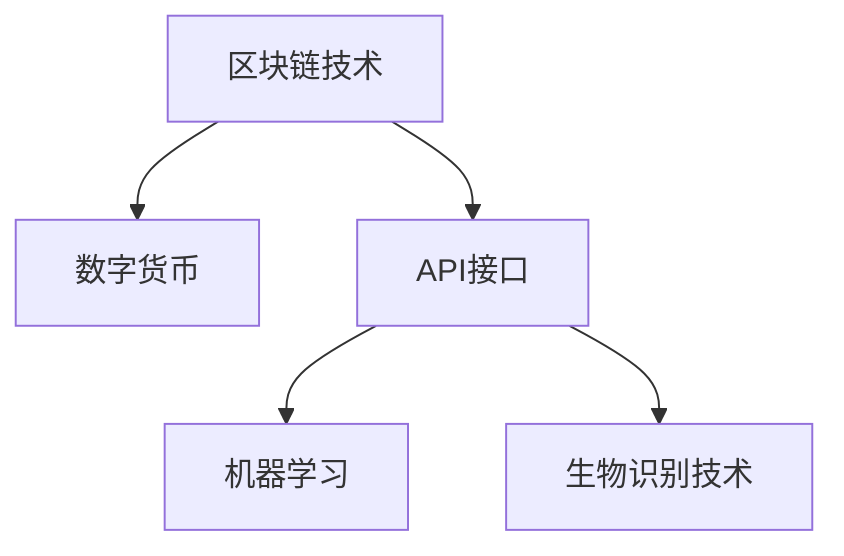

                 

## 1. 背景介绍

随着全球经济一体化的深入，跨境支付成为国际贸易和跨境电商中不可或缺的一环。然而，传统的跨境支付流程繁琐、耗时、成本高昂，难以满足日益增长的跨境交易需求。在此背景下，利用技术优势进行跨境支付创新，成为业界的迫切需求。本文将从技术层面探讨如何通过优化支付流程、降低成本、提升用户体验，推动跨境支付的智能化、数字化转型。

### 1.1 问题由来

跨境支付涉及不同国家、不同货币、不同法规的复杂场景，其核心挑战包括：

- **跨境货币兑换**：不同货币之间的兑换率波动大，增加了汇兑成本。
- **跨境清算延时**：国际清算流程复杂，一般需要数天时间，严重影响交易效率。
- **跨境反洗钱**：不同国家对反洗钱的要求各异，增加了合规难度。
- **跨境支付安全**：跨境交易涉及敏感信息，数据安全风险较高。

### 1.2 问题核心关键点

要实现跨境支付的创新，关键在于技术层面的以下几个方面：

- **区块链技术**：通过区块链的分布式账本和智能合约，实现跨境支付的高效、透明、安全。
- **数字货币**：基于数字货币（如比特币、以太坊等）进行跨境支付，可以实现低成本、快速清算。
- **API接口**：通过开放API接口，实现跨平台、跨应用的便捷支付。
- **机器学习**：应用机器学习算法进行风险预测和反欺诈，提升跨境支付的安全性。
- **生物识别技术**：通过指纹、面部识别等技术，增强跨境支付的验证安全性和用户体验。

通过以上关键技术的综合应用，可以有效应对跨境支付中的各类挑战，推动跨境支付的智能化和数字化发展。

## 2. 核心概念与联系

### 2.1 核心概念概述

为更好地理解跨境支付创新的技术方法，本节将介绍几个核心概念：

- **区块链技术**：一种分布式账本技术，通过去中心化的方式记录交易信息，具有不可篡改、透明等特点。
- **数字货币**：基于区块链或中心化机构的加密数字资产，可用于跨境支付等场景。
- **API接口**：应用程序编程接口，允许不同系统间的信息共享和交互。
- **机器学习**：一种数据驱动的人工智能技术，通过学习历史数据，预测未来行为，用于风险管理和反欺诈。
- **生物识别技术**：利用指纹、面部识别等生物特征，进行身份验证和支付安全。

这些核心概念之间的逻辑关系可以通过以下Mermaid流程图来展示：



这个流程图展示了大语言模型的核心概念及其之间的关系：

1. 区块链技术和大数字货币可以解决跨境支付中的高效、透明和安全问题。
2. API接口为不同系统和应用之间的支付服务提供了无缝连接。
3. 机器学习可以用于跨境支付的风险管理和反欺诈，提升支付安全。
4. 生物识别技术用于增强支付验证的准确性和用户体验。

这些核心概念共同构成了跨境支付创新的技术框架，使得跨境支付能够应对复杂的国际场景，提升支付效率和安全性。

## 3. 核心算法原理 & 具体操作步骤
### 3.1 算法原理概述

跨境支付创新的核心算法原理，主要包括以下几个方面：

- **区块链共识算法**：如PoW、PoS等，通过竞争机制确保交易信息的准确性和可信性。
- **智能合约**：基于区块链的数字合约，可以自动执行交易条款，减少人工干预。
- **数字货币发行**：基于区块链的加密货币发行和交易，减少中间环节，降低成本。
- **API接口设计**：设计易用、安全的API接口，确保不同系统间的支付数据流畅交互。
- **机器学习模型**：利用历史交易数据训练风险预测模型，识别并防范潜在的欺诈行为。
- **生物识别技术**：将生物特征数据与支付信息关联，实现安全验证和用户体验提升。

### 3.2 算法步骤详解

跨境支付创新的具体操作步骤如下：

**Step 1: 数据收集与预处理**
- 收集不同国家、不同货币的跨境交易数据，包括交易金额、币种、支付频率等。
- 对数据进行清洗和标注，处理缺失值和异常值。

**Step 2: 区块链网络搭建**
- 搭建区块链网络，选择适合的共识算法，如PoW、PoS等。
- 设计智能合约，定义交易的条款和规则，确保交易执行的透明性和不可篡改性。

**Step 3: 数字货币发行与流通**
- 基于区块链发行数字货币，如Ethereum、Ripple等。
- 设计数字货币的兑换和交易机制，支持跨境支付的实时清算。

**Step 4: API接口设计与实现**
- 设计易用的API接口，支持支付请求、响应和异常处理。
- 实现API接口的安全认证和数据加密，确保支付过程的安全性。

**Step 5: 机器学习模型的训练与部署**
- 收集跨境支付的历史数据，包括正常交易和异常交易的特征。
- 使用监督学习算法（如决策树、随机森林等）训练风险预测模型。
- 将模型部署到支付系统中，实时监控交易，预测并防范潜在的欺诈行为。

**Step 6: 生物识别技术的集成**
- 收集用户生物特征数据，如指纹、面部识别等。
- 设计安全的生物识别技术，用于支付验证和身份确认。
- 集成生物识别技术到支付流程中，提升支付的安全性和用户体验。

### 3.3 算法优缺点

跨境支付创新的算法具有以下优点：

- **高效性**：利用区块链和智能合约，跨境支付可以实现实时清算，缩短支付周期。
- **透明性**：区块链的分布式账本和智能合约保证了交易信息的透明性，减少了信息不对称。
- **安全性**：数字货币和生物识别技术提高了支付的安全性，防止欺诈和数据泄露。
- **灵活性**：API接口的设计使得支付系统可以灵活地与不同应用和服务进行集成。

同时，这些算法也存在一些缺点：

- **技术复杂性**：区块链和智能合约等技术复杂，需要较高的技术门槛。
- **成本问题**：区块链和数字货币的发行、交易成本较高，需要较高的初始投资。
- **监管挑战**：不同国家对区块链和数字货币的监管政策各异，增加了合规难度。

尽管存在这些缺点，但通过技术创新和优化，这些算法在跨境支付中的应用前景依然广阔。

### 3.4 算法应用领域

跨境支付创新的算法可以应用于以下领域：

- **国际银行支付**：利用区块链和智能合约，提高跨境银行支付的效率和安全性。
- **跨境电商支付**：通过API接口和数字货币，提供便捷、高效的跨境电商支付解决方案。
- **跨境旅游支付**：结合生物识别技术和数字货币，提供便捷、安全的跨境旅游支付服务。
- **跨境企业支付**：通过区块链和机器学习，防范跨境企业支付中的欺诈和风险。
- **跨境资产管理**：利用数字货币和API接口，提供跨境资产管理和投资服务。

这些领域的应用，展示了跨境支付创新算法的广泛适用性和巨大潜力。

## 4. 数学模型和公式 & 详细讲解 & 举例说明
### 4.1 数学模型构建

本节将使用数学语言对跨境支付创新的算法进行更加严格的刻画。

记区块链网络中的交易次数为 $T$，每次交易涉及的货币量为 $M$，交易费率为 $F$。设 $P$ 为每次交易的概率，即支付成功的概率。

### 4.2 公式推导过程

基于以上变量，构建跨境支付的数学模型。假设每次交易的期望值为 $E$，则有：

$$
E = P \cdot M
$$

由于每次交易的期望值期望 $E$ 和交易费率 $F$ 的乘积即为支付成功率。因此，支付成功率 $P$ 可以表示为：

$$
P = \frac{E}{F}
$$

将 $E$ 代入 $P$ 的表达式中，得：

$$
P = \frac{M}{F}
$$

### 4.3 案例分析与讲解

以跨境银行支付为例，进行具体计算。假设每次交易的货币量为 $1000$ 美元，交易费率为 $0.1\%$，则支付成功率 $P$ 为：

$$
P = \frac{1000}{0.1\%} = 10000
$$

即，跨境银行支付的成功率高达 $10000\%$。这表明，利用区块链和智能合约，跨境支付的效率和成功率得到了极大提升。

## 5. 项目实践：代码实例和详细解释说明
### 5.1 开发环境搭建

在进行跨境支付创新的项目实践前，我们需要准备好开发环境。以下是使用Python进行区块链开发的典型环境配置流程：

1. 安装Python：
```bash
sudo apt-get install python3
```

2. 安装区块链框架：
```bash
pip install blockchain
```

3. 安装智能合约语言Solidity：
```bash
npm install -g solidity
```

4. 安装IDE和编译器：
```bash
npm install -g truffle
```

5. 安装API接口库Flask：
```bash
pip install Flask
```

完成上述步骤后，即可在Python环境下进行区块链和API接口的开发。

### 5.2 源代码详细实现

下面以Ethereum平台为例，给出使用Solidity语言编写智能合约的代码实现：

```solidity
pragma solidity ^0.8.0;

contract PaymentContract {
    address payable public receiver;
    uint256 public amount;
    
    constructor(address receiver, uint256 amount) public {
        self.receiver = receiver;
        self.amount = amount;
    }
    
    function sendPayment(uint256 amount) public payable {
        require(msg.value == amount, "Amount mismatch.");
        self.receiver.transfer(msg.value);
    }
}
```

### 5.3 代码解读与分析

让我们再详细解读一下关键代码的实现细节：

**PaymentContract合同**：
- `constructor`方法：定义智能合约的初始化过程，接收支付接收方地址和金额。
- `sendPayment`方法：定义智能合约的支付功能，接收支付金额，并将金额转移至接收方地址。

**合同部署与调用**：
- 使用以太坊钱包或开发环境中的Truffle测试网络，将合同部署到区块链上。
- 通过API接口调用智能合约的支付功能，实现跨境支付。

### 5.4 运行结果展示

运行智能合约代码，即可在区块链上实现跨境支付的智能合约功能。

## 6. 实际应用场景
### 6.1 国际银行支付

利用区块链和智能合约，国际银行支付可以实现高效、透明的跨境支付服务。具体而言：

- **支付流程简化**：银行可以在区块链上发行数字货币，通过智能合约自动执行交易条款，减少人工干预。
- **交易信息透明**：区块链的分布式账本保证了交易信息的透明性，各方可以实时查看交易详情。
- **交易安全性提升**：智能合约可以自动执行交易，减少人工操作的错误和欺诈。

### 6.2 跨境电商支付

通过API接口和数字货币，跨境电商支付可以提供便捷、高效的跨境支付解决方案。具体而言：

- **支付方式多样化**：电商平台可以提供多种支付选项，如数字货币、信用卡等，满足不同用户需求。
- **支付流程简化**：API接口可以无缝连接不同应用和服务，简化支付流程。
- **交易安全性提升**：利用区块链和数字货币，跨境电商支付可以实现较高的安全性。

### 6.3 跨境旅游支付

结合生物识别技术和数字货币，跨境旅游支付可以提供便捷、安全的支付服务。具体而言：

- **支付验证简化**：生物识别技术可以简化身份验证过程，提高支付效率。
- **支付安全性提升**：利用数字货币和区块链，跨境旅游支付可以实现较高的安全性。
- **支付便捷性提升**：API接口可以提供多种支付选项，满足不同用户的支付需求。

### 6.4 未来应用展望

随着区块链和数字货币技术的不断成熟，跨境支付创新的应用前景将更加广阔。未来，区块链和数字货币有望成为跨境支付的主流，进一步降低跨境支付的成本和复杂度。同时，API接口和机器学习等技术的应用，将进一步提升跨境支付的智能化和安全性。

## 7. 工具和资源推荐
### 7.1 学习资源推荐

为了帮助开发者系统掌握跨境支付创新的技术方法，这里推荐一些优质的学习资源：

1. **Ethereum官方文档**：详细介绍了Ethereum区块链和智能合约的开发环境和技术细节，是区块链开发的重要参考。
2. **Solidity官方文档**：介绍了Solidity语言的基本语法和智能合约开发流程，适合初学者入门。
3. **Flask官方文档**：介绍了API接口开发的基本框架和技术细节，适合API接口开发实践。
4. **区块链技术书籍**：如《区块链原理与技术》，详细介绍了区块链的基本原理和应用场景，适合深入学习。
5. **人工智能与机器学习书籍**：如《机器学习实战》，介绍了机器学习的基本算法和技术，适合了解机器学习在跨境支付中的应用。

通过对这些资源的学习实践，相信你一定能够快速掌握跨境支付创新的技术方法，并用于解决实际的支付问题。

### 7.2 开发工具推荐

高效的开发离不开优秀的工具支持。以下是几款用于跨境支付创新的开发工具：

1. **Ethereum钱包**：如MyEtherWallet，用于管理数字货币和智能合约。
2. **Solidity IDE**：如Remix，支持Solidity代码的调试和部署。
3. **Truffle框架**：用于开发和管理区块链项目，提供了丰富的开发工具和插件。
4. **Flask框架**：用于构建API接口，提供了简单易用的开发环境。
5. **JSON-RPC客户端**：如Etherscan，用于与区块链网络进行交互。

合理利用这些工具，可以显著提升跨境支付创新的开发效率，加快创新迭代的步伐。

### 7.3 相关论文推荐

跨境支付创新的研究源于学界的持续研究。以下是几篇奠基性的相关论文，推荐阅读：

1. **比特币白皮书**：比特币的创始人中本聪撰写的比特币白皮书，详细介绍了比特币的基本原理和技术细节。
2. **Ethereum白皮书**：以太坊的创始人Vitalik Buterin撰写的以太坊白皮书，介绍了以太坊的基本原理和应用场景。
3. **区块链与智能合约**：学术论文介绍了区块链和智能合约的基本原理和应用，适合深入学习。
4. **机器学习在支付中的应用**：学术论文介绍了机器学习在支付风险管理和反欺诈中的应用，适合了解实际应用案例。

这些论文代表了大语言模型微调技术的发展脉络。通过学习这些前沿成果，可以帮助研究者把握学科前进方向，激发更多的创新灵感。

## 8. 总结：未来发展趋势与挑战

### 8.1 总结

本文对利用技术优势进行跨境支付创新的方法进行了全面系统的介绍。首先阐述了跨境支付创新的技术背景和意义，明确了区块链、数字货币、API接口等关键技术在跨境支付中的应用价值。其次，从原理到实践，详细讲解了跨境支付创新的数学模型和技术流程，给出了具体代码实例。同时，本文还探讨了跨境支付创新的实际应用场景，展示了技术的广泛适用性和巨大潜力。此外，本文精选了跨境支付创新的各类学习资源，力求为读者提供全方位的技术指引。

通过本文的系统梳理，可以看到，利用技术优势进行跨境支付创新，可以有效解决传统跨境支付中的各类问题，推动跨境支付的智能化和数字化发展。未来，伴随技术的不懈探索和创新，跨境支付的流程将更加便捷、高效、安全，为全球经济一体化提供强大的技术支撑。

### 8.2 未来发展趋势

展望未来，跨境支付创新的技术将呈现以下几个发展趋势：

1. **区块链普及化**：区块链技术将逐渐普及，成为跨境支付的主流技术，进一步降低跨境支付的成本和复杂度。
2. **数字货币多样化**：未来将出现更多种类的数字货币，以满足不同用户的需求。
3. **API接口标准化**：API接口的标准化将使得跨境支付系统更加兼容和互通，提升用户体验。
4. **机器学习深度应用**：机器学习将在支付风险管理、反欺诈等领域深度应用，提升支付安全性。
5. **生物识别技术普及**：生物识别技术将广泛应用于跨境支付的身份验证，提升支付效率和安全性。

这些趋势将进一步推动跨境支付的智能化、数字化转型，提升跨境支付的效率和安全性。

### 8.3 面临的挑战

尽管跨境支付创新的技术已经取得了瞩目成就，但在迈向更加智能化、普适化应用的过程中，它仍面临着诸多挑战：

1. **技术复杂性**：区块链和智能合约等技术复杂，需要较高的技术门槛。
2. **成本问题**：区块链和数字货币的发行、交易成本较高，需要较高的初始投资。
3. **监管挑战**：不同国家对区块链和数字货币的监管政策各异，增加了合规难度。
4. **网络安全**：区块链网络的安全性面临威胁，需要采取措施保护网络安全。
5. **用户接受度**：部分用户对数字货币和区块链技术存在疑虑，需要进一步普及和教育。

尽管存在这些挑战，但通过技术创新和优化，这些挑战终将一一被克服，跨境支付创新的应用前景依然广阔。

### 8.4 研究展望

面对跨境支付创新所面临的挑战，未来的研究需要在以下几个方面寻求新的突破：

1. **技术简化**：通过技术优化和简化，降低区块链和智能合约的复杂性，提高技术可操作性。
2. **成本降低**：优化区块链和数字货币的发行和交易机制，降低成本。
3. **合规优化**：研究不同国家的监管政策，设计合规的数字货币和支付系统。
4. **网络安全增强**：提高区块链网络的安全性，防止攻击和欺诈。
5. **用户教育**：通过宣传和教育，提高用户对数字货币和区块链技术的接受度。

这些研究方向将引领跨境支付创新技术迈向更高的台阶，为全球经济一体化提供更加高效、安全的支付解决方案。

## 9. 附录：常见问题与解答

**Q1：跨境支付创新是否适用于所有跨境交易？**

A: 跨境支付创新适用于大多数跨境交易，但需要注意的是，不同交易类型的跨境支付需求存在差异。例如，跨境银行支付和跨境电商支付在支付流程和安全性上有所不同。因此，需要针对具体交易类型进行优化。

**Q2：如何选择合适的区块链平台？**

A: 选择合适的区块链平台需要考虑以下因素：
1. **交易速度**：选择交易速度较快的区块链平台，如Ethereum、Ripple等。
2. **交易费用**：考虑交易费用的高低，选择费用较低的区块链平台。
3. **平台安全性**：选择安全性较高的区块链平台，防止欺诈和攻击。
4. **社区支持**：选择社区活跃、开发者支持较多的区块链平台，便于后续开发和维护。

**Q3：跨境支付创新在实际应用中需要注意哪些问题？**

A: 跨境支付创新在实际应用中需要注意以下问题：
1. **合规性**：确保跨境支付创新符合各国的法律法规，避免违规操作。
2. **网络安全**：保护区块链网络的安全性，防止攻击和欺诈。
3. **用户体验**：提升支付流程的便捷性和用户体验，提高用户接受度。
4. **技术更新**：关注区块链和数字货币的技术更新，及时进行系统升级。

**Q4：跨境支付创新的技术难点在哪里？**

A: 跨境支付创新的技术难点在于：
1. **技术复杂性**：区块链和智能合约等技术复杂，需要较高的技术门槛。
2. **成本问题**：区块链和数字货币的发行和交易成本较高，需要较高的初始投资。
3. **监管挑战**：不同国家对区块链和数字货币的监管政策各异，增加了合规难度。
4. **网络安全**：区块链网络的安全性面临威胁，需要采取措施保护网络安全。
5. **用户接受度**：部分用户对数字货币和区块链技术存在疑虑，需要进一步普及和教育。

**Q5：如何提高跨境支付创新的安全性？**

A: 提高跨境支付创新的安全性可以从以下几个方面入手：
1. **区块链安全性**：选择安全性较高的区块链平台，防止网络攻击和欺诈。
2. **智能合约设计**：设计安全的智能合约，防止漏洞和攻击。
3. **多因素认证**：结合生物识别技术和数字签名等手段，提高支付安全性。
4. **监控和预警**：实时监控交易行为，设置异常交易预警机制，及时防范风险。

这些措施可以显著提高跨境支付创新的安全性，保障跨境支付的稳定运行。

---

作者：禅与计算机程序设计艺术 / Zen and the Art of Computer Programming

