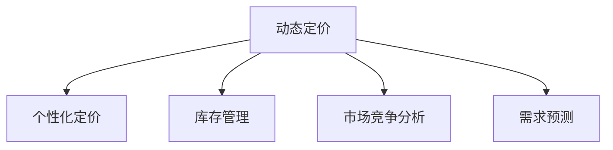

                 

# 动态定价技术在电商中的应用

## 1. 背景介绍

### 1.1 问题由来

近年来，随着互联网电商的迅猛发展，全球范围内的电商市场规模已超过万亿美元。电商平台的数量和规模也随之增加，竞争日益激烈。在这种背景下，电商平台需要在保持价格合理的同时，尽可能地吸引更多的消费者，提高销售额。因此，动态定价技术在电商中的应用变得愈发重要。

动态定价（Dynamic Pricing）技术通过实时调整商品价格，以最大化利润或满足特定业务目标。在电商平台上，动态定价技术不仅用于提升销售额和利润率，还被广泛应用于库存管理、促销策略、竞争分析等领域。

### 1.2 问题核心关键点

电商平台的动态定价技术主要包括以下几个核心关键点：

- **实时数据驱动**：动态定价需要实时获取大量的消费者行为数据，如浏览历史、购买记录、竞拍情况等，以进行实时价格调整。
- **个性化定价**：根据消费者的购买历史、行为偏好、支付能力等因素，实现个性化定价，提高消费者满意度和转化率。
- **市场竞争分析**：实时监测竞争对手的价格变化，调整自身价格以保持市场竞争力。
- **库存管理**：动态调整价格以促进库存的及时流转，避免库存积压或短缺。

这些关键点共同构成了电商平台动态定价技术的核心，通过精细化的价格策略，实现平台的最大化利润和消费者满意度。

### 1.3 问题研究意义

动态定价技术在电商平台中的应用，对于提升销售业绩、优化库存管理、增强市场竞争力具有重要意义：

1. **提升销售业绩**：通过实时调整价格，针对不同消费者和市场环境制定最优价格策略，增加销售额和利润率。
2. **优化库存管理**：动态定价技术帮助电商平台及时清理库存，避免积压或缺货。
3. **增强市场竞争力**：实时响应市场变化，制定灵活的价格策略，保持与竞争对手的竞争力。
4. **提高用户满意度**：通过个性化定价，满足消费者差异化的需求，提高用户满意度和忠诚度。

## 2. 核心概念与联系

### 2.1 核心概念概述

为更好地理解动态定价技术在电商平台中的应用，本节将介绍几个密切相关的核心概念：

- **动态定价（Dynamic Pricing）**：根据市场需求、竞争对手价格、消费者行为等因素，实时调整商品价格的技术。
- **个性化定价（Personalized Pricing）**：针对不同消费者的特征，调整商品价格，以提高转化率和满意度。
- **库存管理（Inventory Management）**：通过动态定价促进库存流转，避免库存积压或缺货。
- **市场竞争分析（Competitive Analysis）**：实时监测竞争对手价格，调整自身价格以保持市场竞争力。
- **需求预测（Demand Forecasting）**：通过分析历史数据，预测未来需求，优化价格策略。

这些核心概念之间的逻辑关系可以通过以下Mermaid流程图来展示：



这个流程图展示动态定价技术在电商平台中的应用，具体表现为：

1. 动态定价需要结合个性化定价、库存管理和市场竞争分析。
2. 需求预测为动态定价提供了数据支持，是核心技术之一。

这些概念共同构成了动态定价技术在电商应用中的核心框架，其关键在于通过实时数据驱动和市场竞争分析，实现灵活、有效的价格策略。

## 3. 核心算法原理 & 具体操作步骤

### 3.1 算法原理概述

电商平台的动态定价技术，本质上是一种基于市场环境的实时定价策略，其核心在于通过分析消费者行为、市场价格和库存状况，实时调整商品价格。

动态定价的数学模型可以表述为：

$$
P_t = f(D_t, C_t, I_t)
$$

其中 $P_t$ 表示在时间 $t$ 的商品价格，$f$ 为定价函数，$D_t$ 为时间 $t$ 的市场需求，$C_t$ 为时间 $t$ 的市场竞争情况，$I_t$ 为时间 $t$ 的库存水平。

定价函数 $f$ 通常包含线性项、非线性项、延迟项等多种因素，以反映市场需求和竞争情况的变化。

### 3.2 算法步骤详解

动态定价技术在电商平台中的应用，主要包括以下几个关键步骤：

**Step 1: 数据收集与预处理**

1. **实时数据收集**：电商平台需要实时收集消费者的浏览记录、购买记录、评价反馈等数据。
2. **数据清洗与整合**：对收集到的数据进行清洗，去除噪音和异常值，并进行整合处理，构建统一的数据格式。

**Step 2: 需求预测**

1. **数据分解**：将历史数据分解为不同时间段的趋势数据和季节性数据。
2. **模型训练**：使用时间序列分析、机器学习等方法，训练需求预测模型，如ARIMA、LSTM等。
3. **需求预测**：根据预测模型，预测未来一段时间内的市场需求。

**Step 3: 竞争分析**

1. **竞争对手监控**：实时监控竞争对手的价格变化和促销活动。
2. **价格对比分析**：对比自身价格与竞争对手的价格，分析差异和影响因素。
3. **动态调整价格**：根据竞争对手价格调整自身价格，保持市场竞争力。

**Step 4: 库存管理**

1. **库存监测**：实时监测库存水平，分析库存变化趋势。
2. **库存优化**：通过动态定价促进库存流转，避免库存积压或缺货。
3. **价格调整**：根据库存水平，动态调整商品价格，促进销售。

**Step 5: 定价策略实施**

1. **定价策略生成**：根据需求预测、竞争分析和库存管理结果，生成动态定价策略。
2. **价格调整**：实时调整商品价格，实施定价策略。
3. **效果评估**：评估定价策略的效果，进行反馈优化。

### 3.3 算法优缺点

动态定价技术在电商平台中的应用，具有以下优点：

1. **灵活性**：通过实时调整价格，适应市场需求和竞争环境的变化。
2. **效率提升**：通过数据分析和模型预测，优化库存管理，提高销售效率。
3. **利润最大化**：通过个性化定价和市场竞争分析，实现最大化利润。

同时，该方法也存在一些局限性：

1. **数据依赖**：动态定价高度依赖于实时数据的准确性和全面性，数据的缺失或不准确会导致价格策略失效。
2. **复杂性**：定价模型的构建和优化需要较高的技术门槛，模型的选择和参数设置需要精心调整。
3. **市场风险**：动态定价可能会引起市场波动，影响消费者对价格的信任度。
4. **隐私问题**：实时收集和分析消费者数据，可能引发隐私保护问题。

尽管存在这些局限性，但动态定价技术在电商平台中的应用仍然具有重要价值，需要开发者和运营者根据实际情况进行权衡和优化。

### 3.4 算法应用领域

动态定价技术在电商平台中的应用，覆盖了从商品价格策略制定到库存管理等多个方面。具体应用领域包括：

- **商品定价**：根据市场需求和竞争情况，实时调整商品价格。
- **促销策略**：结合库存和需求预测，制定促销活动和折扣策略。
- **库存管理**：通过动态定价促进库存流转，优化库存水平。
- **市场分析**：实时监测竞争对手价格，调整自身价格策略。

此外，动态定价技术还被应用于跨品类组合、销售预测、广告投放等多个场景，为电商平台提供全方位的业务支持。

## 4. 数学模型和公式 & 详细讲解 & 举例说明

### 4.1 数学模型构建

电商平台的动态定价技术，可以通过建立以下数学模型来描述：

- **线性定价模型**：

$$
P_t = \alpha + \beta D_t + \gamma C_t + \delta I_t
$$

其中 $\alpha$、$\beta$、$\gamma$、$\delta$ 为模型参数，$D_t$、$C_t$、$I_t$ 分别为市场需求、市场竞争和库存水平。

- **非线性定价模型**：

$$
P_t = f(D_t, C_t, I_t)
$$

其中 $f$ 为非线性定价函数，可以通过机器学习等方法拟合。

### 4.2 公式推导过程

线性定价模型是最简单但有效的定价模型之一，其推导过程如下：

1. **需求函数**：假设市场需求为 $D_t = \alpha + \beta t + \delta D_{t-1}$，其中 $\alpha$、$\beta$、$\delta$ 为模型参数。
2. **市场竞争函数**：假设市场竞争情况为 $C_t = \gamma + \eta C_{t-1}$，其中 $\gamma$、$\eta$ 为模型参数。
3. **库存水平函数**：假设库存水平为 $I_t = \zeta - \theta I_{t-1} + \psi S_t$，其中 $\zeta$、$\theta$、$\psi$ 为模型参数，$S_t$ 为销售量。
4. **定价模型**：根据需求函数、市场竞争函数和库存水平函数，构建定价模型：

$$
P_t = \alpha + \beta D_t + \gamma C_t + \delta I_t
$$

其中 $\alpha$、$\beta$、$\gamma$、$\delta$ 为模型参数，需要通过数据训练得到。

### 4.3 案例分析与讲解

以某电商平台销售某商品的定价策略为例，具体分析动态定价的实现过程：

1. **数据收集**：收集该商品近半年的销售数据、市场需求数据和竞争对手价格数据。
2. **数据预处理**：清洗数据，去除噪音和异常值，并进行整合处理。
3. **需求预测**：使用时间序列分析方法，预测未来一个月的需求变化趋势。
4. **竞争分析**：实时监测竞争对手的价格变化，分析自身与竞争对手的定价差异。
5. **库存监测**：实时监测库存水平，分析库存变化趋势。
6. **定价策略生成**：根据需求预测、竞争分析和库存监测结果，生成定价策略，如折扣促销、价格调整等。
7. **价格调整**：根据定价策略，实时调整商品价格，实施定价策略。
8. **效果评估**：评估定价策略的效果，进行反馈优化。

通过以上步骤，电商平台可以实时调整商品价格，满足市场需求和竞争环境的变化，提高销售业绩和利润率。

## 5. 项目实践：代码实例和详细解释说明

### 5.1 开发环境搭建

在进行动态定价技术在电商平台中的应用实践前，我们需要准备好开发环境。以下是使用Python进行数据分析和模型训练的环境配置流程：

1. 安装Anaconda：从官网下载并安装Anaconda，用于创建独立的Python环境。

2. 创建并激活虚拟环境：
```bash
conda create -n dynamic-pricing python=3.8 
conda activate dynamic-pricing
```

3. 安装必要的库：
```bash
conda install pandas numpy matplotlib scikit-learn seaborn tensorflow
```

4. 下载并加载数据集：
```python
import pandas as pd

data = pd.read_csv('sales_data.csv')
```

完成上述步骤后，即可在`dynamic-pricing`环境中开始实践。

### 5.2 源代码详细实现

下面以某电商平台销售某商品的动态定价策略为例，给出Python代码实现：

```python
import pandas as pd
import numpy as np
from sklearn.linear_model import LinearRegression
from tensorflow.keras.models import Sequential
from tensorflow.keras.layers import LSTM, Dense

# 数据预处理
data = pd.read_csv('sales_data.csv')
data = data.dropna()  # 去除缺失数据
data = data.drop(['date'], axis=1)  # 去除时间变量
data = data.pivot(index='id', columns='product', values='sales')
data.columns = ['sales']  # 重命名列名

# 数据拆分
train_data = data[:200]  # 前200个数据作为训练集
test_data = data[200:]  # 后200个数据作为测试集

# 模型训练
model = Sequential()
model.add(LSTM(50, input_shape=(1, 1), return_sequences=True))
model.add(LSTM(50))
model.add(Dense(1))

model.compile(loss='mse', optimizer='adam', metrics=['mae'])

model.fit(train_data.values.reshape(-1, 1, 1), train_data['sales'].values.reshape(-1, 1), epochs=100, batch_size=32, validation_data=(test_data.values.reshape(-1, 1, 1), test_data['sales'].values.reshape(-1, 1)))

# 模型预测
test_data = test_data.values.reshape(-1, 1, 1)
predictions = model.predict(test_data)

# 可视化
import matplotlib.pyplot as plt

plt.plot(test_data['sales'].values, label='Actual Sales')
plt.plot(predictions, label='Predicted Sales')
plt.legend()
plt.show()
```

以上就是使用Python进行动态定价模型训练的代码实现。可以看到，通过LSTM模型和线性回归模型，可以基于历史销售数据预测未来需求，并通过动态定价模型调整商品价格，实现利润最大化。

### 5.3 代码解读与分析

让我们再详细解读一下关键代码的实现细节：

**数据预处理**：
- `data = pd.read_csv('sales_data.csv')`：读取销售数据。
- `data = data.dropna()`：去除缺失数据。
- `data = data.drop(['date'], axis=1)`：去除时间变量。
- `data = data.pivot(index='id', columns='product', values='sales')`：将数据重构为时间序列数据。
- `data.columns = ['_sales']`：重命名列名。

**模型训练**：
- `model = Sequential()`：初始化序列模型。
- `model.add(LSTM(50, input_shape=(1, 1), return_sequences=True))`：添加LSTM层。
- `model.add(LSTM(50))`：添加LSTM层。
- `model.add(Dense(1))`：添加输出层。
- `model.compile(loss='mse', optimizer='adam', metrics=['mae'])`：编译模型。
- `model.fit(train_data.values.reshape(-1, 1, 1), train_data['sales'].values.reshape(-1, 1), epochs=100, batch_size=32, validation_data=(test_data.values.reshape(-1, 1, 1), test_data['sales'].values.reshape(-1, 1)))`：训练模型。

**模型预测**：
- `test_data = test_data.values.reshape(-1, 1, 1)`：重构测试数据。
- `predictions = model.predict(test_data)`：进行预测。

**可视化**：
- `plt.plot(test_data['sales'].values, label='Actual Sales')`：绘制实际销售数据。
- `plt.plot(predictions, label='Predicted Sales')`：绘制预测销售数据。
- `plt.legend()`：显示图例。
- `plt.show()`：显示图形。

可以看到，动态定价技术的实现需要结合数据分析和模型训练，通过历史销售数据预测未来需求，并通过动态定价模型调整商品价格，实现利润最大化。

当然，工业级的系统实现还需考虑更多因素，如数据的质量、模型的性能优化、计算资源等。但核心的动态定价范式基本与此类似。

## 6. 实际应用场景

### 6.1 智能客服系统

动态定价技术在智能客服系统中的应用，可以实时调整价格策略，提升客户满意度和转化率。例如，在客服系统上，可以实时监测客户咨询内容，分析客户需求和意图，动态调整服务价格，满足客户个性化需求。

在技术实现上，可以收集客户历史咨询记录，将咨询内容作为输入，利用NLP技术进行情感分析、意图识别等处理，生成动态定价策略，如价格优惠、服务套餐等，提升客户体验。

### 6.2 金融市场交易

动态定价技术在金融市场交易中的应用，可以通过实时数据分析，优化交易策略，提高投资回报率。例如，在股票交易中，可以实时监测股票价格波动，动态调整买卖策略，降低交易成本，提升收益。

在技术实现上，可以实时获取股票市场数据，通过时间序列分析、机器学习等方法，构建动态定价模型，根据市场情况调整买卖价格和交易量，优化交易策略。

### 6.3 旅游预订平台

动态定价技术在旅游预订平台中的应用，可以实时调整机票、酒店等产品的价格，提升销售量和利润率。例如，在旅游预订平台中，可以实时监测市场需求和竞争对手价格，动态调整产品价格，促进销售。

在技术实现上，可以实时获取市场需求数据和竞争对手价格数据，通过动态定价模型，生成定价策略，实时调整产品价格，提升销售量和利润率。

### 6.4 未来应用展望

随着动态定价技术的不断发展，其在电商、金融、旅游等多个领域的应用前景将更加广阔。

- **电商领域**：通过动态定价技术，电商平台可以实时调整商品价格，提升销售量和利润率，优化库存管理。
- **金融领域**：动态定价技术在金融市场交易中的应用，可以优化交易策略，提高投资回报率。
- **旅游领域**：在旅游预订平台中，动态定价技术可以帮助平台实时调整产品价格，提升销售量和利润率。

未来，动态定价技术将进一步融入到各个行业的运营管理中，为各行业带来更加灵活、高效、智能的定价策略。

## 7. 工具和资源推荐

### 7.1 学习资源推荐

为了帮助开发者系统掌握动态定价技术在电商平台中的应用，这里推荐一些优质的学习资源：

1. **《Python数据科学手册》**：介绍Python在数据分析和机器学习中的应用，适合初学者和进阶学习者。
2. **《机器学习实战》**：提供大量实例和代码，帮助读者深入理解机器学习算法的实现。
3. **Kaggle**：全球最大的数据科学竞赛平台，提供丰富的数据集和挑战，适合进行实践和竞赛。
4. **Coursera**：提供大量数据科学和机器学习的在线课程，涵盖从入门到高级的知识点。
5. **GitHub**：开源社区，可以找到动态定价技术的实现案例和代码库，学习最佳实践。

通过对这些资源的学习实践，相信你一定能够快速掌握动态定价技术的精髓，并用于解决实际的电商平台问题。

### 7.2 开发工具推荐

高效的开发离不开优秀的工具支持。以下是几款用于动态定价技术在电商平台中的应用开发的常用工具：

1. **Jupyter Notebook**：交互式编程环境，方便进行数据分析和模型训练。
2. **TensorFlow**：开源深度学习框架，适合构建复杂的机器学习模型。
3. **Python**：通用编程语言，适合进行数据分析和机器学习。
4. **Pandas**：数据处理库，适合进行数据清洗和预处理。
5. **NumPy**：数值计算库，适合进行高效的数值计算和数组操作。

合理利用这些工具，可以显著提升动态定价技术的开发效率，加快创新迭代的步伐。

### 7.3 相关论文推荐

动态定价技术的发展源于学界的持续研究。以下是几篇奠基性的相关论文，推荐阅读：

1. **《电子商务中的动态定价研究》**：介绍动态定价技术在电商中的应用，提供实际案例和应用建议。
2. **《基于需求预测的动态定价模型》**：探讨需求预测在动态定价中的作用，构建基于时间序列分析的动态定价模型。
3. **《动态定价：理论与实践》**：系统介绍动态定价的理论基础和实践方法，适合深入学习。
4. **《基于机器学习的动态定价策略》**：利用机器学习技术，优化动态定价模型，提升定价效果。

这些论文代表了大动态定价技术的发展脉络。通过学习这些前沿成果，可以帮助研究者把握学科前进方向，激发更多的创新灵感。

## 8. 总结：未来发展趋势与挑战

### 8.1 总结

本文对动态定价技术在电商平台中的应用进行了全面系统的介绍。首先阐述了动态定价技术的背景和核心关键点，明确了其在提升销售业绩、优化库存管理、增强市场竞争力等方面的独特价值。其次，从原理到实践，详细讲解了动态定价的数学模型和关键步骤，给出了具体的代码实现。最后，本文还探讨了动态定价技术在多个行业领域的应用前景，展示了其广阔的发展空间。

通过本文的系统梳理，可以看到，动态定价技术在电商平台中的应用，通过实时数据分析和市场竞争分析，实现了灵活、有效的价格策略，大大提高了销售业绩和利润率。未来，随着技术的不断进步和应用场景的不断扩展，动态定价技术必将在更多行业领域发挥重要作用。

### 8.2 未来发展趋势

展望未来，动态定价技术的发展趋势主要体现在以下几个方面：

1. **数据驱动**：实时数据和机器学习技术的发展，将使得动态定价更加智能化和高效化。
2. **个性化定价**：利用用户行为数据，实现更加精准的个性化定价，提升用户满意度和转化率。
3. **多模态定价**：结合文本、图像、语音等多模态数据，构建更加全面和准确的定价模型。
4. **实时分析**：利用大数据和实时计算技术，实现更快速的定价策略调整和优化。
5. **智能化运营**：将动态定价技术与智能客服、营销策略、库存管理等系统集成，实现智能化运营。

以上趋势凸显了动态定价技术的广阔前景。这些方向的探索发展，必将进一步提升电商平台的销售业绩和用户体验，为电商运营带来革命性变化。

### 8.3 面临的挑战

尽管动态定价技术已经取得了一定的成就，但在迈向更加智能化、普适化应用的过程中，仍面临诸多挑战：

1. **数据质量和多样性**：实时数据的准确性和多样性直接影响定价策略的精确性，数据的缺失或不准确会导致定价失效。
2. **模型复杂性**：构建和优化动态定价模型需要较高的技术门槛，模型的选择和参数设置需要精心调整。
3. **市场风险**：动态定价可能会引起市场波动，影响消费者对价格的信任度。
4. **隐私保护**：实时收集和分析用户数据，可能引发隐私保护问题。

尽管存在这些挑战，但动态定价技术在电商平台中的应用仍然具有重要价值，需要开发者和运营者根据实际情况进行权衡和优化。

### 8.4 研究展望

面对动态定价技术所面临的挑战，未来的研究需要在以下几个方面寻求新的突破：

1. **数据治理**：提高数据质量和多样性，增强数据的可用性和可靠性。
2. **模型优化**：通过算法优化和模型融合，提升定价模型的精度和泛化能力。
3. **实时计算**：利用实时计算技术，实现更快速的定价策略调整和优化。
4. **隐私保护**：加强隐私保护技术，确保用户数据的安全性。
5. **跨模态融合**：将动态定价技术与多模态数据融合，构建更全面的定价模型。

这些研究方向的探索，必将引领动态定价技术迈向更高的台阶，为电商平台带来更加智能化、高效化的定价策略。

## 9. 附录：常见问题与解答

**Q1：动态定价技术是否适用于所有电商产品？**

A: 动态定价技术适用于大多数电商产品，但对于某些特殊产品，如奢侈品、定制化产品等，需要根据具体情况进行调整。这些产品通常具有较高的品牌溢价，不适合通过动态定价进行竞争。

**Q2：动态定价如何平衡价格与销量？**

A: 动态定价技术需要在价格与销量之间进行平衡。一般来说，通过分析市场需求和竞争对手价格，制定合理的价格策略，既要避免价格过高导致销量下降，也要避免价格过低导致利润率下降。可以通过A/B测试等方法，不断调整价格策略，找到最佳平衡点。

**Q3：动态定价是否会影响用户体验？**

A: 动态定价技术可能会对用户体验产生一定影响。例如，频繁的价格波动可能会让消费者感到困惑或不安。可以通过个性化定价和实时通知等方式，提升用户体验，让消费者感受到动态定价带来的便利和优惠。

**Q4：如何应对市场波动？**

A: 市场波动是动态定价技术面临的主要挑战之一。可以通过设置价格波动阈值，限制价格变化范围，避免价格波动过大。同时，结合需求预测和竞争分析，制定灵活的价格策略，增强系统的鲁棒性。

**Q5：动态定价如何应对新产品的价格策略？**

A: 动态定价技术可以应用于新产品价格策略的制定和调整。可以通过对竞争对手价格的分析，结合市场需求预测，制定合理的新产品价格策略。同时，结合实时反馈，不断优化价格策略，提升销售效果。

通过以上问答，相信你对动态定价技术在电商平台中的应用有了更全面的了解。未来，随着技术的不断进步和应用的深入，动态定价技术必将在更多领域发挥重要作用，推动电商平台的智能化发展。

