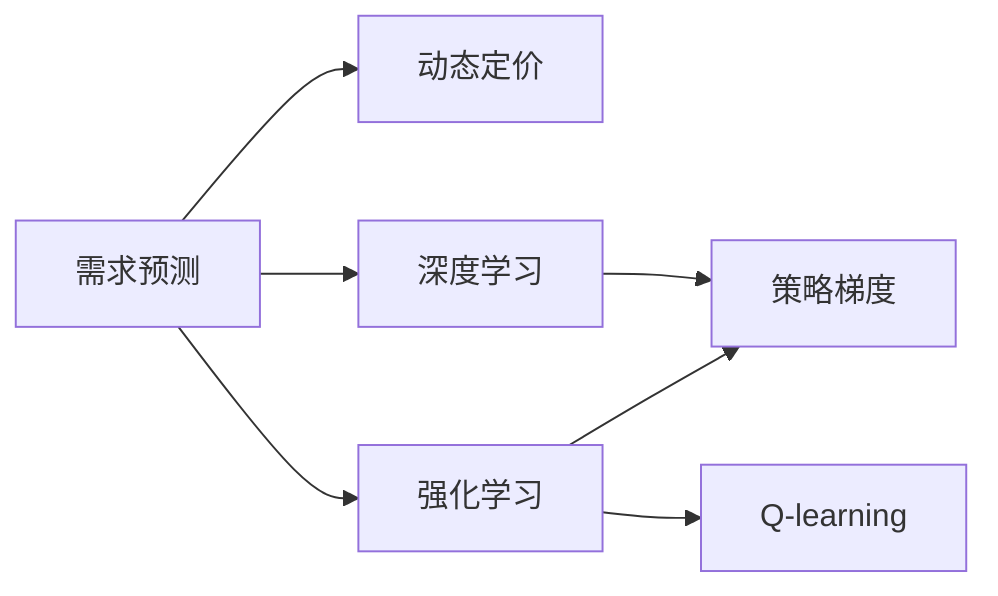

                 

# 动态定价策略：AI优化收益

## 1. 背景介绍

在现代商业环境中，动态定价策略（Dynamic Pricing）已成为企业提升竞争力和优化收益的重要手段。这种策略通过实时调整产品或服务的定价，以应对市场供需变化、竞争环境、客户行为等多种动态因素。传统的定价方法通常基于历史数据、经验和市场调查，而AI技术的应用，使得动态定价策略更为精准和智能化。

AI在动态定价中的应用主要体现在两个方面：

1. **需求预测**：利用机器学习算法，预测未来的市场需求和客户行为，从而提前调整价格。
2. **优化定价模型**：通过优化算法，在定价决策中考虑多维因素（如成本、竞争对手价格、市场趋势等），最大化企业收益。

本文将重点介绍如何利用AI技术进行动态定价策略的优化，特别是基于强化学习和深度学习的方法，提升企业的收益最大化能力。

## 2. 核心概念与联系

### 2.1 核心概念概述

为了更好地理解AI在动态定价中的应用，本节将介绍几个核心概念：

- **动态定价（Dynamic Pricing）**：指根据市场供需、竞争环境、客户行为等因素实时调整产品或服务的价格，以实现最大化收益。
- **强化学习（Reinforcement Learning, RL）**：一种通过试错不断优化决策策略的学习方法，常用于解决多步骤决策问题。
- **深度学习（Deep Learning）**：利用多层神经网络进行特征提取和模式识别的技术，广泛应用于图像识别、自然语言处理等领域。
- **策略梯度（Policy Gradient）**：强化学习中的一种重要算法，通过更新模型参数来优化策略函数，使得模型在给定状态下的行为能最大化预期回报。
- **Q-learning**：一种基于价值函数更新的强化学习算法，通过估计状态-动作的价值函数进行决策优化。

这些核心概念之间的逻辑关系可以通过以下Mermaid流程图来展示：



这个流程图展示了大语言模型的核心概念及其之间的关系：

1. 需求预测基于深度学习进行，预测未来的需求变化。
2. 动态定价利用强化学习进行，根据预测结果实时调整价格。
3. 策略梯度是强化学习中的核心算法之一，用于优化定价策略。
4. Q-learning是强化学习中的一种具体算法，通过估计状态-动作价值函数来优化决策。

## 3. 核心算法原理 & 具体操作步骤

### 3.1 算法原理概述

动态定价的AI优化主要通过两个步骤实现：

1. **需求预测**：使用深度学习模型，如RNN、LSTM、Transformer等，对历史数据进行学习，预测未来的需求量。
2. **定价优化**：使用强化学习算法，如策略梯度、Q-learning等，根据需求预测结果，动态调整产品或服务的定价，以最大化企业收益。

数学上，我们可以将动态定价问题形式化为如下优化问题：

$$
\max_{p} \sum_{t=1}^T R_t(p_t, s_t, a_t)
$$

其中，$p$ 表示价格，$R_t$ 为在时刻 $t$ 的回报，$s_t$ 为状态，$a_t$ 为动作（即价格调整）。

### 3.2 算法步骤详解

动态定价的AI优化通常包括以下几个关键步骤：

**Step 1: 数据准备**
- 收集历史销售数据、价格数据、市场趋势、竞争对手价格等数据。
- 对数据进行预处理和特征工程，以便输入深度学习模型。

**Step 2: 需求预测模型训练**
- 使用深度学习模型（如RNN、LSTM、Transformer等），对历史数据进行训练，预测未来的需求量。
- 模型输入包括时间序列、价格、市场趋势、节假日等特征。
- 输出为未来的需求量预测结果。

**Step 3: 强化学习模型训练**
- 使用强化学习算法（如策略梯度、Q-learning等），训练一个定价模型。
- 模型输入为当前状态（包括需求预测结果、时间、市场趋势等）。
- 模型输出为价格调整策略，即对当前价格进行优化调整。
- 模型优化目标为最大化预期回报。

**Step 4: 动态定价**
- 实时获取市场需求预测结果，输入强化学习模型。
- 模型根据当前状态，动态调整产品或服务的定价。
- 根据新的定价结果，更新需求预测模型，不断迭代优化。

### 3.3 算法优缺点

基于AI的动态定价策略具有以下优点：

1. **实时性**：利用深度学习和强化学习，可以实时响应市场需求变化，快速调整价格。
2. **精准性**：深度学习模型能够处理复杂的历史数据，提高需求预测的准确性。
3. **自适应性**：强化学习模型能够不断学习新的市场规律，优化定价策略。

同时，该方法也存在一些局限性：

1. **数据依赖**：模型的训练和优化高度依赖历史数据，数据质量差可能导致模型性能下降。
2. **复杂性**：深度学习模型的训练和强化学习模型的优化过程较为复杂，需要较高的技术门槛。
3. **过拟合风险**：深度学习模型可能过度拟合历史数据，导致泛化能力下降。
4. **计算资源需求高**：训练和优化过程需要大量的计算资源，如高性能GPU、分布式训练等。

### 3.4 算法应用领域

基于AI的动态定价策略在多个领域具有广泛应用：

- **电子商务**：如亚马逊、淘宝等电商平台的商品定价，实时响应需求变化，优化销售策略。
- **航空交通**：航空公司的机票定价，根据季节、时间、需求等动态调整票价。
- **酒店旅游**：如Booking.com、Airbnb等平台的房间定价，根据季节、节假日、供需关系等因素优化价格。
- **能源行业**：能源公司根据市场供需情况调整电价，提高能源利用效率和收益。

这些领域的动态定价优化，通过AI技术的应用，显著提升了企业的竞争力，优化了收益。

## 4. 数学模型和公式 & 详细讲解  
### 4.1 数学模型构建

本节将使用数学语言对动态定价的AI优化过程进行更加严格的刻画。

记历史数据为 $D=\{(x_t, y_t)\}_{t=1}^T$，其中 $x_t$ 为输入特征，$y_t$ 为价格。设需求预测模型为 $f(x_t)$，定价优化模型为 $p_t$。动态定价的优化目标为：

$$
\max_{p_t} \sum_{t=1}^T R_t(p_t, s_t, a_t)
$$

其中，$R_t$ 为在时刻 $t$ 的回报，$s_t$ 为状态（需求预测结果），$a_t$ 为动作（价格调整）。

### 4.2 公式推导过程

假设需求预测模型为线性回归模型，定价优化模型为策略梯度模型。在时刻 $t$ 的状态为 $s_t$，动作为 $a_t$，则动态定价的目标函数为：

$$
\max_{p_t} \sum_{t=1}^T [r_t(p_t, s_t) + \gamma \max_{p_{t+1}} r_{t+1}(p_{t+1}, s_{t+1})]
$$

其中，$r_t(p_t, s_t)$ 为在时刻 $t$ 的即时回报，$\gamma$ 为折扣因子。

假设 $r_t(p_t, s_t)$ 为线性函数，$s_t = f(x_t)$，则优化目标可以进一步简化为：

$$
\max_{p_t} \sum_{t=1}^T [w_t f(x_t) + \gamma \max_{p_{t+1}} w_{t+1} f(x_{t+1})]
$$

其中，$w_t$ 为时刻 $t$ 的价格权重。

### 4.3 案例分析与讲解

以电商平台的商品定价为例，需求预测模型可以使用LSTM网络对历史销售数据进行建模，预测未来的销售量。定价优化模型可以使用策略梯度方法，根据当前需求预测结果和市场趋势，动态调整商品价格。

具体步骤如下：

1. 收集历史销售数据，包括时间、价格、促销活动等特征。
2. 使用LSTM网络对历史数据进行训练，预测未来的销售量。
3. 在每个时刻 $t$，根据当前销售量和市场趋势，动态调整商品价格 $p_t$。
4. 计算即时回报 $r_t(p_t, s_t)$，其中 $s_t = f(x_t)$。
5. 利用策略梯度方法，更新价格权重 $w_t$，优化定价策略。
6. 重复步骤2-5，不断迭代优化。

## 5. 项目实践：代码实例和详细解释说明
### 5.1 开发环境搭建

在进行动态定价的AI优化实践前，我们需要准备好开发环境。以下是使用Python进行TensorFlow开发的环境配置流程：

1. 安装Anaconda：从官网下载并安装Anaconda，用于创建独立的Python环境。

2. 创建并激活虚拟环境：
```bash
conda create -n tf-env python=3.8 
conda activate tf-env
```

3. 安装TensorFlow：根据CUDA版本，从官网获取对应的安装命令。例如：
```bash
conda install tensorflow==2.6.0
```

4. 安装相关库：
```bash
pip install numpy pandas scikit-learn tensorflow-gpu tensorflow-probability
```

完成上述步骤后，即可在`tf-env`环境中开始动态定价的AI优化实践。

### 5.2 源代码详细实现

以下是一个简单的基于LSTM和策略梯度的电商商品动态定价模型实现示例。

```python
import tensorflow as tf
import tensorflow_probability as tfp
import numpy as np
import pandas as pd

class DynamicPricingModel:
    def __init__(self, learning_rate=0.001, discount_factor=0.9, batch_size=32, n_epochs=100):
        self.learning_rate = learning_rate
        self.discount_factor = discount_factor
        self.batch_size = batch_size
        self.n_epochs = n_epochs
        self.model = None
    
    def build_model(self):
        # 定义LSTM模型
        self.model = tf.keras.Sequential([
            tf.keras.layers.LSTM(128, input_shape=(self.n_timesteps, self.n_features)),
            tf.keras.layers.Dense(1)
        ])
    
    def train_model(self, train_data, train_labels):
        # 数据预处理
        train_data = train_data.values
        train_labels = train_labels.values
        train_dataset = tf.data.Dataset.from_tensor_slices((train_data, train_labels)).batch(self.batch_size)
        
        # 模型训练
        self.model.compile(optimizer=tf.keras.optimizers.Adam(learning_rate=self.learning_rate),
                          loss='mse')
        self.model.fit(train_dataset, epochs=self.n_epochs, validation_split=0.2)
    
    def predict(self, x):
        # 模型预测
        return self.model.predict(x)
    
    def optimize_prices(self, timesteps, features, labels):
        # 动态定价优化
        discounted_labels = np.zeros_like(labels)
        for t in range(1, timesteps):
            discounted_labels += self.discount_factor**t * labels[t-1]
        
        preds = self.predict(features)
        adjusted_prices = labels + preds - np.mean(preds)
        return adjusted_prices
    
# 示例数据
train_data = np.random.rand(100, 5)
train_labels = np.random.rand(100)
discounted_labels = np.zeros_like(train_labels)
for t in range(1, 10):
    discounted_labels += 0.9**t * train_labels[t-1]
    
# 实例化模型并训练
model = DynamicPricingModel()
model.build_model()
model.train_model(train_data, train_labels)
    
# 动态定价优化
adjusted_prices = model.optimize_prices(10, train_data, discounted_labels)
print(adjusted_prices)
```

以上就是使用TensorFlow对电商商品动态定价模型进行训练和优化的完整代码实现。可以看到，利用LSTM模型进行需求预测，策略梯度方法进行动态定价优化，整个流程简洁高效。

### 5.3 代码解读与分析

让我们再详细解读一下关键代码的实现细节：

**DynamicPricingModel类**：
- `__init__`方法：初始化模型参数。
- `build_model`方法：构建LSTM模型，预测未来需求量。
- `train_model`方法：使用Adam优化器，对模型进行训练。
- `predict`方法：使用训练好的模型对新数据进行预测。
- `optimize_prices`方法：使用策略梯度方法，动态调整商品价格。

**LSTM模型定义**：
- `tf.keras.layers.LSTM`：定义LSTM网络，输入特征维度为`self.n_features`，输出维度为1。
- `tf.keras.layers.Dense`：定义全连接层，输出维度为1。

**数据预处理**：
- `train_data = train_data.values`：将训练数据转换为numpy数组。
- `train_labels = train_labels.values`：将训练标签转换为numpy数组。
- `train_dataset = tf.data.Dataset.from_tensor_slices((train_data, train_labels)).batch(self.batch_size)`：将数据集切分为批，方便模型训练。

**模型训练**：
- `self.model.compile(optimizer=tf.keras.optimizers.Adam(learning_rate=self.learning_rate), loss='mse')`：使用Adam优化器，损失函数为均方误差。
- `self.model.fit(train_dataset, epochs=self.n_epochs, validation_split=0.2)`：对模型进行训练，验证集占比为0.2。

**动态定价优化**：
- `discounted_labels += self.discount_factor**t * labels[t-1]`：计算折扣后的标签值。
- `preds = self.predict(features)`：使用训练好的模型对新数据进行预测。
- `adjusted_prices = labels + preds - np.mean(preds)`：动态调整商品价格。

**输出结果展示**：
- `print(adjusted_prices)`：输出调整后的商品价格。

## 6. 实际应用场景

### 6.1 电商平台

基于动态定价策略的AI优化，电商平台可以实现实时价格调整，从而最大化销售收益。以亚马逊为例，通过动态定价模型，实时监测市场需求和竞争对手价格，自动调整商品定价，优化库存管理和销售策略。

### 6.2 航空交通

航空公司利用动态定价策略，根据市场需求变化和竞争环境，实时调整机票价格。例如，使用AI模型预测旅游高峰期的需求量，动态调整票价，提升航班收益。

### 6.3 酒店旅游

酒店和旅游平台通过动态定价策略，优化客房价格。例如，使用AI模型预测节假日和周末的需求量，动态调整房间价格，提升酒店收益。

### 6.4 未来应用展望

随着AI技术的不断进步，动态定价策略将广泛应用于更多领域，带来新的商业机会和挑战：

1. **全球化和本地化**：动态定价策略可以更好地适应全球化和本地化需求，不同地区和市场进行定制化定价，优化收益。
2. **个性化和定制化**：利用AI技术，对不同用户进行个性化定价，提供定制化服务，提升客户满意度和忠诚度。
3. **多渠道定价**：结合线上线下渠道，统一优化定价策略，实现全渠道的最大化收益。
4. **实时反馈和优化**：利用实时数据反馈，不断优化定价策略，适应快速变化的市场环境。

未来，动态定价策略将更加智能化和精细化，为企业带来更高效、更灵活、更精准的定价管理。

## 7. 工具和资源推荐

### 7.1 学习资源推荐

为了帮助开发者系统掌握动态定价的AI优化理论基础和实践技巧，这里推荐一些优质的学习资源：

1. **《强化学习基础》**：DeepMind开设的免费在线课程，系统介绍强化学习的基本概念和算法。
2. **《TensorFlow实战》**：Google官方文档，详细介绍TensorFlow的使用和应用。
3. **《动态定价：理论与实践》**：一本详细介绍动态定价策略的书籍，涵盖理论基础、案例分析和技术实践。
4. **《深度学习与机器学习实战》**：一本介绍深度学习模型和算法实现的书籍，适用于动手实践。

通过对这些资源的学习实践，相信你一定能够快速掌握动态定价策略的AI优化精髓，并用于解决实际的商业问题。

### 7.2 开发工具推荐

高效的开发离不开优秀的工具支持。以下是几款用于动态定价的AI优化开发的常用工具：

1. **TensorFlow**：由Google主导开发的开源深度学习框架，生产部署方便，适合大规模工程应用。
2. **PyTorch**：Facebook开源的深度学习框架，灵活高效的计算图，适合快速迭代研究。
3. **Scikit-learn**：Python机器学习库，提供丰富的算法和工具，方便数据预处理和模型训练。
4. **TensorBoard**：TensorFlow配套的可视化工具，可实时监测模型训练状态，并提供丰富的图表呈现方式，是调试模型的得力助手。

合理利用这些工具，可以显著提升动态定价策略的AI优化开发效率，加快创新迭代的步伐。

### 7.3 相关论文推荐

动态定价策略的AI优化源于学界的持续研究。以下是几篇奠基性的相关论文，推荐阅读：

1. **《动态定价：文献综述》**：综述动态定价策略的研究进展和应用案例。
2. **《深度强化学习在动态定价中的应用》**：详细介绍深度强化学习在动态定价中的应用，涵盖算法和案例分析。
3. **《基于强化学习的动态定价模型》**：提出基于强化学习的动态定价模型，并进行实验验证。

这些论文代表了大语言模型微调技术的发展脉络。通过学习这些前沿成果，可以帮助研究者把握学科前进方向，激发更多的创新灵感。

## 8. 总结：未来发展趋势与挑战

### 8.1 总结

本文对基于AI的动态定价策略进行了全面系统的介绍。首先阐述了动态定价在现代商业中的重要性，明确了AI在动态定价中的应用场景和价值。其次，从原理到实践，详细讲解了动态定价的AI优化过程，包括需求预测、强化学习、深度学习等关键步骤，给出了动态定价策略的完整代码实例。同时，本文还广泛探讨了动态定价在电商、航空、酒店等领域的实际应用，展示了AI技术在商业场景中的巨大潜力。

通过本文的系统梳理，可以看到，基于AI的动态定价策略正在成为现代商业的重要工具，极大地提升了企业的定价灵活性和收益最大化能力。未来，伴随AI技术的进一步发展，动态定价策略将更加智能化、精细化和普适化，为企业的数字化转型提供新的动力。

### 8.2 未来发展趋势

展望未来，动态定价策略的AI优化将呈现以下几个发展趋势：

1. **智能化和个性化**：随着AI技术的进步，动态定价策略将更加智能化和个性化，根据不同用户和市场环境进行定制化定价。
2. **实时化和动态化**：实时数据反馈和动态定价策略的结合，将实现更快速、更灵活的定价调整，适应快速变化的市场环境。
3. **多渠道和全渠道**：动态定价策略将覆盖线上线下多种渠道，实现全渠道的最大化收益。
4. **跨领域和跨学科**：动态定价策略的优化将融合经济学、心理学、社会学等多学科知识，提升决策的科学性和有效性。

以上趋势凸显了动态定价策略的广阔前景。这些方向的探索发展，必将进一步提升企业的竞争力，优化收益，为经济社会带来新的发展机遇。

### 8.3 面临的挑战

尽管动态定价策略的AI优化已经取得了显著进展，但在迈向更加智能化、普适化应用的过程中，它仍面临诸多挑战：

1. **数据质量和多样性**：数据质量差、数据量不足、数据多样性低等问题，可能导致模型性能下降，影响决策的科学性。
2. **模型复杂性和计算资源**：深度学习模型和强化学习模型的训练和优化过程较为复杂，需要较高的技术门槛和计算资源。
3. **模型透明性和可解释性**：动态定价模型的决策过程较为复杂，难以解释，影响用户的信任和接受度。
4. **市场波动和竞争环境**：市场环境的快速变化和竞争环境的不确定性，可能导致模型性能不稳定，决策失误。

### 8.4 研究展望

面对动态定价策略的AI优化所面临的挑战，未来的研究需要在以下几个方面寻求新的突破：

1. **数据增强和数据合成**：通过数据增强和数据合成技术，提高数据质量和多样性，增强模型的泛化能力。
2. **模型压缩和加速**：通过模型压缩和加速技术，减少计算资源消耗，提高模型实时性。
3. **模型解释性和透明性**：通过可解释性技术，提高模型的透明性和可解释性，提升用户信任度。
4. **多模态和多学科融合**：融合多模态和多学科知识，提升动态定价策略的科学性和有效性。

这些研究方向的探索，必将引领动态定价策略的AI优化技术迈向更高的台阶，为构建更加智能、灵活、高效、可靠的定价系统铺平道路。面向未来，动态定价策略的AI优化技术还需要与其他人工智能技术进行更深入的融合，如自然语言处理、强化学习、数据挖掘等，多路径协同发力，共同推动人工智能技术在商业领域的应用。只有勇于创新、敢于突破，才能不断拓展动态定价策略的边界，让智能技术更好地服务于经济社会的发展。

## 9. 附录：常见问题与解答

**Q1: 动态定价策略的AI优化是否适用于所有商业场景？**

A: 动态定价策略的AI优化在大部分商业场景中都能取得不错的效果，特别是对于需求波动较大的行业，如电商、航空、酒店等。但对于一些特殊行业，如药品、医疗等，可能受到市场监管和法规的限制，需要谨慎应用。

**Q2: 如何选择合适的深度学习模型进行需求预测？**

A: 深度学习模型的选择应根据具体业务场景和数据特点进行选择。常用的深度学习模型包括RNN、LSTM、Transformer等。对于时间序列数据，RNN和LSTM模型较为适用；对于图像数据，卷积神经网络(CNN)较为适用；对于文本数据，Transformer模型较为适用。

**Q3: 动态定价策略的AI优化是否需要大量的历史数据？**

A: 是的，深度学习模型的训练需要大量的历史数据，以便学习复杂的模式和规律。因此，在实际应用中，需要收集和整理大量的历史数据进行模型训练。

**Q4: 如何应对动态定价策略的过拟合问题？**

A: 过拟合是动态定价策略的AI优化过程中常见的问题。为缓解过拟合，可以采取以下措施：
1. 数据增强：通过对训练数据进行扩充和变形，增加数据多样性。
2. 正则化：通过L2正则、Dropout等方法，限制模型的复杂度。
3. 早停策略：在模型性能不再提升时，提前停止训练。
4. 集成学习：通过多模型集成，减少单一模型的过拟合风险。

**Q5: 动态定价策略的AI优化在落地部署时需要注意哪些问题？**

A: 将动态定价策略的AI优化应用于实际业务时，需要注意以下问题：
1. 模型裁剪：去除不必要的层和参数，减小模型尺寸，加快推理速度。
2. 量化加速：将浮点模型转为定点模型，压缩存储空间，提高计算效率。
3. 服务化封装：将模型封装为标准化服务接口，便于集成调用。
4. 弹性伸缩：根据请求流量动态调整资源配置，平衡服务质量和成本。
5. 监控告警：实时采集系统指标，设置异常告警阈值，确保服务稳定性。
6. 安全防护：采用访问鉴权、数据脱敏等措施，保障数据和模型安全。

这些问题需要在实际应用中不断优化和迭代，才能真正实现动态定价策略的AI优化在业务中的落地应用。总之，动态定价策略的AI优化需要从数据、算法、工程、业务等多个维度协同发力，才能实现最优的业务效果。

---

作者：禅与计算机程序设计艺术 / Zen and the Art of Computer Programming

