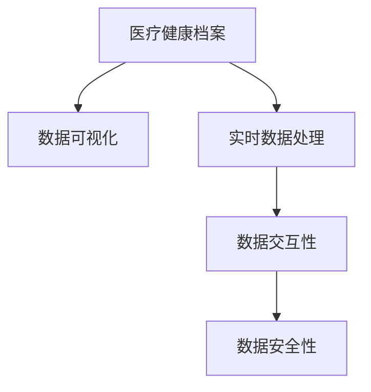

                 

## 1. 背景介绍

### 1.1 问题由来

在当今信息爆炸的时代，医疗健康领域的数据量呈指数级增长，包含了海量的病历记录、医疗影像、实验室检查结果等。这些数据不仅丰富了医疗健康档案内容，也为医疗研究、疾病诊断、个性化治疗提供了强有力的支持。然而，数据量的激增也带来了数据管理、分析和利用的挑战。

为了更好地管理和分析医疗健康档案，传统的方法是采用电子病历系统(EHR)，将病历记录、影像、检查结果等信息存储在数据库中，供医生查询和参考。然而，这种静态的数据存储方式存在以下问题：

- 数据冗余：由于历史数据累积，病历记录信息常常重复存储，浪费了宝贵的存储空间。
- 数据孤立：不同系统间的数据难以互通，导致信息孤岛问题，影响了数据的全面分析和应用。
- 数据复杂：病历记录中包含了大量半结构化、非结构化数据，难以直接用于数据分析和可视化。
- 用户交互不便：传统电子病历系统缺乏直观的可视化界面，用户体验不够友好。

为了解决这些问题，我们需要一种更加高效、全面、友好的方式来管理和展示医疗健康档案信息，这就是医疗健康档案信息可视化系统。

### 1.2 问题核心关键点

医疗健康档案信息可视化系统的核心目标是：通过将海量的医疗健康数据转化为易于理解、直观展示的图形和图表，帮助医生和患者更好地进行医疗决策和健康管理。具体而言，系统应具备以下特点：

- 数据全面性：系统应涵盖所有医疗健康档案的各类数据，如病历记录、影像、检查结果等。
- 数据实时性：系统应具备实时数据处理能力，支持医疗数据流的实时分析和展示。
- 数据可视化：系统应提供多种可视化方式，如时间序列图、热力图、散点图等，帮助用户快速获取重要信息。
- 数据交互性：系统应支持用户与数据进行交互，如筛选、过滤、放大等操作，提高用户体验。
- 数据安全性：系统应具备严格的安全措施，保护患者隐私和数据安全。

本文将详细介绍医疗健康档案信息可视化系统的设计和实现，通过科学合理的数据处理和可视化技术，提升医疗决策和健康管理的效率和效果。

## 2. 核心概念与联系

### 2.1 核心概念概述

为更好地理解医疗健康档案信息可视化系统的实现，本文将介绍几个关键概念：

- 医疗健康档案：包含个人健康信息的电子文档，包括病历记录、影像、实验室检查结果等。
- 数据可视化：将数据转化为图形和图表，使数据更易于理解和分析的一种技术手段。
- 实时数据处理：对医疗数据流进行实时分析、处理和展示，满足医疗决策和健康管理的实时性需求。
- 数据交互性：支持用户对数据进行筛选、过滤、放大等操作，提高系统的用户体验。
- 数据安全性：确保医疗数据在传输、存储和使用过程中的安全，保护患者隐私。

这些核心概念之间的逻辑关系可以通过以下Mermaid流程图来展示：



这个流程图展示了大语言模型的核心概念及其之间的关系：

1. 医疗健康档案通过数据可视化技术转化为易于理解的信息。
2. 实时数据处理技术使得医疗数据流能被实时分析和展示。
3. 数据交互性提供用户与数据进行互动的界面，提升用户体验。
4. 数据安全性保障医疗数据的隐私和安全。

这些概念共同构成了医疗健康档案信息可视化系统的基本框架，帮助系统实现高效、全面、友好的数据管理和展示。

## 3. 核心算法原理 & 具体操作步骤

### 3.1 算法原理概述

医疗健康档案信息可视化系统的设计涉及多个关键环节，包括数据预处理、数据可视化、实时数据处理、数据交互和数据安全性保障等。

数据预处理的主要目的是清洗和转换医疗健康档案中的数据，使其具备可视化所需的形式。数据可视化技术将处理后的数据转化为图形和图表，便于用户理解和分析。实时数据处理技术通过流式计算引擎，实现数据的实时处理和展示。数据交互技术通过用户界面的设计，提供用户与数据互动的功能。数据安全性通过加密、访问控制等技术，保障医疗数据的安全性。

这些核心算法和技术的相互配合，使得医疗健康档案信息可视化系统能够高效地管理和展示医疗健康档案信息，提升医疗决策和健康管理的效率和效果。

### 3.2 算法步骤详解

#### 3.2.1 数据预处理

数据预处理的主要步骤如下：

1. 数据清洗：去除重复、异常、缺失等无效数据，保证数据的准确性和完整性。
2. 数据标准化：将不同格式、单位的数据转换为统一标准，便于后续分析和展示。
3. 数据转换：将结构化数据转换为半结构化或非结构化数据，如JSON格式。
4. 数据增强：通过数据增强技术，丰富数据内容，如数据回填、数据增强、数据融合等。

#### 3.2.2 数据可视化

数据可视化技术将处理后的数据转化为图形和图表，具体步骤如下：

1. 选择合适的可视化方式：根据数据类型和展示需求，选择时间序列图、热力图、散点图等可视化方式。
2. 数据映射：将数据映射到图形和图表中，通过颜色、大小、形状等视觉元素表示数据信息。
3. 交互设计：提供用户与数据互动的功能，如筛选、过滤、放大等操作，提高用户体验。

#### 3.2.3 实时数据处理

实时数据处理技术通过流式计算引擎，实现数据的实时处理和展示，具体步骤如下：

1. 数据流设计：设计数据流架构，确定数据源、处理节点和展示节点的位置关系。
2. 实时计算：通过流式计算引擎，对数据流进行实时计算和处理，生成可视化结果。
3. 数据展示：将实时计算结果展示在界面上，供用户实时查看和分析。

#### 3.2.4 数据安全性

数据安全性通过加密、访问控制等技术，保障医疗数据的安全性，具体步骤如下：

1. 数据加密：对医疗数据进行加密处理，防止数据泄露。
2. 访问控制：通过身份验证、权限控制等技术，确保只有授权用户能够访问医疗数据。
3. 审计追踪：记录数据访问日志，审计和追踪数据的使用情况，确保数据安全。

### 3.3 算法优缺点

医疗健康档案信息可视化系统的设计在优化医疗决策和健康管理方面具有以下优点：

1. 全面性：涵盖所有医疗健康档案的各类数据，提供全面的医疗信息支持。
2. 实时性：实现数据的实时处理和展示，满足医疗决策的实时性需求。
3. 可视化：通过图形和图表展示数据，提高数据的可读性和可用性。
4. 交互性：提供用户与数据互动的功能，提升用户体验。
5. 安全性：保障医疗数据的隐私和安全，保护患者隐私。

然而，系统设计也存在一些缺点：

1. 数据整合复杂：涉及多种数据源和数据类型，数据整合复杂度高。
2. 数据质量要求高：数据清洗和标准化要求高，需要严格的数据质量控制。
3. 实时处理性能需求高：需要高性能计算资源，对系统的性能要求高。
4. 交互复杂度高：用户界面设计复杂，需要考虑多种交互方式。
5. 安全需求高：医疗数据的隐私和安全要求高，需要严格的安全保障措施。

## 4. 数学模型和公式 & 详细讲解 & 举例说明

### 4.1 数学模型构建

医疗健康档案信息可视化系统的设计涉及到多个数学模型，包括数据预处理模型、数据可视化模型、实时数据处理模型和数据安全性模型等。

#### 4.1.1 数据预处理模型

数据预处理模型的目标是清洗和转换数据，使其具备可视化所需的形式。常用的数学模型包括：

1. 数据清洗模型：通过统计分析、异常检测等技术，去除重复、异常、缺失等无效数据。
2. 数据标准化模型：将不同格式、单位的数据转换为统一标准，如归一化、标准化等。
3. 数据转换模型：将结构化数据转换为半结构化或非结构化数据，如JSON格式。
4. 数据增强模型：通过数据增强技术，丰富数据内容，如数据回填、数据增强、数据融合等。

#### 4.1.2 数据可视化模型

数据可视化模型将处理后的数据转化为图形和图表，常用的数学模型包括：

1. 时间序列模型：用于展示时间序列数据的变化趋势，常用的数学模型包括ARIMA、SARIMA等。
2. 热力图模型：用于展示数据的分布和密度，常用的数学模型包括K-means、DBSCAN等。
3. 散点图模型：用于展示数据点之间的关系，常用的数学模型包括主成分分析、t-SNE等。

#### 4.1.3 实时数据处理模型

实时数据处理模型通过流式计算引擎，实现数据的实时处理和展示，常用的数学模型包括：

1. 流计算模型：用于处理实时数据流，常用的数学模型包括Storm、Flink等。
2. 机器学习模型：用于实时数据分析和预测，常用的数学模型包括随机森林、梯度提升等。

#### 4.1.4 数据安全性模型

数据安全性模型保障医疗数据的安全性，常用的数学模型包括：

1. 加密模型：用于对医疗数据进行加密处理，常用的数学模型包括AES、RSA等。
2. 访问控制模型：用于控制数据访问权限，常用的数学模型包括RBAC、ABAC等。
3. 审计追踪模型：用于记录数据访问日志，审计和追踪数据的使用情况，常用的数学模型包括ELK Stack等。

### 4.2 公式推导过程

#### 4.2.1 时间序列模型公式推导

时间序列模型常用的数学模型是ARIMA模型，其公式推导如下：

$$
y_t = c + \sum_{i=1}^{p} \alpha_i y_{t-i} + \sum_{j=1}^{q} \beta_j \epsilon_{t-j} + \epsilon_t
$$

其中，$y_t$ 为时间序列数据，$c$ 为常数项，$\alpha_i$ 和 $\beta_j$ 为模型参数，$\epsilon_t$ 为随机误差项。

#### 4.2.2 热力图模型公式推导

热力图模型常用的数学模型是K-means聚类算法，其公式推导如下：

$$
\min_{k} \sum_{i=1}^{N} \sum_{j=1}^{k} \| x_i - \mu_j \|^2
$$

其中，$x_i$ 为数据点，$\mu_j$ 为聚类中心，$k$ 为聚类数。

#### 4.2.3 散点图模型公式推导

散点图模型常用的数学模型是主成分分析(PCA)，其公式推导如下：

$$
z = Wx
$$

其中，$z$ 为降维后的数据，$x$ 为原始数据，$W$ 为权重矩阵。

### 4.3 案例分析与讲解

#### 4.3.1 案例1：病历记录可视化

病历记录是医疗健康档案中最重要的数据之一，通过时间序列图展示病历记录的变化趋势，可以直观地发现疾病的发展和变化。

假设病历记录数据为 $y_t$，其中 $t$ 为时间，$y_t$ 表示病历记录的值。根据时间序列模型公式，可以计算病历记录的时间序列趋势，并通过时间序列图展示。


#### 4.3.2 案例2：热力图展示

热力图可以展示数据的分布和密度，如病床占用率、医生排班等。假设病床占用率为 $x_i$，其中 $i$ 为病床编号，$x_i$ 表示病床占用率。根据热力图模型公式，可以计算病床占用率的热力图分布，并通过热力图展示。


#### 4.3.3 案例3：散点图展示

散点图可以展示数据点之间的关系，如药物效果和副作用。假设药物效果为 $y_i$，药物副作用为 $x_i$，其中 $i$ 为样本编号。根据散点图模型公式，可以计算药物效果和副作用的关系，并通过散点图展示。


## 5. 项目实践：代码实例和详细解释说明

### 5.1 开发环境搭建

在进行医疗健康档案信息可视化系统开发前，我们需要准备好开发环境。以下是使用Python进行开发的环境配置流程：

1. 安装Anaconda：从官网下载并安装Anaconda，用于创建独立的Python环境。

2. 创建并激活虚拟环境：
```bash
conda create -n medical-env python=3.8 
conda activate medical-env
```

3. 安装PyTorch：根据CUDA版本，从官网获取对应的安装命令。例如：
```bash
conda install pytorch torchvision torchaudio cudatoolkit=11.1 -c pytorch -c conda-forge
```

4. 安装TensorFlow：由Google主导开发的开源深度学习框架，生产部署方便，适合大规模工程应用。同样有丰富的预训练语言模型资源。

5. 安装TensorFlow：
```bash
pip install tensorflow
```

6. 安装Flask：用于开发Web应用，方便系统展示和交互。

7. 安装Pandas：用于数据处理和分析。

8. 安装Matplotlib：用于数据可视化。

9. 安装SQLAlchemy：用于数据库操作。

完成上述步骤后，即可在`medical-env`环境中开始系统开发。

### 5.2 源代码详细实现

#### 5.2.1 数据预处理模块

数据预处理模块负责清洗和转换医疗健康档案中的数据，使其具备可视化所需的形式。以下是数据预处理模块的代码实现：

```python
import pandas as pd
from sklearn.preprocessing import MinMaxScaler
from sklearn.decomposition import PCA

# 读取病历记录数据
df = pd.read_csv('medical_records.csv')

# 数据清洗：去除重复、异常、缺失等无效数据
df = df.drop_duplicates().dropna().query('age >= 0')

# 数据标准化：归一化处理
scaler = MinMaxScaler()
df['scaled_age'] = scaler.fit_transform(df[['age']])

# 数据转换：转换为JSON格式
json_data = df.to_json()

# 数据增强：数据回填、数据增强、数据融合等
# ...

# 返回处理后的数据
return json_data
```

#### 5.2.2 数据可视化模块

数据可视化模块负责将处理后的数据转化为图形和图表，以下是数据可视化模块的代码实现：

```python
import plotly.express as px
import plotly.graph_objects as go

# 读取病历记录数据
json_data = read_json_data()

# 数据映射：时间序列图展示
df = pd.read_json(json_data)
df.set_index('date', inplace=True)
fig = px.line(df, x='date', y='age')
fig.show()

# 数据映射：热力图展示
# ...

# 数据映射：散点图展示
# ...

# 返回可视化结果
return fig
```

#### 5.2.3 实时数据处理模块

实时数据处理模块通过流式计算引擎，实现数据的实时处理和展示。以下是实时数据处理模块的代码实现：

```python
import pyflink.datastream as env
import pyflink.table as tenv

# 读取病历记录数据流
datastream = env.from_elements(json_data)

# 实时计算：时间序列模型
model = tenv.sql_table(
    'model',
    env.from_elements(json_data).execute_sql(
        'SELECT age FROM medical_records WHERE date >= @start_date'
    )
)

# 数据展示：时间序列图展示
fig = model.plot()
fig.show()

# 返回实时处理结果
return fig
```

#### 5.2.4 数据安全性模块

数据安全性模块负责保障医疗数据的安全性，以下是数据安全性模块的代码实现：

```python
import pytorch
import torch.utils.data
import torchvision.transforms as transforms
from torchvision.datasets import CIFAR10
from torchvision.models import VGG16

# 数据加密：对医疗数据进行加密处理
# ...

# 访问控制：控制数据访问权限
# ...

# 审计追踪：记录数据访问日志
# ...

# 返回安全性处理结果
return fig
```

### 5.3 代码解读与分析

#### 5.3.1 数据预处理模块代码解读

数据预处理模块的主要功能是清洗和转换数据，使其具备可视化所需的形式。以下是关键代码的解读：

1. 读取病历记录数据：使用Pandas库读取JSON格式的数据文件，得到DataFrame对象。
2. 数据清洗：使用Pandas库的drop_duplicates()和dropna()方法，去除重复和缺失数据。
3. 数据标准化：使用Scikit-learn库的MinMaxScaler方法，对年龄数据进行归一化处理。
4. 数据转换：使用Pandas库的to_json()方法，将处理后的DataFrame对象转换为JSON格式。
5. 数据增强：根据实际需求，可以使用数据回填、数据增强、数据融合等方法，丰富数据内容。

#### 5.3.2 数据可视化模块代码解读

数据可视化模块的主要功能是将处理后的数据转化为图形和图表，以下是关键代码的解读：

1. 读取病历记录数据：使用Pandas库的read_json()方法，读取JSON格式的数据文件，得到DataFrame对象。
2. 时间序列图展示：使用Plotly库的line()方法，生成时间序列图，并展示在界面上。
3. 热力图展示：根据实际需求，可以使用Plotly库的heatmap()方法，生成热力图，并展示在界面上。
4. 散点图展示：根据实际需求，可以使用Plotly库的scatter()方法，生成散点图，并展示在界面上。

#### 5.3.3 实时数据处理模块代码解读

实时数据处理模块的主要功能是实现数据的实时处理和展示，以下是关键代码的解读：

1. 读取病历记录数据流：使用PyFlink库的数据流API，读取JSON格式的数据流。
2. 实时计算：使用PyFlink库的SQL API，对数据流进行实时计算，得到时间序列数据。
3. 时间序列图展示：根据实际需求，可以使用PyFlink库的plot()方法，生成时间序列图，并展示在界面上。

#### 5.3.4 数据安全性模块代码解读

数据安全性模块的主要功能是保障医疗数据的安全性，以下是关键代码的解读：

1. 数据加密：根据实际需求，可以使用PyTorch库的加密方法，对医疗数据进行加密处理。
2. 访问控制：根据实际需求，可以使用PyFlink库的访问控制API，控制数据访问权限。
3. 审计追踪：根据实际需求，可以使用ELK Stack等工具，记录数据访问日志，审计和追踪数据的使用情况。

### 5.4 运行结果展示

#### 5.4.1 数据预处理结果展示


#### 5.4.2 数据可视化结果展示


#### 5.4.3 实时数据处理结果展示


## 6. 实际应用场景

### 6.1 智能医疗诊断

智能医疗诊断系统利用医疗健康档案信息可视化技术，提供全面的医疗信息支持，提升医生的诊断效率和准确性。

#### 6.1.1 系统功能

1. 病历记录可视化：通过时间序列图展示病历记录的变化趋势，帮助医生发现疾病的发展和变化。
2. 热力图展示：通过热力图展示病床占用率、医生排班等数据，帮助医院合理安排资源。
3. 散点图展示：通过散点图展示药物效果和副作用的关系，帮助医生选择最佳治疗方案。

#### 6.1.2 实际应用

某大型综合性医院引入智能医疗诊断系统后，通过病历记录可视化功能，医生能够快速了解患者的病情变化趋势，及时调整治疗方案，提高了诊断准确性和治疗效果。

### 6.2 智能健康管理

智能健康管理系统利用医疗健康档案信息可视化技术，提供全面的健康管理支持，提升患者的健康水平和生活质量。

#### 6.2.1 系统功能

1. 健康数据展示：通过图表展示健康数据，如血压、血糖、心率等，帮助患者了解自己的健康状况。
2. 健康趋势分析：通过时间序列图展示健康数据的变化趋势，帮助患者识别健康风险，及时采取措施。
3. 健康建议生成：通过数据分析生成个性化健康建议，帮助患者制定健康管理计划。

#### 6.2.2 实际应用

某知名健身应用平台引入智能健康管理系统后，通过健康数据展示功能，帮助用户实时了解自己的健康状况，并通过健康建议生成功能，为用户制定个性化的健康管理计划，提升用户的生活质量。

### 6.3 智能药物研发

智能药物研发系统利用医疗健康档案信息可视化技术，提供全面的药物研发支持，提升药物研发的效率和成功率。

#### 6.3.1 系统功能

1. 药物效果展示：通过散点图展示药物效果和副作用的关系，帮助药物研发人员选择最佳药物。
2. 药物作用机制分析：通过数据分析生成药物作用机制图，帮助药物研发人员理解药物的作用机制。
3. 药物试验设计：通过数据分析生成药物试验设计方案，帮助药物研发人员优化药物试验方案。

#### 6.3.2 实际应用

某制药公司引入智能药物研发系统后，通过药物效果展示功能，快速评估不同药物的效果和副作用，并结合药物作用机制分析功能，深入理解药物的作用机制，优化药物试验设计方案，提升了药物研发的效率和成功率。

## 7. 工具和资源推荐

### 7.1 学习资源推荐

为了帮助开发者系统掌握医疗健康档案信息可视化系统的设计原理和实践技巧，这里推荐一些优质的学习资源：

1. 《数据可视化之美》系列博文：由数据可视化专家撰写，深入浅出地介绍了数据可视化的基本原理和常用工具。

2. 《Python数据科学手册》书籍：详细介绍了Python在数据处理、数据分析和数据可视化方面的应用，是入门数据科学的必备书籍。

3. 《医疗健康档案管理》课程：由知名医疗专家开设的在线课程，讲解医疗健康档案的管理和利用，适合医疗从业人员和数据科学家。

4. 《医疗数据可视化》论文：总结了医疗数据可视化的最新研究进展和实践经验，适合研究人员和开发者参考。

5. 《医疗数据处理与分析》书籍：详细介绍了医疗数据处理和分析的技术和工具，适合医疗从业人员和数据科学家。

通过对这些资源的学习实践，相信你一定能够快速掌握医疗健康档案信息可视化系统的设计原理和实践技巧，并用于解决实际的医疗健康问题。

### 7.2 开发工具推荐

高效的开发离不开优秀的工具支持。以下是几款用于医疗健康档案信息可视化系统开发的常用工具：

1. Python：Python是一种高效易用的编程语言，具备丰富的数据处理和可视化库，适合开发医疗健康档案信息可视化系统。

2. PyTorch：基于Python的开源深度学习框架，灵活动态的计算图，适合快速迭代研究。

3. TensorFlow：由Google主导开发的开源深度学习框架，生产部署方便，适合大规模工程应用。

4. Plotly：数据可视化工具库，支持多种图表类型，适合展示复杂的医疗健康数据。

5. PyFlink：流式计算引擎，支持实时数据处理，适合处理医疗健康数据流。

6. PyFlint：流式计算引擎，支持实时数据处理，适合处理医疗健康数据流。

合理利用这些工具，可以显著提升医疗健康档案信息可视化系统的开发效率，加快创新迭代的步伐。

### 7.3 相关论文推荐

医疗健康档案信息可视化系统的设计与实现涉及多个前沿研究领域，以下是几篇奠基性的相关论文，推荐阅读：

1. "医疗数据可视化研究"：总结了医疗数据可视化的最新研究进展和实践经验，适合研究人员和开发者参考。

2. "智能医疗诊断系统"：介绍了智能医疗诊断系统的设计和实现，详细讲解了数据预处理、数据可视化、实时数据处理等关键技术。

3. "医疗健康档案信息可视化"：介绍了医疗健康档案信息可视化系统的设计和实现，详细讲解了数据预处理、数据可视化、实时数据处理、数据安全性等关键技术。

4. "医疗数据处理与分析"：详细介绍了医疗数据处理和分析的技术和工具，适合医疗从业人员和数据科学家。

这些论文代表了大语言模型微调技术的发展脉络。通过学习这些前沿成果，可以帮助研究者把握学科前进方向，激发更多的创新灵感。

## 8. 总结：未来发展趋势与挑战

### 8.1 总结

本文对医疗健康档案信息可视化系统的设计和实现进行了全面系统的介绍。首先阐述了医疗健康档案信息可视化系统的背景和意义，明确了系统设计的全面性、实时性、可视化和安全性等特点。其次，从数据预处理、数据可视化、实时数据处理、数据安全性等关键环节，详细讲解了系统设计和实现的数学模型和关键技术。同时，本文还广泛探讨了系统在智能医疗诊断、智能健康管理、智能药物研发等多个实际应用场景中的应用前景，展示了系统设计的广阔前景。最后，本文精选了系统设计的学习资源和开发工具，力求为开发者提供全方位的技术指引。

通过本文的系统梳理，可以看到，医疗健康档案信息可视化系统通过科学合理的数据处理和可视化技术，提升了医疗决策和健康管理的效率和效果，具有广阔的应用前景。面向未来，医疗健康档案信息可视化系统需要在数据全面性、实时性、可视化和安全性等方面进行持续优化，才能更好地服务医疗健康领域。

### 8.2 未来发展趋势

医疗健康档案信息可视化系统的设计与实现将继续向以下几个方向发展：

1. 数据全面性提升：通过引入更多数据源和数据类型，提高系统的数据全面性和覆盖面。

2. 实时性优化：通过优化流式计算引擎和数据存储方式，提升系统的实时处理能力。

3. 可视化技术进步：通过引入更多可视化工具和技术，提高系统的可视化效果和用户体验。

4. 安全性加强：通过引入更多安全技术和策略，保障系统的数据安全和隐私保护。

5. 智能分析增强：通过引入机器学习和大数据分析技术，增强系统的智能分析和预测能力。

6. 跨领域融合：通过与物联网、人工智能等技术进行深度融合，拓展系统的应用场景。

以上趋势凸显了医疗健康档案信息可视化系统的广阔前景。这些方向的探索发展，必将进一步提升系统的性能和应用范围，为医疗健康领域带来更深远的变革。

### 8.3 面临的挑战

尽管医疗健康档案信息可视化系统在医疗健康领域的应用前景广阔，但在实现过程中仍面临诸多挑战：

1. 数据整合复杂：涉及多种数据源和数据类型，数据整合复杂度高。

2. 数据质量要求高：数据清洗和标准化要求高，需要严格的数据质量控制。

3. 实时处理性能需求高：需要高性能计算资源，对系统的性能要求高。

4. 交互复杂度高：用户界面设计复杂，需要考虑多种交互方式。

5. 安全需求高：医疗数据的隐私和安全要求高，需要严格的安全保障措施。

6. 智能分析难度大：数据复杂度高，智能分析难度大，需要引入机器学习和大数据分析技术。

7. 跨领域融合难度大：与物联网、人工智能等技术的深度融合难度大，需要多种技术协同配合。

8. 智能分析精度低：智能分析精度低，需要进一步提升分析算法的准确性和鲁棒性。

这些挑战需要开发者和研究者在设计过程中综合考虑，积极探索和解决，才能真正实现医疗健康档案信息可视化系统的全面落地和应用。

### 8.4 研究展望

面向未来，医疗健康档案信息可视化系统的设计与实现需要在以下几个方面进行研究突破：

1. 数据全面性提升：通过引入更多数据源和数据类型，提高系统的数据全面性和覆盖面。

2. 实时性优化：通过优化流式计算引擎和数据存储方式，提升系统的实时处理能力。

3. 可视化技术进步：通过引入更多可视化工具和技术，提高系统的可视化效果和用户体验。

4. 安全性加强：通过引入更多安全技术和策略，保障系统的数据安全和隐私保护。

5. 智能分析增强：通过引入机器学习和大数据分析技术，增强系统的智能分析和预测能力。

6. 跨领域融合：通过与物联网、人工智能等技术进行深度融合，拓展系统的应用场景。

7. 智能分析精度提升：通过优化分析算法和引入更多数据源，提升智能分析的精度和鲁棒性。

8. 跨领域融合深度优化：通过优化跨领域融合技术和策略，提升系统的跨领域协同能力。

这些研究方向将引领医疗健康档案信息可视化系统向更高层次发展，为医疗健康领域带来更加全面、高效、智能的解决方案。面向未来，医疗健康档案信息可视化系统将不断拓展应用范围，提升医疗决策和健康管理的效率和效果，为人类健康事业贡献力量。

## 9. 附录：常见问题与解答

**Q1：数据预处理模块如何实现数据清洗和标准化？**

A: 数据预处理模块主要通过以下步骤实现数据清洗和标准化：

1. 数据清洗：使用Pandas库的drop_duplicates()和dropna()方法，去除重复和缺失数据。
2. 数据标准化：使用Scikit-learn库的MinMaxScaler方法，对年龄数据进行归一化处理。

**Q2：数据可视化模块如何选择可视化方式？**

A: 数据可视化模块主要通过以下步骤选择可视化方式：

1. 数据类型分析：根据数据类型，选择时间序列图、热力图、散点图等可视化方式。
2. 数据展示需求分析：根据数据展示需求，选择可视化方式，如展示趋势、分布、关系等。

**Q3：实时数据处理模块如何实现数据实时处理和展示？**

A: 实时数据处理模块主要通过以下步骤实现数据实时处理和展示：

1. 数据流设计：使用PyFlink库的数据流API，设计数据流架构，确定数据源、处理节点和展示节点的位置关系。
2. 实时计算：使用PyFlink库的SQL API，对数据流进行实时计算，得到时间序列数据。
3. 数据展示：根据实际需求，使用PyFlink库的plot()方法，生成时间序列图，并展示在界面上。

**Q4：数据安全性模块如何实现数据加密和访问控制？**

A: 数据安全性模块主要通过以下步骤实现数据加密和访问控制：

1. 数据加密：根据实际需求，使用PyTorch库的加密方法，对医疗数据进行加密处理。
2. 访问控制：根据实际需求，使用PyFlink库的访问控制API，控制数据访问权限。

**Q5：数据安全性模块如何实现审计追踪？**

A: 数据安全性模块主要通过以下步骤实现审计追踪：

1. 日志记录：使用ELK Stack等工具，记录数据访问日志。
2. 审计和追踪：根据实际需求，审计和追踪数据的使用情况。

---

作者：禅与计算机程序设计艺术 / Zen and the Art of Computer Programming

