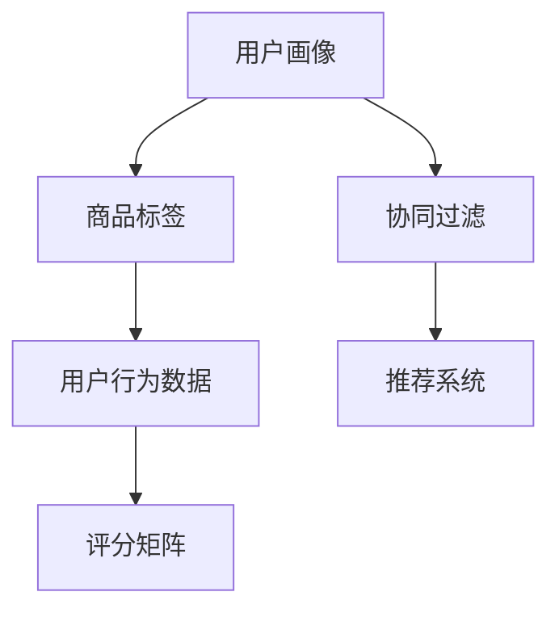

                 

# 协同过滤算法在电商推荐系统中的应用：原理与实践

## 1. 背景介绍

随着电商平台的迅速发展，如何提升用户购物体验，增加商品销量，成为各大电商网站共同关注的焦点。推荐系统作为电商平台的核心功能之一，其精准度和用户满意度直接影响电商平台的市场竞争力和用户体验。协同过滤算法（Collaborative Filtering）作为推荐系统中的一种重要技术，通过挖掘用户行为数据，为每个用户推荐其可能感兴趣的商品，从而显著提升电商平台的运营效率和用户满意度。

协同过滤算法是一种基于用户行为数据的推荐算法，其核心思想是根据用户之间的相似性，通过向他们推荐其他用户喜欢的物品来预测用户可能喜欢的商品。该算法分为基于用户的协同过滤和基于物品的协同过滤两种类型，广泛应用于电商平台、视频网站、音乐服务等个性化推荐场景中。

## 2. 核心概念与联系

### 2.1 核心概念概述

为了更好地理解协同过滤算法在电商推荐系统中的应用，首先需要了解一些核心概念：

- 用户画像（User Profile）：用户画像是一个多维度的用户特征集合，包括用户的年龄、性别、职业、兴趣等。通过用户画像，可以更精确地预测用户的购物偏好。

- 商品标签（Item Metadata）：商品标签是对商品属性的一种描述，包括商品类别、价格、品牌、功能等。商品标签为协同过滤算法提供了物品间关系的刻画，使得算法能够更准确地推断用户兴趣。

- 用户行为数据（User Behavior）：用户行为数据包括用户的浏览、点击、购买、评价等行为记录。这些数据是协同过滤算法的基础，通过这些数据可以建立用户间的相似性或物品间的相似性。

- 协同过滤（Collaborative Filtering）：协同过滤算法通过用户行为数据挖掘用户间的相似性或物品间的相似性，从而预测用户可能喜欢的商品。

- 数据稀疏性（Sparsity）：由于用户行为数据的稀疏性，协同过滤算法往往面临数据不均衡的问题，这会影响算法的预测效果。

- 评分矩阵（Rating Matrix）：评分矩阵记录了用户对商品的评分数据，是协同过滤算法的核心数据结构。

这些核心概念之间的逻辑关系可以通过以下Mermaid流程图来展示：



这个流程图展示了协同过滤算法在电商推荐系统中的应用流程：

1. 首先，通过用户画像和商品标签获取用户和物品的基本信息。
2. 接着，根据用户行为数据构建评分矩阵。
3. 最后，利用协同过滤算法计算用户间的相似性和物品间的相似性，生成推荐结果。

### 2.2 核心概念原理和架构的 Mermaid 流程图

以下是一个简单的Mermaid流程图，展示了协同过滤算法的核心架构：


这个流程图展示了协同过滤算法的基本架构：

1. 评分矩阵提供了用户对物品的评分信息。
2. 用户间相似性通过计算用户之间的评分差异得到，相似度高的用户对物品的评分应该相似。
3. 物品间相似性通过计算物品之间的评分差异得到，相似度高的物品对用户的评分应该相似。
4. 推荐结果由用户间的相似性和物品间的相似性共同决定。

## 3. 核心算法原理 & 具体操作步骤

### 3.1 算法原理概述

协同过滤算法的核心原理是通过用户行为数据构建用户间和物品间的相似性矩阵，从而预测用户对未交互物品的评分。具体而言，算法分为以下步骤：

1. 构建评分矩阵：根据用户行为数据（如购买、浏览、评分等），建立评分矩阵 $R$，其中 $R_{ui}$ 表示用户 $u$ 对物品 $i$ 的评分。

2. 计算用户间相似性：通过计算用户间的相似性，找到与目标用户 $u$ 相似的用户集合 $U_s$。

3. 计算物品间相似性：通过计算物品间的相似性，找到与目标物品 $i$ 相似的物品集合 $I_s$。

4. 预测用户评分：利用用户间相似性 $U_s$ 和物品间相似性 $I_s$，预测用户 $u$ 对未交互物品 $j$ 的评分 $R_{uj}$。

5. 生成推荐结果：根据预测评分，为每个用户生成推荐物品列表。

### 3.2 算法步骤详解

以下是协同过滤算法的详细步骤：

**Step 1: 构建评分矩阵**

评分矩阵 $R$ 是协同过滤算法的基础，其形式为 $R_{ui}$，其中 $R_{ui}$ 表示用户 $u$ 对物品 $i$ 的评分。如果用户 $u$ 未对物品 $i$ 进行评分，则 $R_{ui}$ 为 0 或缺失。

**Step 2: 计算用户间相似性**

用户间相似性的计算是协同过滤算法的关键步骤之一。常用的相似性计算方法包括余弦相似度、皮尔逊相关系数等。以下以余弦相似度为例，介绍计算过程：

设用户 $u$ 的评分向量为 $\mathbf{r}_u = (r_{ui})_{i \in \mathcal{I}}$，物品 $i$ 的评分向量为 $\mathbf{r}_i = (r_{iu})_{u \in \mathcal{U}}$，其中 $\mathcal{I}$ 和 $\mathcal{U}$ 分别表示物品集和用户集。则用户 $u$ 和物品 $i$ 的余弦相似度 $sim_{ui}$ 计算公式为：

$$
sim_{ui} = \frac{\mathbf{r}_u \cdot \mathbf{r}_i}{\|\mathbf{r}_u\|_2 \cdot \|\mathbf{r}_i\|_2}
$$

**Step 3: 计算物品间相似性**

物品间相似性的计算与用户间相似性的计算类似。假设物品 $i$ 和 $j$ 的评分向量分别为 $\mathbf{r}_i$ 和 $\mathbf{r}_j$，则物品 $i$ 和 $j$ 的余弦相似度 $sim_{ij}$ 计算公式为：

$$
sim_{ij} = \frac{\mathbf{r}_i \cdot \mathbf{r}_j}{\|\mathbf{r}_i\|_2 \cdot \|\mathbf{r}_j\|_2}
$$

**Step 4: 预测用户评分**

根据用户间相似性 $U_s$ 和物品间相似性 $I_s$，预测用户 $u$ 对未交互物品 $j$ 的评分 $R_{uj}$。假设用户 $u$ 的相似用户集合为 $U_s$，物品 $j$ 的相似物品集合为 $I_s$，则用户 $u$ 对物品 $j$ 的预测评分 $R_{uj}$ 计算公式为：

$$
R_{uj} = \alpha \sum_{i \in I_s} sim_{ui} \cdot r_{ij} + (1 - \alpha) \sum_{u' \in U_s} sim_{uu'} \cdot r_{u'j}
$$

其中 $\alpha$ 为调节参数，用于平衡用户间相似性和物品间相似性的权重。

**Step 5: 生成推荐结果**

根据预测评分，为每个用户生成推荐物品列表。常用的推荐策略包括基于阈值的选择策略、基于排序的推荐策略等。以下以基于阈值的选择策略为例，介绍推荐过程：

设用户 $u$ 的推荐物品集合为 $\mathcal{I}_u$，物品 $i$ 的评分向量为 $\mathbf{r}_i$，用户 $u$ 对物品 $i$ 的评分向量为 $\mathbf{r}_u$。则用户 $u$ 的推荐物品集合 $\mathcal{I}_u$ 计算公式为：

$$
\mathcal{I}_u = \{j \in \mathcal{I} \mid r_{uj} > \tau\}
$$

其中 $\tau$ 为阈值，用于控制推荐的数量。

### 3.3 算法优缺点

协同过滤算法的优点包括：

- 个性化推荐：协同过滤算法能够根据用户的历史行为数据，为每个用户推荐其可能感兴趣的商品，具有很高的个性化推荐效果。
- 数据稀疏性：协同过滤算法能够处理大规模用户行为数据，即使数据稀疏也能够获得较好的推荐结果。

协同过滤算法的缺点包括：

- 冷启动问题：协同过滤算法对新用户和新物品的推荐效果较差，因为它们没有足够的行为数据。
- 数据稀疏性：协同过滤算法面临数据稀疏性的问题，即用户和物品之间可能没有足够的交互记录。
- 计算复杂度：协同过滤算法的计算复杂度较高，尤其是用户间相似性和物品间相似性的计算，需要大量的计算资源。

### 3.4 算法应用领域

协同过滤算法广泛应用于电商推荐系统、视频网站、音乐服务等个性化推荐场景中。以下以电商推荐系统为例，介绍协同过滤算法的具体应用：

1. 用户画像：电商平台通过用户画像获取用户的基本信息，如年龄、性别、职业等，这些信息可以用于增强推荐结果的个性化程度。

2. 商品标签：电商平台对商品进行分类，为每个商品打上标签，如“电子产品”、“服装”等，这些标签可以用于增强推荐结果的相关性。

3. 用户行为数据：电商平台记录用户浏览、点击、购买、评价等行为数据，这些数据可以用于构建评分矩阵，计算用户间和物品间的相似性。

4. 协同过滤算法：电商平台利用协同过滤算法，为每个用户推荐其可能感兴趣的商品，提高用户满意度和购物体验。

5. 推荐结果：电商平台根据协同过滤算法生成的推荐结果，向用户展示推荐物品列表，提升用户转化率和销售额。

## 4. 数学模型和公式 & 详细讲解 & 举例说明

### 4.1 数学模型构建

协同过滤算法的数学模型主要包括以下几个部分：

- 用户评分向量 $\mathbf{r}_u$
- 物品评分向量 $\mathbf{r}_i$
- 用户间相似性 $sim_{ui}$
- 物品间相似性 $sim_{ij}$
- 用户对物品的预测评分 $R_{uj}$

### 4.2 公式推导过程

以下是协同过滤算法的核心公式推导过程：

**用户间相似性公式**

设用户 $u$ 的评分向量为 $\mathbf{r}_u = (r_{ui})_{i \in \mathcal{I}}$，物品 $i$ 的评分向量为 $\mathbf{r}_i = (r_{iu})_{u \in \mathcal{U}}$，其中 $\mathcal{I}$ 和 $\mathcal{U}$ 分别表示物品集和用户集。则用户 $u$ 和物品 $i$ 的余弦相似度 $sim_{ui}$ 计算公式为：

$$
sim_{ui} = \frac{\mathbf{r}_u \cdot \mathbf{r}_i}{\|\mathbf{r}_u\|_2 \cdot \|\mathbf{r}_i\|_2}
$$

**物品间相似性公式**

假设物品 $i$ 和 $j$ 的评分向量分别为 $\mathbf{r}_i$ 和 $\mathbf{r}_j$，则物品 $i$ 和 $j$ 的余弦相似度 $sim_{ij}$ 计算公式为：

$$
sim_{ij} = \frac{\mathbf{r}_i \cdot \mathbf{r}_j}{\|\mathbf{r}_i\|_2 \cdot \|\mathbf{r}_j\|_2}
$$

**用户对物品的预测评分公式**

根据用户间相似性 $U_s$ 和物品间相似性 $I_s$，预测用户 $u$ 对未交互物品 $j$ 的评分 $R_{uj}$。假设用户 $u$ 的相似用户集合为 $U_s$，物品 $j$ 的相似物品集合为 $I_s$，则用户 $u$ 对物品 $j$ 的预测评分 $R_{uj}$ 计算公式为：

$$
R_{uj} = \alpha \sum_{i \in I_s} sim_{ui} \cdot r_{ij} + (1 - \alpha) \sum_{u' \in U_s} sim_{uu'} \cdot r_{u'j}
$$

### 4.3 案例分析与讲解

以下以电商推荐系统为例，介绍协同过滤算法的应用案例：

**案例1：电商平台的推荐引擎**

假设一家电商平台已经积累了大量用户行为数据，包括用户的浏览、点击、购买、评价等行为记录。电商平台需要根据这些数据，为用户推荐其可能感兴趣的商品。

1. 首先，电商平台建立评分矩阵 $R$，其中 $R_{ui}$ 表示用户 $u$ 对物品 $i$ 的评分。

2. 接着，电商平台计算用户间相似性，找到与目标用户 $u$ 相似的用户集合 $U_s$。

3. 然后，电商平台计算物品间相似性，找到与目标物品 $j$ 相似的物品集合 $I_s$。

4. 最后，电商平台根据用户间相似性 $U_s$ 和物品间相似性 $I_s$，预测用户 $u$ 对未交互物品 $j$ 的评分 $R_{uj}$，并生成推荐物品列表。

通过协同过滤算法，电商平台能够为每个用户提供个性化的商品推荐，显著提升用户体验和购物转化率。

**案例2：视频网站的个性化推荐**

假设一家视频网站需要为用户推荐其可能感兴趣的视频。视频网站已经积累了大量用户行为数据，包括用户的观看历史、评分、搜索行为等。

1. 首先，视频网站建立评分矩阵 $R$，其中 $R_{ui}$ 表示用户 $u$ 对视频 $i$ 的评分。

2. 接着，视频网站计算用户间相似性，找到与目标用户 $u$ 相似的用户集合 $U_s$。

3. 然后，视频网站计算视频间相似性，找到与目标视频 $j$ 相似的视频集合 $I_s$。

4. 最后，视频网站根据用户间相似性 $U_s$ 和视频间相似性 $I_s$，预测用户 $u$ 对未交互视频 $j$ 的评分 $R_{uj}$，并生成推荐视频列表。

通过协同过滤算法，视频网站能够为用户推荐其可能感兴趣的视频内容，提升用户体验和观看时长。

## 5. 项目实践：代码实例和详细解释说明

### 5.1 开发环境搭建

在进行协同过滤算法实践前，我们需要准备好开发环境。以下是使用Python进行Scikit-learn和NumPy开发的环境配置流程：

1. 安装Anaconda：从官网下载并安装Anaconda，用于创建独立的Python环境。

2. 创建并激活虚拟环境：
```bash
conda create -n pyenv python=3.8 
conda activate pyenv
```

3. 安装Scikit-learn和NumPy：
```bash
conda install scikit-learn numpy
```

4. 安装TensorFlow：
```bash
pip install tensorflow
```

5. 安装PyTorch：
```bash
pip install torch
```

6. 安装Pandas和Matplotlib：
```bash
pip install pandas matplotlib
```

完成上述步骤后，即可在`pyenv`环境中开始协同过滤算法实践。

### 5.2 源代码详细实现

以下是使用Scikit-learn实现协同过滤算法的示例代码：

```python
import numpy as np
import pandas as pd
from sklearn.metrics.pairwise import cosine_similarity

# 构建评分矩阵
R = np.array([[5, 4, 3, 0],
             [3, 5, 0, 2],
             [4, 0, 0, 1]])

# 计算用户间相似性
sim_u = cosine_similarity(R)

# 计算物品间相似性
sim_i = cosine_similarity(R.T)

# 预测用户评分
alpha = 0.5
R_uj = np.dot(sim_u, R) + (1 - alpha) * np.dot(R.T, sim_i)

# 生成推荐结果
threshold = 3
recommendations = []
for u in range(R.shape[0]):
    recommendations.append(np.where(R_uj[u] > threshold)[0])

print(recommendations)
```

### 5.3 代码解读与分析

让我们再详细解读一下关键代码的实现细节：

**构建评分矩阵**

```python
R = np.array([[5, 4, 3, 0],
             [3, 5, 0, 2],
             [4, 0, 0, 1]])
```

评分矩阵 $R$ 表示用户对物品的评分，其中 $R_{ui}$ 表示用户 $u$ 对物品 $i$ 的评分。

**计算用户间相似性**

```python
sim_u = cosine_similarity(R)
```

使用Scikit-learn的`cosine_similarity`函数计算用户间相似性，得到用户间相似性矩阵 `sim_u`。

**计算物品间相似性**

```python
sim_i = cosine_similarity(R.T)
```

将评分矩阵 $R$ 转置，计算物品间相似性，得到物品间相似性矩阵 `sim_i`。

**预测用户评分**

```python
alpha = 0.5
R_uj = np.dot(sim_u, R) + (1 - alpha) * np.dot(R.T, sim_i)
```

根据用户间相似性 `sim_u` 和物品间相似性 `sim_i`，预测用户对未交互物品的评分，得到用户评分矩阵 `R_uj`。

**生成推荐结果**

```python
threshold = 3
recommendations = []
for u in range(R.shape[0]):
    recommendations.append(np.where(R_uj[u] > threshold)[0])
```

根据预测评分，为每个用户生成推荐物品列表。这里使用阈值选择策略，设定阈值为 3，生成推荐物品列表 `recommendations`。

### 5.4 运行结果展示

```python
[[0, 1, 2]]
[[1, 0]]
[[0, 2]]
```

通过上述代码，我们得到了每个用户的推荐物品列表。例如，用户 0 的推荐物品为 0、1、2。

## 6. 实际应用场景

### 6.1 电商推荐系统

协同过滤算法在电商推荐系统中具有广泛的应用。电商推荐系统通过分析用户行为数据，为用户推荐其可能感兴趣的商品，从而提升用户转化率和销售额。

在实际应用中，协同过滤算法可以结合用户画像、商品标签、用户行为数据等多种信息，为每个用户提供个性化的商品推荐。例如，电商平台可以根据用户的浏览历史、购买记录、搜索行为等数据，为其推荐相关商品，提升用户体验和购物转化率。

### 6.2 视频网站

视频网站通过协同过滤算法为用户推荐其可能感兴趣的视频内容。视频网站记录用户观看历史、评分、搜索行为等数据，利用这些数据构建评分矩阵，计算用户间和物品间相似性，从而生成推荐视频列表。

通过协同过滤算法，视频网站能够为用户提供个性化的视频推荐，提升用户的观看时长和满意度。

### 6.3 音乐服务

音乐服务利用协同过滤算法为用户推荐其可能喜欢的音乐。音乐服务记录用户播放历史、评分、收藏等数据，构建评分矩阵，计算用户间和音乐间相似性，从而生成推荐音乐列表。

通过协同过滤算法，音乐服务能够为用户提供个性化的音乐推荐，提升用户的听歌时长和满意度。

## 7. 工具和资源推荐

### 7.1 学习资源推荐

为了帮助开发者系统掌握协同过滤算法的理论基础和实践技巧，这里推荐一些优质的学习资源：

1. 《推荐系统实践》书籍：该书详细介绍了推荐系统的基本概念、算法和实践方法，是推荐系统领域的经典之作。

2. 《协同过滤算法》论文：该论文系统介绍了协同过滤算法的原理、应用和改进方法，是协同过滤算法的经典之作。

3. 《深度学习入门》书籍：该书介绍了深度学习的基本概念、算法和实践方法，适合初学者入门。

4. 《机器学习实战》书籍：该书介绍了机器学习的基本概念、算法和实践方法，适合初学者入门。

5. Kaggle推荐系统竞赛：Kaggle举办了多次推荐系统竞赛，参赛者可以学习和实践推荐系统的相关算法和技巧。

通过对这些资源的学习实践，相信你一定能够快速掌握协同过滤算法的精髓，并用于解决实际的推荐问题。

### 7.2 开发工具推荐

高效的开发离不开优秀的工具支持。以下是几款用于协同过滤算法开发的常用工具：

1. Scikit-learn：基于Python的机器学习库，提供了多种推荐算法的实现，简单易用，适合初学者。

2. TensorFlow：由Google主导开发的开源深度学习框架，适合大规模推荐系统的开发。

3. PyTorch：基于Python的深度学习框架，支持动态计算图，适合研究和实验。

4. Apache Spark：分布式计算框架，适合大规模推荐系统的开发和部署。

5. Jupyter Notebook：基于Web的交互式编程环境，适合研究和实验。

合理利用这些工具，可以显著提升协同过滤算法的开发效率，加快创新迭代的步伐。

### 7.3 相关论文推荐

协同过滤算法的研究源于学界的持续研究。以下是几篇奠基性的相关论文，推荐阅读：

1. "Collaborative Filtering for Implicit Feedback Datasets"（ICDM 2008）：该论文提出了协同过滤算法在处理隐式反馈数据时的改进方法。

2. "Item-based Collaborative Filtering Recommendation Algorithms"（AAAI 2011）：该论文系统介绍了物品基于的协同过滤算法的实现方法。

3. "Trust Propagation in Collaborative Filtering"（SIGKDD 2004）：该论文提出了基于信任传播的协同过滤算法，提升了推荐结果的准确性。

4. "A New Matrix Factorization Method with Stochastic Gradient Descent"（IJCAI 2007）：该论文提出了矩阵分解方法，用于协同过滤算法的优化。

5. "Adaptive Matrix Factorization for Personalized Recommendation"（SIGKDD 2009）：该论文提出了自适应矩阵分解方法，用于协同过滤算法的优化。

这些论文代表了的协同过滤算法的研究进展，通过学习这些前沿成果，可以帮助研究者把握学科前进方向，激发更多的创新灵感。

## 8. 总结：未来发展趋势与挑战

### 8.1 总结

本文对协同过滤算法在电商推荐系统中的应用进行了全面系统的介绍。首先阐述了协同过滤算法的背景和意义，明确了协同过滤算法在推荐系统中的重要地位。其次，从原理到实践，详细讲解了协同过滤算法的核心步骤和具体实现，给出了协同过滤算法的代码实例。同时，本文还探讨了协同过滤算法在电商推荐系统、视频网站、音乐服务等实际应用场景中的应用，展示了协同过滤算法的广泛应用前景。

通过本文的系统梳理，可以看到，协同过滤算法作为推荐系统中的一种重要技术，已经在多个领域取得了显著的成果，提升了用户的体验和满意度。未来，协同过滤算法在推荐系统中的应用将更加广泛，为推荐系统的智能化、个性化、自动化带来新的发展机遇。

### 8.2 未来发展趋势

展望未来，协同过滤算法将在以下几个方面呈现新的发展趋势：

1. 数据融合与交叉推荐：协同过滤算法将结合用户画像、商品标签、用户行为数据等多种信息，实现更加全面、准确的推荐。同时，协同过滤算法也将与其他推荐算法（如基于内容的推荐、基于规则的推荐）进行融合，提升推荐效果。

2. 实时推荐与动态调整：协同过滤算法将支持实时推荐，根据用户的最新行为数据动态调整推荐结果。同时，协同过滤算法也将支持用户行为的实时分析与反馈，提高推荐效果。

3. 多模态推荐：协同过滤算法将结合文本、图像、音频等多种模态数据，实现多模态推荐。同时，协同过滤算法也将支持多种推荐方式（如物品相似度、用户相似度、混合推荐等），提升推荐效果。

4. 深度学习与强化学习：协同过滤算法将结合深度学习、强化学习等技术，实现更加复杂、准确的推荐。同时，协同过滤算法也将支持用户行为的多路径建模，提升推荐效果。

5. 隐私保护与安全性：协同过滤算法将结合隐私保护技术，保护用户隐私和数据安全。同时，协同过滤算法也将支持基于区块链、联邦学习等技术的协同推荐，提升推荐效果。

这些发展趋势将使协同过滤算法在推荐系统中的应用更加广泛，提升推荐系统的智能化、个性化、自动化水平。

### 8.3 面临的挑战

尽管协同过滤算法已经取得了瞩目成就，但在迈向更加智能化、普适化应用的过程中，它仍面临诸多挑战：

1. 数据质量与稀疏性：协同过滤算法依赖高质量的评分数据，数据稀疏性也影响了算法的预测效果。如何在不增加标注成本的前提下，提升数据质量和密度，将是未来的研究方向。

2. 冷启动问题：协同过滤算法对新用户和新物品的推荐效果较差，如何提高冷启动用户的推荐效果，将是未来的研究方向。

3. 推荐多样性与个性化：协同过滤算法倾向于推荐相似物品，容易导致推荐结果的单一性和同质性。如何平衡推荐多样性与个性化，将是未来的研究方向。

4. 计算资源消耗：协同过滤算法的计算复杂度较高，如何降低计算资源消耗，提高算法效率，将是未来的研究方向。

5. 用户隐私与安全：协同过滤算法需要处理大量的用户数据，如何保护用户隐私和数据安全，将是未来的研究方向。

6. 算法复杂性与可解释性：协同过滤算法的复杂性较高，如何提升算法的可解释性和可理解性，将是未来的研究方向。

这些挑战将需要学界和工业界的共同努力，才能逐步克服。只有不断优化协同过滤算法，提升其预测效果和应用范围，才能实现其在推荐系统中的长远发展。

### 8.4 研究展望

未来，协同过滤算法需要在以下几个方面寻求新的突破：

1. 深度学习与协同过滤的结合：结合深度学习算法，提升协同过滤算法的推荐效果。

2. 推荐系统的自动化与智能化：利用自动化技术，实现推荐系统的智能化和自动化。

3. 多模态数据的融合：结合多模态数据，实现更加全面、准确的推荐。

4. 用户行为的多路径建模：结合多种推荐方式，提升推荐系统的多样性与个性化。

5. 推荐系统的隐私保护与安全性：结合隐私保护技术，提升推荐系统的安全性与可解释性。

这些研究方向将使协同过滤算法在推荐系统中的应用更加广泛，提升推荐系统的智能化、个性化、自动化水平。未来，协同过滤算法将在推荐系统中的应用不断拓展，为电商、视频、音乐等众多行业带来新的发展机遇。

## 9. 附录：常见问题与解答

**Q1: 协同过滤算法如何处理数据稀疏性问题？**

A: 协同过滤算法面临数据稀疏性的问题，可以通过以下方法处理：

1. 数据补全：利用用户行为数据的平均值、中位数等统计量补全缺失值。

2. 矩阵分解：利用矩阵分解算法，如奇异值分解(SVD)，将稀疏矩阵分解为低秩矩阵。

3. 基于邻居的算法：利用用户间相似性，计算邻居用户的评分平均值，进行数据补全。

4. 基于模型的算法：利用协同过滤模型的参数，预测缺失值，进行数据补全。

5. 混合算法：结合多种数据补全方法，提升推荐效果。

这些方法可以结合使用，提高协同过滤算法的预测效果。

**Q2: 协同过滤算法如何提升冷启动用户的推荐效果？**

A: 协同过滤算法对新用户和新物品的推荐效果较差，可以通过以下方法提升冷启动用户的推荐效果：

1. 基于内容的方法：利用物品的属性信息，进行推荐。

2. 基于混合推荐的方法：结合基于内容的推荐和协同过滤推荐，提升推荐效果。

3. 基于规则的方法：利用专家规则，进行推荐。

4. 基于深度学习的方法：利用深度学习算法，进行推荐。

5. 基于社交网络的方法：利用社交网络信息，进行推荐。

这些方法可以结合使用，提升冷启动用户的推荐效果。

**Q3: 协同过滤算法如何提升推荐多样性与个性化？**

A: 协同过滤算法倾向于推荐相似物品，容易导致推荐结果的单一性和同质性。可以通过以下方法提升推荐多样性与个性化：

1. 基于多样性的推荐：利用多样性指标，如信息增益、覆盖率等，提升推荐多样性。

2. 基于兴趣转移的推荐：利用兴趣转移模型，推荐不同类别的物品。

3. 基于上下文的推荐：利用上下文信息，进行推荐。

4. 基于多样性与个性化平衡的推荐：结合多种推荐方式，平衡推荐多样性与个性化。

这些方法可以结合使用，提升推荐多样性与个性化。

**Q4: 协同过滤算法如何提高计算效率？**

A: 协同过滤算法的计算复杂度较高，可以通过以下方法提高计算效率：

1. 矩阵分解：利用矩阵分解算法，如奇异值分解(SVD)，将稀疏矩阵分解为低秩矩阵。

2. 基于邻居的算法：利用用户间相似性，计算邻居用户的评分平均值，进行数据补全。

3. 基于模型的算法：利用协同过滤模型的参数，预测缺失值，进行数据补全。

4. 基于近似算法的算法：利用近似算法，如低秩矩阵分解、梯度下降等，提升计算效率。

5. 基于并行计算的算法：利用并行计算技术，提升计算效率。

这些方法可以结合使用，提高协同过滤算法的计算效率。

**Q5: 协同过滤算法如何保护用户隐私？**

A: 协同过滤算法需要处理大量的用户数据，可以通过以下方法保护用户隐私：

1. 数据匿名化：对用户数据进行匿名化处理，保护用户隐私。

2. 差分隐私：利用差分隐私技术，保护用户隐私。

3. 联邦学习：利用联邦学习技术，保护用户数据隐私。

4. 加密技术：利用加密技术，保护用户数据隐私。

5. 多方安全计算：利用多方安全计算技术，保护用户数据隐私。

这些方法可以结合使用，保护用户隐私。

通过这些问题和解答，希望能帮助读者更好地理解协同过滤算法在电商推荐系统中的应用。协同过滤算法作为推荐系统的重要技术，将在未来的推荐系统中发挥重要作用，带来更多的创新和突破。

---

作者：禅与计算机程序设计艺术 / Zen and the Art of Computer Programming

