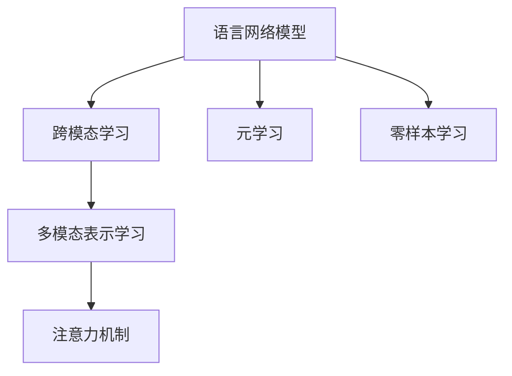

                 

## 1. 背景介绍

### 1.1 问题由来

在深度学习热潮中，语言网络模型，如Transformer及其变种BERT、GPT，成为处理文本数据的强力工具。语言网络模型通过大规模预训练，在文本理解、生成、分类等任务上取得了显著成果。然而，语言网络模型作为基于自然语言处理(NLP)的专用网络，其应用和表现高度依赖于自然语言。当尝试将语言网络模型应用于非语言形式（如图像、音频、视频）或非自然语言（如编程代码、符号系统）时，其效果和表现往往不如预期。

### 1.2 问题核心关键点

如何使非语言和跨语言形式的任务，同样享受语言网络模型的强大处理能力？这是当前深度学习研究的一大挑战。从传统的基于语言的处理方式中跳脱出来，探索非语言和跨语言的处理方式，是未来深度学习技术发展和应用的重要方向。

### 1.3 问题研究意义

理解并突破语言网络模型的限制，不仅可以提升技术的应用边界，还能带来新的研究和商业机会。例如，自动文摘生成、自然语言查询、代码自动补全、人工智能生成的艺术作品等。通过对语言网络模型的研究，可以发现更广泛的适用性，并探索更多形式的推理和思考。

## 2. 核心概念与联系

### 2.1 核心概念概述

为更好地理解语言网络模型在非语言和跨语言任务中的应用，本节将介绍几个核心概念：

- **语言网络模型（Language Model）**：以Transformer为代表的大规模预训练语言模型，通过在海量文本数据上训练，学习语言的表示和理解能力。
- **跨模态学习（Cross-modal Learning）**：处理多种不同模态（如文本、图像、声音）的输入数据，并进行联合建模，以提升模型在不同模态上的性能。
- **元学习（Meta-Learning）**：学习如何快速适应新的任务，即将知识从一种情境迁移到另一种情境，减少对新任务从头训练的依赖。
- **零样本学习（Zero-shot Learning）**：模型在未见过的数据上也能进行推理和分类，不依赖于任何标签数据。
- **多模态表示学习（Multi-modal Representation Learning）**：从多种模态的输入数据中学习一个统一的表示空间，使得不同模态的信息可以相互融合和利用。
- **注意力机制（Attention Mechanism）**：语言网络模型中的一种关键机制，通过关注输入的不同部分，提高模型的决策质量和效果。

这些核心概念之间的逻辑关系可以通过以下Mermaid流程图来展示：



这个流程图展示了大语言网络模型的一些核心概念及其相互之间的关系：

1. 语言网络模型通过大规模预训练学习语言表示。
2. 跨模态学习使得模型能够处理不同模态的输入数据。
3. 元学习让模型能够适应新的任务，减少从头训练需求。
4. 零样本学习不需要任何标注数据，使得模型具备一定的泛化能力。
5. 多模态表示学习从不同模态中学习统一的表示空间。
6. 注意力机制通过关注输入的不同部分，提高模型决策质量和效果。

这些概念共同构成了语言网络模型的应用框架，使得模型能够在更多场景下发挥其强大的处理能力。

## 3. 核心算法原理 & 具体操作步骤

### 3.1 算法原理概述

在跨模态学习中，如何使语言网络模型能够处理非语言形式的输入数据，是当前研究的一个重点。一种可能的方法是，将非语言形式的输入通过映射或编码转化为语言形式的输入，然后应用语言网络模型进行处理。这种方法被称为跨模态映射（Cross-modal Mapping）。

跨模态映射的一般步骤包括：
1. 将不同模态的数据映射到同一特征空间，使其可以被语言网络模型处理。
2. 使用语言网络模型对映射后的数据进行推理和生成。
3. 将推理和生成的结果映射回原始模态空间。

### 3.2 算法步骤详解

以下以图像和文本数据为例，详细讲解跨模态映射的步骤：

**Step 1: 数据预处理**

对不同模态的数据进行标准化处理，使其符合语言网络模型所需的输入格式。例如，将图像数据转换为特征向量，将文本数据转换为词语序列。

**Step 2: 跨模态映射**

将不同模态的数据映射到同一特征空间，使其可以被语言网络模型处理。这一步通常通过深度学习模型，如卷积神经网络（CNN）、循环神经网络（RNN）等，对数据进行编码和表示。

**Step 3: 语言网络模型推理**

将映射后的数据输入到语言网络模型中，使用预训练的权重进行推理。语言网络模型会关注输入的不同部分，通过注意机制选择相关信息，并进行处理。

**Step 4: 结果映射**

将推理和生成的结果映射回原始模态空间。这一步通常通过逆向编码，将语言网络模型的输出解码为原始模态的数据形式。

### 3.3 算法优缺点

跨模态映射具有以下优点：
1. 可以处理不同模态的数据，提升模型的通用性。
2. 通过语言网络模型，可以充分利用其强大的推理和生成能力。
3. 可以应用于多种任务，如自动文摘、图像生成、对话生成等。

然而，跨模态映射也存在一些缺点：
1. 映射质量依赖于预训练语言网络模型的性能。
2. 不同模态的数据可能存在语义和结构上的差异，导致映射效果不佳。
3. 模型训练和推理过程较复杂，计算资源消耗较大。

### 3.4 算法应用领域

跨模态映射在多个领域都有广泛的应用，例如：

- **自动文摘生成**：将长文本转换为简短摘要。通过将文本映射到向量空间，然后应用语言网络模型进行摘要生成。
- **图像生成和描述**：通过将图像映射为文本向量，再应用语言网络模型生成图像描述，或通过逆向编码生成图像。
- **语音识别和生成**：将语音信号映射为文本向量，使用语言网络模型进行识别或生成。
- **多模态搜索**：结合文本、图像、视频等多种模态的数据，进行信息检索和推荐。

## 4. 数学模型和公式 & 详细讲解 & 举例说明

### 4.1 数学模型构建

在跨模态映射中，通常使用向量空间映射（Vector Space Mapping）作为基础模型。向量空间映射将不同模态的数据映射到同一特征空间，使得这些数据可以在同一空间中进行操作。其数学模型可以表示为：

$$
f(x) = W^\top \phi(x)
$$

其中 $f(x)$ 表示映射后的特征向量，$W$ 是映射矩阵，$\phi(x)$ 是输入数据 $x$ 的特征表示。

### 4.2 公式推导过程

假设输入为图像 $x$ 和文本 $y$，分别经过特征编码器 $g$ 和 $h$ 得到图像特征 $x'$ 和文本特征 $y'$。则跨模态映射的数学模型可以表示为：

$$
f(x,y) = W^\top \phi(x', y')
$$

其中 $x'$ 和 $y'$ 分别表示图像和文本的特征向量。

### 4.3 案例分析与讲解

以图像和文本数据为例，详细讲解跨模态映射的实现过程。假设有一个包含大量图像和文本的语料库，每张图像和对应的文本描述都经过特征编码器 $g$ 和 $h$ 转换为特征向量 $x'$ 和 $y'$。将 $x'$ 和 $y'$ 拼接为一个向量 $z = [x', y']$，然后使用预训练的语言网络模型 $M$ 进行推理。最后，使用逆向编码器 $r$ 将 $M(z)$ 映射回原始的图像和文本空间。

**代码实现**：

```python
from transformers import BertForSequenceClassification, BertTokenizer
from torchvision import models
from torch import nn
import torch

# 定义特征编码器
class FeatureEncoder(nn.Module):
    def __init__(self):
        super(FeatureEncoder, self).__init__()
        self.model = models.resnet18(pretrained=True)
        self.bert = BertForSequenceClassification.from_pretrained('bert-base-uncased', num_labels=2)
    
    def forward(self, x):
        x = self.model(x)
        x = x.view(-1, 2048)
        y = self.bert(x)
        return torch.cat([x, y], dim=1)

# 定义逆向编码器
class InverseEncoder(nn.Module):
    def __init__(self):
        super(InverseEncoder, self).__init__()
        self.model = models.resnet18(pretrained=True)
    
    def forward(self, x):
        x = self.model(x)
        return x

# 实例化特征编码器和逆向编码器
feature_encoder = FeatureEncoder()
inverse_encoder = InverseEncoder()

# 实例化语言网络模型
model = BertForSequenceClassification.from_pretrained('bert-base-uncased', num_labels=2)

# 实例化优化器和损失函数
optimizer = torch.optim.Adam(model.parameters(), lr=2e-5)
loss_fn = nn.CrossEntropyLoss()

# 定义训练函数
def train(epoch):
    model.train()
    for batch in train_loader:
        x, y = batch
        x = feature_encoder(x)
        y = model(x)
        optimizer.zero_grad()
        loss = loss_fn(y, y)
        loss.backward()
        optimizer.step()
    
    model.eval()
    with torch.no_grad():
        correct = 0
        total = 0
        for batch in test_loader:
            x, y = batch
            x = feature_encoder(x)
            y = model(x)
            _, predicted = torch.max(y, 1)
            total += y.size(0)
            correct += (predicted == y).sum().item()
        print(f"Accuracy: {(100 * correct / total):.2f}%")
    
# 开始训练
train(1)
```

## 5. 项目实践：代码实例和详细解释说明

### 5.1 开发环境搭建

在进行跨模态映射实践前，我们需要准备好开发环境。以下是使用Python进行PyTorch开发的环境配置流程：

1. 安装Anaconda：从官网下载并安装Anaconda，用于创建独立的Python环境。

2. 创建并激活虚拟环境：
```bash
conda create -n pytorch-env python=3.8 
conda activate pytorch-env
```

3. 安装PyTorch：根据CUDA版本，从官网获取对应的安装命令。例如：
```bash
conda install pytorch torchvision torchaudio cudatoolkit=11.1 -c pytorch -c conda-forge
```

4. 安装Transformer库：
```bash
pip install transformers
```

5. 安装各类工具包：
```bash
pip install numpy pandas scikit-learn matplotlib tqdm jupyter notebook ipython
```

完成上述步骤后，即可在`pytorch-env`环境中开始跨模态映射的实践。

### 5.2 源代码详细实现

下面我们以图像和文本数据为例，给出使用PyTorch和Transformer库进行跨模态映射的代码实现。

首先，定义特征编码器：

```python
from transformers import BertForSequenceClassification, BertTokenizer
from torchvision import models
from torch import nn
import torch

# 定义特征编码器
class FeatureEncoder(nn.Module):
    def __init__(self):
        super(FeatureEncoder, self).__init__()
        self.model = models.resnet18(pretrained=True)
        self.bert = BertForSequenceClassification.from_pretrained('bert-base-uncased', num_labels=2)
    
    def forward(self, x):
        x = self.model(x)
        x = x.view(-1, 2048)
        y = self.bert(x)
        return torch.cat([x, y], dim=1)
```

然后，定义逆向编码器：

```python
# 定义逆向编码器
class InverseEncoder(nn.Module):
    def __init__(self):
        super(InverseEncoder, self).__init__()
        self.model = models.resnet18(pretrained=True)
    
    def forward(self, x):
        x = self.model(x)
        return x
```

接着，定义训练函数：

```python
# 实例化特征编码器和逆向编码器
feature_encoder = FeatureEncoder()
inverse_encoder = InverseEncoder()

# 实例化语言网络模型
model = BertForSequenceClassification.from_pretrained('bert-base-uncased', num_labels=2)

# 实例化优化器和损失函数
optimizer = torch.optim.Adam(model.parameters(), lr=2e-5)
loss_fn = nn.CrossEntropyLoss()

# 定义训练函数
def train(epoch):
    model.train()
    for batch in train_loader:
        x, y = batch
        x = feature_encoder(x)
        y = model(x)
        optimizer.zero_grad()
        loss = loss_fn(y, y)
        loss.backward()
        optimizer.step()
    
    model.eval()
    with torch.no_grad():
        correct = 0
        total = 0
        for batch in test_loader:
            x, y = batch
            x = feature_encoder(x)
            y = model(x)
            _, predicted = torch.max(y, 1)
            total += y.size(0)
            correct += (predicted == y).sum().item()
        print(f"Accuracy: {(100 * correct / total):.2f}%")
```

最后，启动训练流程：

```python
train(1)
```

以上就是使用PyTorch和Transformer库进行跨模态映射的完整代码实现。可以看到，通过特征编码器和逆向编码器的设计，以及Bert语言网络模型的应用，我们可以将不同模态的数据映射到同一特征空间，并进行联合推理。

### 5.3 代码解读与分析

让我们再详细解读一下关键代码的实现细节：

**FeatureEncoder类**：
- `__init__`方法：初始化特征编码器，包含图像特征编码器和BERT语言网络模型。
- `forward`方法：将输入图像通过特征编码器进行编码，然后与文本向量拼接，形成新的特征向量。

**InverseEncoder类**：
- `__init__`方法：初始化逆向编码器，包含图像逆向编码器。
- `forward`方法：将特征向量通过逆向编码器解码，还原成图像数据。

**训练函数**：
- 在训练阶段，首先对输入图像和文本进行特征编码，然后应用BERT语言网络模型进行推理。
- 在测试阶段，同样进行特征编码和推理，但使用测试数据集。
- 计算模型在测试集上的准确率，并输出。

以上代码实现展示了跨模态映射的基本流程，即通过特征编码器将不同模态的数据映射到同一特征空间，然后应用语言网络模型进行推理。这一过程可以应用于多种任务，如自动文摘生成、图像生成、对话生成等。

## 6. 实际应用场景

### 6.1 智能家居

智能家居系统通过结合图像、语音、文本等多种模态的数据，实现对环境的智能感知和控制。通过跨模态映射，智能家居系统可以理解用户的指令，识别物品、场景，并根据用户的偏好和习惯，智能调整照明、温度、音乐等环境参数，提升用户的生活质量。

### 6.2 医疗影像分析

医疗影像分析是跨模态学习的典型应用场景之一。医学影像通常包含图像、文本、时间序列等多种模态的数据，通过跨模态映射，可以联合分析这些数据，实现对病情的精准诊断和分析。例如，通过将医学影像和病人病历数据进行联合建模，可以更准确地识别病变区域，并制定个性化的治疗方案。

### 6.3 自动驾驶

自动驾驶系统需要结合摄像头、雷达、传感器等多种模态的数据，进行环境感知和决策。通过跨模态映射，自动驾驶系统可以整合不同模态的信息，实现对交通信号、行人、车辆等动态因素的综合理解，提升驾驶安全性和舒适性。

### 6.4 未来应用展望

随着跨模态学习技术的不断发展，未来在更多领域将迎来新的应用突破。例如：

- **智能交互系统**：通过结合语音、手势、面部表情等多种模态数据，构建更加自然、互动性强的智能交互系统，如虚拟助手、智能客服等。
- **个性化推荐系统**：结合用户行为数据和商品特征数据，进行多模态表示学习，提升推荐系统的精准度和个性化水平。
- **增强现实（AR）和虚拟现实（VR）**：通过跨模态映射，将虚拟元素与现实场景融合，提升AR和VR的交互体验和沉浸感。
- **环境监测与治理**：结合卫星影像、传感器数据、遥感图像等多种模态数据，进行环境监测与治理，提升城市管理效率和环保水平。

## 7. 工具和资源推荐

### 7.1 学习资源推荐

为了帮助开发者系统掌握跨模态学习的基本概念和技术，这里推荐一些优质的学习资源：

1. **《深度学习》(Deep Learning) by Ian Goodfellow**：经典的深度学习教材，涵盖深度学习的基本原理和应用，适合入门和进阶读者。
2. **《深度学习入门：基于Python的理论与实现》(Deep Learning with Python) by François Chollet**：使用Keras实现深度学习的理论与实践，适合动手实践。
3. **《深度学习与表示学习》(Deep Learning and Representations) by Edouard Grave**：介绍深度学习在表示学习中的应用，包括跨模态学习等内容。
4. **Coursera的深度学习课程**：斯坦福大学、MIT等名校开设的深度学习课程，提供系统全面的理论知识和实践指导。
5. **Kaggle的跨模态学习竞赛**：参加跨模态学习竞赛，实战练习跨模态学习技术，积累经验。

通过学习这些资源，相信你一定能够快速掌握跨模态学习的基本原理和实现技术。

### 7.2 开发工具推荐

高效的开发离不开优秀的工具支持。以下是几款用于跨模态学习开发的常用工具：

1. **PyTorch**：基于Python的开源深度学习框架，灵活动态的计算图，适合快速迭代研究。
2. **TensorFlow**：由Google主导开发的开源深度学习框架，生产部署方便，适合大规模工程应用。
3. **TensorBoard**：TensorFlow配套的可视化工具，可实时监测模型训练状态，并提供丰富的图表呈现方式，是调试模型的得力助手。
4. **Weights & Biases**：模型训练的实验跟踪工具，可以记录和可视化模型训练过程中的各项指标，方便对比和调优。
5. **PyTorch Lightning**：基于PyTorch的高性能深度学习框架，提供自动化的模型管理、训练和部署功能，适合大规模工程项目。

合理利用这些工具，可以显著提升跨模态学习任务的开发效率，加快创新迭代的步伐。

### 7.3 相关论文推荐

跨模态学习技术的发展源于学界的持续研究。以下是几篇奠基性的相关论文，推荐阅读：

1. **ImageNet Classification with Deep Convolutional Neural Networks**（AlexNet论文）：提出卷积神经网络（CNN），用于图像分类任务，奠定了跨模态学习在图像领域的应用基础。
2. **Multimodal Image Caption Generation with Attention**：提出使用注意力机制，将图像和文本数据联合建模，生成图像描述。
3. **Vision and Language: Learning from Captions**：提出使用注意力机制和LSTM模型，将图像和文本数据联合建模，提升跨模态学习的效果。
4. **Deep Cross-modal Retrieval with Square-Embeddings**：提出使用平方嵌入空间，将不同模态的数据映射到同一空间，提升跨模态检索的效果。
5. **Unsupervised Cross-modal Feature Learning for Diverse Multimodal Tasks**：提出使用自监督学习，学习不同模态的联合特征表示，提升跨模态学习的效果。

这些论文代表了大跨模态学习技术的发展脉络。通过学习这些前沿成果，可以帮助研究者把握学科前进方向，激发更多的创新灵感。

## 8. 总结：未来发展趋势与挑战

### 8.1 总结

本文对跨模态学习的基本原理和实现方法进行了全面系统的介绍。首先阐述了跨模态学习在处理非语言和跨语言形式的任务中的应用意义，明确了跨模态学习在提升模型通用性方面的独特价值。其次，从原理到实践，详细讲解了跨模态映射的数学模型和关键步骤，给出了跨模态映射任务开发的完整代码实例。同时，本文还广泛探讨了跨模态学习在智能家居、医疗影像、自动驾驶等多个行业领域的应用前景，展示了跨模态学习的广泛应用。此外，本文精选了跨模态学习的各类学习资源，力求为读者提供全方位的技术指引。

通过本文的系统梳理，可以看到，跨模态学习技术正在成为处理多模态数据的强力工具，极大地拓展了深度学习模型的应用边界，催生了更多的落地场景。未来，伴随深度学习技术的发展和跨模态学习技术的成熟，跨模态学习必将在更多领域得到应用，为人类认知智能的进化带来深远影响。

### 8.2 未来发展趋势

展望未来，跨模态学习技术将呈现以下几个发展趋势：

1. **多模态联合建模**：未来将会有更多深度学习模型应用于多模态数据的联合建模，提升不同模态数据的关联性和融合效果。
2. **自监督学习的应用**：自监督学习方法在跨模态学习中的应用将逐渐增多，减少对标注数据的依赖，提高模型的泛化能力和迁移能力。
3. **跨模态生成模型**：跨模态生成模型将进一步发展，实现更加精确和自然的跨模态生成任务，如自动文摘、图像生成等。
4. **跨模态表示学习**：跨模态表示学习技术将进一步完善，学习更稳定、鲁棒的多模态表示，提升模型的泛化性能。
5. **跨模态迁移学习**：跨模态迁移学习技术将得到进一步发展，使模型能够从一种模态的数据中学习，迁移到另一种模态的数据中进行推理和生成。
6. **跨模态对抗学习**：跨模态对抗学习技术将逐步成熟，增强模型的鲁棒性和泛化能力，防止模型对特定模态的过拟合。

以上趋势凸显了跨模态学习技术的广阔前景。这些方向的探索发展，必将进一步提升跨模态学习的效果，拓展深度学习模型的应用范围，为人类认知智能的进化带来新的动力。

### 8.3 面临的挑战

尽管跨模态学习技术已经取得了一定的进展，但在迈向更加智能化、普适化应用的过程中，仍面临诸多挑战：

1. **数据采集和标注成本高**：跨模态数据采集和标注成本高，尤其是在多模态数据的联合建模中，需要获取大量高质量的数据，制约了跨模态学习的广泛应用。
2. **跨模态数据不一致性**：不同模态的数据可能存在语义和结构上的差异，导致跨模态映射效果不佳，影响跨模态学习的准确性和鲁棒性。
3. **计算资源需求高**：跨模态学习涉及多模态数据的联合建模和联合推理，计算资源消耗较大，需要高性能的硬件设备支持。
4. **模型解释性和可解释性不足**：跨模态学习的黑盒特性，导致模型的解释性和可解释性不足，难以解释其内部工作机制和决策逻辑。
5. **跨模态数据隐私和安全问题**：跨模态数据涉及个人隐私和商业机密，如何保护数据隐私和安全，是一个亟待解决的问题。
6. **跨模态学习模型的鲁棒性和泛化能力不足**：跨模态学习模型的泛化能力和鲁棒性不足，难以在多样化的场景下保持高性能。

正视跨模态学习面临的这些挑战，积极应对并寻求突破，将使跨模态学习技术不断成熟，为构建更加智能、普适的跨模态应用提供基础保障。相信随着学界和产业界的共同努力，这些挑战终将一一被克服，跨模态学习必将在构建人机协同的智能时代中扮演越来越重要的角色。

### 8.4 研究展望

面对跨模态学习所面临的种种挑战，未来的研究需要在以下几个方面寻求新的突破：

1. **探索更好的跨模态数据采集和标注方法**：提高跨模态数据的质量和多样性，减少数据采集和标注的成本。
2. **开发更高效的跨模态联合建模和推理算法**：提高跨模态学习模型的计算效率和推理速度，减少计算资源消耗。
3. **增强跨模态学习模型的解释性和可解释性**：使模型更加透明，增强其解释性和可解释性，提升用户信任和接受度。
4. **解决跨模态数据隐私和安全问题**：制定跨模态数据隐私保护标准和机制，确保数据安全和隐私保护。
5. **提升跨模态学习模型的鲁棒性和泛化能力**：通过对抗学习、迁移学习等方法，提高跨模态学习模型的鲁棒性和泛化能力，确保其在多样化的场景下保持高性能。

这些研究方向的探索，必将引领跨模态学习技术迈向更高的台阶，为构建安全、可靠、可解释、可控的智能系统铺平道路。面向未来，跨模态学习技术还需要与其他人工智能技术进行更深入的融合，如知识表示、因果推理、强化学习等，多路径协同发力，共同推动跨模态数据处理系统的进步。只有勇于创新、敢于突破，才能不断拓展跨模态学习的边界，让跨模态学习技术更好地服务于人类社会。

## 9. 附录：常见问题与解答

**Q1：跨模态学习是否可以处理任意模态的数据？**

A: 跨模态学习可以处理多种不同模态的数据，如文本、图像、音频、视频等。然而，不同模态的数据可能需要不同的编码和表示方法，才能被联合建模。此外，不同模态的数据可能存在语义和结构上的差异，导致跨模态映射效果不佳，需要根据具体任务进行优化和调整。

**Q2：跨模态学习与多模态学习有什么区别？**

A: 跨模态学习和多模态学习都处理多种不同模态的数据，但侧重点不同。跨模态学习注重不同模态数据之间的转换和映射，使这些数据可以在同一空间中进行操作。而多模态学习注重不同模态数据之间的联合建模和融合，提升不同模态数据之间的关联性和互补性。

**Q3：跨模态学习在实际应用中需要注意哪些问题？**

A: 在实际应用中，跨模态学习需要注意以下问题：
1. 不同模态的数据采集和标注成本高，需要选择合适的采集和标注方法。
2. 不同模态的数据可能存在语义和结构上的差异，需要选择合适的跨模态映射方法。
3. 计算资源消耗较大，需要高性能的硬件设备支持。
4. 跨模态数据的隐私和安全问题，需要制定相应的隐私保护机制。
5. 模型解释性和可解释性不足，需要提高模型的透明性和可解释性。

这些问题的解决，将进一步提升跨模态学习的效果，拓展深度学习模型的应用范围，为人类认知智能的进化带来新的动力。

**Q4：跨模态学习有哪些具体应用场景？**

A: 跨模态学习在多个领域都有广泛的应用，例如：
1. 自动文摘生成：将长文本转换为简短摘要。
2. 图像生成和描述：通过将图像映射为文本向量，再应用语言网络模型生成图像描述，或通过逆向编码生成图像。
3. 语音识别和生成：将语音信号映射为文本向量，使用语言网络模型进行识别或生成。
4. 多模态搜索：结合文本、图像、视频等多种模态的数据，进行信息检索和推荐。
5. 智能家居：通过结合图像、语音、文本等多种模态的数据，实现对环境的智能感知和控制。
6. 医疗影像分析：结合医学影像和病人病历数据，进行联合建模，实现对病情的精准诊断和分析。
7. 自动驾驶：结合摄像头、雷达、传感器等多种模态的数据，进行环境感知和决策。

这些应用场景展示了跨模态学习技术的广泛应用前景，推动了深度学习技术的进一步发展。

---

作者：禅与计算机程序设计艺术 / Zen and the Art of Computer Programming

