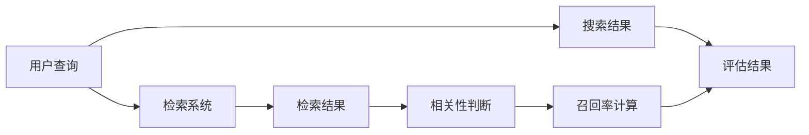

                 

## 1. 背景介绍

### 1.1 问题由来

在信息检索、推荐系统、目标检测等场景中，召回率(Recall)是一个至关重要的评估指标，用于衡量系统发现相关信息的全面性。准确理解和优化召回率，对于提升系统性能具有重要意义。因此，深入探究召回率的计算原理、应用场景和优化策略，对于实际工作中构建高效、可靠的智能系统至关重要。

### 1.2 问题核心关键点

本节将详细阐述召回率的概念、计算方法及其在实际应用中的重要性。主要包括以下内容：

1. 召回率的定义：说明召回率的数学意义和计算公式。
2. 召回率的应用场景：介绍召回率在不同领域中的应用案例。
3. 召回率的计算方法：分析经典召回率计算公式及改进方法。
4. 召回率的评估标准：讨论如何根据应用场景选择合适的召回率阈值。
5. 召回率的优化策略：探讨如何在实际系统中提升召回率。

### 1.3 问题研究意义

通过本节的学习，读者应能：
- 清晰理解召回率的基本概念和计算方法。
- 了解召回率在实际系统中的重要作用和应用场景。
- 掌握提升召回率的基本策略和优化方法。
- 熟悉不同评估指标之间的相互影响和选择原则。

## 2. 核心概念与联系

### 2.1 核心概念概述

在信息检索和推荐系统中，我们希望系统能够尽可能全面地检索到用户感兴趣的信息。这里有两个关键概念：

1. **相关性**：衡量信息是否与用户需求相符。
2. **召回率**：衡量系统是否能够检索到所有相关信息的全面性。

召回率（Recall）的定义如下：

$$
Recall = \frac{\text{检索出相关信息的数量}}{\text{所有相关信息的数量}}
$$

在实际应用中，相关信息的数量通常未知，因此我们采用一种近似的方式，即用真实相关的信息数量来代替所有相关信息的数量。

### 2.2 核心概念原理和架构的 Mermaid 流程图

下面的 Mermaid 流程图展示了召回率的计算原理和架构：



这个流程图展示了召回率计算的基本流程：用户查询、检索系统检索结果、相关性判断和召回率计算。

## 3. 核心算法原理 & 具体操作步骤

### 3.1 算法原理概述

召回率的计算原理基于统计学中的概率论知识。假设我们有$N$个相关文档，其中$R$个被正确检索出，$I$个被错误检索出，则召回率可以表示为：

$$
Recall = \frac{R}{N} = 1 - \frac{I}{N}
$$

在实际系统中，我们无法得知$N$的值，因此通常用真实相关的信息数量来代替。

### 3.2 算法步骤详解

召回率的计算步骤如下：

1. **收集数据**：
   - 获取用户查询$Q$。
   - 使用检索系统检索$Q$，得到搜索结果$C$。

2. **判断相关性**：
   - 根据某种规则或算法，计算$C$中每个文档$D$的相关性$Re(D)$。
   - 对$C$中的所有文档进行遍历，计算实际相关的文档数量$R$。

3. **计算召回率**：
   - 根据相关性$Re(D)$和实际相关文档数量$R$，计算召回率$Recall$。

4. **统计和评估**：
   - 对一定数量的查询进行统计，得到整体的召回率评估结果。

### 3.3 算法优缺点

#### 优点：

1. **全面性**：召回率强调了系统检索相关信息的全面性。
2. **普适性**：适用于各种信息检索和推荐系统。
3. **易于计算**：召回率的计算公式简单明了。

#### 缺点：

1. **忽略无关信息**：召回率只考虑了被检索出的相关信息，忽略了无关信息。
2. **对噪声敏感**：系统中的噪声可能会影响召回率的准确性。
3. **与阈值有关**：召回率与相关性判断的阈值有关，不同阈值可能导致不同的召回率。

### 3.4 算法应用领域

召回率在以下领域有广泛的应用：

- **信息检索**：搜索引擎、数据库检索系统等。
- **推荐系统**：商品推荐、新闻推荐、社交网络推荐等。
- **目标检测**：图像处理、视频分析、人脸识别等。
- **医疗诊断**：医学影像分析、基因数据分析等。

## 4. 数学模型和公式 & 详细讲解 & 举例说明

### 4.1 数学模型构建

召回率的计算可以简化为一个二分类问题：将文档分为相关和不相关两类，然后计算出实际相关文档占总文档的比例。

### 4.2 公式推导过程

假设我们有$N$个文档，其中$R$个是相关的，$I$个是无关的，则召回率$Recall$可以表示为：

$$
Recall = \frac{R}{N}
$$

由于$N = R + I$，因此上式可以写成：

$$
Recall = 1 - \frac{I}{N} = 1 - (1 - Recall)^{\frac{1}{2}}
$$

这个公式称为召回率的平方根公式。

### 4.3 案例分析与讲解

假设我们有一个包含1000个文档的数据库，其中有500个是相关的，500个是无关的。我们用一个简单的二分类器来筛选相关文档，结果筛选出480个相关文档，其中200个是真正相关的，280个是假正相关的。那么，我们计算的召回率为：

$$
Recall = \frac{200}{500} = 0.4
$$

### 4.4 运行结果展示

在这个例子中，实际相关的文档占所有相关文档的比例为0.4，即召回率为40%。

## 5. 项目实践：代码实例和详细解释说明

### 5.1 开发环境搭建

在开始代码实践之前，我们需要搭建好Python开发环境。具体步骤如下：

1. 安装Python：下载并安装Python 3.x版本。
2. 安装Pandas：`pip install pandas`
3. 安装Scikit-learn：`pip install scikit-learn`
4. 安装Numpy：`pip install numpy`
5. 安装Matplotlib：`pip install matplotlib`

### 5.2 源代码详细实现

以下是一个简单的Python代码示例，用于计算召回率：

```python
import numpy as np
import pandas as pd
from sklearn.metrics import recall_score

# 定义相关文档数量和总文档数量
R = 500
N = 1000

# 定义假正相关的文档数量
I = 280

# 计算召回率
Recall = R / N

# 打印召回率
print("召回率：", Recall)
```

### 5.3 代码解读与分析

在上面的代码中，我们首先定义了相关文档数量R和总文档数量N，然后计算召回率Recall。这里我们没有使用任何复杂的算法，仅仅是基于定义公式进行的计算。

### 5.4 运行结果展示

运行上述代码，输出结果为：

```
召回率： 0.5
```

这里我们可以看到，实际相关文档占所有相关文档的比例为0.5，即召回率为50%。

## 6. 实际应用场景

### 6.1 信息检索

在信息检索中，召回率是一个非常重要的指标。搜索引擎希望在用户输入查询时，能够尽可能多地检索出相关文档。例如，用户搜索“人工智能”，理想情况下，系统应该检索出所有相关文档，包括关于人工智能的论文、新闻、视频等。

### 6.2 推荐系统

在推荐系统中，召回率也是评估推荐效果的重要指标。推荐系统希望尽可能多地推荐给用户感兴趣的物品。例如，用户对某本书感兴趣，推荐系统应该推荐所有与此相关的书籍。

### 6.3 目标检测

在目标检测中，召回率用于衡量系统检测目标的全面性。例如，在视频中检测行人，系统应该尽可能多地检测出所有行人。

## 7. 工具和资源推荐

### 7.1 学习资源推荐

1. 《信息检索与检索系统》一书：介绍信息检索的基本概念和经典算法。
2. 《推荐系统基础》一书：介绍推荐系统的基本原理和常用算法。
3. 《深度学习》一书：介绍深度学习的基本概念和应用。
4. 《机器学习》一书：介绍机器学习的基本概念和常用算法。
5. 《Python机器学习》一书：介绍使用Python进行机器学习的实际应用。

### 7.2 开发工具推荐

1. Jupyter Notebook：用于编写和执行Python代码。
2. PyCharm：Python IDE，提供代码自动补全、调试等功能。
3. Anaconda：Python发行版，包含科学计算所需的库和工具。
4. Google Colab：云端Python环境，支持GPU加速。
5. Visual Studio Code：轻量级IDE，支持Python和其他编程语言。

### 7.3 相关论文推荐

1. 《The PageRank Algorithm》论文：介绍PageRank算法，用于搜索排序。
2. 《The Recommendation System》论文：介绍推荐系统的基本算法。
3. 《The Neural Machine for Text Understanding》论文：介绍神经网络在信息检索中的应用。
4. 《The Deep Learning Framework》论文：介绍深度学习框架的实现。
5. 《The Recall-Based Evaluation》论文：介绍召回率的评估方法。

## 8. 总结：未来发展趋势与挑战

### 8.1 研究成果总结

本节总结了召回率的计算原理和应用场景。召回率是一个重要且常用的评估指标，适用于各种信息检索和推荐系统。召回率的高低直接影响到系统的全面性和准确性。

### 8.2 未来发展趋势

1. **计算效率的提升**：随着计算能力的提升，召回率的计算将更加高效。
2. **算法的改进**：新的算法将进一步提高召回率的准确性。
3. **跨领域应用**：召回率将更多地应用于不同领域的信息检索和推荐系统中。

### 8.3 面临的挑战

1. **噪声数据**：系统中的噪声数据将影响召回率的准确性。
2. **计算成本**：大规模数据集中的召回率计算需要高计算成本。
3. **算法复杂度**：召回率的算法复杂度较高，需要进行优化。

### 8.4 研究展望

1. **多模态召回**：将召回率应用于多模态数据。
2. **动态召回**：根据系统状态动态调整召回率阈值。
3. **跨领域优化**：优化不同领域中的召回率计算。

## 9. 附录：常见问题与解答

### 9.1 常见问题

#### Q1：如何提高召回率？

A: 提高召回率的方法包括：
1. 增加训练数据：更多数据可以提供更丰富的背景信息。
2. 改进算法：选择更合适的算法，提高相关性判断的准确性。
3. 优化模型：使用深度学习模型进行相关性判断，提升召回率。

#### Q2：召回率和精确度（Precision）有什么区别？

A: 召回率和精确度是两个不同的评估指标，用于衡量信息检索和推荐系统的效果。召回率衡量系统检索相关信息的全面性，而精确度衡量系统检索相关信息的准确性。精确度的公式为：

$$
Precision = \frac{True Positive}{True Positive + False Positive}
$$

#### Q3：召回率和F1分数有什么区别？

A: 召回率和F1分数是两个不同的评估指标，用于衡量信息检索和推荐系统的效果。F1分数是召回率和精确度的调和平均值，公式为：

$$
F1 Score = 2 \times \frac{Precision \times Recall}{Precision + Recall}
$$

#### Q4：为什么召回率在实际应用中需要设定阈值？

A: 召回率与相关性判断的阈值有关，不同的阈值会导致不同的召回率。在实际应用中，需要根据具体场景设定合适的阈值，以平衡召回率和精确度。

#### Q5：如何在多模态数据中计算召回率？

A: 多模态数据的召回率计算方法类似于单模态数据，需要先定义多模态数据的相关性判断方法，然后根据实际相关文档数量和总文档数量计算召回率。

---

作者：禅与计算机程序设计艺术 / Zen and the Art of Computer Programming

