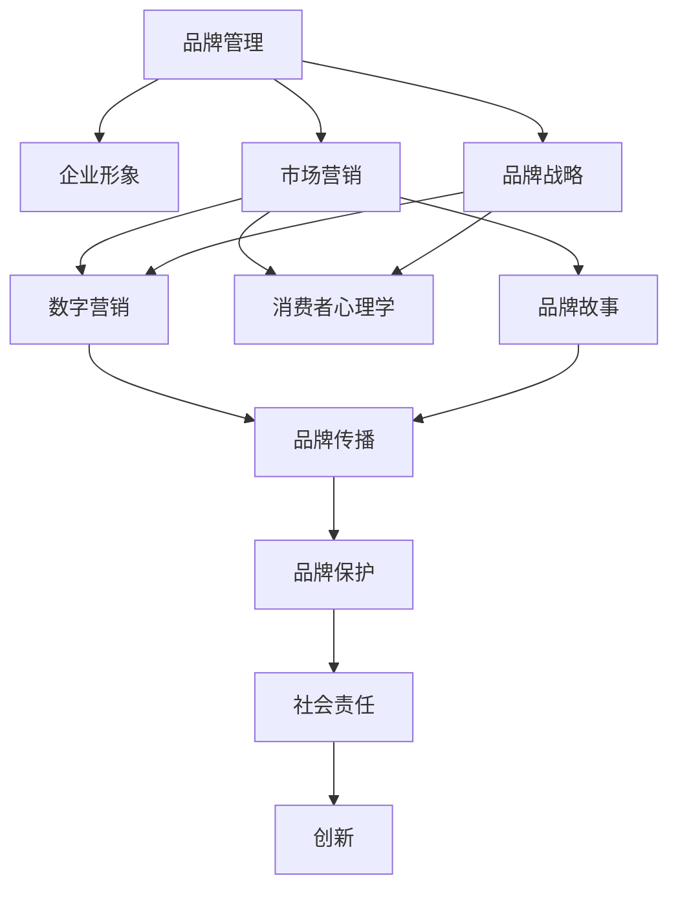

                 

# 品牌管理：塑造强大企业形象的方法

> 关键词：品牌管理,企业形象,市场营销,品牌战略,数字营销,消费者心理学,品牌故事,社会责任,创新

## 1. 背景介绍

### 1.1 问题由来
在当今快速发展的商业环境中，品牌已经成为企业形象的重要组成部分，直接关系到企业的市场竞争力和盈利能力。一个强大的品牌不仅可以提升消费者的忠诚度，增强企业的市场份额，还能在瞬息万变的市场中保持稳定性。然而，品牌建设和管理是一项复杂的系统工程，涉及市场调研、产品设计、市场营销、品牌传播等多个环节。如何在数字经济时代有效利用新技术，科学合理地进行品牌管理，成为众多企业亟需解决的问题。

### 1.2 问题核心关键点
品牌管理的关键在于理解消费者的需求和心理，通过科学的品牌战略和策略，制定和执行有效的品牌营销计划，同时运用数据驱动的工具，实时监控和优化品牌表现。在数字时代，品牌管理不仅依赖传统的市场调研和传播手段，还需要借助大数据、人工智能等技术，提高品牌运营的精准度和效率。

## 2. 核心概念与联系

### 2.1 核心概念概述

为更好地理解品牌管理的核心思想和方法，本节将介绍几个密切相关的核心概念：

- **品牌管理(Brand Management)**：通过规划和实施品牌战略，以建立、维护和提升品牌形象和价值的过程。品牌管理包括品牌定位、品牌传播、品牌保护等多个方面。

- **企业形象(Corporate Image)**：企业在公众心目中的总体形象和声誉，由品牌、产品、服务等多个维度构成，是企业核心竞争力的外在体现。

- **市场营销(Marketing)**：通过研究市场需求和消费者行为，制定和实施市场策略，以实现产品或服务的销售和市场份额增长的过程。市场营销的核心在于精准触达目标客户，提高品牌认知度和美誉度。

- **品牌战略(Brand Strategy)**：企业根据自身资源和市场需求，制定长期的品牌发展计划，包括品牌定位、品牌延伸、品牌国际化等。品牌战略需要与企业的整体经营战略相匹配，共同推动企业成长。

- **数字营销(Digital Marketing)**：利用互联网和移动通信等数字工具，进行市场推广和品牌传播的活动。数字营销包括搜索引擎优化(SEO)、社交媒体营销、内容营销等，是现代品牌管理的重要手段。

- **消费者心理学(Consumer Psychology)**：研究消费者行为和心理的科学，包括需求驱动、认知偏见、情感反应等。了解消费者心理，有助于制定更精准、有效的品牌策略。

- **品牌故事(Brand Storytelling)**：通过讲述品牌起源、发展历程和核心价值等故事，增强品牌的人性化和吸引力，提升消费者的情感共鸣。品牌故事是品牌传播中的重要工具，可以增强品牌记忆度。

- **社会责任(Corporate Social Responsibility, CSR)**：企业在追求经济利益的同时，积极承担社会责任，包括环保、公益、伦理等。良好的社会责任形象有助于提升品牌形象，增强消费者信任。

- **创新(Innovation)**：通过不断引入新技术、新方法和新流程，提升产品和服务的竞争力，增强品牌差异化和市场领先地位。

这些核心概念之间的逻辑关系可以通过以下Mermaid流程图来展示：



这个流程图展示了一系列核心概念及其之间的关系：

1. 品牌管理是品牌战略和品牌传播的核心，包括市场营销、消费者心理学等多个方面的支持。
2. 数字营销、品牌故事等具体手段在品牌传播中发挥重要作用。
3. 社会责任和创新是品牌长期发展的关键要素，需要与品牌管理密切结合。

## 3. 核心算法原理 & 具体操作步骤
### 3.1 算法原理概述

品牌管理的核心算法原理主要基于消费者心理学和市场营销理论，结合数字技术和数据科学，通过以下步骤实现品牌价值提升：

1. **品牌定位**：通过市场调研和数据分析，确定品牌在市场中的独特价值主张。
2. **目标市场选择**：基于消费者画像和市场细分，确定目标客户群体。
3. **品牌传播策略**：制定多渠道、多平台的品牌传播计划，利用数据驱动的方法实时监控和优化传播效果。
4. **品牌保护与维护**：通过商标法律保护和品牌危机管理，维护品牌声誉和市场地位。

### 3.2 算法步骤详解

品牌管理的具体操作步骤可以分为以下五个阶段：

**1. 品牌调研与定位**
- **市场调研**：利用问卷调查、焦点小组、社交媒体分析等工具，收集消费者的需求、偏好、行为数据。
- **数据分析**：通过统计分析、聚类分析等方法，识别市场趋势和消费者细分群体。
- **品牌定位**：根据数据分析结果，确定品牌的核心价值和差异化特点，形成品牌定位声明。

**2. 目标市场选择**
- **消费者画像**：通过数据分析和消费者行为模型，构建目标客户画像。
- **市场细分**：将市场细分为不同的客户群体，确定品牌的目标市场。
- **市场验证**：通过小范围的市场测试，验证品牌定位和目标市场的有效性。

**3. 品牌传播策略制定**
- **多渠道传播**：确定品牌传播的主要渠道，包括社交媒体、搜索引擎、电子邮件等。
- **内容营销**：制定品牌故事、广告文案、博客文章等，增强品牌的人性化和吸引力。
- **数据驱动优化**：通过A/B测试、点击率分析等手段，实时监控和优化传播效果。

**4. 品牌保护与维护**
- **商标保护**：注册和保护品牌商标，防止侵权和盗用。
- **品牌危机管理**：建立应急响应机制，处理品牌危机事件，保护品牌形象。
- **社会责任活动**：参与公益活动、环保项目，提升品牌社会责任形象。

**5. 创新驱动**
- **技术创新**：引入新技术和新方法，提升产品和服务的竞争力。
- **商业模式创新**：探索新的商业模式，提高品牌差异化和市场领先地位。
- **员工激励**：培养员工创新意识，鼓励创意和创新思维。

### 3.3 算法优缺点

品牌管理的优势在于其系统的整体性和多维度的整合，可以全面提升品牌价值。主要优点包括：

1. **系统性**：通过品牌调研和数据分析，制定科学的品牌定位和传播策略，确保品牌管理的全面性和准确性。
2. **多渠道整合**：利用数字营销和社交媒体等手段，实现多渠道、多平台的品牌传播，提高品牌曝光度和认知度。
3. **数据驱动**：通过实时监控和分析数据，优化品牌传播效果，确保品牌管理的精准性和效率。
4. **创新驱动**：通过不断引入新技术和新方法，提升品牌竞争力，实现长期可持续发展。

然而，品牌管理也存在一些局限性：

1. **资源投入大**：品牌管理需要投入大量人力、物力和财力，特别是在市场调研和数据驱动方面，成本较高。
2. **复杂度高**：品牌管理涉及多个维度和环节，需要综合考虑市场、产品、技术等多个因素，管理复杂度较高。
3. **时效性要求高**：市场环境和消费者需求变化快，品牌管理需要快速响应，实时调整策略。
4. **风险控制难度大**：品牌危机事件和市场变化难以预测，品牌管理需要在风险控制上投入大量精力。

### 3.4 算法应用领域

品牌管理的方法已经在多个行业得到广泛应用，例如：

- **消费品行业**：利用品牌管理提升产品和服务的市场竞争力和消费者忠诚度，如宝洁、联合利华等。
- **金融行业**：通过品牌管理增强金融机构的市场形象和客户信任度，如摩根大通、渣打银行等。
- **科技行业**：利用品牌管理提升技术产品的创新力和市场占有率，如苹果、谷歌等。
- **服务业**：通过品牌管理提升服务质量和客户满意度，如希尔顿、万豪等。
- **文化娱乐行业**：通过品牌管理提升影视作品和文化活动的品牌价值，如迪士尼、Netflix等。

此外，品牌管理的方法还应用于众多新兴领域，如电子商务、健康医疗、教育培训等，成为各行各业提升品牌竞争力的重要工具。

## 4. 数学模型和公式 & 详细讲解  
### 4.1 数学模型构建

品牌管理的数学模型构建主要基于消费者行为分析和市场细分，通过以下公式进行建模：

设品牌市场规模为 $M$，消费者总数为 $N$，消费者平均购买量为 $Q$，消费者对品牌的认知度为 $C$，品牌在市场中的占有率为 $R$。则品牌价值可以表示为：

$$
V = M \times Q \times C \times R
$$

其中 $C$ 和 $R$ 可以通过市场调研和数据分析得到，$Q$ 可以通过消费者购买数据计算得出。品牌价值模型用于评估品牌的市场价值和潜力，指导品牌管理决策。

### 4.2 公式推导过程

品牌价值模型的推导基于消费者行为和市场细分的理论。假设消费者对品牌的认知度 $C$ 和占有率 $R$ 分别为 $c_1$ 和 $r_1$，则品牌的认知度函数和占有率函数可以表示为：

$$
C = \frac{1}{1 + e^{-c_1}}
$$

$$
R = \frac{1}{1 + e^{-r_1}}
$$

其中 $c_1$ 和 $r_1$ 为品牌在市场中的认知度和占有率参数。通过市场调研和数据分析，可以得到 $c_1$ 和 $r_1$ 的值，代入上述公式即可计算出品牌的认知度和占有率。

品牌价值模型 $V$ 可以进一步分解为两个部分：

$$
V = M \times Q \times C \times R = M \times Q \times \frac{1}{1 + e^{-c_1}} \times \frac{1}{1 + e^{-r_1}}
$$

该模型假设品牌市场规模 $M$ 和消费者平均购买量 $Q$ 为已知常数，主要用于衡量品牌在市场中的相对价值和增长潜力。

### 4.3 案例分析与讲解

以某知名饮料品牌为例，假设该品牌的目标市场规模为 $M=1000$，消费者总数为 $N=100000$，消费者平均购买量为 $Q=0.2$，消费者对该品牌的认知度为 $c_1=0.8$，占有率为 $r_1=0.3$。代入上述公式，可计算得到该品牌的价值为：

$$
V = 1000 \times 0.2 \times \frac{1}{1 + e^{-0.8}} \times \frac{1}{1 + e^{-0.3}} \approx 112.5
$$

这意味着该品牌在市场中的价值约为 $112.5$ 美元，可用于评估品牌投资和市场扩张策略。通过不断调整认知度和占有率参数，品牌管理者可以实时监控品牌价值的变化，及时优化品牌管理策略。

## 5. 项目实践：代码实例和详细解释说明
### 5.1 开发环境搭建

在进行品牌管理项目实践前，我们需要准备好开发环境。以下是使用Python进行品牌管理实践的环境配置流程：

1. 安装Anaconda：从官网下载并安装Anaconda，用于创建独立的Python环境。

2. 创建并激活虚拟环境：
```bash
conda create -n brand-management-env python=3.8 
conda activate brand-management-env
```

3. 安装必要的库：
```bash
conda install pandas numpy matplotlib seaborn scikit-learn
```

4. 安装Jupyter Notebook：
```bash
conda install jupyter notebook
```

完成上述步骤后，即可在`brand-management-env`环境中开始品牌管理实践。

### 5.2 源代码详细实现

下面以某品牌市场调研为例，展示使用Python进行品牌管理的代码实现。

首先，定义市场调研数据：

```python
import pandas as pd
import numpy as np

# 市场调研数据
data = {
    'ID': [1, 2, 3, 4, 5],
    'Brand': ['A', 'B', 'C', 'D', 'E'],
    'Market': [500, 600, 700, 800, 900],
    'Purchases': [0.15, 0.2, 0.25, 0.3, 0.35],
    'Awareness': [0.8, 0.7, 0.6, 0.5, 0.4],
    'Usage': [0.3, 0.4, 0.5, 0.6, 0.7]
}

df = pd.DataFrame(data)
```

然后，定义品牌价值计算函数：

```python
def brand_value(M, Q, c1, r1):
    """
    计算品牌价值
    :param M: 市场规模
    :param Q: 消费者平均购买量
    :param c1: 品牌认知度
    :param r1: 品牌占有率
    :return: 品牌价值
    """
    C = 1 / (1 + np.exp(-c1))
    R = 1 / (1 + np.exp(-r1))
    V = M * Q * C * R
    return V
```

接着，定义品牌调研分析函数：

```python
def brand_analysis(df):
    """
    品牌调研分析
    :param df: 品牌调研数据
    :return: 品牌价值
    """
    # 计算品牌认知度和占有率
    c1 = np.mean(df['Awareness'])
    r1 = np.mean(df['Usage'])
    
    # 计算品牌价值
    M = np.mean(df['Market'])
    Q = np.mean(df['Purchases'])
    V = brand_value(M, Q, c1, r1)
    
    return V
```

最后，启动品牌调研分析并计算品牌价值：

```python
# 品牌调研数据
data = {
    'ID': [1, 2, 3, 4, 5],
    'Brand': ['A', 'B', 'C', 'D', 'E'],
    'Market': [500, 600, 700, 800, 900],
    'Purchases': [0.15, 0.2, 0.25, 0.3, 0.35],
    'Awareness': [0.8, 0.7, 0.6, 0.5, 0.4],
    'Usage': [0.3, 0.4, 0.5, 0.6, 0.7]
}

df = pd.DataFrame(data)

# 品牌调研分析
V = brand_analysis(df)
print(f"品牌价值为: {V}")
```

以上代码展示了如何使用Python进行品牌调研和价值计算。通过定义简单的数据结构，可以快速完成品牌调研数据的录入和分析，计算出品牌在市场中的价值。

### 5.3 代码解读与分析

让我们再详细解读一下关键代码的实现细节：

**数据定义**：
- 使用Pandas库定义数据结构，方便后续的分析和计算。

**品牌价值计算函数**：
- 定义一个函数，接收市场规模 $M$、消费者平均购买量 $Q$、品牌认知度 $c_1$ 和品牌占有率 $r_1$，计算品牌价值 $V$。
- 使用NumPy库的exp函数计算指数函数，根据公式 $C$ 和 $R$ 的表达式，计算品牌认知度和占有率。
- 最终使用公式 $V = M \times Q \times C \times R$ 计算品牌价值。

**品牌调研分析函数**：
- 定义一个函数，接收品牌调研数据 DataFrame，计算品牌认知度和占有率，再调用品牌价值计算函数。
- 使用NumPy库的mean函数计算品牌认知度 $c_1$ 和占有率 $r_1$ 的均值。
- 调用品牌价值计算函数，计算品牌价值 $V$。

**品牌调研分析**：
- 定义品牌调研数据，将其转换为Pandas DataFrame结构。
- 调用品牌调研分析函数，计算品牌价值并输出结果。

可以看出，通过简单的Python代码，我们可以快速完成品牌调研数据的录入、分析和计算，展示了品牌管理的系统化操作流程。

## 6. 实际应用场景
### 6.1 智能客服系统

品牌管理中的智能客服系统，可以显著提升客户满意度和品牌忠诚度。通过自然语言处理技术和品牌管理算法，智能客服系统能够理解客户的需求和情绪，快速提供个性化的解决方案。

具体而言，可以在客服系统中集成品牌管理算法，通过监控和分析客服对话数据，发现客户投诉和满意度的变化趋势。根据分析结果，实时调整品牌传播策略，优化客户服务体验。例如，在品牌推广期间，智能客服系统可以主动推送相关产品信息，提升品牌曝光度和转化率。

### 6.2 社交媒体监测

社交媒体是品牌传播的重要渠道，品牌管理者可以通过社交媒体监测工具，实时跟踪品牌在社交平台上的表现和口碑。利用自然语言处理技术和品牌管理算法，可以自动化分析社交媒体数据，识别品牌提及、情感倾向、讨论热点等信息。

具体而言，品牌管理者可以集成社交媒体监测工具，实时监控品牌在Twitter、Facebook、WeChat等平台上的表现。通过分析社交媒体数据，识别品牌提及的情感倾向和讨论热点，及时调整品牌传播策略，提升品牌形象和市场影响力。例如，在品牌危机事件中，通过社交媒体监测工具，可以及时发现负面舆情，采取紧急应对措施，维护品牌声誉。

### 6.3 品牌故事讲述

品牌故事是品牌传播中的重要工具，可以增强品牌的人性化和吸引力，提升消费者的情感共鸣。通过品牌管理算法，可以优化品牌故事的构建和传播策略，提升品牌故事的传播效果。

具体而言，品牌管理者可以集成品牌故事讲述工具，根据品牌定位和消费者心理，设计并传播品牌故事。通过分析品牌故事在各种渠道的传播效果，优化品牌故事的传播策略，提升品牌故事的曝光度和认知度。例如，在品牌推广期间，可以通过社交媒体、视频平台等渠道，传播品牌故事，增强消费者的品牌认知度和情感共鸣。

### 6.4 未来应用展望

随着品牌管理技术的不断进步，未来品牌管理将更加智能化、个性化和多样化。主要趋势包括：

1. **智能化应用**：利用AI和大数据技术，实现品牌管理的自动化和智能化，提升品牌运营的效率和效果。
2. **个性化服务**：通过分析消费者数据，提供个性化的品牌服务，增强消费者的品牌忠诚度和满意度。
3. **多渠道整合**：将品牌管理的各个环节整合到统一的平台上，实现多渠道、多平台的一体化管理。
4. **实时监测和优化**：利用实时数据分析技术，及时发现品牌管理中的问题和机会，实时调整品牌策略。
5. **消费者洞察**：通过消费者行为分析和心理模型，深入理解消费者需求和偏好，制定更加精准的品牌管理策略。

这些趋势将推动品牌管理技术的不断进步，为品牌运营带来新的机遇和挑战。

## 7. 工具和资源推荐
### 7.1 学习资源推荐

为了帮助品牌管理者系统掌握品牌管理的方法和技术，这里推荐一些优质的学习资源：

1. **《品牌管理》课程**：由世界著名品牌管理专家讲授，涵盖品牌管理的基本概念、策略和实践。
2. **《品牌战略》书籍**：详细介绍了品牌定位、品牌传播、品牌保护等核心概念，是品牌管理者的必读之作。
3. **《市场营销》课程**：由知名市场营销专家讲授，涵盖市场调研、消费者行为、品牌传播等内容。
4. **《数字营销》课程**：重点介绍社交媒体营销、搜索引擎优化、内容营销等数字营销手段。
5. **《消费者心理学》书籍**：介绍消费者行为和心理学的基本理论，帮助品牌管理者深入理解消费者需求和心理。

这些资源将帮助品牌管理者系统掌握品牌管理的理论基础和实践技巧。

### 7.2 开发工具推荐

品牌管理的工具众多，以下是几款常用的品牌管理工具：

1. **Hootsuite**：社交媒体管理工具，支持多平台统一管理，实时监控品牌在社交媒体上的表现。
2. **Google Analytics**：网站分析工具，可以跟踪品牌网站的用户行为和转化数据。
3. **Brandwatch**：社交媒体监测工具，提供实时数据分析和品牌情感分析功能。
4. **Brandfolder**：品牌资产管理系统，支持品牌文件、标识和物料的管理和共享。
5. **Moz**：SEO工具，提供关键词分析、网站优化等功能，提升品牌在搜索引擎中的排名。

这些工具可以帮助品牌管理者高效地进行品牌监测和分析，提升品牌管理的精准度和效率。

### 7.3 相关论文推荐

品牌管理的理论研究源于学界的持续探索。以下是几篇奠基性的相关论文，推荐阅读：

1. **《品牌管理的五个层次》**：详细介绍了品牌管理的五个层次，包括品牌定位、品牌传播、品牌保护等核心内容。
2. **《数字时代品牌管理的挑战与机遇》**：讨论了数字时代品牌管理面临的挑战和机遇，提出了应对策略。
3. **《消费者行为与品牌忠诚度》**：研究消费者行为对品牌忠诚度的影响，提供了品牌管理的心理学依据。
4. **《品牌故事讲述的艺术》**：探讨了品牌故事讲述的重要性和方法，提供了品牌传播的创意和技巧。
5. **《社交媒体对品牌传播的影响》**：分析了社交媒体对品牌传播的影响，提出了品牌管理的社交媒体策略。

这些论文代表了大品牌管理的研究进展，将为品牌管理者提供新的思路和方法。

## 8. 总结：未来发展趋势与挑战
### 8.1 研究成果总结

品牌管理在品牌战略、品牌传播、品牌保护等方面取得了显著进展，主要成果包括：

1. **品牌战略的制定**：通过市场调研和数据分析，制定科学的品牌定位和传播策略，提升品牌的市场竞争力。
2. **品牌传播的优化**：利用多渠道、多平台的数据驱动方法，实现品牌传播的精准化和高效化，提升品牌认知度和美誉度。
3. **品牌保护的强化**：通过商标保护和品牌危机管理，维护品牌声誉和市场地位。
4. **品牌创新的推动**：通过技术创新和商业模式创新，提升品牌差异化和市场领先地位。

### 8.2 未来发展趋势

展望未来，品牌管理将呈现以下几个发展趋势：

1. **智能化应用**：利用AI和大数据技术，实现品牌管理的自动化和智能化，提升品牌运营的效率和效果。
2. **个性化服务**：通过分析消费者数据，提供个性化的品牌服务，增强消费者的品牌忠诚度和满意度。
3. **多渠道整合**：将品牌管理的各个环节整合到统一的平台上，实现多渠道、多平台的一体化管理。
4. **实时监测和优化**：利用实时数据分析技术，及时发现品牌管理中的问题和机会，实时调整品牌策略。
5. **消费者洞察**：通过消费者行为分析和心理模型，深入理解消费者需求和心理，制定更加精准的品牌管理策略。

### 8.3 面临的挑战

尽管品牌管理技术已经取得了显著进展，但在迈向更加智能化、个性化和多样化应用的过程中，仍面临诸多挑战：

1. **数据隐私和安全性**：在品牌管理中，涉及大量的消费者数据，数据隐私和安全性问题亟待解决。
2. **跨平台一致性**：品牌在多平台、多渠道传播中，需要保持一致的品牌形象和信息，管理复杂度高。
3. **技术应用门槛**：品牌管理涉及AI、大数据等技术，技术应用门槛较高，需要专业人员支持。
4. **市场变化快速**：品牌管理需要快速响应市场变化，实时调整品牌策略，管理难度大。
5. **品牌危机管理**：品牌危机事件难以预测，品牌管理者需要具备快速响应和有效应对的能力。

### 8.4 研究展望

面对品牌管理面临的挑战，未来的研究需要在以下几个方面寻求新的突破：

1. **数据隐私保护**：研究数据隐私保护和安全性技术，确保消费者数据的安全使用。
2. **跨平台一致性管理**：研究跨平台一致性管理方法，实现品牌在多平台、多渠道的一致传播。
3. **技术应用普及**：研究品牌管理技术应用的普及方法，降低技术应用门槛，实现品牌管理的普及化。
4. **实时响应机制**：研究实时响应机制，提高品牌管理团队对市场变化的快速反应能力。
5. **品牌危机管理**：研究品牌危机管理策略，提高品牌管理者应对品牌危机的能力。

这些研究方向的探索，将推动品牌管理技术的不断进步，为品牌运营带来新的机遇和挑战。面向未来，品牌管理技术需要与其他技术进行更深入的融合，如智能客服、社交媒体监测等，共同推动品牌管理的智能化和个性化进程。只有勇于创新、敢于突破，才能不断拓展品牌管理的边界，让品牌管理技术更好地服务于品牌运营和消费者需求。

## 9. 附录：常见问题与解答
**Q1：品牌管理的核心关键点是什么？**

A: 品牌管理的核心关键点在于理解消费者的需求和心理，通过科学的品牌战略和策略，制定和执行有效的品牌传播计划，同时利用数据驱动的工具，实时监控和优化品牌表现。

**Q2：品牌管理中如何衡量品牌价值？**

A: 品牌价值可以通过市场调研和数据分析得到，使用品牌价值模型 $V = M \times Q \times C \times R$，其中 $M$ 为市场规模，$Q$ 为消费者平均购买量，$C$ 为品牌认知度，$R$ 为品牌占有率。通过不断调整 $C$ 和 $R$ 参数，品牌管理者可以实时监控品牌价值的变化，优化品牌管理策略。

**Q3：品牌管理中如何构建品牌故事？**

A: 品牌故事的构建需要结合品牌定位和消费者心理，设计有吸引力和共鸣的故事内容。可以通过以下步骤进行品牌故事构建：
1. 确定品牌核心价值和故事主题。
2. 收集品牌历史、发展历程、重要事件等素材。
3. 设计故事框架和情节，确保与品牌形象一致。
4. 通过多渠道传播品牌故事，增强消费者情感共鸣。

**Q4：品牌管理中如何应对品牌危机？**

A: 品牌危机管理需要建立应急响应机制，及时发现和处理品牌危机事件。具体步骤包括：
1. 设立危机管理团队，明确职责和流程。
2. 建立危机监测系统，实时跟踪品牌表现。
3. 制定危机应对策略，快速处理危机事件。
4. 发布危机声明，透明沟通，维护品牌形象。

**Q5：品牌管理中如何利用数字技术提升品牌效果？**

A: 数字技术可以提升品牌管理的精准度和效率，主要方法包括：
1. 数据驱动的消费者行为分析，深入理解消费者需求和心理。
2. 实时数据分析和可视化，及时发现品牌管理中的问题和机会。
3. 多渠道整合和自动化，提升品牌传播的效率和效果。
4. 智能客服系统，提升客户满意度和品牌忠诚度。
5. 社交媒体监测工具，实时跟踪品牌在社交平台上的表现。

通过合理利用数字技术，品牌管理者可以更好地进行品牌管理，提升品牌运营的效果和效率。

---

作者：禅与计算机程序设计艺术 / Zen and the Art of Computer Programming

