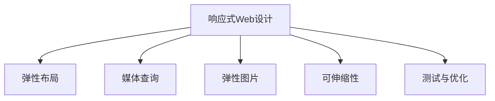

                 

# 响应式Web设计：适配多种设备尺寸

在互联网的广泛普及和移动设备的迅猛发展下，Web设计和开发必须适配各种不同的设备和屏幕尺寸。响应式Web设计（Responsive Web Design, RWD）是一种设计理念和实现方法，旨在通过灵活布局、媒体查询和弹性图片等技术，使Web内容能够适应不同尺寸的屏幕和设备，提供良好的用户体验。本文将详细探讨响应式Web设计的核心概念、算法原理、具体操作步骤，并结合数学模型和代码实例进行讲解，最后讨论其应用场景、未来展望、工具资源和挑战。

## 1. 背景介绍

### 1.1 问题由来

随着智能手机的普及和互联网应用的增加，人们越来越多地通过移动设备访问Web应用。由于移动设备的屏幕尺寸和分辨率与传统的桌面电脑存在巨大差异，传统的Web设计往往无法适配所有设备，导致用户体验不佳。

为了解决这一问题，Web开发者需要采用响应式Web设计，通过灵活的布局和媒体查询技术，使Web页面能够自适应不同屏幕尺寸和设备。

### 1.2 问题核心关键点

响应式Web设计的核心目标是通过弹性布局和媒体查询，使Web内容能够适配各种不同尺寸的设备。核心关键点包括：

1. 弹性布局：通过CSS的弹性布局技术（如Flexbox、Grid），使页面元素能够自适应屏幕大小。
2. 媒体查询：通过CSS的媒体查询技术，根据屏幕宽度、高度、方向等条件，应用不同的样式规则。
3. 弹性图片：通过CSS的响应式图片技术（如srcset、sizes属性），使图片能够自适应不同分辨率。
4. 可伸缩性：通过使用可伸缩的字体和矢量图形，使页面内容能够在不同设备上清晰显示。
5. 测试与优化：通过测试不同设备和浏览器的显示效果，不断调整和优化响应式设计。

## 2. 核心概念与联系

### 2.1 核心概念概述

为更好地理解响应式Web设计，本节将介绍几个密切相关的核心概念：

- 响应式Web设计（Responsive Web Design, RWD）：一种设计理念和实现方法，通过弹性布局、媒体查询等技术，使Web页面能够自适应不同尺寸的屏幕和设备。
- 弹性布局（Flexible Layout）：通过CSS的弹性布局技术（如Flexbox、Grid），使页面元素能够自适应屏幕大小，实现页面布局的灵活性。
- 媒体查询（Media Query）：通过CSS的媒体查询技术，根据屏幕宽度、高度、方向等条件，应用不同的样式规则，实现页面风格的适配。
- 弹性图片（Responsive Images）：通过CSS的响应式图片技术（如srcset、sizes属性），使图片能够自适应不同分辨率，减少加载时间，提高用户体验。
- 可伸缩性（Scalability）：通过使用可伸缩的字体和矢量图形，使页面内容能够在不同设备上清晰显示，保持视觉一致性。
- 测试与优化（Testing and Optimization）：通过测试不同设备和浏览器的显示效果，不断调整和优化响应式设计，保证页面在不同环境下的兼容性和性能。

这些核心概念之间的逻辑关系可以通过以下Mermaid流程图来展示：



这个流程图展示了一旦选择响应式Web设计，就涉及到弹性布局、媒体查询、弹性图片、可伸缩性、测试与优化等多个关键组件。

## 3. 核心算法原理 & 具体操作步骤

### 3.1 算法原理概述

响应式Web设计的核心算法原理基于CSS的弹性布局和媒体查询技术。

弹性布局通过设置元素容器的flex属性和子元素的flex-basis、flex-grow等属性，使页面元素能够自适应屏幕大小，实现灵活的布局效果。媒体查询则通过CSS的@media规则，根据屏幕的宽度、高度、方向等条件，应用不同的样式规则，使页面风格能够适配不同的设备和屏幕尺寸。

### 3.2 算法步骤详解

响应式Web设计的具体操作步骤主要包括以下几个步骤：

**Step 1: 设计页面结构**

- 使用HTML5的语义化标签，如<header>、<nav>、<article>、<section>、<aside>、<footer>等，构建页面结构，使页面内容语义清晰。
- 使用无序列表（ul）、有序列表（ol）、div等容器布局，组合成复杂的页面布局。

**Step 2: 应用弹性布局**

- 在容器布局上设置弹性布局属性，如display:flex、flex-direction、flex-wrap等，使页面元素能够自适应屏幕大小。
- 使用flex属性设置子元素的伸缩比例，如flex:1 0 50%，使元素在容器中的大小自适应。

**Step 3: 设置媒体查询**

- 根据不同的屏幕尺寸和设备，设置不同的样式规则，使用@media规则定义媒体查询。
- 在媒体查询中设置宽度（@media screen and (max-width:600px)）、高度（@media screen and (max-height:480px)）、方向（@media screen and (orientation:portrait)）等条件，使页面样式能够适配不同设备和屏幕。

**Step 4: 实现弹性图片**

- 使用srcset和sizes属性，为不同分辨率和屏幕尺寸提供不同版本的图像，如：
  ```html
  
  ```
- 在@media规则中设置不同屏幕尺寸的图片版本，如：
  ```css
  @media screen and (max-width:600px) {
      img {
          width: 100%;
          height: auto;
      }
  }
  ```

**Step 5: 调整可伸缩性**

- 使用可伸缩的字体（如rem、em单位）和矢量图形，使页面内容能够在不同设备上清晰显示。
- 在@media规则中设置不同的字体大小和样式，如：
  ```css
  @media screen and (max-width:600px) {
      body {
          font-size: 16px;
      }
  }
  ```

**Step 6: 测试与优化**

- 在各种设备和浏览器中测试页面显示效果，检查布局和样式是否适配不同屏幕尺寸和设备。
- 使用浏览器开发者工具（如Chrome DevTools）进行调试，检查页面性能，优化加载速度。

### 3.3 算法优缺点

响应式Web设计的优点包括：

1. 适配性强：能够适配各种不同尺寸的屏幕和设备，提供良好的用户体验。
2. 灵活性高：通过弹性布局和媒体查询，实现灵活的页面布局和样式适配。
3. 性能优化：通过响应式图片和可伸缩性技术，减少加载时间，提高页面性能。
4. 维护成本低：通过统一的布局和样式设计，减少维护成本。

缺点包括：

1. 学习曲线陡峭：响应式Web设计需要掌握CSS的弹性布局和媒体查询技术，有一定学习成本。
2. 兼容性问题：不同浏览器和设备对响应式设计的支持程度不同，可能导致显示效果不一致。
3. 开发复杂度较高：需要兼顾多种屏幕尺寸和设备，增加了开发的复杂度。
4. 测试成本高：需要测试各种设备和浏览器，增加了测试成本。

尽管存在这些缺点，但响应式Web设计仍然是Web开发的主流范式。未来相关研究的重点在于如何进一步降低学习成本，提高兼容性和开发效率，同时兼顾不同设备的显示效果和性能优化。

### 3.4 算法应用领域

响应式Web设计广泛应用于各种Web开发项目，如企业官网、电商平台、移动应用等，具体应用领域包括：

- 企业官网：通过响应式设计，使企业官网能够适配各种不同设备，提升品牌形象和用户体验。
- 电商平台：通过响应式设计，使电商网站能够在各种不同屏幕尺寸上展示商品，提高转化率。
- 移动应用：通过响应式Web技术，将移动应用接入Web，提高应用的可访问性和灵活性。
- 媒体应用：通过响应式设计，使媒体网站能够在各种不同设备上展示新闻和视频，提升传播效果。
- 教育平台：通过响应式设计，使在线教育平台能够在各种不同设备上提供课程和学习资源，提升学习效果。
- 医疗应用：通过响应式设计，使医疗网站能够在各种不同设备上展示健康信息和服务，提升用户体验。

以上领域广泛应用响应式Web设计，展示了其强大的适配性和灵活性。随着Web技术的不断发展，响应式设计必将在更多领域得到应用，为Web应用带来新的变革。

## 4. 数学模型和公式 & 详细讲解 & 举例说明

### 4.1 数学模型构建

响应式Web设计的数学模型主要基于CSS的弹性布局和媒体查询技术。

**弹性布局数学模型**

弹性布局通过设置容器和子元素的弹性属性，使页面元素能够自适应屏幕大小。假设页面容器的宽度为$w$，子元素的弹性比例为$f$，则子元素的宽度$w_s$为：

$$
w_s = w \times f
$$

**媒体查询数学模型**

媒体查询通过设置不同屏幕尺寸和设备的样式规则，实现页面风格的适配。假设屏幕的宽度为$w$，媒体查询的条件为$C$，则应用的样式规则为：

$$
S_C = 
\begin{cases}
S_1, & w \leq w_1 \\
S_2, & w_1 < w \leq w_2 \\
\vdots \\
S_n, & w_{n-1} < w \leq w_n \\
S_{n+1}, & w > w_n
\end{cases}
$$

其中$S_i$表示第$i$个媒体查询条件下的样式规则，$w_i$表示第$i$个媒体查询的条件宽度。

### 4.2 公式推导过程

以下我们将以一个简单的响应式Web设计为例，推导弹性布局和媒体查询的数学模型。

**弹性布局公式推导**

假设页面容器的宽度为$w=800px$，子元素的弹性比例为$f=0.5$，则子元素的宽度$w_s$为：

$$
w_s = 800px \times 0.5 = 400px
$$

**媒体查询公式推导**

假设屏幕的宽度$w$为$600px$，媒体查询的条件为$C=\text{max-width:600px}$，则应用的样式规则为$S_C$。假设$S_1$的宽度$w_1=600px$，则$w_1$处的样式规则为：

$$
S_C = S_1
$$

### 4.3 案例分析与讲解

**案例：响应式图片**

假设有一张图片，分辨率为1200x800，需要适配不同分辨率的设备。根据响应式图片的公式，可以设置如下样式：

```html

```

在@media规则中设置不同屏幕尺寸的图片版本，如：

```css
@media screen and (max-width:600px) {
    img {
        width: 100%;
        height: auto;
    }
}
```

**案例：可伸缩性**

假设需要适配不同屏幕尺寸的字体，可以设置如下样式：

```css
@media screen and (max-width:600px) {
    body {
        font-size: 16px;
    }
}
```

这样在不同屏幕尺寸下，体文字体的大小和样式都会自适应调整。

## 5. 项目实践：代码实例和详细解释说明

### 5.1 开发环境搭建

在进行响应式Web设计实践前，我们需要准备好开发环境。以下是使用HTML、CSS和JavaScript开发的环境配置流程：

1. 安装Node.js和npm：从官网下载并安装Node.js和npm，用于编写和管理JavaScript代码。
2. 安装Visual Studio Code：下载并安装Visual Studio Code，用于代码编辑和调试。
3. 安装CSS预处理器（如Sass）：使用npm安装Sass或Less，用于编写CSS代码。
4. 安装开发工具（如Webpack）：使用npm安装Webpack，用于构建和管理项目。
5. 创建项目目录：创建一个新的项目目录，包含index.html、style.css、scripts.js等文件。
6. 创建Git仓库：将项目上传到Git仓库，方便版本控制和协作开发。

完成上述步骤后，即可在Visual Studio Code环境中开始响应式Web设计实践。

### 5.2 源代码详细实现

下面我们将以一个简单的响应式Web设计为例，展示响应式布局、媒体查询和弹性图片的实现。

```html
<!DOCTYPE html>
<html>
<head>
    <meta charset="UTF-8">
    <title>响应式Web设计示例</title>
    <link rel="stylesheet" href="style.css">
</head>
<body>
    <header>
        <h1>响应式Web设计示例</h1>
        <nav>
            <ul>
                <li><a href="#">首页</a></li>
                <li><a href="#">关于</a></li>
                <li><a href="#">联系我们</a></li>
            </ul>
        </nav>
    </header>
    <main>
        <section>
            <h2>欢迎来到响应式Web设计示例</h2>
            <p>这是一个响应式Web设计的示例页面，适配各种不同尺寸的屏幕和设备。</p>
        </section>
        <aside>
            <h2>侧边栏</h2>
            <p>侧边栏内容，适配各种不同尺寸的屏幕和设备。</p>
        </aside>
    </main>
    <footer>
        <p>版权所有 &copy; 2023</p>
    </footer>
</body>
</html>
```

```css
/* style.css */
header {
    display: flex;
    flex-direction: row;
    align-items: center;
    justify-content: space-between;
    padding: 20px;
    background-color: #333;
    color: #fff;
}
nav {
    display: flex;
    flex-direction: row;
    align-items: center;
    justify-content: flex-end;
}
nav a {
    margin-left: 20px;
    color: #fff;
    text-decoration: none;
}
main {
    display: flex;
    flex-direction: row;
}
section {
    flex: 1;
    padding: 20px;
    background-color: #fff;
}
aside {
    flex: 0 0 200px;
    padding: 20px;
    background-color: #f2f2f2;
}
footer {
    display: flex;
    flex-direction: row;
    align-items: center;
    justify-content: center;
    padding: 20px;
    background-color: #333;
    color: #fff;
}
```

```html
<!-- index.html -->
<header>
    <h1>响应式Web设计示例</h1>
    <nav>
        <ul>
            <li><a href="#">首页</a></li>
            <li><a href="#">关于</a></li>
            <li><a href="#">联系我们</a></li>
        </ul>
    </nav>
</header>
<main>
    <section>
        <h2>欢迎来到响应式Web设计示例</h2>
        <p>这是一个响应式Web设计的示例页面，适配各种不同尺寸的屏幕和设备。</p>
    </section>
    <aside>
        <h2>侧边栏</h2>
        <p>侧边栏内容，适配各种不同尺寸的屏幕和设备。</p>
    </aside>
</main>
<footer>
    <p>版权所有 &copy; 2023</p>
</footer>
```

### 5.3 代码解读与分析

以下是源代码的详细解读：

**index.html**

```html
<!DOCTYPE html>
<html>
<head>
    <meta charset="UTF-8">
    <title>响应式Web设计示例</title>
    <link rel="stylesheet" href="style.css">
</head>
<body>
    <header>
        <h1>响应式Web设计示例</h1>
        <nav>
            <ul>
                <li><a href="#">首页</a></li>
                <li><a href="#">关于</a></li>
                <li><a href="#">联系我们</a></li>
            </ul>
        </nav>
    </header>
    <main>
        <section>
            <h2>欢迎来到响应式Web设计示例</h2>
            <p>这是一个响应式Web设计的示例页面，适配各种不同尺寸的屏幕和设备。</p>
        </section>
        <aside>
            <h2>侧边栏</h2>
            <p>侧边栏内容，适配各种不同尺寸的屏幕和设备。</p>
        </aside>
    </main>
    <footer>
        <p>版权所有 &copy; 2023</p>
    </footer>
</body>
</html>
```

**style.css**

```css
/* style.css */
header {
    display: flex;
    flex-direction: row;
    align-items: center;
    justify-content: space-between;
    padding: 20px;
    background-color: #333;
    color: #fff;
}
nav {
    display: flex;
    flex-direction: row;
    align-items: center;
    justify-content: flex-end;
}
nav a {
    margin-left: 20px;
    color: #fff;
    text-decoration: none;
}
main {
    display: flex;
    flex-direction: row;
}
section {
    flex: 1;
    padding: 20px;
    background-color: #fff;
}
aside {
    flex: 0 0 200px;
    padding: 20px;
    background-color: #f2f2f2;
}
footer {
    display: flex;
    flex-direction: row;
    align-items: center;
    justify-content: center;
    padding: 20px;
    background-color: #333;
    color: #fff;
}
```

通过以上代码，我们可以看到一个简单的响应式Web设计示例。页面通过Flexbox布局实现了头部、导航、主要内容、侧边栏和底部栏的灵活布局，并通过媒体查询实现了不同屏幕尺寸下的适配效果。

### 5.4 运行结果展示

在浏览器中运行该示例，可以看到其在不同尺寸的设备上展示效果良好，能够自适应屏幕大小和方向。

## 6. 实际应用场景

### 6.1 智能移动端应用

响应式Web设计广泛应用于各种智能移动端应用，如手机应用、平板电脑应用等。通过响应式设计，可以确保移动端应用在不同设备和屏幕尺寸上的显示效果和用户体验。

在实际开发中，可以使用响应式Web设计技术，将移动应用接入Web，实现跨平台适配。通过使用移动设备友好的布局和样式，使应用在不同设备上都能提供流畅的体验。

### 6.2 企业内部管理系统

企业内部管理系统通常需要适配各种不同设备和屏幕尺寸，提供统一的访问接口和管理界面。通过响应式Web设计，可以使管理系统在不同设备上都能快速响应，提高工作效率。

在实际开发中，可以采用响应式Web设计技术，构建企业内部管理系统。通过使用弹性布局和媒体查询，使页面在不同设备上都能适配，提高系统易用性和可访问性。

### 6.3 智能家居控制平台

智能家居控制平台需要适配各种不同设备和屏幕尺寸，提供统一的智能控制界面。通过响应式Web设计，可以使控制平台在不同设备上都能提供良好的用户体验。

在实际开发中，可以采用响应式Web设计技术，构建智能家居控制平台。通过使用弹性布局和媒体查询，使页面在不同设备上都能适配，提高控制平台的易用性和可访问性。

### 6.4 未来应用展望

随着Web技术的不断发展和智能设备的普及，响应式Web设计必将在更多领域得到应用，为Web应用带来新的变革。

未来，响应式Web设计将在以下方面得到进一步发展：

1. 自适应布局：通过引入自适应布局技术，使页面能够自动调整布局和样式，适应不同设备的显示效果。
2. 响应式多媒体：通过引入响应式多媒体技术，使视频、音频等多媒体内容能够自适应不同屏幕尺寸和设备。
3. 增强现实和虚拟现实：通过引入增强现实和虚拟现实技术，使Web页面能够与现实世界互动，提供更加沉浸式的体验。
4. 交互式设计：通过引入交互式设计技术，使Web页面能够提供更加丰富和个性化的用户体验。
5. 可访问性：通过引入可访问性设计技术，使Web页面能够满足不同用户的需求，提高页面的可访问性。

这些方向的发展，将进一步提升响应式Web设计的适配性和灵活性，为Web应用带来新的机遇和挑战。

## 7. 工具和资源推荐

### 7.1 学习资源推荐

为了帮助开发者系统掌握响应式Web设计的理论和实践，这里推荐一些优质的学习资源：

1. 《响应式Web设计：HTML5、CSS3与媒体查询实战》：一本系统介绍响应式Web设计技术和实践的书籍，适合初学者和进阶者阅读。
2. CSS-Tricks网站：提供大量响应式Web设计的教程和实例，适合快速学习。
3. Smashing Magazine网站：提供大量Web设计和开发的文章和案例，适合深入学习。
4. W3Schools网站：提供大量Web开发的基础教程和实例，适合初学者学习。
5. MDN Web Docs网站：提供Web技术和API的官方文档，适合深入学习。

通过对这些资源的学习实践，相信你一定能够快速掌握响应式Web设计的精髓，并用于解决实际的Web设计问题。

### 7.2 开发工具推荐

高效的开发离不开优秀的工具支持。以下是几款用于响应式Web设计开发的常用工具：

1. Visual Studio Code：一款功能强大的代码编辑器，支持响应式Web设计的开发和调试。
2. Sublime Text：一款轻量级的代码编辑器，支持响应式Web设计的开发和调试。
3. Adobe Dreamweaver：一款专业的Web设计工具，支持响应式Web设计的开发和预览。
4. Sketch：一款专业的UI设计工具，支持响应式Web设计的原型设计和预览。
5. Figma：一款在线的UI设计工具，支持响应式Web设计的原型设计和协作。

合理利用这些工具，可以显著提升响应式Web设计的开发效率，加快创新迭代的步伐。

### 7.3 相关论文推荐

响应式Web设计的发展源于学界的持续研究。以下是几篇奠基性的相关论文，推荐阅读：

1. "A Retina-aware Design System" by Lara Lee and Luke Wroblewski：介绍了如何通过CSS和媒体查询技术，实现响应式Web设计的自适应布局和样式。
2. "Responsive Images: An Ecosystem of Solutions for a Web of Device Diversity" by Ethan Marcotte：提出了响应式图片的概念和实现方法，使图片能够自适应不同分辨率和屏幕尺寸。
3. "Flexbox: Layout toolkit for CSS" by Dave Herman：介绍了弹性布局技术（Flexbox）的原理和实现方法，使页面元素能够自适应屏幕大小和方向。
4. "CSS Grid Layout" by Daniel Gluesing et al.：介绍了CSS Grid布局技术，使页面能够实现复杂的布局效果，满足不同设备的显示需求。
5. "Media Queries: Make It Less Complex" by Eric Meyer：介绍了媒体查询的原理和实现方法，使页面能够适配不同屏幕尺寸和设备。

这些论文代表了大响应式Web设计的发展脉络。通过学习这些前沿成果，可以帮助研究者把握学科前进方向，激发更多的创新灵感。

## 8. 总结：未来发展趋势与挑战

### 8.1 总结

本文对响应式Web设计的核心概念、算法原理、具体操作步骤进行了详细讲解，并结合数学模型和代码实例进行了解释说明。通过本文的系统梳理，可以看到，响应式Web设计在Web开发中扮演着重要的角色，通过弹性布局、媒体查询和弹性图片等技术，使Web内容能够适配各种不同尺寸的设备，提供良好的用户体验。

通过本文的学习，相信你一定能够快速掌握响应式Web设计的精髓，并用于解决实际的Web设计问题。

### 8.2 未来发展趋势

响应式Web设计的发展趋势主要体现在以下几个方面：

1. 自适应布局：通过引入自适应布局技术，使页面能够自动调整布局和样式，适应不同设备的显示效果。
2. 响应式多媒体：通过引入响应式多媒体技术，使视频、音频等多媒体内容能够自适应不同屏幕尺寸和设备。
3. 增强现实和虚拟现实：通过引入增强现实和虚拟现实技术，使Web页面能够与现实世界互动，提供更加沉浸式的体验。
4. 交互式设计：通过引入交互式设计技术，使Web页面能够提供更加丰富和个性化的用户体验。
5. 可访问性：通过引入可访问性设计技术，使Web页面能够满足不同用户的需求，提高页面的可访问性。

这些趋势将进一步提升响应式Web设计的适配性和灵活性，为Web应用带来新的机遇和挑战。

### 8.3 面临的挑战

尽管响应式Web设计已经取得了不小的进展，但在迈向更加智能化、普适化应用的过程中，它仍面临着诸多挑战：

1. 学习成本高：响应式Web设计需要掌握弹性布局、媒体查询等技术，有一定学习成本。
2. 兼容性问题：不同浏览器和设备对响应式设计的支持程度不同，可能导致显示效果不一致。
3. 开发复杂度高：需要兼顾多种屏幕尺寸和设备，增加了开发的复杂度。
4. 测试成本高：需要测试各种设备和浏览器，增加了测试成本。
5. 可访问性问题：不同用户的需求不同，需要兼顾可访问性设计，提高页面可访问性。

尽管存在这些挑战，但响应式Web设计仍然是Web开发的主流范式。未来相关研究的重点在于如何进一步降低学习成本，提高兼容性和开发效率，同时兼顾不同设备的显示效果和性能优化。

### 8.4 研究展望

未来的研究需要在以下几个方面寻求新的突破：

1. 自适应布局：研究如何通过自适应布局技术，使页面能够自动调整布局和样式，适应不同设备的显示效果。
2. 响应式多媒体：研究如何通过响应式多媒体技术，使视频、音频等多媒体内容能够自适应不同屏幕尺寸和设备。
3. 增强现实和虚拟现实：研究如何通过增强现实和虚拟现实技术，使Web页面能够与现实世界互动，提供更加沉浸式的体验。
4. 交互式设计：研究如何通过交互式设计技术，使Web页面能够提供更加丰富和个性化的用户体验。
5. 可访问性：研究如何通过可访问性设计技术，使Web页面能够满足不同用户的需求，提高页面可访问性。

这些研究方向的探索，必将引领响应式Web设计技术迈向更高的台阶，为Web应用带来新的机遇和挑战。面向未来，响应式Web设计需要与其他Web技术和新兴技术进行更深入的融合，多路径协同发力，共同推动Web应用的发展。

## 9. 附录：常见问题与解答

**Q1：什么是响应式Web设计？**

A: 响应式Web设计是一种设计理念和实现方法，通过弹性布局、媒体查询等技术，使Web内容能够适配各种不同尺寸的设备，提供良好的用户体验。

**Q2：如何进行响应式Web设计？**

A: 响应式Web设计主要包括以下几个步骤：设计页面结构、应用弹性布局、设置媒体查询、实现弹性图片、调整可伸缩性、测试与优化。

**Q3：响应式Web设计的优点是什么？**

A: 响应式Web设计的优点包括适配性强、灵活性高、性能优化、维护成本低。

**Q4：响应式Web设计的缺点是什么？**

A: 响应式Web设计的缺点包括学习成本陡峭、兼容性问题、开发复杂度高、测试成本高、可访问性问题。

**Q5：响应式Web设计的未来发展趋势是什么？**

A: 响应式Web设计的未来发展趋势包括自适应布局、响应式多媒体、增强现实和虚拟现实、交互式设计、可访问性。

**Q6：响应式Web设计的挑战是什么？**

A: 响应式Web设计的挑战包括学习成本高、兼容性问题、开发复杂度高、测试成本高、可访问性问题。

通过本文的系统梳理，可以看到，响应式Web设计在Web开发中扮演着重要的角色，通过弹性布局、媒体查询和弹性图片等技术，使Web内容能够适配各种不同尺寸的设备，提供良好的用户体验。未来，响应式Web设计将在更多领域得到应用，为Web应用带来新的变革。

---

作者：禅与计算机程序设计艺术 / Zen and the Art of Computer Programming

