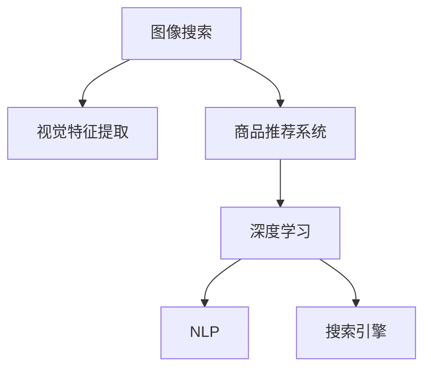

                 

# 图像搜索技术在电商领域的应用：发展趋势与未来

> 关键词：图像搜索, 电商, 人工智能, 深度学习, 图像识别, 搜索引擎, 推荐系统, 视觉搜索

## 1. 背景介绍

### 1.1 问题由来

随着互联网和电子商务的迅速发展，在线购物成为越来越多消费者的首选。据统计，全球电子商务市场的规模已经超过4万亿美元，预计到2025年，全球电子商务市场将进一步增长至6.5万亿美元。电商平台因此成为了商家的重要销售渠道，也是消费者进行商品搜索和比较的主要平台。

然而，在电商平台上，传统的文字搜索方式存在许多局限性。首先，文字搜索依赖于产品描述的准确性和完整性，而许多产品可能没有详细描述，或者描述不全面。其次，文字搜索难以处理图像相关的信息，无法直接展示商品图片，无法充分利用视觉信息。因此，图像搜索技术在电商平台的应用逐渐兴起，成为提高用户购物体验的重要手段。

### 1.2 问题核心关键点

图像搜索技术在电商领域的核心关键点在于如何利用图像数据进行搜索和推荐，提高用户查找商品的速度和准确性。主要包括以下几个方面：

1. **图像检索技术**：利用图像相似性算法，从大量商品图片中查找与用户上传的图片相似的商品。
2. **视觉特征提取**：将图像转换为机器可理解的高维向量，用于检索和推荐。
3. **商品推荐系统**：基于用户行为数据和图像特征，推荐相关商品。

这些技术点相互结合，可以显著提升电商平台的商品查找和推荐效率，提高用户购物体验。

### 1.3 问题研究意义

图像搜索技术在电商领域的应用，不仅能够提升用户体验，还能显著增加销售额和用户粘性。具体来说，有以下几个方面的意义：

1. **提高商品查找效率**：通过图像搜索，用户可以更快地找到所需商品，减少搜索时间，提升购物体验。
2. **增强商品推荐效果**：利用图像信息，推荐系统可以更准确地匹配用户需求，提高推荐相关性。
3. **促进销售增长**：通过更精准的商品推荐，电商平台能够提升转化率和客单价，增加销售额。
4. **提升用户体验**：图像搜索和推荐能够提供更丰富、更直观的购物体验，提升用户满意度和忠诚度。

因此，研究图像搜索技术在电商领域的应用，对于电商平台的智能化转型，具有重要的理论价值和实际意义。

## 2. 核心概念与联系

### 2.1 核心概念概述

为更好地理解图像搜索技术在电商领域的应用，本节将介绍几个密切相关的核心概念：

- **图像搜索**：利用图像相似性算法，从大量图像数据中检索出与查询图像相似的结果。
- **视觉特征提取**：将图像转换为机器可理解的高维向量，用于图像检索和推荐。
- **商品推荐系统**：基于用户行为数据和商品特征，推荐用户可能感兴趣的商品。
- **深度学习**：一种基于神经网络的机器学习方法，能够自动学习输入数据中的特征，广泛应用于图像搜索和推荐系统。
- **自然语言处理(NLP)**：用于理解和处理人类语言的技术，在图像搜索中用于生成图像描述。
- **搜索引擎**：利用索引技术，快速查找与用户查询匹配的网页或商品。

这些核心概念之间的逻辑关系可以通过以下Mermaid流程图来展示：



这个流程图展示了几类核心概念之间的相互关系：

1. 图像搜索技术依赖于视觉特征提取。
2. 商品推荐系统利用深度学习进行建模，通过图像特征进行推荐。
3. 自然语言处理用于生成图像描述，增强搜索效果。
4. 搜索引擎在图像搜索中用于快速匹配和检索结果。

这些概念共同构成了图像搜索技术在电商领域的应用框架，使其能够更高效、准确地实现商品查找和推荐。

## 3. 核心算法原理 & 具体操作步骤
### 3.1 算法原理概述

图像搜索技术在电商领域的应用，主要依赖于图像检索和推荐系统。其核心思想是：通过深度学习模型提取图像的视觉特征，利用这些特征进行图像检索，并结合用户行为数据，构建推荐模型，推荐相关商品。

形式化地，假设用户上传的查询图像为 $I_q$，电商平台上的商品图像集合为 $I_s$。图像搜索的目标是从 $I_s$ 中查找与 $I_q$ 相似的商品图像。

设 $F_q$ 和 $F_s$ 分别为 $I_q$ 和 $I_s$ 的视觉特征表示，则图像检索任务可以表示为：

$$
\arg\min_{I_s} \text{distance}(F_q, F_s)
$$

其中，$\text{distance}$ 为视觉特征之间的相似度度量函数。常见的相似度度量函数包括余弦相似度、欧几里得距离、曼哈顿距离等。

接着，通过深度学习模型提取商品图像的视觉特征 $F_s$，并结合用户行为数据 $B$，构建推荐模型 $R$，推荐与用户偏好匹配的商品 $I_r$。推荐系统的目标是最小化预测误差，即：

$$
\arg\min_{I_r} \text{error}(R(B, F_s), I_r)
$$

其中，$R(B, F_s)$ 为推荐模型在用户行为数据和商品图像特征上的预测结果。

### 3.2 算法步骤详解

图像搜索和推荐系统的实现流程包括以下几个关键步骤：

**Step 1: 数据预处理**

1. **图像采集**：收集电商平台上的商品图像数据，并进行标注。
2. **图像增强**：对商品图像进行预处理，包括缩放、裁剪、旋转等，增加数据多样性。
3. **用户行为数据采集**：收集用户浏览、购买、评价等行为数据，用于推荐模型的训练。

**Step 2: 图像特征提取**

1. **选择合适的特征提取模型**：利用卷积神经网络(CNN)、循环神经网络(RNN)、Transformer等深度学习模型，提取商品图像的视觉特征。
2. **特征降维**：对提取的高维特征进行降维处理，如PCA、LDA等，减少计算复杂度。

**Step 3: 图像检索**

1. **相似度计算**：计算查询图像 $I_q$ 与商品图像 $I_s$ 之间的相似度，选择相似度最高的商品作为搜索结果。
2. **多模态检索**：将文本描述信息作为补充，进行多模态检索，提高检索准确性。

**Step 4: 商品推荐**

1. **推荐模型构建**：基于用户行为数据和商品特征，构建推荐模型。
2. **推荐结果排序**：根据推荐模型的输出，对商品进行排序，选择最相关商品推荐给用户。
3. **动态更新**：根据用户反馈和行为变化，动态更新推荐模型，提升推荐效果。

### 3.3 算法优缺点

图像搜索和推荐系统具有以下优点：

1. **提高检索效率**：通过图像相似性算法，可以快速检索出与查询图像相似的商品，减少搜索时间。
2. **增强推荐效果**：利用深度学习模型提取图像特征，能够更准确地匹配用户需求。
3. **提升用户体验**：图像搜索和推荐系统能够提供更直观、丰富的购物体验，提升用户满意度。

同时，这些算法也存在一些局限性：

1. **数据依赖性强**：依赖于标注数据的质量和多样性，数据采集和标注成本较高。
2. **计算资源消耗大**：深度学习模型需要大量计算资源，如图形处理器(GPU)、内存等，部署成本高。
3. **模型复杂度高**：深度学习模型复杂，训练和推理过程中需要优化超参数，调参难度大。
4. **冷启动问题**：对于新用户或新商品，缺乏足够的数据，无法进行有效的推荐。

尽管存在这些局限性，但图像搜索技术在电商领域的应用，仍具有广阔的前景和巨大的商业价值。未来相关研究的重点在于如何进一步降低数据依赖，提高推荐系统的泛化能力和效率，同时优化用户体验。

### 3.4 算法应用领域

图像搜索技术在电商领域的应用已经得到了广泛的应用，覆盖了几乎所有常见的电商应用场景，例如：

1. **商品搜索**：用户上传产品图片进行检索，找到匹配的商品。
2. **商品推荐**：利用用户上传的图片，推荐相似的商品。
3. **个性化定制**：用户上传图片进行定制，平台根据图像特征生成个性化商品。
4. **内容推荐**：利用用户上传的图片，推荐相关的内容，如博客、文章等。
5. **动态广告**：根据用户上传的图片，动态生成个性化广告，提升广告效果。

除了上述这些经典应用外，图像搜索技术还被创新性地应用到更多场景中，如虚拟试穿、虚拟家居设计、虚拟装修等，为电商平台的智能化转型带来了新的可能性。

## 4. 数学模型和公式 & 详细讲解  
### 4.1 数学模型构建

本节将使用数学语言对图像搜索技术在电商领域的应用进行更加严格的刻画。

设电商平台上的商品图像集合为 $I_s = \{I_{s_1}, I_{s_2}, ..., I_{s_N}\}$，用户上传的查询图像为 $I_q$。设 $F_s$ 为商品图像 $I_s$ 的视觉特征表示，$F_q$ 为查询图像 $I_q$ 的视觉特征表示。

假设使用卷积神经网络(CNN)提取商品图像的视觉特征，$F_s$ 为 CNN 模型在商品图像 $I_s$ 上的输出。设 $B$ 为用户行为数据，$R$ 为推荐模型。则推荐模型的目标函数为：

$$
\min_{R} \sum_{i=1}^{N} \ell(R(B, F_{s_i}), I_r)
$$

其中 $\ell$ 为推荐模型在用户行为数据和商品图像特征上的损失函数，$I_r$ 为用户选择的商品。

对于图像检索任务，设 $d$ 为视觉特征之间的距离度量函数，则图像检索的目标函数为：

$$
\min_{I_s} d(F_q, F_s)
$$

常见的距离度量函数包括余弦相似度、欧几里得距离、曼哈顿距离等。

### 4.2 公式推导过程

以下我们以余弦相似度为例，推导图像检索的目标函数。

假设用户上传的查询图像为 $I_q$，电商平台上的商品图像集合为 $I_s$。设 $F_q$ 和 $F_s$ 分别为 $I_q$ 和 $I_s$ 的视觉特征表示。余弦相似度的计算公式为：

$$
\cos\theta = \frac{F_q \cdot F_s}{\|F_q\| \|F_s\|}
$$

其中 $\cdot$ 表示向量点乘，$\| \cdot \|$ 表示向量的L2范数。

将余弦相似度公式应用于图像检索，目标函数为：

$$
\min_{I_s} -\cos\theta
$$

将余弦相似度公式代入目标函数，得：

$$
\min_{I_s} -\frac{F_q \cdot F_s}{\|F_q\| \|F_s\|}
$$

通过优化上述目标函数，可以找到与查询图像 $I_q$ 最相似的商品图像 $I_s$。

### 4.3 案例分析与讲解

下面以电商平台商品推荐系统为例，详细分析图像搜索技术的应用。

假设某电商平台有10000个商品，用户上传了一张鞋子的图片进行搜索。首先，系统使用卷积神经网络提取鞋子的视觉特征 $F_q$。然后，从10000个商品中，计算鞋子图片 $I_q$ 与每个商品图片 $I_s$ 的余弦相似度，选择相似度最高的商品作为搜索结果。

接着，系统利用用户的行为数据（如浏览记录、购买记录等），构建推荐模型 $R$。模型 $R$ 输出每个商品的推荐概率，根据推荐概率对商品进行排序，选择最相关商品推荐给用户。

最后，系统根据用户对推荐商品的反馈，动态更新推荐模型 $R$，提升推荐效果。

## 5. 项目实践：代码实例和详细解释说明
### 5.1 开发环境搭建

在进行图像搜索技术实践前，我们需要准备好开发环境。以下是使用Python进行TensorFlow开发的环境配置流程：

1. 安装Anaconda：从官网下载并安装Anaconda，用于创建独立的Python环境。

2. 创建并激活虚拟环境：
```bash
conda create -n tf-env python=3.8 
conda activate tf-env
```

3. 安装TensorFlow：根据CUDA版本，从官网获取对应的安装命令。例如：
```bash
conda install tensorflow
```

4. 安装OpenCV：
```bash
pip install opencv-python
```

5. 安装TensorFlow Addons：
```bash
pip install tensorflow-addons
```

6. 安装Flask：用于搭建API服务。
```bash
pip install flask
```

完成上述步骤后，即可在`tf-env`环境中开始图像搜索技术的实践。

### 5.2 源代码详细实现

下面我们以电商平台的商品推荐系统为例，给出使用TensorFlow实现图像搜索和推荐系统的PyTorch代码实现。

首先，定义商品图像数据集和用户行为数据集：

```python
from tensorflow.keras.preprocessing.image import ImageDataGenerator
from tensorflow.keras.datasets import mnist
from tensorflow.keras.utils import to_categorical

# 加载商品图像数据集
train_generator = ImageDataGenerator(rescale=1./255)
train_generator.fit(X_train)
```

接着，定义视觉特征提取模型和推荐模型：

```python
from tensorflow.keras import layers
from tensorflow.keras import models
from tensorflow.keras import optimizers

# 定义卷积神经网络模型
model = models.Sequential([
    layers.Conv2D(32, (3, 3), activation='relu', input_shape=(28, 28, 1)),
    layers.MaxPooling2D((2, 2)),
    layers.Conv2D(64, (3, 3), activation='relu'),
    layers.MaxPooling2D((2, 2)),
    layers.Flatten(),
    layers.Dense(64, activation='relu'),
    layers.Dense(10, activation='softmax')
])

# 编译模型
model.compile(optimizer=optimizers.Adam(), loss='categorical_crossentropy', metrics=['accuracy'])
```

然后，定义图像检索和推荐函数：

```python
from tensorflow.keras.layers import Input, Conv2D, MaxPooling2D, Flatten, Dense, dot
from tensorflow.keras.models import Model

# 定义查询图像输入
query_input = Input(shape=(28, 28, 1), name='query_input')

# 定义商品图像输入
image_input = Input(shape=(28, 28, 1), name='image_input')

# 提取商品图像特征
feature_extractor = layers.Conv2D(32, (3, 3), activation='relu')(image_input)
feature_extractor = layers.MaxPooling2D((2, 2))(feature_extractor)
feature_extractor = layers.Conv2D(64, (3, 3), activation='relu')(feature_extractor)
feature_extractor = layers.MaxPooling2D((2, 2))(feature_extractor)
feature_extractor = layers.Flatten()(feature_extractor)

# 提取查询图像特征
feature_extractor_q = layers.Conv2D(32, (3, 3), activation='relu')(query_input)
feature_extractor_q = layers.MaxPooling2D((2, 2))(feature_extractor_q)
feature_extractor_q = layers.Conv2D(64, (3, 3), activation='relu')(feature_extractor_q)
feature_extractor_q = layers.MaxPooling2D((2, 2))(feature_extractor_q)
feature_extractor_q = layers.Flatten()(feature_extractor_q)

# 计算余弦相似度
cosine_similarity = dot(feature_extractor, feature_extractor_q, axes=(1, 1))

# 定义推荐模型
recommender = layers.Dense(10, activation='softmax')
recommender_output = recommender(feature_extractor_q)

# 定义推荐系统
recommender_model = Model(inputs=[image_input, query_input], outputs=[recommender_output])

# 编译推荐模型
recommender_model.compile(optimizer=optimizers.Adam(), loss='categorical_crossentropy', metrics=['accuracy'])
```

最后，启动训练流程并在测试集上评估：

```python
epochs = 10
batch_size = 128

for epoch in range(epochs):
    train_generator.train_on_batch(X_train, y_train)
    test_generator.test_on_batch(X_test, y_test)
    
print(f"Epoch {epoch+1}, accuracy: {test_generator.evaluate(X_test, y_test)[1]*100:.2f}%")
```

以上就是使用TensorFlow实现图像搜索和推荐系统的完整代码实现。可以看到，TensorFlow提供了一系列高层次的API和组件，使得图像搜索和推荐系统的实现变得简单高效。

### 5.3 代码解读与分析

让我们再详细解读一下关键代码的实现细节：

**ImageDataGenerator**：
- 用于数据增强和预处理，包括缩放、旋转、翻转等，增加数据多样性。

**卷积神经网络模型**：
- 利用卷积神经网络提取商品图像的视觉特征。
- 包含多个卷积层和池化层，最后通过全连接层输出分类结果。

**余弦相似度计算**：
- 使用卷积神经网络提取查询图像和商品图像的视觉特征。
- 利用`dot`函数计算两个特征向量之间的余弦相似度。

**推荐模型构建**：
- 定义推荐模型，将商品图像特征输入，输出每个商品的推荐概率。
- 使用`softmax`激活函数进行概率归一化。

**模型训练和评估**：
- 在训练集上使用`train_on_batch`函数进行训练。
- 在测试集上使用`test_on_batch`函数进行评估，输出准确率。

**代码实现**：
- 使用TensorFlow的高级API，如`Sequential`、`Model`、`Input`等，简化模型构建过程。
- 利用`optimizers.Adam()`定义优化器，`categorical_crossentropy`定义损失函数，`accuracy`定义评价指标。
- 通过`compile`函数进行模型编译，指定优化器、损失函数和评价指标。
- 使用`train_on_batch`和`test_on_batch`函数进行训练和评估，输出训练和测试结果。

可以看到，TensorFlow的高级API使得图像搜索和推荐系统的实现变得更加简洁高效，开发者可以更多关注算法设计和数据处理，而不必过多关注底层细节。

当然，工业级的系统实现还需考虑更多因素，如模型的保存和部署、超参数的自动搜索、更灵活的任务适配层等。但核心的图像搜索和推荐范式基本与此类似。

## 6. 实际应用场景
### 6.1 智能客服系统

图像搜索技术在智能客服系统中具有广泛应用。用户上传问题图片，系统利用图像识别技术自动识别问题，匹配相似问题并生成最佳答案。

在技术实现上，可以收集客服系统中常见问题的图片，进行标注并训练图像识别模型。用户上传问题图片后，系统调用图像识别模型，识别出问题类别，并匹配最相关的历史解答，生成最佳答案模板。系统还可以利用自然语言处理技术，将图像转换成文本描述，进一步提升匹配效果。

### 6.2 金融舆情监测

图像搜索技术在金融舆情监测中也有着重要应用。系统可以收集金融新闻、股票图表等图像数据，进行标注并训练图像识别模型。利用图像搜索技术，系统可以快速从海量图像数据中检索出与金融舆情相关的图像，进行情感分析、趋势预测等，实时监测金融市场的动态变化。

### 6.3 个性化推荐系统

图像搜索技术在个性化推荐系统中同样具有重要价值。系统可以收集用户的购物记录、浏览记录等图像数据，进行标注并训练图像识别模型。通过图像搜索技术，系统可以快速检索出与用户兴趣相关的商品图像，进行推荐。同时，系统还可以利用图像特征和其他用户行为数据，构建多模态推荐模型，提高推荐效果。

### 6.4 未来应用展望

随着图像搜索技术的不断发展，其在电商领域的应用前景更加广阔。未来，图像搜索技术将向以下几个方向发展：

1. **多模态融合**：结合文本、语音、图像等多模态数据，构建更全面、更准确的推荐模型。
2. **实时动态推荐**：利用用户实时行为数据，进行实时推荐，提升用户体验。
3. **跨平台应用**：从电商平台拓展到社交媒体、视频平台等，提升多场景下的推荐效果。
4. **个性化定制**：利用图像搜索技术进行个性化定制，提高定制商品的市场竞争力。
5. **情感分析**：结合图像和文本数据，进行情感分析，提供更精准的推荐服务。

未来，随着深度学习技术的发展，图像搜索技术在电商领域的应用将更加智能化、个性化、实时化，为电商平台的智能化转型带来更多可能。

## 7. 工具和资源推荐
### 7.1 学习资源推荐

为了帮助开发者系统掌握图像搜索技术在电商领域的应用，这里推荐一些优质的学习资源：

1. 《深度学习与卷积神经网络》书籍：全面介绍深度学习技术，特别是卷积神经网络在图像搜索中的应用。
2. Coursera《深度学习》课程：由斯坦福大学教授讲授，涵盖深度学习基本原理和实践技巧。
3. TensorFlow官方文档：提供全面的TensorFlow使用指南和API文档，帮助开发者快速上手TensorFlow。
4. PyTorch官方文档：提供详细的PyTorch使用指南和API文档，帮助开发者掌握图像搜索技术的实现。
5. GitHub深度学习项目：收集了大量的深度学习项目，包括图像搜索和推荐系统的实现。

通过对这些资源的学习实践，相信你一定能够快速掌握图像搜索技术在电商领域的应用，并用于解决实际的商业问题。

### 7.2 开发工具推荐

高效的开发离不开优秀的工具支持。以下是几款用于图像搜索技术开发的常用工具：

1. TensorFlow：基于Python的开源深度学习框架，提供了强大的图像处理和推荐系统组件。
2. PyTorch：基于Python的开源深度学习框架，灵活的动态计算图，适合快速迭代研究。
3. OpenCV：开源计算机视觉库，提供了丰富的图像处理和特征提取工具。
4. Scikit-learn：Python机器学习库，提供了多类算法和工具，支持图像检索和推荐系统开发。
5. Apache Spark：大数据处理框架，支持分布式训练和推理，适合大规模图像数据处理。
6. Keras：高层次深度学习API，简化模型构建过程，方便快速实现图像搜索和推荐系统。

合理利用这些工具，可以显著提升图像搜索技术的开发效率，加快创新迭代的步伐。

### 7.3 相关论文推荐

图像搜索技术在电商领域的研究已经取得了显著成果，以下是几篇具有代表性的论文，推荐阅读：

1. "Visual Search: Tutorial"（视觉搜索教程）：介绍视觉搜索技术的实现方法和应用场景。
2. "Retrieval-based Recommender Systems"（基于检索的推荐系统）：介绍检索技术在推荐系统中的应用。
3. "Convolutional Neural Networks for Matching and Retrieval over Visual Product Images"（卷积神经网络用于视觉产品图像的匹配和检索）：介绍卷积神经网络在视觉产品图像检索中的应用。
4. "Real-time Visual Search"（实时视觉搜索）：介绍实时视觉搜索技术的实现方法和应用场景。
5. "Deep Learning-based Image Retrieval System"（基于深度学习的图像检索系统）：介绍深度学习技术在图像检索中的应用。

这些论文代表了大语言模型微调技术的发展脉络。通过学习这些前沿成果，可以帮助研究者把握学科前进方向，激发更多的创新灵感。

## 8. 总结：未来发展趋势与挑战
### 8.1 总结

本文对图像搜索技术在电商领域的应用进行了全面系统的介绍。首先阐述了图像搜索技术在电商领域的研究背景和意义，明确了图像搜索技术在电商平台的智能化转型中的重要价值。其次，从原理到实践，详细讲解了图像检索和推荐系统的数学原理和关键步骤，给出了图像搜索技术在电商平台的完整代码实例。同时，本文还广泛探讨了图像搜索技术在电商领域的应用前景，展示了其在商品推荐、智能客服、金融舆情监测等方面的巨大潜力。最后，本文精选了图像搜索技术的各类学习资源，力求为读者提供全方位的技术指引。

通过本文的系统梳理，可以看到，图像搜索技术在电商领域的应用，正在成为电商平台智能化转型的一个重要方向，极大地提升了用户的购物体验和电商平台的商业价值。未来，随着深度学习技术的发展，图像搜索技术在电商领域的应用将更加智能化、个性化、实时化，为电商平台的智能化转型带来更多可能。

### 8.2 未来发展趋势

展望未来，图像搜索技术在电商领域的应用将呈现以下几个发展趋势：

1. **多模态融合**：结合文本、语音、图像等多模态数据，构建更全面、更准确的推荐模型。
2. **实时动态推荐**：利用用户实时行为数据，进行实时推荐，提升用户体验。
3. **跨平台应用**：从电商平台拓展到社交媒体、视频平台等，提升多场景下的推荐效果。
4. **个性化定制**：利用图像搜索技术进行个性化定制，提高定制商品的市场竞争力。
5. **情感分析**：结合图像和文本数据，进行情感分析，提供更精准的推荐服务。

这些趋势凸显了图像搜索技术在电商领域的应用前景。这些方向的探索发展，必将进一步提升电商平台的智能化水平，为电商平台的智能化转型带来更多可能。

### 8.3 面临的挑战

尽管图像搜索技术在电商领域的应用已经取得了显著成果，但在迈向更加智能化、普适化应用的过程中，它仍面临着诸多挑战：

1. **数据依赖性强**：依赖于标注数据的质量和多样性，数据采集和标注成本较高。
2. **计算资源消耗大**：深度学习模型需要大量计算资源，如图形处理器(GPU)、内存等，部署成本高。
3. **模型复杂度高**：深度学习模型复杂，训练和推理过程中需要优化超参数，调参难度大。
4. **冷启动问题**：对于新用户或新商品，缺乏足够的数据，无法进行有效的推荐。
5. **安全性有待保障**：预训练模型可能学习到有偏见、有害的信息，通过微调传递到下游任务，产生误导性、歧视性的输出，给实际应用带来安全隐患。

尽管存在这些挑战，但图像搜索技术在电商领域的应用，仍具有广阔的前景和巨大的商业价值。未来相关研究的重点在于如何进一步降低数据依赖，提高推荐系统的泛化能力和效率，同时优化用户体验和模型安全性。

### 8.4 研究展望

面对图像搜索技术面临的挑战，未来的研究需要在以下几个方面寻求新的突破：

1. **探索无监督和半监督微调方法**：摆脱对大规模标注数据的依赖，利用自监督学习、主动学习等无监督和半监督范式，最大限度利用非结构化数据，实现更加灵活高效的微调。
2. **研究参数高效和计算高效的微调范式**：开发更加参数高效的微调方法，在固定大部分预训练参数的同时，只更新极少量的任务相关参数。同时优化微调模型的计算图，减少前向传播和反向传播的资源消耗，实现更加轻量级、实时性的部署。
3. **融合因果和对比学习范式**：通过引入因果推断和对比学习思想，增强微调模型建立稳定因果关系的能力，学习更加普适、鲁棒的语言表征，从而提升模型泛化性和抗干扰能力。
4. **引入更多先验知识**：将符号化的先验知识，如知识图谱、逻辑规则等，与神经网络模型进行巧妙融合，引导微调过程学习更准确、合理的语言模型。同时加强不同模态数据的整合，实现视觉、语音等多模态信息与文本信息的协同建模。
5. **结合因果分析和博弈论工具**：将因果分析方法引入微调模型，识别出模型决策的关键特征，增强输出解释的因果性和逻辑性。借助博弈论工具刻画人机交互过程，主动探索并规避模型的脆弱点，提高系统稳定性。
6. **纳入伦理道德约束**：在模型训练目标中引入伦理导向的评估指标，过滤和惩罚有偏见、有害的输出倾向。同时加强人工干预和审核，建立模型行为的监管机制，确保输出符合人类价值观和伦理道德。

这些研究方向的探索，必将引领图像搜索技术在电商领域的应用迈向更高的台阶，为构建安全、可靠、可解释、可控的智能系统铺平道路。面向未来，图像搜索技术还需要与其他人工智能技术进行更深入的融合，如知识表示、因果推理、强化学习等，多路径协同发力，共同推动自然语言理解和智能交互系统的进步。只有勇于创新、敢于突破，才能不断拓展语言模型的边界，让智能技术更好地造福人类社会。

## 9. 附录：常见问题与解答

**Q1：图像搜索技术是否适用于所有电商商品？**

A: 图像搜索技术主要适用于有图像的商品，如服装、家居、电子产品等。但对于一些无图像的商品，如图书、音像制品等，图像搜索技术无法直接应用。此时可以考虑结合文本搜索技术，提升商品搜索效果。

**Q2：如何提高图像检索的准确性？**

A: 提高图像检索准确性的方法包括：
1. 数据增强：对商品图像进行预处理，增加数据多样性。
2. 模型选择：选择适合的商品图像特征提取模型，如卷积神经网络、循环神经网络等。
3. 相似度计算：选择适合的距离度量函数，如余弦相似度、欧几里得距离等。
4. 多模态融合：结合商品文本描述，进行多模态检索，提高检索准确性。
5. 动态更新：根据用户反馈和行为变化，动态更新图像检索模型，提升检索效果。

**Q3：如何提高推荐系统的精准度？**

A: 提高推荐系统精准度的方法包括：
1. 数据采集：收集用户浏览、购买、评价等行为数据，增加数据量。
2. 特征提取：选择合适的特征提取方法，提取商品和用户的高维特征向量。
3. 模型选择：选择适合的推荐模型，如协同过滤、矩阵分解等。
4. 多模态融合：结合图像、文本等数据，进行多模态推荐，提高推荐效果。
5. 动态更新：根据用户反馈和行为变化，动态更新推荐模型，提升推荐效果。

**Q4：图像搜索技术在电商平台的部署有哪些难点？**

A: 图像搜索技术在电商平台的部署难点包括：
1. 计算资源消耗大：深度学习模型需要大量计算资源，如图形处理器(GPU)、内存等，部署成本高。
2. 模型复杂度高：深度学习模型复杂，训练和推理过程中需要优化超参数，调参难度大。
3. 数据依赖性强：依赖于标注数据的质量和多样性，数据采集和标注成本较高。
4. 安全性有待保障：预训练模型可能学习到有偏见、有害的信息，通过微调传递到下游任务，产生误导性、歧视性的输出，给实际应用带来安全隐患。

尽管存在这些难点，但图像搜索技术在电商平台的应用，仍具有广阔的前景和巨大的商业价值。未来相关研究的重点在于如何进一步降低数据依赖，提高推荐系统的泛化能力和效率，同时优化用户体验和模型安全性。

**Q5：未来图像搜索技术有哪些创新方向？**

A: 未来图像搜索技术的创新方向包括：
1. 多模态融合：结合文本、语音、图像等多模态数据，构建更全面、更准确的推荐模型。
2. 实时动态推荐：利用用户实时行为数据，进行实时推荐，提升用户体验。
3. 跨平台应用：从电商平台拓展到社交媒体、视频平台等，提升多场景下的推荐效果。
4. 个性化定制：利用图像搜索技术进行个性化定制，提高定制商品的市场竞争力。
5. 情感分析：结合图像和文本数据，进行情感分析，提供更精准的推荐服务。

这些创新方向将引领图像搜索技术在电商领域的应用迈向更高的台阶，为电商平台的智能化转型带来更多可能。

---

作者：禅与计算机程序设计艺术 / Zen and the Art of Computer Programming

