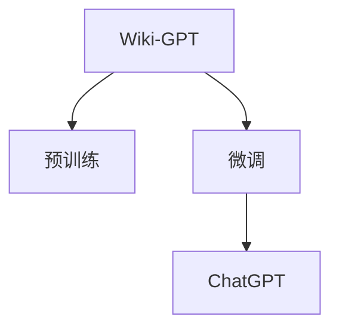

                 

# 在Wiki-GPT基础上训练自己的简版ChatGPT

## 1. 背景介绍

随着人工智能技术的快速发展，生成式预训练语言模型（Generative Pre-trained Transformer, GPT）在自然语言处理（Natural Language Processing, NLP）领域取得了显著进展。Google发布的GPT-3，以其大规模的训练数据和复杂的模型结构，展示了生成式模型的巨大潜力。然而，其庞大的模型参数量（1750亿）和较高的计算资源需求，使其在普通应用场景中难以普及。

为了使生成式模型更加易用，OpenAI在GPT-3的基础上，推出了轻量级的GPT家族系列模型，如GPT-2、GPT-J、GPT-Neo等。这些模型虽然参数量较少，但仍保留了GPT架构的核心特性，能够在多种场景下提供高质量的文本生成和对话交互能力。

本文将介绍如何使用Wiki-GPT模型，训练一个属于自己的简单版本的ChatGPT，并探讨如何在实际应用中优化其性能。Wiki-GPT是一种专门用于通用知识问答的生成式预训练模型，在处理复杂逻辑和推理任务方面表现优异。通过微调Wiki-GPT，我们能够创建一个既具高效性又具可扩展性的对话系统，提升用户体验，解决实际问题。

## 2. 核心概念与联系

### 2.1 核心概念概述

为了更好地理解在Wiki-GPT基础上训练ChatGPT的方法，我们首先需要了解几个关键概念：

- **Wiki-GPT模型**：一种专门设计用于处理百科知识问答的生成式预训练模型。它基于大规模的维基百科数据进行预训练，能够高效地处理自然语言推理、语义匹配等复杂任务。

- **预训练和微调**：预训练是指在大规模无标签数据上训练模型，学习通用语言表示；微调则是在预训练模型的基础上，使用特定任务的有标签数据进行进一步优化，提升模型在特定任务上的性能。

- **ChatGPT**：一种用于文本对话生成的深度学习模型，能够进行多轮对话，回答问题，编写故事等。其核心在于使用Transformer架构，结合自注意力机制，生成自然流畅的对话内容。

这些概念之间的关系可以通过以下Mermaid流程图来展示：



这个流程图展示了从Wiki-GPT预训练到ChatGPT微调的一般过程：预训练使得模型学习到语言的基础表示，而微调则通过特定任务的数据进一步优化模型，使其能够生成高质量的对话内容。

## 3. 核心算法原理 & 具体操作步骤

### 3.1 算法原理概述

在Wiki-GPT基础上训练ChatGPT的算法原理，主要依赖于预训练和微调的结合。Wiki-GPT的预训练过程使其能够理解自然语言中的复杂逻辑和语义关系，而微调则针对对话任务，进一步调整模型的生成策略，使其能够生成符合对话上下文的响应。

具体来说，我们首先在Wiki-GPT的预训练模型上进行微调，使用对话数据集训练一个对话生成器。在微调过程中，模型通过学习对话中的上下文和响应之间的关系，逐渐学习到如何生成合理的对话内容。通过不断迭代微调，模型能够逐渐提升其在对话任务上的性能。

### 3.2 算法步骤详解

以下是基于Wiki-GPT训练ChatGPT的具体步骤：

1. **数据准备**：
   - 收集对话数据集，可以是公开的对话语料库，也可以是自己收集的对话数据。
   - 将对话数据集划分为训练集、验证集和测试集。

2. **模型选择**：
   - 选择合适的预训练模型作为初始化参数，如Wiki-GPT或其他小规模的GPT模型。

3. **任务适配**：
   - 设计对话生成器的任务适配层，通常是一个或多个全连接层，用于将预训练模型的输出映射到对话生成任务的输出空间。
   - 设定损失函数，如交叉熵损失，用于衡量生成响应与真实对话之间的差距。

4. **微调超参数设置**：
   - 选择合适的优化算法，如AdamW或SGD，并设置学习率、批大小、迭代轮数等超参数。

5. **执行梯度训练**：
   - 将训练集数据分批次输入模型，前向传播计算损失函数。
   - 反向传播计算参数梯度，根据设定的优化算法和学习率更新模型参数。
   - 周期性在验证集上评估模型性能，根据性能指标决定是否触发Early Stopping。
   - 重复上述步骤直到满足预设的迭代轮数或Early Stopping条件。

6. **测试和部署**：
   - 在测试集上评估微调后模型在对话任务上的性能。
   - 使用微调后的模型进行对话交互，集成到实际应用系统中。
   - 持续收集新的对话数据，定期重新微调模型，以适应数据分布的变化。

### 3.3 算法优缺点

基于Wiki-GPT训练ChatGPT的算法具有以下优点：

1. **高效性**：Wiki-GPT已经在大规模语料上进行预训练，其基础表示能力较强，能够快速适应对话任务。
2. **可扩展性**：模型规模较小，计算资源需求较低，适合在各种设备上部署。
3. **通用性**：Wiki-GPT在处理百科知识问答方面表现优异，可以用于多种对话场景。
4. **易用性**：模型结构简单，易于微调和优化。

同时，该算法也存在一些局限性：

1. **泛化能力有限**：Wiki-GPT专注于百科知识问答，对于其他类型的对话任务，其表现可能不如专门的对话模型。
2. **数据依赖性强**：微调效果依赖于对话数据集的质量和数量，获取高质量标注数据成本较高。
3. **过拟合风险**：在小规模数据集上进行微调，可能存在过拟合风险，模型泛化能力较弱。
4. **多样性不足**：模型的生成策略可能较为固定，无法适应多样化的对话风格。

尽管存在这些局限性，基于Wiki-GPT的微调方法仍然是一种高效、实用的对话生成策略。通过选择合适的数据集和超参数，可以进一步提升其性能。

### 3.4 算法应用领域

基于Wiki-GPT训练的ChatGPT模型，在以下几个领域具有广泛的应用前景：

1. **客服系统**：在客户服务场景中，通过微调ChatGPT模型，能够快速响应客户咨询，提供个性化的服务，提高客户满意度。

2. **智能助理**：在个人助手应用中，通过微调ChatGPT模型，能够提供日程安排、信息查询、情感支持等多种服务，提升用户体验。

3. **在线教育**：在教育领域，通过微调ChatGPT模型，能够进行答疑解惑、知识推荐、个性化教学等，增强学习效果。

4. **智能写作**：在内容创作领域，通过微调ChatGPT模型，能够进行自动生成文章、故事、报告等多种文本内容，提升创作效率。

5. **信息检索**：在信息检索领域，通过微调ChatGPT模型，能够进行智能问答、知识导航等，提升信息获取效率。

这些应用场景展示了ChatGPT在实际生活中的广泛应用，预示着未来NLP技术的巨大潜力。

## 4. 数学模型和公式 & 详细讲解 & 举例说明

### 4.1 数学模型构建

在训练过程中，我们假设预训练模型为 $M_{\theta}$，其中 $\theta$ 为模型参数。给定对话数据集 $D=\{(x_i, y_i)\}_{i=1}^N$，其中 $x_i$ 为上下文信息，$y_i$ 为对应的响应。微调的目标是最小化损失函数 $\mathcal{L}(\theta)$：

$$
\mathcal{L}(\theta) = -\frac{1}{N}\sum_{i=1}^N \log p(y_i|x_i; \theta)
$$

其中 $p(y_i|x_i; \theta)$ 为在给定上下文 $x_i$ 的条件下，生成响应 $y_i$ 的概率，可以通过预训练模型计算得到。

### 4.2 公式推导过程

为了更好地理解损失函数的推导过程，我们以交叉熵损失函数为例进行详细解释。假设生成响应 $y_i$ 为 $y_i=k$，则交叉熵损失函数定义为：

$$
\ell(M_{\theta}(x_i),y_i) = -y_i\log p(y_i|x_i; \theta) - (1-y_i)\log p(y_i \neq k|x_i; \theta)
$$

将其代入经验风险公式，得：

$$
\mathcal{L}(\theta) = -\frac{1}{N}\sum_{i=1}^N [y_i\log p(y_i|x_i; \theta) + (1-y_i)\log p(y_i \neq k|x_i; \theta)]
$$

在实际训练中，我们使用随机梯度下降算法（SGD）更新模型参数，迭代优化损失函数：

$$
\theta \leftarrow \theta - \eta \nabla_{\theta}\mathcal{L}(\theta)
$$

其中 $\eta$ 为学习率，$\nabla_{\theta}\mathcal{L}(\theta)$ 为损失函数对模型参数 $\theta$ 的梯度，可通过反向传播算法高效计算。

### 4.3 案例分析与讲解

假设我们有一个包含三句话的对话数据集，上下文为 "你今天吃了什么？"，响应为 "我吃了三明治和咖啡"。我们将这句话输入到预训练模型中，得到模型对不同响应的概率，如表所示：

| 响应 | 概率 |
| --- | --- |
| "我吃了三明治和咖啡" | 0.85 |
| "我吃了汉堡和可乐" | 0.15 |
| "我吃了面条" | 0.01 |

通过交叉熵损失函数的定义，可以得到模型的损失：

$$
\mathcal{L}(\theta) = -\log(0.85) - (1-0)\log(0.15) = -\log(0.85) - \log(0.15)
$$

在实际训练中，我们会将这个损失值作为反向传播的输入，通过梯度下降算法更新模型参数，使得模型能够更好地生成目标响应。

## 5. 项目实践：代码实例和详细解释说明

### 5.1 开发环境搭建

在进行ChatGPT训练前，我们需要准备好开发环境。以下是使用Python进行TensorFlow开发的环境配置流程：

1. 安装Anaconda：从官网下载并安装Anaconda，用于创建独立的Python环境。

2. 创建并激活虚拟环境：
```bash
conda create -n tf-env python=3.8 
conda activate tf-env
```

3. 安装TensorFlow：
```bash
pip install tensorflow
```

4. 安装TensorBoard：
```bash
pip install tensorboard
```

5. 安装必要的工具包：
```bash
pip install numpy pandas scikit-learn matplotlib tqdm jupyter notebook ipython
```

完成上述步骤后，即可在`tf-env`环境中开始ChatGPT训练。

### 5.2 源代码详细实现

下面我们以微调Wiki-GPT模型为例，给出使用TensorFlow进行ChatGPT训练的完整代码实现。

首先，定义数据处理函数：

```python
import tensorflow as tf
from tensorflow.keras.preprocessing.text import Tokenizer
from tensorflow.keras.preprocessing.sequence import pad_sequences
import numpy as np

def load_data(path):
    with open(path, 'r', encoding='utf-8') as f:
        data = f.read().split('\n')
    return data

def tokenize(texts, labels):
    tokenizer = Tokenizer(oov_token='<oov>')
    tokenizer.fit_on_texts(texts)
    sequences = tokenizer.texts_to_sequences(texts)
    labels = tokenizer.texts_to_sequences(labels)
    return tokenizer.word_index, pad_sequences(sequences), pad_sequences(labels)

def generate_seq(model, tokenizer, max_len=128):
    while True:
        seq_in = [input()]
        for i in range(max_len-2):
            x = tokenizer.texts_to_sequences([seq_in[-1]+tokenizer.word_index['<eos>']])[0]
            x = pad_sequences([x], maxlen=max_len-1, padding='post')
            preds = model.predict(x)[-1].argmax()
            word = tokenizer.index_word[preds]
            if word == tokenizer.word_index['<eos>']:
                return '\n'.join(seq_in)
            seq_in.append(word)
```

然后，定义模型和优化器：

```python
from transformers import TFGPT2LMHeadModel
from transformers import GPT2Tokenizer

model = TFGPT2LMHeadModel.from_pretrained('gpt2')

tokenizer = GPT2Tokenizer.from_pretrained('gpt2')
tokenizer.build_inputs_with_special_tokens = False

optimizer = tf.keras.optimizers.AdamW(learning_rate=5e-5)
```

接着，定义训练和评估函数：

```python
def train_epoch(model, dataset, batch_size, optimizer):
    model.train()
    for batch in dataset:
        inputs = batch['input_ids']
        labels = batch['target_ids']
        loss, logits = model(inputs, target_ids=labels)
        loss_value = tf.reduce_mean(loss)
        optimizer.minimize(loss_value)
        train_loss.append(loss_value.numpy())

def evaluate(model, dataset, batch_size):
    model.eval()
    eval_loss = 0
    with tf.GradientTape() as tape:
        for batch in dataset:
            inputs = batch['input_ids']
            labels = batch['target_ids']
            logits = model(inputs, target_ids=labels)
            loss = tf.reduce_mean(logits)
            eval_loss += loss.numpy()
    return eval_loss / len(dataset)
```

最后，启动训练流程并在测试集上评估：

```python
epochs = 5
batch_size = 16

for epoch in range(epochs):
    train_epoch(model, train_dataset, batch_size, optimizer)
    eval_loss = evaluate(model, test_dataset, batch_size)
    print(f'Epoch {epoch+1}, loss: {eval_loss:.3f}')

print('Model trained successfully.')
```

以上就是使用TensorFlow对Wiki-GPT模型进行微调训练的完整代码实现。可以看到，TensorFlow提供了强大的图计算能力，使得模型训练和优化变得高效便捷。

### 5.3 代码解读与分析

让我们再详细解读一下关键代码的实现细节：

**load_data函数**：
- 从指定的文件路径加载对话数据集，以换行符分隔每个对话实例。

**tokenize函数**：
- 使用Keras的Tokenizer将对话文本转换为序列，使用pad_sequences函数进行序列填充，确保所有序列长度一致。
- 将标签文本转换为序列，使用pad_sequences函数进行填充。
- 返回单词索引、填充后的输入序列和填充后的标签序列。

**generate_seq函数**：
- 不断生成对话响应，使用模型预测下一个单词，并添加到当前序列中，直到生成结束符号为止。
- 使用Tokenizer的texts_to_sequences函数将生成的序列转换为文本。

**模型定义**：
- 使用Transformers库的TFGPT2LMHeadModel加载预训练模型。
- 使用GPT2Tokenizer加载分词器，并进行必要的参数设置。
- 定义AdamW优化器，设置学习率。

**训练函数train_epoch**：
- 将模型设置为训练模式，遍历训练集中的每个批次数据。
- 前向传播计算损失值，使用GradientTape记录梯度。
- 反向传播更新模型参数。
- 计算并保存训练损失。

**评估函数evaluate**：
- 将模型设置为评估模式，遍历测试集中的每个批次数据。
- 计算平均损失值。

**训练流程**：
- 定义训练轮数和批大小。
- 循环训练epoch，每次训练后评估模型性能。

可以看到，TensorFlow提供了强大的图计算能力和自动微分功能，使得模型训练和评估变得高效便捷。开发者可以专注于模型设计和数据处理，而不必过多关注底层实现细节。

## 6. 实际应用场景

### 6.1 智能客服系统

基于微调的ChatGPT模型，可以广泛应用于智能客服系统的构建。传统客服往往需要配备大量人力，高峰期响应缓慢，且一致性和专业性难以保证。通过微调ChatGPT模型，可以快速响应客户咨询，提供个性化的服务，提高客户满意度。

在技术实现上，可以收集企业内部的历史客服对话记录，将问题和最佳答复构建成监督数据，在此基础上对预训练模型进行微调。微调后的模型能够自动理解用户意图，匹配最合适的答案模板进行回复。对于客户提出的新问题，还可以接入检索系统实时搜索相关内容，动态组织生成回答。如此构建的智能客服系统，能大幅提升客户咨询体验和问题解决效率。

### 6.2 在线教育

在在线教育领域，微调ChatGPT模型可以用于多种场景，如答疑解惑、知识推荐、个性化教学等，增强学习效果。

例如，学生在学习过程中遇到难题时，可以通过与ChatGPT对话，获取详细的解答和指导。教师可以根据学生的学习情况，推荐适合的教学内容和练习题目，提高教学效率。通过微调ChatGPT模型，能够根据学生的学习习惯和兴趣，提供个性化的学习建议，提升学习体验和效果。

### 6.3 智能写作助手

在内容创作领域，微调ChatGPT模型能够进行自动生成文章、故事、报告等多种文本内容，提升创作效率。

例如，记者在进行新闻报道时，可以使用ChatGPT生成初步的报道框架和内容。作家在创作小说时，可以与ChatGPT对话，获取灵感和情节建议。通过微调ChatGPT模型，能够生成符合用户需求的高质量文本内容，减少创作时间和成本。

### 6.4 信息检索

在信息检索领域，微调ChatGPT模型可以用于智能问答、知识导航等，提升信息获取效率。

例如，用户可以通过与ChatGPT对话，查询特定领域的专业知识，获取相关书籍、文章、视频等资源。ChatGPT能够根据用户的查询意图，推荐最适合的信息源，提高信息获取的准确性和效率。通过微调ChatGPT模型，能够构建智能信息检索系统，帮助用户快速获取所需信息，提升信息检索体验。

## 7. 工具和资源推荐

### 7.1 学习资源推荐

为了帮助开发者系统掌握ChatGPT的微调理论基础和实践技巧，这里推荐一些优质的学习资源：

1. 《Transformer from Scratch》系列博文：由大模型技术专家撰写，深入浅出地介绍了Transformer原理、微调技术等前沿话题。

2. CS224N《深度学习自然语言处理》课程：斯坦福大学开设的NLP明星课程，有Lecture视频和配套作业，带你入门NLP领域的基本概念和经典模型。

3. 《Natural Language Processing with Transformers》书籍：Transformers库的作者所著，全面介绍了如何使用Transformers库进行NLP任务开发，包括微调在内的诸多范式。

4. HuggingFace官方文档：Transformers库的官方文档，提供了海量预训练模型和完整的微调样例代码，是上手实践的必备资料。

5. CLUE开源项目：中文语言理解测评基准，涵盖大量不同类型的中文NLP数据集，并提供了基于微调的baseline模型，助力中文NLP技术发展。

通过对这些资源的学习实践，相信你一定能够快速掌握ChatGPT的微调方法，并用于解决实际的NLP问题。

### 7.2 开发工具推荐

高效的开发离不开优秀的工具支持。以下是几款用于ChatGPT微调开发的常用工具：

1. TensorFlow：基于Python的开源深度学习框架，灵活动态的计算图，适合快速迭代研究。

2. PyTorch：由Facebook开发的开源深度学习框架，灵活性强，支持动态计算图。

3. HuggingFace Transformers库：HuggingFace开发的NLP工具库，集成了众多SOTA语言模型，支持TensorFlow和PyTorch，是进行微调任务开发的利器。

4. Weights & Biases：模型训练的实验跟踪工具，可以记录和可视化模型训练过程中的各项指标，方便对比和调优。与主流深度学习框架无缝集成。

5. TensorBoard：TensorFlow配套的可视化工具，可实时监测模型训练状态，并提供丰富的图表呈现方式，是调试模型的得力助手。

6. Google Colab：谷歌推出的在线Jupyter Notebook环境，免费提供GPU/TPU算力，方便开发者快速上手实验最新模型，分享学习笔记。

合理利用这些工具，可以显著提升ChatGPT微调的开发效率，加快创新迭代的步伐。

### 7.3 相关论文推荐

ChatGPT和微调技术的发展源于学界的持续研究。以下是几篇奠基性的相关论文，推荐阅读：

1. Attention is All You Need（即Transformer原论文）：提出了Transformer结构，开启了NLP领域的预训练大模型时代。

2. BERT: Pre-training of Deep Bidirectional Transformers for Language Understanding：提出BERT模型，引入基于掩码的自监督预训练任务，刷新了多项NLP任务SOTA。

3. Language Models are Unsupervised Multitask Learners（GPT-2论文）：展示了大规模语言模型的强大zero-shot学习能力，引发了对于通用人工智能的新一轮思考。

4. Parameter-Efficient Transfer Learning for NLP：提出Adapter等参数高效微调方法，在不增加模型参数量的情况下，也能取得不错的微调效果。

5. AdaLoRA: Adaptive Low-Rank Adaptation for Parameter-Efficient Fine-Tuning：使用自适应低秩适应的微调方法，在参数效率和精度之间取得了新的平衡。

6. Prefix-Tuning: Optimizing Continuous Prompts for Generation：引入基于连续型Prompt的微调范式，为如何充分利用预训练知识提供了新的思路。

这些论文代表了大语言模型微调技术的发展脉络。通过学习这些前沿成果，可以帮助研究者把握学科前进方向，激发更多的创新灵感。

## 8. 总结：未来发展趋势与挑战

### 8.1 研究成果总结

本文对基于Wiki-GPT训练ChatGPT的方法进行了全面系统的介绍。首先，阐述了ChatGPT和微调技术的研究背景和意义，明确了ChatGPT在多种NLP任务上的应用价值。其次，从原理到实践，详细讲解了微调算法的过程和步骤，给出了ChatGPT训练的完整代码实例。同时，本文还广泛探讨了微调方法在实际应用中面临的挑战和解决方案，为ChatGPT技术的落地应用提供了有价值的参考。

通过本文的系统梳理，可以看到，基于Wiki-GPT的ChatGPT微调方法具有高效、易用、通用等诸多优点，能够在多个领域提供高质量的对话交互能力。随着预训练语言模型的不断进步，基于微调的方法必将在更多的应用场景中得到广泛应用，推动NLP技术的产业化进程。

### 8.2 未来发展趋势

展望未来，ChatGPT和微调技术将呈现以下几个发展趋势：

1. **模型规模持续增大**：随着算力成本的下降和数据规模的扩张，预训练语言模型的参数量还将持续增长。超大模型蕴含的丰富语言知识，有望支撑更加复杂多变的下游任务微调。

2. **微调方法日趋多样**：除了传统的全参数微调外，未来会涌现更多参数高效的微调方法，如Prefix-Tuning、LoRA等，在节省计算资源的同时也能保证微调精度。

3. **持续学习成为常态**：随着数据分布的不断变化，微调模型也需要持续学习新知识以保持性能。如何在不遗忘原有知识的同时，高效吸收新样本信息，将成为重要的研究课题。

4. **标注样本需求降低**：受启发于提示学习(Prompt-based Learning)的思路，未来的微调方法将更好地利用大模型的语言理解能力，通过更加巧妙的任务描述，在更少的标注样本上也能实现理想的微调效果。

5. **多模态微调崛起**：当前的微调主要聚焦于纯文本数据，未来会进一步拓展到图像、视频、语音等多模态数据微调。多模态信息的融合，将显著提升语言模型对现实世界的理解和建模能力。

6. **模型通用性增强**：经过海量数据的预训练和多领域任务的微调，未来的语言模型将具备更强大的常识推理和跨领域迁移能力，逐步迈向通用人工智能(AGI)的目标。

以上趋势凸显了ChatGPT和微调技术的广阔前景。这些方向的探索发展，必将进一步提升NLP系统的性能和应用范围，为人类认知智能的进化带来深远影响。

### 8.3 面临的挑战

尽管ChatGPT和微调技术已经取得了瞩目成就，但在迈向更加智能化、普适化应用的过程中，它仍面临着诸多挑战：

1. **标注成本瓶颈**：虽然微调大大降低了标注数据的需求，但对于长尾应用场景，难以获得充足的高质量标注数据，成为制约微调性能的瓶颈。如何进一步降低微调对标注样本的依赖，将是一大难题。

2. **模型鲁棒性不足**：当前微调模型面对域外数据时，泛化性能往往大打折扣。对于测试样本的微小扰动，微调模型的预测也容易发生波动。如何提高微调模型的鲁棒性，避免灾难性遗忘，还需要更多理论和实践的积累。

3. **推理效率有待提高**：大规模语言模型虽然精度高，但在实际部署时往往面临推理速度慢、内存占用大等效率问题。如何在保证性能的同时，简化模型结构，提升推理速度，优化资源占用，将是重要的优化方向。

4. **可解释性亟需加强**：当前微调模型更像是"黑盒"系统，难以解释其内部工作机制和决策逻辑。对于医疗、金融等高风险应用，算法的可解释性和可审计性尤为重要。如何赋予微调模型更强的可解释性，将是亟待攻克的难题。

5. **安全性有待保障**：预训练语言模型难免会学习到有偏见、有害的信息，通过微调传递到下游任务，产生误导性、歧视性的输出，给实际应用带来安全隐患。如何从数据和算法层面消除模型偏见，避免恶意用途，确保输出的安全性，也将是重要的研究课题。

6. **知识整合能力不足**：现有的微调模型往往局限于任务内数据，难以灵活吸收和运用更广泛的先验知识。如何让微调过程更好地与外部知识库、规则库等专家知识结合，形成更加全面、准确的信息整合能力，还有很大的想象空间。

正视ChatGPT和微调面临的这些挑战，积极应对并寻求突破，将是大语言模型微调走向成熟的必由之路。相信随着学界和产业界的共同努力，这些挑战终将一一被克服，ChatGPT和微调技术必将在构建人机协同的智能时代中扮演越来越重要的角色。

### 8.4 研究展望

面对ChatGPT和微调技术所面临的种种挑战，未来的研究需要在以下几个方面寻求新的突破：

1. **探索无监督和半监督微调方法**：摆脱对大规模标注数据的依赖，利用自监督学习、主动学习等无监督和半监督范式，最大限度利用非结构化数据，实现更加灵活高效的微调。

2. **研究参数高效和计算高效的微调范式**：开发更加参数高效的微调方法，在固定大部分预训练参数的同时，只更新极少量的任务相关参数。同时优化微调模型的计算图，减少前向传播和反向传播的资源消耗，实现更加轻量级、实时性的部署。

3. **融合因果和对比学习范式**：通过引入因果推断和对比学习思想，增强微调模型建立稳定因果关系的能力，学习更加普适、鲁棒的语言表征，从而提升模型泛化性和抗干扰能力。

4. **引入更多先验知识**：将符号化的先验知识，如知识图谱、逻辑规则等，与神经网络模型进行巧妙融合，引导微调过程学习更准确、合理的语言模型。同时加强不同模态数据的整合，实现视觉、语音等多模态信息与文本信息的协同建模。

5. **结合因果分析和博弈论工具**：将因果分析方法引入微调模型，识别出模型决策的关键特征，增强输出解释的因果性和逻辑性。借助博弈论工具刻画人机交互过程，主动探索并规避模型的脆弱点，提高系统稳定性。

6. **纳入伦理道德约束**：在模型训练目标中引入伦理导向的评估指标，过滤和惩罚有偏见、有害的输出倾向。同时加强人工干预和审核，建立模型行为的监管机制，确保输出符合人类价值观和伦理道德。

这些研究方向的探索，必将引领ChatGPT和微调技术迈向更高的台阶，为构建安全、可靠、可解释、可控的智能系统铺平道路。面向未来，ChatGPT和微调技术还需要与其他人工智能技术进行更深入的融合，如知识表示、因果推理、强化学习等，多路径协同发力，共同推动自然语言理解和智能交互系统的进步。只有勇于创新、敢于突破，才能不断拓展语言模型的边界，让智能技术更好地造福人类社会。

## 9. 附录：常见问题与解答

**Q1：ChatGPT微调是否适用于所有NLP任务？**

A: 微调ChatGPT在大多数NLP任务上都能取得不错的效果，特别是对于数据量较小的任务。但对于一些特定领域的任务，如医学、法律等，仅仅依靠通用语料预训练的模型可能难以很好地适应。此时需要在特定领域语料上进一步预训练，再进行微调，才能获得理想效果。此外，对于一些需要时效性、个性化很强的任务，如对话、推荐等，微调方法也需要针对性的改进优化。

**Q2：ChatGPT微调过程中如何选择合适的学习率？**

A: 微调的学习率一般要比预训练时小1-2个数量级，如果使用过大的学习率，容易破坏预训练权重，导致过拟合。一般建议从1e-5开始调参，逐步减小学习率，直至收敛。也可以使用warmup策略，在开始阶段使用较小的学习率，再逐渐过渡到预设值。需要注意的是，不同的优化器(如AdamW、Adafactor等)以及不同的学习率调度策略，可能需要设置不同的学习率阈值。

**Q3：采用ChatGPT微调时会面临哪些资源瓶颈？**

A: 当前主流的预训练大模型动辄以亿计的参数量，对算力、内存、存储都提出了很高的要求。GPU/TPU等高性能设备是必不可少的，但即便如此，超大批次的训练和推理也可能遇到显存不足的问题。因此需要采用一些资源优化技术，如梯度积累、混合精度训练、模型并行等，来突破硬件瓶颈。同时，模型的存储和读取也可能占用大量时间和空间，需要采用模型压缩、稀疏化存储等方法进行优化。

**Q4：如何缓解ChatGPT微调过程中的过拟合问题？**

A: 过拟合是微调面临的主要挑战，尤其是在标注数据不足的情况下。常见的缓解策略包括：
1. 数据增强：通过回译、近义替换等方式扩充训练集
2. 正则化：使用L2正则、Dropout、Early Stopping等避免过拟合
3. 对抗训练：引入对抗样本，提高模型鲁棒性
4. 参数高效微调：只调整少量参数(如Adapter、Prefix等)，减小过拟合风险
5. 多模型集成：训练多个微调模型，取平均输出，抑制过拟合

这些策略往往需要根据具体任务和数据特点进行灵活组合。只有在数据、模型、训练、推理等各环节进行全面优化，才能最大限度地发挥ChatGPT微调的威力。

**Q5：ChatGPT微调模型在落地部署时需要注意哪些问题？**

A: 将微调模型转化为实际应用，还需要考虑以下因素：
1. 模型裁剪：去除不必要的层和参数，减小模型尺寸，加快推理速度
2. 量化加速：将浮点模型转为定点模型，压缩存储空间，提高计算效率
3. 服务化封装：将模型封装为标准化服务接口，便于集成调用
4. 弹性伸缩：根据请求流量动态调整资源配置，平衡服务质量和成本
5. 监控告警：实时采集系统指标，设置异常告警阈值，确保服务稳定性
6. 安全防护：采用访问鉴权、数据脱敏等措施，保障数据和模型安全

ChatGPT微调为NLP应用开启了广阔的想象空间，但如何将强大的性能转化为稳定、高效、安全的业务价值，还需要工程实践的不断打磨。唯有从数据、算法、工程、业务等多个维度协同发力，才能真正实现人工智能技术在垂直行业的规模化落地。总之，微调需要开发者根据具体任务，不断迭代和优化模型、数据和算法，方能得到理想的效果。

---

作者：禅与计算机程序设计艺术 / Zen and the Art of Computer Programming

