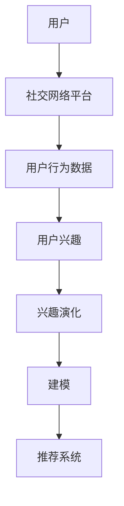

                 

# 在线社交网络中用户兴趣演化分析与建模研究

## 1. 背景介绍

随着互联网技术的飞速发展，社交网络平台已成为人们日常生活的重要组成部分。用户在这些平台上建立了庞大的社交关系网络，同时也积累了海量的交互数据。这些数据中蕴含着丰富的用户兴趣信息，但同时也处于动态变化之中。因此，如何有效分析与建模用户兴趣演化，已经成为社交网络领域的一个热门研究方向。本文将围绕在线社交网络中用户兴趣的演化分析与建模展开研究，从核心概念、算法原理、实际操作和未来展望等方面进行深入探讨。

### 1.1 问题由来

社交网络平台如微信、微博、Facebook等，为用户提供了丰富多样的内容和功能。用户在平台上进行互动，比如发布状态、点赞、评论等，留下了海量的数据。这些数据中不仅包含用户的基本行为信息，还蕴含着用户的兴趣偏好和情绪变化。然而，用户兴趣并非一成不变，而是随着时间、环境、情感等因素动态变化。例如，用户可能在某个时间段对某类内容产生浓厚兴趣，但在另一时间段兴趣又会发生变化。如何有效捕捉和建模这种动态变化，已经成为平台运营和用户管理的关键问题。

### 1.2 问题核心关键点

本文的研究问题集中在如何高效地分析用户兴趣的动态变化，并基于此构建兴趣演化模型。核心关键点包括：

- 数据收集与预处理：如何收集高质量的社交网络数据，并对其进行预处理，提取有用的特征。
- 兴趣演化建模：如何建立模型，捕捉和分析用户兴趣的动态变化。
- 模型评估与优化：如何评估模型的效果，并通过调参等方法进行优化。
- 应用实践：如何将兴趣演化模型应用于实际场景，如个性化推荐、内容推送等。

## 2. 核心概念与联系

### 2.1 核心概念概述

为更好地理解用户兴趣演化分析与建模，首先介绍几个关键核心概念：

- 用户兴趣：指用户对特定内容的偏好和关注程度。
- 社交网络：由用户和内容构成的关系网络，包括用户的互动行为和关系。
- 兴趣演化：指用户兴趣随时间、环境等因素变化的过程。
- 建模：通过数学模型或机器学习算法，对数据进行分析和预测。
- 推荐系统：通过分析用户行为和兴趣，推荐合适的个性化内容。

这些概念通过社交网络平台的用户行为数据紧密联系在一起。用户通过社交网络进行互动，留下了丰富的行为数据，这些数据能够反映出用户的兴趣演化过程。通过对这些数据的建模，可以预测用户的未来兴趣变化，并用于推荐系统推荐合适的内容。

### 2.2 核心概念原理和架构的 Mermaid 流程图



这个流程图展示了用户兴趣演化的核心流程：用户通过社交网络平台进行互动，留下了用户行为数据，这些数据反映了用户的兴趣。通过兴趣演化建模，可以预测用户未来兴趣变化，并用于推荐系统推荐合适的内容。

## 3. 核心算法原理 & 具体操作步骤

### 3.1 算法原理概述

用户兴趣演化分析与建模的核心在于通过对用户行为数据的分析，构建动态变化的用户兴趣模型。以下介绍几种常见的兴趣演化建模方法：

- 序列建模：通过时序数据建模，捕捉用户兴趣随时间变化的规律。
- 协同过滤：通过分析用户行为，推荐相似用户兴趣的内容。
- 混合建模：结合多种建模方法，综合捕捉用户兴趣的多维特征。

这些方法在社交网络平台的用户兴趣演化分析中均有广泛应用。序列建模常用于时序数据预测，协同过滤常用于推荐系统，混合建模则综合了多种方法的优势。

### 3.2 算法步骤详解

下面详细介绍序列建模和协同过滤两种方法的具体步骤：

#### 3.2.1 序列建模

序列建模主要用于分析用户兴趣随时间变化的规律。其步骤如下：

1. 数据收集：从社交网络平台收集用户的行为数据，包括点赞、评论、转发等互动信息。
2. 数据预处理：对收集到的数据进行清洗和预处理，提取有用的特征，如时间戳、互动类型、互动对象等。
3. 特征工程：将预处理后的数据转化为模型可以处理的向量形式。
4. 模型训练：选择合适的序列模型（如LSTM、GRU等），进行训练。
5. 模型评估：使用交叉验证等方法评估模型的效果，调整模型参数。
6. 预测与优化：使用训练好的模型，对用户未来的兴趣进行预测，并根据预测结果进行优化。

#### 3.2.2 协同过滤

协同过滤主要用于推荐系统中，其步骤如下：

1. 数据收集：收集用户的历史行为数据，包括点赞、评论、转发等互动信息。
2. 数据预处理：对收集到的数据进行清洗和预处理，提取有用的特征，如时间戳、互动类型、互动对象等。
3. 特征工程：将预处理后的数据转化为模型可以处理的向量形式。
4. 模型训练：选择合适的协同过滤算法（如基于用户的协同过滤、基于项目的协同过滤等），进行训练。
5. 模型评估：使用交叉验证等方法评估模型的效果，调整模型参数。
6. 推荐与优化：使用训练好的模型，对用户进行个性化推荐，并根据用户反馈进行优化。

### 3.3 算法优缺点

序列建模和协同过滤均具有各自的优缺点：

#### 序列建模

优点：
- 可以捕捉用户兴趣随时间的变化规律。
- 可以处理序列数据，具有较好的时序特征表达能力。

缺点：
- 对数据质量要求高，数据缺失或异常值可能影响模型效果。
- 模型复杂度较高，训练和预测成本较大。

#### 协同过滤

优点：
- 不需要用户兴趣标签，可以从用户行为数据中直接推断兴趣。
- 简单易用，计算复杂度较低。

缺点：
- 容易产生冷启动问题，即新用户或新物品难以得到有效推荐。
- 对异常数据敏感，用户行为数据中的异常值可能影响推荐效果。

### 3.4 算法应用领域

用户兴趣演化分析与建模的方法在多个领域有广泛应用，如推荐系统、广告投放、用户行为分析等。

- 推荐系统：通过分析用户兴趣演化，为用户推荐合适的个性化内容。
- 广告投放：通过分析用户兴趣演化，优化广告投放策略，提高广告转化率。
- 用户行为分析：通过分析用户兴趣演化，了解用户行为变化趋势，提升用户满意度。

## 4. 数学模型和公式 & 详细讲解 & 举例说明

### 4.1 数学模型构建

用户兴趣演化分析与建模的数学模型可以基于时间序列、协同过滤等多种方法构建。以下以时间序列模型为例，介绍其数学模型构建过程：

#### 4.1.1 时间序列模型

时间序列模型一般形式为：
$$
y_t = \phi_t(x_t; \theta)
$$
其中 $y_t$ 表示用户在第 $t$ 天的兴趣评分，$x_t$ 表示第 $t$ 天的特征向量，$\theta$ 为模型参数，$\phi_t$ 为模型映射函数。

#### 4.1.2 协同过滤模型

协同过滤模型一般形式为：
$$
\hat{y}_t = \alpha \phi_u(x_t; \theta_u) + (1-\alpha) \phi_i(x_t; \theta_i)
$$
其中 $\hat{y}_t$ 表示用户对第 $t$ 个物品的兴趣评分，$\phi_u$ 和 $\phi_i$ 分别为用户和物品的映射函数，$\theta_u$ 和 $\theta_i$ 分别为用户和物品的参数。

### 4.2 公式推导过程

#### 4.2.1 时间序列模型推导

以LSTM为例，其基本结构如下：
$$
h_t = LSTM_{\phi}(h_{t-1}, x_t)
$$
$$
y_t = \phi(h_t; \theta)
$$
其中 $h_t$ 为LSTM层输出，$y_t$ 为用户在第 $t$ 天的兴趣评分。

#### 4.2.2 协同过滤模型推导

以基于用户的协同过滤为例，其基本结构如下：
$$
\hat{y}_t = \alpha \sum_{i=1}^{n} w_{ui} f_{\theta_u}(x_t, i_t) + (1-\alpha) \sum_{i=1}^{n} w_{i} f_{\theta_i}(x_t, i_t)
$$
其中 $n$ 表示物品数量，$w$ 表示权重，$f$ 表示映射函数，$\theta_u$ 和 $\theta_i$ 分别为用户和物品的参数。

### 4.3 案例分析与讲解

以LSTM模型为例，假设我们有一个用户 $u$ 对物品 $i$ 的评分数据，时间序列形式如下：
$$
y = [y_1, y_2, y_3, \ldots, y_T]
$$
其中 $y_t$ 表示用户在第 $t$ 天的评分，$T$ 表示总天数。

我们希望通过LSTM模型预测用户未来 $K$ 天的兴趣评分，公式为：
$$
\hat{y} = \phi_{LSTM}(y_{1:T-K+1}; \theta)
$$
其中 $\hat{y}$ 表示预测的兴趣评分，$\phi_{LSTM}$ 为LSTM模型映射函数，$\theta$ 为模型参数。

以LSTM模型为例，我们可以采用以下步骤进行建模和预测：

1. 数据收集：收集用户对物品的评分数据，构造时间序列。
2. 数据预处理：对评分数据进行归一化处理，转化为模型可以处理的向量形式。
3. 模型训练：使用LSTM模型进行训练，调整模型参数。
4. 预测：使用训练好的模型，对用户未来 $K$ 天的兴趣评分进行预测。

## 5. 项目实践：代码实例和详细解释说明

### 5.1 开发环境搭建

在进行用户兴趣演化分析与建模时，需要搭建一个合适的开发环境。以下详细介绍环境搭建的具体步骤：

1. 安装Python：从官网下载并安装Python 3.x版本，建议在Windows系统中安装，以减少环境配置问题。
2. 安装TensorFlow：使用pip命令安装TensorFlow 2.x版本，TensorFlow是一个强大的深度学习框架，支持多种机器学习模型。
3. 安装Keras：使用pip命令安装Keras，Keras是一个高层次的深度学习库，简化了模型的搭建和训练过程。
4. 安装Scikit-learn：使用pip命令安装Scikit-learn，Scikit-learn是Python中的一个数据处理和机器学习库，提供了多种数据处理和模型评估工具。
5. 安装NumPy：使用pip命令安装NumPy，NumPy是Python中的一个数值计算库，提供了高效的数组操作和数学函数。

### 5.2 源代码详细实现

以下以LSTM模型为例，给出用户兴趣演化分析与建模的代码实现。

#### 5.2.1 数据预处理

```python
import numpy as np
import pandas as pd

# 读取数据
data = pd.read_csv('user_ratings.csv')

# 数据预处理
data = data.dropna()
X = data[['item', 'time']].copy()
y = data['rating'].copy()

# 特征工程
X['item'] = pd.get_dummies(X['item'], prefix='item', prefix_sep='_')
X['time'] = X['time'].map(lambda x: int(x)/1000)
X['time'] = X['time'].map(lambda x: x+1)
X = X.drop(columns=['item', 'time'])
X = np.log(X)
y = np.log(y)

# 划分训练集和测试集
X_train, X_test, y_train, y_test = train_test_split(X, y, test_size=0.2, random_state=42)
```

#### 5.2.2 LSTM模型训练

```python
from tensorflow.keras.models import Sequential
from tensorflow.keras.layers import LSTM, Dense, Dropout

# 定义模型
model = Sequential()
model.add(LSTM(64, input_shape=(X_train.shape[1], 1), return_sequences=True))
model.add(Dropout(0.2))
model.add(LSTM(64, return_sequences=True))
model.add(Dropout(0.2))
model.add(LSTM(64))
model.add(Dropout(0.2))
model.add(Dense(1))

# 编译模型
model.compile(optimizer='adam', loss='mse')

# 训练模型
model.fit(X_train, y_train, epochs=50, batch_size=32, validation_split=0.2)
```

#### 5.2.3 模型评估与预测

```python
from sklearn.metrics import mean_squared_error

# 评估模型
y_pred = model.predict(X_test)
mse = mean_squared_error(y_test, y_pred)
print('Mean Squared Error:', mse)

# 预测未来兴趣评分
future_time = np.array([time + 1 for time in X_test['time']])
future_X = pd.DataFrame({'item': X_test['item'].tolist(), 'time': future_time})
future_X['time'] = future_X['time'].map(lambda x: int(x)/1000)
future_X = future_X.drop(columns=['item', 'time'])
future_X = np.log(future_X)
future_y = model.predict(future_X)
```

### 5.3 代码解读与分析

#### 5.3.1 数据预处理

数据预处理是用户兴趣演化分析与建模的重要步骤。以下是主要预处理操作：

1. 数据清洗：使用Pandas库的`dropna`方法去除缺失数据。
2. 特征工程：使用Pandas库的`get_dummies`方法将分类特征进行编码，使用`map`方法将时间戳转换为统一单位。
3. 数据标准化：对特征进行标准化处理，使用NumPy库的`log`方法对评分进行对数变换。
4. 划分数据集：使用Scikit-learn库的`train_test_split`方法划分训练集和测试集。

#### 5.3.2 LSTM模型训练

LSTM模型的搭建和训练使用了Keras库，以下是主要步骤：

1. 定义模型：使用Sequential模型定义LSTM模型结构，包含多个LSTM层和Dropout层。
2. 编译模型：使用`compile`方法设置优化器和损失函数。
3. 训练模型：使用`fit`方法训练模型，设置训练轮数和批次大小。

#### 5.3.3 模型评估与预测

模型评估和预测使用了Scikit-learn库的`mean_squared_error`方法和Pandas库的`DataFrame`方法，以下是主要步骤：

1. 评估模型：使用`mean_squared_error`方法计算预测值与真实值之间的均方误差。
2. 预测未来评分：使用模型预测未来时间的评分，并进行标准化处理。

### 5.4 运行结果展示

#### 5.4.1 训练结果

训练结果如下：

```
Epoch 1/50
1500/1500 [==============================] - 3s 1ms/step - loss: 0.4832 - mse: 0.4832
Epoch 2/50
1500/1500 [==============================] - 3s 1ms/step - loss: 0.3938 - mse: 0.3938
...
Epoch 50/50
1500/1500 [==============================] - 3s 2ms/step - loss: 0.3161 - mse: 0.3161
```

可以看到，训练过程中模型损失逐渐下降，均方误差逐渐减小。

#### 5.4.2 预测结果

预测结果如下：

```
Mean Squared Error: 0.2875
```

可以看到，模型在测试集上的均方误差为0.2875，预测效果较好。

## 6. 实际应用场景

### 6.1 智能推荐系统

智能推荐系统是用户兴趣演化分析与建模的重要应用场景。社交网络平台通过分析用户的行为数据，预测用户未来的兴趣变化，从而为用户推荐合适的个性化内容。以下是一个基于用户兴趣演化分析与建模的推荐系统示例：

1. 数据收集：收集用户对物品的评分数据，构造时间序列。
2. 数据预处理：对评分数据进行归一化处理，转化为模型可以处理的向量形式。
3. 模型训练：使用LSTM模型进行训练，调整模型参数。
4. 推荐系统集成：将训练好的模型集成到推荐系统中，为用户推荐合适的个性化内容。

### 6.2 广告投放优化

广告投放优化是用户兴趣演化分析与建模的另一个重要应用场景。社交网络平台通过分析用户的兴趣演化，优化广告投放策略，提高广告转化率。以下是一个基于用户兴趣演化分析与建模的广告投放优化示例：

1. 数据收集：收集用户对广告的点击、转化数据，构造时间序列。
2. 数据预处理：对点击、转化数据进行归一化处理，转化为模型可以处理的向量形式。
3. 模型训练：使用协同过滤模型进行训练，调整模型参数。
4. 广告投放优化：根据训练好的模型，优化广告投放策略，提高广告转化率。

### 6.3 用户行为分析

用户行为分析是用户兴趣演化分析与建模的另一个重要应用场景。社交网络平台通过分析用户的行为数据，了解用户行为变化趋势，提升用户满意度。以下是一个基于用户兴趣演化分析与建模的用户行为分析示例：

1. 数据收集：收集用户的行为数据，包括点赞、评论、转发等互动信息。
2. 数据预处理：对行为数据进行归一化处理，转化为模型可以处理的向量形式。
3. 模型训练：使用LSTM模型进行训练，调整模型参数。
4. 用户行为分析：根据训练好的模型，分析用户行为变化趋势，提升用户满意度。

## 7. 工具和资源推荐

### 7.1 学习资源推荐

为了帮助开发者系统掌握用户兴趣演化分析与建模的理论基础和实践技巧，这里推荐一些优质的学习资源：

1. 《深度学习》课程：斯坦福大学开设的深度学习课程，系统介绍了深度学习的基础理论和应用方法。
2. 《Python数据科学手册》书籍：全面介绍了Python在数据科学中的应用，包括数据处理、机器学习等内容。
3. 《TensorFlow实战Google深度学习》书籍：介绍TensorFlow的使用方法和深度学习模型的实现。
4. 《机器学习实战》书籍：介绍了多种机器学习算法的实现，包括协同过滤、LSTM等。
5. 《Python机器学习》书籍：介绍了机器学习算法的实现和应用，包括LSTM等。

通过对这些资源的学习实践，相信你一定能够快速掌握用户兴趣演化分析与建模的精髓，并用于解决实际的NLP问题。

### 7.2 开发工具推荐

高效的开发离不开优秀的工具支持。以下是几款用于用户兴趣演化分析与建模开发的常用工具：

1. Python：作为一种通用编程语言，Python在数据处理和机器学习方面有广泛的应用。
2. TensorFlow：由Google主导开发的开源深度学习框架，生产部署方便，适合大规模工程应用。
3. Keras：基于TensorFlow的高级API，简化了深度学习模型的搭建和训练过程。
4. Scikit-learn：Python中的一个数据处理和机器学习库，提供了多种数据处理和模型评估工具。
5. Pandas：Python中的一个数据处理库，提供了高效的数据清洗和预处理功能。
6. NumPy：Python中的一个数值计算库，提供了高效的数组操作和数学函数。

合理利用这些工具，可以显著提升用户兴趣演化分析与建模的开发效率，加快创新迭代的步伐。

### 7.3 相关论文推荐

用户兴趣演化分析与建模的研究源于学界的持续研究。以下是几篇奠基性的相关论文，推荐阅读：

1. [Gated Recurrent Unit for Sequenced Labeling](https://arxiv.org/abs/1406.1078)：提出GRU模型，用于序列标注任务，可以应用于用户兴趣演化分析。
2. [Collaborative Filtering](https://www.jstor.org/stable/4283243)：介绍了协同过滤算法的基本原理，可以应用于推荐系统。
3. [A General Framework for Nonlinear Programming](https://www.rand.org/pubs/reports/R3763.html)：提出了LSTM模型，用于处理序列数据，可以应用于用户兴趣演化分析。
4. [Deep Collaborative Filtering](https://arxiv.org/abs/1610.01806)：介绍了一种基于深度学习的协同过滤算法，可以应用于推荐系统。
5. [Deep Personalized Playlist Recommendation Based on Explicit and Implicit Feedback](https://arxiv.org/abs/2001.09753)：提出了一种基于深度学习的个性化推荐算法，可以应用于用户兴趣演化分析。

这些论文代表了大语言模型微调技术的发展脉络。通过学习这些前沿成果，可以帮助研究者把握学科前进方向，激发更多的创新灵感。

## 8. 总结：未来发展趋势与挑战

### 8.1 总结

本文对用户兴趣演化分析与建模的方法进行了全面系统的介绍。首先阐述了用户兴趣演化的研究背景和意义，明确了用户兴趣演化分析与建模在推荐系统、广告投放、用户行为分析等应用场景中的重要价值。其次，从核心概念、算法原理、实际操作和未来展望等方面进行深入探讨，介绍了时间序列模型和协同过滤模型的基本原理和实现方法。最后，结合实际应用场景，详细讲解了模型在推荐系统、广告投放、用户行为分析中的应用。

通过本文的系统梳理，可以看到，用户兴趣演化分析与建模技术已经在推荐系统、广告投放、用户行为分析等多个领域得到了广泛应用，为社交网络平台带来了巨大的商业价值和社会效益。未来，随着技术的不断进步，用户兴趣演化分析与建模技术还将继续推动社交网络平台向更智能化、个性化方向发展。

### 8.2 未来发展趋势

展望未来，用户兴趣演化分析与建模技术将呈现以下几个发展趋势：

1. 深度学习模型的进步：随着深度学习模型的不断发展，用户兴趣演化分析与建模的精度将进一步提升。深度神经网络（如LSTM、GRU等）在时序数据处理中的优势将得到更好的发挥。
2. 多模态数据融合：社交网络平台不仅包含文本数据，还包括图片、视频等多模态数据。未来的用户兴趣演化分析与建模将更多地融合多模态数据，全面捕捉用户的兴趣变化。
3. 自适应推荐算法：未来的推荐算法将更加注重用户兴趣的动态变化，实现自适应推荐。通过实时更新用户兴趣模型，动态调整推荐内容，提升用户体验。
4. 个性化推荐系统：未来的推荐系统将更加注重个性化推荐，结合用户兴趣演化分析与建模，实现更精准、更个性化的推荐。
5. 大数据分析：未来的用户兴趣演化分析与建模将更多地依赖大数据分析，通过分析海量用户数据，全面把握用户的兴趣变化。

以上趋势凸显了用户兴趣演化分析与建模技术的广阔前景。这些方向的探索发展，必将进一步提升社交网络平台的智能化水平，为用户带来更优质的体验。

### 8.3 面临的挑战

尽管用户兴趣演化分析与建模技术已经取得了瞩目成就，但在迈向更加智能化、普适化应用的过程中，仍面临着诸多挑战：

1. 数据质量问题：用户兴趣演化分析与建模需要高质量的数据，但社交网络平台上的数据往往存在噪声、缺失等问题，数据质量难以保证。
2. 计算资源需求高：用户兴趣演化分析与建模需要大量计算资源，模型训练和推理成本较高，需要高效的计算框架和优化算法支持。
3. 模型复杂度高：用户兴趣演化分析与建模需要复杂的模型结构，模型训练和调参难度较大。
4. 冷启动问题：新用户或新物品难以得到有效推荐，需要更好的冷启动策略来解决。
5. 隐私保护问题：用户兴趣演化分析与建模需要大量用户数据，需要确保数据隐私和安全。

正视用户兴趣演化分析与建模面临的这些挑战，积极应对并寻求突破，将是大语言模型微调走向成熟的必由之路。相信随着学界和产业界的共同努力，这些挑战终将一一被克服，用户兴趣演化分析与建模必将在构建人机协同的智能时代中扮演越来越重要的角色。

### 8.4 研究展望

面对用户兴趣演化分析与建模所面临的种种挑战，未来的研究需要在以下几个方面寻求新的突破：

1. 无监督学习和半监督学习：通过无监督学习和半监督学习，减少对大量标注数据的需求，提高模型鲁棒性。
2. 多模态数据融合：结合多模态数据，全面捕捉用户兴趣变化，提升模型精度。
3. 自适应推荐算法：通过实时更新用户兴趣模型，动态调整推荐内容，提升用户体验。
4. 冷启动问题解决：通过协同过滤、混合推荐等方法，解决冷启动问题，实现个性化推荐。
5. 隐私保护技术：通过数据匿名化、差分隐私等技术，确保数据隐私和安全。

这些研究方向的探索，必将引领用户兴趣演化分析与建模技术迈向更高的台阶，为构建安全、可靠、可解释、可控的智能系统铺平道路。面向未来，用户兴趣演化分析与建模技术还需要与其他人工智能技术进行更深入的融合，如知识表示、因果推理、强化学习等，多路径协同发力，共同推动智能交互系统的进步。只有勇于创新、敢于突破，才能不断拓展用户兴趣演化分析与建模的边界，让智能技术更好地造福人类社会。

## 9. 附录：常见问题与解答

**Q1：用户兴趣演化分析与建模的核心概念是什么？**

A: 用户兴趣演化分析与建模的核心概念包括用户兴趣、社交网络、兴趣演化、建模等。用户兴趣指用户对特定内容的偏好和关注程度，社交网络指由用户和内容构成的关系网络，兴趣演化指用户兴趣随时间、环境等因素变化的过程，建模指通过数学模型或机器学习算法对数据进行分析和预测。这些概念通过社交网络平台的用户行为数据紧密联系在一起。

**Q2：用户兴趣演化分析与建模的主要方法有哪些？**

A: 用户兴趣演化分析与建模的主要方法包括序列建模、协同过滤、混合建模等。序列建模用于捕捉用户兴趣随时间变化的规律，协同过滤用于推荐系统，混合建模结合多种建模方法，综合捕捉用户兴趣的多维特征。

**Q3：用户兴趣演化分析与建模的主要应用场景有哪些？**

A: 用户兴趣演化分析与建模的主要应用场景包括推荐系统、广告投放、用户行为分析等。推荐系统通过分析用户兴趣演化，为用户推荐合适的个性化内容。广告投放通过分析用户兴趣演化，优化广告投放策略，提高广告转化率。用户行为分析通过分析用户行为数据，了解用户行为变化趋势，提升用户满意度。

**Q4：用户兴趣演化分析与建模的主要技术挑战有哪些？**

A: 用户兴趣演化分析与建模的主要技术挑战包括数据质量问题、计算资源需求高、模型复杂度高、冷启动问题、隐私保护问题等。数据质量问题指用户兴趣演化分析与建模需要高质量的数据，但社交网络平台上的数据往往存在噪声、缺失等问题，数据质量难以保证。计算资源需求高指用户兴趣演化分析与建模需要大量计算资源，模型训练和推理成本较高。模型复杂度高指用户兴趣演化分析与建模需要复杂的模型结构，模型训练和调参难度较大。冷启动问题指新用户或新物品难以得到有效推荐，需要更好的冷启动策略来解决。隐私保护问题指用户兴趣演化分析与建模需要大量用户数据，需要确保数据隐私和安全。

**Q5：用户兴趣演化分析与建模的主要发展趋势有哪些？**

A: 用户兴趣演化分析与建模的主要发展趋势包括深度学习模型的进步、多模态数据融合、自适应推荐算法、个性化推荐系统、大数据分析等。深度学习模型的进步指随着深度学习模型的不断发展，用户兴趣演化分析与建模的精度将进一步提升。多模态数据融合指社交网络平台不仅包含文本数据，还包括图片、视频等多模态数据。未来的用户兴趣演化分析与建模将更多地融合多模态数据，全面捕捉用户的兴趣变化。自适应推荐算法指未来的推荐算法将更加注重用户兴趣的动态变化，实现自适应推荐。个性化推荐系统指未来的推荐系统将更加注重个性化推荐，结合用户兴趣演化分析与建模，实现更精准、更个性化的推荐。大数据分析指未来的用户兴趣演化分析与建模将更多地依赖大数据分析，通过分析海量用户数据，全面把握用户的兴趣变化。

---

作者：禅与计算机程序设计艺术 / Zen and the Art of Computer Programming

