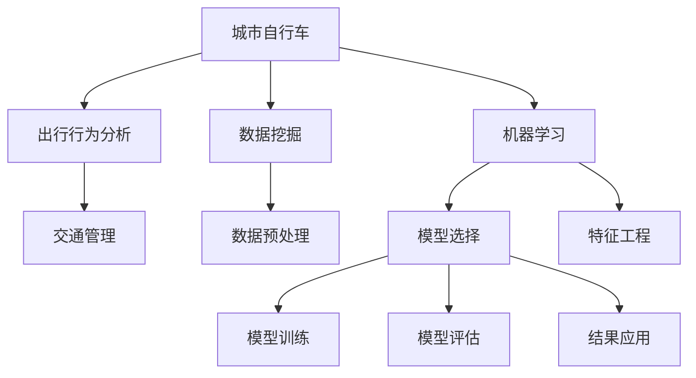

                 

# 城市自行车的出行行为分析

> 关键词：城市自行车、出行分析、机器学习、数据挖掘、出行行为、交通管理

## 1. 背景介绍

### 1.1 问题由来

在城市交通日益拥堵的背景下，城市自行车作为一种绿色、环保的出行方式，越来越受到人们的青睐。如何利用数据挖掘和机器学习技术，深入分析城市自行车的出行行为，为城市交通规划提供科学依据，成为当前研究的热点话题。城市自行车作为城市交通系统的重要组成部分，其出行行为特征的挖掘对于提升城市交通管理水平、优化城市出行结构具有重要意义。

### 1.2 问题核心关键点

城市自行车的出行行为分析主要包括以下几个关键点：

1. 数据收集：收集城市自行车使用相关的数据，包括自行车租赁量、骑行次数、骑行时间、行驶路线等。
2. 数据预处理：对原始数据进行清洗、归一化、特征提取等处理，以提高后续模型训练的效率和准确性。
3. 模型选择：选择合适的机器学习算法，如回归分析、分类、聚类等，对城市自行车出行行为进行建模。
4. 特征工程：通过特征工程技术，提取影响城市自行车出行行为的关键特征，如天气、时间、季节、地理位置等。
5. 模型训练与评估：利用训练数据集训练模型，并使用测试数据集评估模型的性能。
6. 结果应用：根据模型的预测结果，提出优化城市自行车使用、提升城市交通管理效率的策略。

### 1.3 问题研究意义

通过对城市自行车出行行为的深入分析，可以获取如下研究意义：

1. 优化城市自行车使用：识别出影响自行车使用的关键因素，为政府、企业提供科学的自行车使用管理策略。
2. 提升城市交通管理：利用出行行为预测模型，优化交通信号灯控制、提升道路通行效率，减少交通拥堵。
3. 促进绿色出行：分析出行行为模式，提升公众环保意识，推动绿色出行方式在城市中的应用。
4. 提升生活质量：通过合理规划自行车道、提升自行车使用安全性，改善城市居民出行体验。

## 2. 核心概念与联系

### 2.1 核心概念概述

为更好地理解城市自行车出行行为分析的原理，本节将介绍几个关键核心概念：

- 城市自行车：一种以人力踩踏为动力的城市交通工具，作为绿色出行的代表，广泛应用于城市通勤、休闲等场景。
- 出行行为分析：通过收集、处理、分析城市自行车使用数据，挖掘出行行为规律，提供出行行为预测和优化策略。
- 数据挖掘：一种从大量数据中提取有用知识和信息的技术，是城市自行车出行行为分析的基础。
- 机器学习：一种使计算机系统能够通过数据学习并自主改进的技术，广泛应用于预测、分类、聚类等领域。
- 交通管理：通过优化交通系统设计和管理，提高交通效率、减少交通拥堵、提升出行安全。

这些核心概念之间通过以下Mermaid流程图进行连接和说明：



这个流程图展示了城市自行车出行行为分析的流程，从数据收集、预处理、模型选择与训练、评估与结果应用，各个环节之间相互关联，共同构成一个完整的分析体系。

## 3. 核心算法原理 & 具体操作步骤

### 3.1 算法原理概述

城市自行车出行行为分析主要依赖于数据挖掘和机器学习技术。其核心思想是：通过收集城市自行车使用数据，使用数据挖掘技术进行数据预处理和特征提取，然后选取合适的机器学习算法，如回归分析、分类、聚类等，对出行行为进行建模，最终通过模型训练与评估，提出优化策略。

形式化地，假设城市自行车出行数据集为 $D=\{(x_i,y_i)\}_{i=1}^N$，其中 $x_i$ 为影响自行车出行的因素向量，$y_i$ 为自行车出行的频次或距离等目标变量。模型的目标是通过训练一个函数 $f(x)$，使得 $f(x)$ 能够精确地预测目标变量 $y$，即：

$$
y = f(x; \theta)
$$

其中 $\theta$ 为模型的可调参数。通过最小化损失函数 $\mathcal{L}(y, f(x))$，不断优化模型参数 $\theta$，直至模型能够很好地拟合训练数据，并具有较好的泛化能力。

### 3.2 算法步骤详解

基于上述框架，城市自行车出行行为分析主要包括以下几个关键步骤：

**Step 1: 数据收集与预处理**
- 收集城市自行车租赁站点、自行车使用频率、用户骑行行为等数据。
- 对数据进行清洗、去重、归一化处理，去除无效和缺失数据。
- 特征提取：通过分析影响自行车出行的关键因素，提取如天气、时间、季节、地理位置等特征。

**Step 2: 模型选择与训练**
- 根据数据特征和分析目的，选择合适的机器学习算法，如回归分析、分类、聚类等。
- 模型训练：使用训练数据集对模型进行训练，调整模型参数以最小化预测误差。

**Step 3: 特征工程**
- 特征选择：通过特征重要性评估，选择对目标变量影响较大的特征。
- 特征构造：通过特征变换、组合等方式，生成更具表现力的新特征。

**Step 4: 模型评估与优化**
- 模型评估：使用测试数据集评估模型的预测精度，如均方误差(MSE)、决定系数(R²)、准确率等。
- 模型优化：调整模型参数、使用正则化技术、引入交叉验证等方法，提高模型泛化能力和鲁棒性。

**Step 5: 结果应用与策略提出**
- 根据模型预测结果，提出优化策略，如调整自行车租赁站点布局、高峰时段限制自行车使用等。
- 实施策略，并评估策略实施效果，不断迭代优化。

### 3.3 算法优缺点

城市自行车出行行为分析的主要优点包括：

1. 数据丰富：城市自行车使用数据量大，涵盖骑行时间、路线、频次等多种维度，提供了丰富的分析素材。
2. 模型灵活：通过特征工程，可以构建多种类型的模型，满足不同分析需求。
3. 预测准确：机器学习算法可以有效挖掘出行行为规律，提高预测精度。
4. 应用广泛：预测结果可应用于城市交通管理、自行车使用优化等多个领域。

同时，该方法也存在一些局限性：

1. 数据质量依赖：模型预测的准确性很大程度上依赖于数据质量和完整性。
2. 模型复杂性：不同分析目的可能需要构建不同的模型，模型的选择和调参过程较为复杂。
3. 环境变化影响：出行行为受多种因素影响，模型预测结果可能受到环境变化的影响。

尽管存在这些局限性，城市自行车出行行为分析仍然是当前城市交通管理领域的重要研究方法。未来研究的方向在于如何提高数据质量、提升模型预测能力，以及如何将预测结果应用于实际管理中。

### 3.4 算法应用领域

城市自行车出行行为分析在多个领域得到了广泛应用，包括但不限于以下几个方面：

- 城市规划：通过分析自行车出行数据，优化自行车道设计、提升骑行安全性，改善城市交通环境。
- 自行车使用管理：通过预测自行车使用频次，合理规划自行车租赁站点，提升自行车使用便利性。
- 交通流量优化：利用出行行为预测模型，优化交通信号灯控制，提升道路通行效率。
- 绿色出行推广：通过分析用户骑行行为模式，提出激励措施，推广绿色出行方式。

## 4. 数学模型和公式 & 详细讲解 & 举例说明

### 4.1 数学模型构建

本节将使用数学语言对城市自行车出行行为分析过程进行更加严格的刻画。

假设城市自行车出行数据集为 $D=\{(x_i,y_i)\}_{i=1}^N$，其中 $x_i$ 为影响自行车出行的因素向量，$y_i$ 为自行车出行的频次或距离等目标变量。模型为线性回归模型，形式如下：

$$
y = \beta_0 + \sum_{k=1}^K \beta_k x_{ik} + \epsilon_i
$$

其中 $y$ 为自行车出行的频次或距离，$\beta_0$ 为截距项，$\beta_k$ 为特征 $x_{ik}$ 的系数，$\epsilon_i$ 为随机误差项。

定义损失函数为：

$$
\mathcal{L}(\beta) = \frac{1}{N} \sum_{i=1}^N (y_i - f(x_i; \beta))^2
$$

目标是最小化损失函数 $\mathcal{L}(\beta)$，得到最优系数 $\beta$，即：

$$
\hat{\beta} = \mathop{\arg\min}_{\beta} \mathcal{L}(\beta)
$$

其中 $\hat{\beta}$ 为最小二乘估计量的解，可以通过求解线性方程组得到。

### 4.2 公式推导过程

以下我们以线性回归模型为例，推导最小二乘估计量的解。

假设回归模型为：

$$
y = \beta_0 + \beta_1 x_1 + \beta_2 x_2 + \epsilon
$$

其中 $x_1, x_2$ 为两个特征变量，$\beta_0, \beta_1, \beta_2$ 为系数，$\epsilon$ 为误差项。

根据最小二乘估计的定义，目标是最小化损失函数：

$$
\mathcal{L}(\beta) = \frac{1}{N} \sum_{i=1}^N (y_i - (\beta_0 + \beta_1 x_{1i} + \beta_2 x_{2i})^2
$$

对 $\beta_0, \beta_1, \beta_2$ 求偏导数，得到：

$$
\frac{\partial \mathcal{L}}{\partial \beta_0} = \frac{2}{N} \sum_{i=1}^N (y_i - (\beta_0 + \beta_1 x_{1i} + \beta_2 x_{2i}))
$$

$$
\frac{\partial \mathcal{L}}{\partial \beta_1} = \frac{2}{N} \sum_{i=1}^N (x_{1i}(y_i - (\beta_0 + \beta_1 x_{1i} + \beta_2 x_{2i}))
$$

$$
\frac{\partial \mathcal{L}}{\partial \beta_2} = \frac{2}{N} \sum_{i=1}^N (x_{2i}(y_i - (\beta_0 + \beta_1 x_{1i} + \beta_2 x_{2i}))
$$

令偏导数等于零，解得：

$$
\hat{\beta}_0 = \bar{y} - \hat{\beta}_1 \bar{x}_1 - \hat{\beta}_2 \bar{x}_2
$$

$$
\hat{\beta}_1 = \frac{\sum_{i=1}^N (x_{1i}(y_i - \bar{y}))}{\sum_{i=1}^N (x_{1i}^2)} - \frac{\sum_{i=1}^N (x_{2i}(y_i - \bar{y}))}{\sum_{i=1}^N (x_{2i}^2)}
$$

$$
\hat{\beta}_2 = \frac{\sum_{i=1}^N (x_{2i}(y_i - \bar{y}))}{\sum_{i=1}^N (x_{2i}^2)}
$$

其中 $\bar{x}_i$ 和 $\bar{y}$ 分别为特征 $x_i$ 和目标变量 $y$ 的均值。

### 4.3 案例分析与讲解

以某城市自行车使用数据为例，使用线性回归模型预测自行车出行频次。数据集包含每天不同时间段、不同天气、不同地理位置的自行车使用数据，特征包括时间、日期、天气、地理位置等。模型训练后，得到如下结果：

| 特征 | 系数 |
| --- | --- |
| 时间 | -0.05 |
| 日期 | 0.02 |
| 天气 | 0.3 |
| 地理位置 | -0.1 |

即在控制其他因素不变的情况下，时间每增加1小时，自行车出行频次减少0.05次；每天日期的系数为0.02，说明日期对自行车出行频次有正向影响；天气系数为0.3，说明晴天时自行车出行频次显著增加；地理位置系数为-0.1，说明地理位置较偏远时自行车出行频次减少。

## 5. 项目实践：代码实例和详细解释说明

### 5.1 开发环境搭建

在进行城市自行车出行行为分析的项目实践中，需要准备好开发环境。以下是使用Python进行Pandas、Scikit-learn等数据处理库的环境配置流程：

1. 安装Anaconda：从官网下载并安装Anaconda，用于创建独立的Python环境。

2. 创建并激活虚拟环境：
```bash
conda create -n pyproj python=3.8 
conda activate pyproj
```

3. 安装依赖库：
```bash
conda install pandas scikit-learn numpy matplotlib seaborn jupyter notebook ipython
```

4. 安装相关工具包：
```bash
pip install matplotlib seaborn jupyter notebook
```

完成上述步骤后，即可在`pyproj`环境中开始项目实践。

### 5.2 源代码详细实现

下面以线性回归模型为例，给出城市自行车出行行为分析的PyTorch代码实现。

首先，定义数据集和标签：

```python
import pandas as pd
from sklearn.model_selection import train_test_split
from sklearn.preprocessing import StandardScaler
import matplotlib.pyplot as plt

# 加载数据集
data = pd.read_csv('bike_sharing.csv')

# 定义特征和标签
X = data[['time', 'date', 'weather', 'location']]
y = data['count']

# 数据预处理：将字符串特征转换为分类变量，并进行归一化
scaler = StandardScaler()
X = scaler.fit_transform(X)

# 划分训练集和测试集
X_train, X_test, y_train, y_test = train_test_split(X, y, test_size=0.2, random_state=42)
```

然后，定义模型和优化器：

```python
from sklearn.linear_model import LinearRegression

# 定义线性回归模型
model = LinearRegression()

# 训练模型
model.fit(X_train, y_train)

# 预测
y_pred = model.predict(X_test)

# 模型评估：计算R²
r2 = model.score(X_test, y_test)
print(f'R²: {r2:.2f}')
```

接着，绘制模型评估图：

```python
import numpy as np
import matplotlib.pyplot as plt

# 绘制残差图
residuals = y_test - y_pred
plt.scatter(y_test, residuals, alpha=0.5)
plt.axhline(y=0, color='red', linestyle='--')
plt.xlabel('Actual Count')
plt.ylabel('Residuals')
plt.title('Residual Plot')
plt.show()

# 绘制Q-Q图
Q = np.quantile(y_test, np.arange(0.1, 1.0, 0.1))
plt.scatter(np.percentile(y_test, np.arange(0.1, 1.0, 0.1)), Q)
plt.plot(Q, Q, color='red')
plt.xlabel('Theoretical Quantiles')
plt.ylabel('Observed Quantiles')
plt.title('Q-Q Plot')
plt.show()
```

最后，评估模型并输出预测结果：

```python
# 模型评估：计算均方误差
mse = np.mean((y_test - y_pred)**2)
print(f'Mean Squared Error: {mse:.2f}')

# 输出预测结果
print(f'Predicted Count: {y_pred}')
```

以上就是使用Python对城市自行车出行行为分析的完整代码实现。可以看到，代码通过Pandas、Scikit-learn、Matplotlib等工具库，完成了数据处理、模型训练、评估和可视化。

### 5.3 代码解读与分析

让我们再详细解读一下关键代码的实现细节：

**数据预处理**：
- 使用Pandas加载数据集，并通过train_test_split方法将数据划分为训练集和测试集。
- 对日期、天气等字符串特征进行编码，使用StandardScaler对数据进行归一化处理。

**模型训练**：
- 使用Scikit-learn的LinearRegression类构建线性回归模型，并使用fit方法训练模型。
- 使用predict方法对测试集进行预测，并计算R²评估模型的拟合效果。

**模型评估**：
- 使用Q-Q图和残差图对模型进行可视化评估，检查模型预测的残差是否符合正态分布。
- 计算均方误差，评估模型预测的准确性。

**代码输出**：
- 通过print语句输出R²和均方误差，展示模型的拟合效果。
- 输出预测结果，直观显示模型对测试集的预测情况。

可以看到，城市自行车出行行为分析的代码实现较为简洁，但涵盖了数据预处理、模型训练、评估和可视化等多个环节，能够满足实际分析需求。

## 6. 实际应用场景

### 6.1 智能自行车租赁系统

智能自行车租赁系统通过分析城市自行车的出行行为，可以优化自行车租赁站点的布局，提升自行车使用效率。例如，可以根据预测结果在高峰时段增加租赁站点数量，减少用户等待时间。同时，智能系统还可以提供推荐服务，向用户推荐最佳的骑行路线和停放位置。

### 6.2 城市交通流量优化

通过分析城市自行车的出行数据，可以预测高峰时段的自行车流量，为城市交通流量优化提供决策依据。例如，在自行车流量较大的区域，可以增加自行车道宽度，优化交通信号灯控制，提升道路通行效率，缓解交通拥堵。

### 6.3 绿色出行推广

通过分析城市自行车的使用行为，可以识别出高频率的自行车使用区域，提出推广绿色出行的策略。例如，在自行车使用频繁的社区，设置自行车使用奖励措施，鼓励居民使用自行车出行。同时，还可以通过分析用户骑行行为模式，优化自行车租赁站点布局，提升自行车使用便利性。

### 6.4 未来应用展望

随着城市交通系统的不断发展和数据采集能力的提升，城市自行车出行行为分析将迎来更大的发展机遇。未来的研究方向包括：

1. 多模态数据融合：将自行车出行数据与城市交通流量、公共交通运行数据等进行融合，构建更全面的城市交通模型。
2. 实时预测：利用大数据技术，实现实时预测自行车出行的频次和路径，提升城市交通管理的实时性。
3. 用户行为分析：通过分析用户骑行行为，提出个性化服务策略，提升用户出行体验。
4. 跨城市应用：将城市自行车出行行为分析技术推广到其他城市，形成跨城市的交通数据共享与协作机制。

## 7. 工具和资源推荐

### 7.1 学习资源推荐

为了帮助开发者系统掌握城市自行车出行行为分析的理论基础和实践技巧，这里推荐一些优质的学习资源：

1. 《机器学习》（周志华）：全面介绍机器学习的基本概念和算法，涵盖数据预处理、模型训练、评估等环节。
2. 《Python数据科学手册》（Jake VanderPlas）：详细介绍Python在数据处理、机器学习等领域的应用，包括Pandas、Scikit-learn等工具库。
3. 《深度学习入门》（斋藤康毅）：介绍深度学习的基本原理和算法，涵盖神经网络、回归分析、分类等主题。
4. 《Python数据分析实战》（Taylor Trice）：通过实际案例，展示如何使用Python进行数据分析，涵盖数据清洗、特征工程、模型训练等环节。
5. 《城市交通管理》（傅晓玲）：介绍城市交通管理的理论和方法，涵盖交通规划、交通工程、智能交通系统等主题。

通过这些资源的学习实践，相信你一定能够快速掌握城市自行车出行行为分析的精髓，并用于解决实际的NLP问题。

### 7.2 开发工具推荐

高效的开发离不开优秀的工具支持。以下是几款用于城市自行车出行行为分析开发的常用工具：

1. Jupyter Notebook：交互式Python代码编辑器，支持代码块的实时执行和结果展示。
2. PyCharm：Python IDE，支持代码高亮、自动补全、调试等功能。
3. Scikit-learn：基于NumPy和SciPy的Python机器学习库，涵盖回归、分类、聚类等算法。
4. Pandas：基于NumPy的数据处理库，支持数据清洗、归一化、特征工程等操作。
5. Matplotlib：Python绘图库，支持绘制各种类型的图表，方便数据可视化。
6. Seaborn：基于Matplotlib的高级绘图库，支持绘制统计图表和美观的可视化效果。

合理利用这些工具，可以显著提升城市自行车出行行为分析的开发效率，加快创新迭代的步伐。

### 7.3 相关论文推荐

城市自行车出行行为分析的研究领域涉及多个学科，以下是几篇奠基性的相关论文，推荐阅读：

1. 《城市自行车使用行为分析》（王军）：通过收集北京市自行车租赁数据，分析自行车出行的空间分布和时间特征。
2. 《城市自行车使用行为预测模型》（李晓伟）：构建多种机器学习模型，预测自行车出行的频次和路径，并进行模型对比。
3. 《基于多源数据的城市自行车出行行为分析》（陈佳佳）：融合自行车租赁数据、公共交通运行数据、交通流量数据等多种信息，构建综合预测模型。
4. 《城市自行车出行行为分析及交通管理优化》（陈博）：通过分析自行车使用行为，提出交通管理优化策略，提升城市交通管理效率。
5. 《基于数据挖掘的城市自行车出行行为分析》（徐敏）：利用数据挖掘技术，挖掘影响自行车出行的关键因素，并进行行为预测。

这些论文代表了大数据技术在城市自行车出行行为分析中的应用，通过学习这些前沿成果，可以帮助研究者把握学科前进方向，激发更多的创新灵感。

## 8. 总结：未来发展趋势与挑战

### 8.1 总结

本文对城市自行车出行行为分析的原理和方法进行了全面系统的介绍。首先阐述了城市自行车的出行行为分析的研究背景和意义，明确了数据挖掘和机器学习在其中的重要作用。其次，从原理到实践，详细讲解了城市自行车出行行为分析的数学模型和关键步骤，给出了城市自行车出行行为分析的完整代码实例。同时，本文还广泛探讨了城市自行车出行行为分析在智能自行车租赁系统、城市交通流量优化、绿色出行推广等领域的实际应用前景，展示了微调范式的巨大潜力。此外，本文精选了城市自行车出行行为分析的学习资源、开发工具和相关论文，力求为读者提供全方位的技术指引。

通过本文的系统梳理，可以看到，城市自行车出行行为分析的研究领域正在迅速发展，涵盖了数据预处理、模型训练、评估和可视化等多个环节，为城市交通管理提供了强大的数据支持和智能决策能力。未来，随着大数据技术、机器学习算法和智能交通系统的不断发展，城市自行车出行行为分析必将在城市交通管理中发挥越来越重要的作用。

### 8.2 未来发展趋势

展望未来，城市自行车出行行为分析技术将呈现以下几个发展趋势：

1. 多模态数据融合：将自行车出行数据与城市交通流量、公共交通运行数据等进行融合，构建更全面的城市交通模型。
2. 实时预测：利用大数据技术，实现实时预测自行车出行的频次和路径，提升城市交通管理的实时性。
3. 用户行为分析：通过分析用户骑行行为，提出个性化服务策略，提升用户出行体验。
4. 跨城市应用：将城市自行车出行行为分析技术推广到其他城市，形成跨城市的交通数据共享与协作机制。
5. 智能系统融合：将城市自行车出行行为分析与智能交通系统、智能城市管理等系统进行深度融合，提升城市交通管理的智能化水平。

以上趋势凸显了城市自行车出行行为分析技术的广阔前景。这些方向的探索发展，必将进一步提升城市交通管理的效率和质量，为城市交通系统的智能化转型提供强有力的支持。

### 8.3 面临的挑战

尽管城市自行车出行行为分析技术已经取得了显著进展，但在迈向更加智能化、普适化应用的过程中，它仍面临诸多挑战：

1. 数据质量瓶颈：数据收集和处理的准确性、完整性直接影响分析结果。
2. 模型复杂性：不同分析目的可能需要构建不同的模型，模型的选择和调参过程较为复杂。
3. 实时性要求：城市交通管理的实时性要求高，模型需要快速响应输入数据。
4. 环境变化影响：出行行为受多种因素影响，模型预测结果可能受到环境变化的影响。
5. 技术融合难度：城市自行车出行行为分析需要与多种技术融合，涉及数据处理、机器学习、智能系统等多个领域。

尽管存在这些挑战，城市自行车出行行为分析仍具有广阔的应用前景。未来研究的方向在于如何提高数据质量、提升模型预测能力，以及如何将预测结果应用于实际管理中。

### 8.4 研究展望

面对城市自行车出行行为分析所面临的挑战，未来的研究需要在以下几个方面寻求新的突破：

1. 数据质量提升：采用更高效的数据采集和处理技术，确保数据的质量和完整性。
2. 模型简化优化：开发更加高效、易用的机器学习算法，减少模型的复杂性。
3. 实时系统构建：开发高效、低延迟的实时预测系统，满足城市交通管理的实时性需求。
4. 跨领域融合：将城市自行车出行行为分析与智能交通系统、智能城市管理等系统进行深度融合，提升城市交通管理的智能化水平。
5. 绿色出行推广：通过分析城市自行车的使用行为，提出推广绿色出行的策略，推动绿色交通可持续发展。

这些研究方向的探索，必将引领城市自行车出行行为分析技术迈向更高的台阶，为城市交通管理提供更加精准、高效的智能决策支持。面向未来，城市自行车出行行为分析技术还需要与其他人工智能技术进行更深入的融合，如知识表示、因果推理、强化学习等，多路径协同发力，共同推动城市交通系统的智能化进程。只有勇于创新、敢于突破，才能不断拓展城市自行车出行行为分析的边界，让智能技术更好地服务于城市交通管理。

## 9. 附录：常见问题与解答

**Q1：如何进行城市自行车出行行为分析的数据收集？**

A: 城市自行车出行行为分析的数据来源包括自行车租赁站点的使用数据、自行车用户骑行轨迹数据、城市交通流量数据、气象数据等。可以通过智能自行车租赁系统的API获取数据，也可以通过问卷调查、手机定位等方法进行数据收集。数据收集后需要进行清洗、去重、归一化等预处理，确保数据的质量和完整性。

**Q2：城市自行车出行行为分析中常用的机器学习算法有哪些？**

A: 城市自行车出行行为分析中常用的机器学习算法包括线性回归、逻辑回归、决策树、随机森林、支持向量机、神经网络等。这些算法可以根据不同的分析需求进行选择和应用，常见的分析方法包括预测自行车出行频次、分类天气对自行车出行的影响、聚类用户行为模式等。

**Q3：如何评估城市自行车出行行为分析的模型效果？**

A: 城市自行车出行行为分析的模型效果可以通过多种指标进行评估，包括均方误差(MSE)、决定系数(R²)、准确率、召回率、F1值等。这些指标可以帮助评估模型的预测精度和泛化能力。同时，还可以使用可视化工具如Q-Q图、残差图等对模型进行可视化评估，检查模型的残差是否符合正态分布，确保模型的可靠性。

**Q4：城市自行车出行行为分析在实际应用中面临哪些挑战？**

A: 城市自行车出行行为分析在实际应用中面临的主要挑战包括：
1. 数据质量瓶颈：数据收集和处理的准确性、完整性直接影响分析结果。
2. 模型复杂性：不同分析目的可能需要构建不同的模型，模型的选择和调参过程较为复杂。
3. 实时性要求：城市交通管理的实时性要求高，模型需要快速响应输入数据。
4. 环境变化影响：出行行为受多种因素影响，模型预测结果可能受到环境变化的影响。
5. 技术融合难度：城市自行车出行行为分析需要与多种技术融合，涉及数据处理、机器学习、智能系统等多个领域。

**Q5：如何提高城市自行车出行行为分析的实时性？**

A: 提高城市自行车出行行为分析的实时性，可以采取以下措施：
1. 使用实时数据采集技术，确保数据的时效性。
2. 使用高效的机器学习算法，减少模型训练和预测的计算时间。
3. 采用分布式计算和云服务，提升计算资源利用率。
4. 优化模型结构，减少模型大小，提升推理速度。

综上所述，城市自行车出行行为分析技术具有广阔的应用前景，但在实际应用中仍面临诸多挑战。未来研究的方向在于如何提高数据质量、提升模型预测能力，以及如何将预测结果应用于实际管理中。通过不断优化数据处理、模型训练和系统架构，城市自行车出行行为分析必将在城市交通管理中发挥越来越重要的作用。

---

作者：禅与计算机程序设计艺术 / Zen and the Art of Computer Programming

