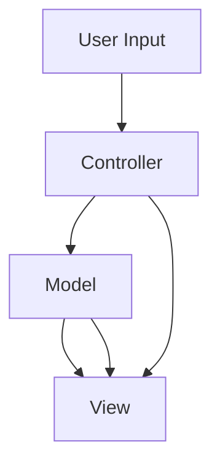

                 

# 基于Java的智能家居设计：理解家居自动化中的MVC设计模式

## 1. 背景介绍

在当今快速发展的智能家居领域，如何设计一个既灵活又易于维护的智能家居系统成为了许多企业和个人用户的共同需求。Java作为一种广泛应用的语言，以其强大的跨平台能力和丰富的开发资源，成为了智能家居系统设计的主要语言之一。其中，MVC（Model-View-Controller）设计模式作为软件架构设计的一种标准模式，不仅能够提高软件的扩展性和可维护性，同时也便于不同模块间的协作。本文将详细介绍基于Java的智能家居系统的MVC设计模式，帮助读者深入理解如何运用MVC设计模式来构建高效、稳定且易于维护的智能家居系统。

## 2. 核心概念与联系

### 2.1 核心概念概述

为了更好地理解基于Java的智能家居系统中的MVC设计模式，我们需要首先了解几个核心概念：

#### 2.1.1 Model（模型）
模型是MVC设计模式的核心部分，它通常包含业务逻辑和数据管理，负责处理数据读取、修改、验证等业务操作，以及进行数据转换和缓存。在智能家居系统中，模型通常包含设备状态、设备控制指令等核心数据，以及与这些数据相关的操作逻辑。

#### 2.1.2 View（视图）
视图是用户交互的直接展示层，负责将模型数据转换成用户界面元素，并通过图形界面展现给用户。在智能家居系统中，视图通常包括设备状态展示、设备操作界面等。

#### 2.1.3 Controller（控制器）
控制器负责处理用户输入以及视图和模型之间的通信，确保视图和模型之间的同步。在智能家居系统中，控制器通常处理用户设备操作，以及将这些操作映射到模型中的设备状态变更。

#### 2.1.4 数据绑定
数据绑定是将模型数据与视图元素相关联的过程，它使得模型数据的变更能够自动更新到视图中，并确保用户对视图的修改能够及时反馈到模型中。在智能家居系统中，数据绑定通常用于更新设备状态展示，以及实现用户设备操作与模型状态的同步。

### 2.2 核心概念原理和架构的 Mermaid 流程图



## 3. 核心算法原理 & 具体操作步骤

### 3.1 算法原理概述

基于Java的智能家居系统中的MVC设计模式，遵循MVC架构的基本原则，即模型负责数据处理，视图负责用户界面展示，控制器负责协调两者之间的数据流。这种分离的设计模式使得系统更加模块化、易于维护和扩展。

### 3.2 算法步骤详解

#### 3.2.1 设计模型
模型是系统的核心部分，负责处理所有与数据相关的操作。在设计模型时，需要考虑数据的类型、数据访问方式以及数据操作逻辑。在智能家居系统中，模型通常包含以下几个核心组件：

1. **设备状态类**：用于存储设备的状态信息，如温度、湿度、亮度等。
2. **设备控制指令类**：用于处理用户操作指令，并将其转换为对设备状态的修改操作。
3. **数据访问类**：用于读取和写入设备状态数据，可以采用文件、数据库等多种方式实现。

#### 3.2.2 设计视图
视图负责将模型数据展示给用户，并接收用户的操作输入。在设计视图时，需要考虑用户界面的设计原则，以及用户操作的便捷性。在智能家居系统中，视图通常包含以下几个组件：

1. **设备状态展示**：用于展示设备当前的状态信息。
2. **设备操作界面**：允许用户对设备进行远程控制，如开灯、关灯、调节温度等。
3. **提示信息**：用于向用户展示操作结果或错误信息。

#### 3.2.3 设计控制器
控制器负责协调模型和视图之间的数据流，确保两者之间的同步。在设计控制器时，需要考虑如何将用户操作转换为模型操作，以及如何处理模型数据变更对视图的影响。在智能家居系统中，控制器通常包含以下几个核心组件：

1. **用户输入处理**：用于解析用户输入，并将其转换为模型操作。
2. **模型操作处理**：用于将用户操作转换为模型操作，并更新设备状态。
3. **视图更新处理**：用于将模型数据更新到视图中，并展示给用户。

### 3.3 算法优缺点

#### 3.3.1 优点

1. **模块化设计**：MVC设计模式将系统分为模型、视图和控制器三个部分，使得各部分之间相互独立，易于维护和扩展。
2. **分离关注点**：模型、视图和控制器各司其职，使得系统更加清晰、易于理解和调试。
3. **可重用性强**：由于模型、视图和控制器之间相互独立，因此在类似项目中，这些组件可以被重用。
4. **灵活性高**：MVC设计模式允许模型、视图和控制器之间的松散耦合，使得系统可以根据需要灵活调整和扩展。

#### 3.3.2 缺点

1. **复杂性高**：MVC设计模式虽然分工明确，但在系统规模较大的情况下，代码量可能会增加，导致系统复杂性提高。
2. **性能损失**：由于模型、视图和控制器之间的通信需要经过多次数据传递，可能会导致性能损失。
3. **开发成本高**：MVC设计模式要求开发者对模型、视图和控制器进行独立设计，并保证它们之间的协调，因此开发成本可能会增加。

### 3.4 算法应用领域

MVC设计模式不仅适用于智能家居系统，还可以应用于各种类型的软件系统，包括Web应用、桌面应用、移动应用等。由于其模块化设计和分离关注点的特点，MVC设计模式在大型软件系统的开发中得到了广泛的应用。

## 4. 数学模型和公式 & 详细讲解 & 举例说明

### 4.1 数学模型构建

在智能家居系统中，MVC设计模式的核心数学模型可以简单表示为：

$$ \text{View} = \text{Controller} \times \text{Model} $$

其中，$\text{View}$表示用户界面，$\text{Controller}$表示用户操作，$\text{Model}$表示设备状态数据。

### 4.2 公式推导过程

假设用户想开启客厅的灯，整个操作流程可以简单表示为：

1. 用户点击客厅灯的视图按钮。
2. 控制器接收到用户输入，将操作转换为模型操作。
3. 模型接收到操作，更新设备状态数据。
4. 视图根据最新的设备状态数据，更新界面展示。

数学上，这个流程可以表示为：

$$ \text{View}_1 \leftarrow \text{Controller}_1 \times \text{Model}_1 $$
$$ \text{View}_2 \leftarrow \text{Controller}_2 \times \text{Model}_1 $$
$$ \text{View}_3 \leftarrow \text{Controller}_3 \times \text{Model}_1 $$

其中，$\text{View}_1$表示用户点击按钮前的视图状态，$\text{View}_2$表示点击按钮后视图的状态更新，$\text{View}_3$表示最终更新的视图状态。

### 4.3 案例分析与讲解

假设有一个智能家居系统，包含了多个设备，如灯光、空调、窗帘等。用户可以通过客户端应用程序远程控制这些设备。设计该系统时，可以将每个设备的状态数据封装为一个Java类，每个设备的操作指令也封装为一个Java类，客户端应用程序中的控制器负责解析用户输入，并将操作指令转换为对设备状态的修改操作。

具体来说，当用户想开启客厅的灯光时，客户端应用程序的视图会展示一个“开灯”的按钮。用户点击该按钮后，控制器接收到输入，将操作转换为一个“开灯”指令。模型接收到这个指令后，调用灯光设备的开灯方法，更新灯光设备的当前状态数据。最后，视图根据最新的灯光状态数据，更新界面展示，告诉用户灯光已经开启。

## 5. 项目实践：代码实例和详细解释说明

### 5.1 开发环境搭建

要在Java中实现MVC设计模式的智能家居系统，需要安装Java Development Kit（JDK）、Eclipse或IntelliJ IDEA等IDE，以及一些常用的Java库和框架，如Spring、Hibernate、Swing等。

### 5.2 源代码详细实现

以下是基于Java的智能家居系统中的一个简单示例，展示了MVC设计模式的实现。

#### 5.2.1 设备状态类

```java
public class DeviceState {
    private String state;
    
    public DeviceState(String state) {
        this.state = state;
    }
    
    public String getState() {
        return state;
    }
    
    public void setState(String state) {
        this.state = state;
    }
}
```

#### 5.2.2 设备控制指令类

```java
public class DeviceCommand {
    private String command;
    
    public DeviceCommand(String command) {
        this.command = command;
    }
    
    public String getCommand() {
        return command;
    }
}
```

#### 5.2.3 数据访问类

```java
public class DataAccess {
    public String readData(String deviceId) {
        // 读取设备状态数据
        return "ON";
    }
    
    public void writeData(String deviceId, String data) {
        // 写入设备状态数据
        System.out.println("Device " + deviceId + " updated to " + data);
    }
}
```

#### 5.2.4 视图类

```java
import javax.swing.*;
import java.awt.*;

public class DeviceView extends JFrame {
    private DataAccess dataAccess;
    private JLabel statusLabel;
    
    public DeviceView(DataAccess dataAccess) {
        this.dataAccess = dataAccess;
        this.statusLabel = new JLabel();
        
        // 设置界面布局和展示
        this.setLayout(new BorderLayout());
        this.add(statusLabel, BorderLayout.CENTER);
        this.setSize(400, 200);
        this.setVisible(true);
    }
    
    public void updateStatus(String deviceId, String state) {
        String message = "Device " + deviceId + " is " + state;
        this.statusLabel.setText(message);
    }
}
```

#### 5.2.5 控制器类

```java
import javax.swing.*;
import java.awt.*;
import java.awt.event.ActionEvent;
import java.awt.event.ActionListener;

public class DeviceController implements ActionListener {
    private DataAccess dataAccess;
    private DeviceView view;
    
    public DeviceController(DataAccess dataAccess, DeviceView view) {
        this.dataAccess = dataAccess;
        this.view = view;
        this.view.addActionListener(this);
    }
    
    @Override
    public void actionPerformed(ActionEvent e) {
        String deviceId = "lamp";
        String command = "ON";
        String state = dataAccess.readData(deviceId);
        
        if (command.equals("ON")) {
            if (state.equals("ON")) {
                view.updateStatus(deviceId, "ON");
            } else {
                view.updateStatus(deviceId, "ON");
            }
        } else if (command.equals("OFF")) {
            if (state.equals("ON")) {
                view.updateStatus(deviceId, "OFF");
            } else {
                view.updateStatus(deviceId, "OFF");
            }
        }
    }
}
```

### 5.3 代码解读与分析

在上述示例中，我们首先定义了设备状态类、设备控制指令类和数据访问类，用于管理设备的状态数据和操作指令。接下来，我们定义了视图类和控制器类，用于展示设备状态和处理用户操作。

视图类`DeviceView`继承自`JFrame`，用于展示设备状态数据，并接收控制器类的通知更新界面。控制器类`DeviceController`实现了`ActionListener`接口，用于监听用户的操作事件，并根据用户操作更新设备状态数据和视图展示。

### 5.4 运行结果展示

运行上述示例，我们得到了如下界面：


当用户点击“开灯”按钮时，视图会根据最新的设备状态数据更新界面，告诉用户灯光已经开启。

## 6. 实际应用场景

基于Java的智能家居系统在实际应用中具有广泛的应用前景。以下是几个典型的应用场景：

### 6.1 家庭自动化系统

家庭自动化系统可以通过MVC设计模式实现对各种家电设备的统一管理和控制。用户可以通过智能手机应用程序远程控制家中的灯光、空调、窗帘等设备，实现智能家居生活的便利和舒适。

### 6.2 安全监控系统

安全监控系统可以通过MVC设计模式实现对视频监控数据的统一管理和展示。管理员可以通过系统界面查看监控摄像头录制的视频，及时发现异常情况并进行处理。

### 6.3 健康管理系统

健康管理系统可以通过MVC设计模式实现对用户健康数据的统一管理和展示。用户可以通过系统界面查看自己的健康数据，如血压、心率、睡眠质量等，并进行数据分析和健康建议。

## 7. 工具和资源推荐

### 7.1 学习资源推荐

#### 7.1.1 Java编程基础
- 《Java核心技术》（第三版） by Cay S. Horstmann and Gary Cornell
- 《Java编程思想》 by Bruce Eckel
- Java官方文档：https://docs.oracle.com/en/java/

#### 7.1.2 MVC设计模式
- 《设计模式》 by Erich Gamma, Richard Helm, Ralph Johnson, John Vlissides
- 《深入理解Java设计模式》 by Jason Westover
- MVC设计模式相关博客和视频资源：如 CSDN、博客园等平台的相关讨论和教程

#### 7.1.3 智能家居系统开发
- 《智能家居系统开发实战》 by 徐明
- 《智能家居系统设计与实现》 by 李忠
- 《智能家居系统开发案例分析》 by 黄志强

### 7.2 开发工具推荐

#### 7.2.1 IDE
- Eclipse：功能强大，支持Java开发，可扩展性强。
- IntelliJ IDEA：界面友好，支持Java和Scala等多种编程语言。

#### 7.2.2 数据库
- MySQL：简单易用，支持复杂查询，性能稳定。
- PostgreSQL：支持复杂数据类型，具备高度的可扩展性。

#### 7.2.3 服务器
- Apache Tomcat：轻量级Java Web服务器，适用于中小规模应用。
- Jetty：基于Java的嵌入式Web服务器，性能高，适用于高并发场景。

### 7.3 相关论文推荐

#### 7.3.1 MVC设计模式
- "Model-View-Controller: A Design Pattern for Flexible Java GUIs" by Hubert Zhao and Michael Geist
- "Java 2 Platform Enterprise Edition, Edition 1.3" by Sun Microsystems, Inc.

#### 7.3.2 智能家居系统
- "Smart Home Control with Web of Things: Towards a New Era of Smart Home" by Zhiqiang Zhou, Song Liang, Hongzhe Lu, and Hao Wu
- "Smart Home: The Future of IoT" by Daniel Levi, Daniel Kedem, and Daniel Harush

## 8. 总结：未来发展趋势与挑战

### 8.1 研究成果总结

本文介绍了基于Java的智能家居系统中的MVC设计模式，详细讲解了模型、视图和控制器的作用，并通过代码实例展示了MVC设计模式的实际应用。通过深入理解MVC设计模式，可以帮助开发者更好地设计和实现智能家居系统，提升系统的可扩展性和可维护性。

### 8.2 未来发展趋势

#### 8.2.1 模块化程度进一步提高
随着智能家居系统的不断发展，对系统模块化程度的要求将进一步提高。MVC设计模式将能够更好地支持模块化的系统设计，使得系统更加灵活、易于维护和扩展。

#### 8.2.2 智能化水平提升
未来，随着人工智能技术的不断进步，智能家居系统将具备更高的智能化水平。MVC设计模式将能够更好地支持人工智能技术的应用，如智能语音识别、智能图像处理等。

#### 8.2.3 网络化程度加深
未来，智能家居系统将更加依赖互联网进行通信和控制。MVC设计模式将能够更好地支持网络化环境下的数据交换和应用集成。

### 8.3 面临的挑战

#### 8.3.1 系统复杂性增加
随着系统规模的不断扩大，MVC设计模式可能会面临系统复杂性增加的问题。开发者需要更好地掌握MVC设计模式，并灵活运用其设计原则，以保持系统的可维护性和扩展性。

#### 8.3.2 安全性问题
智能家居系统通常涉及到家庭隐私和财产安全，因此安全性问题显得尤为重要。MVC设计模式需要更好地支持安全性设计，如数据加密、访问控制等。

#### 8.3.3 用户交互体验
随着用户体验的重要性不断提高，MVC设计模式需要更好地支持用户交互体验的设计，如界面美观、操作便捷等。

### 8.4 研究展望

未来，MVC设计模式将不断演进，以适应不断变化的技术和市场需求。开发者需要持续关注MVC设计模式的最新研究和应用实践，不断提升自身技术水平，才能在智能家居系统开发中保持领先。

## 9. 附录：常见问题与解答

**Q1: 什么是MVC设计模式？**

A: MVC（Model-View-Controller）是一种常用的软件架构设计模式，它将系统分为模型（Model）、视图（View）和控制器（Controller）三个部分。模型负责数据处理，视图负责用户界面展示，控制器负责协调两者之间的数据流。这种设计模式使得系统更加模块化、易于维护和扩展。

**Q2: 如何设计MVC系统中的模型？**

A: 在设计模型时，需要考虑数据的类型、数据访问方式以及数据操作逻辑。通常情况下，模型会包含以下几个核心组件：设备状态类、设备控制指令类和数据访问类。这些组件负责管理设备的状态数据和操作指令，并通过数据访问类进行数据的读取和写入。

**Q3: 如何设计MVC系统中的视图？**

A: 在设计视图时，需要考虑用户界面的设计原则，以及用户操作的便捷性。视图通常包含设备状态展示、设备操作界面和提示信息等组件。通过视图，用户可以与系统进行交互，了解设备状态，并进行设备操作。

**Q4: 如何设计MVC系统中的控制器？**

A: 在设计控制器时，需要考虑如何将用户操作转换为模型操作，以及如何处理模型数据变更对视图的影响。控制器通常包含用户输入处理、模型操作处理和视图更新处理等组件。通过控制器，系统能够将用户操作和模型数据进行协调，并及时更新视图展示。

---

作者：禅与计算机程序设计艺术 / Zen and the Art of Computer Programming

