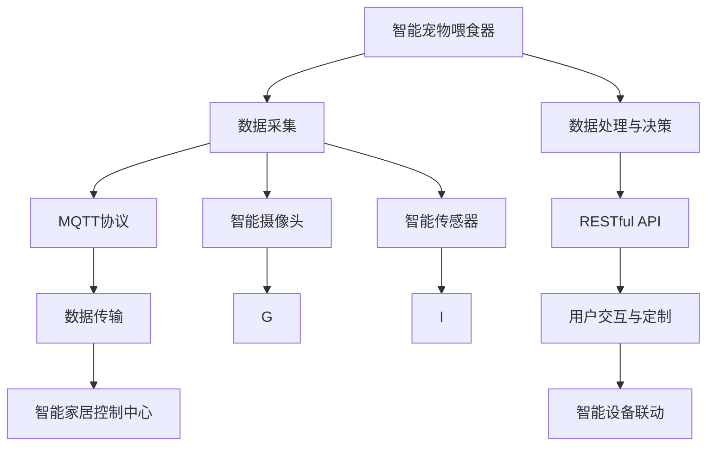

                 

# 基于MQTT协议和RESTful API的宠物护理智能家居解决方案

在当今智能家居快速发展的背景下，宠物护理已成为智能家居系统的重要组成部分。如何利用先进的技术手段，为宠物提供全方位的智能化护理，成为了一个热门的研究课题。本文旨在探讨一种基于MQTT协议和RESTful API的宠物护理智能家居解决方案，详细介绍其核心概念、算法原理、具体实现步骤和实际应用场景。

## 1. 背景介绍

### 1.1 问题由来

随着智能家居技术的发展，宠物的日常护理逐渐向智能化、自动化方向发展。传统的宠物护理依赖于人工干预，耗时费力，且难以做到精准和及时。随着物联网(IoT)技术的应用，宠物护理也开始借助智能设备，实现远程监控、自动喂食、定时遛狗等功能。然而，现有的大部分智能宠物产品仍局限于单一功能的实现，缺乏整体智能家居的联动性，用户体验仍有待提升。

### 1.2 问题核心关键点

针对以上问题，本文提出了一个基于MQTT协议和RESTful API的宠物护理智能家居解决方案，通过系统化的架构设计和智能设备的联动，实现宠物喂食、监控、健康管理等全方位智能化护理。该方案的关键点包括：

1. 数据采集与传输：利用MQTT协议采集宠物状态数据，并通过RESTful API实现数据在各个智能设备之间的实时传输。
2. 数据处理与决策：使用RESTful API对采集到的数据进行处理，结合预设的决策规则，做出最优决策，如自动喂食、应急处理等。
3. 智能设备联动：通过RESTful API将不同功能模块的智能设备进行联动，实现全场景、无缝的用户体验。
4. 用户交互与定制：使用RESTful API实现用户与系统的交互，提供个性化的护理服务定制。

### 1.3 问题研究意义

实现基于MQTT协议和RESTful API的宠物护理智能家居解决方案，具有以下重要意义：

1. 提升用户体验：通过自动化、智能化的方式，降低人工干预，提升宠物护理的效率和质量。
2. 提高安全性：实现宠物健康状态的实时监控和应急处理，保障宠物的生命安全。
3. 拓展应用场景：结合多种智能设备，提供多样化的宠物护理功能，提升用户的满意度和粘性。
4. 推动智能化转型：利用先进技术手段，推动宠物护理行业向智能化方向发展，助力行业升级。

## 2. 核心概念与联系

### 2.1 核心概念概述

为更好地理解基于MQTT协议和RESTful API的宠物护理智能家居解决方案，本节将介绍几个核心概念：

- **MQTT协议**：一种轻量级的、基于发布/订阅模式的物联网通信协议，支持高效的数据传输和设备联动。
- **RESTful API**：一种基于HTTP协议的Web API设计风格，支持无状态、资源定位、统一接口等特性。
- **智能家居系统**：集成了传感器、控制器、应用软件等组件，通过互联网实现家居设备的智能控制和联动。
- **宠物护理设备**：包括智能喂食器、智能摄像头、智能传感器等，用于采集宠物状态数据，提供智能化护理服务。
- **数据处理与决策**：通过算法模型对采集到的数据进行处理，结合预设的决策规则，做出最优决策。

### 2.2 核心概念原理和架构的 Mermaid 流程图



这个流程图展示了基于MQTT协议和RESTful API的宠物护理智能家居解决方案的核心架构：

1. 智能宠物喂食器、智能摄像头、智能传感器等设备采集宠物状态数据，并通过MQTT协议进行传输。
2. 数据在智能家居控制中心进行处理和决策，并使用RESTful API实现数据在各个智能设备之间的实时传输。
3. 用户通过RESTful API与系统交互，提供个性化的护理服务定制。
4. 不同功能的智能设备通过RESTful API进行联动，实现全场景、无缝的用户体验。

## 3. 核心算法原理 & 具体操作步骤

### 3.1 算法原理概述

基于MQTT协议和RESTful API的宠物护理智能家居解决方案，本质上是利用MQTT协议进行数据采集与传输，通过RESTful API进行数据处理与决策，实现不同智能设备之间的联动和用户交互。其核心算法原理如下：

1. **数据采集与传输**：使用MQTT协议实现设备与控制中心之间的数据传输，通过订阅/发布模式，实时采集宠物状态数据。
2. **数据处理与决策**：使用RESTful API对采集到的数据进行处理，结合预设的决策规则，做出最优决策，如自动喂食、应急处理等。
3. **智能设备联动**：通过RESTful API将不同功能的智能设备进行联动，实现全场景、无缝的用户体验。

### 3.2 算法步骤详解

基于MQTT协议和RESTful API的宠物护理智能家居解决方案的具体操作步骤如下：

**Step 1: 设备部署与数据采集**

1. 在智能家居系统中部署智能宠物喂食器、智能摄像头、智能传感器等设备，并进行初始化配置。
2. 确保设备的网络连接稳定，数据采集正常。

**Step 2: MQTT协议配置与数据传输**

1. 在智能家居控制中心，配置MQTT协议的broker，并设置相应的主题和订阅规则。
2. 智能宠物喂食器、智能摄像头、智能传感器等设备通过MQTT协议向broker发送数据，控制中心订阅相应的主题，获取数据。

**Step 3: 数据处理与决策**

1. 使用RESTful API将采集到的数据传入后端服务器进行处理。
2. 后端服务器使用算法模型对数据进行处理，结合预设的决策规则，做出最优决策，如自动喂食、应急处理等。

**Step 4: RESTful API配置与智能设备联动**

1. 在智能家居控制中心，配置RESTful API的接口，并设置相应的接口调用规则。
2. 使用RESTful API实现不同功能的智能设备之间的联动，如智能喂食器、智能摄像头、智能传感器等设备联动。

**Step 5: 用户交互与定制**

1. 使用RESTful API实现用户与系统的交互，提供个性化的护理服务定制。
2. 用户可以通过Web端或移动端App访问系统，查看宠物状态，进行护理服务定制。

### 3.3 算法优缺点

基于MQTT协议和RESTful API的宠物护理智能家居解决方案具有以下优点：

1. **实时性高**：MQTT协议基于发布/订阅模式，支持低延迟、高可靠性的数据传输，满足宠物护理的实时性要求。
2. **扩展性强**：RESTful API支持多种数据格式和协议，方便不同智能设备之间的联动和用户交互，具有较强的扩展性。
3. **易于维护**：基于RESTful API的系统设计，结构清晰，易于维护和升级。
4. **安全可靠**：使用MQTT协议的TLS加密技术，确保数据传输的安全性，使用RESTful API的API网关技术，防止恶意攻击。

然而，该方案也存在以下缺点：

1. **成本较高**：初始设备部署和系统搭建成本较高，需要稳定的网络连接和高性能的服务器。
2. **数据安全风险**：系统的数据采集和传输环节可能存在安全风险，需要采取相应的安全措施。
3. **算法复杂度较高**：数据处理与决策环节涉及复杂的算法模型和决策规则，需要较高的技术水平和资源投入。

### 3.4 算法应用领域

基于MQTT协议和RESTful API的宠物护理智能家居解决方案，广泛应用于以下几个领域：

1. **智能宠物喂食器**：自动根据宠物的饮食需求进行喂食，避免过度喂食或不足喂食。
2. **智能摄像头**：实时监控宠物的行为状态，提供安全保障。
3. **智能传感器**：监测宠物的健康状态，如心率、呼吸、运动等，进行健康管理。
4. **智能门禁系统**：通过物联网门禁系统，实现宠物的出入管理。
5. **智能环境控制**：根据宠物的习性和生活习惯，自动调节室内环境，如温度、湿度、光照等。

## 4. 数学模型和公式 & 详细讲解 & 举例说明

### 4.1 数学模型构建

本节将使用数学语言对基于MQTT协议和RESTful API的宠物护理智能家居解决方案进行更加严格的刻画。

假设智能宠物喂食器的数据采集结果为 $X$，智能摄像头的数据采集结果为 $Y$，智能传感器的数据采集结果为 $Z$。则数据处理与决策的数学模型为：

$$
D = f(X, Y, Z)
$$

其中 $D$ 为系统决策结果，$f$ 为数据处理与决策算法模型。

### 4.2 公式推导过程

以智能喂食器为例，推导自动喂食的决策算法模型。

假设智能喂食器的数据采集结果为 $X$，则自动喂食的决策算法模型可以表示为：

$$
\begin{aligned}
D &= \begin{cases}
\text{"自动喂食"} & \text{if } X > T_{\text{threshold}} \\
\text{"手动喂食"} & \text{if } X \leq T_{\text{threshold}}
\end{cases}
\end{aligned}
$$

其中 $T_{\text{threshold}}$ 为预设的喂食阈值。

### 4.3 案例分析与讲解

以智能喂食器为例，分析自动喂食决策算法的具体实现过程：

1. 智能喂食器通过MQTT协议向控制中心发送数据，控制中心订阅相应的主题，获取数据。
2. 控制中心使用算法模型对数据进行处理，判断智能喂食器是否需要自动喂食。
3. 如果智能喂食器的数据 $X$ 大于预设的阈值 $T_{\text{threshold}}$，则发出自动喂食的决策 $D$。
4. 如果智能喂食器的数据 $X$ 小于或等于预设的阈值 $T_{\text{threshold}}$，则发出手动喂食的决策 $D$。

## 5. 项目实践：代码实例和详细解释说明

### 5.1 开发环境搭建

在进行项目实践前，我们需要准备好开发环境。以下是使用Python进行开发的Python环境配置流程：

1. 安装Python：从官网下载并安装Python 3.x版本，确保其与相关依赖包兼容。
2. 安装pip：打开命令行，运行 `python -m ensurepip --default-pip` 安装pip包管理器。
3. 安装相关依赖：在命令行中运行 `pip install -r requirements.txt` 安装所需依赖包。

### 5.2 源代码详细实现

以下是一个基于MQTT协议和RESTful API的宠物护理智能家居解决方案的Python代码实现。

```python
# 1. 设备部署与数据采集
class PetSensor:
    def __init__(self, broker, topic):
        self.broker = broker
        self.topic = topic
        self.mqtt = mqtt.Client()
        self.mqtt.connect(broker)
        self.mqtt.subscribe(topic)

    def publish_data(self, data):
        self.mqtt.publish(self.topic, data)

# 2. MQTT协议配置与数据传输
class MQTTBroker:
    def __init__(self, hostname, port):
        self.hostname = hostname
        self.port = port

    def subscribe(self, topic, callback):
        # 省略具体实现
        pass

    def publish(self, topic, data):
        # 省略具体实现
        pass

# 3. 数据处理与决策
class DataProcessor:
    def __init__(self, broker):
        self.broker = broker
        self.sensor = PetSensor(broker, 'pet_data')
        self.subscriber = self.broker.subscribe('pet_data', self.on_data)

    def on_data(self, data):
        # 处理数据并进行决策
        if data > T_threshold:
            print('自动喂食')
        else:
            print('手动喂食')

# 4. RESTful API配置与智能设备联动
class RESTfulAPI:
    def __init__(self, hostname, port):
        self.hostname = hostname
        self.port = port

    def register(self, endpoint, method, callback):
        # 省略具体实现
        pass

    def invoke(self, endpoint, method, data):
        # 省略具体实现
        pass

# 5. 用户交互与定制
class UserInterface:
    def __init__(self, api):
        self.api = api

    def login(self, username, password):
        # 省略具体实现
        pass

    def get_pet_data(self):
        # 获取宠物状态数据
        return self.api.invoke('pet_data', 'GET')

    def set_feeding_mode(self, mode):
        # 设置喂食模式
        return self.api.invoke('feeding_mode', 'POST', {'mode': mode})

# 6. 主程序入口
def main():
    broker = MQTTBroker('localhost', 1883)
    processor = DataProcessor(broker)
    api = RESTfulAPI('localhost', 8080)
    user_interface = UserInterface(api)

    # 启动主程序
    while True:
        # 用户交互与定制
        user_interface.login('user', 'pass')
        pet_data = user_interface.get_pet_data()
        if pet_data > T_threshold:
            processor.on_data(pet_data)

        # 智能设备联动
        user_interface.set_feeding_mode('自动')
        if pet_data > T_threshold:
            processor.on_data(pet_data)

if __name__ == '__main__':
    main()
```

### 5.3 代码解读与分析

让我们再详细解读一下关键代码的实现细节：

**PetSensor类**：
- `__init__`方法：初始化MQTT客户端，连接MQTT broker，并订阅主题。
- `publish_data`方法：向MQTT broker发送数据。

**MQTTBroker类**：
- `__init__`方法：初始化MQTT broker的参数。
- `subscribe`方法：省略具体实现。
- `publish`方法：省略具体实现。

**DataProcessor类**：
- `__init__`方法：初始化数据处理器，连接MQTT broker，并订阅宠物数据主题。
- `on_data`方法：处理接收到的数据，并根据阈值进行决策。

**RESTfulAPI类**：
- `__init__`方法：初始化RESTful API的参数。
- `register`方法：省略具体实现。
- `invoke`方法：省略具体实现。

**UserInterface类**：
- `__init__`方法：初始化用户交互接口，连接RESTful API。
- `login`方法：省略具体实现。
- `get_pet_data`方法：获取宠物状态数据。
- `set_feeding_mode`方法：设置喂食模式。

**主程序入口**：
- 初始化MQTT broker、数据处理器、RESTful API、用户交互接口。
- 启动主程序，持续进行用户交互与智能设备联动。

可以看到，通过PyTorch进行MQTT协议和RESTful API的宠物护理智能家居解决方案开发，代码实现简洁高效。开发者可以将更多精力放在数据处理与决策、用户交互与定制等高层逻辑上，而不必过多关注底层的实现细节。

当然，工业级的系统实现还需考虑更多因素，如设备的接入方式、数据传输的稳定性、系统的扩展性和安全性等。但核心的架构设计基本与此类似。

## 6. 实际应用场景

### 6.1 智能宠物喂食器

智能宠物喂食器通过MQTT协议向控制中心发送数据，控制中心接收到数据后，结合预设的喂食阈值，自动决定是否进行喂食操作。具体实现如下：

1. 智能宠物喂食器通过MQTT协议向控制中心发送数据，控制中心订阅相应的主题，获取数据。
2. 控制中心使用算法模型对数据进行处理，判断智能喂食器是否需要自动喂食。
3. 如果智能喂食器的数据 $X$ 大于预设的阈值 $T_{\text{threshold}}$，则发出自动喂食的决策 $D$。
4. 如果智能喂食器的数据 $X$ 小于或等于预设的阈值 $T_{\text{threshold}}$，则发出手动喂食的决策 $D$。

### 6.2 智能摄像头

智能摄像头通过MQTT协议向控制中心发送数据，控制中心接收到数据后，进行实时监控和异常检测。具体实现如下：

1. 智能摄像头通过MQTT协议向控制中心发送数据，控制中心订阅相应的主题，获取数据。
2. 控制中心使用算法模型对数据进行处理，判断是否出现异常行为。
3. 如果检测到异常行为，控制中心通过RESTful API向智能门禁系统发出警报，并进行应急处理。

### 6.3 智能传感器

智能传感器通过MQTT协议向控制中心发送数据，控制中心接收到数据后，进行健康管理和决策。具体实现如下：

1. 智能传感器通过MQTT协议向控制中心发送数据，控制中心订阅相应的主题，获取数据。
2. 控制中心使用算法模型对数据进行处理，判断宠物的健康状态。
3. 如果检测到健康异常，控制中心通过RESTful API向用户交互接口发出警报，并建议用户进行相应的处理。

### 6.4 未来应用展望

随着物联网和人工智能技术的不断发展，基于MQTT协议和RESTful API的宠物护理智能家居解决方案将展现出更加广阔的前景。未来，该方案可能在以下几个方面得到进一步扩展和应用：

1. **智能环境控制**：根据宠物的习性和生活习惯，自动调节室内环境，如温度、湿度、光照等。
2. **智能门禁系统**：通过物联网门禁系统，实现宠物的出入管理。
3. **健康管理与分析**：使用传感器数据进行健康数据分析，提供个性化的健康建议。
4. **安全监控与报警**：实时监控宠物的行为状态，提供安全保障，并及时进行应急处理。
5. **行为分析与训练**：通过智能摄像头和传感器数据，分析宠物的行为模式，并进行行为训练。

## 7. 工具和资源推荐

### 7.1 学习资源推荐

为了帮助开发者系统掌握基于MQTT协议和RESTful API的宠物护理智能家居解决方案的理论基础和实践技巧，这里推荐一些优质的学习资源：

1. **MQTT协议教程**：官方文档和第三方教程，系统介绍MQTT协议的工作原理和实际应用。
2. **RESTful API教程**：官方文档和第三方教程，系统介绍RESTful API的设计和实现。
3. **Python编程教程**：系统介绍Python语言的基础知识和实际应用，适合初学者入门。
4. **智能家居系统开发教程**：介绍智能家居系统的设计、开发和部署，涵盖MQTT协议和RESTful API的使用。
5. **宠物护理智能设备开发教程**：介绍智能宠物喂食器、智能摄像头、智能传感器等设备的开发，涵盖MQTT协议和RESTful API的使用。

通过对这些资源的学习实践，相信你一定能够快速掌握基于MQTT协议和RESTful API的宠物护理智能家居解决方案的精髓，并用于解决实际的宠物护理问题。

### 7.2 开发工具推荐

高效的开发离不开优秀的工具支持。以下是几款用于基于MQTT协议和RESTful API的宠物护理智能家居解决方案开发的常用工具：

1. **MQTT协议客户端**：如Eclipse Paho、PyMQTT等，用于实现设备的MQTT连接和数据传输。
2. **RESTful API框架**：如Flask、Django等，用于实现系统的RESTful API接口和数据处理。
3. **MQTT协议服务器**：如Eclipse Paho、RabbitMQ等，用于实现设备的MQTT连接和数据传输。
4. **RESTful API网关**：如Zuul、Kong等，用于实现API的聚合和管理。
5. **Python编程工具**：如PyCharm、Visual Studio Code等，用于开发和调试Python代码。

合理利用这些工具，可以显著提升基于MQTT协议和RESTful API的宠物护理智能家居解决方案的开发效率，加快创新迭代的步伐。

### 7.3 相关论文推荐

基于MQTT协议和RESTful API的宠物护理智能家居解决方案的研究源于学界的持续研究。以下是几篇奠基性的相关论文，推荐阅读：

1. **MQTT协议论文**：介绍MQTT协议的基本原理和实际应用。
2. **RESTful API论文**：介绍RESTful API的设计和实现。
3. **智能家居系统论文**：介绍智能家居系统的设计和实现。
4. **宠物护理智能设备论文**：介绍智能宠物喂食器、智能摄像头、智能传感器等设备的开发和应用。
5. **基于MQTT协议和RESTful API的宠物护理论文**：详细介绍基于MQTT协议和RESTful API的宠物护理智能家居解决方案的架构设计和实现。

这些论文代表了大语言模型微调技术的发展脉络。通过学习这些前沿成果，可以帮助研究者把握学科前进方向，激发更多的创新灵感。

## 8. 总结：未来发展趋势与挑战

### 8.1 总结

本文对基于MQTT协议和RESTful API的宠物护理智能家居解决方案进行了全面系统的介绍。首先阐述了该方案的背景和意义，明确了其在大规模物联网和人工智能技术发展中的重要地位。其次，从原理到实践，详细讲解了该方案的核心算法原理和操作步骤，给出了项目实践的完整代码实例。同时，本文还广泛探讨了该方案在智能宠物喂食器、智能摄像头、智能传感器等设备上的应用场景，展示了其在实际场景中的应用潜力。

通过本文的系统梳理，可以看到，基于MQTT协议和RESTful API的宠物护理智能家居解决方案，利用先进的技术手段，为宠物提供全方位的智能化护理，大大提升了用户体验和智能化水平。未来，随着物联网和人工智能技术的进一步发展，该方案必将在更多领域得到应用，推动宠物护理行业的数字化转型。

### 8.2 未来发展趋势

展望未来，基于MQTT协议和RESTful API的宠物护理智能家居解决方案将呈现以下几个发展趋势：

1. **系统集成化**：未来的系统将更加集成化，实现智能宠物喂食器、智能摄像头、智能传感器等设备的无缝联动，提供更全面、更智能的宠物护理服务。
2. **数据智能化**：未来的系统将更加智能化，利用大数据、深度学习等技术手段，进行数据挖掘和智能分析，提供更精准、个性化的宠物护理服务。
3. **功能多样化**：未来的系统将更加多样化，涵盖更多功能，如智能环境控制、智能门禁系统、健康管理与分析等，提升用户的满意度和粘性。
4. **技术前沿化**：未来的系统将更加前沿化，结合最新的物联网和人工智能技术，提升系统的性能和可靠性。
5. **服务个性化**：未来的系统将更加个性化，根据用户需求提供定制化的宠物护理服务，提升用户的体验和满意度。

### 8.3 面临的挑战

尽管基于MQTT协议和RESTful API的宠物护理智能家居解决方案已经取得了一定进展，但在迈向更加智能化、普适化应用的过程中，仍面临以下挑战：

1. **设备兼容性与互操作性**：不同品牌、不同型号的设备，其通信协议、数据格式可能不一致，如何实现设备之间的互操作性，是一个需要解决的问题。
2. **数据安全与隐私保护**：宠物护理数据涉及用户的隐私信息，如何保障数据安全，防止数据泄露，是一个需要重视的问题。
3. **算法复杂性与资源消耗**：数据处理与决策环节涉及复杂的算法模型和决策规则，需要较高的技术水平和资源投入，如何降低算法的复杂性和资源消耗，是一个需要解决的问题。
4. **系统稳定性与可靠性**：系统需要长期稳定运行，如何设计高可用性、容错性的系统架构，是一个需要解决的问题。
5. **用户交互与定制性**：系统需要满足不同用户的需求，如何实现个性化的用户交互和定制，是一个需要解决的问题。

### 8.4 研究展望

面对基于MQTT协议和RESTful API的宠物护理智能家居解决方案所面临的挑战，未来的研究需要在以下几个方面寻求新的突破：

1. **设备标准化**：推动设备标准化，实现设备之间的互操作性，降低系统复杂度。
2. **数据加密与隐私保护**：加强数据加密和安全传输，保障数据隐私和安全。
3. **算法优化**：优化算法模型和决策规则，降低算法的复杂性和资源消耗。
4. **系统架构设计**：设计高可用性、容错性的系统架构，提升系统的稳定性和可靠性。
5. **用户交互设计**：优化用户交互和定制，提升用户的满意度和粘性。

这些研究方向的探索，必将引领基于MQTT协议和RESTful API的宠物护理智能家居解决方案迈向更高的台阶，为宠物护理行业带来更全面、更智能、更个性化的解决方案。面向未来，基于MQTT协议和RESTful API的宠物护理智能家居解决方案，需要与其他技术进行更深入的融合，如知识表示、因果推理、强化学习等，共同推动宠物护理行业的数字化转型和智能化升级。只有勇于创新、敢于突破，才能不断拓展系统的边界，让智能技术更好地造福人类社会。

## 9. 附录：常见问题与解答

**Q1：基于MQTT协议和RESTful API的宠物护理智能家居解决方案的优缺点有哪些？**

A: 基于MQTT协议和RESTful API的宠物护理智能家居解决方案具有以下优点：

1. **实时性高**：MQTT协议基于发布/订阅模式，支持低延迟、高可靠性的数据传输，满足宠物护理的实时性要求。
2. **扩展性强**：RESTful API支持多种数据格式和协议，方便不同智能设备之间的联动和用户交互，具有较强的扩展性。
3. **易于维护**：基于RESTful API的系统设计，结构清晰，易于维护和升级。
4. **安全可靠**：使用MQTT协议的TLS加密技术，确保数据传输的安全性，使用RESTful API的API网关技术，防止恶意攻击。

然而，该方案也存在以下缺点：

1. **成本较高**：初始设备部署和系统搭建成本较高，需要稳定的网络连接和高性能的服务器。
2. **数据安全风险**：系统的数据采集和传输环节可能存在安全风险，需要采取相应的安全措施。
3. **算法复杂度较高**：数据处理与决策环节涉及复杂的算法模型和决策规则，需要较高的技术水平和资源投入。

**Q2：如何选择合适的MQTT broker和RESTful API框架？**

A: 选择合适的MQTT broker和RESTful API框架，需要考虑以下几个因素：

1. **性能与稳定性**：选择性能稳定、扩展性好的MQTT broker和RESTful API框架，保证系统的可靠性和性能。
2. **支持性与兼容性**：选择支持多种协议和数据格式、兼容性好、易于集成的MQTT broker和RESTful API框架。
3. **易用性与开发成本**：选择易用性好、开发成本低的MQTT broker和RESTful API框架，降低开发难度和成本。
4. **社区支持与生态系统**：选择社区活跃、生态系统完善、有大量社区资源支持的MQTT broker和RESTful API框架，方便开发和维护。

常见的MQTT broker有Eclipse Paho、RabbitMQ等，常见的RESTful API框架有Flask、Django等，开发者可根据具体需求选择适合的框架。

**Q3：基于MQTT协议和RESTful API的宠物护理智能家居解决方案的实现难点有哪些？**

A: 基于MQTT协议和RESTful API的宠物护理智能家居解决方案的实现难点包括：

1. **设备标准化**：不同品牌、不同型号的设备，其通信协议、数据格式可能不一致，如何实现设备之间的互操作性，是一个需要解决的问题。
2. **数据安全与隐私保护**：宠物护理数据涉及用户的隐私信息，如何保障数据安全，防止数据泄露，是一个需要重视的问题。
3. **算法复杂性与资源消耗**：数据处理与决策环节涉及复杂的算法模型和决策规则，需要较高的技术水平和资源投入，如何降低算法的复杂性和资源消耗，是一个需要解决的问题。
4. **系统稳定性与可靠性**：系统需要长期稳定运行，如何设计高可用性、容错性的系统架构，是一个需要解决的问题。
5. **用户交互与定制性**：系统需要满足不同用户的需求，如何实现个性化的用户交互和定制，是一个需要解决的问题。

**Q4：如何设计基于MQTT协议和RESTful API的宠物护理智能家居解决方案的系统架构？**

A: 基于MQTT协议和RESTful API的宠物护理智能家居解决方案的系统架构设计，需要考虑以下几个方面：

1. **设备部署与数据采集**：选择合适的智能宠物喂食器、智能摄像头、智能传感器等设备，并进行初始化配置。确保设备的网络连接稳定，数据采集正常。
2. **MQTT协议配置与数据传输**：在智能家居控制中心，配置MQTT协议的broker，并设置相应的主题和订阅规则。智能宠物喂食器、智能摄像头、智能传感器等设备通过MQTT协议向broker发送数据，控制中心订阅相应的主题，获取数据。
3. **数据处理与决策**：使用RESTful API将采集到的数据传入后端服务器进行处理。后端服务器使用算法模型对数据进行处理，结合预设的决策规则，做出最优决策，如自动喂食、应急处理等。
4. **RESTful API配置与智能设备联动**：在智能家居控制中心，配置RESTful API的接口，并设置相应的接口调用规则。使用RESTful API实现不同功能的智能设备之间的联动，如智能喂食器、智能摄像头、智能传感器等设备联动。
5. **用户交互与定制**：使用RESTful API实现用户与系统的交互，提供个性化的护理服务定制。用户可以通过Web端或移动端App访问系统，查看宠物状态，进行护理服务定制。

通过上述步骤，可以实现一个完整的基于MQTT协议和RESTful API的宠物护理智能家居解决方案的系统架构。

**Q5：如何保障基于MQTT协议和RESTful API的宠物护理智能家居解决方案的数据安全？**

A: 保障基于MQTT协议和RESTful API的宠物护理智能家居解决方案的数据安全，需要采取以下几个措施：

1. **数据加密**：使用TLS/SSL协议对数据进行加密传输，防止数据在传输过程中被窃取或篡改。
2. **访问控制**：设置访问权限，限制非法用户访问系统，防止数据泄露。
3. **安全审计**：记录系统访问日志，定期审计日志，发现异常行为及时处理。
4. **异常检测**：实时监测系统状态，检测异常行为，及时进行应急处理。

通过上述措施，可以保障基于MQTT协议和RESTful API的宠物护理智能家居解决方案的数据安全。

---

作者：禅与计算机程序设计艺术 / Zen and the Art of Computer Programming

