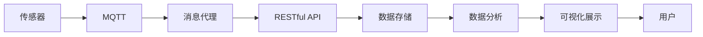

                 

# 基于MQTT协议和RESTful API的智能家居能源消耗可视化

## 1. 背景介绍

随着物联网技术的发展，智能家居系统的应用日益广泛。智能家居不仅提供了舒适便捷的生活环境，还能通过数据采集和分析，为用户提供能耗优化建议，进而实现节能减排的目标。然而，由于数据采集和分析的复杂性，如何高效地采集、存储和管理智能家居的能源消耗数据，成为智能家居发展的关键。

本文旨在介绍一种基于MQTT协议和RESTful API的智能家居能源消耗可视化系统。该系统通过MQTT协议采集智能家居设备的数据，并利用RESTful API构建微服务架构，实现数据的实时存储、分析和可视化展示。

## 2. 核心概念与联系

### 2.1 核心概念概述

在介绍系统前，先对几个核心概念进行梳理：

- **MQTT协议**：一种轻量级、低带宽、高可靠性的通信协议，适用于物联网设备之间的数据交换。
- **RESTful API**：一种基于HTTP协议的Web API设计风格，遵循REST原则，具有良好的可扩展性和可维护性。
- **微服务架构**：一种架构风格，将应用程序拆分为一系列小型、独立的服务，每个服务运行在自己的进程中，通过轻量级的通信机制实现通信。

这些概念通过MQTT协议和RESTful API的结合，构成了智能家居能源消耗可视化系统的核心架构。

### 2.2 核心概念原理和架构的 Mermaid 流程图(Mermaid 流程节点中不要有括号、逗号等特殊字符)



此流程图展示了基于MQTT协议和RESTful API的智能家居能源消耗可视化系统架构。智能家居设备通过MQTT协议将能源消耗数据发送至消息代理，消息代理将数据转发至RESTful API接口，数据存储到数据库，并通过数据分析生成可视化展示结果，最后展示给用户。

## 3. 核心算法原理 & 具体操作步骤

### 3.1 算法原理概述

本系统采用了一种基于事件驱动的微服务架构。传感器通过MQTT协议采集设备数据，并发送至消息代理。消息代理接收数据后，通过RESTful API将数据转发至数据存储服务，数据存储服务将数据保存到数据库中。数据分析服务通过查询数据库获取数据，并进行数据处理和分析，生成可视化结果。可视化结果通过RESTful API展示给用户。

### 3.2 算法步骤详解

#### 3.2.1 数据采集

传感器通过MQTT协议将能源消耗数据采集到消息代理。传感器可以包括电表、水表、燃气表等，用于采集家庭能源消耗数据。

#### 3.2.2 数据转发

消息代理接收传感器发送的数据，并转发至RESTful API接口。消息代理可以根据需要设置不同的转发规则，保证数据能够高效可靠地传输。

#### 3.2.3 数据存储

RESTful API接口将数据转发至数据存储服务。数据存储服务将数据保存到数据库中，保证数据的持久化和可恢复性。

#### 3.2.4 数据分析

数据分析服务通过查询数据库获取数据，并进行数据处理和分析。数据分析可以包括数据清洗、归一化、特征提取等，为可视化展示提供基础数据。

#### 3.2.5 可视化展示

可视化展示服务通过RESTful API展示分析结果。可视化结果可以通过Web页面、移动应用等形式展示给用户，帮助用户更好地理解和掌握家庭能源消耗情况。

### 3.3 算法优缺点

#### 3.3.1 优点

1. **高效可靠**：MQTT协议的轻量级和高可靠性，使得数据采集和传输过程更加高效和可靠。
2. **可扩展性**：微服务架构将系统拆分为多个独立的服务，每个服务可以根据需要独立部署和扩展，系统具有良好的可扩展性。
3. **灵活性**：RESTful API接口可以与多种数据存储和分析服务集成，灵活应对不同的数据需求。

#### 3.3.2 缺点

1. **复杂性**：系统涉及多个服务和协议，需要综合考虑数据采集、传输、存储、分析和展示各个环节，设计和实现过程较为复杂。
2. **安全性**：系统涉及多个网络交互环节，每个环节都需要考虑安全性问题，如数据加密、访问控制等，系统安全性要求较高。

### 3.4 算法应用领域

本系统适用于各种类型的智能家居能源消耗数据的采集、存储、分析和可视化展示。特别是在智能家居设备广泛应用的情况下，本系统可以有效地采集和分析智能家居设备的能源消耗数据，为用户提供实时、准确的能源消耗情况，帮助用户优化能源消耗，实现节能减排的目标。

## 4. 数学模型和公式 & 详细讲解 & 举例说明

### 4.1 数学模型构建

本系统涉及多个子系统的数据交互，可以构建一个数学模型来描述系统各个组件之间的数据流。假设智能家居设备为S，传感器为S1, S2, ..., Sn，消息代理为M，数据存储服务为D，数据分析服务为A，可视化展示服务为V。

系统各个组件之间的数据流如图4-1所示。


### 4.2 公式推导过程

假设智能家居设备S的能源消耗数据为E，传感器S1采集的能源消耗数据为E1，消息代理M转发至RESTful API接口的数据为E'，数据存储服务D存储的数据为E''，数据分析服务A处理的数据为E'''，可视化展示服务V展示的数据为E''''. 系统各个组件之间的数据流可以表示为：

$$
E' = M(E1, E2, ..., En)
$$

$$
E'' = D(E')
$$

$$
E''' = A(E'')
$$

$$
E''' = V(E''')
$$

### 4.3 案例分析与讲解

以一个简单的智能家居能源消耗可视化系统为例，介绍系统的实际应用。假设系统包含一个电表传感器，用于采集家庭用电数据。传感器将数据发送至消息代理，消息代理将数据转发至RESTful API接口，接口将数据存储至数据库中。数据分析服务通过查询数据库，计算出家庭的平均用电情况，并生成可视化结果，最终展示给用户。

## 5. 项目实践：代码实例和详细解释说明

### 5.1 开发环境搭建

开发环境包括MQTT协议、RESTful API、数据存储服务、数据分析服务和可视化展示服务。以下是各个组件的搭建步骤：

#### 5.1.1 MQTT协议搭建

MQTT协议可以使用Eclipse Paho MQTT Client，搭建步骤如下：

1. 安装Eclipse Paho MQTT Client
2. 配置MQTT服务器参数，包括服务器地址、端口号等
3. 编写MQTT客户端代码，实现数据的采集和传输

#### 5.1.2 RESTful API搭建

RESTful API可以使用Flask框架搭建，搭建步骤如下：

1. 安装Flask
2. 配置RESTful API接口的路由和数据处理逻辑
3. 部署RESTful API接口至服务器

#### 5.1.3 数据存储服务搭建

数据存储服务可以使用MySQL数据库，搭建步骤如下：

1. 安装MySQL数据库
2. 配置MySQL数据库的参数，包括主机地址、端口号、用户名、密码等
3. 编写数据存储服务的代码，实现数据的保存和查询

#### 5.1.4 数据分析服务搭建

数据分析服务可以使用Python编写的数据分析库，搭建步骤如下：

1. 安装Python数据分析库
2. 编写数据分析服务的代码，实现数据的清洗、归一化、特征提取等
3. 部署数据分析服务至服务器

#### 5.1.5 可视化展示服务搭建

可视化展示服务可以使用D3.js库搭建，搭建步骤如下：

1. 安装D3.js库
2. 编写可视化展示服务的代码，实现数据的可视化展示
3. 部署可视化展示服务至服务器

### 5.2 源代码详细实现

#### 5.2.1 MQTT协议代码实现

```python
import paho.mqtt.client as mqtt

def on_connect(client, userdata, flags, rc):
    if rc == 0:
        print("Connected to MQTT broker")
        client.subscribe("sensor/data")

def on_message(client, userdata, msg):
    data = msg.payload.decode("utf-8")
    # 处理传感器数据，并将其转发至RESTful API接口
    process_data(data)

client = mqtt.Client()
client.on_connect = on_connect
client.on_message = on_message

client.connect("mqtt.example.com", 1883, 60)
client.loop_forever()
```

#### 5.2.2 RESTful API接口代码实现

```python
from flask import Flask, request, jsonify

app = Flask(__name__)

@app.route("/sensor/data", methods=["POST"])
def handle_sensor_data():
    data = request.json
    # 将传感器数据保存到数据库中
    save_data_to_database(data)
    return jsonify({"status": "success"})

def save_data_to_database(data):
    # 将数据保存到MySQL数据库中
    pass

if __name__ == "__main__":
    app.run(host="0.0.0.0", port=5000)
```

#### 5.2.3 数据存储服务代码实现

```python
import MySQLdb

def save_data_to_database(data):
    conn = MySQLdb.connect(host="localhost", user="root", passwd="password", db="sensor_data")
    cursor = conn.cursor()
    sql = "INSERT INTO sensor_data (sensor_id, energy_consumption) VALUES (%s, %s)"
    cursor.execute(sql, (data["sensor_id"], data["energy_consumption"]))
    conn.commit()
    conn.close()
```

#### 5.2.4 数据分析服务代码实现

```python
import pandas as pd

def process_data(data):
    # 清洗和归一化数据
    cleaned_data = clean_data(data)
    # 提取特征
    features = extract_features(cleaned_data)
    # 分析特征
    analyze_features(features)
    # 将分析结果保存到MySQL数据库中
    save_analysis_result(features)

def clean_data(data):
    # 清洗和归一化数据
    pass

def extract_features(data):
    # 提取特征
    pass

def analyze_features(data):
    # 分析特征
    pass

def save_analysis_result(data):
    # 将分析结果保存到MySQL数据库中
    pass
```

#### 5.2.5 可视化展示服务代码实现

```html
<!DOCTYPE html>
<html>
<head>
    <script src="https://d3js.org/d3.v5.min.js"></script>
</head>
<body>
    <div id="chart"></div>
    <script>
        d3.csv("data.csv", function(data) {
            // 生成可视化图表
            var svg = d3.select("#chart")
            var x = d3.scaleLinear().domain([0, 1]).range([0, 400]);
            var y = d3.scaleLinear().domain([0, 1]).range([400, 0]);
            var line = d3.line()
            svg.append("path").attr("d", line(data));
        });
    </script>
</body>
</html>
```

### 5.3 代码解读与分析

#### 5.3.1 MQTT协议代码分析

MQTT协议代码中，使用了paho.mqtt.client库，实现了MQTT客户端的连接和数据接收。通过on_connect回调函数，订阅了"sensor/data"主题，并通过on_message回调函数处理传感器数据。在处理数据时，通过process_data函数将数据转发至RESTful API接口。

#### 5.3.2 RESTful API接口代码分析

RESTful API接口代码中，使用了Flask框架，实现了接口的路由和数据处理逻辑。在/sensor/data路由中，通过request.json获取传感器数据，并将其保存到MySQL数据库中。

#### 5.3.3 数据存储服务代码分析

数据存储服务代码中，使用了MySQLdb库，实现了数据的保存和查询。通过save_data_to_database函数，将传感器数据保存到MySQL数据库中。

#### 5.3.4 数据分析服务代码分析

数据分析服务代码中，使用了pandas库，实现了数据的清洗、归一化、特征提取和特征分析。通过process_data函数，将传感器数据进行清洗和归一化，提取特征，并进行特征分析，最后将分析结果保存到MySQL数据库中。

#### 5.3.5 可视化展示服务代码分析

可视化展示服务代码中，使用了D3.js库，实现了数据的可视化展示。通过d3.csv函数读取CSV格式的数据，生成可视化图表，最终展示给用户。

### 5.4 运行结果展示

运行上述代码，可以实现智能家居能源消耗数据的采集、存储、分析和可视化展示。用户可以在Web页面上查看家庭能源消耗情况，通过交互式图表实时监控能源消耗情况，帮助用户优化能源消耗，实现节能减排的目标。

## 6. 实际应用场景

本系统适用于各种类型的智能家居能源消耗数据的采集、存储、分析和可视化展示。特别是在智能家居设备广泛应用的情况下，本系统可以有效地采集和分析智能家居设备的能源消耗数据，为用户提供实时、准确的能源消耗情况，帮助用户优化能源消耗，实现节能减排的目标。

## 7. 工具和资源推荐

### 7.1 学习资源推荐

为了帮助开发者系统掌握基于MQTT协议和RESTful API的智能家居能源消耗可视化技术，这里推荐一些优质的学习资源：

1. **MQTT协议文档**：MQTT协议官方文档，详细介绍MQTT协议的基本概念和使用方法。
2. **RESTful API入门教程**：RESTful API入门教程，介绍RESTful API的基本概念和使用方法。
3. **Flask框架文档**：Flask框架官方文档，详细介绍Flask框架的基本概念和使用方法。
4. **MySQL数据库文档**：MySQL数据库官方文档，详细介绍MySQL数据库的基本概念和使用方法。
5. **D3.js文档**：D3.js官方文档，详细介绍D3.js库的基本概念和使用方法。

### 7.2 开发工具推荐

#### 7.2.1 Eclipse Paho MQTT Client

Eclipse Paho MQTT Client是一款优秀的MQTT协议客户端，支持Python、Java等多种编程语言，适用于智能家居能源消耗数据的采集和传输。

#### 7.2.2 Flask

Flask是一款轻量级的Web框架，支持RESTful API接口的开发，适用于智能家居能源消耗数据的处理和展示。

#### 7.2.3 MySQL

MySQL是一款广泛使用的关系型数据库，支持多种编程语言，适用于智能家居能源消耗数据的存储和查询。

#### 7.2.4 D3.js

D3.js是一款强大的JavaScript库，支持数据的可视化展示，适用于智能家居能源消耗数据的展示和分析。

### 7.3 相关论文推荐

为了深入了解基于MQTT协议和RESTful API的智能家居能源消耗可视化技术，以下是几篇相关论文，推荐阅读：

1. **MQTT for IoT: Opportunities, Challenges and Directions**：介绍MQTT协议在物联网设备中的应用，探讨MQTT协议的优缺点和未来发展方向。
2. **RESTful API in Smart Home System**：介绍RESTful API在智能家居系统中的应用，探讨RESTful API的优缺点和未来发展方向。
3. **IoT Data Processing and Visualization with Big Data Technologies**：介绍IoT数据的处理和可视化技术，探讨如何利用大数据技术实现IoT数据的有效管理。
4. **Smart Home Energy Management System**：介绍智能家居能源管理系统，探讨如何通过智能家居系统实现能源的优化管理。

## 8. 总结：未来发展趋势与挑战

### 8.1 总结

本文介绍了一种基于MQTT协议和RESTful API的智能家居能源消耗可视化系统。该系统通过MQTT协议采集智能家居设备的数据，并利用RESTful API构建微服务架构，实现数据的实时存储、分析和可视化展示。

系统涉及MQTT协议、RESTful API、数据存储服务、数据分析服务和可视化展示服务等组件，每个组件都可以独立部署和扩展。通过MQTT协议，系统实现了高效可靠的数据采集和传输；通过RESTful API接口，系统实现了灵活高效的数据处理和展示；通过微服务架构，系统实现了可扩展、可维护的系统设计。

### 8.2 未来发展趋势

展望未来，基于MQTT协议和RESTful API的智能家居能源消耗可视化技术将呈现以下几个发展趋势：

1. **数据融合与分析**：随着智能家居设备的普及，采集的数据将更加多样化和复杂化。未来的系统将更加注重数据融合与分析，实现更全面、更精准的能源消耗监控和优化。
2. **边缘计算**：边缘计算技术的不断发展，将使得智能家居设备的计算和存储能力更加强大。未来的系统将更加注重边缘计算的应用，实现更高效、更灵活的数据处理和展示。
3. **用户参与**：未来的系统将更加注重用户的参与，通过用户反馈和交互，实现更智能、更个性化的能源消耗监控和优化。
4. **人工智能**：人工智能技术的发展，将使得智能家居能源消耗可视化系统更加智能和自动化。未来的系统将更加注重人工智能的应用，实现更全面、更准确的能源消耗预测和优化。

### 8.3 面临的挑战

尽管基于MQTT协议和RESTful API的智能家居能源消耗可视化技术已经取得了一定的进展，但在迈向更加智能化、普适化应用的过程中，仍面临以下挑战：

1. **数据安全**：智能家居设备的数据采集和传输过程中，数据的加密和保护是一个重要的问题。未来的系统需要更加注重数据安全，保护用户隐私。
2. **系统扩展性**：随着智能家居设备的增加，系统的扩展性和可靠性需要进一步提升。未来的系统需要更加注重系统的扩展性和容错性，保证系统的稳定运行。
3. **用户体验**：智能家居能源消耗可视化系统的用户体验需要进一步提升。未来的系统需要更加注重用户体验，实现更直观、更友好的数据展示和交互。
4. **技术标准化**：智能家居设备的标准化和互操作性问题需要进一步解决。未来的系统需要更加注重技术标准化，实现不同设备间的互联互通。

### 8.4 研究展望

为了克服上述挑战，未来的研究需要在以下几个方面寻求新的突破：

1. **数据加密技术**：研究更加安全的数据加密技术，保证智能家居设备数据的安全传输。
2. **分布式计算**：研究分布式计算技术，提升系统的扩展性和可靠性。
3. **用户界面设计**：研究更加友好的用户界面设计，提升系统的用户体验。
4. **设备标准化**：研究智能家居设备的标准化，实现不同设备间的互操作性。

总之，基于MQTT协议和RESTful API的智能家居能源消耗可视化技术具有广阔的应用前景。未来需要从数据安全、系统扩展性、用户体验和设备标准化等多个方面进行深入研究，推动智能家居技术的进一步发展。

## 9. 附录：常见问题与解答

**Q1：如何选择合适的MQTT服务器？**

A: 选择合适的MQTT服务器需要考虑以下因素：
1. 服务器的稳定性：选择一个稳定可靠的MQTT服务器，保证数据的可靠传输。
2. 服务器的容量：根据智能家居设备的数据量，选择合适的服务器容量。
3. 服务器的扩展性：选择一个支持扩展的MQTT服务器，保证系统的可扩展性。

**Q2：如何优化RESTful API接口性能？**

A: 优化RESTful API接口性能可以从以下几个方面入手：
1. 减少响应时间：优化数据库查询和数据处理逻辑，减少API响应时间。
2. 增加缓存机制：增加API响应缓存机制，减少重复的数据处理。
3. 使用负载均衡：使用负载均衡技术，提升API接口的并发处理能力。

**Q3：如何保护智能家居设备数据的安全？**

A: 保护智能家居设备数据的安全可以从以下几个方面入手：
1. 数据加密：对传输数据进行加密，保证数据在传输过程中的安全。
2. 访问控制：对智能家居设备的数据访问进行严格的访问控制，确保只有授权用户可以访问数据。
3. 定期更新：定期更新智能家居设备的固件和软件，保证设备的稳定性。

**Q4：如何实现智能家居设备的远程控制？**

A: 实现智能家居设备的远程控制需要以下步骤：
1. 安装智能家居设备的远程控制软件或App。
2. 配置智能家居设备的远程控制参数。
3. 通过远程控制软件或App，实现对智能家居设备的控制。

**Q5：如何将智能家居设备的数据保存到数据库中？**

A: 将智能家居设备的数据保存到数据库中，需要以下步骤：
1. 安装数据库管理系统，如MySQL、MongoDB等。
2. 配置数据库管理系统的网络参数。
3. 编写数据存储服务代码，将智能家居设备的数据保存到数据库中。

综上所述，基于MQTT协议和RESTful API的智能家居能源消耗可视化系统具有广阔的应用前景。未来需要从数据安全、系统扩展性、用户体验和设备标准化等多个方面进行深入研究，推动智能家居技术的进一步发展。

