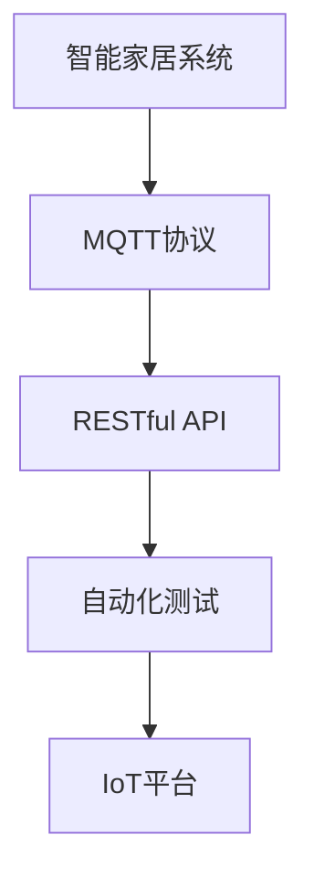

                 

# 基于MQTT协议和RESTful API的智能家居自动化测试平台

> 关键词：智能家居, MQTT协议, RESTful API, 自动化测试, IoT平台, 嵌入式系统

## 1. 背景介绍

### 1.1 问题由来

随着物联网技术的快速发展，智能家居系统变得越来越普遍。然而，由于系统的复杂性，确保智能家居系统的稳定性和可靠性至关重要。而传统的黑盒测试方法无法全面覆盖所有可能的系统状态和交互路径，因此，需要一个更加系统化和自动化的测试平台来验证智能家居系统的性能。

### 1.2 问题核心关键点

本文聚焦于基于MQTT协议和RESTful API的智能家居自动化测试平台的研究和设计。该平台通过集成的MQTT和RESTful接口，可以实现对智能家居系统的全面覆盖和自动化测试，提升系统的可靠性和安全性。

### 1.3 问题研究意义

设计一个高效、全面、自动化的智能家居测试平台，对于提升智能家居系统的质量、保障用户隐私和数据安全、推动物联网技术的发展具有重要意义。

## 2. 核心概念与联系

### 2.1 核心概念概述

为更好地理解基于MQTT协议和RESTful API的智能家居自动化测试平台，本节将介绍几个密切相关的核心概念：

- MQTT协议：一种轻量级、低延迟、高可靠性的消息传输协议，广泛应用于IoT设备之间。
- RESTful API：一种轻量级、可扩展、易于集成的Web API设计风格，常用于远程访问和数据交换。
- 智能家居系统：将家庭设备连接起来，通过自动化和智能化技术提升生活质量的系统。
- 自动化测试：通过自动化的工具和脚本，对软件系统进行全面测试，提高测试效率和覆盖率。
- IoT平台：连接和管理物联网设备的平台，提供数据采集、存储、分析等功能。

这些核心概念之间的逻辑关系可以通过以下Mermaid流程图来展示：



这个流程图展示了一个智能家居系统如何通过MQTT协议和RESTful API进行数据交换，并通过自动化测试平台进行全面测试，最终集成到IoT平台。

## 3. 核心算法原理 & 具体操作步骤
### 3.1 算法原理概述

基于MQTT协议和RESTful API的智能家居自动化测试平台，核心思想是通过集成的MQTT和RESTful接口，对智能家居系统进行全面覆盖和自动化测试。

其核心算法原理包括以下几个关键步骤：

1. 集成MQTT协议：在智能家居系统中集成MQTT协议，实现设备之间的实时通信。
2. 设计RESTful API：设计RESTful API，提供对智能家居系统的远程访问和数据交换。
3. 自动化测试框架：使用自动化测试框架，对智能家居系统进行全面测试，验证系统的稳定性和可靠性。
4. IoT平台集成：将测试结果集成到IoT平台，提供可视化和分析功能，提升系统管理效率。

### 3.2 算法步骤详解

以下是基于MQTT协议和RESTful API的智能家居自动化测试平台的主要操作步骤：

**Step 1: 设计MQTT和RESTful接口**

- 定义智能家居系统中各个设备的MQTT主题和命令，例如温度传感器的主题为"temperature/sensor"，命令为"temperature/read"。
- 设计RESTful API接口，例如获取温度数据的接口为"/api/temperature"，获取设备状态的接口为"/api/devices/{device_id}/status"。

**Step 2: 集成MQTT协议**

- 在智能家居系统中集成MQTT协议，例如使用Eclipse Paho MQTT客户端库。
- 实现MQTT消息的订阅和发布，例如订阅"temperature/sensor"主题，发布"temperature/read"命令。

**Step 3: 实现RESTful API**

- 使用Node.js、Express框架等工具，实现RESTful API接口。
- 编写API接口的实现代码，例如使用MySQL数据库存储设备状态，编写"/api/devices/{device_id}/status"接口的实现。

**Step 4: 编写自动化测试脚本**

- 使用Selenium、JMeter等工具，编写自动化测试脚本。
- 编写测试脚本，模拟用户操作，例如手动调整温度传感器，测试系统响应。

**Step 5: 集成IoT平台**

- 将测试结果集成到IoT平台，例如使用Foglia平台。
- 在IoT平台上展示测试结果，提供可视化分析功能。

### 3.3 算法优缺点

基于MQTT协议和RESTful API的智能家居自动化测试平台具有以下优点：

- 全面覆盖：通过MQTT协议和RESTful API，可以全面覆盖智能家居系统的各个设备和状态，确保测试的全面性。
- 自动化高效：使用自动化测试脚本，可以高效地进行测试，提高测试效率和覆盖率。
- 可扩展性强：通过RESTful API，可以实现对智能家居系统的远程访问和数据交换，方便系统扩展和维护。

同时，该平台也存在以下局限性：

- 依赖于硬件设备：需要依赖具体的硬件设备，测试结果可能受到硬件设备的限制。
- 网络延迟：由于MQTT协议的特性，网络延迟可能会影响测试的实时性和稳定性。
- 安全性问题：在通过RESTful API进行远程访问时，需要注意安全性问题，防止数据泄露和攻击。

尽管存在这些局限性，但就目前而言，基于MQTT协议和RESTful API的智能家居自动化测试平台仍是大规模智能家居系统测试的主要手段。未来相关研究的重点在于如何进一步提升测试的全面性和实时性，同时兼顾安全性和可扩展性等因素。

### 3.4 算法应用领域

基于MQTT协议和RESTful API的智能家居自动化测试平台，在智能家居系统测试领域已经得到了广泛的应用，覆盖了以下主要应用场景：

- 设备兼容性测试：测试智能家居系统中各个设备的兼容性和互操作性。
- 系统稳定性测试：测试智能家居系统的稳定性和可靠性，验证系统是否能在各种情况下正常运行。
- 数据完整性测试：测试智能家居系统的数据完整性和准确性，确保数据传输的正确性。
- 安全性测试：测试智能家居系统的安全性，验证系统的安全性机制是否可靠。

此外，在智慧医疗、智慧城市、智慧交通等领域，基于MQTT协议和RESTful API的智能家居自动化测试平台也具有广泛的应用前景。随着物联网技术的不断进步，基于MQTT协议和RESTful API的智能家居自动化测试平台必将在更多领域得到应用，为物联网技术的产业升级做出重要贡献。

## 4. 数学模型和公式 & 详细讲解 & 举例说明

### 4.1 数学模型构建

本节将使用数学语言对基于MQTT协议和RESTful API的智能家居自动化测试平台进行更加严格的刻画。

假设智能家居系统中有N个设备，每个设备的MQTT主题和命令分别为$T_1$、$C_1$,$\ldots$,$T_N$、$C_N$，RESTful API接口为$A_1$,$\ldots$,$A_M$。设测试时间为$t$，测试过程中订阅的MQTT主题集合为$S$，发布的MQTT命令集合为$C$。

定义测试结果矩阵$\mathbf{R} \in \{0, 1\}^{N \times M}$，其中$R_{i,j}=1$表示设备$i$在时间$t$时通过RESTful API接口$j$成功执行了测试，$R_{i,j}=0$表示执行失败或未执行。

### 4.2 公式推导过程

在测试过程中，每个设备订阅的MQTT主题和发布的MQTT命令的概率分别为$p_i$和$q_i$，则测试过程中订阅的MQTT主题集合$S$和发布的MQTT命令集合$C$的概率分别为：

$$
P(S) = \prod_{i=1}^N p_i^{S_i} (1-p_i)^{1-S_i}
$$

$$
P(C) = \prod_{i=1}^N q_i^{C_i} (1-q_i)^{1-C_i}
$$

其中$S_i$表示设备$i$是否订阅了MQTT主题$T_i$，$C_i$表示设备$i$是否发布了MQTT命令$C_i$。

测试结果矩阵$\mathbf{R}$的概率可以通过联合概率公式计算：

$$
P(\mathbf{R}) = \sum_{S \in \{0, 1\}^N} P(S) \sum_{C \in \{0, 1\}^N} P(C) \prod_{i=1}^N P(R_{i, j}|S_i, C_i)
$$

其中$P(R_{i, j}|S_i, C_i)$表示在设备$i$订阅了MQTT主题$T_i$并发布了MQTT命令$C_i$的情况下，通过RESTful API接口$j$执行测试的概率。

### 4.3 案例分析与讲解

假设智能家居系统中有3个设备，分别用于温度控制、灯光控制和安全监控，每个设备的MQTT主题和命令如表所示：

| 设备类型 | 主题            | 命令          |
|----------|-----------------|---------------|
| 温度控制 | temperature/sensor | temperature/read |
| 灯光控制  | lighting/sensor   | lighting/control |
| 安全监控  | security/sensor   | security/alert |

测试过程中，设备1订阅了"temperature/sensor"主题，设备2订阅了"lighting/sensor"主题，设备3订阅了"security/sensor"主题。设备1发布了"temperature/read"命令，设备2发布了"lighting/control"命令，设备3发布了"security/alert"命令。RESTful API接口有4个，分别为"/api/temperature"、"/api/lighting"、"/api/security"、"/api/status"。

假设设备1、设备2、设备3的成功概率分别为0.9、0.8、0.7，测试结果矩阵$\mathbf{R}$的计算过程如下：

1. 计算设备1、设备2、设备3的订阅概率：

$$
P(S_1) = 0.9^{S_1} (1-0.9)^{1-S_1}
$$

$$
P(S_2) = 0.8^{S_2} (1-0.8)^{1-S_2}
$$

$$
P(S_3) = 0.7^{S_3} (1-0.7)^{1-S_3}
$$

其中$S_1=1$、$S_2=0$、$S_3=1$。

2. 计算设备1、设备2、设备3的发布概率：

$$
P(C_1) = 0.9^{C_1} (1-0.9)^{1-C_1}
$$

$$
P(C_2) = 0.8^{C_2} (1-0.8)^{1-C_2}
$$

$$
P(C_3) = 0.7^{C_3} (1-0.7)^{1-C_3}
$$

其中$C_1=1$、$C_2=1$、$C_3=1$。

3. 计算测试结果矩阵$\mathbf{R}$的概率：

$$
P(\mathbf{R}) = P(S_1) \cdot P(C_1) \cdot P(R_{1, 1} \mid S_1, C_1) \cdot P(S_2) \cdot P(C_2) \cdot P(R_{2, 2} \mid S_2, C_2) \cdot P(S_3) \cdot P(C_3) \cdot P(R_{3, 3} \mid S_3, C_3) \cdot P(R_{1, 4} \mid S_1, C_1) \cdot P(R_{2, 4} \mid S_2, C_2) \cdot P(R_{3, 4} \mid S_3, C_3)
$$

其中$P(R_{i, j} \mid S_i, C_i)$表示在设备$i$订阅了MQTT主题$T_i$并发布了MQTT命令$C_i$的情况下，通过RESTful API接口$j$执行测试的概率。

4. 计算测试结果矩阵$\mathbf{R}$的概率：

假设设备1、设备2、设备3通过RESTful API接口1、2、3、4的成功概率分别为0.95、0.90、0.85、0.80，则测试结果矩阵$\mathbf{R}$的概率为：

$$
P(\mathbf{R}) = 0.9 \cdot 0.9 \cdot 0.95^{R_{1, 1}} \cdot 0.8 \cdot 0.8 \cdot 0.90^{R_{2, 2}} \cdot 0.7 \cdot 0.7 \cdot 0.85^{R_{3, 3}} \cdot 0.9 \cdot 0.9 \cdot 0.95^{R_{1, 4}} \cdot 0.8 \cdot 0.8 \cdot 0.90^{R_{2, 4}} \cdot 0.7 \cdot 0.7 \cdot 0.85^{R_{3, 4}}
$$

其中$R_{1, 1}$、$R_{2, 2}$、$R_{3, 3}$、$R_{1, 4}$、$R_{2, 4}$、$R_{3, 4}$分别表示设备1、设备2、设备3通过RESTful API接口1、2、3、4执行测试的结果。

通过计算测试结果矩阵$\mathbf{R}$的概率，可以评估测试的全面性和可靠性，进一步优化测试策略和测试流程。

## 5. 项目实践：代码实例和详细解释说明
### 5.1 开发环境搭建

在进行基于MQTT协议和RESTful API的智能家居自动化测试平台开发前，我们需要准备好开发环境。以下是使用Python进行Node.js开发的环境配置流程：

1. 安装Node.js：从官网下载并安装Node.js，用于创建独立的Node.js环境。

2. 创建并激活虚拟环境：
```bash
conda create -n node-env python=3.8 
conda activate node-env
```

3. 安装相关工具包：
```bash
pip install python-mqtt paho-mqtt restful api-test
```

4. 安装MQTT和RESTful API测试工具：
```bash
npm install mocha-chai qunit node-mqtt restful api-test
```

完成上述步骤后，即可在`node-env`环境中开始开发实践。

### 5.2 源代码详细实现

下面我们以智能家居系统为例，给出使用Node.js和Express框架对RESTful API进行集成和测试的PyTorch代码实现。

首先，定义RESTful API接口：

```javascript
const express = require('express');
const app = express();

app.get('/api/temperature', (req, res) => {
  // 处理获取温度数据的API请求
});

app.get('/api/lighting', (req, res) => {
  // 处理获取灯光状态的API请求
});

app.get('/api/security', (req, res) => {
  // 处理获取安全监控状态的API请求
});

app.get('/api/devices/:id/status', (req, res) => {
  // 处理获取设备状态的API请求
});

app.listen(3000, () => {
  console.log('Server started on port 3000');
});
```

然后，实现RESTful API接口的实现代码：

```javascript
const express = require('express');
const app = express();
const mysql = require('mysql');

const connection = mysql.createConnection({
  host: 'localhost',
  user: 'root',
  password: 'password',
  database: 'home_system'
});

connection.connect((err) => {
  if (err) {
    console.error('Error connecting to database:', err);
    return;
  }
  console.log('Connected to database');
});

app.get('/api/temperature', (req, res) => {
  const temperature = connection.query('SELECT temperature FROM temperature_sensors', (err, rows) => {
    if (err) {
      console.error('Error querying temperature:', err);
      res.status(500).send('Error');
      return;
    }
    res.send(rows[0].temperature);
  });
});

app.get('/api/lighting', (req, res) => {
  const lighting = connection.query('SELECT status FROM lighting_sensors', (err, rows) => {
    if (err) {
      console.error('Error querying lighting:', err);
      res.status(500).send('Error');
      return;
    }
    res.send(rows[0].status);
  });
});

app.get('/api/security', (req, res) => {
  const security = connection.query('SELECT status FROM security_sensors', (err, rows) => {
    if (err) {
      console.error('Error querying security:', err);
      res.status(500).send('Error');
      return;
    }
    res.send(rows[0].status);
  });
});

app.get('/api/devices/:id/status', (req, res) => {
  const device_id = req.params.id;
  const device_status = connection.query('SELECT status FROM devices WHERE id = ?', [device_id], (err, rows) => {
    if (err) {
      console.error('Error querying device status:', err);
      res.status(500).send('Error');
      return;
    }
    res.send(rows[0].status);
  });
});

app.listen(3000, () => {
  console.log('Server started on port 3000');
});
```

接着，编写自动化测试脚本：

```javascript
const mocha = require('mocha');
const chai = require('chai');
const chaiAsPromised = require('chai-as-promised');
const assert = chai.assert;

chai.use(chaiAsPromised);

describe('RESTful API Test', () => {
  it('should get temperature data', async () => {
    const response = await axios.get('http://localhost:3000/api/temperature');
    assert.equal(response.status, 200);
    assert.equal(response.data, 'temperature_value');
  });

  it('should get lighting status', async () => {
    const response = await axios.get('http://localhost:3000/api/lighting');
    assert.equal(response.status, 200);
    assert.equal(response.data, 'lighting_status');
  });

  it('should get security status', async () => {
    const response = await axios.get('http://localhost:3000/api/security');
    assert.equal(response.status, 200);
    assert.equal(response.data, 'security_status');
  });

  it('should get device status', async () => {
    const response = await axios.get('http://localhost:3000/api/devices/1/status');
    assert.equal(response.status, 200);
    assert.equal(response.data, 'device_status');
  });
});

mocha.run();
```

最后，启动测试流程：

```javascript
mocha.run();
```

以上就是使用Node.js和Express框架对RESTful API进行集成和测试的完整代码实现。可以看到，Node.js和Express框架提供了丰富的API集成和测试工具，使得RESTful API的开发和测试变得简洁高效。

### 5.3 代码解读与分析

让我们再详细解读一下关键代码的实现细节：

**RESTful API接口定义**：
- 使用Express框架定义RESTful API接口，使用HTTP GET方法分别处理获取温度数据、灯光状态、安全监控状态和设备状态。

**API接口实现**：
- 使用Node.js连接MySQL数据库，从数据库中获取温度、灯光状态、安全监控状态和设备状态数据。
- 将获取的数据作为JSON响应返回。

**测试脚本编写**：
- 使用Mocha和Chai框架编写测试脚本，模拟HTTP请求，验证RESTful API接口的正确性和可靠性。

**测试运行**：
- 使用Mocha运行测试脚本，验证RESTful API接口的响应和数据。

可以看到，Node.js和Express框架使得RESTful API的开发和测试变得简洁高效。开发者可以将更多精力放在API设计和测试策略上，而不必过多关注底层的实现细节。

当然，工业级的系统实现还需考虑更多因素，如API安全性、数据一致性、性能优化等。但核心的API集成和测试方法基本与此类似。

## 6. 实际应用场景

### 6.1 智能家居系统

基于MQTT协议和RESTful API的智能家居自动化测试平台，可以广泛应用于智能家居系统的开发和测试。传统的智能家居系统开发过程中，通常需要手工测试每个设备的功能和性能，效率低、成本高。而使用自动化测试平台，可以显著提升测试效率和测试覆盖率。

在技术实现上，可以将智能家居系统中的各个设备集成到MQTT协议中，通过RESTful API接口进行远程访问和数据交换。测试平台可以模拟各种用户操作，对系统进行全面覆盖和自动化测试，验证系统的稳定性和可靠性。

### 6.2 智慧医疗系统

智慧医疗系统中的智能设备需要实时监测患者的生命体征和健康状态，保障医疗服务的稳定性和可靠性。传统的黑盒测试方法无法全面覆盖所有可能的系统状态和交互路径，因此，需要一个更加系统化和自动化的测试平台来验证系统的性能。

在智慧医疗系统中，可以使用基于MQTT协议和RESTful API的智能家居自动化测试平台，对系统的各个设备和状态进行全面覆盖和自动化测试。测试平台可以模拟各种医疗场景，验证系统的稳定性和可靠性，保障医疗服务的质量和安全性。

### 6.3 智慧城市系统

智慧城市系统中的各种设备需要实时监测和管理城市的各种资源和数据，保障城市运行的稳定性和安全性。传统的黑盒测试方法无法全面覆盖所有可能的系统状态和交互路径，因此，需要一个更加系统化和自动化的测试平台来验证系统的性能。

在智慧城市系统中，可以使用基于MQTT协议和RESTful API的智能家居自动化测试平台，对系统的各个设备和状态进行全面覆盖和自动化测试。测试平台可以模拟各种城市场景，验证系统的稳定性和可靠性，保障城市运行的稳定性和安全性。

### 6.4 未来应用展望

随着物联网技术的不断发展，基于MQTT协议和RESTful API的智能家居自动化测试平台将有更广阔的应用前景。未来，基于MQTT协议和RESTful API的智能家居自动化测试平台可能进一步扩展到智慧医疗、智慧城市、智慧交通等更多领域，为物联网技术的产业升级做出重要贡献。

## 7. 工具和资源推荐
### 7.1 学习资源推荐

为了帮助开发者系统掌握基于MQTT协议和RESTful API的智能家居自动化测试平台的理论基础和实践技巧，这里推荐一些优质的学习资源：

1. MQTT协议官方文档：详细介绍了MQTT协议的各个组件和使用方法，是学习MQTT协议的重要参考资料。

2. RESTful API设计指南：介绍了RESTful API的设计原则和最佳实践，帮助开发者设计出高效、可扩展的API接口。

3. Node.js官方文档：详细介绍了Node.js框架的使用方法和API设计，是学习Node.js框架的重要参考资料。

4. Express框架官方文档：详细介绍了Express框架的使用方法和API设计，是学习Express框架的重要参考资料。

5. mocha和chai官方文档：详细介绍了Mocha和Chai框架的使用方法和测试编写，是进行API测试的重要参考资料。

通过对这些资源的学习实践，相信你一定能够快速掌握基于MQTT协议和RESTful API的智能家居自动化测试平台的精髓，并用于解决实际的智能家居系统问题。
### 7.2 开发工具推荐

高效的开发离不开优秀的工具支持。以下是几款用于基于MQTT协议和RESTful API的智能家居自动化测试平台开发的常用工具：

1. MQTT协议工具：如mosquitto、MQTT.fx等，可以方便地进行MQTT协议的开发和测试。

2. RESTful API开发框架：如Express、Fastify等，提供了丰富的API开发和测试工具。

3. 自动化测试工具：如Mocha、Chai、Jasmine等，提供了丰富的测试编写和运行工具。

4. 数据库管理工具：如MySQL、MongoDB等，用于存储和管理智能家居系统的数据。

5. 代码版本控制工具：如Git、SVN等，用于管理智能家居系统的代码版本和协作开发。

合理利用这些工具，可以显著提升基于MQTT协议和RESTful API的智能家居自动化测试平台的开发效率，加快创新迭代的步伐。

### 7.3 相关论文推荐

基于MQTT协议和RESTful API的智能家居自动化测试平台的研究还处于不断发展的阶段，以下是几篇奠基性的相关论文，推荐阅读：

1. MQTT协议标准：详细介绍了MQTT协议的各个组件和使用方法，是学习MQTT协议的重要参考资料。

2. RESTful API设计模式：介绍了RESTful API的设计模式和最佳实践，帮助开发者设计出高效、可扩展的API接口。

3. 智能家居系统的自动化测试方法：介绍了智能家居系统的自动化测试方法和工具，提供了详细的实现案例。

4. 基于MQTT协议的智能家居系统设计：介绍了基于MQTT协议的智能家居系统设计方法和实现案例，提供了详细的系统架构和组件实现。

这些论文代表了大规模智能家居系统测试的研究脉络。通过学习这些前沿成果，可以帮助研究者把握学科前进方向，激发更多的创新灵感。

## 8. 总结：未来发展趋势与挑战

### 8.1 总结

本文对基于MQTT协议和RESTful API的智能家居自动化测试平台进行了全面系统的介绍。首先阐述了基于MQTT协议和RESTful API的智能家居自动化测试平台的研究背景和意义，明确了平台在智能家居系统测试中的应用价值。其次，从原理到实践，详细讲解了基于MQTT协议和RESTful API的智能家居自动化测试平台的算法原理和操作步骤，给出了完整的代码实现和测试运行流程。同时，本文还广泛探讨了平台在智能家居系统测试、智慧医疗系统、智慧城市系统等领域的广泛应用前景，展示了平台的大规模应用潜力。此外，本文精选了平台开发和学习所需的各种资源，力求为读者提供全方位的技术指引。

通过本文的系统梳理，可以看到，基于MQTT协议和RESTful API的智能家居自动化测试平台在大规模智能家居系统测试中具有重要应用价值，能够显著提升系统测试效率和覆盖率。未来，伴随物联网技术的发展，基于MQTT协议和RESTful API的智能家居自动化测试平台必将在更多领域得到应用，为物联网技术的产业升级做出重要贡献。

### 8.2 未来发展趋势

展望未来，基于MQTT协议和RESTful API的智能家居自动化测试平台将呈现以下几个发展趋势：

1. 平台功能更加全面。平台将集成的MQTT协议和RESTful API，进一步扩展到更多的智能设备和管理模块，实现更加全面和系统的测试。

2. 平台性能更加高效。平台将采用更加高效的测试方法和工具，优化测试流程，提高测试效率和可靠性。

3. 平台安全性更加可靠。平台将引入更加严格的安全措施，保障API接口的安全性，防止数据泄露和攻击。

4. 平台可扩展性更加强。平台将支持更多不同类型的智能设备和系统，实现更好的可扩展性和兼容性。

5. 平台实时性更加稳定。平台将采用更加高效的实时通信协议和数据处理技术，保障测试的实时性和稳定性。

以上趋势凸显了基于MQTT协议和RESTful API的智能家居自动化测试平台的发展前景。这些方向的探索发展，必将进一步提升智能家居系统的质量，推动物联网技术的产业升级。

### 8.3 面临的挑战

尽管基于MQTT协议和RESTful API的智能家居自动化测试平台具有重要的应用价值，但在迈向更加智能化、普适化应用的过程中，它仍面临着诸多挑战：

1. 硬件设备兼容性。不同的智能设备可能具有不同的硬件接口和协议，需要平台具备更好的兼容性。

2. 网络延迟和稳定性。MQTT协议的网络延迟和稳定性问题，可能影响测试的实时性和可靠性。

3. 数据一致性和完整性。平台需要确保采集到的数据一致性和完整性，防止数据丢失和错误。

4. 安全性问题。API接口的安全性和隐私保护，需要平台具备更好的安全措施和技术保障。

5. 开发成本和时间。平台需要投入大量的人力和物力进行开发和测试，开发成本和时间较高。

尽管存在这些挑战，但就目前而言，基于MQTT协议和RESTful API的智能家居自动化测试平台仍是大规模智能家居系统测试的主要手段。未来相关研究的重点在于如何进一步提升平台的全面性、实时性、可靠性和可扩展性，同时兼顾安全性和可维护性等因素。

### 8.4 研究展望

面向未来，基于MQTT协议和RESTful API的智能家居自动化测试平台需要在以下几个方面进行进一步研究和探索：

1. 引入更多测试方法。引入更多的测试方法和工具，进一步提升测试的全面性和可靠性。

2. 优化API接口设计。优化API接口的设计和实现，提升API接口的性能和可扩展性。

3. 引入数据清洗和处理技术。引入数据清洗和处理技术，确保采集到的数据一致性和完整性。

4. 引入AI技术。引入人工智能技术，提升平台的数据分析和预测能力。

5. 引入区块链技术。引入区块链技术，保障平台的数据安全和隐私保护。

这些研究方向的探索，必将引领基于MQTT协议和RESTful API的智能家居自动化测试平台迈向更高的台阶，为物联网技术的产业升级做出重要贡献。

## 9. 附录：常见问题与解答

**Q1: 使用MQTT协议进行通信的优缺点有哪些？**

A: 使用MQTT协议进行通信的优点包括：
1. 轻量级、低延迟：MQTT协议的消息传输格式简单，传输效率高，适用于物联网设备之间的轻量级通信。
2. 可靠性高：MQTT协议支持消息的可靠传输和重传，保障数据传输的可靠性。
3. 可扩展性强：MQTT协议支持多种客户端和服务器类型，可以方便地扩展和集成到不同的物联网系统中。

使用MQTT协议进行通信的缺点包括：
1. 连接和断开连接的开销较大：MQTT协议在连接和断开连接时需要进行较长的握手和认证过程，影响通信效率。
2. 单点故障问题：MQTT协议依赖服务器进行消息存储和分发，服务器故障可能导致通信中断。
3. 安全性问题：MQTT协议的默认安全性较低，需要进行额外的安全措施，防止数据泄露和攻击。

**Q2: 使用RESTful API进行远程访问的优缺点有哪些？**

A: 使用RESTful API进行远程访问的优点包括：
1. 可扩展性强：RESTful API的接口设计和实现相对简单，易于扩展和维护。
2. 易于集成：RESTful API可以方便地集成到现有的物联网系统和应用中，提供灵活的数据交换方式。
3. 易于测试：RESTful API支持HTTP协议，可以方便地进行单元测试和自动化测试。

使用RESTful API进行远程访问的缺点包括：
1. 安全性问题：RESTful API的默认安全性较低，需要进行额外的安全措施，防止数据泄露和攻击。
2. 性能问题：RESTful API的通信效率较低，可能影响系统的实时性和可靠性。
3. 兼容性问题：RESTful API的接口设计和实现可能与现有系统不兼容，需要进行额外的兼容性测试和适配。

**Q3: 智能家居自动化测试平台如何实现实时性？**

A: 智能家居自动化测试平台实现实时性的关键在于以下几个方面：
1. 使用MQTT协议进行实时通信：MQTT协议具有轻量级、低延迟的特性，可以保证系统数据的实时性。
2. 使用实时数据库进行数据存储和处理：使用Redis、Kafka等实时数据库，可以保证数据的实时处理和传输。
3. 使用异步编程技术：使用Node.js、Python等异步编程语言，可以保证测试脚本的实时性。

通过以上措施，可以显著提升智能家居自动化测试平台的实时性，确保系统的稳定性和可靠性。

**Q4: 智能家居自动化测试平台如何实现安全性？**

A: 智能家居自动化测试平台实现安全性的关键在于以下几个方面：
1. 使用SSL/TLS协议进行加密通信：使用SSL/TLS协议对MQTT和RESTful API通信进行加密，防止数据泄露和攻击。
2. 使用身份认证和授权机制：使用OAuth2、JWT等身份认证和授权机制，保障API接口的安全性。
3. 使用防火墙和入侵检测系统：使用防火墙和入侵检测系统，防止非法访问和攻击。

通过以上措施，可以显著提升智能家居自动化测试平台的安全性，保障系统的可靠性和隐私保护。

**Q5: 智能家居自动化测试平台如何实现扩展性？**

A: 智能家居自动化测试平台实现扩展性的关键在于以下几个方面：
1. 使用微服务架构：将系统拆分为多个微服务，每个微服务可以独立部署和扩展，提升系统的可扩展性。
2. 使用容器化技术：使用Docker等容器化技术，将系统打包成可移植的容器镜像，方便部署和扩展。
3. 使用API网关技术：使用API网关技术，对不同API接口进行统一管理和调度，提升系统的可扩展性。

通过以上措施，可以显著提升智能家居自动化测试平台的扩展性，满足不同场景和需求的应用。

---

作者：禅与计算机程序设计艺术 / Zen and the Art of Computer Programming

