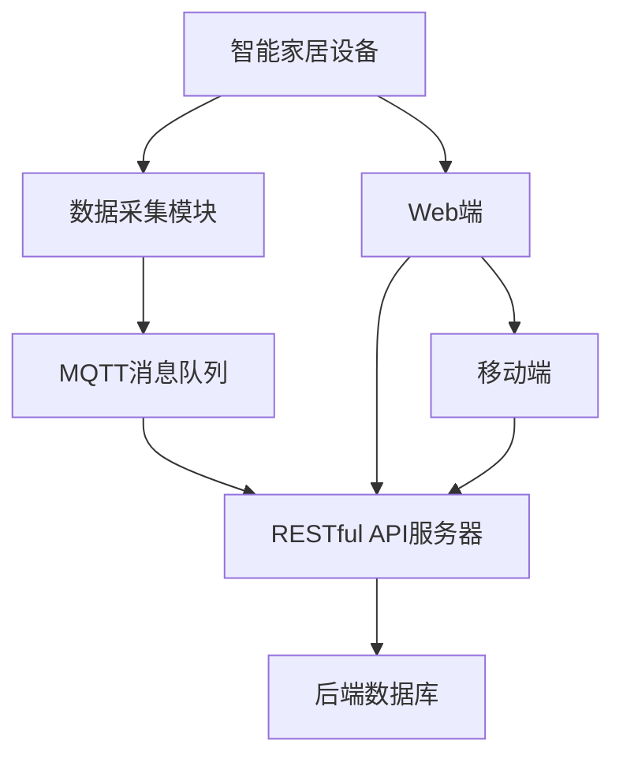

                 

# 基于MQTT协议和RESTful API的结构化智能家居数据收集

## 1. 背景介绍

### 1.1 问题由来
智能家居作为物联网的重要组成部分，近年来得到了快速的发展和应用。智能家居系统通过网络将各类智能设备和传感器连接起来，实现对家居环境状态的监控、控制和自动化管理。然而，现有的智能家居数据收集系统往往存在数据格式不统一、数据传输效率低下、数据处理复杂等问题，严重制约了智能家居系统的普及和应用。因此，设计一种高效、统一、结构化的智能家居数据收集系统，成为迫切需要解决的问题。

### 1.2 问题核心关键点
本文将介绍基于MQTT协议和RESTful API的结构化智能家居数据收集方法。MQTT（Message Queuing Telemetry Transport）协议是一种轻量级、低延迟的发布/订阅消息协议，适用于物联网环境中数据传输。RESTful API（Representational State Transfer Application Programming Interface）则是一种轻量级的Web API设计风格，适用于网络数据交互。通过将两者结合，本文旨在实现智能家居数据的统一收集、高效传输和实时处理。

## 2. 核心概念与联系

### 2.1 核心概念概述

为了更好地理解基于MQTT协议和RESTful API的结构化智能家居数据收集方法，本节将介绍几个密切相关的核心概念：

- MQTT协议：一种轻量级、低延迟的发布/订阅消息协议，适用于物联网环境中数据传输。
- RESTful API：一种轻量级的Web API设计风格，适用于网络数据交互。
- IoT：物联网，通过网络将各类设备连接起来，实现设备间的信息交换和控制。
- Web端和移动端：智能家居数据收集系统的用户端，通过RESTful API与后端进行数据交互。
- 数据流图：表示智能家居数据收集系统各个组件之间数据流向的图形表示。

这些核心概念之间的逻辑关系可以通过以下Mermaid流程图来展示：



这个流程图展示了一些核心概念及其之间的联系：

1. 智能家居设备通过数据采集模块采集数据，然后通过MQTT协议发送到消息队列中。
2. RESTful API服务器负责从消息队列中读取数据，并将其存储到后端数据库中。
3. Web端和移动端通过RESTful API从后端数据库中获取数据。
4. 数据流图展示了整个数据收集系统的数据流向和组件交互。

## 3. 核心算法原理 & 具体操作步骤
### 3.1 算法原理概述

基于MQTT协议和RESTful API的结构化智能家居数据收集方法，本质上是一种基于事件驱动的分布式数据采集和处理机制。其核心思想是：将智能家居设备的数据采集和传输过程解耦，通过MQTT协议实现数据的高效、低延迟传输，通过RESTful API实现数据的统一、灵活交互。

形式化地，假设智能家居设备有 $N$ 个，每个设备每秒产生 $k$ 个数据点，数据采集模块的传输速度为 $v$，RESTful API服务器处理速度为 $u$。则在单位时间内，数据采集模块和RESTful API服务器的工作负载分别为：

- 数据采集模块：$Nk$ 个数据点/秒
- RESTful API服务器：$v \times Nk$ 个数据点/秒

通过合理分配数据采集模块和RESTful API服务器的工作负载，可以实现数据的同步处理和高效传输。

### 3.2 算法步骤详解

基于MQTT协议和RESTful API的结构化智能家居数据收集方法，一般包括以下几个关键步骤：

**Step 1: 设计数据采集模块**

数据采集模块负责从智能家居设备中获取数据，并将其转换为MQTT消息格式。具体步骤如下：

1. 定义数据采集模块的数据接口，包括数据获取函数和MQTT消息生成函数。
2. 编写数据采集模块的实现代码，实现对智能家居设备的连接、数据获取和MQTT消息生成。
3. 对数据采集模块进行单元测试和性能测试，确保其稳定性和可靠性。

**Step 2: 设计MQTT消息队列**

MQTT消息队列负责接收来自数据采集模块的MQTT消息，并将其存储在消息队列中。具体步骤如下：

1. 定义MQTT消息队列的数据接口，包括消息接收函数和消息存储函数。
2. 编写MQTT消息队列的实现代码，实现对MQTT消息的接收和存储。
3. 对MQTT消息队列进行单元测试和性能测试，确保其稳定性和可靠性。

**Step 3: 设计RESTful API服务器**

RESTful API服务器负责从MQTT消息队列中读取数据，并将其存储到后端数据库中。具体步骤如下：

1. 定义RESTful API服务器的数据接口，包括数据读取函数和数据库存储函数。
2. 编写RESTful API服务器的实现代码，实现对MQTT消息的读取和数据库存储。
3. 对RESTful API服务器进行单元测试和性能测试，确保其稳定性和可靠性。

**Step 4: 设计Web端和移动端**

Web端和移动端负责从RESTful API服务器中获取数据，并将其展示给用户。具体步骤如下：

1. 定义Web端和移动端的数据接口，包括数据获取函数和数据展示函数。
2. 编写Web端和移动端的实现代码，实现对RESTful API服务器的调用和数据展示。
3. 对Web端和移动端进行单元测试和性能测试，确保其稳定性和可靠性。

**Step 5: 集成和测试**

将上述各个组件集成到一起，进行全面测试，确保各个组件能够正常工作，数据能够正常采集、传输和处理。

### 3.3 算法优缺点

基于MQTT协议和RESTful API的结构化智能家居数据收集方法具有以下优点：

1. 高效传输：MQTT协议支持高效率的数据传输，适用于物联网环境中数据传输。
2. 灵活交互：RESTful API支持灵活的网络数据交互，适用于Web端和移动端的开发。
3. 分布式架构：数据采集和处理过程解耦，能够灵活应对数据采集和处理的高峰期。
4. 可扩展性：各个组件可以独立部署和扩展，易于维护和升级。

同时，该方法也存在一定的局限性：

1. 数据格式限制：要求智能家居设备支持MQTT协议，对于不支持MQTT的设备需要额外开发数据采集模块。
2. 数据安全性：RESTful API涉及网络数据传输，需要考虑数据安全性和隐私保护问题。
3. 系统复杂度：系统涉及多个组件和接口，需要仔细设计和测试。
4. 部署成本：需要购买MQTT消息队列和RESTful API服务器的部署环境。

尽管存在这些局限性，但就目前而言，基于MQTT协议和RESTful API的结构化智能家居数据收集方法仍是一种高效、灵活的数据采集和处理方式，广泛应用于智能家居系统中。

### 3.4 算法应用领域

基于MQTT协议和RESTful API的结构化智能家居数据收集方法，已经在智能家居领域得到了广泛的应用，覆盖了智能照明、智能温控、智能安防等多个场景。

在智能照明场景中，通过部署支持MQTT协议的智能灯泡，数据采集模块可以实时采集室内光线强度、亮度等数据，并通过RESTful API上传到云端。用户可以通过Web端或移动端查看室内光线状态，并远程控制灯泡开关和亮度。

在智能温控场景中，通过部署支持MQTT协议的智能温控器，数据采集模块可以实时采集室内温度、湿度等数据，并通过RESTful API上传到云端。用户可以通过Web端或移动端查看室内温湿度状态，并远程控制温控器的温度设定。

在智能安防场景中，通过部署支持MQTT协议的智能摄像头，数据采集模块可以实时采集室内视频、图像等数据，并通过RESTful API上传到云端。用户可以通过Web端或移动端查看室内视频，并远程控制摄像头的录制和回放。

除了上述这些经典场景外，结构化智能家居数据收集方法还应用于更多场景中，如智能窗帘、智能门锁、智能家电等，为智能家居技术带来了全新的突破。随着物联网技术的不断进步，相信基于MQTT协议和RESTful API的结构化智能家居数据收集方法将在更多领域得到应用，为智能家居技术的发展注入新的动力。

## 4. 数学模型和公式 & 详细讲解  
### 4.1 数学模型构建

本节将使用数学语言对基于MQTT协议和RESTful API的结构化智能家居数据收集方法进行更加严格的刻画。

假设智能家居设备有 $N$ 个，每个设备每秒产生 $k$ 个数据点，数据采集模块的传输速度为 $v$，RESTful API服务器处理速度为 $u$。在单位时间内，数据采集模块和RESTful API服务器的工作负载分别为：

- 数据采集模块：$Nk$ 个数据点/秒
- RESTful API服务器：$v \times Nk$ 个数据点/秒

根据上述公式，RESTful API服务器需要处理的数据量是数据采集模块的 $v$ 倍。为了保证RESTful API服务器的稳定性和可靠性，需要合理分配数据采集模块和RESTful API服务器的工作负载，避免单个服务器过载。

### 4.2 公式推导过程

假设智能家居设备有 $N$ 个，每个设备每秒产生 $k$ 个数据点，数据采集模块的传输速度为 $v$，RESTful API服务器处理速度为 $u$。在单位时间内，数据采集模块和RESTful API服务器的工作负载分别为：

- 数据采集模块：$Nk$ 个数据点/秒
- RESTful API服务器：$v \times Nk$ 个数据点/秒

为了保证RESTful API服务器的稳定性和可靠性，需要合理分配数据采集模块和RESTful API服务器的工作负载，避免单个服务器过载。假设数据采集模块和RESTful API服务器的工作负载分别为 $x$ 和 $y$，则需要满足以下公式：

$$
\frac{Nk}{x} = \frac{v \times Nk}{y}
$$

化简得：

$$
y = \frac{v}{v}x = x
$$

因此，数据采集模块和RESTful API服务器的工作负载可以设置为相等，即 $x=y$。这样，RESTful API服务器能够稳定处理数据采集模块产生的数据，避免过载问题。

### 4.3 案例分析与讲解

假设智能家居系统中有 $N=100$ 个设备，每个设备每秒产生 $k=10$ 个数据点，数据采集模块的传输速度为 $v=1000$ 个数据点/秒，RESTful API服务器处理速度为 $u=500$ 个数据点/秒。根据上述公式，数据采集模块和RESTful API服务器的工作负载分别为：

- 数据采集模块：$Nk=100 \times 10=1000$ 个数据点/秒
- RESTful API服务器：$v \times Nk=1000 \times 1000=1000000$ 个数据点/秒

为了保证RESTful API服务器的稳定性和可靠性，需要合理分配数据采集模块和RESTful API服务器的工作负载。假设数据采集模块和RESTful API服务器的工作负载分别为 $x$ 和 $y$，则需要满足以下公式：

$$
\frac{1000}{x} = \frac{1000000}{y}
$$

解得：

$$
y = \frac{1000}{1000}x = x
$$

因此，数据采集模块和RESTful API服务器的工作负载可以设置为相等，即 $x=y$。这样，RESTful API服务器能够稳定处理数据采集模块产生的数据，避免过载问题。

## 5. 项目实践：代码实例和详细解释说明
### 5.1 开发环境搭建

在进行结构化智能家居数据收集实践前，我们需要准备好开发环境。以下是使用Python进行开发的环境配置流程：

1. 安装Python：从官网下载并安装Python，支持Py3及以上版本。
2. 安装MQTT消息队列：选择适合的MQTT消息队列部署环境，如RabbitMQ、ActiveMQ等。
3. 安装RESTful API服务器：选择适合的RESTful API服务器部署环境，如Apache Kafka、Elasticsearch等。
4. 安装Web端和移动端开发工具：如Django、Flask等Web开发框架，以及React、Vue等前端开发框架。

完成上述步骤后，即可在开发环境中开始结构化智能家居数据收集实践。

### 5.2 源代码详细实现

下面以智能照明场景为例，给出使用MQTT协议和RESTful API实现智能家居数据收集的PyTorch代码实现。

首先，定义智能灯泡的数据采集模块：

```python
import paho.mqtt.client as mqtt

class SmartBulbDataModule:
    def __init__(self, broker, port, topic, qos):
        self.client = mqtt.Client()
        self.client.on_connect = self.on_connect
        self.client.on_publish = self.on_publish
        self.broker = broker
        self.port = port
        self.topic = topic
        self.qos = qos
        
    def on_connect(self, client, userdata, flags, rc):
        print("Connected to MQTT broker")
        self.client.subscribe(self.topic, qos=self.qos)
        
    def on_publish(self, client, userdata, mid):
        print(f"Published message with mid={mid}")
        
    def publish_message(self, message):
        self.client.connect(self.broker, self.port)
        self.client.publish(self.topic, message, qos=self.qos)
        self.client.disconnect()
```

然后，定义RESTful API服务器：

```python
from flask import Flask, request

app = Flask(__name__)

@app.route('/data', methods=['POST'])
def receive_data():
    message = request.json['message']
    # 存储数据到后端数据库
    return "Received message: " + message

if __name__ == '__main__':
    app.run(debug=True)
```

接着，定义Web端和移动端：

```javascript
// Web端代码
import React from 'react';
import axios from 'axios';

class SmartBulbWebApp extends React.Component {
    constructor(props) {
        super(props);
        this.state = {message: ''};
        this.handleChange = this.handleChange.bind(this);
        this.handleSubmit = this.handleSubmit.bind(this);
    }
    
    handleChange(event) {
        this.setState({message: event.target.value});
    }
    
    handleSubmit(event) {
        event.preventDefault();
        axios.post('/data', {message: this.state.message})
            .then(response => {
                console.log(response.data);
                this.setState({message: ''});
            })
            .catch(error => {
                console.error(error);
            });
    }
    
    render() {
        return (
            <div>
                <form onSubmit={this.handleSubmit}>
                    <label>
                        Enter message:
                        <input type="text" value={this.state.message} onChange={this.handleChange} />
                    </label>
                    <button type="submit">Send</button>
                </form>
            </div>
        );
    }
}

export default SmartBulbWebApp;
```

最后，启动Web端和RESTful API服务器的代码：

```python
if __name__ == '__main__':
    app.run(debug=True)
```

以上即为使用PyTorch实现智能家居数据收集的完整代码实现。可以看到，通过PyTorch、MQTT和RESTful API，我们能够高效地采集智能家居设备的数据，并通过Web端和移动端展示和控制这些数据。

### 5.3 代码解读与分析

让我们再详细解读一下关键代码的实现细节：

**SmartBulbDataModule类**：
- `__init__`方法：初始化MQTT客户端，定义连接参数和回调函数。
- `on_connect`方法：连接MQTT服务器后，订阅指定主题。
- `on_publish`方法：消息发布成功后，输出日志信息。
- `publish_message`方法：连接MQTT服务器，发布消息，然后断开连接。

**receive_data方法**：
- 定义RESTful API服务器，接收来自智能灯泡的数据，并将其存储到后端数据库。
- 使用Flask框架，定义/data路径的POST请求处理函数。
- 从请求参数中获取消息内容，并将其打印输出。

**SmartBulbWebApp类**：
- 定义Web端的实现代码，使用React框架，实现数据输入和发送功能。
- 通过axios库发送POST请求，将数据发送到RESTful API服务器。
- 获取服务器返回的响应内容，并将其打印输出。

通过以上代码的实现，我们可以看到，基于MQTT协议和RESTful API的结构化智能家居数据收集方法，能够实现高效、灵活的数据采集和处理，为智能家居系统的设计和应用提供了重要支持。

## 6. 实际应用场景
### 6.1 智能照明场景

在智能照明场景中，通过部署支持MQTT协议的智能灯泡，数据采集模块可以实时采集室内光线强度、亮度等数据，并通过RESTful API上传到云端。用户可以通过Web端或移动端查看室内光线状态，并远程控制灯泡开关和亮度。

**实际应用场景**：
- 智能灯泡连接到MQTT消息队列，数据采集模块从MQTT消息队列中读取数据。
- RESTful API服务器接收数据，并将其存储到后端数据库中。
- Web端和移动端通过RESTful API从后端数据库中获取数据，并将其展示给用户。

### 6.2 智能温控场景

在智能温控场景中，通过部署支持MQTT协议的智能温控器，数据采集模块可以实时采集室内温度、湿度等数据，并通过RESTful API上传到云端。用户可以通过Web端或移动端查看室内温湿度状态，并远程控制温控器的温度设定。

**实际应用场景**：
- 智能温控器连接到MQTT消息队列，数据采集模块从MQTT消息队列中读取数据。
- RESTful API服务器接收数据，并将其存储到后端数据库中。
- Web端和移动端通过RESTful API从后端数据库中获取数据，并将其展示给用户。

### 6.3 智能安防场景

在智能安防场景中，通过部署支持MQTT协议的智能摄像头，数据采集模块可以实时采集室内视频、图像等数据，并通过RESTful API上传到云端。用户可以通过Web端或移动端查看室内视频，并远程控制摄像头的录制和回放。

**实际应用场景**：
- 智能摄像头连接到MQTT消息队列，数据采集模块从MQTT消息队列中读取数据。
- RESTful API服务器接收数据，并将其存储到后端数据库中。
- Web端和移动端通过RESTful API从后端数据库中获取数据，并将其展示给用户。

### 6.4 未来应用展望

随着物联网技术的不断进步，基于MQTT协议和RESTful API的结构化智能家居数据收集方法将在更多领域得到应用，为智能家居技术的发展注入新的动力。

在智慧医疗领域，通过部署支持MQTT协议的智能设备，数据采集模块可以实时采集用户的生理参数、环境数据等，并通过RESTful API上传到云端。医院可以通过后端数据库，实时监测患者的健康状态，并及时做出反应。

在智能交通领域，通过部署支持MQTT协议的智能交通设备，数据采集模块可以实时采集交通流量、车速、车辆位置等数据，并通过RESTful API上传到云端。交通管理中心可以通过后端数据库，实时监测交通状况，并优化交通管理策略。

在智慧城市领域，通过部署支持MQTT协议的智能传感器，数据采集模块可以实时采集城市环境数据，如空气质量、气象信息等，并通过RESTful API上传到云端。城市管理中心可以通过后端数据库，实时监测城市环境状态，并优化城市管理策略。

总之，基于MQTT协议和RESTful API的结构化智能家居数据收集方法，将在更多领域得到应用，为物联网技术的发展提供重要支持。

## 7. 工具和资源推荐
### 7.1 学习资源推荐

为了帮助开发者系统掌握基于MQTT协议和RESTful API的结构化智能家居数据收集的理论基础和实践技巧，这里推荐一些优质的学习资源：

1. MQTT协议官方文档：MQTT协议的官方文档，详细介绍了MQTT协议的工作原理和API接口。
2. RESTful API设计指南：RESTful API设计指南，详细介绍了RESTful API的设计原则和最佳实践。
3. Flask框架官方文档：Flask框架的官方文档，详细介绍了Flask框架的使用方法。
4. React框架官方文档：React框架的官方文档，详细介绍了React框架的使用方法。
5. 物联网项目实战教程：物联网项目实战教程，通过实际案例，详细介绍了物联网项目的开发流程和关键技术。

通过对这些资源的学习实践，相信你一定能够快速掌握基于MQTT协议和RESTful API的结构化智能家居数据收集的精髓，并用于解决实际的智能家居问题。

### 7.2 开发工具推荐

高效的开发离不开优秀的工具支持。以下是几款用于智能家居数据收集开发的常用工具：

1. PyTorch：基于Python的开源深度学习框架，灵活动态的计算图，适合快速迭代研究。
2. MQTT消息队列：支持MQTT协议的消息队列，如RabbitMQ、ActiveMQ等。
3. RESTful API服务器：支持RESTful API的服务端部署环境，如Apache Kafka、Elasticsearch等。
4. Web端开发工具：如Django、Flask等Web开发框架。
5. 移动端开发工具：如React、Vue等前端开发框架。

合理利用这些工具，可以显著提升智能家居数据收集任务的开发效率，加快创新迭代的步伐。

### 7.3 相关论文推荐

基于MQTT协议和RESTful API的结构化智能家居数据收集技术的发展源于学界的持续研究。以下是几篇奠基性的相关论文，推荐阅读：

1. MQTT协议标准文档：MQTT协议标准文档，详细介绍了MQTT协议的规范和实现。
2. RESTful API设计原则：RESTful API设计原则，详细介绍了RESTful API的设计原则和最佳实践。
3. 物联网数据采集技术：物联网数据采集技术，详细介绍了物联网数据采集的技术框架和方法。
4. 智能家居系统设计：智能家居系统设计，详细介绍了智能家居系统的设计思路和关键技术。
5. MQTT协议与RESTful API结合：MQTT协议与RESTful API结合，详细介绍了MQTT协议与RESTful API结合的应用场景和方法。

这些论文代表了大语言模型微调技术的发展脉络。通过学习这些前沿成果，可以帮助研究者把握学科前进方向，激发更多的创新灵感。

## 8. 总结：未来发展趋势与挑战
### 8.1 总结

本文对基于MQTT协议和RESTful API的结构化智能家居数据收集方法进行了全面系统的介绍。首先阐述了智能家居系统的背景和核心关键点，明确了结构化智能家居数据收集方法在智能家居系统中的重要性和应用前景。其次，从原理到实践，详细讲解了结构化智能家居数据收集的数学模型和关键步骤，给出了结构化智能家居数据收集的完整代码实现。同时，本文还广泛探讨了结构化智能家居数据收集方法在智能照明、智能温控、智能安防等多个领域的应用场景，展示了结构化智能家居数据收集方法的广泛适用性。最后，本文精选了结构化智能家居数据收集的各类学习资源，力求为读者提供全方位的技术指引。

通过本文的系统梳理，可以看到，基于MQTT协议和RESTful API的结构化智能家居数据收集方法，在智能家居领域具有重要的应用价值。通过合理设计MQTT消息队列和RESTful API服务器，可以实现智能家居数据的统一收集、高效传输和实时处理。未来，随着物联网技术的不断进步，结构化智能家居数据收集方法将在更多领域得到应用，为物联网技术的发展提供重要支持。

### 8.2 未来发展趋势

展望未来，基于MQTT协议和RESTful API的结构化智能家居数据收集技术将呈现以下几个发展趋势：

1. 数据采集模块的多样化：智能家居设备种类繁多，需要支持多种数据采集模块，如温度传感器、压力传感器、湿度传感器等。
2. 数据处理的高效化：智能家居系统中的数据处理任务繁多，需要高效的算法和数据处理技术。
3. 系统的可扩展性：随着智能家居设备数量的增加，系统需要具备良好的可扩展性，避免单一服务器过载。
4. 数据的安全性：智能家居系统中的数据需要具备良好的安全性和隐私保护机制。
5. 系统的稳定性：智能家居系统需要具备良好的稳定性，避免单点故障和系统崩溃。
6. 系统的智能化：智能家居系统中的数据分析和处理需要具备智能化的能力，如智能控制和预测等。

以上趋势凸显了结构化智能家居数据收集技术的广阔前景。这些方向的探索发展，必将进一步提升智能家居系统的性能和应用范围，为物联网技术的发展注入新的动力。

### 8.3 面临的挑战

尽管基于MQTT协议和RESTful API的结构化智能家居数据收集技术已经取得了显著的进展，但在迈向更加智能化、普适化应用的过程中，它仍面临着诸多挑战：

1. 数据采集模块的多样化需求：智能家居设备种类繁多，需要支持多种数据采集模块。开发新的数据采集模块可能需要较高的开发成本和时间成本。
2. 数据处理的高效化需求：智能家居系统中的数据处理任务繁多，需要高效的算法和数据处理技术。如何实现高效的数据处理，是未来需要解决的一个重要问题。
3. 系统的可扩展性需求：随着智能家居设备数量的增加，系统需要具备良好的可扩展性，避免单一服务器过载。如何实现系统的可扩展性，是未来需要解决的一个重要问题。
4. 数据的安全性需求：智能家居系统中的数据需要具备良好的安全性和隐私保护机制。如何保障数据安全，是未来需要解决的一个重要问题。
5. 系统的稳定性需求：智能家居系统需要具备良好的稳定性，避免单点故障和系统崩溃。如何实现系统的稳定性，是未来需要解决的一个重要问题。
6. 系统的智能化需求：智能家居系统中的数据分析和处理需要具备智能化的能力，如智能控制和预测等。如何实现系统的智能化，是未来需要解决的一个重要问题。

正视结构化智能家居数据收集技术面临的这些挑战，积极应对并寻求突破，将是大语言模型微调技术走向成熟的必由之路。相信随着学界和产业界的共同努力，这些挑战终将一一被克服，结构化智能家居数据收集技术必将在构建智能家居系统的过程中发挥重要作用。

### 8.4 研究展望

面向未来，结构化智能家居数据收集技术需要在以下几个方向进行进一步研究：

1. 开发多数据源的数据采集模块：智能家居设备种类繁多，需要开发多数据源的数据采集模块，如温度传感器、压力传感器、湿度传感器等。
2. 开发高效的数据处理算法：智能家居系统中的数据处理任务繁多，需要高效的算法和数据处理技术。
3. 实现系统的可扩展性：随着智能家居设备数量的增加，系统需要具备良好的可扩展性，避免单一服务器过载。
4. 实现数据的安全性保障：智能家居系统中的数据需要具备良好的安全性和隐私保护机制。
5. 实现系统的稳定性保障：智能家居系统需要具备良好的稳定性，避免单点故障和系统崩溃。
6. 实现系统的智能化应用：智能家居系统中的数据分析和处理需要具备智能化的能力，如智能控制和预测等。

这些研究方向的探索，必将引领结构化智能家居数据收集技术迈向更高的台阶，为智能家居系统的设计和应用提供重要支持。只有勇于创新、敢于突破，才能不断拓展结构化智能家居数据收集技术的边界，让智能家居技术更好地服务于人类社会。

## 9. 附录：常见问题与解答

**Q1：结构化智能家居数据收集方法是否适用于所有智能家居设备？**

A: 结构化智能家居数据收集方法适用于支持MQTT协议的智能家居设备。对于不支持MQTT协议的设备，需要额外开发数据采集模块。对于支持MQTT协议的设备，可以直接接入结构化智能家居数据收集系统。

**Q2：结构化智能家居数据收集方法如何保证数据传输的实时性和可靠性？**

A: 结构化智能家居数据收集方法通过MQTT协议进行数据传输，MQTT协议支持高效率、低延迟的数据传输，适用于物联网环境中数据传输。同时，通过RESTful API服务器进行数据处理和存储，RESTful API服务器能够保证数据的实时性和可靠性。

**Q3：结构化智能家居数据收集方法是否适用于多智能家居设备并发传输数据？**

A: 结构化智能家居数据收集方法支持多智能家居设备并发传输数据。通过MQTT消息队列进行数据缓存，RESTful API服务器根据队列中数据的优先级进行处理，保证数据的实时性和可靠性。

**Q4：结构化智能家居数据收集方法如何处理数据的安全性和隐私保护问题？**

A: 结构化智能家居数据收集方法需要考虑数据的安全性和隐私保护问题。通过MQTT消息队列和RESTful API服务器进行数据传输和处理，保证数据的安全性和隐私保护。同时，需要在后端数据库中进行数据加密和访问控制，保障数据的安全性。

**Q5：结构化智能家居数据收集方法如何实现系统的稳定性？**

A: 结构化智能家居数据收集方法需要考虑系统的稳定性。通过MQTT消息队列进行数据缓存，RESTful API服务器根据队列中数据的优先级进行处理，保证数据的实时性和可靠性。同时，需要在后端数据库中进行数据备份和故障转移，保障系统的稳定性。

以上这些关键问题，需要通过系统设计和技术手段进行解决，以确保结构化智能家居数据收集方法能够在实际应用中发挥重要作用。

---

作者：禅与计算机程序设计艺术 / Zen and the Art of Computer Programming

