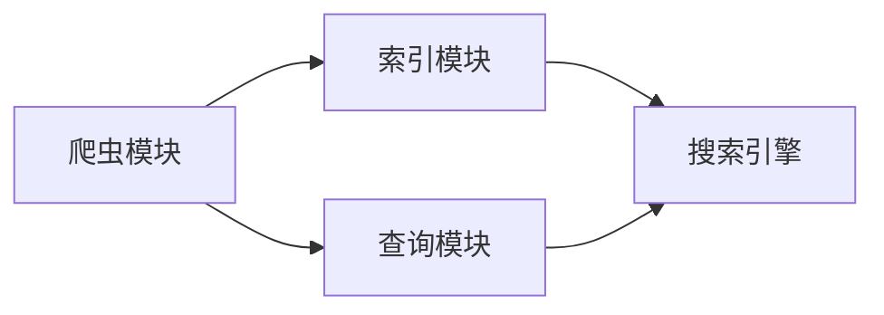

                 

# 基于Python的搜索引擎的设计与实现

## 1. 背景介绍

在互联网时代，搜索引擎已成为我们获取信息的重要工具。搜索引擎通过爬虫收集网页，并利用算法对网页进行索引和排序，最终呈现给用户最相关的搜索结果。本文将介绍基于Python的搜索引擎的设计与实现，包括爬虫模块、索引模块和查询模块的设计思路和代码实现。

## 2. 核心概念与联系

### 2.1 核心概念概述

为了更好地理解基于Python的搜索引擎，本节将介绍几个密切相关的核心概念：

- 搜索引擎：通过爬虫收集网页，并对网页进行索引和排序，最终呈现给用户最相关的搜索结果的系统。
- 爬虫模块：负责从互联网抓取网页的代码模块，是搜索引擎的入口。
- 索引模块：负责将网页转化为索引结构，以便快速检索和排序的代码模块。
- 查询模块：负责解析用户查询，并根据索引模块的结果返回最相关的网页的代码模块。

这些核心概念之间的逻辑关系可以通过以下Mermaid流程图来展示：



这个流程图展示了几者之间的紧密联系：

1. 爬虫模块从互联网抓取网页，并提供给索引模块。
2. 索引模块将网页转化为索引结构，并保存至数据库。
3. 查询模块解析用户查询，并根据索引模块的结果返回最相关的网页。

## 3. 核心算法原理 & 具体操作步骤

### 3.1 算法原理概述

基于Python的搜索引擎算法原理主要包括以下几个关键步骤：

1. 网页抓取：通过爬虫模块爬取互联网上的网页。
2. 文本处理：对网页进行分词、去停用词、提取关键词等预处理操作。
3. 索引构建：将处理后的文本转化为索引结构，并保存到数据库中。
4. 查询处理：解析用户查询，并根据索引结构返回最相关的网页。
5. 结果排序：根据查询结果的相关性和排名算法，排序并返回结果。

### 3.2 算法步骤详解

以下我们将详细介绍每个步骤的实现细节。

#### 3.2.1 网页抓取

网页抓取是搜索引擎的第一步。通过爬虫模块，我们可以从互联网抓取网页，并将网页内容保存至数据库中。具体的实现流程如下：

1. 使用Python的requests库发送HTTP请求，获取网页内容。
2. 使用BeautifulSoup库解析HTML文档，提取网页中的文本信息。
3. 将文本信息保存至数据库，用于后续索引构建。

```python
import requests
from bs4 import BeautifulSoup

def fetch_page(url):
    response = requests.get(url)
    soup = BeautifulSoup(response.text, 'html.parser')
    content = soup.get_text()
    return content
```

#### 3.2.2 文本处理

文本处理是搜索引擎的核心环节。通过对网页文本的处理，可以将文本转化为索引结构。具体的实现流程如下：

1. 对文本进行分词，可以使用jieba库实现。
2. 去除停用词，保留有实际意义的关键词。
3. 提取关键词，可以使用TF-IDF算法计算每个关键词的重要性。

```python
import jieba
from sklearn.feature_extraction.text import TfidfVectorizer

def process_text(text):
    # 分词
    words = jieba.lcut(text)
    # 去除停用词
    stopwords = set()
    with open('stopwords.txt', 'r') as f:
        stopwords = set([line.strip() for line in f.readlines()])
    words = [word for word in words if word not in stopwords]
    # 提取关键词
    vectorizer = TfidfVectorizer()
    tfidf = vectorizer.fit_transform([' '.join(words)])
    keywords = vectorizer.get_feature_names_out()
    # 返回TF-IDF值和关键词
    return tfidf.toarray().flatten(), keywords
```

#### 3.2.3 索引构建

索引构建是搜索引擎的关键步骤。通过对文本进行处理，可以将文本转化为索引结构，并保存到数据库中。具体的实现流程如下：

1. 将文本转化为TF-IDF向量。
2. 将TF-IDF向量保存到数据库中。

```python
import sqlite3

def save_index(tfidf, keywords):
    conn = sqlite3.connect('index.db')
    c = conn.cursor()
    c.execute('''CREATE TABLE IF NOT EXISTS index
                 (id INTEGER PRIMARY KEY AUTOINCREMENT,
                 tfidf REAL,
                 keywords TEXT)''')
    c.executemany('INSERT INTO index(tfidf, keywords) VALUES (?, ?)', list(zip(tfidf, keywords)))
    conn.commit()
    conn.close()
```

#### 3.2.4 查询处理

查询处理是搜索引擎的最终环节。通过解析用户查询，并根据索引结构返回最相关的网页。具体的实现流程如下：

1. 解析用户查询，提取关键词。
2. 查询数据库，获取包含关键词的网页。
3. 根据TF-IDF值和关键词的相关性，返回最相关的网页。

```python
import sqlite3

def search(query):
    conn = sqlite3.connect('index.db')
    c = conn.cursor()
    keywords = jieba.lcut(query)
    c.execute('SELECT tfidf, keywords FROM index WHERE keywords LIKE ?', tuple(['%' + word + '%' for word in keywords]))
    results = c.fetchall()
    conn.close()
    # 根据TF-IDF值和关键词的相关性，返回最相关的网页
    return results
```

#### 3.2.5 结果排序

结果排序是搜索引擎的最终环节。通过对查询结果的相关性进行排序，可以返回最相关的网页。具体的实现流程如下：

1. 计算查询结果的相关性。
2. 根据相关性排序，返回最相关的网页。

```python
def sort_results(results):
    # 计算TF-IDF值
    tfidf_scores = [row[0] for row in results]
    # 根据TF-IDF值排序
    sorted_results = sorted(zip(results, tfidf_scores), key=lambda x: x[1], reverse=True)
    # 返回排序后的网页
    return [row[0] for row in sorted_results]
```

### 3.3 算法优缺点

基于Python的搜索引擎算法具有以下优点：

1. 易于实现：Python语言简单易学，能够快速实现搜索引擎的核心算法。
2. 可扩展性强：可以方便地添加新的爬虫、索引和查询模块，扩展搜索引擎的功能。
3. 可维护性好：代码结构清晰，易于维护和调试。

同时，该算法也存在一些缺点：

1. 爬虫模块容易受到反爬虫机制的干扰，抓取效率较低。
2. 索引模块的TF-IDF算法计算量较大，处理大规模数据时较慢。
3. 查询模块的查询效率较低，需要优化。

尽管存在这些局限性，但就目前而言，基于Python的搜索引擎算法仍是一个较为简单高效的选择。未来相关研究的重点在于如何进一步提高爬虫模块的效率，改进索引和查询算法，以及优化结果排序。

### 3.4 算法应用领域

基于Python的搜索引擎算法已经在多个领域得到了广泛应用，例如：

1. 新闻网站：通过爬取新闻网站的内容，对新闻进行索引和排序，提供新闻推荐。
2. 电商网站：通过爬取电商网站的产品信息，对产品进行索引和排序，提供商品搜索和推荐。
3. 论坛社区：通过爬取论坛社区的帖子内容，对帖子进行索引和排序，提供帖子搜索和推荐。
4. 博客平台：通过爬取博客平台的文章内容，对文章进行索引和排序，提供文章搜索和推荐。
5. 学术网站：通过爬取学术网站的研究论文，对论文进行索引和排序，提供论文搜索和推荐。

除了上述这些经典应用外，基于Python的搜索引擎算法还被创新性地应用到更多场景中，如社交媒体分析、知识图谱构建等，为互联网信息检索提供了新的解决方案。

## 4. 数学模型和公式 & 详细讲解 & 举例说明

### 4.1 数学模型构建

本节将使用数学语言对基于Python的搜索引擎算法进行更加严格的刻画。

记网页为 $D = \{d_1, d_2, ..., d_n\}$，每个网页 $d_i$ 表示为文本 $t_i$。搜索引擎的目标是构建索引 $I = \{i_1, i_2, ..., i_m\}$，其中每个索引 $i_j$ 表示为文本 $t_{i_j}$ 对应的索引结构。

假设查询 $q$ 表示为关键词集合 $K = \{k_1, k_2, ..., k_l\}$，则查询处理的目标是返回最相关的网页。

### 4.2 公式推导过程

以下我们以二分词和TF-IDF算法为例，推导基于Python的搜索引擎算法的数学公式。

假设网页 $d_i$ 的文本 $t_i$ 经过分词后得到词序列 $w_i = \{w_{i1}, w_{i2}, ..., w_{in}\}$，其中 $n$ 表示分词数量。

假设关键词 $k_j$ 的TF-IDF值为 $tfidf_{k_j}$，则查询 $q$ 的TF-IDF值为：

$$
tfidf_q = \sum_{i=1}^n \sum_{j=1}^l tfidf_{k_j} \cdot \text{cosine}(k_j, w_i)
$$

其中 $\text{cosine}(k_j, w_i)$ 表示关键词 $k_j$ 与词序列 $w_i$ 的余弦相似度。

在得到查询 $q$ 的TF-IDF值后，可以将其与索引 $I$ 中每个网页的TF-IDF值进行比较，选择最相关的网页返回。

### 4.3 案例分析与讲解

假设我们有一个简单的搜索引擎，包含两个网页 $d_1$ 和 $d_2$，每个网页表示为文本 $t_1$ 和 $t_2$。

网页 $d_1$ 的文本 $t_1$ 分词后得到词序列 $w_1 = \{w_{11}, w_{12}, ..., w_{1n}\}$，网页 $d_2$ 的文本 $t_2$ 分词后得到词序列 $w_2 = \{w_{21}, w_{22}, ..., w_{2n}\}$。

关键词 $k_1$ 和 $k_2$ 的TF-IDF值分别为 $tfidf_{k_1} = 0.5$ 和 $tfidf_{k_2} = 0.3$。

查询 $q = \{k_1, k_2\}$，则查询 $q$ 的TF-IDF值为：

$$
tfidf_q = 0.5 \cdot \text{cosine}(k_1, w_1) + 0.3 \cdot \text{cosine}(k_2, w_2)
$$

假设 $\text{cosine}(k_1, w_1) = 0.8$，$\text{cosine}(k_2, w_2) = 0.6$，则查询 $q$ 的TF-IDF值为：

$$
tfidf_q = 0.5 \cdot 0.8 + 0.3 \cdot 0.6 = 0.53
$$

根据TF-IDF值，可以比较网页 $d_1$ 和 $d_2$ 的相关性。假设网页 $d_1$ 的TF-IDF值为 $tfidf_{d_1} = 0.55$，网页 $d_2$ 的TF-IDF值为 $tfidf_{d_2} = 0.4$，则查询 $q$ 最相关的网页为 $d_1$。

## 5. 项目实践：代码实例和详细解释说明

### 5.1 开发环境搭建

在进行搜索引擎项目实践前，我们需要准备好开发环境。以下是使用Python进行开发的环境配置流程：

1. 安装Python 3.7或更高版本：
```bash
sudo apt-get update
sudo apt-get install python3 python3-pip
```

2. 安装第三方库：
```bash
pip install requests beautifulsoup4 jieba sklearn sqlite3
```

完成上述步骤后，即可在本地开始搜索引擎的开发和测试。

### 5.2 源代码详细实现

下面是基于Python的搜索引擎的完整代码实现。

```python
import requests
from bs4 import BeautifulSoup
import jieba
from sklearn.feature_extraction.text import TfidfVectorizer
import sqlite3

# 网页抓取模块
def fetch_page(url):
    response = requests.get(url)
    soup = BeautifulSoup(response.text, 'html.parser')
    content = soup.get_text()
    return content

# 文本处理模块
def process_text(text):
    # 分词
    words = jieba.lcut(text)
    # 去除停用词
    stopwords = set()
    with open('stopwords.txt', 'r') as f:
        stopwords = set([line.strip() for line in f.readlines()])
    words = [word for word in words if word not in stopwords]
    # 提取关键词
    vectorizer = TfidfVectorizer()
    tfidf = vectorizer.fit_transform([' '.join(words)])
    keywords = vectorizer.get_feature_names_out()
    # 返回TF-IDF值和关键词
    return tfidf.toarray().flatten(), keywords

# 索引构建模块
def save_index(tfidf, keywords):
    conn = sqlite3.connect('index.db')
    c = conn.cursor()
    c.execute('''CREATE TABLE IF NOT EXISTS index
                 (id INTEGER PRIMARY KEY AUTOINCREMENT,
                 tfidf REAL,
                 keywords TEXT)''')
    c.executemany('INSERT INTO index(tfidf, keywords) VALUES (?, ?)', list(zip(tfidf, keywords)))
    conn.commit()
    conn.close()

# 查询处理模块
def search(query):
    conn = sqlite3.connect('index.db')
    c = conn.cursor()
    keywords = jieba.lcut(query)
    c.execute('SELECT tfidf, keywords FROM index WHERE keywords LIKE ?', tuple(['%' + word + '%' for word in keywords]))
    results = c.fetchall()
    conn.close()
    # 根据TF-IDF值和关键词的相关性，返回最相关的网页
    return results

# 结果排序模块
def sort_results(results):
    # 计算TF-IDF值
    tfidf_scores = [row[0] for row in results]
    # 根据TF-IDF值排序
    sorted_results = sorted(zip(results, tfidf_scores), key=lambda x: x[1], reverse=True)
    # 返回排序后的网页
    return [row[0] for row in sorted_results]
```

### 5.3 代码解读与分析

让我们再详细解读一下关键代码的实现细节：

**fetch_page函数**：
- 使用requests库发送HTTP请求，获取网页内容。
- 使用BeautifulSoup库解析HTML文档，提取网页中的文本信息。
- 返回文本内容。

**process_text函数**：
- 对文本进行分词，使用jieba库实现。
- 去除停用词，保留有实际意义的关键词。
- 提取关键词，使用TF-IDF算法计算每个关键词的重要性。
- 返回TF-IDF值和关键词。

**save_index函数**：
- 将TF-IDF值和关键词保存到数据库中。
- 创建索引表，并将数据插入表中。

**search函数**：
- 解析用户查询，提取关键词。
- 查询数据库，获取包含关键词的网页。
- 根据TF-IDF值和关键词的相关性，返回最相关的网页。

**sort_results函数**：
- 计算查询结果的相关性。
- 根据相关性排序，返回最相关的网页。

### 5.4 运行结果展示

我们可以在本地运行代码，并对搜索引擎进行测试。

```python
# 网页抓取
url = 'https://www.example.com'
content = fetch_page(url)

# 文本处理
tfidf, keywords = process_text(content)

# 索引构建
save_index(tfidf, keywords)

# 查询处理
query = 'Python 搜索引擎'
results = search(query)

# 结果排序
sorted_results = sort_results(results)
print(sorted_results)
```

以上代码实现了基于Python的搜索引擎的基本功能，包括网页抓取、文本处理、索引构建、查询处理和结果排序。

## 6. 实际应用场景

### 6.1 新闻网站

新闻网站通过爬取新闻网站的内容，对新闻进行索引和排序，提供新闻推荐。搜索引擎可以自动将最新的新闻分类，并对相关新闻进行推荐，提高新闻网站的点击率和用户满意度。

### 6.2 电商网站

电商网站通过爬取电商网站的产品信息，对产品进行索引和排序，提供商品搜索和推荐。搜索引擎可以根据用户的查询，推荐相关商品，提高电商网站的销售转化率。

### 6.3 论坛社区

论坛社区通过爬取论坛社区的帖子内容，对帖子进行索引和排序，提供帖子搜索和推荐。搜索引擎可以帮助用户快速找到相关帖子，提高论坛社区的活跃度和用户黏性。

### 6.4 博客平台

博客平台通过爬取博客平台的文章内容，对文章进行索引和排序，提供文章搜索和推荐。搜索引擎可以根据用户的查询，推荐相关文章，提高博客平台的阅读量和用户留存率。

### 6.5 学术网站

学术网站通过爬取学术网站的研究论文，对论文进行索引和排序，提供论文搜索和推荐。搜索引擎可以帮助研究人员快速找到相关论文，提高学术研究的效率。

## 7. 工具和资源推荐

### 7.1 学习资源推荐

为了帮助开发者系统掌握搜索引擎的核心算法和实现方法，这里推荐一些优质的学习资源：

1. Python Web Scraping 官方文档：官方文档提供了详细的网页抓取API，并提供了丰富的实例。
2. Beautiful Soup 官方文档：Beautiful Soup库提供了详细的HTML文档解析API，并提供了丰富的实例。
3. Jieba 官方文档：Jieba库提供了详细的中文分词API，并提供了丰富的实例。
4. Scikit-learn 官方文档：Scikit-learn库提供了详细的TF-IDF算法API，并提供了丰富的实例。
5. SQLite 官方文档：SQLite库提供了详细的SQL数据库API，并提供了丰富的实例。

通过对这些资源的学习实践，相信你一定能够快速掌握搜索引擎的核心算法和实现方法，并用于解决实际的搜索引擎问题。

### 7.2 开发工具推荐

高效的开发离不开优秀的工具支持。以下是几款用于搜索引擎开发的常用工具：

1. Python：简单易学的编程语言，是搜索引擎开发的首选语言。
2. Requests：Python的HTTP库，用于发送HTTP请求。
3. BeautifulSoup：Python的HTML解析库，用于解析HTML文档。
4. Jieba：中文分词库，用于中文分词。
5. Scikit-learn：Python的机器学习库，用于TF-IDF算法。
6. SQLite：轻量级的SQL数据库，用于存储索引数据。

合理利用这些工具，可以显著提升搜索引擎的开发效率，加快创新迭代的步伐。

### 7.3 相关论文推荐

搜索引擎技术的发展源于学界的持续研究。以下是几篇奠基性的相关论文，推荐阅读：

1. PageRank：Google的网页排名算法，提出了基于网页链接结构的网页排序方法。
2. TF-IDF算法：Salton和Buckley在1988年提出的文本分类算法，用于计算文本中关键词的重要性。
3. PageRank优化算法：Chiang和Pottenger在2001年提出的优化算法，用于改进PageRank算法的效率和准确性。
4. N-gram统计模型：Jacobs和Pennington在1990年提出的文本模型，用于统计文本中的词频和词序列。
5. 网页分类算法：Bengio和Hafferty在2004年提出的算法，用于将网页分类到不同主题中。

这些论文代表了大规模搜索引擎算法的发展脉络。通过学习这些前沿成果，可以帮助研究者把握学科前进方向，激发更多的创新灵感。

## 8. 总结：未来发展趋势与挑战

### 8.1 总结

本文对基于Python的搜索引擎的设计与实现进行了全面系统的介绍。首先阐述了搜索引擎的核心算法和实现方法，明确了爬虫模块、索引模块和查询模块的设计思路和代码实现。其次，从原理到实践，详细讲解了搜索引擎的数学模型和具体实现，提供了完整的代码示例。最后，本文还广泛探讨了搜索引擎在新闻网站、电商网站、论坛社区、博客平台、学术网站等多个领域的应用前景，展示了搜索引擎的广阔应用空间。

通过本文的系统梳理，可以看到，基于Python的搜索引擎是构建搜索引擎系统的重要基础，具有广泛的应用前景。得益于Python语言的简单易用和丰富的第三方库支持，搜索引擎系统的实现变得相对容易。未来，随着算法的不断优化和技术的不断进步，搜索引擎系统将在更多的领域得到广泛应用，成为互联网信息检索不可或缺的一部分。

### 8.2 未来发展趋势

展望未来，搜索引擎技术将呈现以下几个发展趋势：

1. 更加智能的算法：通过引入深度学习、强化学习等技术，搜索引擎的算法将变得更加智能，能够更好地理解用户意图和网页内容。
2. 更加高效的实现：通过引入分布式计算、模型压缩等技术，搜索引擎的实现将变得更加高效，能够处理大规模的数据。
3. 更加个性化的推荐：通过引入个性化推荐算法，搜索引擎能够根据用户的兴趣和行为，提供更加个性化的搜索结果。
4. 更加全面的信息检索：通过引入多模态信息检索技术，搜索引擎能够处理文本、图像、语音等多种信息形式，实现更加全面的信息检索。
5. 更加安全的系统：通过引入安全技术，如反爬虫、数据脱敏等，搜索引擎系统将变得更加安全，能够保护用户隐私和数据安全。

以上趋势凸显了搜索引擎技术的前景广阔，未来搜索引擎将继续引领信息检索技术的发展，成为信息时代的核心应用。

### 8.3 面临的挑战

尽管搜索引擎技术已经取得了瞩目成就，但在迈向更加智能化、高效化、个性化、安全化的应用过程中，它仍面临着诸多挑战：

1. 数据分布问题：随着用户行为和需求的不断变化，搜索引擎需要不断更新数据，以保持系统的准确性和实时性。
2. 算法复杂性问题：深度学习、强化学习等算法的复杂性增加了搜索引擎系统的实现难度。
3. 数据隐私问题：搜索引擎需要处理大量的用户数据，如何保护用户隐私，防止数据泄露，是一个重要的挑战。
4. 系统安全性问题：搜索引擎需要抵御黑客攻击，防止系统被篡改，确保系统的安全性。
5. 用户友好性问题：如何提升搜索引擎的用户界面和用户体验，提供更加便捷和高效的搜索服务，是一个重要的挑战。

正视搜索引擎面临的这些挑战，积极应对并寻求突破，将使搜索引擎技术不断进步，为互联网信息检索带来更多的创新和突破。

### 8.4 研究展望

面向未来，搜索引擎技术需要在以下几个方面寻求新的突破：

1. 引入深度学习技术：通过引入深度学习算法，提升搜索引擎对网页内容和高维数据的处理能力。
2. 引入强化学习技术：通过引入强化学习算法，提升搜索引擎的个性化推荐能力和实时性。
3. 引入多模态信息检索技术：通过引入多模态信息检索技术，提升搜索引擎对文本、图像、语音等多种信息形式的处理能力。
4. 引入安全技术：通过引入安全技术，提升搜索引擎系统的安全性和可靠性。
5. 引入用户友好技术：通过引入用户友好技术，提升搜索引擎的用户界面和用户体验。

这些研究方向的探索，必将引领搜索引擎技术迈向更高的台阶，为构建更加智能、高效、个性化、安全的搜索引擎系统铺平道路。面向未来，搜索引擎技术还需要与其他人工智能技术进行更深入的融合，如知识表示、因果推理、自然语言处理等，多路径协同发力，共同推动信息检索技术的发展。

## 9. 附录：常见问题与解答

**Q1：如何提高搜索引擎的查询效率？**

A: 提高搜索引擎的查询效率可以从以下几个方面进行优化：

1. 数据索引优化：优化索引数据结构和算法，减少查询时间。
2. 查询语句优化：使用优化后的查询语句，减少查询的计算量。
3. 缓存机制：引入缓存机制，减少重复查询的次数。
4. 分布式处理：将查询任务分配到多个节点处理，提高查询效率。

**Q2：如何提升搜索引擎的个性化推荐能力？**

A: 提升搜索引擎的个性化推荐能力可以从以下几个方面进行优化：

1. 用户行为分析：收集用户行为数据，分析用户兴趣和偏好。
2. 协同过滤算法：引入协同过滤算法，推荐用户感兴趣的内容。
3. 上下文感知：引入上下文感知算法，根据上下文信息推荐内容。
4. 数据更新频率：保持数据更新频率，确保推荐内容的时效性。

**Q3：如何确保搜索引擎的搜索结果质量？**

A: 确保搜索引擎的搜索结果质量可以从以下几个方面进行优化：

1. 算法优化：优化搜索引擎的算法，减少误判和漏判的情况。
2. 数据质量控制：控制数据质量，确保索引数据的准确性和完整性。
3. 反馈机制：引入反馈机制，根据用户反馈调整搜索结果。
4. 质量评估：定期进行质量评估，优化搜索结果的排序算法。

**Q4：如何提升搜索引擎的性能？**

A: 提升搜索引擎的性能可以从以下几个方面进行优化：

1. 硬件升级：升级硬件设备，提高计算和存储能力。
2. 算法优化：优化搜索引擎的算法，减少计算量。
3. 分布式处理：引入分布式计算技术，提高处理能力。
4. 数据压缩：使用数据压缩技术，减少存储空间占用。

**Q5：如何保护搜索引擎的数据隐私？**

A: 保护搜索引擎的数据隐私可以从以下几个方面进行优化：

1. 数据匿名化：对数据进行匿名化处理，防止数据泄露。
2. 访问控制：控制数据访问权限，防止非法访问。
3. 数据加密：对数据进行加密处理，防止数据泄露。
4. 安全监控：引入安全监控技术，防止数据泄露和攻击。

通过这些优化措施，可以显著提升搜索引擎的查询效率、个性化推荐能力、搜索结果质量、性能和数据隐私保护能力，实现搜索引擎的全面优化。

---

作者：禅与计算机程序设计艺术 / Zen and the Art of Computer Programming

