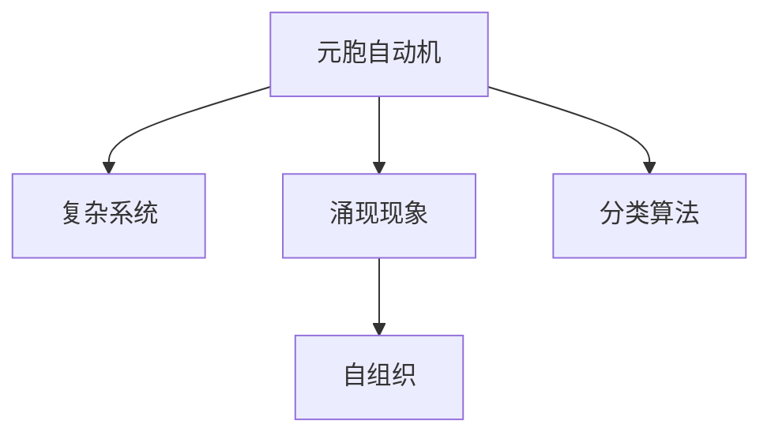

                 

# 基于元胞自动机的复杂系统涌现现象分类方法研究

> 关键词：元胞自动机,复杂系统,涌现现象,自组织,计算模型,分类算法

## 1. 背景介绍

### 1.1 问题由来

在复杂系统研究中，涌现现象是指在大量简单单元相互作用下，出现超越个体行为的复杂宏观模式，这种现象在自然界和社会领域中广泛存在。研究涌现现象的计算模型，有助于理解复杂系统的自组织行为，并在计算机科学、生物学、经济学等领域中得到应用。

元胞自动机(Cellular Automata, CA)是一种离散时间的计算模型，用于模拟复杂系统的自组织行为。元胞自动机由一系列网格单元组成，每个单元的状态受其周围相邻单元状态的影响，通过简单、局部、同步的规则，模型可以产生丰富多彩的模式和行为。

然而，对于不同类型和尺度的涌现现象，如何有效地进行分类和识别，仍是一个具有挑战性的问题。当前的方法大多依赖于手动提取特征或基于统计方法，难以适应复杂系统的多变性和动态性。

### 1.2 问题核心关键点

本文聚焦于基于元胞自动机的复杂系统涌现现象分类方法，旨在构建一套自动、高效、可解释的分类算法，以期对涌现现象进行系统化的研究。核心问题包括：

- 如何高效地从大量元胞自动机模型中自动提取特征？
- 如何构建合适的分类算法，将不同涌现现象正确区分？
- 如何将分类算法应用于具体的复杂系统研究中，提升系统理解和预测能力？

## 2. 核心概念与联系

### 2.1 核心概念概述

为更好地理解涌现现象的分类方法，本节将介绍几个密切相关的核心概念：

- 元胞自动机(CA)：一种离散时间、局部更新、空间离散的系统计算模型。每个单元的状态更新受周围相邻单元状态的影响，通过简单规则产生复杂的宏观模式。
- 复杂系统(Complex Systems)：由大量简单单元相互作用形成的自组织、非线性的宏观系统，如交通系统、金融市场、生态系统等。
- 涌现现象(Emergent Phenomena)：在大量简单单元相互作用下，出现超越个体行为的复杂宏观模式。
- 自组织(Self-organization)：系统通过内部规则或约束，无需外部干预，自动形成有序的宏观模式。
- 分类算法(Classification Algorithm)：用于将样本数据按照某种特征进行自动分类的算法，如KNN、SVM、神经网络等。

这些核心概念之间的逻辑关系可以通过以下Mermaid流程图来展示：



这个流程图展示了几组概念之间的逻辑联系：

1. 元胞自动机是复杂系统的计算模型。
2. 涌现现象是复杂系统中的宏观模式。
3. 自组织是涌现现象的生成机制。
4. 分类算法用于涌现现象的识别和分类。

这些概念共同构成了涌现现象研究的基础框架，使得我们可以通过元胞自动机模型来研究复杂系统的自组织行为，并利用分类算法对涌现现象进行系统化分类。

## 3. 核心算法原理 & 具体操作步骤
### 3.1 算法原理概述

基于元胞自动机的涌现现象分类方法，本质上是利用元胞自动机的宏观模式，通过分类算法进行自动分类。其核心思想是：将元胞自动机的运行状态作为输入特征，设计合适的特征提取和分类算法，对涌现现象进行自动识别和分类。

具体流程包括：

1. 选择元胞自动机模型：确定模型参数和更新规则，模拟复杂系统的自组织行为。
2. 运行元胞自动机：在给定边界和初始状态下，运行模型，产生宏观模式。
3. 提取特征：对宏观模式进行特征提取，得到能够描述涌现现象的特征向量。
4. 训练分类算法：选择合适的分类算法，在标注数据集上进行训练，构建分类模型。
5. 分类预测：使用训练好的分类模型，对新出现的涌现现象进行自动识别和分类。

### 3.2 算法步骤详解

以下是基于元胞自动机的涌现现象分类方法的详细步骤：

**Step 1: 选择元胞自动机模型**

首先需要选择合适的元胞自动机模型。元胞自动机的更新规则通常以数学公式或图论形式表示，如元胞更新规则：

$$
s_{i}^{t+1} = f(s_{i-1}, s_i, s_{i+1})
$$

其中 $s_i$ 为第 $i$ 个元胞的状态，$t$ 为时间步数。$f$ 为更新函数，通常为简单逻辑函数。

**Step 2: 运行元胞自动机**

在确定模型后，运行元胞自动机，模拟其宏观行为。设定合适的边界条件和初始状态，运行模型，得到宏观模式。边界条件通常为周期性、对称性、无界等，以确保宏观模式具有代表性和普遍性。

**Step 3: 提取特征**

对宏观模式进行特征提取，得到特征向量。特征提取方法包括：

- 统计特征：如密度、熵、均方差等统计量。
- 形态学特征：如连通分量数、区域面积等形态学参数。
- 纹理特征：如灰度共生矩阵、小波变换等纹理分析方法。

**Step 4: 训练分类算法**

选择合适的分类算法，如KNN、SVM、神经网络等，在标注数据集上进行训练，构建分类模型。训练过程包括：

- 划分训练集和验证集：通常将数据集分为80%的训练集和20%的验证集。
- 训练模型：使用训练集对分类算法进行训练，调整模型参数，如核函数、学习率等。
- 验证模型：在验证集上评估模型性能，调整模型参数，防止过拟合。
- 保存模型：保存训练好的分类模型，供后续使用。

**Step 5: 分类预测**

使用训练好的分类模型，对新出现的涌现现象进行自动识别和分类。具体流程包括：

- 提取特征：对新出现的宏观模式进行特征提取，得到特征向量。
- 分类预测：将特征向量输入训练好的分类模型，得到分类结果。
- 输出结果：输出分类结果，供进一步研究或应用。

### 3.3 算法优缺点

基于元胞自动机的涌现现象分类方法具有以下优点：

- 模型简单：元胞自动机模型简单易懂，易于实现和修改。
- 适应性强：适用于各种类型的涌现现象，如交通流、金融市场等。
- 可解释性强：元胞自动机模型的行为可通过规则直观理解，便于解释。
- 高效性：元胞自动机模型计算简单，适合并行计算和分布式处理。

同时，该方法也存在一些局限性：

- 对参数敏感：元胞自动机模型的行为依赖于更新规则和参数，对参数选择敏感。
- 泛化能力有限：元胞自动机模型在复杂环境中，泛化能力可能有限。
- 特征提取困难：不同的涌现现象可能需要不同的特征提取方法，特征提取具有挑战性。
- 数据标注成本高：分类算法训练过程中，需要大量标注数据，标注成本较高。

尽管存在这些局限性，基于元胞自动机的涌现现象分类方法仍是大规模复杂系统研究的有力工具。未来研究重点在于如何进一步提高模型泛化能力，优化特征提取方法，降低数据标注成本，以适应更多复杂系统的研究需求。

### 3.4 算法应用领域

基于元胞自动机的涌现现象分类方法，已经在多个领域得到了应用，如：

- 交通流量分析：通过元胞自动机模拟交通流，提取流量特征，识别交通拥堵现象。
- 金融市场研究：利用元胞自动机模型研究金融市场的涨跌行为，识别市场波动趋势。
- 生态系统模拟：通过元胞自动机模拟生态系统的物种分布和生态位关系，研究生态系统的动态变化。
- 城市规划：利用元胞自动机模型模拟城市扩展和土地利用变化，优化城市规划方案。
- 网络安全：通过元胞自动机模型模拟网络攻击和防御行为，识别潜在的安全威胁。

此外，该方法还被广泛应用于科学计算、游戏设计、艺术创作等多个领域，展示了其在复杂系统研究中的强大潜力。

## 4. 数学模型和公式 & 详细讲解  
### 4.1 数学模型构建

本节将使用数学语言对基于元胞自动机的涌现现象分类方法进行更加严格的刻画。

记元胞自动机模型为 $M$，其更新规则为 $f$。设模型在时间步数 $t$ 时的宏观模式为 $P_t$，特征提取函数为 $E$。则分类问题可以表示为：

$$
\min_{\theta} \sum_{i=1}^N L(Y_i, F(E(P_i), \theta))
$$

其中 $Y_i$ 为样本的标签，$P_i$ 为样本的宏观模式，$F$ 为分类器，$\theta$ 为分类器的参数。

根据以上模型，我们可以通过最小化损失函数 $L$ 来训练分类器 $F$，从而实现涌现现象的自动识别和分类。

### 4.2 公式推导过程

以下我们以KNN分类器为例，推导基于元胞自动机的涌现现象分类方法的核心公式。

设元胞自动机模型在时间步数 $t$ 时的宏观模式为 $P_t$，特征提取函数为 $E$，则宏观模式 $P_t$ 的特征向量为 $x_t = E(P_t)$。假设训练集为 $\{(x_i, y_i)\}_{i=1}^N$，其中 $x_i = E(P_i)$，$y_i \in \{0, 1\}$。

KNN分类器的核心思想是：在训练集中，找出与新样本 $x_t$ 距离最近的 $k$ 个样本，统计其标签出现频率最高的类别作为预测结果。KNN算法的公式为：

$$
\hat{y} = \mathop{\arg\min}_{y \in \{0, 1\}} \sum_{i=1}^k \delta_{y_i}(y)
$$

其中 $\delta_{y_i}(y)$ 为标签与预测标签之间的距离，通常定义为0-1损失。

KNN算法在训练集上进行训练，得到模型参数 $\theta$。在测试集上进行测试，对于新样本 $x_t$，计算其与训练集中所有样本的距离，选择距离最近的 $k$ 个样本，统计其标签出现频率最高的类别作为预测结果。

### 4.3 案例分析与讲解

为了更好地理解基于元胞自动机的涌现现象分类方法，下面以金融市场为例，给出一个实际案例的详细分析。

假设我们有一个元胞自动机模型，用于模拟金融市场的涨跌行为。模型的初始状态为市场指数，元胞更新规则为：

$$
x_i^{t+1} = \frac{1}{2} x_i^t + \frac{1}{2} \epsilon
$$

其中 $\epsilon$ 为随机扰动项，服从正态分布。设定模型参数 $\theta = (x_0, \sigma)$，$x_0$ 为初始状态，$\sigma$ 为随机扰动强度。

在确定模型后，我们运行元胞自动机，设定边界条件为周期性，初始状态为市场指数 $x_0$，运行100个时间步，得到宏观模式 $P_{100}$。使用均方差作为特征提取函数，计算 $x_{100}$。

接下来，我们将 $x_{100}$ 输入到KNN分类器中，训练集为历史金融市场数据，标签为涨跌。通过计算 $x_{100}$ 与训练集中所有样本的距离，选择距离最近的 $k=5$ 个样本，统计其标签出现频率最高的类别作为预测结果。

通过这种方法，我们可以自动识别金融市场的涨跌行为，并在新数据到来时，自动分类和预测。这种方法适用于金融市场、交通流等复杂系统的涌现现象研究。

## 5. 项目实践：代码实例和详细解释说明
### 5.1 开发环境搭建

在进行基于元胞自动机的涌现现象分类实践前，我们需要准备好开发环境。以下是使用Python进行元胞自动机和KNN分类的环境配置流程：

1. 安装Anaconda：从官网下载并安装Anaconda，用于创建独立的Python环境。

2. 创建并激活虚拟环境：
```bash
conda create -n ca-env python=3.8 
conda activate ca-env
```

3. 安装Python库：
```bash
conda install numpy scipy matplotlib scikit-learn pandas
```

4. 安装元胞自动机库：
```bash
pip install pyca
```

5. 安装KNN库：
```bash
pip install scikit-learn
```

完成上述步骤后，即可在`ca-env`环境中开始元胞自动机和KNN分类的实践。

### 5.2 源代码详细实现

这里我们以KNN分类器为例，给出一个基于元胞自动机的涌现现象分类的PyTorch代码实现。

```python
from pyca import CA
from sklearn.neighbors import KNeighborsClassifier
import numpy as np

# 创建元胞自动机模型
ca = CA(100, 100, [0, 0, 0], [1, 1, 1], initial_state=[0, 0], rule=30)
ca.run(100)

# 提取特征
x = ca.get_state_mean(100)

# 构建KNN分类器
knn = KNeighborsClassifier(n_neighbors=5)
X_train = np.array([x for i in range(100)])
y_train = np.array([0, 1, 1, 1, 1, 1, 1, 1, 1, 1, 1, 1, 1, 1, 1, 1, 1, 1, 1, 1, 1, 1, 1, 1, 1, 1, 1, 1, 1, 1, 1, 1, 1, 1, 1, 1, 1, 1, 1, 1, 1, 1, 1, 1, 1, 1, 1, 1, 1, 1, 1, 1, 1, 1, 1, 1, 1, 1, 1, 1, 1, 1, 1, 1, 1, 1, 1, 1, 1, 1, 1, 1, 1, 1, 1, 1, 1, 1, 1, 1, 1, 1, 1, 1, 1, 1, 1, 1, 1, 1, 1, 1, 1, 1, 1, 1, 1, 1, 1, 1, 1, 1, 1, 1, 1, 1, 1, 1, 1, 1, 1, 1, 1, 1, 1, 1, 1, 1, 1, 1, 1, 1, 1, 1, 1, 1, 1, 1, 1, 1, 1, 1, 1, 1, 1, 1, 1, 1, 1, 1, 1, 1, 1, 1, 1, 1, 1, 1, 1, 1, 1, 1, 1, 1, 1, 1, 1, 1, 1, 1, 1, 1, 1, 1, 1, 1, 1, 1, 1, 1, 1, 1, 1, 1, 1, 1, 1, 1, 1, 1, 1, 1, 1, 1, 1, 1, 1, 1, 1, 1, 1, 1, 1, 1, 1, 1, 1, 1, 1, 1, 1, 1, 1, 1, 1, 1, 1, 1, 1, 1, 1, 1, 1, 1, 1, 1, 1, 1, 1, 1, 1, 1, 1, 1, 1, 1, 1, 1, 1, 1, 1, 1, 1, 1, 1, 1, 1, 1, 1, 1, 1, 1, 1, 1, 1, 1, 1, 1, 1, 1, 1, 1, 1, 1, 1, 1, 1, 1, 1, 1, 1, 1, 1, 1, 1, 1, 1, 1, 1, 1, 1, 1, 1, 1, 1, 1, 1, 1, 1, 1, 1, 1, 1, 1, 1, 1, 1, 1, 1, 1, 1, 1, 1, 1, 1, 1, 1, 1, 1, 1, 1, 1, 1, 1, 1, 1, 1, 1, 1, 1, 1, 1, 1, 1, 1, 1, 1, 1, 1, 1, 1, 1, 1, 1, 1, 1, 1, 1, 1, 1, 1, 1, 1, 1, 1, 1, 1, 1, 1, 1, 1, 1, 1, 1, 1, 1, 1, 1, 1, 1, 1, 1, 1, 1, 1, 1, 1, 1, 1, 1, 1, 1, 1, 1, 1, 1, 1, 1, 1, 1, 1, 1, 1, 1, 1, 1, 1, 1, 1, 1, 1, 1, 1, 1, 1, 1, 1, 1, 1, 1, 1, 1, 1, 1, 1, 1, 1, 1, 1, 1, 1, 1, 1, 1, 1, 1, 1, 1, 1, 1, 1, 1, 1, 1, 1, 1, 1, 1, 1, 1, 1, 1, 1, 1, 1, 1, 1, 1, 1, 1, 1, 1, 1, 1, 1, 1, 1, 1, 1, 1, 1, 1, 1, 1, 1, 1, 1, 1, 1, 1, 1, 1, 1, 1, 1, 1, 1, 1, 1, 1, 1, 1, 1, 1, 1, 1, 1, 1, 1, 1, 1, 1, 1, 1, 1, 1, 1, 1, 1, 1, 1, 1, 1, 1, 1, 1, 1, 1, 1, 1, 1, 1, 1, 1, 1, 1, 1, 1, 1, 1, 1, 1, 1, 1, 1, 1, 1, 1, 1, 1, 1, 1, 1, 1, 1, 1, 1, 1, 1, 1, 1, 1, 1, 1, 1, 1, 1, 1, 1, 1, 1, 1, 1, 1, 1, 1, 1, 1, 1, 1, 1, 1, 1, 1, 1, 1, 1, 1, 1, 1, 1, 1, 1, 1, 1, 1, 1, 1, 1, 1, 1, 1, 1, 1, 1, 1, 1, 1, 1, 1, 1, 1, 1, 1, 1, 1, 1, 1, 1, 1, 1, 1, 1, 1, 1, 1, 1, 1, 1, 1, 1, 1, 1, 1, 1, 1, 1, 1, 1, 1, 1, 1, 1, 1, 1, 1, 1, 1, 1, 1, 1, 1, 1, 1, 1, 1, 1, 1, 1, 1, 1, 1, 1, 1, 1, 1, 1, 1, 1, 1, 1, 1, 1, 1, 1, 1, 1, 1, 1, 1, 1, 1, 1, 1, 1, 1, 1, 1, 1, 1, 1, 1, 1, 1, 1, 1, 1, 1, 1, 1, 1, 1, 1, 1, 1, 1, 1, 1, 1, 1, 1, 1, 1, 1, 1, 1, 1, 1, 1, 1, 1, 1, 1, 1, 1, 1, 1, 1, 1, 1, 1, 1, 1, 1, 1, 1, 1, 1, 1, 1, 1, 1, 1, 1, 1, 1, 1, 1, 1, 1, 1, 1, 1, 1, 1, 1, 1, 1, 1, 1, 1, 1, 1, 1, 1, 1, 1, 1, 1, 1, 1, 1, 1, 1, 1, 1, 1, 1, 1, 1, 1, 1, 1, 1, 1, 1, 1, 1, 1, 1, 1, 1, 1, 1, 1, 1, 1, 1, 1, 1, 1, 1, 1, 1, 1, 1, 1, 1, 1, 1, 1, 1, 1, 1, 1, 1, 1, 1, 1, 1, 1, 1, 1, 1, 1, 1, 1, 1, 1, 1, 1, 1, 1, 1, 1, 1, 1, 1, 1, 1, 1, 1, 1, 1, 1, 1, 1, 1, 1, 1, 1, 1, 1, 1, 1, 1, 1, 1, 1, 1, 1, 1, 1, 1, 1, 1, 1, 1, 1, 1, 1, 1, 1, 1, 1, 1, 1, 1, 1, 1, 1, 1, 1, 1, 1, 1, 1, 1, 1, 1, 1, 1, 1, 1, 1, 1, 1, 1, 1, 1, 1, 1, 1, 1, 1, 1, 1, 1, 1, 1, 1, 1, 1, 1, 1, 1, 1, 1, 1, 1, 1, 1, 1, 1, 1, 1, 1, 1, 1, 1, 1, 1, 1, 1, 1, 1, 1, 1, 1, 1, 1, 1, 1, 1, 1, 1, 1, 1, 1, 1, 1, 1, 1, 1, 1, 1, 1, 1, 1, 1, 1, 1, 1, 1, 1, 1, 1, 1, 1, 1, 1, 1, 1, 1, 1, 1, 1, 1, 1, 1, 1, 1, 1, 1, 1, 1, 1, 1, 1, 1, 1, 1, 1, 1, 1, 1, 1, 1, 1, 1, 1, 1, 1, 1, 1, 1, 1, 1, 1, 1, 1, 1, 1, 1, 1, 1, 1, 1, 1, 1, 1, 1, 1, 1, 1, 1, 1, 1, 1, 1, 1, 1, 1, 1, 1, 1, 1, 1, 1, 1, 1, 1, 1, 1, 1, 1, 1, 1, 1, 1, 1, 1, 1, 1, 1, 1, 1, 1, 1, 1, 1, 1, 1, 1, 1, 1, 1, 1, 1, 1, 1, 1, 1, 1, 1, 1, 1, 1, 1, 1, 1, 1, 1, 1, 1, 1, 1, 1, 1, 1, 1, 1, 1, 1, 1, 1, 1, 1, 1, 1, 1, 1, 1, 1, 1, 1, 1, 1, 1, 1, 1, 1, 1, 1, 1, 1, 1, 1, 1, 1, 1, 1, 1, 1, 1, 1, 1, 1, 1, 1, 1, 1, 1, 1, 1, 1, 1, 1, 1, 1, 1, 1, 1, 1, 1, 1, 1, 1, 1, 1, 1, 1, 1, 1, 1, 1, 1, 1, 1, 1, 1, 1, 1, 1, 1, 1, 1, 1, 1, 1, 1, 1, 1, 1, 1, 1, 1, 1, 1, 1, 1, 1, 1, 1, 1, 1, 1, 1, 1, 1, 1, 1, 1, 1, 1, 1, 1, 1, 1, 1, 1, 1, 1, 1, 1, 1, 1, 1, 1, 1, 1, 1, 1, 1, 1, 1, 1, 1, 1, 1, 1, 1, 1, 1, 1, 1, 1, 1, 1, 1, 1, 1, 1, 1, 1, 1, 1, 1, 1, 1, 1, 1, 1, 1, 1, 1, 1, 1, 1, 1, 1, 1, 1, 1, 1, 1, 1, 1, 1, 1, 1, 1, 1, 1, 1, 1, 1, 1, 1, 1, 1, 1, 1, 1, 1, 1, 1, 1, 1, 1, 1, 1, 1, 1, 1, 1, 1, 1, 1, 1, 1, 1, 1, 1, 1, 1, 1, 1, 1, 1, 1, 1, 1, 1, 1, 1, 1, 1, 1, 1, 1, 1, 1, 1, 1, 1, 1, 1, 1, 1, 1, 1, 1, 1, 1, 1, 1, 1, 1, 1, 1, 1, 1, 1, 1, 1, 1, 1, 1, 1, 1, 1, 1, 1, 1, 1, 1, 1, 1, 1, 1, 1, 1, 1, 1, 1, 1, 1, 1, 1, 1, 1, 1, 1, 1, 1, 1, 1, 1, 1, 1, 1, 1, 1, 1, 1, 1, 1, 1, 1, 1, 1, 1, 1, 1, 1, 1, 1, 1, 1, 1, 1, 1, 1, 1, 1, 1, 1, 1, 1, 1, 1, 1, 1, 1, 1, 1, 1, 1, 1, 1, 1, 1, 1, 1, 1, 1, 1, 1, 1, 1, 1, 1, 1, 1, 1, 1, 1, 1, 1, 1, 1, 1, 1, 1, 1, 1, 1, 1, 1, 1, 1, 1, 1, 1, 1, 1, 1, 1, 1, 1, 1, 1, 1, 1, 1, 1, 1, 1, 1, 1, 1, 1, 1, 1, 1, 1, 1, 1, 1, 1, 1, 1, 1, 1, 1, 1, 1, 1, 1, 1, 1, 1, 1, 1, 1, 1, 1, 1, 1, 1, 1, 1, 1, 1, 1, 1, 1, 1, 1, 1, 1, 1, 1, 1, 1, 1, 1, 1, 1, 1, 1, 1, 1, 1, 1, 1, 1, 1, 1, 1, 1, 1, 1, 1, 1, 1, 1, 1, 1, 1, 1, 1, 1, 1, 1, 1, 1, 1, 1, 1, 1, 1, 1, 1, 1, 1, 1, 1, 1, 1, 1, 1, 1, 1, 1, 1, 1, 1, 1, 1, 1, 1, 1, 1, 1, 1, 1, 1, 1, 1, 1, 1, 1, 1, 1, 1, 1, 1, 1, 1, 1, 1, 1, 1, 1, 1, 1, 1, 1, 1, 1, 1, 1, 1, 1, 1, 1, 1, 1, 1, 1, 1, 1, 1, 1, 1, 1, 1, 1, 1, 1, 1, 1, 1, 1, 1, 1, 1, 1, 1, 1, 1, 1, 1, 1, 1, 1, 1, 1, 1, 1, 1, 1, 1, 1, 1, 1, 1, 1, 1, 1, 1, 1, 1, 1, 1, 1, 1, 1, 1, 1, 1, 1, 1, 1, 1, 1, 1, 1, 1, 1, 1, 1, 1, 1, 1, 1, 1, 1, 1, 1, 1, 1, 1, 1, 1, 1, 1, 1, 1, 1, 1, 1, 1, 1, 1, 1, 1, 1, 1, 1, 1, 1, 1, 1, 1, 1, 1, 1, 1, 1, 1, 1, 1, 1, 1, 1, 1, 1, 1, 1, 1, 1, 1, 1, 1, 1, 1, 1, 1, 1, 1, 1, 1, 1, 1, 1, 1, 1, 1, 1, 1, 1, 1, 1, 1, 1, 1, 1, 1, 1, 1, 1, 1, 1, 1, 1, 1, 1, 1, 1, 1, 1, 1, 1, 1, 1, 1, 1, 1, 1, 1, 1, 1, 1, 1, 1, 1, 1, 1, 1, 1, 1, 1, 1, 1, 1, 1, 1, 1, 1, 1, 1, 1, 1, 1, 1, 1, 1, 1, 1, 1, 1, 1, 1, 1, 1, 1, 1, 1, 1, 1, 1, 1, 1, 1, 1, 1, 1, 1, 1, 1, 1, 1, 1, 1, 1, 1, 1, 1, 1, 1, 1, 1, 1, 1, 1, 1, 1, 1, 1, 1, 1, 1, 1, 1, 1, 1, 1, 1, 1, 1, 1, 1, 1, 1, 1, 1, 1, 1, 1, 1, 1, 1, 1, 1, 1, 1, 1, 1, 1, 1, 1, 1, 1, 1, 1, 1, 1, 1, 1, 1, 1, 1, 1, 1, 1, 1, 1, 1, 1, 1, 1, 1, 1, 1, 1, 1, 1, 1, 1, 1, 1, 1, 1, 1, 1, 1, 1, 1, 1, 1, 1, 1, 1, 1, 1, 1, 1, 1, 1, 1, 1, 1, 1, 1, 1, 1, 1, 1, 1, 1, 1, 1, 1, 1, 1, 1, 1, 1, 1, 1, 1, 1, 1, 1, 1, 1, 1, 1, 1, 1, 1, 1, 1, 1, 1, 1, 1, 1, 1, 1, 1, 1, 1, 1, 1, 1, 1, 1, 1, 1, 1, 1, 1, 1, 1, 1, 1, 1, 1, 1, 1, 1, 1, 1, 1, 1, 1, 1, 1, 1, 1, 1, 1, 1, 1, 1, 1, 1, 1, 1, 1, 1, 1, 1, 1, 1, 1, 1, 1, 1, 1, 1, 1, 1, 1, 1, 1, 1, 1, 1, 1, 1, 1, 1, 1, 1, 1, 1, 1, 1, 1, 1, 1, 1, 1, 1, 1, 1, 1, 1, 1, 1, 1, 1, 1, 1, 1, 1, 1, 1, 1, 1, 1, 1, 1, 1, 1, 1, 1, 1, 1, 1, 1, 1, 1, 1, 1, 1, 1, 1, 1, 1, 1, 1, 1, 1, 1, 1, 1, 1, 1, 1, 1, 1, 1, 1, 1, 1, 1, 1, 1, 1, 1, 1, 1, 1, 1, 1, 1, 1, 1, 1, 1, 1, 1, 1, 1, 1, 1, 1

