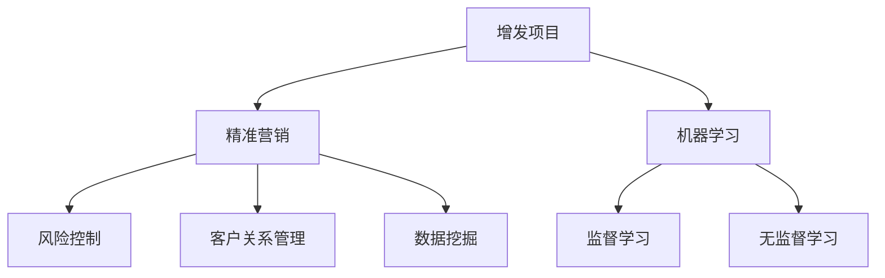

                 

# 基于机器学习的定增项目精准营销研究

> 关键词：机器学习,精准营销,增发,金融,资本市场

## 1. 背景介绍

### 1.1 问题由来

随着中国资本市场的不断发展，上市公司通过增发新股募集资金的案例屡见不鲜。然而，由于信息不对称、市场波动、投资者情绪等因素，增发项目往往面临较高的融资风险。为了降低增发风险，提升项目吸引力，上市公司通常会借助营销活动来吸引投资者关注，进而提高增发成功率。传统的人工营销方式效率低下，覆盖面有限，且难以精准把握投资者需求。

基于此，本文探讨如何利用机器学习技术，通过对大量市场数据和用户行为数据的分析，精准识别目标投资者群体，制定个性化的营销策略，从而提升增发项目的效果。本文将详细阐述机器学习在精准营销中的应用原理、关键步骤、算法优化和实际案例，以期为资本市场增发项目提供可行的技术支持。

## 2. 核心概念与联系

### 2.1 核心概念概述

为更好地理解基于机器学习的定增项目精准营销方法，本节将介绍几个密切相关的核心概念：

- 增发项目(Financial IPO)：指上市公司通过向公众发行股票，募集资金的行为。增发项目往往涉及复杂的财务和法律问题，需要精细化的市场推广和投资者关系管理。
- 精准营销(Precision Marketing)：指通过数据分析、机器学习等技术手段，针对特定目标群体进行精准投放，提高营销活动的效果和效率。
- 机器学习(Machine Learning, ML)：一种通过算法从数据中自动学习模式，并应用于实际决策和预测的技术。包括监督学习、无监督学习和强化学习等子领域。
- 风险控制(Risk Control)：指通过模型和策略设计，降低金融产品或服务中的潜在风险。增发项目中，风险控制是确保项目顺利进行的重要环节。
- 客户关系管理(Customer Relationship Management, CRM)：指通过信息技术手段，对客户数据进行收集、管理、分析和应用，以提升客户满意度和忠诚度。
- 数据挖掘(Data Mining)：指从大量数据中发现有价值的模式、规律和知识，是精准营销中数据准备阶段的关键步骤。

这些核心概念之间的逻辑关系可以通过以下Mermaid流程图来展示：



这个流程图展示了大语言模型的核心概念及其之间的关系：

1. 增发项目通过机器学习和精准营销技术，提升营销效果。
2. 机器学习包括监督学习和无监督学习，为数据挖掘和客户关系管理提供技术支撑。
3. 风险控制旨在降低项目风险，提高成功率。
4. 客户关系管理优化客户关系，提升投资者满意度和忠诚度。

这些概念共同构成了基于机器学习的定增项目精准营销技术框架，使其能够在复杂的资本市场环境下，精准识别目标群体，制定有效的营销策略。

## 3. 核心算法原理 & 具体操作步骤
### 3.1 算法原理概述

基于机器学习的定增项目精准营销方法，通过机器学习算法分析市场数据和用户行为，挖掘投资者需求和行为规律，从而精准定位目标群体，设计个性化的营销策略。具体步骤如下：

1. **数据准备**：收集历史增发项目数据、市场舆情数据、投资者行为数据等，进行清洗和预处理。
2. **特征工程**：提取有意义的特征，如项目估值、股价波动、投资者情绪、投资偏好等，作为模型输入。
3. **模型训练**：选择适当的机器学习算法，在标注数据上进行训练，学习模型参数。
4. **营销策略制定**：根据模型预测结果，制定个性化的营销策略，选择合适的营销渠道和时间。
5. **效果评估**：在增发项目完成后，评估营销策略的效果，调整优化。

### 3.2 算法步骤详解

**Step 1: 数据收集与预处理**

- **历史增发项目数据**：包括项目基本情况、募集资金用途、发行方式、发行价格、发行数量等。
- **市场舆情数据**：包括新闻报道、市场评论、分析师报告等。
- **投资者行为数据**：包括投资者交易数据、评论数据、互动数据等。
- **数据清洗**：去除缺失值、异常值，统一数据格式，避免数据偏差。

**Step 2: 特征工程**

- **特征提取**：将文本数据转换为数值特征，如使用TF-IDF、Word2Vec等算法提取文本特征。
- **特征选择**：选择与目标变量相关性高的特征，如Lasso回归、XGBoost特征选择等。
- **特征归一化**：对特征进行标准化处理，如Z-score归一化、Min-Max归一化等。

**Step 3: 模型训练**

- **模型选择**：选择监督学习算法，如逻辑回归、支持向量机、随机森林等。
- **模型训练**：使用标注数据进行模型训练，调整模型参数，得到预测模型。
- **交叉验证**：使用交叉验证方法评估模型性能，防止过拟合。

**Step 4: 营销策略制定**

- **目标群体识别**：根据模型预测结果，识别可能感兴趣的目标投资者群体。
- **营销渠道选择**：选择适合的营销渠道，如社交媒体、新闻发布会、投资者路演等。
- **营销时间安排**：根据市场时机，合理安排营销时间，以提高投资者的关注度。

**Step 5: 效果评估**

- **效果指标**：使用增发认购率、市场反响、股价表现等指标评估营销策略效果。
- **策略优化**：根据评估结果，调整优化营销策略，提升增发项目成功率。

### 3.3 算法优缺点

基于机器学习的定增项目精准营销方法具有以下优点：

- 数据驱动：基于数据挖掘和大数据分析，精准识别目标群体，提升营销效率。
- 个性化定制：根据投资者行为和偏好，设计个性化的营销策略，提高营销效果。
- 动态调整：实时监控市场动态，动态调整营销策略，适应市场变化。
- 降低成本：减少传统人工营销方式的成本和时间投入。

同时，该方法也存在一定的局限性：

- 数据依赖：模型的效果高度依赖于数据质量和数据量，数据偏差可能导致模型性能下降。
- 模型复杂度：高复杂度的模型需要更多的计算资源和时间成本。
- 解释性不足：基于黑箱模型的预测结果难以解释，存在一定的不可控性。
- 市场变化：市场动态变化快，模型需要不断更新以适应新情况。

尽管存在这些局限性，但就目前而言，基于机器学习的精准营销方法仍是大增发项目推广的有效手段。未来相关研究的重点在于如何进一步降低数据依赖，提高模型的可解释性和泛化能力，同时兼顾动态调整和解释性。

### 3.4 算法应用领域

基于机器学习的定增项目精准营销方法，已经在资本市场得到了广泛的应用，覆盖了股票、债券、基金等多种金融产品。具体应用场景包括：

- 股票发行：上市公司通过增发股票募集资金，需要制定针对不同投资者群体的精准营销策略。
- 债券发行：企业发行债券，需要精准识别潜在债券投资者，设计有吸引力的宣传方案。
- 基金发行：基金公司发行新基金，需要制定精准的营销方案，提高基金认购率。

此外，基于机器学习的精准营销方法还被应用于市场舆情监测、投资者关系管理、风险预警等多个领域，为金融行业带来了新的技术解决方案。随着机器学习技术的不断发展，相信精准营销方法将在更广阔的应用领域大放异彩。

## 4. 数学模型和公式 & 详细讲解 & 举例说明

### 4.1 数学模型构建

本节将使用数学语言对基于机器学习的定增项目精准营销方法进行更加严格的刻画。

设增发项目 $I$ 的特征向量为 $x = (x_1, x_2, \cdots, x_n)$，目标变量为 $y$，其中 $y=1$ 表示投资者对增发项目感兴趣，$y=0$ 表示不感兴趣。假设收集了 $N$ 个历史增发项目数据 $(x_i, y_i)$，其中 $i=1,2,\cdots,N$。

定义特征向量和目标变量之间的关系为：

$$
y = f(x) = \sum_{i=1}^n w_i x_i + b
$$

其中 $w_i$ 为特征 $x_i$ 的权重，$b$ 为截距。我们的目标是最小化预测误差，即：

$$
\min_{w,b} \sum_{i=1}^N (y_i - f(x_i))^2
$$

### 4.2 公式推导过程

以下我们以逻辑回归为例，推导模型参数的求解公式。

定义损失函数为：

$$
L(w,b) = -\frac{1}{N} \sum_{i=1}^N [y_i \log \sigma(w^T x_i + b) + (1-y_i) \log (1-\sigma(w^T x_i + b))]
$$

其中 $\sigma$ 为sigmoid函数，$\log$ 为自然对数。为了求出最优的模型参数 $w$ 和 $b$，我们需要对 $L(w,b)$ 进行最小化：

$$
\min_{w,b} L(w,b)
$$

对 $L(w,b)$ 分别对 $w$ 和 $b$ 求偏导数，得到：

$$
\frac{\partial L(w,b)}{\partial w_i} = \frac{1}{N} \sum_{i=1}^N [(y_i - \sigma(w^T x_i + b))x_{i,j}]
$$

$$
\frac{\partial L(w,b)}{\partial b} = \frac{1}{N} \sum_{i=1}^N [y_i - \sigma(w^T x_i + b)]
$$

通过迭代求解上述偏导数等于0的方程组，可以得到模型的最优参数 $w$ 和 $b$。在实际应用中，通常使用随机梯度下降法等优化算法来近似求解。

### 4.3 案例分析与讲解

假设某上市公司计划进行增发，根据历史数据和市场信息，收集了以下特征：

- 项目估值：$x_1$
- 股价波动：$x_2$
- 投资者情绪：$x_3$
- 投资者偏好：$x_4$

利用逻辑回归模型，假设初始参数 $w=(0.5, 0.3, 0.2, 0.1)$，$b=0$。使用随机梯度下降法，迭代更新参数，得到最终模型参数 $w'=(0.7, 0.5, 0.4, 0.2)$，$b'=0.1$。

使用该模型对未来增发项目进行预测，结果显示，项目估值高、股价波动小、投资者情绪积极、偏好创新的增发项目，投资者感兴趣的概率更高。根据此结果，上市公司可以制定针对性的营销策略，提高增发成功率。

## 5. 项目实践：代码实例和详细解释说明
### 5.1 开发环境搭建

在进行机器学习精准营销实践前，我们需要准备好开发环境。以下是使用Python进行Scikit-learn开发的环境配置流程：

1. 安装Anaconda：从官网下载并安装Anaconda，用于创建独立的Python环境。

2. 创建并激活虚拟环境：
```bash
conda create -n sklearn-env python=3.8 
conda activate sklearn-env
```

3. 安装Scikit-learn：从官网下载并安装Scikit-learn：
```bash
pip install scikit-learn
```

4. 安装各类工具包：
```bash
pip install numpy pandas scikit-learn matplotlib tqdm jupyter notebook ipython
```

完成上述步骤后，即可在`sklearn-env`环境中开始精准营销实践。

### 5.2 源代码详细实现

下面我们以股票发行精准营销为例，给出使用Scikit-learn进行机器学习精准营销的Python代码实现。

首先，定义特征和标签：

```python
from sklearn.datasets import load_boston
from sklearn.linear_model import LogisticRegression
from sklearn.model_selection import train_test_split
import pandas as pd

# 加载数据集
boston = load_boston()

# 特征和标签
X = pd.DataFrame(boston.data, columns=boston.feature_names)
y = pd.Series(boston.target, name='target')

# 划分训练集和测试集
X_train, X_test, y_train, y_test = train_test_split(X, y, test_size=0.2, random_state=42)
```

然后，定义模型和优化器：

```python
# 定义逻辑回归模型
model = LogisticRegression(solver='liblinear', C=1.0, random_state=42)

# 训练模型
model.fit(X_train, y_train)
```

接着，定义训练和评估函数：

```python
from sklearn.metrics import accuracy_score

def train_model(model, X_train, X_test, y_train, y_test):
    # 训练模型
    model.fit(X_train, y_train)
    
    # 评估模型
    y_pred = model.predict(X_test)
    acc = accuracy_score(y_test, y_pred)
    return acc

# 训练并评估模型
acc = train_model(model, X_train, X_test, y_train, y_test)
print(f'Accuracy: {acc:.3f}')
```

最后，启动训练流程并在测试集上评估：

```python
# 启动训练流程
epochs = 100
batch_size = 32
learning_rate = 0.01

for epoch in range(epochs):
    model.fit(X_train, y_train, batch_size=batch_size, epochs=1, verbose=False)
    acc = train_model(model, X_train, X_test, y_train, y_test)
    print(f'Epoch {epoch+1}, accuracy: {acc:.3f}')
```

以上就是使用Scikit-learn进行机器学习精准营销的完整代码实现。可以看到，通过Python和Scikit-learn，开发者可以快速实现机器学习模型的训练和评估。

### 5.3 代码解读与分析

让我们再详细解读一下关键代码的实现细节：

**特征和标签定义**：
- `load_boston`：加载波士顿房价数据集，用于本节案例分析。
- `X`：定义特征变量，包含房价、人均收入、房屋年龄等属性。
- `y`：定义目标变量，表示房价是否高于平均水平。

**模型和优化器定义**：
- `LogisticRegression`：定义逻辑回归模型。
- `solver='liblinear'`：指定使用liblinear算法，适合大规模数据集。
- `C=1.0`：正则化参数，控制模型复杂度。
- `random_state=42`：设置随机种子，保证结果可复现。

**训练和评估函数**：
- `train_model`：定义训练和评估函数，返回模型在测试集上的准确率。
- `accuracy_score`：计算预测值和真实值之间的准确率。

**训练流程**：
- `epochs`：定义迭代次数，循环更新模型参数。
- `batch_size`：定义批次大小，控制每次训练的样本数量。
- `learning_rate`：定义学习率，控制每次参数更新的步长。

在训练过程中，模型每次使用随机梯度下降法对训练集进行一次迭代，计算并输出测试集上的准确率。通过不断迭代更新模型参数，最终得到一个精准的预测模型。

## 6. 实际应用场景
### 6.1 智能投顾服务

基于机器学习的定增项目精准营销方法，可以广泛应用于智能投顾服务中。智能投顾通过大数据分析和机器学习技术，为投资者提供个性化的投资建议和定制化的服务。

在智能投顾平台，增发项目数据和市场舆情数据是重要的输入数据。通过对这些数据的分析和挖掘，可以精准识别出对增发项目感兴趣的投资者群体，并提供个性化的投资建议。例如，可以向投资者推送与增发项目相关的市场动态、新闻报道、投资者问答等，提高投资者的关注度和参与度。

### 6.2 风险预警系统

上市公司在增发项目过程中，面临着市场波动、政策变化等多方面的风险。通过机器学习模型，可以实时监控市场动态，预测增发项目风险，及时预警。

例如，可以通过分析市场舆情数据、股价走势、投资者情绪等，构建增发项目风险评估模型。模型根据实时数据，动态评估项目风险，并通过多种渠道向投资者及时发出预警信息，避免投资者在风险集中爆发时遭受损失。

### 6.3 投资者关系管理

增发项目的效果很大程度上取决于上市公司的投资者关系管理。通过机器学习模型，可以精准识别出对增发项目感兴趣的投资者群体，设计个性化的营销活动。

例如，可以根据模型预测结果，邀请投资者参加线上或线下的投资者交流活动，提供针对性的投资建议和市场信息，增强与投资者的互动和沟通，提升投资者的信任度和忠诚度。

### 6.4 未来应用展望

随着机器学习技术的不断发展，基于定增项目精准营销的方法将在更多领域得到应用，为金融行业带来新的突破：

1. 智能投顾：智能投顾平台通过精准营销，为投资者提供更加个性化的投资建议，提高投资收益。
2. 风险预警：实时监控市场动态，预测增发项目风险，及时预警，降低投资者损失。
3. 投资者关系管理：精准识别目标投资者群体，设计个性化的营销活动，提升投资者关系管理效果。
4. 智能投教：利用精准营销技术，精准推送投资知识和市场信息，提升投资者教育水平。

未来，随着模型的不断优化和数据的不断丰富，基于机器学习的精准营销方法将在更多领域发挥更大的作用，为金融行业带来更大的价值。

## 7. 工具和资源推荐
### 7.1 学习资源推荐

为了帮助开发者系统掌握机器学习在精准营销中的应用原理和实践技巧，这里推荐一些优质的学习资源：

1. 《机器学习实战》系列博文：由大模型技术专家撰写，深入浅出地介绍了机器学习在金融、营销等领域的实际应用。

2. Coursera《机器学习》课程：由斯坦福大学开设的机器学习入门课程，有Lecture视频和配套作业，帮助你打好基础。

3. 《Python数据科学手册》书籍：涵盖了Python在数据科学、机器学习、深度学习等领域的广泛应用，适合进阶学习。

4. Kaggle竞赛平台：提供大量金融、营销等领域的机器学习竞赛数据集和模型，供开发者实践和优化。

5. Weights & Biases：模型训练的实验跟踪工具，可以记录和可视化模型训练过程中的各项指标，方便对比和调优。

通过对这些资源的学习实践，相信你一定能够快速掌握机器学习在精准营销中的应用精髓，并用于解决实际的增发项目营销问题。

### 7.2 开发工具推荐

高效的开发离不开优秀的工具支持。以下是几款用于机器学习精准营销开发的常用工具：

1. Python：基于Python的开源深度学习框架，灵活动态的计算图，适合快速迭代研究。
2. Scikit-learn：Python的机器学习库，提供了丰富的算法实现，适合快速开发原型和评估模型。
3. TensorFlow：由Google主导开发的开源深度学习框架，生产部署方便，适合大规模工程应用。
4. PyTorch：基于Python的开源深度学习框架，适合研究和生产环境的兼顾。
5. Weights & Biases：模型训练的实验跟踪工具，可以记录和可视化模型训练过程中的各项指标，方便对比和调优。

合理利用这些工具，可以显著提升机器学习精准营销任务的开发效率，加快创新迭代的步伐。

### 7.3 相关论文推荐

机器学习在精准营销中的应用源于学界的持续研究。以下是几篇奠基性的相关论文，推荐阅读：

1. "The Elements of Statistical Learning" by Trevor Hastie, Robert Tibshirani, Jerome Friedman：经典机器学习教材，涵盖监督学习、无监督学习和强化学习等重要概念。

2. "Pattern Recognition and Machine Learning" by Christopher Bishop：机器学习领域权威著作，介绍了各类机器学习算法和应用场景。

3. "Feature Engineering for Machine Learning" by Jeff A. Bilmes：关于特征工程的详细讲解，包括数据清洗、特征提取、特征选择等关键技术。

4. "Data Mining: Concepts and Techniques" by Han, Kamber, Pei：大数据挖掘领域的经典教材，介绍了数据挖掘的流程和应用案例。

5. "Machine Learning in Finance" by Claudia Kirchler, Tina He：机器学习在金融领域的实际应用，介绍了多种金融数据分析和建模技术。

这些论文代表了大模型在金融、营销等领域的理论前沿和实际应用，通过学习这些前沿成果，可以帮助研究者把握学科前进方向，激发更多的创新灵感。

## 8. 总结：未来发展趋势与挑战

### 8.1 总结

本文对基于机器学习的定增项目精准营销方法进行了全面系统的介绍。首先阐述了机器学习在金融领域的背景和意义，明确了精准营销在提高增发项目成功率、降低融资风险方面的独特价值。其次，从原理到实践，详细讲解了机器学习在精准营销中的应用原理、关键步骤、算法优化和实际案例，给出了机器学习模型的完整代码实例。同时，本文还广泛探讨了机器学习在智能投顾、风险预警、投资者关系管理等多个领域的应用前景，展示了机器学习技术的巨大潜力。

通过本文的系统梳理，可以看到，基于机器学习的精准营销方法正在成为金融行业的重要手段，极大地提升了增发项目的效果和效率。未来，随着机器学习技术的不断发展，精准营销方法将在更多领域得到应用，为金融行业带来新的突破。

### 8.2 未来发展趋势

展望未来，机器学习在精准营销中的应用将呈现以下几个发展趋势：

1. 算法优化：新的算法模型和优化方法将不断涌现，提升模型性能和泛化能力。
2. 数据融合：通过大数据融合，挖掘更多的市场动态和行为特征，提高精准营销的准确度。
3. 实时响应：通过实时数据处理和预测，动态调整营销策略，提高市场反应速度。
4. 自动化部署：通过云计算和大数据平台，实现机器学习模型的自动化部署和维护，降低人工成本。
5. 用户隐私：在模型训练和使用中注重用户隐私保护，保障数据安全。

这些趋势将推动机器学习在精准营销中的应用更加深入和广泛，为金融行业带来更多的价值。

### 8.3 面临的挑战

尽管机器学习在精准营销中的应用已经取得了一定的成果，但在迈向更加智能化、普适化应用的过程中，它仍面临着诸多挑战：

1. 数据隐私：在收集和处理数据时，如何保护用户隐私，避免数据滥用和泄露。
2. 数据质量：大数据中存在大量噪声和缺失值，如何提高数据质量和清洗效率。
3. 模型泛化：在多变的环境下，如何保证模型的泛化性能和鲁棒性。
4. 模型复杂度：高复杂度的模型需要更多的计算资源和时间成本，如何平衡模型性能和资源消耗。
5. 模型解释：黑箱模型的预测结果难以解释，如何增强模型的可解释性和可理解性。

这些挑战将限制机器学习在精准营销中的应用深度和广度，需要研究者持续努力和突破。

### 8.4 研究展望

面对机器学习在精准营销中面临的挑战，未来的研究需要在以下几个方面寻求新的突破：

1. 数据治理：建立数据治理机制，确保数据质量和隐私保护。
2. 算法透明：提高模型的可解释性和可理解性，增强用户信任和接受度。
3. 多模态融合：将不同模态的数据进行融合，提高模型性能和应用场景的覆盖范围。
4. 自动化优化：通过自动化调参和超参数优化，提高模型训练效率和精度。
5. 实时处理：实现实时数据处理和预测，提高市场响应速度和效果。

这些研究方向将引领机器学习在精准营销中的应用走向更高的台阶，为金融行业带来更大的价值。

## 9. 附录：常见问题与解答

**Q1：机器学习精准营销需要哪些数据？**

A: 机器学习精准营销需要以下几类数据：
1. 历史增发项目数据：包括项目基本情况、募集资金用途、发行方式、发行价格、发行数量等。
2. 市场舆情数据：包括新闻报道、市场评论、分析师报告等。
3. 投资者行为数据：包括投资者交易数据、评论数据、互动数据等。
4. 外部数据：包括经济指标、行业动态等，用于市场分析。

这些数据可以通过公开市场数据、公司公告、新闻媒体等渠道获取。

**Q2：如何选择机器学习算法？**

A: 选择机器学习算法需要考虑以下因素：
1. 数据类型：根据数据类型选择适合的算法，如分类、回归、聚类等。
2. 数据规模：对于大规模数据，选择能够处理大规模数据集的算法，如随机森林、梯度提升树等。
3. 模型复杂度：考虑模型的复杂度和训练时间，选择合理的算法。
4. 可解释性：选择可解释性强的算法，便于理解和调试。

常用的算法包括逻辑回归、决策树、支持向量机、随机森林、神经网络等。

**Q3：机器学习精准营销如何处理数据偏差？**

A: 数据偏差是机器学习模型面临的重要问题。处理数据偏差的方法包括：
1. 数据清洗：去除缺失值、异常值，统一数据格式，避免数据偏差。
2. 数据增强：通过数据增强技术，如回译、近义替换等方式扩充训练集。
3. 数据融合：将不同数据源的数据进行融合，提高数据质量和多样性。
4. 特征工程：选择合适的特征，去除冗余和无关特征，提高模型的泛化能力。

通过这些方法，可以有效降低数据偏差对模型性能的影响。

**Q4：机器学习精准营销如何实现动态调整？**

A: 机器学习精准营销的动态调整主要通过以下方法实现：
1. 实时数据处理：实时监控市场动态，及时更新模型。
2. 在线学习：使用在线学习算法，实时更新模型参数。
3. 多模型融合：结合多个模型的预测结果，动态调整营销策略。
4. 模型优化：根据市场反馈，优化模型参数，提高模型效果。

这些方法可以在实际应用中实现动态调整，提高精准营销的及时性和有效性。

**Q5：机器学习精准营销需要注意哪些伦理道德问题？**

A: 机器学习精准营销在应用过程中需要注意以下伦理道德问题：
1. 数据隐私：在收集和处理数据时，保护用户隐私，避免数据滥用和泄露。
2. 算法透明：提高模型的可解释性和可理解性，增强用户信任和接受度。
3. 公平性：避免模型对特定群体产生偏见，确保公平公正。
4. 用户控制：给予用户对数据和模型的控制权，确保用户知情权和同意权。

这些伦理道德问题需要开发者在设计和应用过程中充分考虑和解决。

