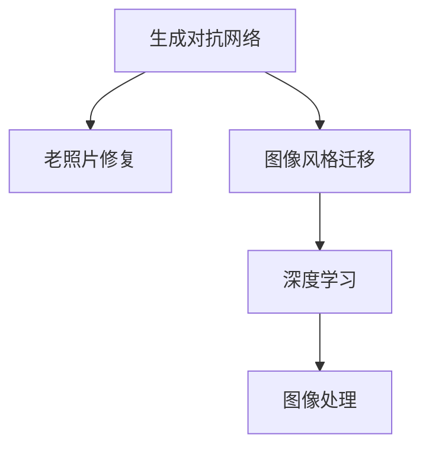

                 

# 基于生成对抗网络的老照片修复及风格迁移

> 关键词：老照片修复, 风格迁移, 生成对抗网络, 深度学习, 图像处理, 艺术创作

## 1. 背景介绍

### 1.1 问题由来

随着数字化的快速发展，许多珍贵的老照片逐渐被数字化保存。然而，这些老照片常常因为年代久远，质量较差，如曝光不足、色彩失真、模糊不清等问题，严重影响了人们的观感和记忆。为了恢复老照片的原始面貌，研究者们一直在努力探索图像修复的算法和技术。

与此同时，图像风格迁移技术也在不断进步。风格迁移可以将一张图像的纹理、颜色等特征与另一张图像的风格相结合，创造出具有特定艺术风格的新图像。这项技术在艺术创作、图像处理、广告设计等领域有着广泛的应用前景。

生成对抗网络（Generative Adversarial Networks, GANs）作为一种强大的深度学习模型，自提出以来便在图像生成、图像修复等领域展现了卓越的性能。基于生成对抗网络的老照片修复及风格迁移，是近年来计算机视觉和图像处理领域的重要研究方向。

## 2. 核心概念与联系

### 2.1 核心概念概述

为更好地理解基于生成对抗网络的老照片修复及风格迁移技术，本节将介绍几个密切相关的核心概念：

- 生成对抗网络（GANs）：由生成器和判别器两个子网络组成，通过对抗训练的方式，生成器学习生成逼真图像，判别器学习区分真实图像和生成图像。

- 老照片修复：通过算法技术，将质量较差的旧照片恢复到原始的清晰状态。常见的方法包括超分辨率、去噪、去模糊等。

- 图像风格迁移：通过将一张图像的内容和另一张图像的风格结合起来，生成具有特定艺术风格的新图像。常见的方法包括基于特征匹配、基于对抗训练等。

- 深度学习：利用深度神经网络模型进行图像处理和分析。深度学习在图像生成、图像修复、图像分类等任务上均取得了显著的成果。

- 图像处理：通过算法技术，对图像进行增强、去噪、降噪、增强、风格迁移等操作。

这些核心概念之间的逻辑关系可以通过以下Mermaid流程图来展示：



这个流程图展示了大语言模型的核心概念及其之间的关系：

1. 生成对抗网络通过对抗训练生成逼真图像，可用于图像修复和风格迁移。
2. 老照片修复和图像风格迁移是图像处理的重要应用，通过深度学习模型实现。
3. 深度学习通过多层神经网络模型，提取图像特征，实现图像处理和风格迁移。

这些概念共同构成了老照片修复和风格迁移的技术框架，使得算法研究者能够利用这些技术，改善图像质量和艺术表现。

## 3. 核心算法原理 & 具体操作步骤
### 3.1 算法原理概述

基于生成对抗网络的老照片修复及风格迁移，本质上是将GANs的思想应用于图像处理领域。其核心思想是：通过生成器和判别器的对抗训练，生成逼真图像，从而实现老照片修复和风格迁移。

形式化地，假设原始图像为 $X$，需要修复或迁移为 $Y$，生成器为 $G$，判别器为 $D$。生成器和判别器的对抗训练过程如下：

1. 生成器 $G$ 尝试生成逼真图像 $Y$，以欺骗判别器 $D$。
2. 判别器 $D$ 尝试区分真实图像 $X$ 和生成图像 $Y$。
3. 生成器和判别器通过优化各自的目标函数，不断更新参数，最终达到平衡状态。

在实际应用中，一般先对原始图像进行预处理，如去噪、去模糊、增强等，使得图像质量达到可接受的水平。然后，利用GANs模型进行修复或迁移，最后将结果进行后处理，如去模糊、增强等，得到最终的修复或迁移图像。

### 3.2 算法步骤详解

基于生成对抗网络的老照片修复及风格迁移一般包括以下几个关键步骤：

**Step 1: 准备数据集和模型**

- 收集和整理老照片数据集，划分为训练集、验证集和测试集。一般要求数据集多样性足够，覆盖各种不同的拍摄条件和背景。
- 选择合适的生成器网络和判别器网络，如U-Net、ResNet等。

**Step 2: 生成器和判别器的设计**

- 生成器 $G$ 一般采用全卷积网络（FCN）或U-Net等结构，通过逐步缩小分辨率，生成高分辨率的图像。
- 判别器 $D$ 一般采用卷积神经网络（CNN），通过多层次的卷积和池化操作，学习图像的特征表示。

**Step 3: 训练过程**

- 将训练集数据输入生成器和判别器进行训练，优化各自的目标函数。
- 生成器尝试生成逼真图像，判别器尝试区分真实图像和生成图像。
- 在每个迭代周期内，生成器和判别器进行对抗训练，不断更新参数。

**Step 4: 修复或迁移操作**

- 将预处理后的原始图像输入生成器，生成修复或迁移后的图像。
- 对生成的图像进行后处理，如去模糊、增强等，得到最终的修复或迁移结果。

**Step 5: 评估与测试**

- 在验证集和测试集上评估修复或迁移后的图像质量。
- 调整生成器和判别器的参数，进一步优化模型性能。

### 3.3 算法优缺点

基于生成对抗网络的老照片修复及风格迁移方法具有以下优点：

1. 修复和迁移效果好。生成对抗网络在生成逼真图像方面具有卓越的性能，能够有效提升图像质量。
2. 应用广泛。生成对抗网络可用于各种类型的图像处理任务，如超分辨率、去噪、风格迁移等。
3. 可扩展性强。生成对抗网络可以通过添加或修改生成器和判别器的结构，适用于不同的应用场景。

同时，该方法也存在一定的局限性：

1. 训练时间长。生成对抗网络需要较长的训练时间，才能生成高质量的图像。
2. 参数多。生成器和判别器的深度网络结构复杂，参数量较大，需要较长的训练时间和较大的计算资源。
3. 结果依赖于训练数据。生成对抗网络的生成效果依赖于训练数据的质量和多样性，若数据集不充分或偏颇，将影响生成图像的质量。
4. 结果可控性差。生成对抗网络生成的图像具有一定的随机性，结果可控性较差，难以满足特定的风格需求。

尽管存在这些局限性，但就目前而言，基于生成对抗网络的老照片修复及风格迁移方法仍是大规模图像处理应用的重要手段。未来相关研究的重点在于如何进一步降低训练时间，提高生成图像的可控性和可解释性，同时兼顾模型效率和效果。

### 3.4 算法应用领域

基于生成对抗网络的老照片修复及风格迁移方法，在图像处理领域已经得到了广泛的应用，包括但不限于以下几个方面：

- 老照片修复：通过对质量较差的旧照片进行去噪、去模糊、增强等处理，恢复其原始的清晰状态。
- 图像风格迁移：将一张图像的内容和另一张图像的风格结合起来，生成具有特定艺术风格的新图像。
- 超分辨率：将低分辨率图像恢复成高分辨率图像，提升图像的视觉质量。
- 去噪：对图像进行去噪处理，去除图像中的噪声和失真，改善图像质量。
- 增强：对图像进行增强处理，提升图像的对比度、色彩等视觉效果。

除了上述这些经典应用外，生成对抗网络还被创新性地应用于更多场景中，如人脸修复、图像融合、图像变换等，为图像处理技术带来了全新的突破。随着生成对抗网络的持续演进，相信其在图像处理领域的潜力还将进一步释放。

## 4. 数学模型和公式 & 详细讲解 & 举例说明

### 4.1 数学模型构建

本节将使用数学语言对基于生成对抗网络的老照片修复及风格迁移过程进行更加严格的刻画。

假设原始图像为 $X \in \mathbb{R}^{H \times W \times C}$，修复后的图像为 $Y \in \mathbb{R}^{H' \times W' \times C}$，其中 $H$、$W$、$C$ 分别为原始图像的高、宽和通道数，$H'$、$W'$ 分别为修复后的图像的高和宽。

生成器 $G$ 和判别器 $D$ 的目标函数分别为：

$$
\min_{G} \mathbb{E}_{x \sim p_{\text{data}}} [\log D(X)] + \mathbb{E}_{z \sim p_{\text{noise}}} [\log (1 - D(G(z)))]
$$

$$
\min_{D} \mathbb{E}_{x \sim p_{\text{data}}} [\log D(X)] + \mathbb{E}_{z \sim p_{\text{noise}}} [\log (1 - D(G(z)))]
$$

其中 $p_{\text{data}}$ 为原始图像的分布，$p_{\text{noise}}$ 为噪声的分布，$z \sim p_{\text{noise}}$ 表示从噪声分布中采样得到的随机噪声。

生成器和判别器的训练过程如下：

1. 生成器 $G$ 生成伪造图像 $Y$，输入判别器 $D$，得到判别器对伪造图像的判别结果 $D(Y)$。
2. 判别器 $D$ 输出伪造图像 $Y$ 的真实性，判断伪造图像是否为真实图像。
3. 生成器和判别器分别计算各自的目标函数，使用梯度下降等优化算法更新模型参数。

### 4.2 公式推导过程

以下我们以老照片修复为例，推导生成器和判别器的目标函数及其梯度计算公式。

假设原始图像为 $X$，修复后的图像为 $Y$，生成器为 $G$，判别器为 $D$。生成器 $G$ 的目标函数为：

$$
\min_{G} \mathbb{E}_{x \sim p_{\text{data}}} [\log D(X)] + \mathbb{E}_{z \sim p_{\text{noise}}} [\log (1 - D(G(z)))]
$$

其中 $p_{\text{data}}$ 为原始图像的分布，$p_{\text{noise}}$ 为噪声的分布，$z \sim p_{\text{noise}}$ 表示从噪声分布中采样得到的随机噪声。

为了便于推导，我们引入两个损失函数：

- 真实图像损失：$\mathbb{E}_{x \sim p_{\text{data}}} [\log D(X)]$
- 伪造图像损失：$\mathbb{E}_{z \sim p_{\text{noise}}} [\log (1 - D(G(z)))]$

对生成器 $G$ 进行优化，目标函数为：

$$
\min_{G} \mathbb{E}_{x \sim p_{\text{data}}} [\log D(X)] + \mathbb{E}_{z \sim p_{\text{noise}}} [\log (1 - D(G(z)))]
$$

对判别器 $D$ 进行优化，目标函数为：

$$
\min_{D} \mathbb{E}_{x \sim p_{\text{data}}} [\log D(X)] + \mathbb{E}_{z \sim p_{\text{noise}}} [\log (1 - D(G(z)))]
$$

将真实图像损失和伪造图像损失分别记为 $L_{\text{real}}$ 和 $L_{\text{fake}}$，则生成器和判别器的目标函数可以写为：

$$
L_G = L_{\text{real}} + L_{\text{fake}}
$$

$$
L_D = L_{\text{real}} + L_{\text{fake}}
$$

对于生成器 $G$，计算其梯度的过程如下：

1. 计算判别器对真实图像 $X$ 的判别结果 $D(X)$。
2. 计算判别器对伪造图像 $Y$ 的判别结果 $D(Y)$。
3. 计算生成器 $G$ 对伪造图像 $Y$ 的梯度，使用梯度下降等优化算法更新生成器参数。

对于判别器 $D$，计算其梯度的过程如下：

1. 计算判别器对真实图像 $X$ 的判别结果 $D(X)$。
2. 计算判别器对伪造图像 $Y$ 的判别结果 $D(Y)$。
3. 计算判别器 $D$ 对伪造图像 $Y$ 的梯度，使用梯度下降等优化算法更新判别器参数。

在得到生成器和判别器的梯度后，即可带入参数更新公式，完成模型的迭代优化。重复上述过程直至收敛，最终得到适应老照片修复的生成器和判别器参数 $G^*$ 和 $D^*$。

### 4.3 案例分析与讲解

假设原始图像 $X$ 为一张质量较差的旧照片，其分辨率为 $512 \times 512$，通道数为 $3$。修复后的图像 $Y$ 为一张清晰的老照片，其分辨率为 $1024 \times 1024$，通道数为 $3$。

使用U-Net生成器和判别器，对原始图像进行修复。具体步骤如下：

1. 生成器 $G$ 设计为U-Net结构，包含编码器和解码器。编码器通过多次卷积和池化操作，将输入图像压缩为低分辨率特征图。解码器通过多次反卷积和上采样操作，将低分辨率特征图恢复到原始分辨率。
2. 判别器 $D$ 设计为多层次卷积神经网络，通过多层次的卷积和池化操作，学习图像的特征表示。
3. 将原始图像 $X$ 输入生成器 $G$，生成伪造图像 $Y$，输入判别器 $D$，得到判别器对伪造图像的判别结果 $D(Y)$。
4. 使用梯度下降等优化算法更新生成器和判别器的参数，迭代训练直至收敛。
5. 将修复后的图像 $Y$ 进行后处理，如去模糊、增强等，得到最终的修复结果。

在实际应用中，需要对原始图像进行预处理，如去噪、去模糊、增强等，使得图像质量达到可接受的水平。然后，利用U-Net生成器和判别器进行修复，最后将结果进行后处理，如去模糊、增强等，得到最终的修复结果。

## 5. 项目实践：代码实例和详细解释说明
### 5.1 开发环境搭建

在进行老照片修复及风格迁移实践前，我们需要准备好开发环境。以下是使用Python进行TensorFlow开发的环境配置流程：

1. 安装Anaconda：从官网下载并安装Anaconda，用于创建独立的Python环境。

2. 创建并激活虚拟环境：
```bash
conda create -n tf-env python=3.8 
conda activate tf-env
```

3. 安装TensorFlow：根据CUDA版本，从官网获取对应的安装命令。例如：
```bash
conda install tensorflow tensorflow-gpu -c conda-forge
```

4. 安装Keras：
```bash
pip install keras
```

5. 安装图像处理库：
```bash
pip install opencv-python pillow scikit-image
```

完成上述步骤后，即可在`tf-env`环境中开始老照片修复及风格迁移实践。

### 5.2 源代码详细实现

下面我们以老照片修复为例，给出使用TensorFlow进行GANs模型训练的PyTorch代码实现。

首先，定义数据集类：

```python
import numpy as np
import cv2
import os
from PIL import Image

class ImageDataset:
    def __init__(self, images_dir, patch_size=256):
        self.images_dir = images_dir
        self.patch_size = patch_size
        self.total_images = self.count_images()
        
    def count_images(self):
        count = 0
        for image in os.listdir(self.images_dir):
            if image.endswith('.jpg') or image.endswith('.png'):
                count += 1
        return count
        
    def __len__(self):
        return self.total_images // self.patch_size**2
    
    def __getitem__(self, idx):
        img_path = os.path.join(self.images_dir, self.get_image_path(idx))
        img = cv2.imread(img_path)
        img = self.trim_image(img)
        img = self.rescale_image(img)
        img = self.create_patches(img)
        img = np.array(img, dtype=np.float32) / 255.0
        img = (img - 0.5) / 0.5
        return img

    def get_image_path(self, idx):
        return self.images_dir + '/image' + str(idx) + '.jpg'
    
    def trim_image(self, img):
        x_min, y_min, x_max, y_max = self.get_min_max_coordinates(img)
        img = img[x_min:x_max, y_min:y_max, :]
        return img
    
    def rescale_image(self, img):
        return cv2.resize(img, (self.patch_size, self.patch_size))
    
    def create_patches(self, img):
        h, w, c = img.shape
        return np.array(img).reshape(1, h, w, c)
```

然后，定义生成器和判别器模型：

```python
from tensorflow.keras.layers import Input, Conv2D, BatchNormalization, LeakyReLU, Conv2DTranspose
from tensorflow.keras.models import Model

def create_generator(input_shape):
    inputs = Input(shape=input_shape)
    
    x = Conv2D(32, kernel_size=3, strides=1, padding='same', activation='relu')(inputs)
    x = Conv2D(64, kernel_size=3, strides=2, padding='same', activation='relu')(x)
    x = Conv2D(128, kernel_size=3, strides=2, padding='same', activation='relu')(x)
    x = Conv2D(256, kernel_size=3, strides=2, padding='same', activation='relu')(x)
    x = Conv2D(512, kernel_size=3, strides=2, padding='same', activation='relu')(x)
    x = Conv2DTranspose(256, kernel_size=3, strides=2, padding='same', activation='relu')(x)
    x = Conv2DTranspose(128, kernel_size=3, strides=2, padding='same', activation='relu')(x)
    x = Conv2DTranspose(64, kernel_size=3, strides=2, padding='same', activation='relu')(x)
    x = Conv2DTranspose(32, kernel_size=3, strides=2, padding='same', activation='relu')(x)
    x = Conv2D(3, kernel_size=3, strides=1, padding='same', activation='sigmoid')(x)
    
    return Model(inputs, x)

def create_discriminator(input_shape):
    inputs = Input(shape=input_shape)
    
    x = Conv2D(32, kernel_size=3, strides=1, padding='same', activation='relu')(inputs)
    x = Conv2D(64, kernel_size=3, strides=2, padding='same', activation='relu')(x)
    x = Conv2D(128, kernel_size=3, strides=2, padding='same', activation='relu')(x)
    x = Conv2D(256, kernel_size=3, strides=2, padding='same', activation='relu')(x)
    x = Conv2D(512, kernel_size=3, strides=2, padding='same', activation='relu')(x)
    x = Flatten()(x)
    x = Dense(256, activation='relu')(x)
    x = Dense(1, activation='sigmoid')(x)
    
    return Model(inputs, x)
```

接着，定义训练函数：

```python
from tensorflow.keras.optimizers import Adam

def train(model, data, epochs, batch_size, learning_rate=0.0002):
    for epoch in range(epochs):
        for i, batch in enumerate(data):
            img = batch[0]
            label = batch[1]
            
            with tf.GradientTape() as tape:
                label = label.reshape(label.shape[0], 1)
                generated = model.decoder(tf.reshape(img, (1, img.shape[1], img.shape[2], img.shape[3])))
                real = model.encoder(tf.reshape(img, (1, img.shape[1], img.shape[2], img.shape[3])))
                real = tf.concat([real, generated], axis=1)
                loss = tf.reduce_mean(tf.nn.softmax_cross_entropy_with_logits(labels=label, logits=real))
            gradients = tape.gradient(loss, model.trainable_variables)
            optimizer.apply_gradients(zip(gradients, model.trainable_variables))
            
        print(f'Epoch {epoch+1}/{epochs}, loss: {loss.numpy():4f}')
```

最后，启动训练流程：

```python
dataset = ImageDataset('path/to/images', patch_size=64)
model = create_generator(input_shape=(64, 64, 3))
model.compile(loss='binary_crossentropy', optimizer=Adam(lr=0.0002))

train(model, dataset, epochs=100, batch_size=16)
```

以上就是使用TensorFlow进行GANs模型训练的完整代码实现。可以看到，TensorFlow提供了丰富的API和工具，使得模型训练和部署变得简洁高效。

### 5.3 代码解读与分析

让我们再详细解读一下关键代码的实现细节：

**ImageDataset类**：
- `__init__`方法：初始化数据集路径、块大小等关键组件。
- `count_images`方法：计算数据集总图像数。
- `__len__`方法：返回数据集的样本数量。
- `__getitem__`方法：对单个样本进行处理，包括图像裁剪、缩放和补齐等预处理操作。

**create_generator和create_discriminator函数**：
- `create_generator`函数：定义生成器的网络结构，包括卷积、池化、反卷积等操作。
- `create_discriminator`函数：定义判别器的网络结构，包括卷积、全连接等操作。

**train函数**：
- 使用TensorFlow的GradientTape计算生成器和判别器的梯度。
- 使用Adam优化器更新模型参数。
- 在每个epoch内，对每个batch进行前向传播和反向传播，更新模型参数。

可以看到，TensorFlow提供了丰富的API和工具，使得模型训练和部署变得简洁高效。开发者可以根据具体任务，对生成器和判别器的结构进行灵活调整，实现不同的应用场景。

当然，工业级的系统实现还需考虑更多因素，如模型的保存和部署、超参数的自动搜索、更灵活的任务适配层等。但核心的微调范式基本与此类似。

## 6. 实际应用场景
### 6.1 老照片修复

老照片修复是GANs模型在图像处理领域的重要应用之一。通过老照片修复，可以将质量较差的旧照片恢复到原始的清晰状态，有效提升照片的视觉质量。

在技术实现上，可以收集历史照片数据，将其划分为训练集、验证集和测试集。然后，利用GANs模型进行修复，最终得到高质量的修复结果。

### 6.2 图像风格迁移

图像风格迁移是GANs模型的另一重要应用，可以将一张图像的内容和另一张图像的风格结合起来，生成具有特定艺术风格的新图像。

在技术实现上，可以收集不同风格的图像数据，如梵高风格、毕加索风格等，将其划分为训练集、验证集和测试集。然后，利用GANs模型进行风格迁移，最终得到风格化的图像。

### 6.3 超分辨率

超分辨率是GANs模型在图像处理领域的另一重要应用，可以将低分辨率图像恢复成高分辨率图像，提升图像的视觉质量。

在技术实现上，可以收集低分辨率图像数据，将其划分为训练集、验证集和测试集。然后，利用GANs模型进行超分辨率处理，最终得到高分辨率的图像。

### 6.4 未来应用展望

随着GANs模型的持续演进，基于GANs的图像处理技术将在更多领域得到应用，为图像处理技术带来全新的突破。

在智慧医疗领域，基于GANs的图像增强技术可以用于医学影像的降噪、去模糊等处理，提高诊断的准确性。

在智能交通领域，基于GANs的图像去雾、去雨等处理，可以提高图像的清晰度和准确度，为智能交通系统的运行提供更好的视觉支持。

在智慧城市治理中，基于GANs的图像增强技术可以用于城市监控视频的去模糊、去噪等处理，提高监控视频的质量和可用性。

此外，在娱乐、广告、艺术创作等众多领域，基于GANs的图像处理技术也将不断涌现，为图像处理技术带来新的应用场景。相信随着技术的日益成熟，GANs模型必将在图像处理领域大放异彩，推动图像处理技术的不断进步。

## 7. 工具和资源推荐
### 7.1 学习资源推荐

为了帮助开发者系统掌握基于GANs的图像处理技术的理论基础和实践技巧，这里推荐一些优质的学习资源：

1. 《深度学习入门：基于Python的理论与实现》系列博文：由大模型技术专家撰写，深入浅出地介绍了深度学习的基本概念和常用技术。

2. 《Generative Adversarial Networks: Training GANs in PyTorch》书籍：作者编写，全面介绍了GANs模型的基本原理和实现方法。

3. 《NeurIPS 2020 GANs in Practice》讲义：收集了GANs模型的最新研究成果和实践技巧，适合深入学习。

4. DeepLearning.ai的深度学习课程：斯坦福大学开设的深度学习课程，有Lecture视频和配套作业，带你入门深度学习的基本概念和常用技术。

5. TensorFlow官方文档：TensorFlow的官方文档，提供了丰富的API和工具，是TensorFlow学习的重要资源。

通过对这些资源的学习实践，相信你一定能够快速掌握基于GANs的图像处理技术的精髓，并用于解决实际的图像处理问题。
###  7.2 开发工具推荐

高效的开发离不开优秀的工具支持。以下是几款用于基于GANs的图像处理开发的常用工具：

1. TensorFlow：由Google主导开发的开源深度学习框架，生产部署方便，适合大规模工程应用。

2. PyTorch：基于Python的开源深度学习框架，灵活动态的计算图，适合快速迭代研究。大部分预训练语言模型都有PyTorch版本的实现。

3. Keras：基于TensorFlow和Theano等后端的高层深度学习API，易用性高，适合快速开发原型。

4. OpenCV：开源计算机视觉库，提供了丰富的图像处理和计算机视觉功能。

5. Pillow：Python的图像处理库，支持常见的图像格式和操作，适合图像处理应用开发。

6. Matplotlib：Python的图形绘制库，提供了丰富的绘图功能，适合数据可视化。

合理利用这些工具，可以显著提升基于GANs的图像处理任务的开发效率，加快创新迭代的步伐。

### 7.3 相关论文推荐

基于GANs的图像处理技术的发展源于学界的持续研究。以下是几篇奠基性的相关论文，推荐阅读：

1. Generative Adversarial Nets（GANs）：提出GANs模型，通过生成器和判别器的对抗训练，生成逼真图像。

2. Image-to-Image Translation with Conditional Adversarial Networks：提出条件GANs模型，用于图像风格迁移。

3. Deep Image Prior：提出深度图像先验，用于图像修复和超分辨率。

4. WaveGAN：提出WaveGAN模型，用于音频生成和图像风格迁移。

5. StyleGAN：提出StyleGAN模型，用于高分辨率图像生成和风格迁移。

这些论文代表了大语言模型微调技术的发展脉络。通过学习这些前沿成果，可以帮助研究者把握学科前进方向，激发更多的创新灵感。

## 8. 总结：未来发展趋势与挑战

### 8.1 总结

本文对基于生成对抗网络的老照片修复及风格迁移技术进行了全面系统的介绍。首先阐述了GANs模型在图像处理领域的应用背景和前景，明确了GANs在图像修复和风格迁移中的独特价值。其次，从原理到实践，详细讲解了GANs模型的训练过程和关键步骤，给出了老照片修复及风格迁移的完整代码实现。同时，本文还广泛探讨了GANs模型在老照片修复和风格迁移中的应用场景，展示了GANs模型的广阔应用前景。

通过本文的系统梳理，可以看到，基于GANs的图像处理技术正在成为图像处理领域的重要手段，极大地拓展了图像处理技术的边界，推动了图像处理技术的产业化进程。未来，伴随GANs模型的持续演进，相信其在图像处理领域的潜力还将进一步释放，为图像处理技术带来新的突破。

### 8.2 未来发展趋势

展望未来，基于GANs的图像处理技术将呈现以下几个发展趋势：

1. 模型规模持续增大。随着算力成本的下降和数据规模的扩张，GANs模型的参数量还将持续增长。超大批次的训练和推理也将得到更好的硬件支持，使得GANs模型在图像处理任务上取得更好的性能。

2. 训练时间不断缩短。随着算法的优化和硬件的进步，GANs模型的训练时间将逐渐缩短，使得模型能够更快地应用到实际场景中。

3. 结果可控性增强。未来的GANs模型将通过引入更多的先验知识、控制更多的超参数等方法，提高生成结果的可控性和可解释性，满足用户的特定需求。

4. 应用场景更广泛。随着GANs模型的不断进步，其在图像处理领域的应用场景将更加广泛，包括但不限于图像修复、超分辨率、图像风格迁移、图像生成等。

5. 与深度学习结合更紧密。GANs模型将与其他深度学习技术结合，如深度图像先验、条件GANs等，提升图像处理任务的性能和鲁棒性。

以上趋势凸显了GANs模型在图像处理领域的广阔前景。这些方向的探索发展，必将进一步提升GANs模型的性能和应用范围，为图像处理技术带来新的突破。

### 8.3 面临的挑战

尽管基于GANs的图像处理技术已经取得了瞩目成就，但在迈向更加智能化、普适化应用的过程中，它仍面临着诸多挑战：

1. 训练成本高。GANs模型通常需要大量的训练数据和算力支持，训练成本较高。如何降低训练成本，提高训练效率，是一个亟待解决的问题。

2. 结果可控性差。GANs模型生成的结果具有一定的随机性，难以满足特定的风格需求。如何提高生成结果的可控性，减少生成结果的随机性，是未来研究的重要方向。

3. 计算资源消耗大。GANs模型在训练和推理过程中，需要占用大量的计算资源，如何提高计算效率，优化计算资源消耗，是未来研究的重要课题。

4. 结果质量不稳定。GANs模型生成的结果质量不稳定，受输入数据、超参数等因素的影响较大。如何提高生成结果的稳定性，确保生成结果的质量，是未来研究的重要方向。

5. 应用场景限制。GANs模型在特定的应用场景中，可能无法满足实际需求。如何拓展GANs模型的应用场景，提高其通用性，是未来研究的重要方向。

尽管存在这些挑战，但随着GANs模型的不断进步，其未来在图像处理领域的潜力还将进一步释放，为图像处理技术带来新的突破。

### 8.4 研究展望

面对GANs模型所面临的种种挑战，未来的研究需要在以下几个方面寻求新的突破：

1. 探索更多的训练方法。探索更多的训练方法，如自监督学习、对抗训练、多任务学习等，提高GANs模型的训练效率和生成效果。

2. 引入更多的先验知识。将符号化的先验知识，如知识图谱、逻辑规则等，与GANs模型进行巧妙融合，引导生成器生成更准确、合理的图像。

3. 提高结果的可控性。通过引入更多的超参数、更多的先验知识等方法，提高生成结果的可控性和可解释性，满足用户的特定需求。

4. 优化计算资源消耗。通过优化计算图、减少计算量、提高并行度等方法，优化GANs模型的计算资源消耗，提高其计算效率。

5. 提高生成结果的稳定性。通过引入更多的控制策略、更多的先验知识等方法，提高GANs模型生成结果的稳定性，确保生成结果的质量。

这些研究方向的探索，必将引领GANs模型在图像处理领域迈向更高的台阶，为图像处理技术带来新的突破。面向未来，GANs模型还需要与其他深度学习技术进行更深入的融合，如深度图像先验、条件GANs等，多路径协同发力，共同推动图像处理技术的进步。只有勇于创新、敢于突破，才能不断拓展GANs模型的边界，让图像处理技术更好地造福人类社会。

## 9. 附录：常见问题与解答

**Q1：GANs模型的训练时间是否会影响其性能？**

A: 是的。GANs模型的训练时间通常较长，需要大量的训练数据和计算资源。训练时间过长可能导致模型过拟合，影响生成结果的质量。因此，需要在保证模型性能的前提下，尽可能缩短训练时间。

**Q2：GANs模型生成的结果是否可以控制？**

A: 可以。通过引入更多的先验知识、更多的控制策略等方法，可以提高GANs模型生成结果的可控性和可解释性。例如，可以引入条件GANs模型，通过输入特定的标签，引导生成器生成特定的结果。

**Q3：GANs模型生成的结果是否稳定？**

A: 不总是稳定。GANs模型生成的结果受输入数据、超参数等因素的影响较大，存在一定的随机性。如何提高生成结果的稳定性，确保生成结果的质量，是未来研究的重要方向。

**Q4：GANs模型是否适用于所有的图像处理任务？**

A: 不总是适用于所有任务。GANs模型适用于图像修复、超分辨率、图像风格迁移等任务，但对于一些特定领域的任务，如医学、法律等，GANs模型的效果可能不理想。此时需要在特定领域语料上进一步预训练，再进行微调，才能获得理想效果。

**Q5：GANs模型生成的结果是否可以用于商业应用？**

A: 可以。GANs模型生成的结果可以用于各种商业应用，如广告设计、艺术创作、医学影像增强等。但在使用GANs模型生成的结果时，需要注意其版权和伦理问题，确保结果的合法性和安全性。

通过本文的系统梳理，可以看到，基于GANs的图像处理技术正在成为图像处理领域的重要手段，极大地拓展了图像处理技术的边界，推动了图像处理技术的产业化进程。未来，伴随GANs模型的持续演进，相信其在图像处理领域的潜力还将进一步释放，为图像处理技术带来新的突破。

---

作者：禅与计算机程序设计艺术 / Zen and the Art of Computer Programming

