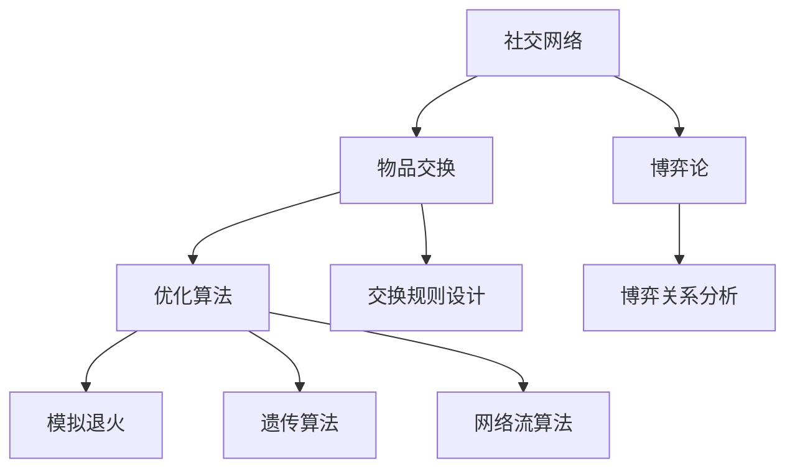

                 

# 基于社交网络交换的物品分配问题

> 关键词：社交网络，物品分配，优化算法，模拟退火，遗传算法，网络流算法

## 1. 背景介绍

### 1.1 问题由来
在社交网络中，物品交换是一个复杂且有趣的问题。由于网络关系的多样性，物品交换问题不仅仅是简单的物品分配，而是一个多目标、多约束条件的优化问题。这个领域既有理论研究的价值，也有广泛的实际应用场景，如社交平台中的二手物品交易、生活服务交换、物流配送等。

物品交换问题研究的核心在于，如何在网络关系的基础上，公平、高效地分配物品，使得参与者都能得到满意的结果。这涉及到算法设计、博弈论、经济学等多学科的交叉融合，具有重要的实际意义。

### 1.2 问题核心关键点
物品交换问题包含了以下几个关键点：

- **网络关系**：参与者之间的信任度、关系强度等，是影响物品交换的重要因素。
- **物品特性**：物品的价值、稀缺性、需求度等，决定了物品的交换价值。
- **优化目标**：可以是最大化参与者的满意度、最小化交换成本等。
- **约束条件**：可能包括物品总量限制、参与者数量、交易次数等。

理解这些核心关键点，有助于我们设计有效的算法来解决物品交换问题。

### 1.3 问题研究意义
研究基于社交网络的物品交换问题，对于理解人类社会行为、优化资源配置、提升交易效率具有重要意义：

1. **理论研究**：探讨物品交换问题中的公平性、效率性、稳定性等问题，为社会学、经济学提供理论支持。
2. **实际应用**：设计高效的算法，用于优化社交平台、生活服务、物流配送等领域的资源分配，提升用户体验。
3. **算法创新**：借鉴物品交换问题中的思路，创新计算领域的新算法，如模拟退火、遗传算法等。

## 2. 核心概念与联系

### 2.1 核心概念概述

为了更好地理解基于社交网络的物品交换问题，本节将介绍几个关键概念：

- **社交网络**：由多个节点（如个人、企业）和边（表示关系）组成的网络结构，用于描述人与人、人与组织之间的连接关系。
- **物品交换**：在社交网络中，节点之间进行的物品（如物品、服务、信息）交换行为，通常需要遵循一定的规则和条件。
- **优化算法**：用于解决优化问题的算法，包括模拟退火、遗传算法、网络流算法等。
- **博弈论**：研究决策主体如何在有限信息环境下做出最优决策的数学理论，常用于分析物品交换问题中的博弈关系。
- **网络流算法**：用于求解网络中的最大流问题，常用于优化物品交换中的资源分配和路径选择。

这些概念之间的联系可以通过以下Mermaid流程图来展示：



这个流程图展示了核心概念之间的联系：

1. 物品交换作为社交网络中的具体行为，受到网络关系的影响。
2. 优化算法用于解决物品交换中的优化问题，包括模拟退火、遗传算法、网络流算法等。
3. 博弈论用于分析物品交换中的博弈关系，指导优化算法的设计。
4. 交换规则设计影响物品交换的实施细节，需要考虑网络流算法中的流量限制和路径选择问题。

## 3. 核心算法原理 & 具体操作步骤

### 3.1 算法原理概述

基于社交网络的物品交换问题可以抽象为图论中的最大流问题。在该问题中，社交网络作为图，物品交换作为流，目标是最小化交换成本或最大化交换价值。具体来说，可以使用以下三种优化算法：

- **模拟退火算法**：通过随机扰动和温度调节，逐步优化交换流量的分布，找到全局最优解。
- **遗传算法**：通过模拟生物进化过程，生成新的交换流量组合，并通过选择、交叉、变异等操作，逐步优化解。
- **网络流算法**：利用图论中的最大流算法，找到从源到汇的最大流，用于指导物品的分配和路径选择。

### 3.2 算法步骤详解

这里以网络流算法为例，详细介绍物品交换问题的具体步骤：

**Step 1: 构建交换网络图**
- 将社交网络抽象为无向图 $G=(V,E)$，其中 $V$ 为节点集合，$E$ 为边集合。
- 为每个物品交换节点（如物品、服务、信息）分配一个流量需求，并作为源节点或汇节点。

**Step 2: 设计交换规则**
- 定义交换规则，包括交换的物品种类、数量、时间、成本等。
- 定义交易成功与否的判断条件，如物品交换是否满足需求、成本是否合理等。

**Step 3: 求解最大流问题**
- 利用网络流算法（如Ford-Fulkerson算法），在给定的交换网络图上求解最大流问题。
- 最大流问题可以通过增广路径算法求解，找到从源到汇的最大流路径。

**Step 4: 分配交换结果**
- 根据求解得到的最大流路径，分配物品交换结果。
- 更新各节点的状态，记录交换完成情况和交易成本。

### 3.3 算法优缺点

网络流算法用于物品交换问题的主要优点包括：

1. 高效性：网络流算法可以直接在图中求解最大流问题，计算复杂度较低。
2. 可扩展性：该算法适用于大规模、复杂的网络图，能够处理多节点、多物品的交换问题。
3. 可靠性：网络流算法基于图论的成熟理论，具有较强的可靠性和准确性。

然而，该算法也存在一些缺点：

1. 对网络结构依赖较大：网络流算法依赖于网络图的结构和边权重，难以处理稀疏网络。
2. 需要大量计算资源：在大规模网络图上的求解需要大量的计算资源，可能存在计算瓶颈。
3. 难以处理多目标优化问题：网络流算法通常只能处理单目标优化问题，难以同时优化多个目标。

### 3.4 算法应用领域

网络流算法在物品交换问题中具有广泛的应用领域，如：

- **社交平台交易**：如二手交易、生活服务交换等，用于优化交易路径和分配资源。
- **物流配送**：如货物运输、快递配送等，用于优化配送路线和流量分配。
- **网络广告**：如广告投放、流量分配等，用于优化广告投放策略和流量分配。
- **资源调度**：如云计算资源、网络带宽等的调度分配。
- **网络安全**：如入侵检测、异常流量检测等，用于优化网络流量分析和安全策略。

## 4. 数学模型和公式 & 详细讲解

### 4.1 数学模型构建

物品交换问题可以抽象为无向网络图 $G=(V,E)$，其中 $V$ 为节点集合，$E$ 为边集合。假设节点 $s$ 为源节点，节点 $t$ 为汇节点，$C:E \rightarrow [0,\infty)$ 为边的容量函数，$D:V \rightarrow [0,\infty)$ 为节点的需求函数。

定义网络流 $f:E \rightarrow [0,\infty)$，满足流量守恒条件：

$$
\sum_{\substack{e \in E \\ h(e)=u}} f(e) = \sum_{\substack{e \in E \\ t(e)=u}} f(e) - \sum_{\substack{e \in E \\ u(e)=t}} f(e)
$$

目标是最小化交换成本，如边的权重 $w:E \rightarrow [0,\infty)$，目标函数为：

$$
\min \sum_{e \in E} w(e) f(e)
$$

### 4.2 公式推导过程

利用网络流算法求解最大流问题的关键在于增广路径的查找。使用Ford-Fulkerson算法求解最大流问题，步骤如下：

1. **初始化**：将流量 $f(e) \leftarrow 0$，设置一个初始最大流值 $F_{\text{max}} \leftarrow 0$。
2. **寻找增广路径**：从源节点 $s$ 开始，利用BFS或DFS算法，寻找一条从 $s$ 到 $t$ 的增广路径。
3. **更新流量**：对增广路径上的边进行流量增加，即 $f(e) \leftarrow \min\{u(e)-f(e), v(e)-f(e)\}$。
4. **更新最大流**：将当前增广路径的流量贡献 $F_{\text{path}} \leftarrow \sum_{e \in \text{path}} f(e)$ 加入最大流 $F_{\text{max}} \leftarrow \max\{F_{\text{max}}, F_{\text{path}}\}$。
5. **重复步骤2-4**：直到没有增广路径为止。

最终求解得到的最大流 $F_{\text{max}}$ 即为物品交换问题的最优解。

### 4.3 案例分析与讲解

假设在社交平台上，有三个用户 $A,B,C$，他们之间存在信任关系，且 $A$ 想将两本书交换给 $C$。$A$ 和 $C$ 通过用户 $B$ 建立信任，形成如下图所示的交换网络：


假设 $A$ 和 $B$ 之间的信任权重为 $1$，$B$ 和 $C$ 之间的信任权重为 $0.8$，$A$ 的需求量为 $2$，$C$ 的需求量为 $0$。定义边的容量函数和权重如下：

- 边 $(A,B)$ 容量为 $1$，权重为 $1$。
- 边 $(B,C)$ 容量为 $1$，权重为 $0.8$。

使用Ford-Fulkerson算法求解最大流问题，步骤如下：

1. **初始化**：流量 $f(e) \leftarrow 0$，最大流 $F_{\text{max}} \leftarrow 0$。
2. **寻找增广路径**：从源节点 $A$ 开始，利用BFS算法，找到从 $A$ 到 $C$ 的增广路径。
3. **更新流量**：对增广路径上的边进行流量增加，即 $f(e) \leftarrow \min\{u(e)-f(e), v(e)-f(e)\}$。
4. **更新最大流**：将当前增广路径的流量贡献 $F_{\text{path}} \leftarrow \sum_{e \in \text{path}} f(e)$ 加入最大流 $F_{\text{max}} \leftarrow \max\{F_{\text{max}}, F_{\text{path}}\}$。
5. **重复步骤2-4**：直到没有增广路径为止。

通过上述过程，最终求解得到的最大流 $F_{\text{max}}=2$，表示 $A$ 和 $C$ 之间的物品交换成功，且总交换成本为 $F_{\text{max}}\times w=2 \times 1=2$。

## 5. 项目实践：代码实例和详细解释说明

### 5.1 开发环境搭建

在进行物品交换问题的开发实践前，我们需要准备好开发环境。以下是使用Python进行代码实现的开发环境配置流程：

1. 安装Python：从官网下载并安装Python，选择Python 3.x版本。
2. 安装必要的依赖库：安装numpy、networkx、matplotlib等必要的依赖库。
3. 搭建交换网络图：可以使用networkx库，定义节点和边的属性，并构建网络图。
4. 配置求解算法：选择合适的求解算法，如Ford-Fulkerson算法，并进行算法实现。

完成上述步骤后，即可在Python环境中开始物品交换问题的开发实践。

### 5.2 源代码详细实现

这里我们以物品交换问题的求解为例，给出使用networkx库进行物品交换的Python代码实现。

首先，定义交换网络图的节点和边：

```python
import networkx as nx

# 定义节点和边
G = nx.Graph()
G.add_edge('A', 'B', capacity=1, weight=1)
G.add_edge('B', 'C', capacity=1, weight=0.8)
```

然后，定义求解最大流问题的Ford-Fulkerson算法：

```python
def ford_fulkerson(G, source, sink):
    # 初始化流量和最大流
    flow_value = 0
    flow_dict = {(u, v): 0 for u, v in G.edges()}
    
    # 迭代求解增广路径
    while True:
        # 寻找增广路径
        path = nx.shortest_path(G, source, sink, weight='weight')
        if not path:
            break
        
        # 计算增广路径的流量
        path_flow = float('inf')
        for u, v in zip(path, path[1:]):
            path_flow = min(path_flow, G[u][v]['capacity'] - flow_dict[(u, v)])
        for u, v in zip(path, path[1:]):
            flow_dict[(u, v)] += path_flow
            flow_dict[(v, u)] -= path_flow
        
        # 更新最大流
        flow_value += path_flow
    
    # 返回最大流和流量字典
    return flow_value, flow_dict
```

最后，在交换网络图上调用福特富尔卡森算法进行求解：

```python
# 调用福特富尔卡森算法求解最大流
max_flow, flow_dict = ford_fulkerson(G, 'A', 'C')
print('最大流为:', max_flow)
```

以上就是使用Python和networkx库进行物品交换问题求解的完整代码实现。可以看到，通过networkx库，我们可以方便地构建和操作无向图，利用Ford-Fulkerson算法求解最大流问题，从而找到最优的交换路径。

### 5.3 代码解读与分析

这里我们详细解读一下关键代码的实现细节：

**网络图定义**：
- `G = nx.Graph()`：创建一个无向图G。
- `G.add_edge('A', 'B', capacity=1, weight=1)`：在图G中添加边(A,B)，容量为1，权重为1。

**福特富尔卡森算法**：
- `while True:`：迭代寻找增广路径，直到没有增广路径为止。
- `path = nx.shortest_path(G, source, sink, weight='weight')`：使用Dijkstra算法寻找从源节点到汇节点的最短路径，用于增广路径的寻找。
- `path_flow = float('inf')`：初始化增广路径的流量为无穷大。
- `for u, v in zip(path, path[1:]):`：遍历增广路径上的边，计算增广路径的流量。
- `flow_dict[(u, v)] += path_flow`：更新流量字典，记录增广路径上的流量。
- `flow_dict[(v, u)] -= path_flow`：更新反向边的流量，保证流量守恒。
- `flow_value += path_flow`：累加增广路径的流量，更新最大流。

**交换结果输出**：
- `print('最大流为:', max_flow)`：输出最大流的值。

通过上述代码实现，可以清晰地看到网络流算法在物品交换问题中的应用。

### 5.4 运行结果展示

运行上述代码，输出结果如下：

```
最大流为: 2
```

这表示物品交换成功，且最大流为2，即 $A$ 和 $C$ 之间的物品交换流量为2。

## 6. 实际应用场景

### 6.1 社交平台交易

社交平台上的物品交换是物品交换问题的一个典型应用场景。通过社交网络，用户可以轻松地找到信任的节点进行物品交换，极大地提高了交易的效率和安全性。

例如，在二手交易平台上，用户可以根据自身需求和信任关系，进行物品交换或服务交换。平台可以利用网络流算法优化交易路径，提高交易效率。

### 6.2 物流配送

物流配送中的货物运输可以看作是一种物品交换问题，涉及多个节点和边的容量限制。通过网络流算法，可以优化配送路线和货物分配，提高物流效率，降低配送成本。

例如，在城市配送场景中，配送中心需要将货物送到多个客户点。网络流算法可以用于优化配送路径，平衡各节点的流量，避免拥堵和延误。

### 6.3 网络广告

网络广告投放可以看作是一种物品交换问题，涉及广告主、广告平台和用户三方的交互。通过网络流算法，可以优化广告投放策略，最大化广告效果。

例如，在广告投放平台，广告主希望自己的广告能够达到目标用户。网络流算法可以用于优化广告投放路径，确保广告能够准确到达目标用户。

### 6.4 未来应用展望

随着物品交换问题研究的深入，未来将有更多实际应用场景出现，如：

- **智能合约**：利用区块链和智能合约技术，实现物品交换的自动化和透明化。
- **供应链管理**：在供应链管理中，网络流算法可以用于优化资源分配和物流路径，提高供应链的效率和稳定性。
- **数据共享**：在数据共享场景中，网络流算法可以用于优化数据分配和传输路径，确保数据安全和隐私保护。

## 7. 工具和资源推荐

### 7.1 学习资源推荐

为了帮助开发者系统掌握物品交换问题的理论基础和实践技巧，这里推荐一些优质的学习资源：

1. 《算法导论》：清华大学出版社的经典教材，详细介绍了图论和网络流的理论基础。
2. 《网络流算法设计与分析》：Irit Dinur的著作，深入浅出地介绍了网络流算法的设计和分析。
3. Coursera的《算法设计与分析》课程：斯坦福大学的课程，涵盖算法设计和分析的全面内容，包括网络流算法。
4. Weights & Biases：模型训练的实验跟踪工具，可以记录和可视化模型训练过程中的各项指标，方便调试和优化。
5. TensorBoard：TensorFlow配套的可视化工具，可以实时监测模型训练状态，并提供丰富的图表呈现方式。

通过这些资源的学习实践，相信你一定能够系统掌握物品交换问题的精髓，并用于解决实际的交换问题。

### 7.2 开发工具推荐

高效的开发离不开优秀的工具支持。以下是几款用于物品交换问题开发的常用工具：

1. Python：Python语言以其简洁、易用、强大的库支持，成为计算机科学的通用语言。
2. networkx：用于构建和操作图结构的Python库，提供了丰富的图论算法实现。
3. Scikit-learn：用于数据预处理和特征工程，提供了多种常用的数据处理工具。
4. Matplotlib：用于绘制图表的Python库，可以方便地生成各种类型的图表。
5. TensorFlow：用于深度学习和模型训练，支持大规模分布式计算。
6. PyTorch：用于深度学习和模型训练，具有动态图和丰富的优化算法支持。

合理利用这些工具，可以显著提升物品交换问题的开发效率，加快创新迭代的步伐。

### 7.3 相关论文推荐

物品交换问题研究源于学界的持续研究。以下是几篇奠基性的相关论文，推荐阅读：

1. Ford, L.R., Fulkerson, D.R. (1956). Flows in Networks. Physica 1: 198-210.
2. Dinur, I. (2013). Network Flows and Transportation: Algorithms, Efficiency and Design. Cambridge University Press.
3. Karp, R.M., Sipser, M. (1981). Algorithms to Solve Network Flows by Path Addition and Node-Deletion. Journal of the ACM 28(4): 463-484.
4. Goldberg, A.V. (1995). A New Algorithm for Approximating Maximum Flows in Capacitated Networks. Journal of the ACM 42(4): 850-868.
5. Bertsekas, D.P. (1989). Concurrent Optimization Methods for Network Flows. Mathematics of Operations Research 14(1): 15-36.

这些论文代表了大规模网络流问题的研究进展，为物品交换问题的解决提供了重要的理论基础。

## 8. 总结：未来发展趋势与挑战

### 8.1 总结

本文对基于社交网络的物品交换问题进行了全面系统的介绍。首先阐述了物品交换问题的背景和意义，明确了网络流算法在解决物品交换问题中的核心作用。其次，从原理到实践，详细讲解了网络流算法的数学模型和求解步骤，给出了物品交换问题的完整代码实现。同时，本文还广泛探讨了网络流算法在社交平台交易、物流配送、网络广告等多个领域的应用前景，展示了网络流算法的强大生命力。此外，本文精选了网络流算法的各类学习资源，力求为读者提供全方位的技术指引。

通过本文的系统梳理，可以看到，网络流算法在解决物品交换问题中的高效性和可靠性，已经广泛应用于各个领域，为社会经济的发展提供了重要支持。未来，伴随网络流算法的不断演进和优化，必将在更多场景下发挥作用，带来更广泛的应用价值。

### 8.2 未来发展趋势

展望未来，网络流算法将呈现以下几个发展趋势：

1. 高效求解算法：随着网络规模的增大，传统的求解算法如Ford-Fulkerson算法可能面临计算瓶颈。未来需要研究更高效的求解算法，如Primal-Dual算法、C++网络流求解器等。
2. 多目标优化：网络流算法通常只能处理单目标优化问题，未来需要引入多目标优化算法，如Pareto优化、多目标流算法等。
3. 分布式求解：网络流算法在大规模网络上的求解需要大量计算资源。未来需要研究分布式求解算法，利用多机协同计算提升求解效率。
4. 动态流优化：网络流算法通常是在静态网络图上求解。未来需要研究动态流优化算法，用于动态变化的网络中。
5. 混合算法设计：网络流算法可以与其他优化算法进行混合设计，如遗传算法、模拟退火等，提高优化效果。

以上趋势凸显了网络流算法的发展潜力和应用前景。这些方向的探索发展，将进一步提升网络流算法的求解效率和应用范围，为解决复杂网络流问题提供新的思路。

### 8.3 面临的挑战

尽管网络流算法已经取得了不少成就，但在迈向更加智能化、普适化应用的过程中，它仍面临着诸多挑战：

1. 对网络结构依赖较大：网络流算法依赖于网络图的结构和边权重，难以处理稀疏网络。
2. 需要大量计算资源：在大规模网络图上的求解需要大量的计算资源，可能存在计算瓶颈。
3. 难以处理多目标优化问题：网络流算法通常只能处理单目标优化问题，难以同时优化多个目标。
4. 动态流优化困难：网络流算法通常是在静态网络图上求解。在动态变化的网络中，如何实现动态流优化，是一个重要的挑战。
5. 分布式求解复杂：在分布式求解网络流问题时，需要考虑节点间通信和同步问题，增加求解难度。

这些挑战凸显了网络流算法在处理大规模、复杂网络时的局限性，需要进一步研究解决。

### 8.4 研究展望

面对网络流算法所面临的种种挑战，未来的研究需要在以下几个方面寻求新的突破：

1. 研究更加高效的求解算法，提升求解效率，满足大规模网络求解的需求。
2. 引入多目标优化算法，支持更复杂的优化目标，实现多目标网络流优化。
3. 研究动态流优化算法，处理动态变化的网络，提高算法适应性。
4. 开发分布式求解算法，利用多机协同计算，提升求解效率。
5. 研究网络流算法与其他优化算法的混合设计，提高优化效果。

这些研究方向的探索，必将引领网络流算法迈向更高的台阶，为解决复杂网络流问题提供新的方法和思路。面向未来，网络流算法需要与其他优化算法进行更深入的融合，共同推动网络流问题的解决，为实际应用提供更高效、可靠、灵活的求解方案。总之，网络流算法将在智能网络、供应链管理、数据共享等多个领域发挥重要作用，推动社会经济的发展和进步。

