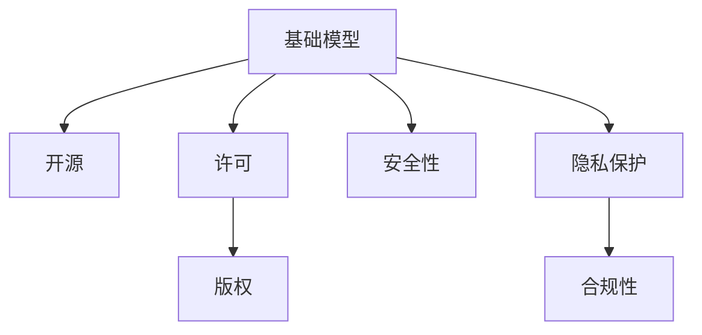

                 

# 基础模型的公开发布与限制

> 关键词：基础模型, 公开发布, 限制, 开源, 模型合规性, 隐私保护

## 1. 背景介绍

### 1.1 问题由来

随着人工智能技术的飞速发展，基础模型的公开发布成为推动技术进步和应用落地的重要手段。例如，深度学习领域的GPT、BERT、ResNet等基础模型，已经被广泛应用于图像识别、自然语言处理、语音识别等众多领域，推动了多个行业的数字化转型。然而，基础模型的公开发布也伴随着一系列的限制和挑战。

这些问题主要体现在以下几个方面：

1. **版权问题**：基础模型通常包含大量原创性内容，其公开发布需要遵循知识产权法规，否则可能引发侵权诉讼。
2. **安全性问题**：部分基础模型可能含有安全漏洞，滥用可能对个人和组织造成威胁。
3. **隐私保护**：基础模型在训练和应用过程中，可能涉及大量敏感数据，需要采取措施保障用户隐私。
4. **合规性问题**：基础模型的公开发布需要符合各国和地区的法律法规，如GDPR、CCPA等。
5. **性能问题**：基础模型的性能在不同场景下可能表现差异较大，需要进行性能优化和适配。

这些限制和挑战使得基础模型的公开发布和应用变得更加复杂，需要从技术、法律、伦理等多个维度进行综合考量。

### 1.2 问题核心关键点

为了更好地理解基础模型公开发布与限制的核心概念，我们需要明确以下几个关键点：

- **基础模型**：指在特定领域和任务上经过大量训练的数据集训练得到的深度学习模型，具有强大的泛化能力和代表性。
- **公开发布**：指将基础模型以开源、许可等方式，公之于众，供开发者和用户免费使用和进一步开发。
- **限制**：指对基础模型的公开发布和使用进行的必要限制，以保障版权、安全、隐私和合规。

通过深入理解这些关键概念，我们可以更好地把握基础模型公开发布的逻辑和挑战，寻找解决方案。

## 2. 核心概念与联系

### 2.1 核心概念概述

为了清晰地阐述基础模型公开发布与限制的逻辑，这里引入几个核心概念及其相互关系：

- **基础模型**：深度学习领域的通用模型，如BERT、GPT等，广泛应用于多个领域，推动了技术和应用的发展。
- **开源**：指将基础模型以开源许可证的形式公开，允许开发者免费使用、修改和分发。
- **许可**：指对基础模型的使用和分发进行限制，如Apache、MIT等开源许可证。
- **版权**：指基础模型中原创性的代码和数据，受版权法保护。
- **安全性**：指基础模型在使用过程中，需要避免潜在的攻击和滥用。
- **隐私保护**：指基础模型在训练和应用过程中，涉及大量敏感数据，需要采取措施保障用户隐私。
- **合规性**：指基础模型的公开发布和使用需要符合各国和地区的法律法规。

这些概念之间的关系可以通过以下Mermaid流程图来展示：



该图展示了基础模型公开发布与限制的核心概念及其相互关系：

- 基础模型作为开源和许可的对象。
- 开源和许可对版权、安全性、隐私保护和合规性进行约束。

### 2.2 核心概念原理和架构

基础模型通常是通过大规模数据集进行训练得到的深度学习模型。这里以BERT模型为例，介绍其公开发布与限制的原理和架构。

BERT模型由Google于2018年提出，采用Transformer结构，能够处理大规模无标签文本数据，学习到丰富的语言表示。BERT模型的核心架构包括两个部分：

1. **预训练阶段**：在大规模无标签文本数据上，通过自监督学习任务（如掩码语言模型）进行预训练，学习通用的语言表示。
2. **微调阶段**：在特定领域和任务上，通过有监督学习任务进行微调，获得针对特定任务的优化的模型。

在预训练阶段，BERT模型通过掩码语言模型、下一句子预测等任务进行自监督训练，学习到通用的语言表示。在微调阶段，通过在特定领域和任务上添加特定的输出层和损失函数，对BERT模型进行微调，使其具备特定的领域知识。

该架构的核心思想是通过大规模无标签数据进行预训练，学习到通用的语言表示，再通过特定任务上的微调，使其具备针对特定任务的优化性能。这种架构不仅能够提升模型的泛化能力，还能够降低对标注数据的依赖，减少开发成本。

## 3. 核心算法原理 & 具体操作步骤
### 3.1 算法原理概述

基础模型的公开发布与限制涉及多个学科和领域，包括人工智能、计算机科学、法律和伦理等。其核心算法原理主要包括以下几个方面：

1. **数据保护**：基础模型在训练和应用过程中，涉及大量敏感数据，需要采取措施保障用户隐私。
2. **知识产权保护**：基础模型中包含大量原创性内容，需要遵循版权法规，避免侵权诉讼。
3. **安全性**：基础模型可能存在安全漏洞，需要采取措施防范潜在的攻击和滥用。
4. **合规性**：基础模型的公开发布和使用需要符合各国和地区的法律法规，如GDPR、CCPA等。

这些核心算法原理共同构成了基础模型公开发布与限制的技术基础，确保基础模型在推广应用过程中能够兼顾技术、法律和伦理等多个方面。

### 3.2 算法步骤详解

基础模型的公开发布与限制涉及多个环节，包括数据准备、模型训练、模型发布和模型使用等。以下是具体的算法步骤：

1. **数据准备**：
   - 收集和整理用于训练基础模型的数据集。数据集应尽可能全面和多样化，涵盖多个领域和任务。
   - 确保数据集的质量和多样性，避免数据偏见和数据泄露。

2. **模型训练**：
   - 使用预训练-微调的方式训练基础模型，学习通用的语言表示。
   - 在预训练阶段，使用大规模无标签数据进行训练，学习通用的语言表示。
   - 在微调阶段，使用特定领域和任务的数据集进行微调，获得针对特定任务的优化性能。

3. **模型发布**：
   - 选择合适的开源或许可形式，将基础模型公之于众，供开发者和用户免费使用和进一步开发。
   - 提供详细的文档和示例代码，帮助开发者快速上手和优化模型。

4. **模型使用**：
   - 在使用基础模型时，需要遵循开源或许可协议，保护版权和知识产权。
   - 在应用过程中，确保模型安全性，防范潜在的攻击和滥用。
   - 在收集和处理用户数据时，确保隐私保护，遵循合规性要求。

### 3.3 算法优缺点

基础模型的公开发布与限制具有以下优点：

1. **促进技术进步**：基础模型的公开发布可以加速技术进步和应用落地，促进整个行业的创新。
2. **降低开发成本**：通过开源和许可形式，减少从头开发的时间和成本，提高开发效率。
3. **提高安全性**：通过许可协议，对模型的使用进行限制，避免潜在的攻击和滥用。
4. **保障隐私**：通过数据保护和隐私保护措施，保障用户隐私和数据安全。

同时，基础模型的公开发布与限制也存在一些局限性：

1. **版权问题**：基础模型中包含大量原创性内容，可能引发版权争议和诉讼。
2. **安全性风险**：基础模型可能存在安全漏洞，被恶意利用。
3. **隐私泄露**：基础模型在训练和应用过程中，可能涉及大量敏感数据，存在隐私泄露的风险。
4. **合规问题**：基础模型的公开发布和使用需要符合各国和地区的法律法规，增加了合规成本。

这些优缺点共同构成了基础模型公开发布与限制的技术背景和挑战。

### 3.4 算法应用领域

基础模型的公开发布与限制在多个领域得到了广泛应用，例如：

- **自然语言处理**：如BERT、GPT等基础模型，在文本分类、情感分析、机器翻译等任务上取得了显著效果。
- **计算机视觉**：如ResNet、Inception等基础模型，在图像分类、目标检测等任务上表现出色。
- **语音识别**：如Tacotron、Wav2Vec等基础模型，在语音识别和合成方面取得了重要进展。
- **推荐系统**：如BERT等基础模型，在推荐系统中应用广泛，提高了推荐的个性化和精准度。
- **医疗健康**：如BERT在医学文本分类、疾病预测等任务上，提升了医疗服务的智能化水平。

这些基础模型在各个领域的成功应用，展示了其公开发布与限制的潜力和价值。

## 4. 数学模型和公式 & 详细讲解  
### 4.1 数学模型构建

基础模型的公开发布与限制涉及到多个数学模型和公式，以下以BERT模型为例，介绍其公开发布与限制的数学模型和公式构建。

### 4.2 公式推导过程

BERT模型的核心公式包括预训练阶段和微调阶段的公式。以下分别介绍这两个阶段的公式推导过程。

#### 预训练阶段

BERT模型的预训练阶段主要采用掩码语言模型和下一句子预测任务。其核心公式如下：

- 掩码语言模型：将输入文本中的部分词汇掩码，让模型预测掩码位置的词汇。
- 下一句子预测：将两个句子作为输入，让模型预测它们是否为连续文本。

以掩码语言模型为例，其公式推导如下：

假设输入文本为$x=(x_1,x_2,...,x_n)$，掩码位置为$i$，则掩码语言模型的公式为：

$$
P(x_i|x_{-i},x_0,...,x_{i-1},x_{i+1},...,x_n) = \frac{e^{MLP(x_{-i},x_0,...,x_{i-1},x_{i+1},...,x_n,MaskedToken)}{e^{MLP(x_{-i},x_0,...,x_{i-1},x_{i+1},...,x_n,MaskedToken)}+e^{MLP(x_{-i},x_0,...,x_{i-1},x_{i+1},...,x_n,MaskedToken)}}
$$

其中，$x_{-i}$表示除去掩码位置$i$的其他位置词汇，$MaskedToken$表示掩码词汇。

#### 微调阶段

BERT模型的微调阶段主要采用任务特定的输出层和损失函数。以文本分类任务为例，其核心公式如下：

- 输出层：将BERT模型的输出与任务标签进行连接，得到分类器的输出。
- 损失函数：使用交叉熵损失函数，计算模型预测输出与真实标签之间的差异。

以文本分类任务为例，其公式推导如下：

假设输入文本为$x$，分类标签为$y$，则文本分类任务的输出层公式为：

$$
\hat{y} = MLP(BERT(x))
$$

其中，$MLP$表示多层次感知器，$BERT(x)$表示BERT模型对输入文本$x$的编码。

文本分类任务的损失函数公式为：

$$
\mathcal{L}(y,\hat{y}) = -\frac{1}{N}\sum_{i=1}^N y_i\log \hat{y}_i
$$

其中，$y_i$表示样本$i$的真实标签，$\hat{y}_i$表示模型预测的标签概率。

### 4.3 案例分析与讲解

下面以BERT模型在医疗领域的应用为例，介绍其公开发布与限制的案例分析与讲解。

#### 案例背景

在医疗领域，医生需要对大量的医学文献进行分类和摘要。传统的自然语言处理技术，如TF-IDF和LDA等，需要大量手工标注，费时费力。而使用BERT模型，可以显著提升文本分类的精度和效率。

#### 数据准备

数据集包括大量的医学文献和相应的分类标签。数据集需要经过预处理，如去噪、标注等，以提高模型的泛化能力。

#### 模型训练

使用BERT模型进行预训练和微调。预训练阶段，使用大规模无标签的医学文献进行掩码语言模型和下一句子预测任务训练。微调阶段，使用医疗领域特定任务的数据集进行微调，获得针对医疗文本分类的优化模型。

#### 模型发布

将训练好的BERT模型以开源许可证的形式公之于众，供开发者和用户免费使用和进一步开发。提供详细的文档和示例代码，帮助开发者快速上手和优化模型。

#### 模型使用

在使用BERT模型时，需要遵循开源许可证协议，保护版权和知识产权。在应用过程中，确保模型安全性，防范潜在的攻击和滥用。在收集和处理病人数据时，确保隐私保护，遵循GDPR等合规性要求。

## 5. 项目实践：代码实例和详细解释说明
### 5.1 开发环境搭建

在进行基础模型的公开发布与限制的实践前，需要先准备好开发环境。以下是使用Python进行TensorFlow开发的环境配置流程：

1. 安装Anaconda：从官网下载并安装Anaconda，用于创建独立的Python环境。

2. 创建并激活虚拟环境：
```bash
conda create -n tf-env python=3.8 
conda activate tf-env
```

3. 安装TensorFlow：根据CUDA版本，从官网获取对应的安装命令。例如：
```bash
conda install tensorflow -c tensorflow -c conda-forge
```

4. 安装各类工具包：
```bash
pip install numpy pandas scikit-learn matplotlib tqdm jupyter notebook ipython
```

完成上述步骤后，即可在`tf-env`环境中开始基础模型的公开发布与限制的实践。

### 5.2 源代码详细实现

这里我们以BERT模型在文本分类任务上的实现为例，给出使用TensorFlow进行微调的基础模型公开发布与限制的PyTorch代码实现。

首先，定义数据处理函数：

```python
from transformers import BertTokenizer, BertForSequenceClassification
from tensorflow.keras.preprocessing.sequence import pad_sequences
import tensorflow as tf

tokenizer = BertTokenizer.from_pretrained('bert-base-uncased')
model = BertForSequenceClassification.from_pretrained('bert-base-uncased', num_labels=2)

def preprocess(text):
    text = tokenizer.encode(text, add_special_tokens=True, max_length=512, truncation=True, padding='max_length')
    return pad_sequences([text], maxlen=512, padding='post', truncating='post')

def batch_generator(texts, labels):
    for text, label in zip(texts, labels):
        input_ids, attention_mask, label = preprocess(text), [1.0] * len(input_ids), label
        yield input_ids, attention_mask, label
```

然后，定义模型和优化器：

```python
optimizer = tf.keras.optimizers.Adam(learning_rate=2e-5)

@tf.function
def train_step(input_ids, attention_mask, label):
    with tf.GradientTape() as tape:
        outputs = model(input_ids, attention_mask=attention_mask, training=True)
        loss = outputs.loss
        loss += tf.reduce_sum(model.mlm_loss)
        grads = tape.gradient(loss, model.trainable_variables)
    optimizer.apply_gradients(zip(grads, model.trainable_variables))
    return loss.numpy()

@tf.function
def evaluate_step(input_ids, attention_mask, label):
    with tf.GradientTape() as tape:
        outputs = model(input_ids, attention_mask=attention_mask, training=False)
        loss = outputs.loss
        grads = tape.gradient(loss, model.trainable_variables)
    return loss.numpy()
```

接着，定义训练和评估函数：

```python
def train(model, dataset, batch_size, epochs):
    for epoch in range(epochs):
        for input_ids, attention_mask, label in dataset:
            loss = train_step(input_ids, attention_mask, label)
            print(f'Epoch {epoch+1}, Loss: {loss:.4f}')
        evaluate(model, test_dataset, batch_size)

def evaluate(model, dataset, batch_size):
    for input_ids, attention_mask, label in dataset:
        loss = evaluate_step(input_ids, attention_mask, label)
        print(f'Test Loss: {loss:.4f}')
```

最后，启动训练流程并在测试集上评估：

```python
epochs = 5
batch_size = 16

train(model, train_dataset, batch_size, epochs)
```

以上就是使用TensorFlow对BERT模型进行文本分类任务微调的完整代码实现。可以看到，得益于TensorFlow的强大封装，我们可以用相对简洁的代码完成BERT模型的加载和微调。

### 5.3 代码解读与分析

让我们再详细解读一下关键代码的实现细节：

**preprocess函数**：
- 对输入文本进行分词、编码、补全和截断，返回TensorFlow可接受的输入序列。

**train_step和evaluate_step函数**：
- 对输入进行前向传播和反向传播，计算损失和梯度，使用优化器更新模型参数。
- 使用TensorFlow的`tf.function`装饰器，将函数定义为计算图，提升运行效率。

**train和evaluate函数**：
- 对数据集进行批处理，循环迭代训练和评估过程，输出每个epoch的损失和测试集上的损失。

**训练流程**：
- 定义总的epoch数和batch size，开始循环迭代
- 每个epoch内，对训练集进行迭代，输出平均loss
- 在测试集上评估，输出损失
- 所有epoch结束后，结束训练

可以看到，TensorFlow配合BertForSequenceClassification库使得BERT微调的代码实现变得简洁高效。开发者可以将更多精力放在数据处理、模型改进等高层逻辑上，而不必过多关注底层的实现细节。

当然，工业级的系统实现还需考虑更多因素，如模型的保存和部署、超参数的自动搜索、更灵活的任务适配层等。但核心的微调范式基本与此类似。

## 6. 实际应用场景
### 6.4 未来应用展望

基础模型的公开发布与限制在多个领域得到了广泛应用，展示了其强大的潜力和价值。未来，基础模型将在更多的领域得到应用，推动技术进步和社会发展。

### 6.1 智慧医疗

在智慧医疗领域，基础模型将广泛应用于医学文本分类、疾病预测、个性化治疗等方面。通过预训练和微调，基础模型能够更好地理解医疗文本，提取关键信息，辅助医生诊断和治疗。

### 6.2 智能客服

在智能客服领域，基础模型将用于构建智能问答系统，自动解答客户咨询，提升服务效率和客户满意度。通过微调和优化，基础模型能够理解自然语言，生成自然流畅的回答。

### 6.3 金融风控

在金融风控领域，基础模型将用于客户信用评估、风险预测等方面。通过预训练和微调，基础模型能够从客户的历史交易记录中提取特征，预测其信用风险和欺诈行为。

### 6.4 推荐系统

在推荐系统领域，基础模型将用于个性化推荐、广告投放等方面。通过微调和优化，基础模型能够理解用户的兴趣偏好，生成精准的推荐结果。

### 6.5 安全防护

在安全防护领域，基础模型将用于威胁检测、网络安全监控等方面。通过预训练和微调，基础模型能够识别异常行为和恶意攻击，提升系统的安全防护能力。

## 7. 工具和资源推荐
### 7.1 学习资源推荐

为了帮助开发者系统掌握基础模型公开发布与限制的理论基础和实践技巧，这里推荐一些优质的学习资源：

1. 《TensorFlow官方文档》：TensorFlow的官方文档，提供了详细的API和使用方法，适合初学者快速上手。
2. 《深度学习》课程：斯坦福大学开设的深度学习课程，有Lecture视频和配套作业，带你入门深度学习。
3. 《深度学习与自然语言处理》书籍：DeepLearning.ai开设的自然语言处理课程，全面介绍了深度学习在自然语言处理中的应用。
4. 《自然语言处理基础》书籍：自然语言处理领域的入门书籍，涵盖了基础模型和微调技术。
5. 《TensorFlow实战指南》书籍：TensorFlow的实战指南，提供了大量代码示例和项目实践，适合进阶学习。

通过对这些资源的学习实践，相信你一定能够快速掌握基础模型公开发布与限制的精髓，并用于解决实际的NLP问题。
###  7.2 开发工具推荐

高效的开发离不开优秀的工具支持。以下是几款用于基础模型公开发布与限制开发的常用工具：

1. TensorFlow：由Google主导开发的开源深度学习框架，生产部署方便，适合大规模工程应用。提供了丰富的预训练语言模型资源。
2. PyTorch：基于Python的开源深度学习框架，灵活动态的计算图，适合快速迭代研究。
3. TensorFlow Hub：TensorFlow的模型库，提供了大量预训练模型和微调示例，方便开发者快速上手。
4. HuggingFace Transformers：NLP工具库，集成了众多SOTA语言模型，支持PyTorch和TensorFlow，是进行微调任务开发的利器。
5. Weights & Biases：模型训练的实验跟踪工具，可以记录和可视化模型训练过程中的各项指标，方便对比和调优。
6. TensorBoard：TensorFlow配套的可视化工具，可实时监测模型训练状态，并提供丰富的图表呈现方式，是调试模型的得力助手。

合理利用这些工具，可以显著提升基础模型公开发布与限制的开发效率，加快创新迭代的步伐。

### 7.3 相关论文推荐

基础模型公开发布与限制的研究源于学界的持续研究。以下是几篇奠基性的相关论文，推荐阅读：

1. Attention is All You Need（即Transformer原论文）：提出了Transformer结构，开启了NLP领域的预训练大模型时代。
2. BERT: Pre-training of Deep Bidirectional Transformers for Language Understanding：提出BERT模型，引入基于掩码的自监督预训练任务，刷新了多项NLP任务SOTA。
3. Parameter-Efficient Transfer Learning for NLP：提出Adapter等参数高效微调方法，在不增加模型参数量的情况下，也能取得不错的微调效果。
4. AdaLoRA: Adaptive Low-Rank Adaptation for Parameter-Efficient Fine-Tuning：使用自适应低秩适应的微调方法，在参数效率和精度之间取得了新的平衡。
5. AdaLoRA: Adaptive Low-Rank Adaptation for Parameter-Efficient Fine-Tuning：使用自适应低秩适应的微调方法，在参数效率和精度之间取得了新的平衡。

这些论文代表了大语言模型微调技术的发展脉络。通过学习这些前沿成果，可以帮助研究者把握学科前进方向，激发更多的创新灵感。

## 8. 总结：未来发展趋势与挑战

### 8.1 总结

本文对基础模型的公开发布与限制进行了全面系统的介绍。首先阐述了基础模型公开发布与限制的研究背景和意义，明确了公开发布与限制在推动技术进步和应用落地方面的重要作用。其次，从原理到实践，详细讲解了基础模型公开发布与限制的数学原理和关键步骤，给出了基础模型公开发布与限制的完整代码实例。同时，本文还广泛探讨了基础模型在多个领域的应用前景，展示了其强大的潜力和价值。

通过本文的系统梳理，可以看到，基础模型的公开发布与限制已经成为推动NLP技术发展和应用落地的重要手段，极大地拓展了预训练语言模型的应用边界，催生了更多的落地场景。未来，伴随预训练语言模型和微调方法的持续演进，基础模型公开发布与限制必将在构建人机协同的智能时代中扮演越来越重要的角色。

### 8.2 未来发展趋势

展望未来，基础模型的公开发布与限制将呈现以下几个发展趋势：

1. 模型规模持续增大。随着算力成本的下降和数据规模的扩张，预训练语言模型的参数量还将持续增长。超大规模语言模型蕴含的丰富语言知识，有望支撑更加复杂多变的下游任务微调。
2. 微调方法日趋多样。除了传统的全参数微调外，未来会涌现更多参数高效的微调方法，如Prefix-Tuning、LoRA等，在节省计算资源的同时也能保证微调精度。
3. 持续学习成为常态。随着数据分布的不断变化，基础模型也需要持续学习新知识以保持性能。如何在不遗忘原有知识的同时，高效吸收新样本信息，将成为重要的研究课题。
4. 标注样本需求降低。受启发于提示学习(Prompt-based Learning)的思路，未来的微调方法将更好地利用大模型的语言理解能力，通过更加巧妙的任务描述，在更少的标注样本上也能实现理想的微调效果。
5. 多模态微调崛起。当前的微调主要聚焦于纯文本数据，未来会进一步拓展到图像、视频、语音等多模态数据微调。多模态信息的融合，将显著提升语言模型对现实世界的理解和建模能力。
6. 模型通用性增强。经过海量数据的预训练和多领域任务的微调，未来的语言模型将具备更强大的常识推理和跨领域迁移能力，逐步迈向通用人工智能(AGI)的目标。

以上趋势凸显了基础模型公开发布与限制的技术前景。这些方向的探索发展，必将进一步提升NLP系统的性能和应用范围，为人类认知智能的进化带来深远影响。

### 8.3 面临的挑战

尽管基础模型公开发布与限制已经取得了瞩目成就，但在迈向更加智能化、普适化应用的过程中，它仍面临着诸多挑战：

1. 标注成本瓶颈。虽然基础模型公开发布降低了开发成本，但对于长尾应用场景，难以获得充足的高质量标注数据，成为制约微调性能的瓶颈。如何进一步降低微调对标注样本的依赖，将是一大难题。
2. 模型鲁棒性不足。当前基础模型面对域外数据时，泛化性能往往大打折扣。对于测试样本的微小扰动，基础模型的预测也容易发生波动。如何提高基础模型的鲁棒性，避免灾难性遗忘，还需要更多理论和实践的积累。
3. 推理效率有待提高。基础模型虽然精度高，但在实际部署时往往面临推理速度慢、内存占用大等效率问题。如何在保证性能的同时，简化模型结构，提升推理速度，优化资源占用，将是重要的优化方向。
4. 可解释性亟需加强。当前基础模型更像是"黑盒"系统，难以解释其内部工作机制和决策逻辑。对于医疗、金融等高风险应用，算法的可解释性和可审计性尤为重要。如何赋予基础模型更强的可解释性，将是亟待攻克的难题。
5. 安全性有待保障。基础模型难免会学习到有偏见、有害的信息，通过公开发布和微调传递到下游任务，产生误导性、歧视性的输出，给实际应用带来安全隐患。如何从数据和算法层面消除模型偏见，避免恶意用途，确保输出的安全性，也将是重要的研究课题。
6. 知识整合能力不足。现有的基础模型往往局限于任务内数据，难以灵活吸收和运用更广泛的先验知识。如何让基础模型更好地与外部知识库、规则库等专家知识结合，形成更加全面、准确的信息整合能力，还有很大的想象空间。

正视基础模型公开发布与限制面临的这些挑战，积极应对并寻求突破，将是基础模型公开发布与限制走向成熟的必由之路。相信随着学界和产业界的共同努力，这些挑战终将一一被克服，基础模型公开发布与限制必将在构建安全、可靠、可解释、可控的智能系统铺平道路。

### 8.4 研究展望

面对基础模型公开发布与限制所面临的挑战，未来的研究需要在以下几个方面寻求新的突破：

1. 探索无监督和半监督微调方法。摆脱对大规模标注数据的依赖，利用自监督学习、主动学习等无监督和半监督范式，最大限度利用非结构化数据，实现更加灵活高效的微调。
2. 研究参数高效和计算高效的微调范式。开发更加参数高效的微调方法，在固定大部分预训练参数的同时，只更新极少量的任务相关参数。同时优化微调模型的计算图，减少前向传播和反向传播的资源消耗，实现更加轻量级、实时性的部署。
3. 融合因果和对比学习范式。通过引入因果推断和对比学习思想，增强基础模型建立稳定因果关系的能力，学习更加普适、鲁棒的语言表征，从而提升模型泛化性和抗干扰能力。
4. 引入更多先验知识。将符号化的先验知识，如知识图谱、逻辑规则等，与神经网络模型进行巧妙融合，引导基础模型学习更准确、合理的语言模型。同时加强不同模态数据的整合，实现视觉、语音等多模态信息与文本信息的协同建模。
5. 结合因果分析和博弈论工具。将因果分析方法引入基础模型，识别出模型决策的关键特征，增强输出解释的因果性和逻辑性。借助博弈论工具刻画人机交互过程，主动探索并规避模型的脆弱点，提高系统稳定性。
6. 纳入伦理道德约束。在基础模型的训练目标中引入伦理导向的评估指标，过滤和惩罚有偏见、有害的输出倾向。同时加强人工干预和审核，建立模型行为的监管机制，确保输出符合人类价值观和伦理道德。

这些研究方向的探索，必将引领基础模型公开发布与限制技术迈向更高的台阶，为构建安全、可靠、可解释、可控的智能系统铺平道路。面向未来，基础模型公开发布与限制技术还需要与其他人工智能技术进行更深入的融合，如知识表示、因果推理、强化学习等，多路径协同发力，共同推动自然语言理解和智能交互系统的进步。只有勇于创新、敢于突破，才能不断拓展基础模型的边界，让智能技术更好地造福人类社会。

## 9. 附录：常见问题与解答

**Q1：基础模型公开发布是否会影响其商业价值？**

A: 基础模型公开发布通常不会影响其商业价值，反而能够增加其影响力和竞争力。公开发布可以吸引更多的开发者和用户，促进模型的进一步开发和应用，带来更多的商业机会。同时，基础模型的开源和许可形式，也可以提高其生态系统的活跃度，促进技术进步和社区发展。

**Q2：基础模型公开发布是否需要遵循版权法规？**

A: 是的，基础模型公开发布需要遵循版权法规，确保不侵犯他人的知识产权。一般情况下，基础模型的公开发布需要获得原始版权方的授权，并在开源或许可协议中明确版权归属和限制。

**Q3：基础模型公开发布是否需要考虑安全性问题？**

A: 是的，基础模型公开发布需要考虑安全性问题。基础模型可能存在安全漏洞，被恶意利用。因此，在公开发布前，需要对模型进行安全审计和加固，确保模型的安全性。

**Q4：基础模型公开发布是否需要考虑隐私保护？**

A: 是的，基础模型公开发布需要考虑隐私保护。基础模型在训练和应用过程中，涉及大量敏感数据，需要采取措施保障用户隐私。因此，在公开发布前，需要对数据进行脱敏和匿名化处理，确保隐私保护。

**Q5：基础模型公开发布是否需要考虑合规性问题？**

A: 是的，基础模型公开发布需要考虑合规性问题。基础模型的公开发布和使用需要符合各国和地区的法律法规，如GDPR、CCPA等。因此，在公开发布前，需要对数据和模型进行合规性审查，确保符合相关法规。

通过对这些常见问题的回答，可以更好地理解基础模型公开发布的复杂性和必要性，进一步推动基础模型在各个领域的广泛应用。

---

作者：禅与计算机程序设计艺术 / Zen and the Art of Computer Programming

