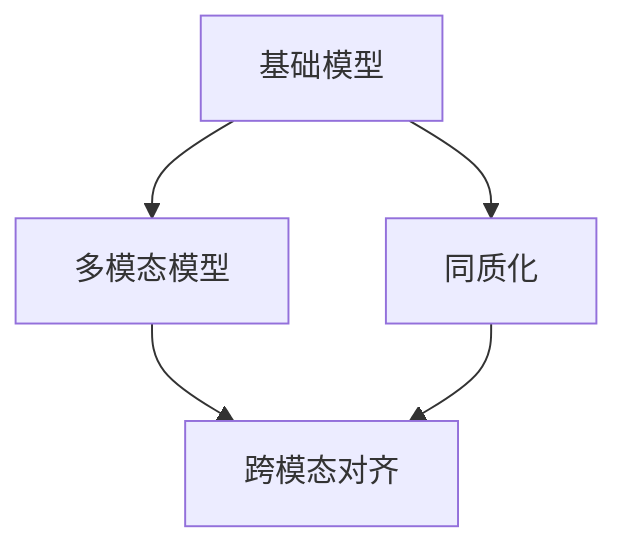

                 

# 基础模型的同质化与多模态模型

## 1. 背景介绍

近年来，深度学习技术在图像、文本、音频等领域均取得了显著的进展，带动了基础模型的异军突起。从CNN、RNN、Transformer等通用模型，到各种专用模型（如BERT、GPT等），基础模型开始呈现多样化的趋势。然而，正是这种多样化的发展，使得异质性成为一种新的挑战，制约了模型应用的全场景性和通用性。

为此，多模态模型应运而生。多模态模型通过同时处理多种模态信息（如文本、图像、音频等），旨在构建一种具有普适性的解决方案，提升各类基础模型的同质化，加速模型应用在现实世界中的落地。

## 2. 核心概念与联系

### 2.1 核心概念概述

在理解多模态模型的核心概念与联系之前，我们首先需要了解几个基本概念：

- **基础模型(Foundation Model)**：指在特定领域内，经过大量数据训练得到的深度学习模型，具备丰富的知识表示能力。基础模型包括通用模型（如CNN、RNN、Transformer等）和专用模型（如BERT、GPT等）。

- **多模态模型(Multimodal Model)**：指同时处理多种模态信息（如文本、图像、音频等），融合不同模态知识，以实现更为全面、精确的认知理解的模型。多模态模型如Vision-and-Language模型、Audio-Text模型等，具备跨模态推理和语义对齐能力。

- **同质化(Homogenization)**：指不同基础模型通过多模态融合，向一致性知识空间映射，从而在知识表示和应用场景上具有更多共通性。

- **跨模态对齐(Cross-modal Alignment)**：指不同模态特征向量的对齐转换，使不同模态信息具有可比较性，促进多模态知识的融合。

以上概念之间的关系可以通过以下Mermaid流程图来展示：



该流程图展示了多模态模型对基础模型同质化的作用机制：通过跨模态对齐，不同模态的基础模型被映射到统一的语义空间，从而实现知识表示的同质化，提升模型应用的全场景性和通用性。

## 3. 核心算法原理 & 具体操作步骤

### 3.1 算法原理概述

多模态模型的核心算法原理基于以下两个假设：

1. **共通语义假设(Common Sense)**：不同模态信息具有一定的共通性，可以被转化为相似的语义表示。
2. **协同增强假设(Co-enhancement)**：不同模态信息相互补充，共同提升认知理解和推理能力。

基于这两个假设，多模态模型通过融合不同模态信息，将不同模态的特征表示为统一语义空间中的向量，从而实现知识表示的同质化。

形式化地，设基础模型为 $M_i$，对应不同模态，如文本 $M_{text}$、图像 $M_{img}$、音频 $M_{audio}$ 等。设跨模态对齐矩阵为 $A$，则同质化过程可以表示为：

$$
Z_i = A \times M_i
$$

其中 $Z_i$ 表示 $M_i$ 在语义空间中的表示，$A$ 通过跨模态对齐算法得到，描述了不同模态向量的映射关系。

### 3.2 算法步骤详解

多模态模型的构建和训练步骤如下：

**Step 1: 数据准备**

- 准备不同模态的数据集，如文本、图像、音频等。
- 对各数据集进行预处理，包括清洗、归一化、增强等。
- 进行跨模态对齐预处理，如特征嵌入、归一化等。

**Step 2: 基础模型训练**

- 对各模态的基础模型进行单独训练，获得各模态的表示 $M_i$。
- 利用不同模态的信息进行联合训练，提升模型整体性能。

**Step 3: 跨模态对齐**

- 使用交叉熵损失函数或对比学习等方法，训练跨模态对齐矩阵 $A$，使得不同模态的表示 $Z_i$ 在语义空间中尽可能一致。
- 优化对齐矩阵，使得对齐后的向量 $Z_i$ 能更好地捕捉不同模态间的相关性。

**Step 4: 模型微调**

- 在对齐后的语义空间中，使用下游任务的数据进行微调，进一步提升模型的通用性和应用范围。

**Step 5: 融合与输出**

- 将多模态融合后的语义表示 $Z$ 作为最终输出，应用于各类实际任务中。

### 3.3 算法优缺点

多模态模型的优势包括：

1. **提升泛化能力**：通过融合多种模态信息，模型能够更好地泛化到未见过的场景和数据。
2. **增强鲁棒性**：多种模态信息相互补充，可以提高模型的鲁棒性和稳定性。
3. **扩展应用场景**：不同模态的数据可以提供互补的信息，扩展了模型应用的全场景性。

然而，多模态模型也存在一些局限性：

1. **计算复杂度高**：不同模态的数据预处理、模型训练和融合计算复杂度较高，需投入大量的算力和时间。
2. **数据标注成本高**：不同模态的数据收集和标注成本较高，尤其是图像和音频数据，标注工作较为繁琐。
3. **模型复杂度高**：多模态模型的结构复杂，难以解释和调试，模型开发和维护成本较高。

### 3.4 算法应用领域

多模态模型在以下几个领域有广泛的应用：

1. **智能安防**：融合图像、视频、音频等多种信息，实现视频监控、行为分析、情感识别等功能。
2. **自动驾驶**：结合地图、传感器、视频等多模态信息，实现环境感知、路径规划、智能避障等功能。
3. **医疗诊断**：结合医学影像、电子病历、基因数据等多种信息，进行疾病诊断、治疗方案推荐等功能。
4. **电子商务**：结合用户评价、行为数据、产品信息等多模态信息，进行个性化推荐、欺诈检测等功能。
5. **智能家居**：结合语音、视觉、环境数据等多种信息，实现智能控制、环境感知、安全监控等功能。
6. **智能制造**：结合设备传感器数据、生产数据、产品信息等多种信息，实现质量检测、故障诊断、生产优化等功能。

## 4. 数学模型和公式 & 详细讲解

### 4.1 数学模型构建

多模态模型的数学模型可以表示为：

$$
Z = A \times M = \{z_{text}, z_{img}, z_{audio}, \ldots\}
$$

其中 $Z$ 为多模态特征向量，$M$ 为多模态基础模型，$A$ 为跨模态对齐矩阵，$z_i$ 为不同模态的特征表示。

### 4.2 公式推导过程

设文本和图像的特征表示分别为 $m_{text}$ 和 $m_{img}$，其跨模态对齐后的特征表示分别为 $z_{text}$ 和 $z_{img}$。假设 $A$ 为 $d$ 维向量到 $d'$ 维向量的线性变换矩阵，则其对齐过程可以表示为：

$$
z_{text} = A \times m_{text}
$$
$$
z_{img} = A \times m_{img}
$$

其中 $d$ 和 $d'$ 分别为输入和输出向量的维度。

### 4.3 案例分析与讲解

以Vision-and-Language模型为例，说明多模态模型的构建和训练过程。

假设有一个包含图像和文本信息的双模态数据集，每个数据点 $x$ 包含一张图像 $I$ 和一段文本描述 $T$。设 $m_{text}$ 为文本信息表示，$m_{img}$ 为图像信息表示。

1. **数据预处理**：对文本进行分词、嵌入等处理，对图像进行裁剪、归一化等处理。
2. **模型训练**：分别训练文本和图像的Transformer模型，获得 $m_{text}$ 和 $m_{img}$。
3. **对齐训练**：使用交叉熵损失函数训练对齐矩阵 $A$，使得 $z_{text}$ 和 $z_{img}$ 尽可能一致。

最终得到的 $Z$ 作为融合后的多模态特征向量，应用于各类实际任务中。

## 5. 项目实践：代码实例和详细解释说明

### 5.1 开发环境搭建

在进行多模态模型实践前，我们需要准备好开发环境。以下是使用Python进行PyTorch开发的环境配置流程：

1. 安装Anaconda：从官网下载并安装Anaconda，用于创建独立的Python环境。
2. 创建并激活虚拟环境：
```bash
conda create -n pytorch-env python=3.8 
conda activate pytorch-env
```
3. 安装PyTorch：根据CUDA版本，从官网获取对应的安装命令。例如：
```bash
conda install pytorch torchvision torchaudio cudatoolkit=11.1 -c pytorch -c conda-forge
```
4. 安装Transformers库：
```bash
pip install transformers
```
5. 安装各类工具包：
```bash
pip install numpy pandas scikit-learn matplotlib tqdm jupyter notebook ipython
```

完成上述步骤后，即可在`pytorch-env`环境中开始多模态模型的开发实践。

### 5.2 源代码详细实现

这里以Vision-and-Language模型为例，给出使用Transformers库进行多模态模型微调的PyTorch代码实现。

首先，定义数据处理函数：

```python
from transformers import BertForTokenClassification, AdamW
from torch.utils.data import Dataset, DataLoader
from tqdm import tqdm
from sklearn.metrics import classification_report

class VisionAndLanguageDataset(Dataset):
    def __init__(self, vision_data, text_data, tokenizer):
        self.vision_data = vision_data
        self.text_data = text_data
        self.tokenizer = tokenizer
        
    def __len__(self):
        return len(self.vision_data)
    
    def __getitem__(self, item):
        vision = self.vision_data[item]
        text = self.text_data[item]
        
        vision_features = self.tokenizer(vision, return_tensors='pt', padding='max_length', truncation=True)
        text_features = self.tokenizer(text, return_tensors='pt', padding='max_length', truncation=True)
        
        return {
            'vision': vision_features['pixel_values'],
            'text': text_features['input_ids'],
            'vision_len': vision_features['pixel_values'].shape[-1],
            'text_len': text_features['input_ids'].shape[-1]
        }
        
tokenizer = BertTokenizer.from_pretrained('bert-base-cased')
train_dataset = VisionAndLanguageDataset(train_vision_data, train_text_data, tokenizer)
dev_dataset = VisionAndLanguageDataset(dev_vision_data, dev_text_data, tokenizer)
test_dataset = VisionAndLanguageDataset(test_vision_data, test_text_data, tokenizer)
```

然后，定义模型和优化器：

```python
from transformers import VisionEncoder, BertForTokenClassification, AdamW

vision_encoder = VisionEncoder.from_pretrained('path_to_vision_encoder')
model = BertForTokenClassification.from_pretrained('bert-base-cased')
optimizer = AdamW(model.parameters(), lr=2e-5)
```

接着，定义训练和评估函数：

```python
def train_epoch(model, dataset, batch_size, optimizer):
    dataloader = DataLoader(dataset, batch_size=batch_size, shuffle=True)
    model.train()
    epoch_loss = 0
    for batch in tqdm(dataloader, desc='Training'):
        vision = batch['vision'].to(device)
        text = batch['text'].to(device)
        vision_len = batch['vision_len'].to(device)
        text_len = batch['text_len'].to(device)
        model.zero_grad()
        outputs = model(vision, text)
        loss = outputs.loss
        epoch_loss += loss.item()
        loss.backward()
        optimizer.step()
    return epoch_loss / len(dataloader)

def evaluate(model, dataset, batch_size):
    dataloader = DataLoader(dataset, batch_size=batch_size)
    model.eval()
    preds, labels = [], []
    with torch.no_grad():
        for batch in tqdm(dataloader, desc='Evaluating'):
            vision = batch['vision'].to(device)
            text = batch['text'].to(device)
            vision_len = batch['vision_len'].to(device)
            text_len = batch['text_len'].to(device)
            outputs = model(vision, text)
            batch_preds = outputs.logits.argmax(dim=2).to('cpu').tolist()
            batch_labels = batch['labels'].to('cpu').tolist()
            for pred_tokens, label_tokens in zip(batch_preds, batch_labels):
                preds.append(pred_tokens[:len(label_tokens)])
                labels.append(label_tokens)
                
    print(classification_report(labels, preds))
```

最后，启动训练流程并在测试集上评估：

```python
epochs = 5
batch_size = 16

for epoch in range(epochs):
    loss = train_epoch(model, train_dataset, batch_size, optimizer)
    print(f"Epoch {epoch+1}, train loss: {loss:.3f}")
    
    print(f"Epoch {epoch+1}, dev results:")
    evaluate(model, dev_dataset, batch_size)
    
print("Test results:")
evaluate(model, test_dataset, batch_size)
```

以上就是使用PyTorch对Vision-and-Language模型进行微调的完整代码实现。可以看到，得益于Transformers库的强大封装，我们可以用相对简洁的代码完成模型微调。

### 5.3 代码解读与分析

让我们再详细解读一下关键代码的实现细节：

**VisionAndLanguageDataset类**：
- `__init__`方法：初始化图像、文本数据集和分词器。
- `__len__`方法：返回数据集的样本数量。
- `__getitem__`方法：对单个样本进行处理，将图像和文本输入分别编码为视觉特征和文本特征，并对长文本进行分句处理，保证输入一致性。

**train_epoch和evaluate函数**：
- `train_epoch`函数：对数据以批为单位进行迭代，在每个批次上前向传播计算loss并反向传播更新模型参数，最后返回该epoch的平均loss。
- `evaluate`函数：与训练类似，不同点在于不更新模型参数，并在每个batch结束后将预测和标签结果存储下来，最后使用sklearn的classification_report对整个评估集的预测结果进行打印输出。

**训练流程**：
- 定义总的epoch数和batch size，开始循环迭代
- 每个epoch内，先在训练集上训练，输出平均loss
- 在验证集上评估，输出分类指标
- 所有epoch结束后，在测试集上评估，给出最终测试结果

可以看到，PyTorch配合Transformers库使得多模态模型的微调代码实现变得简洁高效。开发者可以将更多精力放在数据处理、模型改进等高层逻辑上，而不必过多关注底层的实现细节。

当然，工业级的系统实现还需考虑更多因素，如模型的保存和部署、超参数的自动搜索、更灵活的任务适配层等。但核心的微调范式基本与此类似。

## 6. 实际应用场景

### 6.1 智能安防

多模态模型在智能安防领域有广泛的应用。传统安防系统依赖人工监控，成本高、效率低。基于多模态模型，可以实现自动化的视频监控、行为分析、异常检测等功能，极大地提升了安防系统的智能化水平。

在技术实现上，可以结合视频、音频、传感器等多模态数据，进行实时监控和异常行为检测。当系统发现异常行为时，及时发出警报，并提供详细的视频、音频、文本描述，帮助安保人员快速定位和处理。

### 6.2 自动驾驶

自动驾驶技术依赖于多模态融合，能够从视觉、雷达、GPS等多种传感器获取信息，进行环境感知、路径规划、智能避障等功能。多模态模型可以很好地将不同传感器信息融合，构建高精度的环境模型，提升驾驶安全性和舒适性。

在实际应用中，多模态模型可以帮助自动驾驶车辆实时感知周围环境，通过视觉、雷达、GPS等多模态信息融合，实现精准定位和路径规划。同时，多模态模型还能识别交通标志、行人、其他车辆等信息，提高驾驶的安全性和可靠性。

### 6.3 医疗诊断

多模态模型在医疗诊断中也具有广泛的应用。传统的医疗诊断依赖医生手工解读影像、病历等多种数据，耗时耗力。通过多模态模型，可以自动化地融合医学影像、电子病历、基因数据等多种信息，进行疾病诊断和治疗方案推荐等功能。

在技术实现上，可以结合医学影像、电子病历、基因数据等多模态信息，进行联合建模，提升诊断准确性和治疗效果。例如，结合CT影像和电子病历，可以自动生成诊断报告，提供初步的病情评估和治疗方案。

### 6.4 未来应用展望

随着多模态模型的不断发展，其应用场景也将不断拓展。未来，多模态模型有望在更多领域得到应用，为各行各业带来变革性影响：

1. **智慧城市**：融合城市各领域数据，实现智能交通、智慧安防、环境监测等功能，提升城市管理智能化水平。
2. **智能制造**：结合设备传感器数据、生产数据、产品信息等多模态信息，进行质量检测、故障诊断、生产优化等功能，推动工业4.0发展。
3. **个性化推荐**：结合用户评价、行为数据、产品信息等多模态信息，进行个性化推荐，提升用户满意度和忠诚度。
4. **智能家居**：结合语音、视觉、环境数据等多种信息，实现智能控制、环境感知、安全监控等功能，提升居家生活便利性。
5. **智能教育**：结合学生行为数据、作业批改、知识库等多模态信息，进行个性化教学、知识推荐等功能，提升教育质量和效果。

## 7. 工具和资源推荐

### 7.1 学习资源推荐

为了帮助开发者系统掌握多模态模型的理论基础和实践技巧，这里推荐一些优质的学习资源：

1. 《深度学习：理论与算法》系列博文：由深度学习专家撰写，深入浅出地介绍了多模态模型的基本概念和经典算法。
2. CS229《机器学习》课程：斯坦福大学开设的机器学习明星课程，涵盖了多模态融合、协同学习等内容，适合深入学习多模态模型理论。
3. 《深度学习实战》书籍：通过实际案例演示，介绍了多模态模型的构建和训练过程，适合实践操作。
4. TensorFlow官方文档：提供了多模态融合的详细教程和样例代码，是实践多模态模型的好资源。
5. Arxiv论文库：收录了大量多模态模型的研究论文，适合查阅最新的研究成果和算法。

通过对这些资源的学习实践，相信你一定能够快速掌握多模态模型的精髓，并用于解决实际的NLP问题。

### 7.2 开发工具推荐

高效的开发离不开优秀的工具支持。以下是几款用于多模态模型开发和训练的常用工具：

1. PyTorch：基于Python的开源深度学习框架，灵活动态的计算图，适合多模态模型的训练和推理。
2. TensorFlow：由Google主导开发的开源深度学习框架，支持分布式训练和GPU加速，适合大规模工程应用。
3. HuggingFace Transformers库：集成了多种多模态模型，支持多模态特征融合和联合训练，是进行多模态模型开发的利器。
4. Weights & Biases：模型训练的实验跟踪工具，可以记录和可视化模型训练过程中的各项指标，方便对比和调优。
5. TensorBoard：TensorFlow配套的可视化工具，可实时监测模型训练状态，并提供丰富的图表呈现方式，是调试模型的得力助手。

合理利用这些工具，可以显著提升多模态模型的开发效率，加快创新迭代的步伐。

### 7.3 相关论文推荐

多模态模型研究源于学界的持续研究。以下是几篇奠基性的相关论文，推荐阅读：

1. Multimodal Knowledge Graph Embedding with Localized Activation Function: A Unified Framework for Grounding and Reasoning（Q2L-GNN论文）：提出了多模态知识图嵌入方法，融合文本和知识图信息，构建统一的知识表示。
2. Multi-modal Image-Caption Generation using Deep Feature Fusion Network（FUN论文）：提出了多模态图像描述生成方法，融合视觉和语言信息，生成高质量的图像描述。
3. Multimodal Image Annotation via Hierarchical Attention Networks（MHA论文）：提出了多模态图像标注方法，结合视觉和文本信息，提高图像标注的准确性。
4. Multimodal Model Aggregation via Deep Multi-Task Learning for Multimodal Biometrics（DML-MM论文）：提出了多模态生物识别方法，融合多模态信息，提高识别准确性。
5. Multimodal Logistics System Design and Implementation（MMLS论文）：提出了多模态物流系统设计，结合GPS、RFID等多种信息，优化物流配送。

这些论文代表了大模型微调技术的发展脉络。通过学习这些前沿成果，可以帮助研究者把握学科前进方向，激发更多的创新灵感。

## 8. 总结：未来发展趋势与挑战

### 8.1 总结

本文对多模态模型的构建和应用进行了全面系统的介绍。首先阐述了多模态模型的研究背景和意义，明确了其在提升模型同质化和应用全场景性方面的独特价值。其次，从原理到实践，详细讲解了多模态模型的数学模型和关键步骤，给出了多模态模型微调的完整代码实例。同时，本文还广泛探讨了多模态模型在智能安防、自动驾驶、医疗诊断等多个领域的应用前景，展示了多模态模型的巨大潜力。此外，本文精选了多模态模型的各类学习资源，力求为读者提供全方位的技术指引。

通过本文的系统梳理，可以看到，多模态模型在提升基础模型同质化、拓展应用场景、提升性能和效率方面具有显著的优势。未来，多模态模型将在更多领域得到广泛应用，为人工智能技术的发展注入新的动力。

### 8.2 未来发展趋势

展望未来，多模态模型的发展趋势包括：

1. **模型规模持续增大**：随着算力成本的下降和数据规模的扩张，多模态模型的参数量还将持续增长。超大规模多模态模型蕴含的丰富知识，有望支撑更加复杂多变的下游任务。
2. **融合技术日趋多样**：未来将涌现更多多模态融合方法，如深度学习、图神经网络、生成对抗网络等，提升模型对复杂场景的适应能力。
3. **跨模态对齐技术进步**：跨模态对齐技术将不断进步，提升不同模态信息的一致性和融合效果，增强模型的泛化能力和推理能力。
4. **跨模态信息增强**：未来的多模态模型将进一步融合视觉、听觉、触觉等多种信息，提升模型的感知能力和认知水平。
5. **跨模态协同推理**：多模态模型将进一步支持跨模态协同推理，提升模型的推理能力和逻辑表达能力，更好地应对复杂任务。
6. **跨模态对抗训练**：通过引入对抗样本和对抗训练技术，提升多模态模型的鲁棒性和安全性。

以上趋势凸显了多模态模型在推动人工智能技术发展方面的广阔前景。这些方向的探索发展，必将进一步提升多模态模型的性能和应用范围，为人类认知智能的进化带来深远影响。

### 8.3 面临的挑战

尽管多模态模型已经取得了显著进展，但在迈向更加智能化、普适化应用的过程中，仍面临诸多挑战：

1. **计算复杂度高**：多模态模型的计算复杂度较高，对算力、内存、存储等资源要求较高，开发和部署成本高。
2. **数据标注成本高**：多模态数据收集和标注成本较高，尤其是图像和音频数据，标注工作较为繁琐。
3. **模型复杂度高**：多模态模型的结构复杂，难以解释和调试，模型开发和维护成本较高。
4. **跨模态对齐难度大**：不同模态的数据表示差异较大，跨模态对齐技术的挑战仍需进一步解决。
5. **数据隐私和安全问题**：多模态模型涉及多种模态数据的融合，数据隐私和安全问题需引起重视。
6. **算法透明性和公平性**：多模态模型中的算法透明性和公平性问题需进一步解决，避免偏见和歧视。

正视多模态模型面临的这些挑战，积极应对并寻求突破，将是多模态模型迈向成熟的必由之路。相信随着学界和产业界的共同努力，这些挑战终将一一被克服，多模态模型必将在构建安全、可靠、可解释、可控的智能系统铺平道路。

### 8.4 研究展望

面对多模态模型面临的种种挑战，未来的研究需要在以下几个方面寻求新的突破：

1. **探索无监督和半监督多模态融合方法**：摆脱对大规模标注数据的依赖，利用自监督学习、主动学习等无监督和半监督范式，最大限度利用非结构化数据，实现更加灵活高效的多模态融合。
2. **研究参数高效和多模态模型压缩技术**：开发更加参数高效和多模态模型压缩技术，在固定大部分模型参数的情况下，仅更新极少量的任务相关参数。同时优化模型结构，减少前向传播和反向传播的资源消耗，实现更加轻量级、实时性的部署。
3. **引入因果分析和博弈论工具**：将因果分析方法引入多模态模型，识别出模型决策的关键特征，增强输出解释的因果性和逻辑性。借助博弈论工具刻画人机交互过程，主动探索并规避模型的脆弱点，提高系统稳定性。
4. **结合专家知识进行多模态融合**：将符号化的先验知识，如知识图谱、逻辑规则等，与神经网络模型进行巧妙融合，引导多模态融合过程学习更准确、合理的语义表示。同时加强不同模态数据的整合，实现视觉、听觉等多模态信息与文本信息的协同建模。
5. **结合跨模态学习与协同训练**：通过引入跨模态学习方法和协同训练技术，提升模型在不同模态信息中的迁移能力和泛化能力，更好地应对新模态数据。
6. **开发高效的多模态推理引擎**：设计高效的多模态推理引擎，提升模型的推理能力和逻辑表达能力，更好地应对复杂任务。

这些研究方向的探索，必将引领多模态模型技术迈向更高的台阶，为构建安全、可靠、可解释、可控的智能系统铺平道路。面向未来，多模态模型还需与其他人工智能技术进行更深入的融合，如知识表示、因果推理、强化学习等，多路径协同发力，共同推动自然语言理解和智能交互系统的进步。只有勇于创新、敢于突破，才能不断拓展多模态模型的边界，让智能技术更好地造福人类社会。

## 9. 附录：常见问题与解答

**Q1：什么是基础模型和同质化？**

A: 基础模型指在特定领域内，经过大量数据训练得到的深度学习模型，具备丰富的知识表示能力。同质化指不同基础模型通过多模态融合，向一致性知识空间映射，从而在知识表示和应用场景上具有更多共通性。

**Q2：多模态模型有哪些优势？**

A: 多模态模型的优势包括：提升泛化能力、增强鲁棒性、扩展应用场景等。通过融合多种模态信息，模型能够更好地泛化到未见过的场景和数据，增强模型在复杂环境中的适应能力和稳定性。

**Q3：多模态模型面临哪些挑战？**

A: 多模态模型面临的挑战包括：计算复杂度高、数据标注成本高、模型复杂度高、跨模态对齐难度大等。这些问题限制了多模态模型的实际应用，需要进一步研究解决。

**Q4：如何构建多模态模型？**

A: 构建多模态模型需要以下步骤：1. 准备不同模态的数据集；2. 对各数据集进行预处理和特征提取；3. 训练基础模型；4. 使用跨模态对齐算法训练对齐矩阵；5. 融合多模态特征向量；6. 对融合后的特征向量进行下游任务微调。

**Q5：多模态模型在智能安防中有哪些应用？**

A: 多模态模型在智能安防中可以用于视频监控、行为分析、异常检测等功能。通过融合视频、音频、传感器等多种模态信息，实现自动化的监控和异常行为检测，提高安防系统的智能化水平。

作者：禅与计算机程序设计艺术 / Zen and the Art of Computer Programming

