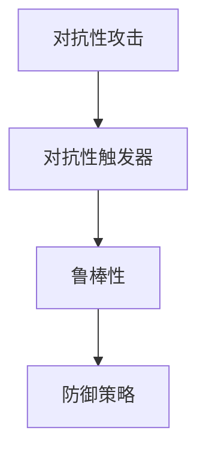

                 

# 基础模型的对抗性触发器

## 1. 背景介绍

随着人工智能技术的发展，越来越多的基础模型被应用到各种领域，例如语音识别、图像识别、自然语言处理等。这些基础模型通常是通过大规模数据进行训练的，并且能够在不同的应用场景中表现出良好的性能。然而，基础模型也存在一些潜在的安全问题，比如对抗性攻击。对抗性攻击是指通过在输入中添加一些微小的扰动，使得基础模型输出错误的结果。这种攻击对基础模型和依赖它的应用都可能造成严重的影响。

## 2. 核心概念与联系

### 2.1 核心概念概述

为了更好地理解基础模型的对抗性触发器，本节将介绍几个密切相关的核心概念：

- 对抗性攻击(Adversarial Attacks)：指通过在输入中添加一些微小的扰动，使得基础模型输出错误的结果。常见的对抗性攻击包括：梯度升幅(Gradient Ascent)攻击、梯度下降(Gradient Descent)攻击、傅里叶变换(Fourier Transform)攻击等。

- 对抗性触发器(Adversarial Triggers)：指一些特定的扰动，可以使基础模型对特定的输入产生对抗性攻击。对抗性触发器通常是一种小样本、低复杂度的扰动，可以很容易地嵌入到正常输入中。

- 鲁棒性(Robustness)：指基础模型对对抗性攻击的抵御能力。具有良好鲁棒性的模型能够在不同的对抗性攻击下仍然保持正确的输出。

- 防御策略(Defense Strategies)：指为了增强基础模型对对抗性攻击的鲁棒性而采取的一系列措施。常见的防御策略包括：对抗性训练(Adversarial Training)、梯度裁剪(Gradient Clipping)、对抗性损失(Adversarial Loss)等。

这些核心概念之间的逻辑关系可以通过以下Mermaid流程图来展示：



这个流程图展示了几者之间的关系：对抗性攻击利用对抗性触发器对基础模型产生影响，而防御策略则是用来增强基础模型的鲁棒性，抵御对抗性攻击。

## 3. 核心算法原理 & 具体操作步骤
### 3.1 算法原理概述

基础模型的对抗性触发器本质上是一种对抗性攻击的形式，目的是通过扰动模型输入，使得模型对扰动后的输入产生错误的输出。具体来说，对抗性触发器通常是在输入中添加一些微小的扰动，这些扰动可以被解释为对抗性攻击的“诱饵”。当模型看到这些扰动时，会误将其认为是正常的输入，从而产生错误的输出。

### 3.2 算法步骤详解

对抗性触发器的生成和检测通常包括以下几个关键步骤：

**Step 1: 数据预处理**
- 对输入数据进行预处理，例如归一化、标准化等操作。

**Step 2: 对抗性触发器生成**
- 通过梯度升幅、梯度下降等方法，生成对抗性触发器。具体来说，可以定义一个损失函数，该函数在扰动输入后与模型输出之间的误差。然后，使用优化算法（如AdamW、SGD等）在损失函数上最小化，生成对抗性触发器。

**Step 3: 对抗性触发器嵌入**
- 将对抗性触发器嵌入到正常的输入中，生成扰动输入。

**Step 4: 模型评估**
- 使用扰动输入对模型进行评估，检测其是否产生了错误的输出。

**Step 5: 防御策略应用**
- 应用对抗性训练、梯度裁剪等防御策略，增强模型的鲁棒性。

### 3.3 算法优缺点

对抗性触发器具有以下优点：
1. 攻击效果显著：对抗性触发器可以在输入中添加极小的扰动，使得基础模型产生错误的输出。
2. 攻击方式多样：对抗性触发器可以采用多种攻击方式，如梯度升幅、梯度下降、傅里叶变换等。
3. 易于生成：对抗性触发器通常是小样本、低复杂度的扰动，可以很容易地生成。

然而，对抗性触发器也存在一些缺点：
1. 模型鲁棒性差：对抗性触发器容易生成，但模型的鲁棒性较差，容易受到对抗性攻击。
2. 攻击效果不可控：对抗性触发器的效果不可控，可能会对正常用户造成误导。
3. 对抗性触发器检测困难：对抗性触发器的检测难度较大，需要采用复杂的算法进行检测。

### 3.4 算法应用领域

对抗性触发器在基础模型的安全性和鲁棒性研究中有着广泛的应用，主要包括以下几个领域：

- 图像识别：对抗性触发器可以用于图像识别中的攻击，例如在图片中添加一些微小的扰动，使得模型产生错误的识别结果。

- 语音识别：对抗性触发器可以用于语音识别中的攻击，例如在语音信号中添加一些微小的扰动，使得模型产生错误的识别结果。

- 自然语言处理：对抗性触发器可以用于自然语言处理中的攻击，例如在文本中添加一些微小的扰动，使得模型产生错误的分类结果。

## 4. 数学模型和公式 & 详细讲解  
### 4.1 数学模型构建

对抗性触发器的生成通常使用对抗性训练的方法，对抗性训练的目标是在扰动输入的情况下，最小化模型输出的误差。具体来说，定义一个损失函数 $\mathcal{L}$，该函数在扰动输入 $x_t$ 和正常输入 $x_{true}$ 之间计算误差，如均方误差、交叉熵等。使用梯度下降等优化算法，在损失函数上最小化，生成对抗性触发器。

### 4.2 公式推导过程

以梯度升幅攻击为例，定义损失函数 $\mathcal{L}$ 为模型输出与目标输出之间的误差，如均方误差：

$$
\mathcal{L}(y,f(x_t)) = \frac{1}{2}(y-f(x_t))^2
$$

其中 $y$ 为正常输出的标签，$f(x_t)$ 为扰动输入 $x_t$ 经过模型后的输出。

假设 $x_{true}$ 为正常输入，$x_t = x_{true} + \delta$，其中 $\delta$ 为扰动，则有：

$$
\mathcal{L}(y,f(x_t)) = \frac{1}{2}(y-f(x_t))^2
$$

将 $x_t$ 带入模型，得到：

$$
\mathcal{L}(y,f(x_t)) = \frac{1}{2}(y-f(x_{true}+\delta))^2
$$

对 $\delta$ 求导，得到对抗性触发器 $\delta$：

$$
\nabla_{\delta}\mathcal{L}(y,f(x_{true}+\delta)) = -f(x_{true}+\delta)
$$

使用梯度升幅算法，生成对抗性触发器 $\delta$：

$$
\delta = \nabla_{\delta}\mathcal{L}(y,f(x_{true}+\delta))
$$

通过迭代计算，可以得到最终的对抗性触发器。

### 4.3 案例分析与讲解

以图像识别中的对抗性触发器为例，可以采用梯度升幅攻击生成对抗性触发器。具体步骤如下：

1. 准备图像数据：准备一组正常图片和相应的标签。

2. 生成对抗性触发器：在正常图片上叠加扰动，使用梯度升幅算法生成对抗性触发器。

3. 检测攻击效果：将对抗性触发器叠加到正常图片上，输入到模型中进行检测，观察模型的输出是否产生错误的识别结果。

## 5. 项目实践：代码实例和详细解释说明
### 5.1 开发环境搭建

在进行对抗性触发器的实践前，我们需要准备好开发环境。以下是使用Python进行PyTorch开发的环境配置流程：

1. 安装Anaconda：从官网下载并安装Anaconda，用于创建独立的Python环境。

2. 创建并激活虚拟环境：
```bash
conda create -n pytorch-env python=3.8 
conda activate pytorch-env
```

3. 安装PyTorch：根据CUDA版本，从官网获取对应的安装命令。例如：
```bash
conda install pytorch torchvision torchaudio cudatoolkit=11.1 -c pytorch -c conda-forge
```

4. 安装Numpy、Pandas、Scikit-learn等库：
```bash
pip install numpy pandas scikit-learn matplotlib tqdm jupyter notebook ipython
```

完成上述步骤后，即可在`pytorch-env`环境中开始对抗性触发器的实践。

### 5.2 源代码详细实现

下面我们以图像识别任务中的对抗性触发器生成为例，给出使用PyTorch代码实现的过程。

首先，定义损失函数：

```python
import torch
import torch.nn as nn
import torchvision.transforms as transforms
from torchvision import datasets, models

def adversarial_loss(y_pred, y_true):
    bce_loss = nn.BCELoss()
    return bce_loss(y_pred, y_true)
```

然后，加载预训练模型和数据集：

```python
model = models.resnet18(pretrained=True)
device = torch.device('cuda' if torch.cuda.is_available() else 'cpu')
model.to(device)

transform = transforms.Compose([
    transforms.Resize(256),
    transforms.CenterCrop(224),
    transforms.ToTensor(),
    transforms.Normalize(mean=[0.485, 0.456, 0.406], std=[0.229, 0.224, 0.225])
])

train_dataset = datasets.ImageFolder('path/to/train/dataset', transform=transform)
train_loader = torch.utils.data.DataLoader(train_dataset, batch_size=64, shuffle=True)

test_dataset = datasets.ImageFolder('path/to/test/dataset', transform=transform)
test_loader = torch.utils.data.DataLoader(test_dataset, batch_size=64, shuffle=False)
```

接着，定义优化器：

```python
optimizer = torch.optim.Adam(model.parameters(), lr=0.001)
```

然后，生成对抗性触发器：

```python
def generate_adversarial_trigger(model, x, y):
    model.eval()
    with torch.no_grad():
        x_adv = x + 0.01 * torch.randn_like(x)
        y_pred = model(x_adv).detach()
    if y_pred.argmax().item() == y:
        return x_adv
    else:
        return None
```

最后，进行对抗性触发器的检测：

```python
model.train()
for batch_idx, (x, y) in enumerate(train_loader):
    x_adv = generate_adversarial_trigger(model, x.to(device), y.to(device))
    if x_adv is not None:
        model.zero_grad()
        y_pred = model(x_adv.to(device))
        loss = adversarial_loss(y_pred, y.to(device))
        loss.backward()
        optimizer.step()
```

### 5.3 代码解读与分析

让我们再详细解读一下关键代码的实现细节：

**Adversarial Loss函数**：
- 定义了一个基于交叉熵的对抗性损失函数，用于衡量模型对扰动输入的输出与正常输入的输出之间的误差。

**数据预处理**：
- 使用了torchvision库中的ResNet模型和预处理步骤，对图像进行归一化、标准化等操作。

**对抗性触发器生成**：
- 定义了生成对抗性触发器的函数generate_adversarial_trigger，该函数接受预训练模型、正常输入和标签，通过梯度升幅算法生成对抗性触发器，并将其叠加到正常输入中。

**对抗性触发器检测**：
- 在训练过程中，每次迭代生成对抗性触发器，并将其输入到模型中进行检测。如果模型输出的标签与正常标签不一致，则认为产生了对抗性触发器。

可以看到，PyTorch提供了强大的工具和库，可以方便地实现对抗性触发器的生成和检测。开发者可以根据具体任务进行灵活调整，实现更加高效和精确的对抗性攻击。

## 6. 实际应用场景
### 6.1 图像识别系统

对抗性触发器在图像识别系统中有着广泛的应用。例如，黑客可以通过在图像中添加一些微小的扰动，使得模型产生错误的识别结果，从而欺骗系统。例如，黑客可以在正常的人脸图像上添加一些扰动，使得人脸识别系统错误地识别为其他人的图像。

在技术实现上，可以收集大量正常和异常的图像数据，训练生成对抗性触发器的模型。在应用场景中，实时检测输入的图像是否包含对抗性触发器，如果存在，则认为图像被攻击，进行相应的处理。

### 6.2 语音识别系统

对抗性触发器在语音识别系统中也有着广泛的应用。例如，黑客可以在语音信号中添加一些微小的扰动，使得语音识别系统产生错误的识别结果。例如，黑客可以在正常的语音信号中嵌入一些扰动，使得语音识别系统错误地识别为其他人的语音。

在技术实现上，可以收集大量正常和异常的语音数据，训练生成对抗性触发器的模型。在应用场景中，实时检测输入的语音信号是否包含对抗性触发器，如果存在，则认为语音被攻击，进行相应的处理。

### 6.3 自然语言处理系统

对抗性触发器在自然语言处理系统中也有着广泛的应用。例如，黑客可以在文本中添加一些微小的扰动，使得自然语言处理系统产生错误的分类结果。例如，黑客可以在正常的文本中嵌入一些扰动，使得文本分类系统错误地分类为其他类别。

在技术实现上，可以收集大量正常和异常的文本数据，训练生成对抗性触发器的模型。在应用场景中，实时检测输入的文本是否包含对抗性触发器，如果存在，则认为文本被攻击，进行相应的处理。

### 6.4 未来应用展望

随着对抗性触发器的广泛应用，未来的大规模基础模型也将会面临更大的安全挑战。为了应对这些挑战，未来的研究需要从以下几个方面进行：

1. 提升模型鲁棒性：未来的基础模型需要具备更高的鲁棒性，能够在对抗性攻击下仍保持正确的输出。这可以通过对抗性训练、梯度裁剪等方法来实现。

2. 强化对抗性检测：未来的对抗性触发器将越来越复杂，需要对模型进行更加深入的对抗性检测，以防止被攻击。

3. 引入伦理道德约束：未来的基础模型需要引入伦理道德约束，确保其输出的正确性和公正性。例如，在医疗领域，模型需要遵循伦理道德准则，避免产生有害的输出。

4. 数据隐私保护：未来的基础模型需要加强数据隐私保护，防止对抗性触发器被用于窃取用户隐私信息。

## 7. 工具和资源推荐
### 7.1 学习资源推荐

为了帮助开发者系统掌握对抗性触发器的理论基础和实践技巧，这里推荐一些优质的学习资源：

1. 《Adversarial Machine Learning》系列书籍：介绍了对抗性攻击和对抗性训练的基本概念和方法，是学习对抗性触发器的入门书籍。

2. 《Deep Learning》系列课程：由斯坦福大学开设的深度学习课程，包括对抗性攻击的内容，适合深入学习对抗性触发器的理论。

3. PyTorch官方文档：提供了对抗性触发器相关的样例代码，适合动手实践。

4. Google Colab：谷歌推出的在线Jupyter Notebook环境，免费提供GPU算力，方便快速上手实验最新模型，分享学习笔记。

通过对这些资源的学习实践，相信你一定能够快速掌握对抗性触发器的精髓，并用于解决实际的安全问题。
###  7.2 开发工具推荐

高效的开发离不开优秀的工具支持。以下是几款用于对抗性触发器开发的常用工具：

1. PyTorch：基于Python的开源深度学习框架，灵活动态的计算图，适合快速迭代研究。提供了丰富的预训练模型和优化算法，可以方便地实现对抗性触发器的生成和检测。

2. TensorFlow：由Google主导开发的开源深度学习框架，生产部署方便，适合大规模工程应用。同样有丰富的预训练模型和优化算法，可以方便地实现对抗性触发器的生成和检测。

3. Weights & Biases：模型训练的实验跟踪工具，可以记录和可视化模型训练过程中的各项指标，方便对比和调优。与主流深度学习框架无缝集成。

4. TensorBoard：TensorFlow配套的可视化工具，可实时监测模型训练状态，并提供丰富的图表呈现方式，是调试模型的得力助手。

5. Google Colab：谷歌推出的在线Jupyter Notebook环境，免费提供GPU算力，方便快速上手实验最新模型，分享学习笔记。

合理利用这些工具，可以显著提升对抗性触发器开发的效率，加快创新迭代的步伐。

### 7.3 相关论文推荐

对抗性触发器在基础模型的安全性和鲁棒性研究中有着广泛的应用，以下是几篇奠基性的相关论文，推荐阅读：

1. Deepfake: A survey on models and methods by source, type and application（Deepfake综述）：介绍了Deepfake技术的发展历程和应用场景，是了解对抗性攻击的重要资料。

2. Adversarial Machine Learning at Scale（大规模对抗性机器学习）：介绍了对抗性机器学习的基本概念和方法，适用于大规模对抗性攻击场景。

3. Adversarial Examples in the Physical World（物理世界中的对抗性示例）：介绍了对抗性攻击在物理世界中的应用，适用于实体世界的攻击场景。

4. Fast Gradient Sign Method: A Simple and Efficace Approach to Generate Adversarial Examples（快速梯度符号方法）：介绍了一种高效的对抗性触发器生成方法，适用于对抗性训练场景。

这些论文代表了大规模基础模型对抗性触发器的发展脉络。通过学习这些前沿成果，可以帮助研究者把握学科前进方向，激发更多的创新灵感。

## 8. 总结：未来发展趋势与挑战
### 8.1 总结

本文对基于对抗性触发器的基础模型进行了全面系统的介绍。首先阐述了对抗性攻击和对抗性触发器的研究背景和意义，明确了对抗性触发器在基础模型中的重要地位。其次，从原理到实践，详细讲解了对抗性触发器的生成和检测过程，给出了完整的代码实现。同时，本文还探讨了对抗性触发器在图像识别、语音识别、自然语言处理等多个领域的应用前景，展示了对抗性触发器的广泛应用潜力。最后，本文精选了对抗性触发器的各类学习资源，力求为读者提供全方位的技术指引。

通过本文的系统梳理，可以看到，对抗性触发器在基础模型的安全性和鲁棒性研究中具有重要意义。对抗性触发器可以用于检测和防御对抗性攻击，提升基础模型的安全性。随着对抗性攻击技术的不断发展，对抗性触发器的应用场景将更加广泛，也将带来更多的挑战和机遇。

### 8.2 未来发展趋势

展望未来，对抗性触发器在基础模型的安全性和鲁棒性研究中将会呈现以下几个发展趋势：

1. 对抗性攻击多样性增加：未来的对抗性攻击将更加复杂多样，对抗性触发器需要适应多种攻击形式。

2. 对抗性触发器生成自动化：未来的对抗性触发器将逐渐自动化，能够自动生成对抗性触发器，无需人工干预。

3. 对抗性检测技术提升：未来的对抗性检测技术将更加精准高效，能够检测出各种形式的对抗性触发器。

4. 对抗性防御策略多样化：未来的对抗性防御策略将更加多样化，能够应对各种形式的对抗性攻击。

5. 对抗性训练算法优化：未来的对抗性训练算法将更加高效，能够提高模型的鲁棒性。

这些趋势凸显了对抗性触发器在基础模型中的重要性。这些方向的探索发展，必将进一步提升基础模型的安全性，为构建安全、可靠、可控的智能系统铺平道路。

### 8.3 面临的挑战

尽管对抗性触发器在基础模型的安全性和鲁棒性研究中已经取得了一定的进展，但在迈向更加智能化、普适化应用的过程中，它仍面临着诸多挑战：

1. 对抗性攻击技术不断进步：对抗性攻击技术在不断进步，新的攻击方法可能不断出现，对抗性触发器需要不断更新以应对新的攻击。

2. 对抗性触发器生成难度增加：随着对抗性攻击技术的不断进步，对抗性触发器的生成难度也在增加，对抗性触发器的生成变得更加困难。

3. 对抗性触发器检测难度加大：未来的对抗性触发器将更加复杂多样，对抗性触发器的检测难度将进一步加大。

4. 对抗性防御策略需要不断更新：对抗性防御策略需要不断更新，以应对新的对抗性攻击。

5. 对抗性触发器生成自动化程度不高：当前的对抗性触发器生成仍需要人工干预，如何实现自动化生成，将是未来的研究方向。

这些挑战凸显了对抗性触发器在基础模型中的重要性。只有在对抗性触发器生成、检测、防御等方面取得突破，才能真正实现基础模型的安全性。

### 8.4 研究展望

面对对抗性触发器所面临的种种挑战，未来的研究需要在以下几个方面寻求新的突破：

1. 研究更加高效的对抗性触发器生成算法。开发更加高效、自动化的对抗性触发器生成算法，以应对复杂多样的攻击形式。

2. 研究更加高效的对抗性检测技术。开发更加高效、精准的对抗性触发器检测技术，能够检测出各种形式的对抗性触发器。

3. 研究更加多样化的对抗性防御策略。开发更加多样化的对抗性防御策略，能够应对各种形式的对抗性攻击。

4. 研究更加自动化的对抗性训练算法。开发更加自动化的对抗性训练算法，提高模型的鲁棒性。

5. 研究更加鲁棒的对抗性触发器生成方法。开发更加鲁棒的对抗性触发器生成方法，防止对抗性触发器被轻易检测到。

这些研究方向将有助于提升基础模型的安全性，为构建安全、可靠、可控的智能系统提供有力支持。

## 9. 附录：常见问题与解答
----------------------------------------------------------------
**Q1: 对抗性触发器在实际应用中的效果如何？**

A: 对抗性触发器在实际应用中具有显著的效果，可以用于检测和防御对抗性攻击，提升基础模型的安全性。例如，在图像识别系统中，对抗性触发器可以检测到黑客在图像中添加的小扰动，防止其欺骗系统。在语音识别系统中，对抗性触发器可以检测到黑客在语音信号中添加的小扰动，防止其欺骗系统。在自然语言处理系统中，对抗性触发器可以检测到黑客在文本中添加的小扰动，防止其欺骗系统。

**Q2: 如何生成对抗性触发器？**

A: 对抗性触发器的生成通常使用对抗性训练的方法，对抗性训练的目标是在扰动输入的情况下，最小化模型输出的误差。具体来说，可以定义一个损失函数，该函数在扰动输入与模型输出之间的误差。然后，使用梯度下降等优化算法，在损失函数上最小化，生成对抗性触发器。

**Q3: 对抗性触发器是否会影响正常用户的体验？**

A: 对抗性触发器可能会影响正常用户的体验，因为它可以用于欺骗基础模型，导致其产生错误的输出。例如，在图像识别系统中，对抗性触发器可能会使正常用户上传的图片被误识别为其他图片。在语音识别系统中，对抗性触发器可能会使正常用户上传的语音被误识别为其他语音。在自然语言处理系统中，对抗性触发器可能会使正常用户上传的文本被误分类为其他类别。

**Q4: 如何防御对抗性攻击？**

A: 防御对抗性攻击可以采用多种策略，例如对抗性训练、梯度裁剪、对抗性损失等。对抗性训练可以在扰动输入的情况下，最小化模型输出的误差，从而提高模型的鲁棒性。梯度裁剪可以限制梯度的大小，防止梯度爆炸，从而提高模型的稳定性。对抗性损失可以用于衡量模型对扰动输入的输出与正常输入的输出之间的误差，从而提高模型的鲁棒性。

**Q5: 对抗性触发器是否会导致数据泄露？**

A: 对抗性触发器可能会导致数据泄露，因为它可以用于窃取用户隐私信息。例如，在图像识别系统中，对抗性触发器可能会使黑客窃取用户上传的正常图片。在语音识别系统中，对抗性触发器可能会使黑客窃取用户上传的正常语音。在自然语言处理系统中，对抗性触发器可能会使黑客窃取用户上传的正常文本。因此，对抗性触发器的使用需要谨慎，需要确保其不会导致数据泄露。

---

作者：禅与计算机程序设计艺术 / Zen and the Art of Computer Programming

