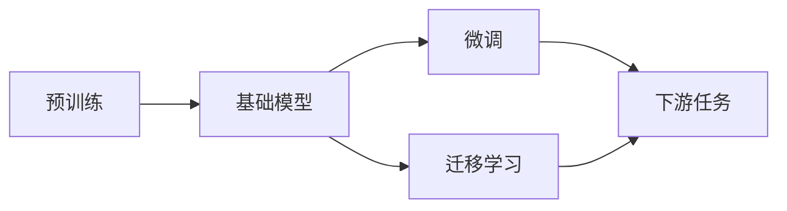

                 

# 基础模型的技术生态系统

## 1. 背景介绍

在人工智能（AI）和机器学习（ML）领域，基础模型（Base Models）已经成为了研究和应用的核心。它们是经过大规模数据预训练的通用模型，能够在各种任务上提供显著的性能提升。从大模型如GPT-3到小模型如MobileNet，基础模型的技术生态系统已经日益成熟。本文将系统地介绍基础模型，并探讨它们在技术生态系统中的地位、优势以及面临的挑战。

## 2. 核心概念与联系

### 2.1 核心概念概述

在讨论基础模型之前，我们先概述几个关键概念：

- **基础模型（Base Models）**：预训练模型，即在大规模数据上预训练得到的通用模型。这些模型能够从数据中学习到广泛的特征和模式，然后通过微调（Fine-Tuning）应用于特定任务。
- **预训练（Pre-training）**：在大规模无标签数据上训练模型，学习通用的特征和模式。
- **微调（Fine-Tuning）**：在预训练模型上使用少量有标签数据进行微调，以适应特定任务。
- **迁移学习（Transfer Learning）**：将一个领域的知识迁移到另一个领域，以适应新的任务。

这些概念之间存在紧密的联系，形成一个完整的技术生态系统。预训练模型提供了通用的特征表示，而微调和迁移学习则利用这些特征解决具体的任务。

### 2.2 核心概念原理和架构的 Mermaid 流程图



## 3. 核心算法原理 & 具体操作步骤

### 3.1 算法原理概述

基础模型是通过在大规模数据上预训练得到的。其核心原理是通过大规模无标签数据的预训练，模型能够学习到广泛的特征和模式，然后通过微调和迁移学习应用于特定任务。

预训练通常使用自监督学习任务，如掩码语言模型（Masked Language Model, MLM）和自回归模型（Autoregressive Model）。这些任务的目标是让模型能够预测缺失的数据，从而学习到语言的结构性和上下文信息。

微调和迁移学习则是在预训练模型的基础上，使用少量有标签数据进行微调，以适应特定任务。微调通常包括任务适配层的设计，以及优化器的选择和超参数的调整。

### 3.2 算法步骤详解

以下是基础模型的微调和迁移学习的一般步骤：

1. **预训练**：在大规模无标签数据上训练基础模型，学习通用的特征表示。
2. **微调**：在预训练模型的基础上，使用少量有标签数据进行微调，以适应特定任务。
3. **迁移学习**：将一个领域的知识迁移到另一个领域，以适应新的任务。

### 3.3 算法优缺点

**优点**：

- **泛化能力强**：基础模型在大规模数据上预训练，能够学习到广泛的特征和模式，因此在不同的任务上表现良好。
- **迁移能力强**：通过迁移学习，基础模型能够在不同的任务上表现出色。
- **效率高**：通过微调和迁移学习，基础模型能够快速适应新的任务，提高了模型训练的效率。

**缺点**：

- **计算资源需求高**：基础模型的预训练需要大量的计算资源，因此在计算资源有限的情况下，可能难以使用。
- **过拟合风险**：如果微调数据不足，模型可能会过拟合，影响性能。
- **知识迁移难度大**：从一个领域迁移到另一个领域，知识迁移的难度较大，需要仔细调整参数和策略。

### 3.4 算法应用领域

基础模型在多个领域得到了广泛应用，包括：

- **自然语言处理（NLP）**：如BERT、GPT-3、RoBERTa等模型，广泛应用于文本分类、情感分析、机器翻译等任务。
- **计算机视觉（CV）**：如ResNet、MobileNet等模型，广泛应用于图像分类、目标检测、图像生成等任务。
- **语音识别**：如Wav2Vec2等模型，广泛应用于语音识别、语音合成等任务。
- **推荐系统**：如矩阵分解模型、协同过滤模型等，广泛应用于电商、新闻、视频等领域的推荐任务。

## 4. 数学模型和公式 & 详细讲解 & 举例说明

### 4.1 数学模型构建

基础模型的数学模型通常由预训练模型和微调模型两部分组成。预训练模型通过在大规模无标签数据上训练得到，微调模型则是在预训练模型的基础上进行微调，以适应特定任务。

### 4.2 公式推导过程

以BERT为例，BERT的预训练任务包括掩码语言模型（Masked Language Model, MLM）和下一句预测（Next Sentence Prediction, NSP）。掩码语言模型的目标是在一个句子中预测被掩码的词，下一句预测的目标是判断两个句子是否相邻。

掩码语言模型的损失函数为：

$$
\mathcal{L}_{MLM} = -\frac{1}{N} \sum_{i=1}^N \sum_{j=1}^M \log p(w_j|w_{<j})
$$

其中，$N$ 是句子的数量，$M$ 是句子中单词的数量，$p(w_j|w_{<j})$ 是预测单词 $w_j$ 在上下文 $w_{<j}$ 中的概率。

下一句预测的损失函数为：

$$
\mathcal{L}_{NSP} = -\frac{1}{N} \sum_{i=1}^N (\log p(c_i) + \log p(c_i^c))
$$

其中，$c_i$ 表示第 $i$ 个句子是相邻句子的概率，$c_i^c$ 表示第 $i$ 个句子不是相邻句子的概率。

### 4.3 案例分析与讲解

以BERT为例，BERT通过在大规模无标签数据上进行预训练，学习到通用的语言表示。然后，通过微调应用于特定的NLP任务，如情感分析、问答系统等。

## 5. 项目实践：代码实例和详细解释说明

### 5.1 开发环境搭建

为了实现基础模型的微调和迁移学习，我们需要搭建一个合适的开发环境。以下是Python环境下搭建环境的步骤：

1. **安装Anaconda**：从官网下载并安装Anaconda，用于创建独立的Python环境。
2. **创建并激活虚拟环境**：
```bash
conda create -n base_model_env python=3.8
conda activate base_model_env
```

3. **安装依赖库**：
```bash
pip install transformers torch torchvision numpy pandas
```

### 5.2 源代码详细实现

以下是一个简单的代码示例，用于实现BERT模型在情感分析任务上的微调：

```python
import torch
import torch.nn as nn
import torch.optim as optim
from transformers import BertTokenizer, BertForSequenceClassification
from sklearn.metrics import accuracy_score

# 加载预训练的BERT模型和分词器
tokenizer = BertTokenizer.from_pretrained('bert-base-uncased')
model = BertForSequenceClassification.from_pretrained('bert-base-uncased', num_labels=2)

# 加载数据集
train_data = # 训练数据集
test_data = # 测试数据集

# 定义训练函数
def train_epoch(model, data_loader, optimizer):
    model.train()
    total_loss = 0
    for batch in data_loader:
        input_ids = batch['input_ids']
        attention_mask = batch['attention_mask']
        labels = batch['labels']
        optimizer.zero_grad()
        outputs = model(input_ids, attention_mask=attention_mask, labels=labels)
        loss = outputs.loss
        loss.backward()
        optimizer.step()
        total_loss += loss.item()
    return total_loss / len(data_loader)

# 训练模型
train_loader = # 训练数据集的数据加载器
optimizer = optim.Adam(model.parameters(), lr=1e-5)
for epoch in range(10):
    total_loss = train_epoch(model, train_loader, optimizer)
    print(f'Epoch {epoch+1}, loss: {total_loss:.3f}')
    
# 评估模型
test_loader = # 测试数据集的数据加载器
model.eval()
total_correct = 0
for batch in test_loader:
    input_ids = batch['input_ids']
    attention_mask = batch['attention_mask']
    labels = batch['labels']
    outputs = model(input_ids, attention_mask=attention_mask)
    predictions = outputs.logits.argmax(dim=1)
    total_correct += (predictions == labels).sum().item()
print(f'Test accuracy: {total_correct / len(test_loader)}')
```

### 5.3 代码解读与分析

上述代码展示了BERT模型在情感分析任务上的微调过程。我们首先加载了预训练的BERT模型和分词器，然后定义了训练函数和评估函数，最后通过循环迭代训练和评估模型。

## 6. 实际应用场景

### 6.1 自然语言处理（NLP）

基础模型在NLP领域得到了广泛应用，如BERT、GPT-3、RoBERTa等模型。BERT通过在大规模无标签数据上进行预训练，学习到了通用的语言表示，然后通过微调应用于情感分析、问答系统等任务。

### 6.2 计算机视觉（CV）

基础模型在CV领域也有广泛应用，如ResNet、MobileNet等模型。这些模型通过在大规模数据上预训练，学习到了通用的特征表示，然后通过微调应用于图像分类、目标检测等任务。

### 6.3 语音识别

基础模型在语音识别领域也有应用，如Wav2Vec2等模型。这些模型通过在大规模无标签音频数据上进行预训练，学习到了语音的特征表示，然后通过微调应用于语音识别、语音合成等任务。

### 6.4 推荐系统

基础模型在推荐系统领域也有应用，如矩阵分解模型、协同过滤模型等。这些模型通过在大规模数据上预训练，学习到了用户和物品的特征表示，然后通过微调应用于电商、新闻、视频等领域的推荐任务。

## 7. 工具和资源推荐

### 7.1 学习资源推荐

为了深入理解基础模型的原理和实践，推荐以下学习资源：

1. **《Deep Learning with PyTorch》**：由François Chollet和Lisa Girard等人编写的深度学习入门书籍，全面介绍了PyTorch的使用。
2. **《Natural Language Processing in Action》**：由Jurafsky和Martin编写的NLP教材，涵盖了NLP领域的各个方面。
3. **《TensorFlow官方文档》**：TensorFlow官方文档提供了丰富的教程和样例，适合学习TensorFlow的使用。
4. **《Transformers官方文档》**：Transformers官方文档提供了丰富的预训练模型和微调样例，适合学习Transformer的使用。

### 7.2 开发工具推荐

以下是一些用于基础模型开发的常用工具：

1. **PyTorch**：基于Python的开源深度学习框架，适合快速迭代研究。
2. **TensorFlow**：由Google主导开发的开源深度学习框架，适合大规模工程应用。
3. **TensorBoard**：TensorFlow配套的可视化工具，可实时监测模型训练状态，并提供丰富的图表呈现方式。
4. **Weights & Biases**：模型训练的实验跟踪工具，可以记录和可视化模型训练过程中的各项指标。

### 7.3 相关论文推荐

以下是几篇关于基础模型的重要论文，推荐阅读：

1. **《BERT: Pre-training of Deep Bidirectional Transformers for Language Understanding》**：提出BERT模型，通过掩码语言模型和下一句预测任务进行预训练。
2. **《ResNet: Deep Residual Learning for Image Recognition》**：提出ResNet模型，通过残差连接解决深层网络训练中的梯度消失问题。
3. **《MobileNets: Efficient Convolutional Neural Networks for Mobile Vision Applications》**：提出MobileNet模型，通过深度可分离卷积提高模型的计算效率。
4. **《Wav2Vec 2.0: A Framework for Self-Supervised Learning of Speech Representation》**：提出Wav2Vec2模型，通过自监督学习任务进行语音表示学习。

## 8. 总结：未来发展趋势与挑战

### 8.1 研究成果总结

基础模型通过预训练和微调，已经在多个领域取得了显著的性能提升。其通用性和迁移学习能力使得它在研究和应用中占据重要地位。然而，基础模型也面临计算资源需求高、过拟合风险大等挑战。

### 8.2 未来发展趋势

未来，基础模型将继续朝着以下几个方向发展：

1. **模型规模更大**：随着计算资源和数据量的增加，模型的规模将继续扩大，学习更多的特征和模式。
2. **参数高效微调**：通过参数高效微调方法，在固定大部分预训练参数的情况下，只更新极少量的任务相关参数，提高模型的计算效率。
3. **多模态融合**：将视觉、语音等多模态信息与文本信息进行融合，实现更加全面和准确的信息表示。
4. **无监督和半监督学习**：探索无监督和半监督学习方法，在数据量有限的情况下，利用非结构化数据进行学习。
5. **因果推理**：通过引入因果推理方法，增强模型的因果关系理解和推理能力。

### 8.3 面临的挑战

基础模型虽然取得了显著的进展，但也面临一些挑战：

1. **计算资源需求高**：基础模型的规模越来越大，计算资源的需求也越来越高，需要更多的算力支持。
2. **过拟合风险大**：在微调过程中，如果数据量不足，模型可能会过拟合，影响性能。
3. **知识迁移难度大**：从一个领域迁移到另一个领域，知识迁移的难度较大，需要仔细调整参数和策略。
4. **可解释性不足**：基础模型的决策过程缺乏可解释性，难以理解和调试。

### 8.4 研究展望

未来，基础模型的研究需要从以下几个方向进行探索：

1. **无监督和半监督学习**：探索无监督和半监督学习方法，在数据量有限的情况下，利用非结构化数据进行学习。
2. **参数高效微调**：通过参数高效微调方法，在固定大部分预训练参数的情况下，只更新极少量的任务相关参数，提高模型的计算效率。
3. **多模态融合**：将视觉、语音等多模态信息与文本信息进行融合，实现更加全面和准确的信息表示。
4. **因果推理**：通过引入因果推理方法，增强模型的因果关系理解和推理能力。
5. **知识图谱融合**：将知识图谱与基础模型进行融合，提高模型的知识整合能力和推理能力。

## 9. 附录：常见问题与解答

**Q1: 如何选择合适的预训练模型？**

A: 选择合适的预训练模型需要考虑以下几个因素：
- **任务类型**：不同的任务适合不同的预训练模型，例如NLP任务适合BERT、GPT等模型，CV任务适合ResNet、MobileNet等模型。
- **数据规模**：数据量较大的任务适合使用大规模预训练模型，数据量较小的情况下可以选择小规模模型。
- **计算资源**：计算资源有限的情况下可以选择小规模模型，计算资源充足的情况下可以选择大规模模型。

**Q2: 如何提高模型的计算效率？**

A: 提高模型的计算效率可以通过以下几个方法：
- **参数高效微调**：只更新少量的任务相关参数，固定大部分预训练参数。
- **模型压缩**：使用模型压缩技术，如剪枝、量化等，减小模型的存储空间和计算量。
- **多任务学习**：同时训练多个任务，共享预训练模型的特征表示，提高计算效率。

**Q3: 如何提高模型的可解释性？**

A: 提高模型的可解释性可以通过以下几个方法：
- **可解释性模块**：在模型中引入可解释性模块，如LIME、SHAP等，解释模型的决策过程。
- **可视化技术**：使用可视化技术，如热力图、特征图等，展示模型的特征表示。
- **知识图谱融合**：将知识图谱与基础模型进行融合，提高模型的知识整合能力和推理能力，增强可解释性。

**Q4: 如何避免过拟合？**

A: 避免过拟合可以通过以下几个方法：
- **数据增强**：通过数据增强技术，如回译、近义替换等，扩充训练集。
- **正则化**：使用L2正则化、Dropout等技术，防止过拟合。
- **对抗训练**：引入对抗样本，提高模型的鲁棒性，防止过拟合。
- **多任务学习**：同时训练多个任务，防止过拟合。

**Q5: 如何处理数据不平衡问题？**

A: 处理数据不平衡问题可以通过以下几个方法：
- **重采样**：通过重采样技术，如欠采样、过采样等，平衡数据集的类别分布。
- **类别权重**：在损失函数中引入类别权重，提高少数类别的权重，平衡数据集。
- **生成对抗网络**：使用生成对抗网络，生成更多的少数类别样本，平衡数据集。

---

作者：禅与计算机程序设计艺术 / Zen and the Art of Computer Programming

