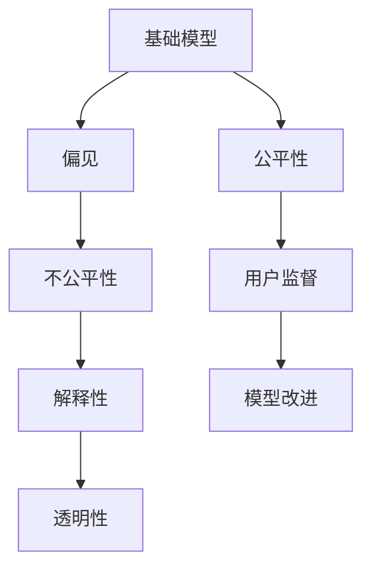

                 

# 基础模型的社会公平问题

## 1. 背景介绍

随着人工智能技术的迅猛发展，基础模型在许多领域的应用日益广泛。然而，人们逐渐发现基础模型的应用常常伴随着一系列社会公平问题，这些问题不仅涉及技术本身的公平性，更关系到模型使用过程中对社会的负面影响。本文将系统地探讨这些社会公平问题，并提出解决策略，以期推动人工智能技术的公平发展。

## 2. 核心概念与联系

### 2.1 核心概念概述

在探讨基础模型的社会公平问题时，首先需要明确几个核心概念：

- **基础模型（Foundation Models）**：指用于多个领域的高性能通用模型，如GPT、BERT等。这些模型通常在大规模无标签数据上预训练，并在特定任务上进行微调。
- **偏见（Bias）**：指在数据或模型训练过程中出现的偏向性，可能导致对某些群体的歧视或不公平对待。
- **公平性（Fairness）**：指在模型决策和应用过程中，对所有用户提供无偏的、平等的待遇。
- **解释性（Explainability）**：指模型决策过程的可解释性，即用户能够理解模型如何做出特定决策。
- **透明性（Transparency）**：指模型使用的算法和参数设置的公开透明，使得用户和监管机构能够监督和审查。

这些概念之间存在着紧密的联系。基础模型的偏见问题可能导致其应用中的不公平性，而缺乏解释性和透明性则进一步加剧了这些问题。只有确保模型的公平性、解释性和透明性，才能真正实现技术对社会的公平贡献。

### 2.2 核心概念原理和架构的 Mermaid 流程图



该流程图展示了基础模型、偏见、不公平性、解释性和透明性之间的联系。基础模型的偏见问题可能导致不公平性，而解释性和透明性可以提升模型的公平性，进而接受用户监督和改进。

## 3. 核心算法原理 & 具体操作步骤

### 3.1 算法原理概述

基础模型的社会公平问题主要集中在偏见和公平性上。本节将详细探讨这些问题，并提出解决策略。

### 3.2 算法步骤详解

#### 3.2.1 偏见问题

偏见问题通常源于训练数据的不平衡或特征选择的偏差。解决偏见问题的方法主要有以下几种：

- **数据清洗**：在数据预处理阶段，清洗包含偏见的数据，确保数据集的多样性和代表性。
- **算法调整**：在模型训练阶段，调整模型的损失函数和优化算法，使其对偏见敏感。
- **公平性约束**：在模型训练阶段，引入公平性约束，如使用差分隐私技术保护敏感特征。

#### 3.2.2 公平性问题

公平性问题通常涉及模型在不同群体中的表现差异。解决公平性问题的方法主要有以下几种：

- **公平性指标**：引入公平性指标，如平等误差（Equalized Odds）、民主公平（Democratic Parity）等，评估模型在不同群体中的表现。
- **公平性约束**：在模型训练阶段，引入公平性约束，如使用对抗性训练技术，使得模型在不同群体中的表现尽可能均衡。
- **公平性优化**：在模型训练阶段，优化模型参数，使其在不同群体中的表现更接近理想状态。

### 3.3 算法优缺点

#### 3.3.1 偏见问题的解决

解决偏见问题的方法具有以下优点和缺点：

- **优点**：
  - **减少偏见**：通过数据清洗和算法调整，可以显著减少模型中的偏见。
  - **提高公平性**：引入公平性约束和优化，可以进一步提升模型的公平性。

- **缺点**：
  - **数据成本**：数据清洗和公平性约束可能需要大量标注数据，成本较高。
  - **算法复杂**：引入公平性约束和优化可能需要调整复杂的模型，增加了开发难度。

#### 3.3.2 公平性问题的解决

解决公平性问题的方法具有以下优点和缺点：

- **优点**：
  - **改善表现**：通过公平性指标和约束，可以显著改善模型在不同群体中的表现。
  - **提升可信度**：引入公平性优化，可以提升模型的可信度，增强用户信任。

- **缺点**：
  - **性能损失**：引入公平性约束和优化可能导致模型性能下降。
  - **实际应用复杂**：公平性优化可能需要调整复杂的模型，增加了实际应用的难度。

### 3.4 算法应用领域

基础模型的社会公平问题在多个领域中都有显著的影响，主要包括：

- **医疗健康**：基础模型在医疗诊断和治疗中的应用，必须确保对不同性别、种族和年龄群体的公平性。
- **金融服务**：基础模型在贷款审批和信用评估中的应用，必须避免对低收入群体和少数族裔的偏见。
- **教育公平**：基础模型在教育资源分配和个性化推荐中的应用，必须确保对不同学生群体的公平性。
- **司法公正**：基础模型在司法判决和案件分析中的应用，必须避免对不同人群的歧视和不公。

## 4. 数学模型和公式 & 详细讲解 & 举例说明

### 4.1 数学模型构建

在基础模型中，通常使用神经网络模型进行训练和推理。假设我们使用一个简单的全连接神经网络，其输入为 $x \in \mathbb{R}^d$，输出为 $y \in \mathbb{R}$。模型的目标是最小化损失函数 $\mathcal{L}(y,\hat{y})$，其中 $\hat{y}=f(x)$ 为模型的预测输出。

### 4.2 公式推导过程

#### 4.2.1 损失函数

假设我们关注的是二分类任务，使用交叉熵损失函数 $\mathcal{L}(y,\hat{y}) = -\frac{1}{N}\sum_{i=1}^N(y_i\log \hat{y}_i + (1-y_i)\log (1-\hat{y}_i))$。

#### 4.2.2 公平性约束

引入公平性约束，假设我们希望模型在不同性别（male和female）上的表现相等，即 $y_{male} = y_{female}$。我们可以通过引入公平性约束来最小化损失函数，使得 $y_{male} \approx y_{female}$。

### 4.3 案例分析与讲解

假设我们有一个基础模型，用于预测贷款申请的信用评分。模型在训练集上的表现如下：

| 特征 | 男性 | 女性 |
|------|------|------|
| 平均信用评分 | 0.8  | 0.7  |
| 平均收入 | 5000 | 4000 |

可以看到，模型在男性和女性上的平均信用评分存在差异。为了解决这个问题，我们可以引入公平性约束，使得男性和女性的平均信用评分尽可能相等。

## 5. 项目实践：代码实例和详细解释说明

### 5.1 开发环境搭建

在进行基础模型训练时，通常需要使用高性能计算平台，如GPU或TPU。可以使用TensorFlow或PyTorch等深度学习框架进行开发。

### 5.2 源代码详细实现

假设我们使用PyTorch进行基础模型训练，代码如下：

```python
import torch
import torch.nn as nn
import torch.optim as optim

class Model(nn.Module):
    def __init__(self):
        super(Model, self).__init__()
        self.fc1 = nn.Linear(10, 10)
        self.fc2 = nn.Linear(10, 1)

    def forward(self, x):
        x = torch.relu(self.fc1(x))
        x = self.fc2(x)
        return x

model = Model()
criterion = nn.BCELoss()
optimizer = optim.SGD(model.parameters(), lr=0.01)

for epoch in range(100):
    for i, (inputs, targets) in enumerate(train_loader):
        optimizer.zero_grad()
        outputs = model(inputs)
        loss = criterion(outputs, targets)
        loss.backward()
        optimizer.step()

    if (i+1) % 10 == 0:
        print('Epoch [{}/{}], Loss: {:.4f}'.format(epoch+1, 100, loss.item()))
```

### 5.3 代码解读与分析

上述代码实现了基础模型的训练过程。其中，`Model`类定义了模型的结构，`criterion`为交叉熵损失函数，`optimizer`为随机梯度下降优化器。在每个epoch中，对训练集进行前向传播和反向传播，更新模型参数。

## 6. 实际应用场景

### 6.1 医疗健康

基础模型在医疗健康领域的应用，如疾病诊断和治疗推荐，必须确保对不同性别、种族和年龄群体的公平性。例如，在癌症诊断模型中，需要确保模型对不同性别的癌症发病率进行公平预测，避免对特定性别的偏见。

### 6.2 金融服务

基础模型在金融服务领域的应用，如信用评分和贷款审批，必须避免对低收入群体和少数族裔的偏见。例如，在信用评分模型中，需要确保模型对不同收入水平的信用评分进行公平预测，避免对低收入群体的歧视。

### 6.3 教育公平

基础模型在教育领域的应用，如个性化推荐和资源分配，必须确保对不同学生群体的公平性。例如，在个性化推荐系统中，需要确保模型对不同学生群体的兴趣进行公平推荐，避免对特定群体的偏见。

### 6.4 司法公正

基础模型在司法领域的应用，如案件分析和判决预测，必须避免对不同人群的歧视和不公。例如，在判决预测模型中，需要确保模型对不同人群的判决进行公平预测，避免对特定人群的歧视。

## 7. 工具和资源推荐

### 7.1 学习资源推荐

- **《公平机器学习实践》**：是一本关于公平机器学习的经典书籍，介绍了偏见识别、公平性约束、公平性优化等方法和工具。
- **Google AI Fairness Toolkit**：是一个开源工具包，提供了多种公平性约束和优化算法，用于检测和修复模型中的偏见。
- **IBM Watson Fairness**：是一个公平性评估工具，用于检测和修复模型中的偏见和公平性问题。

### 7.2 开发工具推荐

- **TensorFlow**：是一个高性能深度学习框架，支持分布式训练和大规模模型训练。
- **PyTorch**：是一个灵活的深度学习框架，适合快速迭代研究。
- **Scikit-learn**：是一个Python机器学习库，提供了多种公平性约束和优化算法。

### 7.3 相关论文推荐

- **《Fairness Constraints for Model Selection and Evaluation》**：是一篇关于公平性约束的论文，介绍了如何通过公平性约束和优化来提升模型性能。
- **《De-biasing Models via Fairness Constraints》**：是一篇关于模型去偏的论文，介绍了如何通过公平性约束和优化来减少模型中的偏见。

## 8. 总结：未来发展趋势与挑战

### 8.1 研究成果总结

基础模型的社会公平问题是当前研究的热点之一。学界和业界已经取得了一定的进展，但仍然存在许多挑战和不足。

### 8.2 未来发展趋势

未来，基础模型的社会公平问题将在以下几个方面取得突破：

- **更广泛的数据使用**：通过引入更广泛的数据源，可以更全面地了解和解决偏见问题。
- **更复杂的公平性约束**：通过引入更复杂的公平性约束和优化算法，可以更精确地实现公平性目标。
- **更透明的模型结构**：通过更透明的模型结构和参数设置，可以更直观地理解和解释模型决策过程。

### 8.3 面临的挑战

未来，基础模型的社会公平问题仍面临以下挑战：

- **数据成本高**：获取高质量、多样化的数据，仍然需要高昂的标注和清洗成本。
- **算法复杂**：引入公平性约束和优化，需要调整复杂的模型，增加了开发难度。
- **实际应用难度大**：在实际应用中，需要综合考虑性能和公平性，增加了优化难度。

### 8.4 研究展望

未来，基础模型的社会公平问题需要在以下几个方面进行更深入的研究：

- **无监督和半监督学习**：通过无监督和半监督学习，可以在更少标注数据的情况下，解决偏见和公平性问题。
- **多模态数据融合**：通过多模态数据的融合，可以更全面地了解和解决偏见和公平性问题。
- **跨领域公平性研究**：通过跨领域的研究，可以更广泛地推广和应用公平性约束和优化算法。

## 9. 附录：常见问题与解答

### 9.1 常见问题解答

#### 问题1：如何检测模型中的偏见？

答案：可以使用Google AI Fairness Toolkit等工具，对模型进行公平性检测和分析，识别出模型中的偏见。

#### 问题2：如何减少模型中的偏见？

答案：可以通过数据清洗、算法调整和公平性约束等方法，减少模型中的偏见。

#### 问题3：如何提升模型的公平性？

答案：可以通过引入公平性约束和优化算法，提升模型在不同群体中的表现。

#### 问题4：如何解释模型的决策过程？

答案：可以使用可视化工具和解释性算法，帮助用户理解和解释模型的决策过程。

#### 问题5：如何确保模型的透明性？

答案：可以通过公开模型结构和参数设置，确保模型的透明性，方便用户和监管机构监督和审查。

---

作者：禅与计算机程序设计艺术 / Zen and the Art of Computer Programming

