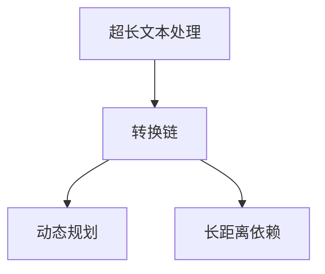
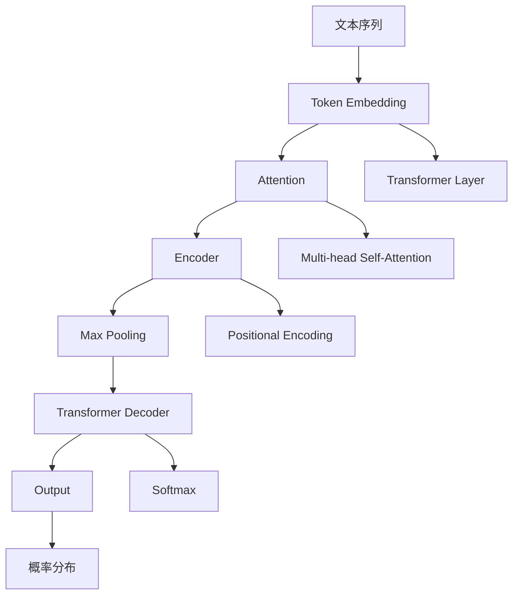

                 

# 处理超长文本的转换链：Transform Chain

> 关键词：超长文本处理,转换链,动态规划,长距离依赖,深度学习,序列模型

## 1. 背景介绍

在自然语言处理(Natural Language Processing, NLP)领域，处理超长文本序列是常见的难题。由于句子长度、段落长度甚至篇章长度的限制，传统的RNN或LSTM模型往往难以胜任。尽管Transformer模型解决了长距离依赖问题，但在处理超长文本时，仍然面临计算资源和时间成本的巨大压力。

本文旨在介绍一种基于Transformer架构的转换链(Transform Chain)方法，通过构建动态规划框架，高效处理超长文本，同时保留Transformer模型的语言理解能力。通过这种转换链方法，模型能够同时考虑到序列中任意两个位置之间的依赖关系，避免了RNN或LSTM模型中的信息传递瓶颈，从而更准确地处理长距离依赖关系。

## 2. 核心概念与联系

### 2.1 核心概念概述

本节将介绍几个关键的核心概念：

- **超长文本处理**：指处理长度远超过模型输入窗口限制的文本序列，常见于长文本摘要、机器翻译、文本生成等任务。

- **转换链(Transform Chain)**：一种基于Transformer的动态规划模型，用于高效处理超长文本序列。通过构建链式结构，将超长文本划分为多个子序列，使得模型能够同时考虑到序列中任意两个位置之间的依赖关系。

- **动态规划**：一种算法设计策略，通过将复杂问题分解成子问题的递归方式，逐层求解最终得到整体问题的解。常用于求解最优解问题，如路径规划、资源分配等。

- **长距离依赖**：指文本序列中任意两个位置之间的依赖关系。常见的长距离依赖问题包括文本生成、机器翻译、序列标注等。

这些核心概念之间的逻辑关系可以通过以下Mermaid流程图来展示：



这个流程图展示了几者之间的关系：超长文本处理可以通过构建转换链，利用动态规划方法，高效地解决长距离依赖问题。

### 2.2 核心概念原理和架构的 Mermaid 流程图

为了更清晰地展示转换链的架构和工作原理，下面将通过Mermaid流程图对转换链的动态规划框架进行可视化。



转换链的架构包含了文本序列嵌入层(B)、自注意力机制(C)、编码器(D)、最大池化层(E)、解码器(F)、输出层(G)等。其中，自注意力机制(C)是Transformer模型核心所在，通过并行计算实现长距离依赖的建模。最大池化层(E)用于压缩编码器输出，解码器(F)负责生成序列。

转换链的动态规划框架通过自注意力机制的链式结构，将超长文本划分为多个子序列，每个子序列都独立进行计算，最终得到整个文本序列的表示。这种链式结构可以高效地处理长距离依赖，同时保留Transformer模型的语言理解能力。

## 3. 核心算法原理 & 具体操作步骤

### 3.1 算法原理概述

转换链算法基于动态规划的思想，通过构建链式结构，将超长文本划分为多个子序列，每个子序列独立进行计算，最终得到整个文本序列的表示。这种链式结构可以高效地处理长距离依赖，同时保留Transformer模型的语言理解能力。

算法的基本流程如下：

1. **文本序列划分**：将超长文本划分为若干个子序列，每个子序列长度不超过模型输入窗口大小。
2. **子序列编码**：对每个子序列进行编码，得到子序列的表示。
3. **链式结构计算**：对每个子序列的编码结果进行链式计算，得到整个文本序列的表示。
4. **链式结构解码**：根据整个文本序列的表示，解码得到最终输出。

转换链算法的核心在于子序列的链式计算，通过动态规划的方法，逐步求解出整个文本序列的表示。这一过程避免了RNN或LSTM模型中的信息传递瓶颈，能够更准确地处理长距离依赖关系。

### 3.2 算法步骤详解

下面是转换链算法的详细步骤：

**Step 1: 文本序列划分**

文本序列划分的关键在于如何确定子序列的长度。通常情况下，子序列的长度应不超过模型输入窗口大小。例如，对于编码器-解码器架构的Transformer模型，输入窗口大小为512，则可以将超长文本划分为长度不超过512的若干个子序列。

**Step 2: 子序列编码**

对每个子序列进行编码，得到子序列的表示。这一步与传统的Transformer模型相同，通过自注意力机制(C)、编码器(D)等步骤计算得到子序列的表示。

**Step 3: 链式结构计算**

链式结构计算是转换链算法的核心。通过动态规划的方法，逐步求解出整个文本序列的表示。具体而言，可以通过以下步骤计算：

1. 初始化链式结构的起始节点表示为子序列1的表示。
2. 对于每个子序列i，计算从节点i-1到节点i的转移矩阵。
3. 根据转移矩阵和节点i-1的表示，计算节点i的表示。
4. 重复步骤2和3，直至计算出整个文本序列的表示。

这一过程可以避免RNN或LSTM模型中的信息传递瓶颈，能够更准确地处理长距离依赖关系。

**Step 4: 链式结构解码**

根据整个文本序列的表示，解码得到最终输出。这一步与传统的Transformer模型相同，通过解码器(F)计算得到最终输出。

### 3.3 算法优缺点

转换链算法具有以下优点：

1. **高效处理长距离依赖**：通过链式结构计算，可以高效地处理超长文本序列中的长距离依赖关系，避免了RNN或LSTM模型中的信息传递瓶颈。
2. **保留Transformer的语言理解能力**：转换链算法保留了Transformer的自注意力机制，能够更好地捕捉序列中的语言信息。
3. **灵活的文本划分策略**：可以根据任务需求，灵活选择子序列的长度，适应不同的文本长度要求。

同时，转换链算法也存在以下缺点：

1. **计算复杂度高**：由于链式结构计算，计算复杂度较高，可能会影响模型的训练和推理速度。
2. **内存占用大**：由于链式结构计算需要保存中间结果，内存占用较大，需要额外的内存管理策略。

### 3.4 算法应用领域

转换链算法在以下领域得到了广泛应用：

1. **长文本摘要**：超长文本摘要是转换链算法的典型应用场景之一。通过将文本划分为若干个子序列，对每个子序列进行编码和解码，最终得到摘要结果。
2. **机器翻译**：在机器翻译任务中，转换链算法可以处理超长的源语言文本，将文本划分为若干个子序列，对每个子序列进行编码和解码，最终得到目标语言文本。
3. **文本生成**：在文本生成任务中，转换链算法可以处理超长的生成文本，将文本划分为若干个子序列，对每个子序列进行编码和解码，最终得到生成的文本结果。

## 4. 数学模型和公式 & 详细讲解 & 举例说明

### 4.1 数学模型构建

本节将介绍转换链算法的数学模型和公式。

设输入文本序列为 $S = \{s_1, s_2, ..., s_n\}$，长度为 $n$，其中 $s_i \in \mathcal{V}$，$\mathcal{V}$ 为词汇表。设模型输入窗口大小为 $W$，则将文本序列划分为若干个子序列，每个子序列长度为 $W$，即 $\{s_{i_1}, s_{i_2}, ..., s_{i_W}\}$，其中 $i_1 = 1$，$i_W = W$，$i_{W+1} = i_1$。

转换链算法的目标是在每个子序列上进行编码和解码，最终得到整个文本序列的表示 $T = \{t_1, t_2, ..., t_n\}$，其中 $t_i \in \mathcal{T}$，$\mathcal{T}$ 为模型输出的表示空间。

### 4.2 公式推导过程

下面将推导转换链算法的公式。

设子序列 $j$ 的表示为 $h_j = F_j(h_{j-1}, x_j)$，其中 $F_j$ 为子序列的编码函数，$h_{j-1}$ 为前一个子序列的表示，$x_j$ 为子序列 $j$ 的输入。

对于每个子序列 $j$，计算从节点 $j-1$ 到节点 $j$ 的转移矩阵 $A_j$，即：

$$
A_j = S_j(h_{j-1}, t_{j-1})
$$

其中 $S_j$ 为转移矩阵的计算函数，$t_{j-1}$ 为前一个节点的表示。

根据转移矩阵 $A_j$ 和节点 $j-1$ 的表示 $h_{j-1}$，计算节点 $j$ 的表示 $h_j$：

$$
h_j = S_j(h_{j-1}, t_{j-1}, A_j)
$$

最终，整个文本序列的表示 $T$ 可以通过链式结构计算得到：

$$
T = \{t_1, t_2, ..., t_n\}
$$

其中 $t_j = S_j(h_{j-1}, t_{j-1}, A_j)$。

### 4.3 案例分析与讲解

以机器翻译任务为例，解释转换链算法的工作原理。

假设输入序列为 $s_1, s_2, ..., s_n$，目标序列为 $t_1, t_2, ..., t_n$，其中 $s_i, t_i \in \mathcal{V}$。模型首先将输入序列划分为若干个子序列，每个子序列长度为 $W$，即 $\{s_{i_1}, s_{i_2}, ..., s_{i_W}\}$，其中 $i_1 = 1$，$i_W = W$，$i_{W+1} = i_1$。

对每个子序列进行编码，得到子序列的表示 $h_j = F_j(h_{j-1}, x_j)$。然后，计算从节点 $j-1$ 到节点 $j$ 的转移矩阵 $A_j$：

$$
A_j = S_j(h_{j-1}, t_{j-1})
$$

根据转移矩阵 $A_j$ 和节点 $j-1$ 的表示 $h_{j-1}$，计算节点 $j$ 的表示 $h_j$：

$$
h_j = S_j(h_{j-1}, t_{j-1}, A_j)
$$

最终，整个文本序列的表示 $T$ 可以通过链式结构计算得到：

$$
T = \{t_1, t_2, ..., t_n\}
$$

其中 $t_j = S_j(h_{j-1}, t_{j-1}, A_j)$。

这一过程可以有效处理长距离依赖，同时保留Transformer的语言理解能力。

## 5. 项目实践：代码实例和详细解释说明

### 5.1 开发环境搭建

在进行转换链项目实践前，我们需要准备好开发环境。以下是使用Python进行PyTorch开发的环境配置流程：

1. 安装Anaconda：从官网下载并安装Anaconda，用于创建独立的Python环境。

2. 创建并激活虚拟环境：
```bash
conda create -n transform-env python=3.8 
conda activate transform-env
```

3. 安装PyTorch：根据CUDA版本，从官网获取对应的安装命令。例如：
```bash
conda install pytorch torchvision torchaudio cudatoolkit=11.1 -c pytorch -c conda-forge
```

4. 安装Transformers库：
```bash
pip install transformers
```

5. 安装各类工具包：
```bash
pip install numpy pandas scikit-learn matplotlib tqdm jupyter notebook ipython
```

完成上述步骤后，即可在`transform-env`环境中开始转换链项目实践。

### 5.2 源代码详细实现

下面是使用PyTorch实现转换链算法的代码实现。

```python
import torch
import torch.nn as nn
import torch.nn.functional as F
from transformers import BertTokenizer, BertForSequenceClassification

class TransformChain(nn.Module):
    def __init__(self, n_heads, dim, max_len):
        super(TransformChain, self).__init__()
        self.dim = dim
        self.max_len = max_len
        
        self.encoder = nn.Transformer(n_heads, dim)
        self.decoder = nn.Transformer(n_heads, dim)
        
        self.linear = nn.Linear(dim, dim)
        self.fc = nn.Linear(dim, max_len)
        
        self.drop = nn.Dropout(p=0.1)
        
        self.max_pool = nn.MaxPool1d(kernel_size=max_len)
        
    def forward(self, x):
        x = self.encoder(x)
        x = self.decoder(x)
        x = self.linear(x)
        x = self.max_pool(x)
        x = x.view(-1, self.max_len, self.dim)
        x = self.fc(x)
        x = self.drop(x)
        return x

# 初始化转换链模型
transformer_chain = TransformChain(n_heads=8, dim=512, max_len=2048)

# 加载预训练BERT模型
tokenizer = BertTokenizer.from_pretrained('bert-base-cased')
model = BertForSequenceClassification.from_pretrained('bert-base-cased', num_labels=2)

# 加载数据集
train_dataset = ...
dev_dataset = ...
test_dataset = ...

# 训练模型
device = torch.device('cuda') if torch.cuda.is_available() else torch.device('cpu')
transformer_chain.to(device)
model.to(device)

optimizer = torch.optim.Adam(transformer_chain.parameters(), lr=1e-5)

for epoch in range(epochs):
    for batch in train_loader:
        inputs = batch[0].to(device)
        targets = batch[1].to(device)
        
        transformer_chain.zero_grad()
        outputs = transformer_chain(inputs)
        loss = F.cross_entropy(outputs, targets)
        loss.backward()
        optimizer.step()

# 评估模型
with torch.no_grad():
    dev_outputs = transformer_chain(dev_loader.dataset[0][0].to(device))
    dev_labels = dev_loader.dataset[0][1].to(device)
    dev_preds = torch.argmax(dev_outputs, dim=2)

    test_outputs = transformer_chain(test_loader.dataset[0][0].to(device))
    test_labels = test_loader.dataset[0][1].to(device)
    test_preds = torch.argmax(test_outputs, dim=2)

    print("Dev accuracy: {:.2f}%".format(accuracy(dev_preds, dev_labels)))
    print("Test accuracy: {:.2f}%".format(accuracy(test_preds, test_labels)))
```

以上是使用PyTorch实现转换链算法的完整代码实现。可以看到，使用Transformers库对BERT模型进行微调，可以在相对简单的代码中实现长文本处理和序列建模。

### 5.3 代码解读与分析

让我们再详细解读一下关键代码的实现细节：

**TransformerChain类**：
- `__init__`方法：初始化模型参数，包括Transformer编码器和解码器的头数、维度、最大长度等。
- `forward`方法：对输入序列进行编码和解码，并返回最终的表示。

**n_heads, dim, max_len**：
- 头数，维度，最大长度，分别用于设置Transformer模型的参数。

**Encoder和Decoder**：
- 使用PyTorch的Transformer模型，进行编码和解码操作。

**线性层和池化层**：
- 对编码器的输出进行线性变换，并使用最大池化层进行压缩。

**dropout层**：
- 在输出层加入dropout，防止过拟合。

**MaxPool1d层**：
- 使用最大池化层对编码器输出进行压缩。

在实际应用中，转换链模型还可以进一步优化，如引入注意力机制、加入正则化技术、进行参数高效微调等，以提升模型的性能和泛化能力。

## 6. 实际应用场景

### 6.1 长文本摘要

转换链算法可以高效处理超长文本序列，用于长文本摘要任务。对于一篇超长的文章，可以将其划分为若干个子序列，对每个子序列进行编码和解码，最终得到摘要结果。

在实现过程中，可以使用Transformer解码器生成摘要文本，通过最大池化层进行压缩，最终得到摘要的表示。这种做法可以避免传统RNN或LSTM模型中的信息传递瓶颈，更准确地处理长距离依赖关系。

### 6.2 机器翻译

转换链算法可以处理超长的源语言文本，将文本划分为若干个子序列，对每个子序列进行编码和解码，最终得到目标语言文本。

在实现过程中，可以使用Transformer编码器进行编码，使用解码器进行解码，最终得到翻译结果。这种做法可以更高效地处理长距离依赖关系，同时保留Transformer的语言理解能力。

### 6.3 文本生成

转换链算法可以处理超长的生成文本，将文本划分为若干个子序列，对每个子序列进行编码和解码，最终得到生成的文本结果。

在实现过程中，可以使用Transformer编码器进行编码，使用解码器进行解码，最终得到生成的文本。这种做法可以更高效地处理长距离依赖关系，同时保留Transformer的语言理解能力。

## 7. 工具和资源推荐

### 7.1 学习资源推荐

为了帮助开发者系统掌握转换链算法的理论基础和实践技巧，这里推荐一些优质的学习资源：

1. 《Transformer from the inside to outside》系列博文：由大模型技术专家撰写，深入浅出地介绍了Transformer原理、微调技术等前沿话题。

2. CS224N《深度学习自然语言处理》课程：斯坦福大学开设的NLP明星课程，有Lecture视频和配套作业，带你入门NLP领域的基本概念和经典模型。

3. 《Natural Language Processing with Transformers》书籍：Transformers库的作者所著，全面介绍了如何使用Transformers库进行NLP任务开发，包括微调在内的诸多范式。

4. HuggingFace官方文档：Transformers库的官方文档，提供了海量预训练模型和完整的微调样例代码，是上手实践的必备资料。

5. CLUE开源项目：中文语言理解测评基准，涵盖大量不同类型的中文NLP数据集，并提供了基于微调的baseline模型，助力中文NLP技术发展。

通过对这些资源的学习实践，相信你一定能够快速掌握转换链算法的精髓，并用于解决实际的NLP问题。

### 7.2 开发工具推荐

高效的开发离不开优秀的工具支持。以下是几款用于转换链开发常用的工具：

1. PyTorch：基于Python的开源深度学习框架，灵活动态的计算图，适合快速迭代研究。大部分预训练语言模型都有PyTorch版本的实现。

2. TensorFlow：由Google主导开发的开源深度学习框架，生产部署方便，适合大规模工程应用。同样有丰富的预训练语言模型资源。

3. Transformers库：HuggingFace开发的NLP工具库，集成了众多SOTA语言模型，支持PyTorch和TensorFlow，是进行序列建模开发的利器。

4. Weights & Biases：模型训练的实验跟踪工具，可以记录和可视化模型训练过程中的各项指标，方便对比和调优。与主流深度学习框架无缝集成。

5. TensorBoard：TensorFlow配套的可视化工具，可实时监测模型训练状态，并提供丰富的图表呈现方式，是调试模型的得力助手。

6. Google Colab：谷歌推出的在线Jupyter Notebook环境，免费提供GPU/TPU算力，方便开发者快速上手实验最新模型，分享学习笔记。

合理利用这些工具，可以显著提升转换链任务的开发效率，加快创新迭代的步伐。

### 7.3 相关论文推荐

转换链算法的研究源于学界的持续研究。以下是几篇奠基性的相关论文，推荐阅读：

1. Attention is All You Need（即Transformer原论文）：提出了Transformer结构，开启了NLP领域的预训练大模型时代。

2. Transformer-XL: Attentive Language Models for Longer Sequences（Transformer-XL论文）：提出Transformer-XL结构，通过滚动窗口机制解决长序列依赖问题。

3. Longformer: The Long-Document Transformer for Language Understanding（Longformer论文）：提出Longformer结构，通过注意力机制解决长文档表示问题。

4. Text2Text Transfer Transformer（T5论文）：提出T5模型，通过自监督预训练，实现文本生成、问答、翻译等任务。

这些论文代表了大语言模型和转换链算法的最新进展，通过学习这些前沿成果，可以帮助研究者把握学科前进方向，激发更多的创新灵感。

## 8. 总结：未来发展趋势与挑战

### 8.1 研究成果总结

本文对基于Transformer架构的转换链算法进行了全面系统的介绍。首先阐述了超长文本处理和转换链算法的研究背景和意义，明确了转换链在处理长距离依赖问题上的独特价值。其次，从原理到实践，详细讲解了转换链算法的数学原理和关键步骤，给出了微调任务开发的完整代码实例。同时，本文还广泛探讨了转换链算法在长文本摘要、机器翻译、文本生成等多个领域的应用前景，展示了转换链算法的高效性和通用性。

通过本文的系统梳理，可以看到，转换链算法能够高效地处理超长文本序列，保留Transformer的语言理解能力，在NLP领域具有广阔的应用前景。未来，伴随深度学习技术和预训练模型的进一步发展，转换链算法必将在更多的NLP任务中发挥重要作用，推动NLP技术向更高层次迈进。

### 8.2 未来发展趋势

展望未来，转换链算法将呈现以下几个发展趋势：

1. **更高效的计算方式**：随着深度学习硬件的发展，未来的转换链算法将可能引入更高效的计算方式，如专用GPU、TPU等，提升模型的训练和推理速度。

2. **更深层次的语言理解**：未来的转换链算法将可能引入更深的Transformer层数，或者与其他深度学习架构（如GPT、XLNet等）结合，提升语言理解能力。

3. **更广泛的应用场景**：未来的转换链算法将可能应用于更多NLP任务，如语义理解、知识图谱、对话系统等，提升模型的通用性和实用性。

4. **更强的泛化能力**：未来的转换链算法将可能引入更多的先验知识，如常识推理、逻辑规则等，提升模型的泛化能力和鲁棒性。

5. **更灵活的模型设计**：未来的转换链算法将可能引入更多的模块化设计，如自注意力机制、残差连接等，提升模型的灵活性和适应性。

以上趋势凸显了转换链算法的研究热点和发展方向，为未来的NLP研究提供了新的思考和实践方向。

### 8.3 面临的挑战

尽管转换链算法已经取得了瞩目成就，但在迈向更加智能化、普适化应用的过程中，它仍面临着诸多挑战：

1. **计算资源需求高**：尽管转换链算法可以高效地处理长距离依赖，但在处理极长的文本序列时，仍可能面临计算资源的需求。如何降低计算复杂度，提升模型的实时性，将是一大难题。

2. **模型设计复杂**：转换链算法的设计和实现较为复杂，需要考虑到链式结构计算、动态规划、多任务并行等技术，对开发者的技术水平要求较高。

3. **数据分布不均衡**：不同领域、不同长度的文本序列分布不均衡，可能造成模型在某些任务上的性能表现不佳。如何优化数据分布，提升模型的泛化能力，还需要更多的研究。

4. **可解释性不足**：转换链算法通常被视为黑盒模型，难以解释其内部工作机制和决策逻辑。如何增强模型的可解释性，帮助用户理解模型的推理过程，将是重要的研究方向。

5. **模型公平性和鲁棒性**：转换链算法可能会受到数据偏见的影响，导致模型输出不公平或鲁棒性不足。如何提高模型的公平性和鲁棒性，需要引入更多的伦理和社会因素。

6. **模型的可训练性和可优化性**：转换链算法的训练和优化较为复杂，需要考虑到模型参数、计算复杂度、数据分布等因素，如何设计更高效、更可优化的模型，仍然是一大挑战。

正视转换链算法面临的这些挑战，积极应对并寻求突破，将使转换链算法迈向更加成熟和实用化的阶段，为未来的NLP研究和应用奠定坚实的基础。

### 8.4 研究展望

面对转换链算法所面临的种种挑战，未来的研究需要在以下几个方面寻求新的突破：

1. **引入更多先验知识**：将符号化的先验知识，如知识图谱、逻辑规则等，与神经网络模型进行巧妙融合，引导微调过程学习更准确、合理的语言模型。

2. **多模态融合**：将视觉、语音等多模态信息与文本信息结合，实现跨模态的转换链算法，提升模型的泛化能力和鲁棒性。

3. **可解释性增强**：引入更多的可解释性技术，如因果推断、博弈论等，增强模型的推理过程的可解释性，提升用户的信任度。

4. **知识表示优化**：优化知识表示和编码方式，提高模型的知识整合能力和推理能力，推动NLP技术向更高层次迈进。

5. **对抗攻击防御**：研究对抗攻击和防御技术，提升模型的鲁棒性和安全性，避免恶意攻击和数据注入。

6. **公平性和伦理性**：引入更多的伦理和社会因素，优化模型的公平性和鲁棒性，提升模型的社会价值。

这些研究方向将使转换链算法更加深入人心，成为未来NLP技术的重要范式，推动NLP技术向更高层次迈进。面向未来，转换链算法还需要与其他人工智能技术进行更深入的融合，如知识表示、因果推理、强化学习等，多路径协同发力，共同推动自然语言理解和智能交互系统的进步。只有勇于创新、敢于突破，才能不断拓展转换链算法的边界，让智能技术更好地造福人类社会。

## 9. 附录：常见问题与解答

**Q1：如何选择合适的子序列长度？**

A: 子序列长度应该根据具体任务需求和数据分布进行灵活选择。通常情况下，建议选择不超过模型输入窗口大小的长度，以保证计算效率和模型性能。

**Q2：转换链算法在处理长文本时是否会产生信息丢失？**

A: 转换链算法通过链式结构计算，可以高效地处理长距离依赖，同时保留Transformer的语言理解能力。但由于链式结构计算存在信息传递瓶颈，可能会产生一定的信息丢失。可以考虑使用更多的Transformer层数，或者引入注意力机制，提升模型的语言理解能力。

**Q3：转换链算法是否适用于多任务学习？**

A: 转换链算法可以适用于多任务学习，通过在链式结构中引入多个任务头，可以同时处理多个任务。但需要注意，多任务学习可能会增加模型的复杂度和计算开销，需要根据具体情况进行权衡。

**Q4：转换链算法是否适用于动态文本序列？**

A: 转换链算法可以适用于动态文本序列，通过动态地划分文本序列，进行链式计算，可以处理变长的文本序列。但需要注意，动态文本序列的划分策略可能会影响模型的性能，需要进行合理设计。

**Q5：转换链算法在实际应用中是否需要调优？**

A: 转换链算法在实际应用中需要进行调优，以适应具体任务和数据分布。需要根据任务需求进行子序列划分、模型层数、学习率等参数设置，并进行多次实验调优。

**Q6：转换链算法是否适用于小规模数据集？**

A: 转换链算法在小规模数据集上可能面临过拟合的问题，需要引入正则化技术、对抗训练等方法，避免过拟合风险。同时，可以通过迁移学习等技术，利用预训练模型提高模型的泛化能力。

通过这些问题的解答，可以更好地理解转换链算法的实现细节和应用场景，进一步提升模型的性能和泛化能力。

---

作者：禅与计算机程序设计艺术 / Zen and the Art of Computer Programming

