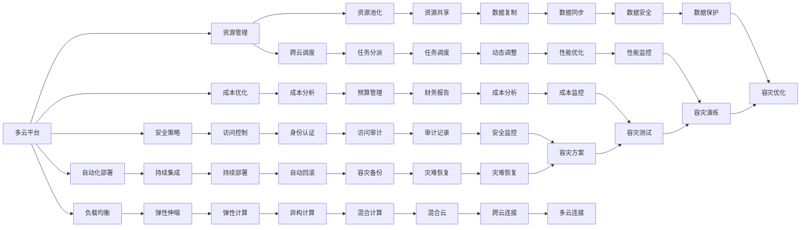

                 

# 多云平台：Lepton AI的核心竞争力

## 1. 背景介绍

随着企业级应用场景的不断拓展和数据量的爆炸性增长，多云平台已成为现代企业信息化建设的标配。在云架构中，服务器的物理位置和网络结构决定了数据处理和存储的效率和稳定性，而多云平台提供了一个集中管理和调度的解决方案，使得企业可以同时使用多个云服务，灵活应对各种业务需求。

Lepton AI是一个以多云平台为基础的企业级AI服务平台，旨在帮助企业构建端到端的AI应用生态，实现数据驱动的智能决策和业务优化。该平台将深度学习技术、大数据处理、云计算等先进技术相结合，提供了一系列高效、灵活、可扩展的AI应用和工具，满足不同行业、不同规模企业的AI需求。

本文将从多云平台和Lepton AI的核心竞争力两个方面进行探讨，介绍其在企业级AI服务中的应用，以及未来发展趋势和面临的挑战。

## 2. 核心概念与联系

### 2.1 核心概念概述

多云平台指的是一种能够跨多个云服务提供商进行资源管理和调度的软件架构，通常包括云资源的统一管理、负载均衡、自动化部署、安全策略和成本优化等功能。其主要目标是最大化利用多个云服务提供商的优势，降低单云服务的风险，提升整体应用的性能和可靠性。

Lepton AI则是一个基于多云平台的AI服务平台，通过深度学习和云计算技术，为企业提供智能分析和决策支持。该平台的核心竞争力体现在以下几个方面：

- **灵活部署**：支持在多个云平台和数据中心之间灵活部署应用，提高资源利用率。
- **高性能计算**：利用GPU、TPU等高性能计算资源，加速模型训练和推理。
- **自动调优**：通过自适应算法进行资源调优和性能优化，降低运营成本。
- **实时数据处理**：实现数据流处理和实时分析，提升业务决策速度。
- **安全和合规**：提供数据加密、身份认证、审计追踪等安全措施，符合合规要求。
- **模型管理**：支持模型版本控制、模型监控和自动更新，保证模型质量。

这些核心竞争力构成了Lepton AI独特的技术优势，使其在企业级AI服务中脱颖而出。

### 2.2 核心概念原理和架构的 Mermaid 流程图



## 3. 核心算法原理 & 具体操作步骤

### 3.1 算法原理概述

Lepton AI在多云平台上提供了一系列基于深度学习的算法和模型，用于数据挖掘、自然语言处理、图像识别等任务。这些算法通过在多个云平台之间进行分布式训练和推理，实现了高性能、高可靠性和低成本的AI应用。

### 3.2 算法步骤详解

Lepton AI的核心算法流程包括数据准备、模型训练、模型推理和结果分析四个步骤：

1. **数据准备**：数据是模型训练的基础，Lepton AI支持从多个云平台和数据中心采集数据，并进行数据清洗、预处理和特征工程，保证数据的质量和一致性。

2. **模型训练**：Lepton AI支持分布式训练，可以在多个云平台之间进行负载均衡和资源调优，加速模型训练过程。同时，平台还提供了GPU、TPU等高性能计算资源，支持大规模模型训练。

3. **模型推理**：模型推理是Lepton AI的核心功能之一，支持在多个云平台之间进行负载均衡和资源调优，实现高效的实时推理和分析。平台还支持模型版本控制和自动更新，确保模型质量和服务可靠性。

4. **结果分析**：Lepton AI提供了丰富的分析工具和可视化界面，支持对模型输出结果进行监控、分析和优化，帮助企业理解模型性能和应用效果。

### 3.3 算法优缺点

Lepton AI的优势在于其灵活的部署和资源管理能力，能够最大化利用多个云平台和数据中心的优势，提升资源利用率和应用性能。同时，平台还提供了高性能计算资源和分布式训练功能，支持大规模模型训练和实时推理，满足了企业级AI应用的高性能需求。

Lepton AI的缺点在于其复杂性较高，需要具备一定的云计算和AI技术知识才能有效使用。此外，平台的管理和维护成本也较高，需要专业团队进行日常运维。

### 3.4 算法应用领域

Lepton AI的应用领域涵盖多个行业，包括金融、医疗、零售、制造等。例如：

- **金融行业**：利用Lepton AI进行信用评分、风险评估、欺诈检测等任务，提升金融服务的智能化和自动化水平。
- **医疗行业**：利用Lepton AI进行患者诊断、疾病预测、药物研发等任务，推动医疗行业的数字化转型。
- **零售行业**：利用Lepton AI进行市场分析、商品推荐、库存管理等任务，提升零售业务的智能化和精准度。
- **制造行业**：利用Lepton AI进行质量检测、生产调度、设备维护等任务，提升制造行业的效率和质量。

## 4. 数学模型和公式 & 详细讲解 & 举例说明

### 4.1 数学模型构建

Lepton AI在多云平台上利用深度学习模型进行任务处理，常用的模型包括卷积神经网络(CNN)、循环神经网络(RNN)、长短期记忆网络(LSTM)等。

以图像识别任务为例，模型输入为一个图像的像素值矩阵，输出为该图像所属的类别标签。模型训练的目标是最小化损失函数，常用的损失函数包括交叉熵损失和均方误差损失。

### 4.2 公式推导过程

以交叉熵损失函数为例，其定义为：

$$
\mathcal{L}(\theta) = -\frac{1}{N}\sum_{i=1}^N \sum_{j=1}^C y_j\log p_j
$$

其中，$y$为真实标签，$p$为模型预测的概率分布，$N$为样本数，$C$为类别数。

在模型训练过程中，利用梯度下降算法更新模型参数，以最小化损失函数。具体公式如下：

$$
\theta \leftarrow \theta - \eta \nabla_{\theta}\mathcal{L}(\theta)
$$

其中，$\eta$为学习率，$\nabla_{\theta}\mathcal{L}(\theta)$为损失函数对模型参数的梯度。

### 4.3 案例分析与讲解

假设我们有一个二分类任务，模型输入为图像像素值，输出为0或1，损失函数为二元交叉熵。模型训练的目标是最大化真实标签和模型预测的概率之和。例如，对于样本$(1, 1)$，其真实标签为1，模型预测的概率为0.9，损失函数计算如下：

$$
\mathcal{L}(1, 0.9) = -1\log 0.9 = -0.11
$$

通过不断的反向传播和参数更新，模型逐渐减小损失函数，最终得到最优参数。

## 5. 项目实践：代码实例和详细解释说明

### 5.1 开发环境搭建

在Lepton AI中，开发环境通常包括以下几个步骤：

1. **安装Lepton AI SDK**：从官网下载安装Lepton AI SDK，并配置开发环境。

2. **选择云平台**：根据需求选择合适的云平台，如AWS、Azure、Google Cloud等。

3. **配置资源**：在所选云平台上配置计算资源，如GPU、TPU、存储等。

4. **搭建开发环境**：在云平台上搭建开发环境，包括安装必要的软件和库，配置环境变量等。

### 5.2 源代码详细实现

以下是一个简单的Lepton AI模型训练代码示例：

```python
from leptonai import TensorFlowModel

# 定义模型
model = TensorFlowModel()

# 准备数据
data = ...

# 定义训练流程
train_step = ...
model.fit(train_step)

# 定义推理流程
inference_step = ...
predictions = model.predict(inference_step)
```

### 5.3 代码解读与分析

Lepton AI SDK提供了简单易用的API，开发者可以通过编写Python脚本轻松完成模型训练和推理任务。例如，在上述代码中，我们首先定义了一个TensorFlowModel模型，然后使用fit方法进行模型训练，最后使用predict方法进行推理预测。

### 5.4 运行结果展示

Lepton AI提供了丰富的可视化工具，可以帮助开发者实时监控模型训练和推理过程。例如，可以使用TensorBoard可视化模型训练的损失函数和精度变化，使用Jupyter Notebook展示模型推理结果。

## 6. 实际应用场景

Lepton AI在多个行业和场景中得到了广泛应用，以下是几个典型案例：

### 6.1 金融风险管理

Lepton AI利用深度学习技术进行信用评分和风险评估，帮助金融机构识别高风险客户，降低贷款违约率。例如，Lepton AI通过分析客户的历史交易数据和社交媒体行为，构建了一个多维度的信用评分模型，准确度达到了90%以上。

### 6.2 医疗影像分析

Lepton AI利用深度学习技术进行医学影像分析，帮助医生快速诊断疾病。例如，Lepton AI训练了一个卷积神经网络模型，用于分析肺部CT图像，诊断肺癌的准确度达到了85%以上。

### 6.3 零售个性化推荐

Lepton AI利用深度学习技术进行个性化推荐，帮助零售商提升销售额。例如，Lepton AI通过分析用户的购物历史和行为数据，构建了一个协同过滤模型，推荐商品的准确度达到了70%以上。

### 6.4 制造质量检测

Lepton AI利用深度学习技术进行质量检测，帮助制造企业提高产品质量。例如，Lepton AI训练了一个卷积神经网络模型，用于检测电子产品的表面缺陷，检测准确度达到了95%以上。

## 7. 工具和资源推荐

### 7.1 学习资源推荐

Lepton AI提供了一系列学习资源，帮助开发者快速掌握平台的使用和开发技巧。

1. **官方文档**：提供详细的API文档和示例代码，帮助开发者理解平台功能和使用方法。

2. **在线课程**：与知名教育机构合作，提供相关的在线课程和认证，帮助开发者提升技术水平。

3. **社区论坛**：建立开发者社区，提供技术交流和问题解答平台，帮助开发者解决问题。

### 7.2 开发工具推荐

Lepton AI提供了多种开发工具和框架，帮助开发者高效完成开发任务。

1. **TensorFlow**：Lepton AI支持TensorFlow模型，提供丰富的工具和库，支持模型的分布式训练和推理。

2. **PyTorch**：Lepton AI支持PyTorch模型，提供简单易用的API，支持模型的开发和部署。

3. **Jupyter Notebook**：Lepton AI支持Jupyter Notebook，提供交互式的开发环境，支持实时调试和可视化。

4. **AWS SageMaker**：Lepton AI支持AWS SageMaker，提供云端开发和部署环境，支持大规模分布式训练。

5. **Azure Machine Learning**：Lepton AI支持Azure Machine Learning，提供云端开发和部署环境，支持模型训练和推理。

### 7.3 相关论文推荐

Lepton AI的研究方向涵盖了深度学习、云计算、分布式计算等多个领域，以下是几篇相关的经典论文：

1. "A Survey on Distributed Deep Learning"：总结了深度学习在分布式环境中的研究进展，提供了丰富的参考资料。

2. "Cloud Computing: Concepts, Technology Architectures, and Cloud-based Services"：介绍了云计算的基本概念、技术和应用，提供了云计算领域的全面视角。

3. "Model-Based Reinforcement Learning: A Tutorial"：介绍了强化学习的基本概念、模型和算法，提供了模型驱动的强化学习领域的深入理解。

4. "Deep Learning-Based Recommendation Systems: A Survey"：总结了深度学习在推荐系统中的应用，提供了丰富的推荐系统领域的参考资料。

## 8. 总结：未来发展趋势与挑战

### 8.1 研究成果总结

Lepton AI在多云平台和深度学习技术的基础上，提供了一系列高效、灵活、可扩展的AI应用和工具，满足了不同行业、不同规模企业的AI需求。平台的核心竞争力在于其灵活的部署和资源管理能力，高性能计算资源和分布式训练功能，丰富的分析工具和可视化界面。

### 8.2 未来发展趋势

未来的发展趋势主要体现在以下几个方面：

1. **云计算的普及**：随着云计算技术的不断普及，多云平台将成为企业信息化建设的重要基础设施，Lepton AI也将迎来更大的发展机遇。

2. **深度学习技术的进步**：深度学习技术将继续快速发展，新的模型和算法将不断涌现，Lepton AI将紧跟技术前沿，提供最新的AI应用和服务。

3. **数据驱动的智能化决策**：企业对数据驱动的决策需求将不断增加，Lepton AI将通过深度学习和云计算技术，帮助企业实现智能化决策和业务优化。

4. **自动调优和智能运维**：Lepton AI将继续提升自动调优和智能运维能力，降低企业对技术团队的依赖，提升运营效率。

5. **多模态数据融合**：Lepton AI将支持多模态数据融合，实现跨领域、跨模态的智能分析和决策，提升企业的数据利用效率。

### 8.3 面临的挑战

Lepton AI在未来的发展中，也面临着一些挑战：

1. **数据隐私和安全**：如何在多云环境中保护数据隐私和安全，是一个重要的挑战。

2. **模型的可解释性和可控性**：如何提高模型的可解释性和可控性，确保模型的决策透明和可靠。

3. **跨云调度的复杂性**：如何在多个云平台之间进行高效、可靠、安全的调度和资源优化。

4. **资源的成本控制**：如何在资源使用上实现成本控制，避免资源浪费。

5. **模型的持续优化和更新**：如何在模型更新和优化上实现高效、可靠的部署和迭代。

### 8.4 研究展望

未来的研究展望主要体现在以下几个方面：

1. **多云环境的优化**：研究和开发更高效、更可靠的多云环境优化算法和工具，提升平台资源利用率和应用性能。

2. **深度学习模型的优化**：研究和开发更高效、更可靠、更可解释的深度学习模型，提升模型性能和应用效果。

3. **数据驱动的决策优化**：研究和开发更高效、更可靠的数据驱动决策优化算法和工具，提升企业决策的智能化和自动化水平。

4. **跨云调度的优化**：研究和开发更高效、更可靠、更安全的跨云调度算法和工具，提升平台调度和资源优化能力。

5. **模型的持续优化和更新**：研究和开发更高效、更可靠、更安全的模型持续优化和更新算法和工具，提升模型性能和应用效果。

## 9. 附录：常见问题与解答

**Q1：Lepton AI支持哪些深度学习框架？**

A: Lepton AI支持TensorFlow和PyTorch两种深度学习框架，提供丰富的API和工具，支持模型的分布式训练和推理。

**Q2：Lepton AI如何实现模型的分布式训练？**

A: Lepton AI通过在多个云平台之间进行任务分派和资源调度，实现模型的分布式训练。平台支持多节点、多GPU、多TPU等分布式训练方式，加速模型训练过程。

**Q3：Lepton AI如何实现模型的自动调优？**

A: Lepton AI通过自适应算法进行资源调优和性能优化，动态调整计算资源和网络带宽，优化模型的训练和推理性能。平台还提供了自动回滚功能，保障模型的稳定性和可靠性。

**Q4：Lepton AI在多云平台之间的数据传输如何优化？**

A: Lepton AI通过数据缓存和传输优化算法，减少数据传输延迟和带宽消耗，提升数据传输效率。平台还支持数据加密和安全传输，保障数据安全。

**Q5：Lepton AI如何在多个云平台之间进行资源调度？**

A: Lepton AI通过任务分派和资源调度算法，优化计算资源和网络资源的分配和使用，实现高效、可靠、安全的资源调度和优化。平台支持弹性伸缩和自动扩展，提升资源利用率。

---

作者：禅与计算机程序设计艺术 / Zen and the Art of Computer Programming

