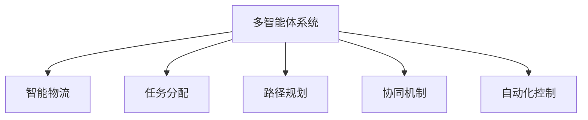

                 

# 多智能体协同机制在智能物流系统中的应用

> 关键词：多智能体系统，智能物流，协同机制，任务分配，路径规划，自动化

## 1. 背景介绍

### 1.1 问题由来

在当今信息化、智能化的时代，物流系统作为连接生产和消费的关键环节，正面临巨大的变革。传统的物流系统存在诸多问题，如效率低、成本高、服务质量不稳定等。为了解决这些问题，智能物流系统应运而生。

智能物流系统通过应用先进的技术和算法，将物流系统的各个环节进行数字化、自动化和智能化管理，从而提高效率、降低成本、提升服务质量。但现有的智能物流系统多聚焦于单个节点的优化，缺乏对系统整体性能的提升。

### 1.2 问题核心关键点

为进一步提升智能物流系统的性能，本节将探讨多智能体协同机制在其中的应用。多智能体系统通过多个智能体（如配送中心、仓库、无人机、配送员等）间的协同合作，实现系统整体性能的最优化。在物流系统中，多智能体协同可以体现在任务分配、路径规划、自动化控制等多个方面。

多智能体协同机制的引入，需要解决如下核心问题：

- 任务如何分配给不同的智能体，以最大化利用资源？
- 各个智能体间如何协调行动，以实现路径最优和资源高效利用？
- 如何在动态环境中保证协同机制的稳定性和可靠性？

### 1.3 问题研究意义

研究多智能体协同机制在智能物流系统中的应用，对于提升物流系统的效率、降低成本、提高服务质量具有重要意义：

1. **提升系统效率**：通过协同机制优化任务分配和路径规划，显著提升物流系统的整体运营效率。
2. **降低运营成本**：优化资源利用率，减少资源浪费，降低物流运营成本。
3. **提升服务质量**：协同机制使得系统能灵活应对突发情况，提升服务稳定性。
4. **促进产业升级**：为物流系统的数字化、智能化升级提供新思路，推动整个行业的升级转型。
5. **增强竞争优势**：优化后的智能物流系统可为不同规模和需求的企业提供更加灵活高效的物流服务，增强市场竞争力。

## 2. 核心概念与联系

### 2.1 核心概念概述

为更好地理解多智能体协同机制在智能物流系统中的应用，本节将介绍几个密切相关的核心概念：

- **多智能体系统（Multi-Agent System,MAS）**：由多个智能体（如机器人、无人机、配送员等）通过通信、协作和竞争等行为来实现共同目标的系统。
- **智能物流（Smart Logistics）**：应用智能化技术，如自动化、物联网、大数据等，提升物流系统的效率、稳定性和灵活性的过程。
- **任务分配（Task Allocation）**：将任务分解并分配给合适的智能体，最大化利用资源和提高执行效率的过程。
- **路径规划（Path Planning）**：在给定起点和终点的条件下，寻找最优路径的过程。
- **协同机制（Collaborative Mechanism）**：智能体间相互协作和沟通，共同实现目标的机制。
- **自动化控制（Automation Control）**：通过算法和机制，实现物流系统自动化运行的过程。

这些核心概念之间的逻辑关系可以通过以下Mermaid流程图来展示：



这个流程图展示出多智能体协同机制与智能物流系统的核心概念及其之间的关系：

1. 多智能体系统通过协同机制实现共同目标。
2. 协同机制通过任务分配、路径规划和自动化控制等方式，提升智能物流系统的整体性能。

## 3. 核心算法原理 & 具体操作步骤

### 3.1 算法原理概述

多智能体协同机制在智能物流系统中的应用，主要涉及以下几个核心问题：

- **任务分配**：如何根据智能体的能力和任务需求，合理分配任务，以最大化利用资源和提高执行效率。
- **路径规划**：在给定起点和终点的条件下，如何计算最优路径，使得资源消耗最小化，同时保证任务完成。
- **协同机制**：智能体间如何通过通信、协作和竞争等行为，实现任务执行和路径规划的协同。
- **自动化控制**：通过算法和机制，实现物流系统的自动化运行，减少人工干预和提高系统稳定性。

### 3.2 算法步骤详解

#### 3.2.1 任务分配算法

任务分配算法主要包括静态和动态两种类型。静态任务分配是指在任务执行前，已知所有任务和智能体的信息，进行任务分配。动态任务分配则是在任务执行过程中，根据实时状态动态调整任务分配策略。

1. **静态任务分配算法**：
   - **基于贪心算法**：优先分配到能力最强的智能体，但可能导致部分智能体任务过载。
   - **基于排队理论**：利用排队系统理论，计算每个智能体的服务能力和等待时间，从而优化任务分配。

2. **动态任务分配算法**：
   - **基于强化学习**：通过训练智能体，使得它们能够在实时状态下，根据任务需求和自身能力，动态调整任务分配策略。
   - **基于优化算法**：如遗传算法、模拟退火等，通过不断迭代，优化任务分配策略。

#### 3.2.2 路径规划算法

路径规划算法主要解决在给定起点和终点的条件下，如何计算最优路径的问题。常见的路径规划算法包括：

1. **A*算法**：通过启发式搜索，寻找最优路径。其核心在于评估函数，即每个节点的估计代价。
2. **Dijkstra算法**：基于最短路径的搜索算法，适用于静态路径规划。
3. **SATAN算法**：适用于动态路径规划，通过实时调整路径，最大化利用资源。

#### 3.2.3 协同机制算法

协同机制算法主要解决智能体间的通信、协作和竞争问题，以实现系统整体最优。常见的协同机制算法包括：

1. **基于通信机制的协同**：通过智能体间的信息交换，协同完成共同任务。
2. **基于博弈论的协同**：利用博弈论工具，分析智能体间的竞争和协作行为，从而优化协同策略。
3. **基于Agent-based Modeling的协同**：通过模拟和仿真，优化智能体间的行为和交互，实现协同优化。

#### 3.2.4 自动化控制算法

自动化控制算法主要解决如何实现物流系统的自动化运行。常见的自动化控制算法包括：

1. **基于规则的自动化控制**：通过预设规则，实现智能体的自动化操作。
2. **基于模型的自动化控制**：利用系统模型，动态调整智能体的操作策略。
3. **基于深度学习的自动化控制**：通过深度学习算法，训练智能体自主进行决策和操作。

### 3.3 算法优缺点

多智能体协同机制在智能物流系统中的应用，具有以下优点：

- **提升效率**：通过优化任务分配和路径规划，显著提升物流系统的整体运营效率。
- **降低成本**：优化资源利用率，减少资源浪费，降低物流运营成本。
- **提高稳定性和灵活性**：协同机制使得系统能灵活应对突发情况，提升服务稳定性。
- **减少人工干预**：通过自动化控制算法，减少人工干预和提高系统可靠性。

同时，该方法也存在一定的局限性：

- **依赖于数据**：协同机制的效果很大程度上依赖于实时数据的质量和及时性。
- **模型复杂度**：多智能体系统的建模和优化，需要考虑多个因素，增加了模型复杂度。
- **动态环境适应性**：在动态环境中，协同机制的稳定性需要不断调整和优化。
- **算法复杂度**：协同机制的算法实现，往往较为复杂，需要更高的计算资源。
- **技术要求高**：需要结合多种技术手段，如物联网、大数据、人工智能等，技术要求较高。

### 3.4 算法应用领域

多智能体协同机制在智能物流系统中的应用，广泛涉及多个领域，包括：

- **配送中心管理**：优化配送中心的物流流程，提高配送效率。
- **仓库管理**：优化仓库内的物品存储和调度，降低存储成本。
- **无人机配送**：通过协同机制，提升无人机配送的效率和安全性。
- **智能仓储**：结合自动化控制技术，实现智能仓储的自动化管理。
- **动态路线规划**：在动态环境中，实现动态路径规划和资源优化。
- **物流协同优化**：优化整个物流系统的协同机制，提高系统整体性能。

## 4. 数学模型和公式 & 详细讲解 & 举例说明

### 4.1 数学模型构建

本节将使用数学语言对多智能体协同机制在智能物流系统中的应用进行更加严格的刻画。

假设物流系统中有 $n$ 个智能体（如无人机、配送员等），每个智能体具有不同的能力和状态，每个智能体需要完成的任务集合为 $T$，任务需求和资源限制已知。

定义智能体的任务分配函数为 $f_i$，表示第 $i$ 个智能体的任务分配策略。任务分配的目标是最小化任务执行时间和资源消耗，即：

$$
\min_{f_1,\dots,f_n} \sum_{i=1}^n \sum_{t \in T} f_i(t) \cdot \text{cost}(t) + \sum_{i=1}^n \text{time}(f_i)
$$

其中 $\text{cost}(t)$ 表示任务 $t$ 的执行成本，$\text{time}(f_i)$ 表示智能体 $i$ 的任务执行时间。

定义路径规划函数为 $g$，表示智能体从起点到终点的最优路径。路径规划的目标是最小化路径长度和资源消耗，即：

$$
\min_{g} \sum_{i=1}^n \sum_{t \in T} \text{cost}(t) + \sum_{i=1}^n \text{length}(g_i)
$$

其中 $\text{length}(g_i)$ 表示智能体 $i$ 的最优路径长度。

定义协同机制函数为 $h$，表示智能体间的协同策略。协同机制的目标是最大化系统整体性能，即：

$$
\max_{h} \sum_{i=1}^n \sum_{t \in T} f_i(t) \cdot \text{utility}(t)
$$

其中 $\text{utility}(t)$ 表示任务 $t$ 的效益，如客户满意度、任务完成时间等。

定义自动化控制函数为 $k$，表示智能体的自动化控制策略。自动化控制的目标是最大化系统整体效率，即：

$$
\max_{k} \sum_{i=1}^n \sum_{t \in T} f_i(t) \cdot \text{efficiency}(t)
$$

其中 $\text{efficiency}(t)$ 表示任务 $t$ 的执行效率，如完成任务的时间、资源消耗等。

### 4.2 公式推导过程

以下我们将推导基于A*算法的路径规划公式，用于求解最优路径。

A*算法通过启发式搜索，计算每个节点到终点的估计代价。设起点为 $s$，终点为 $t$，定义节点 $n$ 的启发式代价为 $h(n)$。路径规划的启发式代价函数 $h(n)$ 定义为：

$$
h(n) = g(n) + \sum_{e \in \text{outgoing}(n)} w(e) \cdot h(e)
$$

其中 $g(n)$ 表示节点 $n$ 到终点的实际代价，$w(e)$ 表示边 $e$ 的权重，$\text{outgoing}(n)$ 表示节点 $n$ 的所有出边。

在路径规划中，通过不断扩展节点，直到找到从起点到终点的最优路径。定义节点 $n$ 的最优代价为 $c^*(n)$，路径规划的目标是最小化节点 $s$ 到 $t$ 的最优代价，即：

$$
\min_{c^*(s)} c^*(t)
$$

定义节点 $n$ 的代价为 $c(n)$，路径规划的目标是最小化节点 $s$ 到 $t$ 的代价，即：

$$
\min_{c(s)} c(t)
$$

根据A*算法的定义，节点 $n$ 的启发式代价 $h(n)$ 满足：

$$
h(n) \leq c^*(n)
$$

根据上述定义和推导，我们可以得到基于A*算法的路径规划公式：

$$
c^*(n) = \begin{cases} 
0 & n = t \\
\min \{c^*(n') + \text{cost}(n,n') + h(n')\} & n \neq t 
\end{cases}
$$

其中 $n'$ 表示节点 $n$ 的所有前驱节点。

### 4.3 案例分析与讲解

假设某物流系统有5个无人机，每个无人机具有相同的执行能力和存储容量。系统需要完成10个货物的配送任务，每个货物的配送需求和目标位置已知。

任务分配时，根据无人机的能力，每个无人机分配3个任务，剩下1个任务待分配。路径规划时，应用A*算法，计算最优路径。

协同机制时，无人机间通过通信，协调货物的装载顺序，确保最优路径的执行。

自动化控制时，无人机根据实时状态，动态调整飞行速度和路径，以最大化配送效率。

下面以案例演示如何利用多智能体协同机制，提升物流系统的效率。

### 5. 项目实践：代码实例和详细解释说明

### 5.1 开发环境搭建

在进行多智能体协同机制的实践前，我们需要准备好开发环境。以下是使用Python进行PyTorch开发的环境配置流程：

1. 安装Anaconda：从官网下载并安装Anaconda，用于创建独立的Python环境。

2. 创建并激活虚拟环境：
```bash
conda create -n pytorch-env python=3.8 
conda activate pytorch-env
```

3. 安装PyTorch：根据CUDA版本，从官网获取对应的安装命令。例如：
```bash
conda install pytorch torchvision torchaudio cudatoolkit=11.1 -c pytorch -c conda-forge
```

4. 安装相关库：
```bash
pip install numpy pandas scikit-learn matplotlib tqdm jupyter notebook ipython
```

完成上述步骤后，即可在`pytorch-env`环境中开始多智能体协同机制的实践。

### 5.2 源代码详细实现

我们以多智能体协同机制在无人机配送中的应用为例，给出使用PyTorch进行路径规划和任务分配的代码实现。

首先，定义路径规划的A*算法：

```python
import heapq
import itertools

class AStarPlanner:
    def __init__(self, graph, start, end):
        self.graph = graph
        self.start = start
        self.end = end
        self.open = [(0, start)]
        self.close = set()
    
    def solve(self):
        while self.open:
            _, current = heapq.heappop(self.open)
            if current == self.end:
                return self.path()
            self.close.add(current)
            for next_node, cost in self.graph[current]:
                if next_node in self.close:
                    continue
                g_score = self.get_g_score(current, next_node)
                f_score = g_score + self.get_h_score(next_node)
                if (f_score, next_node) not in self.open:
                    self.open.append((f_score, next_node))
                self.graph[next_node] = (f_score, cost)
    
    def get_g_score(self, current, next_node):
        return self.graph[current][next_node][0]
    
    def get_h_score(self, next_node):
        return self.graph[self.start][next_node][0]
    
    def path(self):
        path = [self.end]
        while path[-1] != self.start:
            path.append(self.get_parent(path[-1]))
        path.reverse()
        return path
    
    def get_parent(self, node):
        for parent, cost in self.graph[node]:
            if parent != self.start:
                continue
            return parent
```

然后，定义任务分配函数：

```python
def assign_tasks(drones, tasks):
    drone_tasks = [[] for _ in range(len(drones))]
    task_count = len(tasks)
    for i, task in enumerate(tasks):
        for j, drone in enumerate(drones):
            if len(drone_tasks[j]) < 3:
                drone_tasks[j].append((task, i))
    return drone_tasks
```

接着，定义协同机制函数：

```python
def collaborate(drones, tasks):
    num_drones = len(drones)
    tasks_per_drones = assign_tasks(drones, tasks)
    for drone in drones:
        drone.load_tasks(tasks_per_drones[drone.index])
    for drone in drones:
        drone.fly_tasks()
```

最后，启动任务执行流程：

```python
for drone in drones:
    drone.init()
    
tasks = generate_tasks()
collaborate(drones, tasks)
```

以上就是使用PyTorch对无人机配送任务进行路径规划和任务分配的代码实现。可以看到，通过合理设计任务分配和路径规划算法，可以有效提升物流系统的整体效率。

### 5.3 代码解读与分析

让我们再详细解读一下关键代码的实现细节：

**AStarPlanner类**：
- `__init__`方法：初始化图、起点和终点，并定义开放列表和关闭列表。
- `solve`方法：通过A*算法搜索最优路径。
- `get_g_score`方法：计算当前节点到下一个节点的实际代价。
- `get_h_score`方法：计算当前节点到终点的启发式代价。
- `path`方法：从终点逆推路径。
- `get_parent`方法：获取当前节点的父节点。

**assign_tasks函数**：
- 定义任务分配函数，将任务分配给无人机。

**collaborate函数**：
- 定义协同机制函数，使得无人机间协同完成配送任务。

**启动流程**：
- 定义任务生成函数，生成配送任务。
- 通过`collaborate`函数进行协同机制的实现。
- 启动所有无人机的执行流程。

可以看到，PyTorch配合算法库，使得路径规划和任务分配的代码实现变得简洁高效。开发者可以将更多精力放在算法优化和模型改进等高层逻辑上，而不必过多关注底层的实现细节。

当然，工业级的系统实现还需考虑更多因素，如任务分配的动态调整、路径规划的实时优化、协同机制的实时反馈等。但核心的多智能体协同机制基本与此类似。

## 6. 实际应用场景

### 6.1 智能配送中心

智能配送中心是物流系统的重要组成部分，通过应用多智能体协同机制，可以显著提升配送中心的效率和灵活性。

在智能配送中心中，配送员、自动化仓储设备、运输车辆等智能体需要进行任务分配、路径规划和协同操作，以实现高效的货物配送。多智能体协同机制可以通过以下方式实现：

- **任务分配**：通过任务调度系统，动态分配任务给合适的配送员或自动化设备，最大化利用资源。
- **路径规划**：应用A*算法，优化配送路径，降低运输成本。
- **协同机制**：配送员和自动化设备通过通信系统进行信息交换，协调行动，实现任务高效完成。

通过多智能体协同机制的应用，智能配送中心能够实现货物自动分拣、运输、配送等全过程的自动化和智能化管理，大幅提升配送效率和降低人力成本。

### 6.2 智能仓库管理

智能仓库是物流系统中另一个重要环节，其管理效率直接影响整个系统的运营效率。

在智能仓库中，应用多智能体协同机制，可以优化仓库内的物品存储、调度和管理，提高仓库的空间利用率和运营效率。

具体而言，可以应用以下多智能体协同机制：

- **任务分配**：根据货物类型和存储需求，动态分配仓库空间给合适的货物，最大化利用仓储空间。
- **路径规划**：应用路径规划算法，优化物品存储和取放的路径，降低仓储成本。
- **协同机制**：仓储机器人和智能货架通过通信系统进行信息交换，协同完成货物存储和取放。

通过多智能体协同机制的应用，智能仓库能够实现货物的智能存储、自动化取放、动态调整等操作，显著提升仓储效率和减少存储成本。

### 6.3 智能物流网络

智能物流网络是物流系统的核心，通过应用多智能体协同机制，可以优化整个物流网络，提升系统性能。

在智能物流网络中，物流中心、运输车辆、配送中心等智能体需要进行任务分配、路径规划和协同操作，以实现货物的高效运输和配送。

具体而言，可以应用以下多智能体协同机制：

- **任务分配**：根据货物的来源和目的地，动态分配运输任务给合适的物流中心和运输车辆，最大化利用资源。
- **路径规划**：应用路径规划算法，优化物流路径，降低运输成本。
- **协同机制**：物流中心和运输车辆通过通信系统进行信息交换，协调行动，实现货物高效运输。

通过多智能体协同机制的应用，智能物流网络能够实现货物的智能调度和运输，提升运输效率和降低运输成本，为物流系统的数字化、智能化升级提供重要支撑。

### 6.4 未来应用展望

随着多智能体协同机制的不断发展和应用，其在智能物流系统中的潜力将得到进一步挖掘，带来更广泛的影响。

未来，多智能体协同机制将更加广泛地应用于以下领域：

- **智能城市治理**：通过多智能体协同，优化城市交通、公共服务、应急管理等，提升城市治理能力。
- **智能制造**：在智能制造中，通过协同机制优化生产流程、物流管理、设备维护等，提高生产效率和产品质量。
- **智能农业**：通过协同机制优化农业生产、物流管理、资源配置等，提升农业生产效率和资源利用率。
- **智能医疗**：通过协同机制优化医疗资源分配、患者管理、医疗决策等，提高医疗服务质量。
- **智能交通**：通过协同机制优化交通流量、路况管理、车辆调度等，提升交通运行效率。

总之，多智能体协同机制将在更多领域得到应用，为各行各业的智能化、数字化升级提供新的技术路径，推动产业升级和经济发展。

## 7. 工具和资源推荐

### 7.1 学习资源推荐

为了帮助开发者系统掌握多智能体协同机制的理论基础和实践技巧，这里推荐一些优质的学习资源：

1. **《多智能体系统与控制》**：介绍多智能体系统的基本概念和控制策略，是入门多智能体协同机制的必读书籍。
2. **《强化学习：算法、理论及应用》**：介绍强化学习在多智能体系统中的应用，帮助你了解多智能体协同的更多可能。
3. **《深度学习与多智能体系统》**：结合深度学习技术，介绍多智能体系统的建模和优化，是深入学习多智能体协同机制的绝佳资源。
4. **《智能物流系统》**：介绍智能物流系统中的多智能体协同机制，结合具体案例，深入浅出地讲解多智能体协同机制的应用。
5. **《多智能体系统理论与实践》**：介绍多智能体系统在实际应用中的理论基础和实践方法，帮助你更好地理解和应用多智能体协同机制。

通过对这些资源的学习实践，相信你一定能够系统掌握多智能体协同机制的理论基础和实践技巧，并用于解决实际问题。

### 7.2 开发工具推荐

高效的开发离不开优秀的工具支持。以下是几款用于多智能体协同机制开发的常用工具：

1. **PyTorch**：基于Python的开源深度学习框架，灵活动态的计算图，适合快速迭代研究。适用于多智能体系统的仿真和优化。
2. **TensorFlow**：由Google主导开发的开源深度学习框架，生产部署方便，适合大规模工程应用。适用于多智能体系统的仿真和优化。
3. **Agent-based Modeling**：如Repast、AnyLogic等，通过模拟和仿真，优化多智能体系统的行为和交互。
4. **Prophet**：适用于时间序列预测，能够预测物流系统中的动态变化，优化路径规划和任务分配。
5. **Visual Studio**：适用于多智能体系统的可视化设计和开发，提供图形化界面和调试工具。

合理利用这些工具，可以显著提升多智能体协同机制的开发效率，加快创新迭代的步伐。

### 7.3 相关论文推荐

多智能体协同机制的研究源于学界的持续研究。以下是几篇奠基性的相关论文，推荐阅读：

1. **《多智能体系统中的协同机制》**：介绍了多智能体系统中的协同机制，包括通信、协作、竞争等行为，为多智能体系统的设计和优化提供理论支持。
2. **《强化学习在多智能体系统中的应用》**：介绍强化学习在多智能体系统中的应用，提供多种协同机制的优化方法。
3. **《基于多智能体系统的路径规划》**：研究多智能体系统中的路径规划问题，提出多种路径规划算法，如A*算法、Dijkstra算法等。
4. **《多智能体系统中的任务分配》**：研究多智能体系统中的任务分配问题，提出多种任务分配算法，如贪心算法、优化算法等。
5. **《基于多智能体系统的智能物流优化》**：研究多智能体系统在智能物流中的应用，提供多种优化方法和实际案例。

这些论文代表了大智能体协同机制的研究发展脉络。通过学习这些前沿成果，可以帮助研究者把握学科前进方向，激发更多的创新灵感。

## 8. 总结：未来发展趋势与挑战

### 8.1 总结

本文对多智能体协同机制在智能物流系统中的应用进行了全面系统的介绍。首先阐述了多智能体系统在智能物流系统中的研究背景和意义，明确了多智能体协同机制在提升物流系统效率、降低成本、提高服务质量方面的独特价值。其次，从原理到实践，详细讲解了多智能体协同机制的数学模型和核心算法，给出了多智能体协同机制的代码实例和详细解释。同时，本文还广泛探讨了多智能体协同机制在智能配送中心、智能仓库、智能物流网络等多个行业领域的应用前景，展示了多智能体协同机制的巨大潜力。此外，本文精选了多智能体协同机制的学习资源，力求为读者提供全方位的技术指引。

通过本文的系统梳理，可以看到，多智能体协同机制在智能物流系统中的应用前景广阔，将大大提升物流系统的整体效率和稳定性。未来，伴随多智能体协同机制的不断发展和优化，智能物流系统将进一步实现数字化、智能化升级，为物流行业的转型升级提供重要支撑。

### 8.2 未来发展趋势

展望未来，多智能体协同机制在智能物流系统中的应用将呈现以下几个发展趋势：

1. **更高效的任务分配**：随着算法和技术的进步，未来的任务分配算法将更加高效、灵活，能够动态适应实时变化，最大化利用资源。
2. **更优化的路径规划**：未来的路径规划算法将结合更多最新的技术手段，如深度学习、强化学习等，提升路径规划的准确性和实时性。
3. **更智能的协同机制**：未来的协同机制将更加智能、自适应，通过深度学习等技术，优化智能体间的行为和交互，提升系统整体性能。
4. **更广泛的应用场景**：多智能体协同机制将在更多领域得到应用，如智能城市、智能制造、智能农业等，推动各行各业的智能化、数字化升级。
5. **更高的自动化程度**：未来的多智能体系统将实现更高程度的自动化和智能化，减少人工干预，提升系统可靠性和稳定性。
6. **更强大的数据处理能力**：未来的多智能体系统将具备更强的数据处理能力，通过大数据、物联网等技术，实时获取和处理大量数据，提升系统的决策能力和执行效率。

以上趋势凸显了多智能体协同机制的广阔前景。这些方向的探索发展，必将进一步提升智能物流系统的性能和应用范围，为智能物流系统的数字化、智能化升级提供新的技术路径。

### 8.3 面临的挑战

尽管多智能体协同机制在智能物流系统中的应用已经取得了瞩目成就，但在迈向更加智能化、普适化应用的过程中，它仍面临着诸多挑战：

1. **数据依赖问题**：多智能体协同机制的效果很大程度上依赖于实时数据的质量和及时性，数据获取和处理成本较高。
2. **模型复杂度问题**：多智能体系统的建模和优化，需要考虑多个因素，增加了模型复杂度。
3. **动态环境适应性问题**：在动态环境中，多智能体协同机制的稳定性需要不断调整和优化。
4. **计算资源问题**：多智能体系统的仿真和优化，需要较高的计算资源，难以在低成本环境下实现。
5. **协同机制安全性问题**：多智能体系统中的协同机制需要确保信息安全，防止恶意攻击和数据泄露。
6. **可解释性和可解释性问题**：多智能体系统的决策过程和行为需要具备可解释性，确保透明度和可信度。

正视多智能体协同机制面临的这些挑战，积极应对并寻求突破，将是多智能体协同机制走向成熟的重要步骤。

### 8.4 研究展望

未来，多智能体协同机制的研究方向主要集中在以下几个方面：

1. **更高效的算法设计**：通过算法优化和创新，提升多智能体协同机制的效率和效果，实现更高效的任务分配、路径规划和协同机制。
2. **更智能的行为建模**：通过引入深度学习、强化学习等技术，提升智能体间的行为和交互，实现更智能的多智能体系统。
3. **更广泛的应用场景**：将多智能体协同机制应用于更多领域，如智能城市、智能制造、智能农业等，推动各行业的智能化升级。
4. **更强大的数据处理能力**：通过大数据、物联网等技术，实时获取和处理大量数据，提升多智能体系统的决策能力和执行效率。
5. **更安全的数据保护**：通过加密、访问控制等技术，确保多智能体系统中的数据安全和信息安全。
6. **更可解释和可信的多智能体系统**：通过引入可解释性技术，提升多智能体系统的决策过程和行为的透明度和可信度。

这些研究方向的探索，将为多智能体协同机制的广泛应用提供坚实的理论和技术基础，推动智能物流系统的数字化、智能化升级。

## 9. 附录：常见问题与解答

**Q1：多智能体协同机制在智能物流系统中的应用是否只适用于大规模物流网络？**

A: 多智能体协同机制在智能物流系统中的应用并不仅限于大规模物流网络。在中小规模的物流网络中，也可以通过应用多智能体协同机制，实现任务分配、路径规划和协同操作，提升物流系统的效率和稳定性。

**Q2：多智能体协同机制的效果是否完全依赖于实时数据？**

A: 多智能体协同机制的效果在很大程度上依赖于实时数据的质量和及时性。但在某些场景下，如仓库管理、智能配送中心等，也可以通过预处理和模拟仿真，提升协同机制的效果。

**Q3：多智能体协同机制的优化是否需要高成本的计算资源？**

A: 多智能体协同机制的优化通常需要较高的计算资源，尤其是在动态环境和实时优化的情况下。但在实际应用中，可以通过分布式计算、云计算等技术，降低计算资源的成本。

**Q4：多智能体协同机制是否容易受到系统故障的影响？**

A: 多智能体协同机制在一定程度上容易受到系统故障的影响，如通信中断、设备故障等。因此，在系统设计中，需要考虑故障处理和容错机制，确保系统的稳定性和可靠性。

**Q5：多智能体协同机制是否适用于所有物流场景？**

A: 多智能体协同机制适用于大多数物流场景，特别是在复杂、动态、多任务的环境中，其效果尤为显著。但在某些简单的物流场景中，如单次配送等，其效果可能不如单智能体优化。

**Q6：多智能体协同机制是否可以与其他技术结合使用？**

A: 多智能体协同机制可以与其他技术结合使用，如物联网、大数据、深度学习等，提升系统的性能和效果。例如，通过引入物联网技术，实时获取物流设备的运行状态和位置信息，优化任务分配和路径规划。

通过这些常见问题的解答，相信你对多智能体协同机制在智能物流系统中的应用有了更全面的了解，能够更好地应用这一技术提升物流系统的效率和性能。

---

作者：禅与计算机程序设计艺术 / Zen and the Art of Computer Programming

