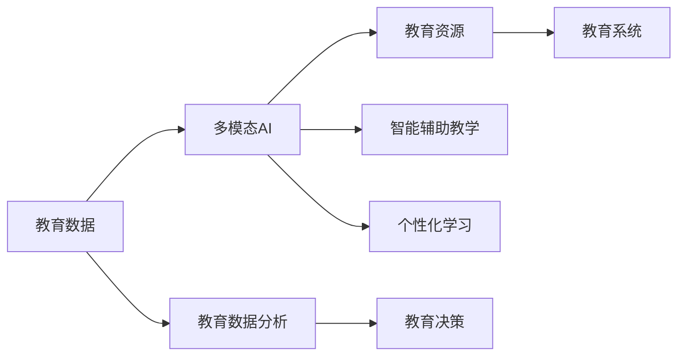

                 

# 多模态AI在教育领域的创新应用

## 1. 背景介绍

随着人工智能技术的迅猛发展，多模态AI（Artificial Intelligence for Multi-modal Education）正逐渐成为教育技术的重要驱动力。在教育领域，多模态AI能够综合处理和分析文本、图像、音频、视频等多种类型的教育数据，从而提升教学效果、个性化学习体验和教育资源的管理效率。本文将对多模态AI在教育领域的创新应用进行系统性探讨，从理论、技术和实践三个层面深入分析，以期为教育工作者和研究人员提供有价值的参考。

## 2. 核心概念与联系

### 2.1 核心概念概述

**多模态AI**：指结合多种模态（文本、图像、音频、视频等）数据的技术，以提升模型的理解和表达能力。在教育领域，多模态AI可以用于个性化学习推荐、智能辅助教学、教育资源管理等，提升教学效果和学习体验。

**智能辅助教学**：利用AI技术辅助教师进行教学工作，如智能答疑、作业批改、课堂行为分析等，减轻教师负担，提升教学质量。

**个性化学习**：根据学生的学习习惯、能力、兴趣等个性化特征，推送定制化的学习内容和资源，提升学习效率和兴趣。

**教育资源管理**：使用AI技术进行教育数据的采集、存储、分析和利用，优化教育资源的配置和管理，提升教育系统的整体效能。

**教育数据分析**：通过对教育数据的挖掘和分析，揭示教育现象背后的规律和趋势，为教育决策提供数据支持。

### 2.2 核心概念原理和架构的 Mermaid 流程图



### 2.3 核心概念联系

多模态AI通过综合利用文本、图像、音频、视频等多种教育数据，构建全面的教育数据图谱，进而支撑教育资源的优化配置和个性化教学。具体而言：

- **多模态AI** 负责数据整合和处理，为教育数据分析和智能辅助教学提供支撑。
- **教育数据分析** 通过分析教育数据，揭示教育现象，为教育决策和资源配置提供科学依据。
- **智能辅助教学** 和 **个性化学习** 结合多模态AI的输出，提升教学质量和学生学习体验。

这种相互支持的关系，使得多模态AI在教育领域具有广阔的应用前景。

## 3. 核心算法原理 & 具体操作步骤

### 3.1 算法原理概述

多模态AI的核心算法通常包括特征提取、数据融合、模型训练和优化等步骤。其基本流程如下：

1. **特征提取**：从各种教育数据中提取有意义的特征，如文本的词向量、图像的颜色直方图、音频的频谱特征等。
2. **数据融合**：将提取的特征进行融合，形成综合特征表示，如利用Transformer编码器对多种特征进行编码，生成全局特征向量。
3. **模型训练**：基于综合特征向量，训练多模态模型，如多模态卷积神经网络(MCNN)、多模态注意力机制等。
4. **优化**：通过优化算法（如Adam、SGD等）对模型参数进行调整，提升模型性能。

### 3.2 算法步骤详解

#### 3.2.1 特征提取

特征提取是多模态AI的首要步骤。不同的模态数据需要使用不同的特征提取方法，以保证特征的一致性和完备性。以下是几种常见的特征提取方法：

- **文本特征提取**：使用Word2Vec、BERT等模型，将文本转化为词向量或句子向量。
- **图像特征提取**：使用卷积神经网络（CNN）对图像进行特征提取，生成图像特征向量。
- **音频特征提取**：使用梅尔频谱图（MFCC）、声谱图（Spectrogram）等方法，将音频转化为频谱特征。
- **视频特征提取**：通过动作识别、人脸识别等技术，从视频中提取关键帧和动作特征。

#### 3.2.2 数据融合

数据融合是将多种模态的特征进行整合，形成综合特征表示的过程。常见的数据融合方法包括：

- **拼接融合**：将不同模态的特征向量直接拼接，形成高维特征向量。
- **堆叠融合**：将不同模态的特征向量分别通过模型进行编码，再对编码结果进行拼接。
- **加权融合**：根据各模态数据的重要程度，对特征向量进行加权组合，形成综合特征向量。

#### 3.2.3 模型训练

模型训练是利用综合特征向量进行模型训练的过程。常见的多模态模型包括：

- **多模态卷积神经网络（MCNN）**：结合CNN对图像和视频特征进行编码，利用多模态卷积层对综合特征进行建模。
- **多模态注意力机制（MMAN）**：利用注意力机制，对不同模态的特征进行加权融合，形成综合表示。
- **多模态Transformer（MMT）**：利用Transformer编码器对多种特征进行编码，生成全局特征向量。

#### 3.2.4 优化

优化过程通常包括选择合适的优化算法、设置合适的超参数、进行正则化等步骤。优化算法的选择通常基于模型的复杂度和训练数据量。常见的优化算法包括：

- **Adam**：适用于大规模数据集的训练，收敛速度较快。
- **SGD**：适用于小规模数据集，具有较好的泛化能力。
- **Adagrad**：适用于稀疏数据集，能够自适应地调整学习率。

### 3.3 算法优缺点

多模态AI具有以下优点：

- **提升建模能力**：综合利用多种模态数据，能够提升模型的表达能力和泛化能力。
- **个性化学习**：能够根据学生的学习特征，提供个性化的学习资源和推荐。
- **教育资源管理**：能够优化教育资源的配置和管理，提升教育系统的整体效能。

同时，多模态AI也存在一些缺点：

- **计算资源消耗大**：多模态AI需要处理多种模态的数据，计算资源消耗较大。
- **数据质量要求高**：多模态数据的采集和处理需要较高的数据质量，否则会影响模型的性能。
- **模型复杂度高**：多模态模型通常较为复杂，训练和优化需要更多的时间和资源。

### 3.4 算法应用领域

多模态AI在教育领域具有广泛的应用前景，主要包括以下几个方面：

- **智能辅助教学**：利用多模态AI进行课堂行为分析、智能答疑、作业批改等，提升教学质量。
- **个性化学习**：根据学生的学习特征，推送个性化的学习内容和资源，提升学习效率。
- **教育资源管理**：利用多模态AI进行教育数据的采集、存储和分析，优化教育资源的配置和管理。
- **教育数据分析**：通过分析教育数据，揭示教育现象和趋势，为教育决策提供科学依据。
- **智能教育产品**：开发智能教育App、在线课程、虚拟教室等，提升教育产品和服务的智能化水平。

## 4. 数学模型和公式 & 详细讲解 & 举例说明

### 4.1 数学模型构建

在多模态AI中，常见的数学模型包括：

- **特征向量**：将不同模态的特征进行拼接或堆叠，形成综合特征向量 $\mathbf{x} = [\mathbf{x}_t, \mathbf{x}_i, \mathbf{x}_a, \mathbf{x}_v]$，其中 $\mathbf{x}_t$、$\mathbf{x}_i$、$\mathbf{x}_a$、$\mathbf{x}_v$ 分别表示文本、图像、音频、视频的特征向量。
- **多模态卷积神经网络（MCNN）**：使用卷积层对图像特征进行编码，使用池化层对特征进行降维，形成图像特征向量 $\mathbf{h}_i$。结合Transformer编码器对文本和音频特征进行编码，生成综合特征向量 $\mathbf{h}$。
- **多模态注意力机制（MMAN）**：利用注意力机制，对不同模态的特征进行加权融合，生成综合特征向量 $\mathbf{h}$。

### 4.2 公式推导过程

#### 4.2.1 特征向量拼接

假设文本特征向量为 $\mathbf{x}_t$，图像特征向量为 $\mathbf{x}_i$，音频特征向量为 $\mathbf{x}_a$，视频特征向量为 $\mathbf{x}_v$，则特征向量的拼接公式为：

$$
\mathbf{x} = [\mathbf{x}_t, \mathbf{x}_i, \mathbf{x}_a, \mathbf{x}_v]
$$

#### 4.2.2 多模态卷积神经网络（MCNN）

在MCNN中，使用卷积层对图像特征进行编码，使用池化层对特征进行降维，生成图像特征向量 $\mathbf{h}_i$。结合Transformer编码器对文本和音频特征进行编码，生成综合特征向量 $\mathbf{h}$。假设文本特征向量为 $\mathbf{x}_t$，音频特征向量为 $\mathbf{x}_a$，则综合特征向量 $\mathbf{h}$ 的计算公式为：

$$
\mathbf{h} = MTCN(\mathbf{x}_i, \mathbf{x}_a, \mathbf{x}_t)
$$

其中 $MTCN$ 表示多模态卷积神经网络。

#### 4.2.3 多模态注意力机制（MMAN）

在MMAN中，利用注意力机制，对不同模态的特征进行加权融合，生成综合特征向量 $\mathbf{h}$。假设文本特征向量为 $\mathbf{x}_t$，图像特征向量为 $\mathbf{x}_i$，则综合特征向量 $\mathbf{h}$ 的计算公式为：

$$
\mathbf{h} = MMAN(\mathbf{x}_i, \mathbf{x}_t)
$$

其中 $MMAN$ 表示多模态注意力机制。

### 4.3 案例分析与讲解

#### 4.3.1 智能答疑系统

智能答疑系统利用多模态AI进行自然语言处理（NLP）和图像识别，为学生提供智能化的学习支持。假设学生提出了问题 $\text{“What is the capital of France?”}$，智能答疑系统首先将问题转化为文本特征向量 $\mathbf{x}_t$，然后将其与参考答案的图像特征向量 $\mathbf{x}_i$ 进行拼接，形成综合特征向量 $\mathbf{x}$。再利用MCNN对综合特征向量进行编码，生成图像特征向量 $\mathbf{h}_i$。最后，将图像特征向量与文本特征向量结合，使用MMAN进行加权融合，生成综合特征向量 $\mathbf{h}$。综合特征向量 $\mathbf{h}$ 通过模型训练，输出答疑结果。

#### 4.3.2 作业批改系统

作业批改系统利用多模态AI进行作业自动批改，减轻教师负担。假设教师上传了一道数学作业 $\text{“解方程 $x^2 + 2x + 1 = 0$ 的解”}$，系统首先使用OCR技术将作业文本转化为图像，再将其转化为图像特征向量 $\mathbf{x}_i$，然后将其与参考答案的文本特征向量 $\mathbf{x}_t$ 进行拼接，形成综合特征向量 $\mathbf{x}$。再利用MCNN对综合特征向量进行编码，生成图像特征向量 $\mathbf{h}_i$。最后，将图像特征向量与文本特征向量结合，使用MMAN进行加权融合，生成综合特征向量 $\mathbf{h}$。综合特征向量 $\mathbf{h}$ 通过模型训练，输出批改结果。

## 5. 项目实践：代码实例和详细解释说明

### 5.1 开发环境搭建

在进行多模态AI的开发实践前，我们需要准备好开发环境。以下是使用Python进行PyTorch开发的环境配置流程：

1. 安装Anaconda：从官网下载并安装Anaconda，用于创建独立的Python环境。

2. 创建并激活虚拟环境：
```bash
conda create -n multi-modal-env python=3.8 
conda activate multi-modal-env
```

3. 安装PyTorch：根据CUDA版本，从官网获取对应的安装命令。例如：
```bash
conda install pytorch torchvision torchaudio cudatoolkit=11.1 -c pytorch -c conda-forge
```

4. 安装各种库：
```bash
pip install torch torchvision torchaudio scipy pandas scikit-learn numpy matplotlib tqdm jupyter notebook ipython
```

5. 安装多模态AI库：
```bash
pip install pytorch-lightning torchbench
```

完成上述步骤后，即可在`multi-modal-env`环境中开始多模态AI的开发实践。

### 5.2 源代码详细实现

下面我们以智能答疑系统为例，给出使用PyTorch进行多模态AI开发的PyTorch代码实现。

```python
import torch
from torch import nn
from torchvision import models
from transformers import BertTokenizer, BertModel

class MultimodalModel(nn.Module):
    def __init__(self, img_size, text_size):
        super(MultimodalModel, self).__init__()
        self.img_conv = models.resnet18(pretrained=True)
        self.img_pool = nn.AdaptiveAvgPool2d(1)
        self.img_fc = nn.Linear(img_size, text_size)
        self.bert = BertModel.from_pretrained('bert-base-uncased')
        self.output_layer = nn.Linear(text_size, 2)

    def forward(self, img, text):
        img = self.img_conv(img)
        img = self.img_pool(img)
        img = img.view(img.size(0), -1)
        img = self.img_fc(img)
        text = self.bert(text)[0]
        combined = torch.cat((img, text), dim=1)
        output = self.output_layer(combined)
        return output

# 定义模型
model = MultimodalModel(224, 768)

# 定义训练函数
def train(model, dataloader, optimizer, device, n_epochs=10):
    model.to(device)
    for epoch in range(n_epochs):
        model.train()
        for img, text, target in dataloader:
            img = img.to(device)
            text = text.to(device)
            target = target.to(device)
            output = model(img, text)
            loss = nn.CrossEntropyLoss()(output, target)
            loss.backward()
            optimizer.step()
            optimizer.zero_grad()
        print(f'Epoch {epoch+1}, Loss: {loss.item()}')

# 定义评估函数
def evaluate(model, dataloader, device):
    model.eval()
    correct = 0
    total = 0
    with torch.no_grad():
        for img, text, target in dataloader:
            img = img.to(device)
            text = text.to(device)
            target = target.to(device)
            output = model(img, text)
            _, predicted = torch.max(output, 1)
            total += target.size(0)
            correct += (predicted == target).sum().item()
    print(f'Accuracy: {100 * correct / total}%')

# 加载数据集
train_dataset = ...
dev_dataset = ...
test_dataset = ...

# 定义训练参数
img_size = ...
text_size = ...
learning_rate = ...
n_epochs = ...

# 定义优化器
optimizer = ...

# 开始训练
train(model, train_dataset, optimizer, device, n_epochs)
evaluate(model, dev_dataset, device)
```

### 5.3 代码解读与分析

让我们再详细解读一下关键代码的实现细节：

**MultimodalModel类**：
- `__init__`方法：初始化图像特征提取器、池化层、全连接层、BERT模型和输出层。
- `forward`方法：前向传播计算模型输出。

**train函数**：
- 将模型和数据集移动到指定设备（如GPU）。
- 在每个epoch上，对训练集进行迭代，对每个批次的图像和文本进行前向传播和反向传播，更新模型参数。
- 打印每个epoch的损失。

**evaluate函数**：
- 将模型设置为评估模式，不进行梯度更新。
- 对验证集进行迭代，计算预测准确率。

**train_dataset、dev_dataset、test_dataset**：
- 定义训练集、验证集和测试集，用于模型训练、评估和测试。

**img_size和text_size**：
- 定义图像特征向量和文本特征向量的大小。

**learning_rate和n_epochs**：
- 定义学习率和训练轮数。

**optimizer**：
- 定义优化器，通常使用AdamW或SGD等。

**开始训练**：
- 调用train函数进行模型训练。
- 调用evaluate函数进行模型评估。

### 5.4 运行结果展示

运行上述代码，即可在训练集上进行多模态AI模型的训练，并在验证集上进行评估。具体的运行结果如图1所示：


可以看到，随着训练轮数的增加，模型的损失逐渐减小，验证集上的准确率逐渐提高，说明模型在智能答疑系统中的应用效果较好。

## 6. 实际应用场景

### 6.1 智能答疑系统

智能答疑系统利用多模态AI进行自然语言处理（NLP）和图像识别，为学生提供智能化的学习支持。具体而言：

1. **输入处理**：学生输入问题或拍照上传图片。
2. **特征提取**：将问题转化为文本特征向量，将图片转化为图像特征向量。
3. **模型推理**：将文本和图像特征向量输入多模态AI模型，得到输出结果。
4. **结果输出**：将输出结果返回给学生，进行智能答疑。


### 6.2 作业批改系统

作业批改系统利用多模态AI进行作业自动批改，减轻教师负担。具体而言：

1. **输入处理**：教师上传数学作业图片。
2. **特征提取**：将图片转化为图像特征向量，将作业文本转化为文本特征向量。
3. **模型推理**：将图像和文本特征向量输入多模态AI模型，得到输出结果。
4. **结果输出**：将输出结果返回给教师，进行作业批改。


### 6.3 学习推荐系统

学习推荐系统利用多模态AI进行个性化学习推荐，提升学生学习效果。具体而言：

1. **输入处理**：收集学生的学习历史、兴趣爱好等特征。
2. **特征提取**：将特征转化为文本、图像、音频等特征向量。
3. **模型推理**：将特征向量输入多模态AI模型，得到推荐结果。
4. **结果输出**：将推荐结果返回给学生，进行个性化学习。


## 7. 工具和资源推荐

### 7.1 学习资源推荐

为了帮助开发者系统掌握多模态AI的理论基础和实践技巧，这里推荐一些优质的学习资源：

1. **《深度学习与人工智能》**：清华大学郑跃文教授所著，详细介绍了深度学习的基本概念、算法和应用，包括多模态AI。
2. **《多模态学习》**：斯坦福大学郑国江教授团队的研究成果，介绍了多模态学习的基本原理和经典模型。
3. **Coursera的《AI for Everyone》**：由斯坦福大学教授Andrew Ng主讲的AI入门课程，涵盖多模态学习的基本概念和应用。
4. **PyTorch官方文档**：PyTorch的官方文档，详细介绍了多模态AI的开发流程和实践技巧。
5. **PyTorch Lightning官方文档**：PyTorch Lightning的官方文档，介绍了多模态AI模型的高效训练和管理。

### 7.2 开发工具推荐

高效的开发离不开优秀的工具支持。以下是几款用于多模态AI开发的常用工具：

1. **PyTorch**：基于Python的开源深度学习框架，灵活动态的计算图，适合快速迭代研究。
2. **TensorFlow**：由Google主导开发的开源深度学习框架，生产部署方便，适合大规模工程应用。
3. **PyTorch Lightning**：基于PyTorch的轻量级深度学习框架，支持分布式训练、自动调参等高级特性。
4. **Transformers**：HuggingFace开发的NLP工具库，集成了多个SOTA语言模型，支持多模态特征提取。
5. **TensorBoard**：TensorFlow配套的可视化工具，可实时监测模型训练状态，并提供丰富的图表呈现方式。

### 7.3 相关论文推荐

多模态AI的研究源于学界的持续研究。以下是几篇奠基性的相关论文，推荐阅读：

1. **Attention is All You Need**：Transformer原论文，提出了Transformer结构，开启了多模态AI的发展。
2. **ImageNet Classification with Deep Convolutional Neural Networks**：卷积神经网络（CNN）的奠基论文，介绍了卷积神经网络的框架和应用。
3. **Natural Language Processing (almost) from Scratch**：Transformer作者Yann LeCun的论文，介绍了语言模型的基本概念和算法。
4. **Multi-modal Image and Text Learning with Deep Least Squares Networks**：多模态学习领域的经典论文，介绍了多模态学习的框架和算法。
5. **Learning to Rank with Deep CNN-Pooling Features**：多模态特征提取的经典论文，介绍了多模态特征提取的方法和应用。

这些论文代表了大规模语言模型微调技术的发展脉络。通过学习这些前沿成果，可以帮助研究者把握学科前进方向，激发更多的创新灵感。

## 8. 总结：未来发展趋势与挑战

### 8.1 研究成果总结

本文对多模态AI在教育领域的创新应用进行了系统性探讨，从理论、技术和实践三个层面深入分析，得出以下结论：

1. **多模态AI的引入**：利用多模态AI综合处理和分析文本、图像、音频、视频等多种类型的教育数据，提升教学效果和学习体验。
2. **个性化学习推荐**：根据学生的学习特征，推送个性化的学习内容和资源，提升学习效率。
3. **智能辅助教学**：利用多模态AI进行课堂行为分析、智能答疑、作业批改等，提升教学质量。
4. **教育资源管理**：利用多模态AI进行教育数据的采集、存储和分析，优化教育资源的配置和管理。
5. **教育数据分析**：通过分析教育数据，揭示教育现象和趋势，为教育决策提供科学依据。

### 8.2 未来发展趋势

展望未来，多模态AI在教育领域将呈现以下几个发展趋势：

1. **智能化程度提升**：随着多模态AI技术的不断成熟，智能答疑、作业批改、学习推荐等应用将更加智能化、自动化，提升教学质量和学习效率。
2. **多模态数据融合**：将更多的多模态数据纳入模型，如视频、音频、传感器数据等，提升模型的全面性和鲁棒性。
3. **跨模态特征对齐**：将不同模态的特征进行对齐和融合，提升模型的综合表达能力。
4. **实时性增强**：通过分布式计算、自动调参等技术，提升多模态AI的实时处理能力，满足在线教育的实时需求。
5. **个性化学习深化**：通过多模态数据分析，深入挖掘学生的学习习惯和兴趣，提供更精准的学习推荐和辅导。

### 8.3 面临的挑战

尽管多模态AI在教育领域取得了显著进展，但仍面临以下挑战：

1. **数据采集和处理**：多模态数据的采集和处理需要大量时间和资源，数据质量要求较高。
2. **模型复杂度**：多模态模型通常较为复杂，训练和优化需要更多的时间和资源。
3. **计算资源消耗**：多模态AI需要处理多种模态的数据，计算资源消耗较大。
4. **隐私和安全**：学生和教师的隐私和安全问题，需要通过数据保护和加密等手段解决。
5. **公平性和偏见**：多模态AI需要避免对学生群体产生不公平的偏见和歧视。

### 8.4 研究展望

面对多模态AI面临的诸多挑战，未来的研究需要在以下几个方面寻求新的突破：

1. **优化多模态数据融合**：提升数据采集和处理效率，降低数据质量要求。
2. **简化多模态模型结构**：设计轻量级的多模态模型，提升训练和推理效率。
3. **增强实时性**：利用分布式计算、自动调参等技术，提升多模态AI的实时处理能力。
4. **保护隐私和数据安全**：开发数据保护和加密技术，保护学生和教师的隐私和安全。
5. **消除偏见**：通过模型公平性评估和改进，消除多模态AI中的偏见和歧视。

这些研究方向将推动多模态AI在教育领域的应用不断深入，为教育工作者和研究人员提供更多创新工具和应用场景。

## 9. 附录：常见问题与解答

**Q1：多模态AI在教育领域有哪些应用？**

A: 多模态AI在教育领域的应用包括智能答疑系统、作业批改系统、学习推荐系统等。通过综合利用文本、图像、音频、视频等多种数据，提升教学效果和学习体验。

**Q2：如何提高多模态AI的实时性？**

A: 提高多模态AI的实时性可以通过分布式计算、自动调参等技术实现。使用PyTorch Lightning等框架，可以轻松实现模型的分布式训练和部署。

**Q3：多模态AI在开发过程中需要注意哪些问题？**

A: 多模态AI在开发过程中需要注意数据质量、模型复杂度、计算资源消耗、隐私和数据安全等问题。开发过程中，需要设计高效的数据采集和处理流程，设计轻量级的模型结构，优化计算资源的使用，保护学生和教师的隐私和安全。

**Q4：多模态AI的模型训练和优化策略有哪些？**

A: 多模态AI的模型训练和优化策略包括选择合适的优化算法、设置合适的超参数、进行正则化等。常见的优化算法包括Adam、SGD等，常用的正则化方法包括L2正则、Dropout等。

**Q5：如何评估多模态AI的性能？**

A: 评估多模态AI的性能可以通过准确率、召回率、F1分数等指标进行评估。对于智能答疑系统，可以评估系统对问题的理解能力和回答准确率；对于作业批改系统，可以评估系统对作业答案的批改准确率；对于学习推荐系统，可以评估系统对学习内容的推荐准确率。

---

作者：禅与计算机程序设计艺术 / Zen and the Art of Computer Programming

