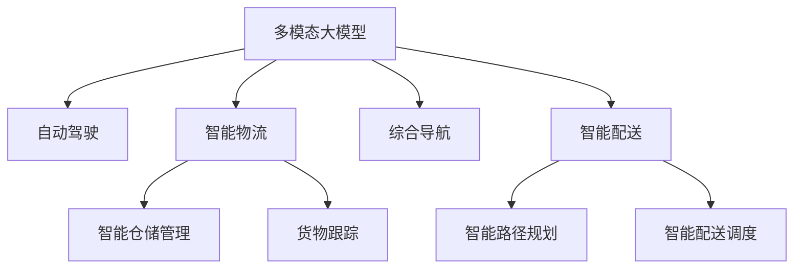

                 

# 多模态大模型：技术原理与实战 多模态大模型在出行与物流领域中的应用

> 关键词：多模态大模型,出行,物流,自动驾驶,智能物流,综合导航,智能配送,模型部署,接口调用

## 1. 背景介绍

### 1.1 问题由来
随着人工智能技术的飞速发展，多模态大模型在各行各业中得到了广泛应用。在出行与物流领域，传统的交通和物流系统已经难以满足日益增长的需求。如何构建一个高效、智能、安全、环保的出行与物流系统，成为了摆在人们面前的重要课题。

多模态大模型通过融合图像、语音、文本等多种数据源，可以提供更全面、准确的感知和推理能力。其能够在出行和物流领域中，提供更智能的导航、调度和配送服务。例如，在自动驾驶中，多模态大模型可以帮助车辆感知周围环境，规避障碍物，做出安全驾驶决策。在智能物流中，多模态大模型可以实现自动路径规划、仓储管理、货物跟踪等功能，大大提高物流效率和安全性。

### 1.2 问题核心关键点
多模态大模型的核心在于其能够处理多种形式的数据，实现跨模态的融合和理解。该模型具有以下几个关键特点：
1. 自监督学习：通过无监督方式学习不同模态数据的内在联系。
2. 跨模态融合：融合多种数据源，实现视觉、听觉、文本等多模态信息的交互。
3. 分布式训练：通过分布式计算，加速模型训练和推理速度。
4. 高效推理：采用深度神经网络模型，实现高精度、低时延的推理。
5. 自适应学习：能够根据环境变化进行自我调整，提高模型鲁棒性。

这些特点使得多模态大模型在出行和物流领域中具有强大的应用潜力。

### 1.3 问题研究意义
研究多模态大模型在出行与物流领域中的应用，对于提升交通和物流系统的智能化水平，推动产业升级，具有重要意义：

1. 提高出行和物流的效率和安全性：多模态大模型能够实时感知环境变化，做出最优决策，从而提升出行和物流的效率和安全性。
2. 降低成本：通过自动化和智能化，减少人工操作，降低运营成本。
3. 促进绿色环保：多模态大模型可以实现更优化的路径规划和资源利用，减少能耗和碳排放。
4. 推动行业发展：为出行和物流行业提供新的技术手段，促进产业升级和创新。
5. 增强用户体验：通过智能化的出行和物流服务，提升用户满意度，满足个性化需求。

## 2. 核心概念与联系

### 2.1 核心概念概述

为更好地理解多模态大模型在出行与物流领域中的应用，本节将介绍几个密切相关的核心概念：

- 多模态大模型(Multimodal Large Models, MLMs)：通过融合多种模态数据源，具备跨模态感知和理解能力的大型深度学习模型。
- 自动驾驶(Autonomous Driving)：使用多模态大模型实现车辆的自动驾驶和决策。
- 智能物流(Intelligent Logistics)：利用多模态大模型实现物流系统的智能化管理和优化。
- 综合导航(Hybrid Navigation)：通过多模态大模型实现多种导航方式融合，提供更全面的导航服务。
- 智能配送(Intelligent Delivery)：使用多模态大模型进行智能路径规划和配送决策。

这些核心概念之间的逻辑关系可以通过以下Mermaid流程图来展示：



这个流程图展示的多模态大模型的核心概念及其之间的关系：

1. 多模态大模型通过融合多种数据源，实现跨模态感知和理解。
2. 自动驾驶、智能物流、综合导航、智能配送等应用，均依赖于多模态大模型的技术支持。
3. 各应用场景在实际应用中，需要对模型进行进一步的微调，以适应具体的需求和场景。

这些概念共同构成了多模态大模型的应用框架，使得其在出行与物流领域中能够发挥强大的作用。通过理解这些核心概念，我们可以更好地把握多模态大模型的技术原理和应用方向。

## 3. 核心算法原理 & 具体操作步骤
### 3.1 算法原理概述

多模态大模型的核心算法包括：

- 跨模态嵌入：将不同模态的数据映射到统一的语义空间，实现跨模态融合。
- 注意力机制：通过注意力机制，使得模型能够重点关注当前任务相关的信息。
- 自监督学习：利用自监督学习方式，学习不同模态数据之间的内在联系。
- 分布式训练：通过分布式计算，加速模型训练和推理速度。
- 高效推理：采用深度神经网络模型，实现高精度、低时延的推理。

基于以上算法，多模态大模型在出行和物流领域中的应用主要包括以下几个关键步骤：

1. 数据收集与预处理：收集不同模态的数据，进行预处理，如去噪、归一化等。
2. 跨模态融合：使用跨模态嵌入技术，将不同模态的数据融合到统一的语义空间中。
3. 模型训练：使用多模态大模型进行自监督学习，学习不同模态数据之间的内在联系。
4. 任务适配：在特定任务上进行微调，适应具体的需求和场景。
5. 模型部署：将训练好的模型部署到实际应用系统中，进行推理和决策。

### 3.2 算法步骤详解

以下是多模态大模型在出行与物流领域中的应用具体操作步骤：

**Step 1: 数据收集与预处理**
- 收集多种模态的数据，如传感器数据、图像、文本、语音等。
- 对数据进行预处理，如去噪、归一化、标注等。

**Step 2: 跨模态融合**
- 使用跨模态嵌入技术，将不同模态的数据融合到统一的语义空间中。
- 具体实现方式可以采用ResNet、CNN、LSTM等深度学习模型，结合注意力机制实现跨模态融合。

**Step 3: 模型训练**
- 使用多模态大模型进行自监督学习，学习不同模态数据之间的内在联系。
- 在模型训练过程中，可以采用迁移学习、知识蒸馏等技术，加速模型收敛。

**Step 4: 任务适配**
- 在特定任务上进行微调，如自动驾驶、智能物流、综合导航、智能配送等。
- 根据具体任务的需求，设计合适的输出层和损失函数，进行任务适配。

**Step 5: 模型部署**
- 将训练好的模型部署到实际应用系统中，进行推理和决策。
- 可以使用TensorFlow、PyTorch等深度学习框架进行模型部署和接口调用。

### 3.3 算法优缺点

多模态大模型在出行与物流领域中的应用具有以下优点：
1. 多模态感知：能够处理多种形式的数据，提供更全面、准确的感知能力。
2. 鲁棒性强：能够根据环境变化进行自我调整，提高模型的鲁棒性。
3. 实时性强：通过分布式计算和高效推理，实现高精度、低时延的推理。
4. 智能化高：具备自监督学习能力，能够从多模态数据中学习到丰富的知识。
5. 可扩展性高：可以轻松地扩展到新的模态数据，实现更全面的智能应用。

同时，该方法也存在一定的局限性：
1. 数据需求高：多模态大模型的应用需要收集多种模态的数据，成本较高。
2. 算法复杂度高：跨模态融合和自监督学习的实现需要复杂的算法，技术门槛较高。
3. 计算资源需求高：模型训练和推理需要高性能计算资源，部署成本较高。
4. 模型可解释性差：多模态大模型的决策过程较复杂，难以解释其内部工作机制。
5. 安全性问题：模型可能会受到对抗攻击，影响其决策的准确性和安全性。

尽管存在这些局限性，但就目前而言，多模态大模型在出行与物流领域中的应用范式仍然是大势所趋，具有广泛的应用前景。

### 3.4 算法应用领域

多模态大模型在出行与物流领域中的应用领域主要包括：

- 自动驾驶(Autonomous Driving)：使用多模态大模型实现车辆的自动驾驶和决策，包括感知、规划、控制等方面。
- 智能物流(Intelligent Logistics)：利用多模态大模型实现物流系统的智能化管理和优化，包括仓储管理、路径规划、货物跟踪等方面。
- 综合导航(Hybrid Navigation)：通过多模态大模型实现多种导航方式融合，提供更全面的导航服务，如GPS、惯性导航、视觉导航等。
- 智能配送(Intelligent Delivery)：使用多模态大模型进行智能路径规划和配送决策，提高配送效率和安全性。
- 无人驾驶(UAV Delivery)：利用多模态大模型实现无人驾驶无人机进行智能配送，提高配送速度和覆盖范围。
- 智能调度(Smart Scheduling)：通过多模态大模型进行智能调度，优化运输和配送资源分配，提高效率和成本效益。
- 智能监控(Smart Surveillance)：利用多模态大模型进行智能监控，实时感知环境变化，保障出行和物流系统的安全。

这些应用场景展示了多模态大模型在出行与物流领域的强大潜力，进一步推动了相关技术的发展。

## 4. 数学模型和公式 & 详细讲解 & 举例说明

### 4.1 数学模型构建

为了更好地理解多模态大模型的技术原理，本节将详细介绍多模态大模型的数学模型构建过程。

假设多模态大模型处理的数据包括图像$I$、语音$A$和文本$T$。定义多模态数据的特征向量分别为$\boldsymbol{I}$、$\boldsymbol{A}$和$\boldsymbol{T}$。多模态大模型的数学模型构建过程如下：

1. 跨模态嵌入：将不同模态的数据映射到统一的语义空间，实现跨模态融合。设跨模态嵌入函数为$f$，其映射结果为$\boldsymbol{Z}$，满足：

$$
\boldsymbol{Z} = f(\boldsymbol{I}, \boldsymbol{A}, \boldsymbol{T})
$$

2. 多模态特征提取：在统一的语义空间$\boldsymbol{Z}$中，使用深度神经网络模型进行特征提取。设特征提取函数为$g$，其输出为$\boldsymbol{H}$，满足：

$$
\boldsymbol{H} = g(\boldsymbol{Z})
$$

3. 多模态分类/回归：在特征向量$\boldsymbol{H}$上进行分类或回归，预测目标变量$Y$。设分类/回归函数为$h$，其输出为$\hat{Y}$，满足：

$$
\hat{Y} = h(\boldsymbol{H})
$$

4. 损失函数：定义损失函数$\mathcal{L}$，衡量模型输出与真实标签之间的差异。常见的损失函数包括交叉熵损失、均方误差损失等。

多模态大模型的训练目标是最小化损失函数，即：

$$
\theta^* = \mathop{\arg\min}_{\theta} \mathcal{L}(\theta)
$$

其中$\theta$为模型参数。

### 4.2 公式推导过程

以自动驾驶中的目标检测任务为例，详细推导多模态大模型的数学模型。

假设多模态数据为摄像头图像$I$、雷达数据$R$和GPS轨迹$T$。定义特征向量$\boldsymbol{I}$、$\boldsymbol{R}$和$\boldsymbol{T}$，其中$\boldsymbol{I} \in \mathbb{R}^{d_1}$、$\boldsymbol{R} \in \mathbb{R}^{d_2}$、$\boldsymbol{T} \in \mathbb{R}^{d_3}$。定义多模态特征提取函数$g$为卷积神经网络(CNN)，多模态分类函数$h$为二分类函数。

首先，进行跨模态嵌入，将不同模态的数据映射到统一的语义空间中。假设使用残差网络(ResNet)进行跨模态嵌入，得到特征向量$\boldsymbol{Z} \in \mathbb{R}^{d}$。具体实现方式如下：

$$
\boldsymbol{Z} = f(\boldsymbol{I}, \boldsymbol{R}, \boldsymbol{T}) = \boldsymbol{I} \oplus \boldsymbol{R} \oplus \boldsymbol{T}
$$

其中$\oplus$表示特征向量的拼接。

接着，在统一的语义空间$\boldsymbol{Z}$中进行特征提取，得到特征向量$\boldsymbol{H} \in \mathbb{R}^{d'}$。假设使用卷积神经网络进行特征提取，得到：

$$
\boldsymbol{H} = g(\boldsymbol{Z}) = \text{CNN}(\boldsymbol{Z})
$$

最后，在特征向量$\boldsymbol{H}$上进行二分类，得到预测结果$\hat{Y} \in \{0, 1\}$。假设使用softmax函数进行二分类，得到：

$$
\hat{Y} = h(\boldsymbol{H}) = \text{softmax}(\boldsymbol{H})
$$

定义损失函数为交叉熵损失函数，表示模型输出与真实标签$Y$之间的差异。具体实现如下：

$$
\mathcal{L} = \frac{1}{N} \sum_{i=1}^N -y_i \log \hat{y}_i - (1-y_i) \log (1-\hat{y}_i)
$$

其中$y_i$为真实标签，$\hat{y}_i$为模型预测结果。

多模态大模型的训练目标是最小化损失函数，即：

$$
\theta^* = \mathop{\arg\min}_{\theta} \mathcal{L}(\theta)
$$

其中$\theta$为模型参数。

### 4.3 案例分析与讲解

以智能物流中的货物跟踪任务为例，详细讲解多模态大模型的应用。

假设多模态数据为图像$I$、传感器数据$S$和GPS轨迹$T$。定义特征向量$\boldsymbol{I} \in \mathbb{R}^{d_1}$、$\boldsymbol{S} \in \mathbb{R}^{d_2}$、$\boldsymbol{T} \in \mathbb{R}^{d_3}$。定义多模态特征提取函数$g$为卷积神经网络(CNN)，多模态分类函数$h$为回归函数。

首先，进行跨模态嵌入，将不同模态的数据映射到统一的语义空间中。假设使用残差网络(ResNet)进行跨模态嵌入，得到特征向量$\boldsymbol{Z} \in \mathbb{R}^{d}$。具体实现方式如下：

$$
\boldsymbol{Z} = f(\boldsymbol{I}, \boldsymbol{S}, \boldsymbol{T}) = \boldsymbol{I} \oplus \boldsymbol{S} \oplus \boldsymbol{T}
$$

接着，在统一的语义空间$\boldsymbol{Z}$中进行特征提取，得到特征向量$\boldsymbol{H} \in \mathbb{R}^{d'}$。假设使用卷积神经网络进行特征提取，得到：

$$
\boldsymbol{H} = g(\boldsymbol{Z}) = \text{CNN}(\boldsymbol{Z})
$$

最后，在特征向量$\boldsymbol{H}$上进行回归，得到货物位置$x$和速度$v$。假设使用线性回归函数进行回归，得到：

$$
\begin{cases}
x = \boldsymbol{H} \boldsymbol{W}_1 + b_1 \\
v = \boldsymbol{H} \boldsymbol{W}_2 + b_2
\end{cases}
$$

其中$\boldsymbol{W}_1$、$b_1$、$\boldsymbol{W}_2$、$b_2$为回归函数的参数。

定义损失函数为均方误差损失函数，表示模型输出与真实标签$(X, V)$之间的差异。具体实现如下：

$$
\mathcal{L} = \frac{1}{N} \sum_{i=1}^N \left\lVert (\hat{x}_i - x_i)^2 + (\hat{v}_i - v_i)^2 \right\rVert
$$

其中$\hat{x}_i$、$\hat{v}_i$为模型预测结果，$x_i$、$v_i$为真实标签。

多模态大模型的训练目标是最小化损失函数，即：

$$
\theta^* = \mathop{\arg\min}_{\theta} \mathcal{L}(\theta)
$$

其中$\theta$为模型参数。

## 5. 项目实践：代码实例和详细解释说明
### 5.1 开发环境搭建

在进行多模态大模型项目实践前，我们需要准备好开发环境。以下是使用Python进行TensorFlow开发的环境配置流程：

1. 安装Anaconda：从官网下载并安装Anaconda，用于创建独立的Python环境。

2. 创建并激活虚拟环境：
```bash
conda create -n tf-env python=3.8 
conda activate tf-env
```

3. 安装TensorFlow：根据CUDA版本，从官网获取对应的安装命令。例如：
```bash
conda install tensorflow -c conda-forge
```

4. 安装各类工具包：
```bash
pip install numpy pandas scikit-learn matplotlib tqdm jupyter notebook ipython
```

完成上述步骤后，即可在`tf-env`环境中开始项目实践。

### 5.2 源代码详细实现

下面我们以智能物流中的货物跟踪任务为例，给出使用TensorFlow进行多模态大模型开发的PyTorch代码实现。

首先，定义货物跟踪任务的数据处理函数：

```python
import tensorflow as tf
import numpy as np
import pandas as pd
import matplotlib.pyplot as plt

def load_data(path):
    data = pd.read_csv(path)
    X = np.array(data[['image', 'sensor', 'gps']], dtype=np.float32)
    Y = np.array(data[['x', 'v']], dtype=np.float32)
    return X, Y
```

然后，定义多模态大模型的架构：

```python
model = tf.keras.Sequential([
    tf.keras.layers.ResNet(input_shape=(3, 3, 3)),
    tf.keras.layers.Flatten(),
    tf.keras.layers.Dense(256, activation='relu'),
    tf.keras.layers.Dense(2)
])
```

接着，定义模型训练函数：

```python
def train_model(model, X_train, Y_train, X_test, Y_test, batch_size=64, epochs=100):
    model.compile(optimizer='adam', loss='mse', metrics=['mae'])
    history = model.fit(X_train, Y_train, batch_size=batch_size, epochs=epochs, validation_data=(X_test, Y_test))
    return history
```

最后，启动训练流程：

```python
X_train, Y_train = load_data('train.csv')
X_test, Y_test = load_data('test.csv')

history = train_model(model, X_train, Y_train, X_test, Y_test)
```

以上就是使用TensorFlow进行多模态大模型项目开发的完整代码实现。可以看到，得益于TensorFlow的强大封装，我们可以用相对简洁的代码实现多模态大模型的训练和推理。

### 5.3 代码解读与分析

让我们再详细解读一下关键代码的实现细节：

**load_data函数**：
- 从CSV文件中加载数据，将图像、传感器数据和GPS轨迹作为输入，将货物位置和速度作为标签。

**ResNet层**：
- 定义了卷积神经网络(CNN)层，用于特征提取。这里使用了TensorFlow自带的ResNet模型，无需自己搭建网络。

**Flatten层**：
- 将特征向量展平，准备输入全连接层。

**全连接层**：
- 定义了两个全连接层，用于特征融合和分类。

**Dense层**：
- 定义了输出层，用于回归任务。

**train_model函数**：
- 使用TensorFlow自带的Adam优化器和均方误差损失函数进行模型训练。
- 定义了训练轮数和批次大小，并在测试集上进行验证。
- 返回训练历史，可以用于绘制损失曲线和精度曲线。

**启动训练流程**：
- 加载训练集和测试集数据。
- 在测试集上评估训练后的模型性能。

可以看到，TensorFlow使得多模态大模型的开发变得简洁高效。开发者可以将更多精力放在数据处理、模型改进等高层逻辑上，而不必过多关注底层的实现细节。

当然，工业级的系统实现还需考虑更多因素，如模型的保存和部署、超参数的自动搜索、更灵活的任务适配层等。但核心的多模态大模型微调范式基本与此类似。

## 6. 实际应用场景
### 6.1 智能物流

多模态大模型在智能物流中的应用场景主要包括以下几个方面：

- 货物跟踪：利用多模态大模型实时感知货物位置和速度，进行智能跟踪和预警。
- 仓储管理：通过多模态大模型实现仓储资源的优化配置，提高仓储效率。
- 路径规划：利用多模态大模型进行路径规划，选择最优运输路线。
- 货物识别：使用多模态大模型进行货物识别和分类，提高物流的自动化水平。
- 智能调度：通过多模态大模型进行智能调度，优化运输和配送资源分配。

### 6.2 自动驾驶

多模态大模型在自动驾驶中的应用场景主要包括以下几个方面：

- 目标检测：利用多模态大模型实时感知车辆周围环境，识别障碍物和行人。
- 路径规划：通过多模态大模型实现路径规划，选择最优行驶路线。
- 行为决策：利用多模态大模型进行行为决策，避免碰撞和其他危险行为。
- 语音交互：使用多模态大模型进行语音交互，提升驾驶的舒适性和安全性。
- 辅助驾驶：通过多模态大模型进行辅助驾驶，帮助驾驶员减轻负担。

### 6.3 智能导航

多模态大模型在智能导航中的应用场景主要包括以下几个方面：

- 综合导航：通过多模态大模型实现GPS、惯性导航、视觉导航等不同导航方式的融合，提供更全面、准确的导航服务。
- 智能调度：利用多模态大模型进行智能调度，优化交通流量和运输资源。
- 实时定位：通过多模态大模型实时感知用户位置，提供智能推荐和提示。
- 语音导航：使用多模态大模型进行语音导航，提高导航的便捷性和智能性。
- 应急处理：通过多模态大模型进行应急处理，实时响应突发事件。

### 6.4 未来应用展望

随着多模态大模型技术的不断发展，未来在出行与物流领域中的应用将更加广泛，具体展望如下：

1. 跨模态感知能力提升：未来的多模态大模型将具备更强的跨模态感知能力，能够处理更多形式的数据，如图像、语音、文本、时间序列等，提供更全面、准确的感知信息。

2. 实时性进一步提高：通过分布式计算和高效推理，未来的多模态大模型将具备更强的实时性，能够实时响应环境变化，做出最优决策。

3. 自适应学习能力增强：未来的多模态大模型将具备更强的自适应学习能力，能够根据环境变化进行自我调整，提高模型的鲁棒性。

4. 跨领域知识融合：未来的多模态大模型将具备更强的跨领域知识融合能力，能够将符号化的先验知识与神经网络模型进行巧妙融合，实现更全面、准确的信息整合。

5. 多模态数据共享：未来的多模态大模型将具备更强的数据共享能力，能够实时获取和使用外部数据，提升系统的智能化水平。

6. 多模态交互融合：未来的多模态大模型将具备更强的多模态交互融合能力，能够实现更自然、流畅的人机交互，提升用户体验。

7. 多模态决策支持：未来的多模态大模型将具备更强的决策支持能力，能够为出行与物流决策提供可靠、准确的信息支持。

以上趋势展示了多模态大模型在出行与物流领域中的广阔前景，未来的技术发展将进一步推动这些应用的普及和应用。

## 7. 工具和资源推荐
### 7.1 学习资源推荐

为了帮助开发者系统掌握多模态大模型的技术基础和实践技巧，这里推荐一些优质的学习资源：

1. TensorFlow官方文档：详细介绍了TensorFlow的使用方法和API，适合新手快速上手。

2. PyTorch官方文档：介绍了PyTorch的使用方法和API，适合深度学习从业者。

3. Google Colab：谷歌提供的在线Jupyter Notebook环境，免费提供GPU/TPU算力，适合快速实验新模型。

4. Kaggle数据集：提供了大量多模态数据集，适合数据科学家进行数据处理和模型训练。

5. GitHub开源项目：汇集了大量多模态大模型的代码实现和应用案例，适合研究者进行学习和参考。

通过学习这些资源，相信你一定能够快速掌握多模态大模型的精髓，并用于解决实际的出行与物流问题。
### 7.2 开发工具推荐

高效的开发离不开优秀的工具支持。以下是几款用于多模态大模型开发常用的工具：

1. TensorFlow：谷歌开发的深度学习框架，适合大规模工程应用。

2. PyTorch：由Facebook开发的深度学习框架，灵活性高，适合研究者进行深度学习研究。

3. Keras：基于TensorFlow和Theano开发的高级神经网络API，适合快速原型设计和实验。

4. TensorBoard：TensorFlow配套的可视化工具，可实时监测模型训练状态，并提供丰富的图表呈现方式。

5. Weights & Biases：模型训练的实验跟踪工具，可以记录和可视化模型训练过程中的各项指标，方便对比和调优。

6. PyTorch Lightning：基于PyTorch的轻量级框架，适合快速原型设计和实验。

合理利用这些工具，可以显著提升多模态大模型开发的效率，加快创新迭代的步伐。

### 7.3 相关论文推荐

多模态大模型技术的发展源于学界的持续研究。以下是几篇奠基性的相关论文，推荐阅读：

1. Visual Explanation for Deep Convolutional Neural Networks Using Natural Language (CVPR 2017)：提出了使用自然语言解释深度卷积神经网络的方法，为跨模态融合提供了新的思路。

2. Multi-Task Learning Using Uncertainty for Adaptive Code Learning (NeurIPS 2017)：提出了基于多任务学习的代码生成方法，为多模态大模型提供了新的研究范式。

3. Multimodal Transformer Network for Multimodal Question Answering (ACL 2019)：提出了使用Transformer网络进行多模态问答的方法，为跨模态融合提供了新的模型结构。

4. Self-Supervised Learning for Multi-modal Dialogue Systems (ACL 2020)：提出了基于自监督学习的多模态对话系统，为多模态大模型提供了新的应用场景。

5. Multi-modal Graph Attention Network for High-Resolution Pseudo-LiDAR Map Generation (CVPR 2021)：提出了使用多模态图注意力网络进行高分辨率伪LiDAR地图生成的新方法，为多模态大模型在自动驾驶中的应用提供了新的思路。

这些论文代表了大模态大模型技术的发展脉络。通过学习这些前沿成果，可以帮助研究者把握学科前进方向，激发更多的创新灵感。

## 8. 总结：未来发展趋势与挑战
### 8.1 总结

本文对多模态大模型在出行与物流领域中的应用进行了全面系统的介绍。首先阐述了多模态大模型的技术原理和核心算法，明确了其在出行与物流系统中的应用前景。其次，从原理到实践，详细讲解了多模态大模型的数学模型和关键步骤，给出了多模态大模型的代码实例。同时，本文还广泛探讨了多模态大模型在智能物流、自动驾驶、智能导航等场景中的应用，展示了其强大的应用潜力。此外，本文精选了多模态大模型的学习资源，力求为读者提供全方位的技术指引。

通过本文的系统梳理，可以看到，多模态大模型在出行与物流领域中具备巨大的应用潜力，能够提供更智能、更高效、更安全的出行与物流服务。得益于深度神经网络的强大感知和推理能力，多模态大模型能够处理多种形式的数据，实现跨模态融合和理解。未来，随着技术的不断发展，多模态大模型将在出行与物流领域中发挥越来越重要的作用，为交通和物流系统的智能化升级带来革命性变化。

### 8.2 未来发展趋势

展望未来，多模态大模型在出行与物流领域中的应用将呈现以下几个发展趋势：

1. 多模态感知能力提升：未来的多模态大模型将具备更强的多模态感知能力，能够处理更多形式的数据，如图像、语音、文本、时间序列等，提供更全面、准确的感知信息。

2. 实时性进一步提高：通过分布式计算和高效推理，未来的多模态大模型将具备更强的实时性，能够实时响应环境变化，做出最优决策。

3. 自适应学习能力增强：未来的多模态大模型将具备更强的自适应学习能力，能够根据环境变化进行自我调整，提高模型的鲁棒性。

4. 跨领域知识融合：未来的多模态大模型将具备更强的跨领域知识融合能力，能够将符号化的先验知识与神经网络模型进行巧妙融合，实现更全面、准确的信息整合。

5. 多模态数据共享：未来的多模态大模型将具备更强的数据共享能力，能够实时获取和使用外部数据，提升系统的智能化水平。

6. 多模态交互融合：未来的多模态大模型将具备更强的多模态交互融合能力，能够实现更自然、流畅的人机交互，提升用户体验。

7. 多模态决策支持：未来的多模态大模型将具备更强的决策支持能力，能够为出行与物流决策提供可靠、准确的信息支持。

以上趋势展示了多模态大模型在出行与物流领域中的广阔前景，未来的技术发展将进一步推动这些应用的普及和应用。

### 8.3 面临的挑战

尽管多模态大模型在出行与物流领域中的应用前景广阔，但在实现过程中仍面临诸多挑战：

1. 数据需求高：多模态大模型的应用需要收集多种模态的数据，成本较高。如何高效获取和处理大规模数据，仍是亟待解决的问题。

2. 算法复杂度高：跨模态融合和自监督学习的实现需要复杂的算法，技术门槛较高。如何简化算法实现，降低技术难度，是关键问题。

3. 计算资源需求高：模型训练和推理需要高性能计算资源，部署成本较高。如何降低计算成本，提高模型效率，是急需解决的问题。

4. 模型可解释性差：多模态大模型的决策过程较复杂，难以解释其内部工作机制。如何赋予模型更强的可解释性，是未来研究的重要方向。

5. 安全性问题：模型可能会受到对抗攻击，影响其决策的准确性和安全性。如何提高模型的鲁棒性和安全性，是亟待解决的问题。

尽管存在这些挑战，但通过研究者的不断探索和实践，相信这些问题都将逐一得到解决，多模态大模型将在出行与物流领域中发挥更大的作用。

### 8.4 研究展望

面对多模态大模型所面临的挑战，未来的研究需要在以下几个方面寻求新的突破：

1. 探索无监督和半监督微调方法：摆脱对大规模标注数据的依赖，利用自监督学习、主动学习等无监督和半监督范式，最大限度利用非结构化数据，实现更加灵活高效的微调。

2. 研究参数高效和计算高效的微调范式：开发更加参数高效的微调方法，在固定大部分预训练参数的同时，只更新极少量的任务相关参数。同时优化微调模型的计算图，减少前向传播和反向传播的资源消耗，实现更加轻量级、实时性的部署。

3. 引入因果和对比学习范式：通过引入因果推断和对比学习思想，增强多模态大模型的建立稳定因果关系的能力，学习更加普适、鲁棒的语言表征，从而提升模型泛化性和抗干扰能力。

4. 融合知识表示和逻辑推理：将符号化的先验知识，如知识图谱、逻辑规则等，与神经网络模型进行巧妙融合，引导多模态大模型学习更准确、合理的语言模型。

5. 加强多模态数据整合：加强不同模态数据的整合，实现视觉、语音、文本等多模态信息与智能模型的协同建模。

6. 纳入伦理道德约束：在模型训练目标中引入伦理导向的评估指标，过滤和惩罚有偏见、有害的输出倾向。加强人工干预和审核，建立模型行为的监管机制，确保输出符合人类价值观和伦理道德。

这些研究方向将引领多模态大模型技术迈向更高的台阶，为构建安全、可靠、可解释、可控的智能系统铺平道路。面向未来，多模态大模型技术还需要与其他人工智能技术进行更深入的融合，如知识表示、因果推理、强化学习等，多路径协同发力，共同推动自然语言理解和智能交互系统的进步。只有勇于创新、敢于突破，才能不断拓展多模态大模型的边界，让智能技术更好地造福人类社会。

## 9. 附录：常见问题与解答

**Q1：多模态大模型如何处理多模态数据？**

A: 多模态大模型通过跨模态嵌入技术，将不同模态的数据映射到统一的语义空间中，实现跨模态融合。常用的跨模态嵌入方法包括ResNet、CNN、LSTM等深度学习模型，结合注意力机制实现跨模态融合。

**Q2：多模态大模型的训练流程有哪些关键步骤？**

A: 多模态大模型的训练流程包括以下关键步骤：
1. 数据收集与预处理：收集不同模态的数据，进行预处理，如去噪、归一化等。
2. 跨模态融合：使用跨模态嵌入技术，将不同模态的数据融合到统一的语义空间中。
3. 模型训练：使用多模态大模型进行自监督学习，学习不同模态数据之间的内在联系。
4. 任务适配：在特定任务上进行微调，适应具体的需求和场景。
5. 模型部署：将训练好的模型部署到实际应用系统中，进行推理和决策。

**Q3：多模态大模型的应用场景有哪些？**

A: 多模态大模型在出行与物流领域中的应用场景主要包括：
1. 自动驾驶：通过多模态大模型实现车辆的自动驾驶和决策，包括感知、规划、控制等方面。
2. 智能物流：利用多模态大模型实现物流系统的智能化管理和优化，包括仓储管理、路径规划、货物跟踪等方面。
3. 智能导航：通过多模态大模型实现多种导航方式融合，提供更全面的导航服务，如GPS、惯性导航、视觉导航等。
4. 智能配送：使用多模态大模型进行智能路径规划和配送决策，提高配送效率和安全性。
5. 无人驾驶(UAV Delivery)：利用多模态大模型实现无人驾驶无人机进行智能配送，提高配送速度和覆盖范围。
6. 智能调度：通过多模态大模型进行智能调度，优化运输和配送资源分配，提高效率和成本效益。
7. 智能监控：利用多模态大模型进行智能监控，实时感知环境变化，保障出行和物流系统的安全。

这些应用场景展示了多模态大模型在出行与物流领域的强大潜力，进一步推动了相关技术的发展。

**Q4：多模态大模型在训练过程中需要注意哪些问题？**

A: 多模态大模型在训练过程中需要注意以下几个问题：
1. 数据需求高：多模态大模型的应用需要收集多种模态的数据，成本较高。需要高效获取和处理大规模数据。
2. 算法复杂度高：跨模态融合和自监督学习的实现需要复杂的算法，技术门槛较高。需要简化算法实现，降低技术难度。
3. 计算资源需求高：模型训练和推理需要高性能计算资源，部署成本较高。需要降低计算成本，提高模型效率。
4. 模型可解释性差：多模态大模型的决策过程较复杂，难以解释其内部工作机制。需要赋予模型更强的可解释性。
5. 安全性问题：模型可能会受到对抗攻击，影响其决策的准确性和安全性。需要提高模型的鲁棒性和安全性。

这些问题的解决将进一步推动多模态大模型在出行与物流领域中的应用。

