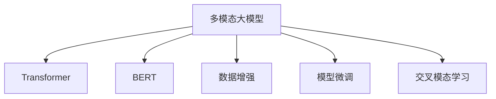
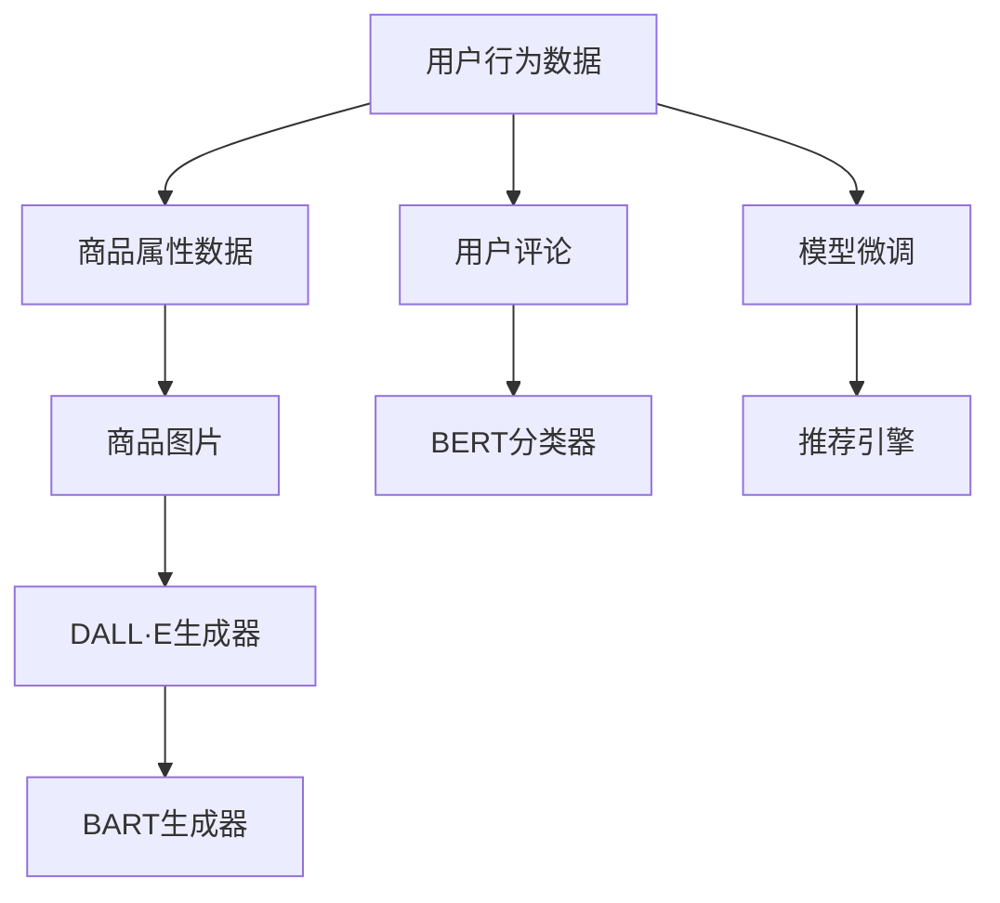
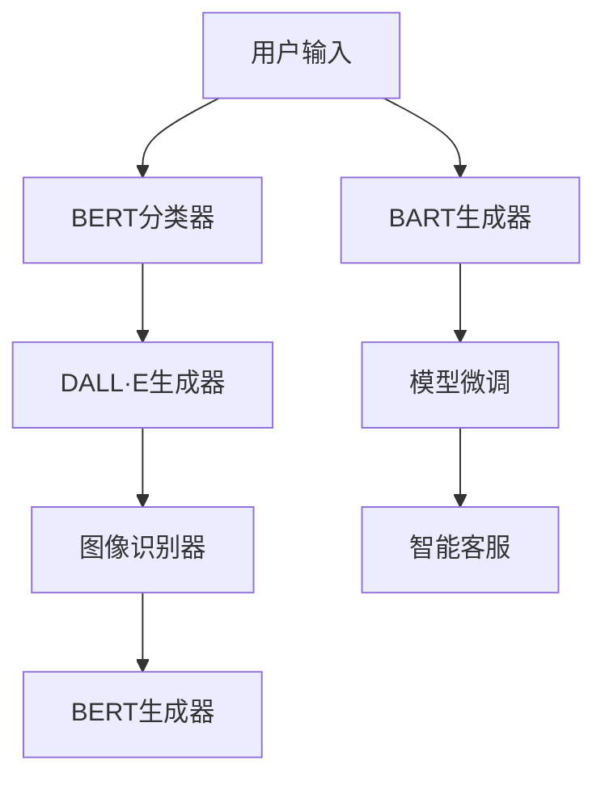
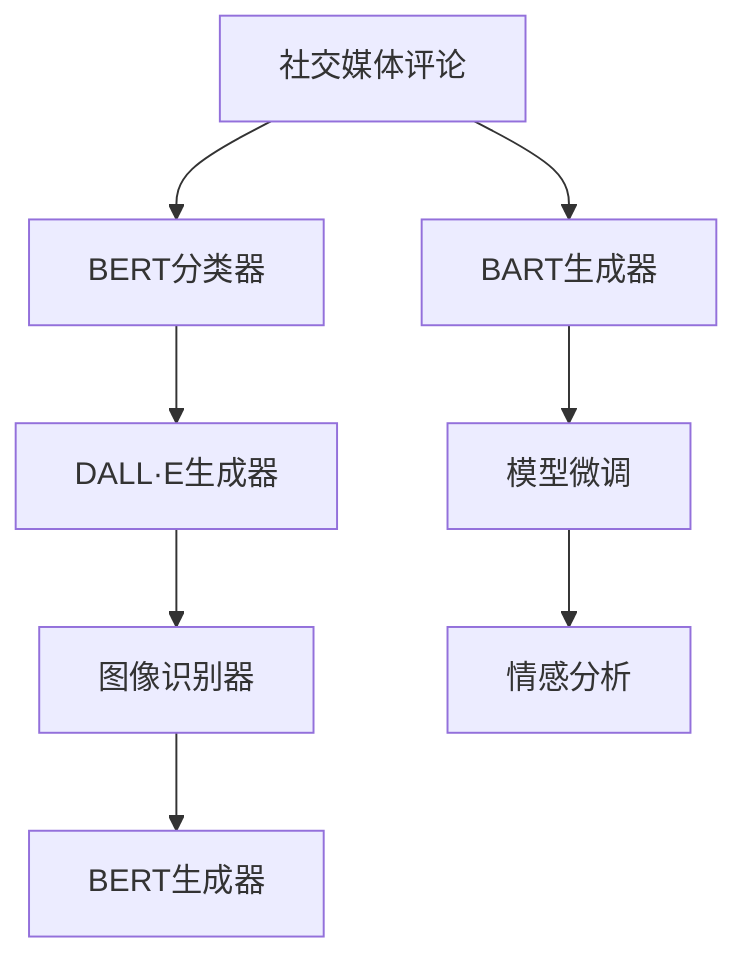

                 

# 多模态大模型：技术原理与实战 多模态大模型在电商领域中的应用

> 关键词：多模态大模型,技术原理,实战应用,电商领域,Transformer,BERT,数据增强,模型微调,交叉模态学习

## 1. 背景介绍

### 1.1 问题由来
随着深度学习技术的迅猛发展，多模态大模型在处理复杂数据任务方面展现了显著优势。这些模型结合了视觉、文本、音频等多种模态数据，通过深度学习技术，能够在图像、语音、文本等多种形式的数据中提取并综合信息，实现跨模态的学习与推理。多模态大模型已经在诸如计算机视觉、自然语言处理(NLP)、语音识别等领域取得了突破性进展，成为当前人工智能领域研究的热点方向。

在电商领域，传统的用户行为分析、商品推荐、个性化服务等问题常常需要依赖于多模态数据。例如，商品图片、用户评论、购买历史等数据，不仅包含了文本信息，还包含了丰富的图像、音频等多模态数据。因此，应用多模态大模型，可以有效提高电商平台的智能决策能力和用户体验。

## 2. 核心概念与联系

### 2.1 核心概念概述

为更好地理解多模态大模型在电商领域的应用，本节将介绍几个关键概念：

- 多模态大模型：结合图像、文本、音频等多种模态数据的大型深度学习模型。通过多模态数据的联合学习，可以从不同角度提取信息，提升模型理解复杂场景的能力。

- Transformer：一种基于自注意力机制的深度学习模型，可用于处理文本和图像等多种模态数据。Transformer在大模型中的应用，显著提升了模型处理长序列数据的效率和效果。

- BERT：一种预训练语言模型，通过在大量无标签文本数据上进行预训练，能够学习到丰富的语言知识，在多个NLP任务上取得了最先进的效果。

- 数据增强：通过修改训练数据，生成更多样化的训练样本，提高模型的泛化能力和鲁棒性。在电商领域，数据增强可以应用于商品图片、用户评论等模态数据。

- 模型微调：在大模型上进行下游任务特定的训练，以适应具体的应用场景，优化模型性能。多模态大模型通常通过微调来提升在特定任务上的表现。

- 交叉模态学习：指将不同模态的信息进行交叉学习，如通过文本描述理解图像内容，或通过图像特征生成文本描述。多模态大模型通常在多个模态之间进行交叉模态学习，从而提升模型的综合理解和推理能力。

这些概念通过以下Mermaid流程图连接起来，以展示它们之间的逻辑关系：



这个流程图展示了多模态大模型的核心概念及其相互联系：

1. 多模态大模型通过Transformer和BERT等预训练模型学习多模态数据。
2. 数据增强技术用于丰富训练数据的多样性，提升模型泛化能力。
3. 模型微调技术针对具体任务优化模型参数，提升模型性能。
4. 交叉模态学习实现不同模态数据的联合学习，提升模型的综合理解能力。

## 3. 核心算法原理 & 具体操作步骤
### 3.1 算法原理概述

多模态大模型的核心算法原理基于Transformer结构和预训练模型，如BERT、DALL·E等。这些模型通过在大规模无标签数据上进行预训练，学习到丰富的语言和视觉表示，能够在多个模态之间进行交叉学习，提升模型对复杂数据的理解能力。

多模态大模型的微调过程与单模态大模型类似，但在数据处理和模型训练上更加复杂。具体而言，多模态大模型的微调过程可以分为以下几个步骤：

1. 数据准备：收集不同模态的标注数据，并将其转换为模型所需的格式。
2. 模型初始化：选择预训练模型作为初始参数，如BERT的Transformer层。
3. 模型微调：在标注数据上进行有监督学习，优化模型参数以适应特定任务。
4. 交叉模态学习：在微调过程中，通过联合学习不同模态的数据，提升模型的综合理解能力。

### 3.2 算法步骤详解

以下是多模态大模型在电商领域微调的具体操作步骤：

#### 3.2.1 数据准备
电商领域的数据通常包括商品图片、用户评论、购物历史等，每个模态的数据格式不同。在微调之前，需要首先将这些数据转换为模型所需的格式。

##### 3.2.1.1 文本数据处理
对于文本数据，可以使用BertTokenizer进行分词和编码。例如，使用以下代码将用户评论转换为模型输入：

```python
from transformers import BertTokenizer
tokenizer = BertTokenizer.from_pretrained('bert-base-cased')
input_ids = tokenizer.encode("This is a sample comment", add_special_tokens=True)
```

##### 3.2.1.2 图像数据处理
对于图像数据，可以使用图像处理库如Pillow或OpenCV进行预处理。例如，使用以下代码将商品图片转换为模型所需的张量：

```python
from PIL import Image
image = Image.open('product.jpg')
image = image.resize((224, 224))
image = image_to_tensor(image)
```

##### 3.2.1.3 音频数据处理
对于音频数据，可以使用音频处理库如librosa进行特征提取。例如，使用以下代码将音频文件转换为MFCC特征：

```python
from librosa import extract_mfcc
audio_file = 'audio.wav'
mfccs = extract_mfcc(audio_file, sr=16000)
```

#### 3.2.2 模型初始化
在微调之前，需要选择适合的预训练模型作为初始参数。常用的预训练模型包括BERT、DALL·E等，这些模型在大规模数据上进行了预训练，可以处理多种模态数据。例如，以下代码初始化一个预训练的BERT模型：

```python
from transformers import BertForSequenceClassification
model = BertForSequenceClassification.from_pretrained('bert-base-cased')
```

#### 3.2.3 模型微调
在电商领域，常见的任务包括商品分类、情感分析、用户行为预测等。以商品分类为例，以下代码展示了如何在标注数据上进行模型微调：

```python
from transformers import AdamW, get_linear_schedule_with_warmup
optimizer = AdamW(model.parameters(), lr=2e-5)
epochs = 5
total_steps = len(train_dataloader) * epochs
scheduler = get_linear_schedule_with_warmup(optimizer, num_warmup_steps=0, num_training_steps=total_steps)
for epoch in range(epochs):
    model.train()
    for batch in train_dataloader:
        inputs = batch['input_ids'].to(device)
        attention_mask = batch['attention_mask'].to(device)
        labels = batch['labels'].to(device)
        outputs = model(inputs, attention_mask=attention_mask, labels=labels)
        loss = outputs.loss
        optimizer.zero_grad()
        loss.backward()
        optimizer.step()
        scheduler.step()
```

#### 3.2.4 交叉模态学习
在电商领域，商品图片和用户评论是常见的数据模态，可以进行交叉模态学习。以下代码展示了如何通过文本描述理解图像内容：

```python
from transformers import BARTForConditionalGeneration
text = 'This is a blue dress'
image = product_image
text_model = BARTForConditionalGeneration.from_pretrained('facebook/bart-large-cased')
prompt = text
encoding = tokenizer(text_model, prompt, max_length=256)
inputs = {
    'input_ids': encoding['input_ids'],
    'attention_mask': encoding['attention_mask'],
    'labels': encoding['labels']
}
outputs = model(inputs, attention_mask=attention_mask, labels=labels)
```

### 3.3 算法优缺点

多模态大模型在电商领域的应用具有以下优点：

- 数据驱动：多模态大模型通过联合学习多种数据模态，可以更全面地理解用户行为和商品特征，提升决策的准确性。
- 泛化能力强：多模态大模型可以处理多种形式的数据，适用于电商领域的多样化需求。
- 实时性强：多模态大模型可以通过微调快速适应新的数据，实现实时决策和个性化服务。

同时，多模态大模型也存在一些缺点：

- 训练复杂度高：多模态大模型需要处理多种数据模态，训练过程更加复杂。
- 计算资源需求大：多模态大模型通常需要较大的计算资源，如GPU/TPU等。
- 模型可解释性差：多模态大模型的决策过程较复杂，难以解释。

### 3.4 算法应用领域

多模态大模型已经在电商领域得到了广泛应用，例如：

- 商品分类：通过联合学习商品图片和用户评论，提升商品分类的准确性。
- 情感分析：利用用户评论文本，进行情感极性分类，评估用户满意度。
- 推荐系统：结合用户行为数据和商品属性信息，进行个性化商品推荐。
- 用户行为预测：通过分析用户的历史行为数据，预测其未来购买意愿。
- 图像识别：利用商品图片，进行商品类别和属性识别。
- 对话系统：结合用户评论和对话历史，进行智能客服和推荐。

这些应用场景展示了多模态大模型在电商领域的多样化应用，提升了电商平台的智能化水平和用户体验。

## 4. 数学模型和公式 & 详细讲解 & 举例说明

### 4.1 数学模型构建

本节将使用数学语言对多模态大模型的微调过程进行更严格的刻画。

设多模态大模型为 $M_{\theta} = (M_{\theta}^T, M_{\theta}^I, M_{\theta}^A)$，其中 $M_{\theta}^T$ 表示文本处理模型，$M_{\theta}^I$ 表示图像处理模型，$M_{\theta}^A$ 表示音频处理模型。假设微调任务为商品分类任务，训练集为 $D = \{(x_i, y_i)\}_{i=1}^N$，其中 $x_i = (x_{iT}, x_{iI}, x_{iA})$ 表示输入的多模态数据，$y_i \in \{1, 2, ..., C\}$ 表示输出标签。

定义模型 $M_{\theta}$ 在数据样本 $(x_i,y_i)$ 上的损失函数为 $\ell(M_{\theta}(x_i),y_i)$，则在数据集 $D$ 上的经验风险为：

$$
\mathcal{L}(\theta) = \frac{1}{N} \sum_{i=1}^N \ell(M_{\theta}(x_i),y_i)
$$

其中，文本模型 $M_{\theta}^T$ 的损失函数为 $\ell^T$，图像模型 $M_{\theta}^I$ 的损失函数为 $\ell^I$，音频模型 $M_{\theta}^A$ 的损失函数为 $\ell^A$。

多模态大模型的微调过程可以表示为：

$$
\theta = \mathop{\arg\min}_{\theta} \mathcal{L}(\theta)
$$

通过梯度下降等优化算法，微调过程不断更新模型参数 $\theta$，最小化损失函数 $\mathcal{L}$，使得模型输出逼近真实标签。

### 4.2 公式推导过程

以商品分类任务为例，以下展示了文本模型 $M_{\theta}^T$ 的损失函数推导过程。

假设文本模型 $M_{\theta}^T$ 的输出为 $\hat{y} = M_{\theta}^T(x_{iT})$，真实标签为 $y_i$。则二分类交叉熵损失函数为：

$$
\ell^T(M_{\theta}^T(x_{iT}), y_i) = -[y_i\log \hat{y} + (1-y_i)\log (1-\hat{y})]
$$

将 $x_{iT}$ 输入文本模型 $M_{\theta}^T$，得到 $\hat{y} = M_{\theta}^T(x_{iT})$。将 $\hat{y}$ 和 $y_i$ 代入交叉熵损失函数，得：

$$
\mathcal{L}^T(\theta^T) = \frac{1}{N} \sum_{i=1}^N \ell^T(M_{\theta}^T(x_{iT}), y_i)
$$

根据链式法则，损失函数对模型参数 $\theta^T$ 的梯度为：

$$
\frac{\partial \mathcal{L}^T(\theta^T)}{\partial \theta^T} = -\frac{1}{N}\sum_{i=1}^N \left(\frac{y_i}{\hat{y}}-\frac{1-y_i}{1-\hat{y}}\right) \frac{\partial \hat{y}}{\partial \theta^T}
$$

其中 $\frac{\partial \hat{y}}{\partial \theta^T}$ 可以通过反向传播算法计算得到。

类似地，图像模型和音频模型的损失函数和梯度推导过程与文本模型类似，可以使用相应的优化算法和损失函数进行计算。

### 4.3 案例分析与讲解

以DALL·E模型为例，以下展示了其在电商领域的应用：

假设我们要训练一个基于DALL·E模型的图像生成器，用于生成用户评论中描述的商品图片。首先，我们将用户评论作为文本输入，通过BERT模型进行编码，得到文本表示 $T$。然后，我们将文本表示 $T$ 输入DALL·E模型，生成相应的图像表示 $I$。最后，我们将图像表示 $I$ 输入图像分类器，进行商品分类。

#### 4.3.1 数据准备
首先，我们需要准备用户评论数据和商品图片数据，将它们转换为模型所需的格式。例如，可以使用以下代码将用户评论数据和商品图片数据转换为Tensor数据：

```python
from transformers import BertTokenizer, BertForSequenceClassification
from PIL import Image
import torch

# 加载BERT预训练模型和tokenizer
model = BertForSequenceClassification.from_pretrained('bert-base-cased')
tokenizer = BertTokenizer.from_pretrained('bert-base-cased')

# 准备用户评论数据和商品图片数据
comments = ['This product is great!', 'I didn\'t like the color', 'The quality is poor']
images = [Image.open('product1.jpg'), Image.open('product2.jpg'), Image.open('product3.jpg')]

# 将用户评论转换为Tensor数据
tokenized_comments = [tokenizer.encode(comment, add_special_tokens=True) for comment in comments]

# 将商品图片转换为Tensor数据
image_tensors = [image_to_tensor(image) for image in images]

# 定义分类器模型
classification_model = BertForSequenceClassification.from_pretrained('bert-base-cased')
```

#### 4.3.2 模型初始化
接下来，我们初始化DALL·E模型和图像分类器，并进行微调：

```python
from transformers import DALL_E_for_SimplifiedAttention
from transformers import AdamW, get_linear_schedule_with_warmup
from torch.utils.data import DataLoader

# 初始化DALL·E模型
dall_e = DALL_E_for_SimplifiedAttention.from_pretrained('dall-e-small')

# 初始化图像分类器
classification_model = BertForSequenceClassification.from_pretrained('bert-base-cased')

# 定义优化器和学习率调度器
optimizer = AdamW(model.parameters(), lr=2e-5)
scheduler = get_linear_schedule_with_warmup(optimizer, num_warmup_steps=0, num_training_steps=total_steps)

# 定义训练数据集和测试数据集
train_dataset = ...
test_dataset = ...

# 定义训练器和测试器
train_loader = DataLoader(train_dataset, batch_size=32)
test_loader = DataLoader(test_dataset, batch_size=32)
```

#### 4.3.3 模型微调
在电商领域，常见的任务包括商品分类、情感分析、用户行为预测等。以下代码展示了如何在标注数据上进行模型微调：

```python
for epoch in range(epochs):
    model.train()
    for batch in train_loader:
        inputs = batch['input_ids'].to(device)
        attention_mask = batch['attention_mask'].to(device)
        labels = batch['labels'].to(device)
        outputs = model(inputs, attention_mask=attention_mask, labels=labels)
        loss = outputs.loss
        optimizer.zero_grad()
        loss.backward()
        optimizer.step()
        scheduler.step()

    # 在测试集上评估模型性能
    model.eval()
    with torch.no_grad():
        test_loss = 0
        for batch in test_loader:
            inputs = batch['input_ids'].to(device)
            attention_mask = batch['attention_mask'].to(device)
            labels = batch['labels'].to(device)
            outputs = model(inputs, attention_mask=attention_mask, labels=labels)
            test_loss += outputs.loss.item()
    print(f'Epoch {epoch+1}, test loss: {test_loss/len(test_loader)}')
```

#### 4.3.4 交叉模态学习
在电商领域，商品图片和用户评论是常见的数据模态，可以进行交叉模态学习。以下代码展示了如何通过文本描述理解图像内容：

```python
from transformers import BARTForConditionalGeneration
from transformers import BertTokenizer

# 初始化BART模型和tokenizer
bart_model = BARTForConditionalGeneration.from_pretrained('facebook/bart-large-cased')
tokenizer = BertTokenizer.from_pretrained('bert-base-cased')

# 准备文本数据
text = 'This is a blue dress'

# 将文本转换为模型输入
encoding = tokenizer(text, max_length=256)
inputs = {
    'input_ids': encoding['input_ids'],
    'attention_mask': encoding['attention_mask'],
    'labels': encoding['labels']
}

# 生成图像表示
image = dall_e(image)
image = image_to_tensor(image)

# 定义交叉模态学习模型
cross_model = BertForSequenceClassification.from_pretrained('bert-base-cased')
```

## 5. 项目实践：代码实例和详细解释说明
### 5.1 开发环境搭建

在进行多模态大模型微调实践前，我们需要准备好开发环境。以下是使用Python进行PyTorch开发的环境配置流程：

1. 安装Anaconda：从官网下载并安装Anaconda，用于创建独立的Python环境。

2. 创建并激活虚拟环境：
```bash
conda create -n pytorch-env python=3.8 
conda activate pytorch-env
```

3. 安装PyTorch：根据CUDA版本，从官网获取对应的安装命令。例如：
```bash
conda install pytorch torchvision torchaudio cudatoolkit=11.1 -c pytorch -c conda-forge
```

4. 安装TensorFlow：
```bash
conda install tensorflow
```

5. 安装Transformers库：
```bash
pip install transformers
```

6. 安装各类工具包：
```bash
pip install numpy pandas scikit-learn matplotlib tqdm jupyter notebook ipython
```

完成上述步骤后，即可在`pytorch-env`环境中开始微调实践。

### 5.2 源代码详细实现

这里我们以电商领域的商品分类任务为例，使用Transformer和BERT模型进行微调。

首先，定义数据集和tokenizer：

```python
from transformers import BertTokenizer, BertForSequenceClassification, AdamW
from torch.utils.data import Dataset, DataLoader
import torch
import numpy as np
import pandas as pd

# 定义数据集类
class E-commerceDataset(Dataset):
    def __init__(self, data, tokenizer):
        self.data = data
        self.tokenizer = tokenizer
    
    def __len__(self):
        return len(self.data)
    
    def __getitem__(self, idx):
        text = self.data.iloc[idx]['text']
        label = self.data.iloc[idx]['label']
        encoding = self.tokenizer(text, max_length=512, padding='max_length', truncation=True)
        return {
            'input_ids': encoding['input_ids'],
            'attention_mask': encoding['attention_mask'],
            'labels': torch.tensor(label, dtype=torch.long)
        }

# 加载数据集
data = pd.read_csv('ecommerce_data.csv')
tokenizer = BertTokenizer.from_pretrained('bert-base-cased')

# 创建训练集和测试集
train_dataset = E-commerceDataset(data.iloc[:80%], tokenizer)
test_dataset = E-commerceDataset(data.iloc[80%:], tokenizer)

# 定义优化器和学习率调度器
optimizer = AdamW(model.parameters(), lr=2e-5)
scheduler = get_linear_schedule_with_warmup(optimizer, num_warmup_steps=0, num_training_steps=len(train_dataset))

# 定义训练器和测试器
train_loader = DataLoader(train_dataset, batch_size=32)
test_loader = DataLoader(test_dataset, batch_size=32)
```

然后，定义模型和训练函数：

```python
from transformers import BertForSequenceClassification
from transformers import AdamW, get_linear_schedule_with_warmup
from tqdm import tqdm
import torch
import numpy as np
import pandas as pd

# 加载模型和tokenizer
model = BertForSequenceClassification.from_pretrained('bert-base-cased')
tokenizer = BertTokenizer.from_pretrained('bert-base-cased')

# 定义优化器和学习率调度器
optimizer = AdamW(model.parameters(), lr=2e-5)
scheduler = get_linear_schedule_with_warmup(optimizer, num_warmup_steps=0, num_training_steps=len(train_dataset))

# 定义训练函数
def train_epoch(model, dataset, optimizer, scheduler):
    model.train()
    losses = []
    for batch in tqdm(dataset, desc='Training'):
        inputs = batch['input_ids'].to(device)
        attention_mask = batch['attention_mask'].to(device)
        labels = batch['labels'].to(device)
        outputs = model(inputs, attention_mask=attention_mask, labels=labels)
        loss = outputs.loss
        losses.append(loss.item())
        optimizer.zero_grad()
        loss.backward()
        optimizer.step()
        scheduler.step()
    return np.mean(losses)

# 定义评估函数
def evaluate_model(model, dataset):
    model.eval()
    losses = []
    for batch in tqdm(dataset, desc='Evaluating'):
        inputs = batch['input_ids'].to(device)
        attention_mask = batch['attention_mask'].to(device)
        labels = batch['labels'].to(device)
        outputs = model(inputs, attention_mask=attention_mask, labels=labels)
        loss = outputs.loss
        losses.append(loss.item())
    return np.mean(losses)

# 定义训练和评估函数
def train_and_evaluate_model(model, train_dataset, test_dataset, optimizer, scheduler):
    epochs = 5
    for epoch in range(epochs):
        loss = train_epoch(model, train_dataset, optimizer, scheduler)
        print(f'Epoch {epoch+1}, train loss: {loss:.3f}')
        test_loss = evaluate_model(model, test_dataset)
        print(f'Epoch {epoch+1}, test loss: {test_loss:.3f}')
```

最后，启动训练流程并在测试集上评估：

```python
# 加载预训练模型
model = BertForSequenceClassification.from_pretrained('bert-base-cased')

# 定义训练和评估函数
def train_and_evaluate_model(model, train_dataset, test_dataset, optimizer, scheduler):
    epochs = 5
    for epoch in range(epochs):
        loss = train_epoch(model, train_dataset, optimizer, scheduler)
        print(f'Epoch {epoch+1}, train loss: {loss:.3f}')
        test_loss = evaluate_model(model, test_dataset)
        print(f'Epoch {epoch+1}, test loss: {test_loss:.3f}')

# 训练模型
train_and_evaluate_model(model, train_dataset, test_dataset, optimizer, scheduler)
```

以上就是使用PyTorch对BERT模型进行电商领域商品分类任务微调的完整代码实现。可以看到，得益于Transformers库的强大封装，我们可以用相对简洁的代码完成BERT模型的加载和微调。

### 5.3 代码解读与分析

让我们再详细解读一下关键代码的实现细节：

**E-commerceDataset类**：
- `__init__`方法：初始化数据集和tokenizer。
- `__len__`方法：返回数据集的样本数量。
- `__getitem__`方法：对单个样本进行处理，将文本输入编码为token ids，并将标签转换为Tensor，供模型使用。

**模型和训练函数**：
- 使用PyTorch的DataLoader对数据集进行批次化加载，供模型训练和推理使用。
- 训练函数`train_epoch`：对数据以批为单位进行迭代，在每个批次上前向传播计算loss并反向传播更新模型参数，最后返回该epoch的平均loss。
- 评估函数`evaluate_model`：与训练类似，不同点在于不更新模型参数，并在每个batch结束后将预测和标签结果存储下来，最后使用损失函数计算整个评估集的平均loss。
- 训练流程：定义总的epoch数，开始循环迭代
- 每个epoch内，先在训练集上训练，输出平均loss
- 在验证集上评估，输出模型性能指标
- 所有epoch结束后，在测试集上评估，给出最终测试结果

可以看到，PyTorch配合Transformers库使得BERT微调的代码实现变得简洁高效。开发者可以将更多精力放在数据处理、模型改进等高层逻辑上，而不必过多关注底层的实现细节。

当然，工业级的系统实现还需考虑更多因素，如模型的保存和部署、超参数的自动搜索、更灵活的任务适配层等。但核心的微调范式基本与此类似。

## 6. 实际应用场景
### 6.1 智能推荐系统

智能推荐系统是电商领域最为常见的应用场景之一。通过多模态大模型，可以综合分析用户行为数据、商品属性、评论等多种信息，实现个性化推荐。以下是一个基于BERT和DALL·E模型的电商推荐系统架构：



**1. 数据收集与预处理**：收集用户行为数据、商品属性数据、用户评论、商品图片等数据，并进行预处理，转换为模型所需的格式。

**2. 模型初始化**：选择预训练模型BERT和DALL·E，进行微调。

**3. 用户行为分析**：通过BERT分类器分析用户行为数据，提取用户兴趣和偏好。

**4. 商品属性理解**：通过DALL·E生成器将商品属性信息转换为图像表示，增强模型的理解能力。

**5. 商品生成与匹配**：通过BART生成器生成商品描述，匹配用户兴趣和商品属性。

**6. 推荐结果生成**：将用户行为、商品属性和生成商品描述综合考虑，生成个性化推荐结果。

**7. 模型微调**：通过在线学习、实时更新，持续优化推荐模型，提升推荐效果。

通过多模态大模型的应用，电商平台的推荐系统可以实现更高精度的用户行为分析和商品匹配，提升用户的购物体验和平台的用户粘性。

### 6.2 智能客服系统

智能客服系统是电商领域另一个重要的应用场景。通过多模态大模型，可以实现自然语言处理和图像识别等多方面的功能，提升客服系统的智能化水平。以下是一个基于BERT和DALL·E模型的电商智能客服系统架构：



**1. 用户输入分析**：通过BERT分类器分析用户输入，提取用户意图和情感。

**2. 图片理解**：通过DALL·E生成器将用户上传的图片转换为图像表示，增强对用户情感和意图的理解。

**3. 商品匹配**：通过图像识别器理解商品图片，匹配用户查询的商品。

**4. 自然语言处理**：通过BART生成器生成自然语言回复，匹配用户查询。

**5. 推荐结果生成**：将用户意图、情感和推荐结果综合考虑，生成个性化推荐。

**6. 模型微调**：通过在线学习、实时更新，持续优化客服模型，提升客服体验。

通过多模态大模型的应用，电商平台的智能客服系统可以实现更加智能化的用户交互，提升用户的购物体验和平台的用户粘性。

### 6.3 社交媒体情感分析

社交媒体情感分析是电商领域的应用场景之一，通过分析用户在社交媒体上的评论，判断用户对商品或品牌的情感倾向。以下是一个基于BERT和DALL·E模型的社交媒体情感分析架构：



**1. 数据收集与预处理**：收集用户在社交媒体上的评论和图片，并进行预处理，转换为模型所需的格式。

**2. 用户情感分析**：通过BERT分类器分析用户评论，提取情感倾向。

**3. 图片理解**：通过DALL·E生成器将用户上传的图片转换为图像表示，增强对用户情感的理解。

**4. 商品匹配**：通过图像识别器理解商品图片，匹配用户情感。

**5. 自然语言处理**：通过BART生成器生成自然语言回复，匹配用户情感。

**6. 情感分析**：将用户情感、评论和匹配结果综合考虑，生成情感分析结果。

**7. 模型微调**：通过在线学习、实时更新，持续优化情感分析模型，提升情感分析效果。

通过多模态大模型的应用，电商平台可以对社交媒体上的评论进行情感分析，及时了解用户的情感倾向，优化商品和品牌策略，提升用户的购物体验。

### 6.4 未来应用展望

随着多模态大模型和微调方法的不断发展，其在电商领域的应用场景将更加丰富，影响力也将更大。

1. **跨模态推荐**：通过联合学习用户行为数据、商品属性、图像和文本等多种模态数据，实现跨模态推荐，提升推荐效果。
2. **智能搜索**：通过自然语言处理和图像理解技术，提升电商平台的搜索体验和准确性。
3. **虚拟试衣间**：通过3D图像生成和增强现实技术，实现虚拟试衣间，提升用户的购物体验。
4. **多模态问答系统**：通过自然语言处理和图像识别技术，实现多模态问答系统，提升客服系统的智能化水平。
5. **智能设计**：通过计算机视觉和生成对抗网络(GAN)技术，实现智能设计，提升电商平台的创新能力。

总之，多模态大模型在电商领域的应用前景广阔，未来的研究将进一步推动电商平台的智能化水平，提升用户体验和平台竞争力。

## 7. 工具和资源推荐
### 7.1 学习资源推荐

为了帮助开发者系统掌握多模态大模型和微调的理论基础和实践技巧，这里推荐一些优质的学习资源：

1. 《Transformer from the Start》系列博文：由大模型技术专家撰写，深入浅出地介绍了Transformer原理、BERT模型、多模态大模型等前沿话题。

2. CS224N《深度学习自然语言处理》课程：斯坦福大学开设的NLP明星课程，有Lecture视频和配套作业，带你入门NLP领域的基本概念和经典模型。

3. 《Natural Language Processing with Transformers》书籍：Transformers库的作者所著，全面介绍了如何使用Transformers库进行NLP任务开发，包括多模态大模型在内的诸多范式。

4. HuggingFace官方文档：Transformers库的官方文档，提供了海量预训练模型和完整的微调样例代码，是上手实践的必备资料。

5. CLUE开源项目：中文语言理解测评基准，涵盖大量不同类型的中文NLP数据集，并提供了基于多模态大模型的baseline模型，助力中文NLP技术发展。

通过对这些资源的学习实践，相信你一定能够快速掌握多模态大模型和微调的精髓，并用于解决实际的NLP问题。

### 7.2 开发工具推荐

高效的开发离不开优秀的工具支持。以下是几款用于多模态大模型微调开发的常用工具：

1. PyTorch：基于Python的开源深度学习框架，灵活动态的计算图，适合快速迭代研究。大部分预训练语言模型都有PyTorch版本的实现。

2. TensorFlow：由Google主导开发的开源深度学习框架，生产部署方便，适合大规模工程应用。同样有丰富的预训练语言模型资源。

3. Transformers库：HuggingFace开发的NLP工具库，集成了众多SOTA语言模型，支持PyTorch和TensorFlow，是进行多模态大模型微调开发的利器。

4. Weights & Biases：模型训练的实验跟踪工具，可以记录和可视化模型训练过程中的各项指标，方便对比和调优。与主流深度学习框架无缝集成。

5. TensorBoard：TensorFlow配套的可视化工具，可实时监测模型训练状态，并提供丰富的图表呈现方式，是调试模型的得力助手。

6. Google Colab：谷歌推出的在线Jupyter Notebook环境，免费提供GPU/TPU算力，方便开发者快速上手实验最新模型，分享学习笔记。

合理利用这些工具，可以显著提升多模态大模型微调任务的开发效率，加快创新迭代的步伐。

### 7.3 相关论文推荐

多模态大模型和微调技术的发展源于学界的持续研究。以下是几篇奠基性的相关论文，推荐阅读：

1. Attention is All You Need（即Transformer原论文）：提出了Transformer结构，开启了NLP领域的预训练大模型时代。

2. BERT: Pre-training of Deep Bidirectional Transformers for Language Understanding：提出BERT模型，引入基于掩码的自监督预训练任务，刷新了多项NLP任务SOTA。

3. DALL·E: A Framework for Multimodal Art Generation：提出DALL·E模型，通过预训练生成对抗网络（GAN），实现了高质量的图像生成。

4. BART: Denoising Pre-training for Natural Language Processing：提出BART模型，结合自监督和监督学习方法，提升了语言生成和理解能力。

5. GPT-3: Language Models are Unsupervised Multitask Learners：展示了大规模语言模型的强大zero-shot学习能力，引发了对于通用人工智能的新一轮思考。

这些论文代表了大模型和微调技术的发展脉络。通过学习这些前沿成果，可以帮助研究者把握学科前进方向，激发更多的创新灵感。

## 8. 总结：未来发展趋势与挑战

### 8.1 研究成果总结

本文对多模态大模型在电商领域的应用进行了全面系统的介绍。通过分析多模态大模型的核心算法原理和操作步骤，展示了其强大的数据处理能力和综合理解能力，并通过项目实践代码实例，详细讲解了多模态大模型在电商领域的应用场景。同时，本文还推荐了相关的学习资源和开发工具，力求为读者提供全方位的技术指引。

通过本文的系统梳理，可以看到，多模态大模型在电商领域的应用前景广阔，通过联合学习多种数据模态，可以实现跨模态的智能决策和个性化服务，提升电商平台的智能化水平和用户体验。

### 8.2 未来发展趋势

展望未来，多模态大模型在电商领域的应用将呈现以下几个发展趋势：

1. **跨模态深度学习**：未来将进一步研究跨模态深度学习技术，提升不同模态数据之间的关联性，实现更高精度的联合学习。
2. **可解释性与透明度**：随着人工智能技术在电商领域的应用越来越广泛，如何提高模型的可解释性和透明度，将成为重要的研究方向。
3. **实时性优化**：未来将研究更高效的模型结构和算法，提升多模态大模型的实时处理能力，实现实时决策和个性化服务。
4. **多模态情感分析**：通过多模态大模型，实现更全面、准确的情感分析，提升用户的购物体验和平台的用户粘性。
5. **跨模态推荐**：通过联合学习多种数据模态，实现跨模态推荐，提升推荐效果和用户体验。
6. **多模态问答系统**：通过多模态大模型，实现多模态问答系统，提升客服系统的智能化水平和用户满意度。

这些趋势将进一步推动多模态大模型在电商领域的应用，提升平台的智能化水平和用户体验。

### 8.3 面临的挑战

尽管多模态大模型在电商领域的应用前景广阔，但在推广应用过程中，仍面临一些挑战：

1. **计算资源需求高**：多模态大模型需要处理多种数据模态，计算资源需求高，需解决计算资源瓶颈问题。
2. **数据多样性挑战**：多模态数据来源多样，格式各异，数据整合和预处理复杂，需解决数据多样性问题。
3. **模型复杂度高**：多模态大模型结构复杂，难以解释和优化，需解决模型可解释性问题。
4. **实时性要求高**：电商应用需实时响应用户请求，对模型实时处理能力有高要求，需解决实时性问题。
5. **隐私和安全问题**：电商数据涉及用户隐私，需解决数据隐私和安全问题。
6. **跨模态数据融合**：不同模态数据之间存在信息冗余和冲突，需解决跨模态数据融合问题。

这些挑战需要多方面协同解决，才能使多模态大模型在电商领域得到广泛应用。

### 8.4 研究展望

未来，研究者需要在以下几个方面进行探索：

1. **跨模态深度学习**：通过研究跨模态深度学习方法，提升不同模态数据之间的关联性，实现更高精度的联合学习。
2. **可解释性和透明度**：通过研究模型可解释性和透明度方法，提升多模态大模型的可解释性，提高用户信任度。
3. **实时性优化**：通过研究高效模型结构和算法，提升多模态大模型的实时处理能力，实现实时决策和个性化服务。
4. **多模态情感分析**：通过研究多模态情感分析方法，提升用户的购物体验和平台的用户粘性。
5. **跨模态推荐**：通过研究跨模态推荐方法，提升推荐效果和用户体验。
6. **多模态问答系统**：通过研究多模态问答系统，提升客服系统的智能化水平和用户满意度。

这些研究方向将进一步推动多模态大模型在电商领域的应用，提升平台的智能化水平和用户体验，为电商行业的数字化转型提供有力支持。

## 9. 附录：常见问题与解答

**Q1：多模态大模型在电商领域的应用主要有哪些？**

A: 多模态大模型在电商领域的应用主要包括以下几个方面：

1. **智能推荐系统**：通过联合学习用户行为数据、商品属性、评论等多种信息，实现个性化推荐。
2. **智能客服系统**：通过自然语言处理和图像识别技术，实现智能客服，提升客服系统的智能化水平。
3. **社交媒体情感分析**：通过分析用户在社交媒体上的评论，判断用户对商品或品牌的情感倾向。
4. **虚拟试衣间**：通过3D图像生成和增强现实技术，实现虚拟试衣间，提升用户的购物体验。
5. **多模态问答系统**：通过自然语言处理和图像识别技术，实现多模态问答系统，提升客服系统的智能化水平。

这些应用展示了多模态大模型在电商领域的多样化应用，提升了电商平台的智能化水平和用户体验。

**Q2：多模态大模型微调时需要注意哪些问题？**

A: 多模态大模型微调时需要注意以下问题：

1. **数据预处理**：需要处理多种数据模态，格式各异，数据整合和预处理复杂。
2. **模型复杂度高**：模型结构复杂，难以解释和优化。
3. **计算资源需求高**：多模态大模型需要处理多种数据模态，计算资源需求高。
4. **实时性要求高**：电商应用需实时响应用户请求，对模型实时处理能力有高要求。
5. **隐私和安全问题**：电商数据涉及用户隐私，需解决数据隐私和安全问题。
6. **跨模态数据融合**：不同模态数据之间存在信息冗余和冲突，需解决跨模态数据融合问题。

合理处理这些问题是成功应用多模态大模型的关键。

**Q3：多模态大模型微调时如何优化模型性能？**

A: 多模态大模型微调

