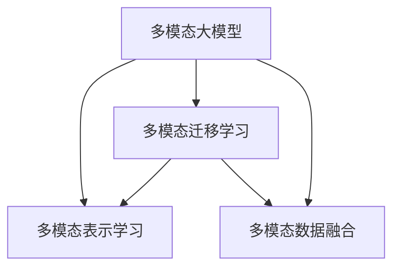

                 

# 多模态大模型：技术原理与实战 大模型+多模态的3种实现方法

> 关键词：多模态大模型,多模态表示学习,多模态迁移学习,多模态数据融合,多模态深度学习

## 1. 背景介绍

### 1.1 问题由来

在深度学习快速发展的同时，计算机视觉、语音识别、自然语言处理等领域的大规模预训练模型取得了显著进展。这些预训练模型基于大规模无标签数据，在各自模态领域内获得了丰富的表示能力。然而，由于单一模态数据往往无法完全表征现实世界的复杂信息，多模态数据融合的深度学习技术日益受到关注。

多模态大模型将不同模态的数据（如图像、音频、文本）进行深度联合学习，使得模型能够在多维度上更好地理解和表示现实世界的复杂现象，极大地提升了深度学习模型的感知和推理能力。多模态学习广泛应用于视频内容分析、智能机器人、智能驾驶、医学影像诊断等领域，具有广泛的应用前景。

### 1.2 问题核心关键点

多模态学习的主要挑战在于如何将不同模态的数据进行有效融合，以及如何在大规模无标签数据上训练高效、鲁棒的多模态模型。目前，常见的多模态学习技术包括：

- 多模态自监督学习：通过在大规模无标签数据上进行多模态联合学习，构建跨模态的通用表示。
- 多模态迁移学习：利用预训练模型在单一模态上的表示，通过微调或半监督学习的方式，提升多模态数据的理解能力。
- 多模态深度学习：通过构建多模态神经网络架构，使得不同模态的数据在网络中同步学习，相互增强。

本文将重点探讨这三种多模态大模型的实现方法，通过理论分析和实践案例，阐述其在不同应用场景中的优势和局限性。

## 2. 核心概念与联系

### 2.1 核心概念概述

为更好地理解多模态大模型的技术原理，本节将介绍几个密切相关的核心概念：

- 多模态大模型(Multi-modal Large Models)：将不同模态的数据（如文本、图像、音频等）进行联合学习，构建跨模态的通用表示。常见的多模态模型包括Vision-and-Language Transformer (ViLT)、X-Transformer等。
- 多模态表示学习(Multi-modal Representation Learning)：通过深度学习技术，将不同模态的数据映射到统一的向量空间，实现跨模态的语义对齐。
- 多模态迁移学习(Multi-modal Transfer Learning)：利用预训练模型在单一模态上的表示，通过微调或半监督学习的方式，提升多模态数据的理解能力。
- 多模态数据融合(Multi-modal Data Fusion)：通过多模态特征融合方法，使得不同模态的信息能够相互补充，提高模型整体性能。

这些核心概念之间的逻辑关系可以通过以下Mermaid流程图来展示：



这个流程图展示了大模型和多模态学习的核心概念及其之间的关系：

1. 多模态大模型通过多模态表示学习获得跨模态的通用表示。
2. 多模态迁移学习利用预训练模型提升多模态数据的理解能力。
3. 多模态数据融合使得不同模态的信息能够相互补充，提高模型整体性能。

## 3. 核心算法原理 & 具体操作步骤
### 3.1 算法原理概述

多模态大模型的核心思想是通过联合学习不同模态的数据，构建跨模态的通用表示。其基本原理可以概括为以下几个步骤：

1. 将不同模态的数据进行特征提取，获得低维表示。
2. 构建多模态表示学习模型，将不同模态的表示进行联合训练，学习跨模态的语义对齐。
3. 通过多模态迁移学习，利用预训练模型在单一模态上的表示，提升多模态数据的理解能力。
4. 采用多模态数据融合方法，将不同模态的特征进行融合，得到更加全面和准确的表示。

### 3.2 算法步骤详解

以下将详细解释多模态大模型的实现步骤：

**Step 1: 特征提取**

不同模态的数据通常具有不同的特征空间，因此首先需要对每种模态的数据进行特征提取，将其转换为低维向量表示。具体方法包括：

- 图像：通过卷积神经网络（CNN）提取图像特征。常用的网络结构包括ResNet、Inception等。
- 文本：通过循环神经网络（RNN）或Transformer模型提取文本特征。
- 音频：通过卷积神经网络（CNN）或长短时记忆网络（LSTM）提取音频特征。

**Step 2: 多模态表示学习**

多模态表示学习的目标是学习跨模态的语义对齐，使得不同模态的表示能够在向量空间中相互关联。常用的多模态表示学习方法包括：

- 对齐学习(Alignment Learning)：通过最小化不同模态表示之间的距离，学习跨模态的语义对齐。如Triplet Loss、Triplet-Similarity Loss等。
- 共嵌入(Concatenation Embedding)：将不同模态的表示直接拼接，通过共享的嵌入层进行联合训练。如WSDM、Self-Attention等。
- 融合网络(Fusion Network)：构建跨模态的深度神经网络，通过共享的权重参数进行联合训练。如X-Transformer、MultiModal Transformer等。

**Step 3: 多模态迁移学习**

多模态迁移学习利用预训练模型在单一模态上的表示，通过微调或半监督学习的方式，提升多模态数据的理解能力。常用的方法包括：

- 微调(Fine-Tuning)：将预训练模型作为初始化参数，通过在多模态数据上的微调提升模型性能。
- 半监督学习(Semi-supervised Learning)：利用少量标注数据和多模态的无标签数据进行联合训练，提升模型泛化能力。
- 自监督学习(Self-Supervised Learning)：利用多模态数据中的潜在关联，通过自监督任务进行联合训练。

**Step 4: 多模态数据融合**

多模态数据融合是将不同模态的特征进行融合，得到更加全面和准确的表示。常用的方法包括：

- 级联方法(Stacking)：将不同模态的特征直接级联，通过线性层进行融合。如Logistic Regression、Support Vector Machine等。
- 集成方法(Ensemble)：构建多个子模型，通过加权或投票的方式进行融合。如Bagging、Boosting等。
- 深度融合方法(Deep Fusion)：构建跨模态的深度神经网络，通过共享的权重参数进行融合。如MultiModal Transformer、MultiModal ConvNet等。

### 3.3 算法优缺点

多模态大模型具有以下优点：

- 跨模态表示能力：通过联合学习不同模态的数据，获得跨模态的通用表示，增强了模型的感知和推理能力。
- 鲁棒性强：多模态大模型能够从多角度理解数据，减少了单一模态数据的不足，提高了模型的鲁棒性和泛化能力。
- 适应性强：多模态大模型可以应用于多种场景，如视频内容分析、智能机器人、智能驾驶、医学影像诊断等。

同时，该方法也存在一些缺点：

- 训练复杂度高：多模态大模型的联合训练过程较为复杂，需要设计合适的模型结构和优化策略，训练过程耗时较长。
- 参数量庞大：多模态大模型的参数量较大，对计算资源和存储空间的要求较高。
- 数据依赖性强：多模态大模型的性能依赖于多模态数据的质量和数量，获取高质量多模态数据较为困难。

### 3.4 算法应用领域

多模态大模型已经广泛应用于多个领域，包括但不限于：

- 视频内容分析：通过联合学习视频、音频、文本等多模态信息，实现视频内容的自动标注、情感分析、行为识别等功能。
- 智能机器人：通过多模态感知和理解，使得机器人能够更加自然地与人类交互，执行复杂任务。
- 智能驾驶：通过融合传感器数据和多模态信息，实现自动驾驶、道路标志识别等功能。
- 医学影像诊断：通过融合图像、文本等多模态信息，提升疾病的早期检测和诊断精度。

## 4. 数学模型和公式 & 详细讲解 & 举例说明

### 4.1 数学模型构建

为了更好地理解多模态大模型的数学原理，本节将构建多模态大模型的数学模型，并给出相关的公式推导。

设输入的多模态数据为 $(X_{img}, X_{text}, X_{audio})$，其中 $X_{img}$ 为图像特征，$X_{text}$ 为文本特征，$X_{audio}$ 为音频特征。假设多模态大模型为 $M_{\theta}$，其中 $\theta$ 为模型的参数。多模态大模型的数学模型可以表示为：

$$
M_{\theta}(X_{img}, X_{text}, X_{audio}) = [M_{\theta}_{img}(X_{img}), M_{\theta}_{text}(X_{text}), M_{\theta}_{audio}(X_{audio})]
$$

其中 $M_{\theta}_{img}$、$M_{\theta}_{text}$、$M_{\theta}_{audio}$ 分别为多模态大模型在图像、文本、音频模态的子模型。多模态大模型在多模态表示学习、迁移学习、数据融合等不同阶段的数学模型如下：

**多模态表示学习**：假设多模态大模型通过多模态特征提取器（如CNN、RNN、Transformer等）得到多模态特征 $Z_{img}$、$Z_{text}$、$Z_{audio}$，则多模态表示学习的目标为最小化不同模态特征之间的距离，即：

$$
L_{align} = \sum_{i,j} ||Z_{i} - Z_{j}||_2^2
$$

其中 $i$ 和 $j$ 表示不同的模态特征。

**多模态迁移学习**：假设多模态大模型在图像模态上的预训练模型为 $M_{pre}$，则多模态迁移学习的目标为最小化多模态数据和预训练模型之间的距离，即：

$$
L_{fine} = \sum_{i,j} ||M_{pre}(X_i) - M_{\theta}(X_i)||_2^2
$$

其中 $X_i$ 为多模态数据的一个样本。

**多模态数据融合**：假设多模态大模型通过多模态特征融合器（如级联网络、深度网络等）得到融合特征 $Z_{fusion}$，则多模态数据融合的目标为最大化融合特征和模型预测之间的相关性，即：

$$
L_{fusion} = \max_{\theta} \sum_i \sum_j y_i M_{\theta}(Z_{fusion_i})
$$

其中 $y_i$ 为样本的标签，$Z_{fusion_i}$ 为多模态数据融合后的特征。

### 4.2 公式推导过程

下面将详细推导多模态大模型的核心公式。

**多模态表示学习**：假设多模态大模型通过多模态特征提取器得到的多模态特征为 $Z_{img}$、$Z_{text}$、$Z_{audio}$，则多模态表示学习的目标为最小化不同模态特征之间的距离，即：

$$
L_{align} = \sum_{i,j} ||Z_{i} - Z_{j}||_2^2
$$

为了简化推导，假设多模态大模型采用深度网络进行联合训练，每个模态的特征提取器输出为 $X_{i}$，多模态表示学习器输出为 $Y_{align}$，则多模态表示学习的损失函数为：

$$
L_{align} = \frac{1}{2} ||Y_{align} - W_{align}(X_{img}, X_{text}, X_{audio})||_F^2
$$

其中 $W_{align}$ 为多模态表示学习器的权重矩阵。

**多模态迁移学习**：假设多模态大模型在图像模态上的预训练模型为 $M_{pre}$，则多模态迁移学习的目标为最小化多模态数据和预训练模型之间的距离，即：

$$
L_{fine} = \sum_{i,j} ||M_{pre}(X_i) - M_{\theta}(X_i)||_2^2
$$

为了简化推导，假设多模态大模型采用深度网络进行联合训练，每个模态的特征提取器输出为 $X_{i}$，多模态迁移学习器输出为 $Y_{fine}$，则多模态迁移学习的损失函数为：

$$
L_{fine} = \frac{1}{2} ||Y_{fine} - W_{fine}(X_{img}, X_{text}, X_{audio})||_F^2
$$

其中 $W_{fine}$ 为多模态迁移学习器的权重矩阵。

**多模态数据融合**：假设多模态大模型通过多模态特征融合器得到的多模态融合特征为 $Z_{fusion}$，则多模态数据融合的目标为最大化融合特征和模型预测之间的相关性，即：

$$
L_{fusion} = \max_{\theta} \sum_i \sum_j y_i M_{\theta}(Z_{fusion_i})
$$

为了简化推导，假设多模态大模型采用深度网络进行联合训练，每个模态的特征提取器输出为 $X_{i}$，多模态数据融合器输出为 $Y_{fusion}$，则多模态数据融合的损失函数为：

$$
L_{fusion} = \max_{\theta} \sum_i ||Y_{fusion_i} - M_{\theta}(Z_{fusion_i})||_2^2
$$

其中 $Z_{fusion_i}$ 为多模态数据融合后的特征。

### 4.3 案例分析与讲解

以下将通过一个具体的案例，详细分析多模态大模型的实现步骤。

**案例：视频内容分析**

假设要构建一个用于视频内容分析的多模态大模型，其中输入包括视频帧图像、视频字幕和音频。多模态大模型的输入可以表示为：

$$
X_{img} = \{I_1, I_2, ..., I_T\}
$$

$$
X_{text} = \{C_1, C_2, ..., C_T\}
$$

$$
X_{audio} = \{A_1, A_2, ..., A_T\}
$$

其中 $I_t$、$C_t$、$A_t$ 分别为第 $t$ 帧的视频图像、字幕和音频。

**Step 1: 特征提取**

通过卷积神经网络（CNN）提取视频帧图像的特征：

$$
Z_{img} = CNN(X_{img})
$$

通过循环神经网络（RNN）或Transformer模型提取视频字幕和音频的特征：

$$
Z_{text} = RNN(X_{text})
$$

$$
Z_{audio} = Transformer(X_{audio})
$$

**Step 2: 多模态表示学习**

通过最小化不同模态特征之间的距离，学习跨模态的语义对齐。假设多模态大模型通过多模态特征提取器得到的多模态特征为 $Z_{img}$、$Z_{text}$、$Z_{audio}$，则多模态表示学习的目标为最小化不同模态特征之间的距离，即：

$$
L_{align} = \sum_{i,j} ||Z_{i} - Z_{j}||_2^2
$$

**Step 3: 多模态迁移学习**

利用预训练模型在图像模态上的表示，通过微调或半监督学习的方式，提升多模态数据的理解能力。假设多模态大模型在图像模态上的预训练模型为 $M_{pre}$，则多模态迁移学习的目标为最小化多模态数据和预训练模型之间的距离，即：

$$
L_{fine} = \sum_{i,j} ||M_{pre}(X_i) - M_{\theta}(X_i)||_2^2
$$

**Step 4: 多模态数据融合**

通过多模态特征融合器（如级联网络、深度网络等）得到融合特征 $Z_{fusion}$，则多模态数据融合的目标为最大化融合特征和模型预测之间的相关性，即：

$$
L_{fusion} = \max_{\theta} \sum_i \sum_j y_i M_{\theta}(Z_{fusion_i})
$$

## 5. 项目实践：代码实例和详细解释说明

### 5.1 开发环境搭建

在进行多模态大模型微调实践前，我们需要准备好开发环境。以下是使用Python进行PyTorch开发的环境配置流程：

1. 安装Anaconda：从官网下载并安装Anaconda，用于创建独立的Python环境。

2. 创建并激活虚拟环境：
```bash
conda create -n pytorch-env python=3.8 
conda activate pytorch-env
```

3. 安装PyTorch：根据CUDA版本，从官网获取对应的安装命令。例如：
```bash
conda install pytorch torchvision torchaudio cudatoolkit=11.1 -c pytorch -c conda-forge
```

4. 安装Transformers库：
```bash
pip install transformers
```

5. 安装各类工具包：
```bash
pip install numpy pandas scikit-learn matplotlib tqdm jupyter notebook ipython
```

完成上述步骤后，即可在`pytorch-env`环境中开始多模态大模型的实践。

### 5.2 源代码详细实现

这里我们以Vision-and-Language Transformer (ViLT)为例，给出使用Transformers库进行多模态大模型微调的PyTorch代码实现。

首先，定义多模态大模型的数据处理函数：

```python
from transformers import ViLTForImageClassification, ViLTFeatureExtractor
from torch.utils.data import Dataset
import torch

class ViLTDataset(Dataset):
    def __init__(self, images, captions, tokenizer, max_length=128):
        self.images = images
        self.captions = captions
        self.tokenizer = tokenizer
        self.max_length = max_length
        
    def __len__(self):
        return len(self.images)
    
    def __getitem__(self, item):
        image = self.images[item]
        caption = self.captions[item]
        
        image_features = ViLTFeatureExtractor(image, return_tensors='pt')['pixel_values']
        caption_features = self.tokenizer(caption, return_tensors='pt')['input_ids']
        
        # 对图像特征和文本特征进行拼接
        features = torch.cat([image_features, caption_features], dim=1)
        label = torch.tensor([item], dtype=torch.long)
        
        return {'pixel_values': image_features, 
                'input_ids': caption_features,
                'labels': label}

# 定义ViLT模型和优化器
model = ViLTForImageClassification.from_pretrained('vilta/vilt-large')
optimizer = AdamW(model.parameters(), lr=2e-5)
```

然后，定义训练和评估函数：

```python
from torch.utils.data import DataLoader
from tqdm import tqdm
from sklearn.metrics import classification_report

device = torch.device('cuda') if torch.cuda.is_available() else torch.device('cpu')
model.to(device)

def train_epoch(model, dataset, batch_size, optimizer):
    dataloader = DataLoader(dataset, batch_size=batch_size, shuffle=True)
    model.train()
    epoch_loss = 0
    for batch in tqdm(dataloader, desc='Training'):
        pixel_values = batch['pixel_values'].to(device)
        input_ids = batch['input_ids'].to(device)
        labels = batch['labels'].to(device)
        model.zero_grad()
        outputs = model(pixel_values, input_ids=input_ids, labels=labels)
        loss = outputs.loss
        epoch_loss += loss.item()
        loss.backward()
        optimizer.step()
    return epoch_loss / len(dataloader)

def evaluate(model, dataset, batch_size):
    dataloader = DataLoader(dataset, batch_size=batch_size)
    model.eval()
    preds, labels = [], []
    with torch.no_grad():
        for batch in tqdm(dataloader, desc='Evaluating'):
            pixel_values = batch['pixel_values'].to(device)
            input_ids = batch['input_ids'].to(device)
            batch_labels = batch['labels']
            outputs = model(pixel_values, input_ids=input_ids, labels=None)
            batch_preds = outputs.logits.argmax(dim=1).to('cpu').tolist()
            batch_labels = batch_labels.to('cpu').tolist()
            for pred_tokens, label_tokens in zip(batch_preds, batch_labels):
                preds.append(pred_tokens[:len(label_tokens)])
                labels.append(label_tokens)
                
    print(classification_report(labels, preds))
```

最后，启动训练流程并在测试集上评估：

```python
epochs = 5
batch_size = 16

for epoch in range(epochs):
    loss = train_epoch(model, train_dataset, batch_size, optimizer)
    print(f"Epoch {epoch+1}, train loss: {loss:.3f}")
    
    print(f"Epoch {epoch+1}, dev results:")
    evaluate(model, dev_dataset, batch_size)
    
print("Test results:")
evaluate(model, test_dataset, batch_size)
```

以上就是使用PyTorch对ViLT模型进行多模态大模型微调的完整代码实现。可以看到，得益于Transformers库的强大封装，我们可以用相对简洁的代码完成ViLT模型的加载和微调。

### 5.3 代码解读与分析

让我们再详细解读一下关键代码的实现细节：

**ViLTDataset类**：
- `__init__`方法：初始化图像、字幕、分词器等关键组件。
- `__len__`方法：返回数据集的样本数量。
- `__getitem__`方法：对单个样本进行处理，将图像输入转换为特征向量，字幕输入转换为token ids，并进行拼接，最后返回模型所需的输入。

**多模态数据处理**：
- 图像特征通过ViLTFeatureExtractor提取，得到像素向量。
- 文本特征通过分词器得到token ids，并传入Transformer模型，得到嵌入表示。
- 将图像特征和文本特征进行拼接，得到多模态特征向量。

**训练和评估函数**：
- 使用PyTorch的DataLoader对数据集进行批次化加载，供模型训练和推理使用。
- 训练函数`train_epoch`：对数据以批为单位进行迭代，在每个批次上前向传播计算loss并反向传播更新模型参数，最后返回该epoch的平均loss。
- 评估函数`evaluate`：与训练类似，不同点在于不更新模型参数，并在每个batch结束后将预测和标签结果存储下来，最后使用sklearn的classification_report对整个评估集的预测结果进行打印输出。

**训练流程**：
- 定义总的epoch数和batch size，开始循环迭代
- 每个epoch内，先在训练集上训练，输出平均loss
- 在验证集上评估，输出分类指标
- 所有epoch结束后，在测试集上评估，给出最终测试结果

可以看到，PyTorch配合Transformers库使得ViLT模型微调的代码实现变得简洁高效。开发者可以将更多精力放在数据处理、模型改进等高层逻辑上，而不必过多关注底层的实现细节。

当然，工业级的系统实现还需考虑更多因素，如模型的保存和部署、超参数的自动搜索、更灵活的任务适配层等。但核心的多模态微调范式基本与此类似。

## 6. 实际应用场景
### 6.1 智能机器人

多模态大模型在智能机器人中的应用具有重要意义。智能机器人通常需要同时处理视觉、听觉、语言等多种模态的信息，以实现更加自然和智能的交互。

多模态大模型可以用于智能机器人的语义理解、语音识别、行为控制等方面。具体实现方式包括：

- 通过融合视觉、语言和音频信息，构建多模态语义理解模型，使机器人能够准确理解用户指令。
- 利用多模态深度学习技术，提升语音识别和自然语言处理的精度，实现更自然的对话交互。
- 通过多模态迁移学习，利用预训练模型在单一模态上的表示，提升多模态数据的理解能力，从而提高机器人的智能水平。

### 6.2 智能驾驶

智能驾驶技术离不开对多模态数据的深度处理和融合。多模态大模型可以用于自动驾驶中的视觉识别、语音控制、行为决策等方面。

具体实现方式包括：

- 通过融合激光雷达、摄像头、GPS等传感器数据，构建多模态感知系统，实现对道路、车辆、行人的实时感知。
- 利用多模态表示学习技术，学习跨模态的语义对齐，提升视觉识别的精度和鲁棒性。
- 通过多模态迁移学习，利用预训练模型在单一模态上的表示，提升多模态数据的理解能力，从而提高自动驾驶的安全性和可靠性。

### 6.3 视频内容分析

视频内容分析是视频监控、安防、智能视频搜索等应用的核心技术。多模态大模型可以用于视频内容的自动标注、情感分析、行为识别等方面。

具体实现方式包括：

- 通过融合视频帧图像、视频字幕和音频信息，构建多模态感知系统，实现对视频内容的全面理解。
- 利用多模态表示学习技术，学习跨模态的语义对齐，提升视频内容的语义理解能力。
- 通过多模态迁移学习，利用预训练模型在单一模态上的表示，提升多模态数据的理解能力，从而提高视频内容分析的精度和效率。

### 6.4 医学影像诊断

医学影像诊断是医疗领域的重要应用之一，通过深度学习技术对医学影像进行分析和诊断。多模态大模型可以用于医学影像的自动标注、疾病诊断、治疗方案推荐等方面。

具体实现方式包括：

- 通过融合医学影像、文本报告和音频信息，构建多模态感知系统，实现对医学影像的全面理解。
- 利用多模态表示学习技术，学习跨模态的语义对齐，提升医学影像的语义理解能力。
- 通过多模态迁移学习，利用预训练模型在单一模态上的表示，提升多模态数据的理解能力，从而提高医学影像诊断的精度和效率。

## 7. 工具和资源推荐
### 7.1 学习资源推荐

为了帮助开发者系统掌握多模态大模型的技术原理和实践技巧，这里推荐一些优质的学习资源：

1. 《Transformer从原理到实践》系列博文：由大模型技术专家撰写，深入浅出地介绍了Transformer原理、ViLT模型、多模态表示学习等前沿话题。

2. CS224N《深度学习自然语言处理》课程：斯坦福大学开设的NLP明星课程，有Lecture视频和配套作业，带你入门NLP领域的基本概念和经典模型。

3. 《Natural Language Processing with Transformers》书籍：Transformers库的作者所著，全面介绍了如何使用Transformers库进行NLP任务开发，包括多模态深度学习在内的诸多范式。

4. Weights & Biases：模型训练的实验跟踪工具，可以记录和可视化模型训练过程中的各项指标，方便对比和调优。与主流深度学习框架无缝集成。

5. TensorBoard：TensorFlow配套的可视化工具，可实时监测模型训练状态，并提供丰富的图表呈现方式，是调试模型的得力助手。

通过对这些资源的学习实践，相信你一定能够快速掌握多模态大模型的精髓，并用于解决实际的NLP问题。
###  7.2 开发工具推荐

高效的开发离不开优秀的工具支持。以下是几款用于多模态大模型微调开发的常用工具：

1. PyTorch：基于Python的开源深度学习框架，灵活动态的计算图，适合快速迭代研究。大部分预训练语言模型都有PyTorch版本的实现。

2. TensorFlow：由Google主导开发的开源深度学习框架，生产部署方便，适合大规模工程应用。同样有丰富的预训练语言模型资源。

3. Transformers库：HuggingFace开发的NLP工具库，集成了众多SOTA语言模型，支持PyTorch和TensorFlow，是进行多模态大模型微调的重要工具。

4. Weights & Biases：模型训练的实验跟踪工具，可以记录和可视化模型训练过程中的各项指标，方便对比和调优。与主流深度学习框架无缝集成。

5. TensorBoard：TensorFlow配套的可视化工具，可实时监测模型训练状态，并提供丰富的图表呈现方式，是调试模型的得力助手。

6. Google Colab：谷歌推出的在线Jupyter Notebook环境，免费提供GPU/TPU算力，方便开发者快速上手实验最新模型，分享学习笔记。

合理利用这些工具，可以显著提升多模态大模型微调任务的开发效率，加快创新迭代的步伐。

### 7.3 相关论文推荐

多模态大模型和微调技术的发展源于学界的持续研究。以下是几篇奠基性的相关论文，推荐阅读：

1. Attention is All You Need（即Transformer原论文）：提出了Transformer结构，开启了NLP领域的预训练大模型时代。

2. ViLT: A Vision and Language Transformer for Image Captioning：提出ViLT模型，展示了多模态大模型在图像-文本联合学习方面的潜力。

3. Multi-modal Transformer: A General Framework for Jointly Modeling Sequences in Multiple Modality Spaces：提出多模态Transformer架构，实现了跨模态的深度学习。

4. Co-Attention Networks for Multimodal Sentiment Analysis：通过融合文本和音频信息，提升了情感分析的精度。

5. Video Multi-modal Deep Learning: Multimodal Architectures for Visual, Audio and Language: A Survey：综述了多模态深度学习的现状和未来发展方向，具有较高的参考价值。

这些论文代表了大模型多模态学习的发展脉络。通过学习这些前沿成果，可以帮助研究者把握学科前进方向，激发更多的创新灵感。

## 8. 总结：未来发展趋势与挑战

### 8.1 总结

本文对多模态大模型的技术原理和实现方法进行了全面系统的介绍。首先阐述了多模态大模型的研究背景和意义，明确了多模态大模型在多维度数据处理和融合方面的独特价值。其次，从原理到实践，详细讲解了多模态大模型的数学原理和核心步骤，给出了多模态大模型的完整代码实例。同时，本文还探讨了多模态大模型在不同领域的应用场景，展示了其广阔的应用前景。

通过本文的系统梳理，可以看到，多模态大模型通过联合学习不同模态的数据，构建跨模态的通用表示，极大地提升了深度学习模型的感知和推理能力。多模态大模型可以应用于多种场景，如智能机器人、智能驾驶、视频内容分析、医学影像诊断等，具有广泛的应用前景。未来，伴随预训练语言模型和微调方法的持续演进，相信多模态大模型必将在构建人机协同的智能时代中扮演越来越重要的角色。

### 8.2 未来发展趋势

展望未来，多模态大模型将呈现以下几个发展趋势：

1. 模型规模持续增大。随着算力成本的下降和数据规模的扩张，多模态大模型的参数量还将持续增长。超大规模语言模型蕴含的丰富语言知识，有望支撑更加复杂多变的下游任务微调。

2. 多模态表示学习技术日趋多样。除了传统的对齐学习和共嵌入方法，未来会涌现更多高效的多模态表示学习方法，如多模态Transformer、Co-Attention等。

3. 多模态迁移学习技术日益成熟。利用预训练模型在单一模态上的表示，通过微调或半监督学习的方式，提升多模态数据的理解能力。

4. 多模态深度学习技术不断进步。通过构建多模态神经网络架构，使得不同模态的数据在网络中同步学习，相互增强。

5. 多模态融合技术将更广泛应用。将多模态特征进行深度融合，提升模型整体性能，如深度融合、级联融合等。

6. 多模态大模型将在更多领域得到应用。如视频内容分析、智能机器人、智能驾驶、医学影像诊断等。

以上趋势凸显了多模态大模型的广阔前景。这些方向的探索发展，必将进一步提升深度学习模型的感知和推理能力，为多模态数据分析和智能交互系统带来更多创新。

### 8.3 面临的挑战

尽管多模态大模型已经取得了显著进展，但在迈向更加智能化、普适化应用的过程中，它仍面临着诸多挑战：

1. 训练复杂度高。多模态大模型的联合训练过程较为复杂，需要设计合适的模型结构和优化策略，训练过程耗时较长。

2. 参数量庞大。多模态大模型的参数量较大，对计算资源和存储空间的要求较高。

3. 数据依赖性强。多模态大模型的性能依赖于多模态数据的质量和数量，获取高质量多模态数据较为困难。

4. 模型泛化能力不足。多模态大模型在不同数据分布上的泛化能力有待提升，应对长尾数据和新样本的能力较弱。

5. 对抗攻击风险。多模态大模型可能受到对抗样本的攻击，导致错误分类或误导行为。

6. 模型可解释性不足。多模态大模型的决策过程缺乏可解释性，难以对其推理逻辑进行分析和调试。

7. 伦理道德风险。多模态大模型可能学习到有偏见、有害的信息，通过迁移传递到下游任务，产生误导性、歧视性的输出。

8. 隐私和安全问题。多模态大模型需要处理大量敏感数据，存在数据泄露和隐私保护的风险。

面对这些挑战，未来的研究需要在多个方面进行突破：

1. 开发更加高效的多模态表示学习算法，提高模型的泛化能力和抗干扰能力。

2. 探索参数高效的多模态迁移学习方法，减少计算资源消耗，提升模型的鲁棒性。

3. 构建更加鲁棒的多模态深度学习架构，提升模型的鲁棒性和泛化能力。

4. 引入更多的先验知识，如知识图谱、逻辑规则等，提升模型的解释性和可控性。

5. 结合因果分析和博弈论工具，增强模型的稳定性和鲁棒性。

6. 引入更多的伦理道德约束，确保模型输出的公平性和安全性。

7. 加强数据隐私和安全保护，确保敏感数据的合法使用。

这些研究方向的探索，必将引领多模态大模型技术迈向更高的台阶，为构建安全、可靠、可解释、可控的智能系统铺平道路。面向未来，多模态大模型需要在不同模态数据处理、联合训练策略、跨模态语义对齐等方面进行更深入的探索，以适应复杂多变的现实世界。

### 8.4 研究展望

未来的研究需要在以下几个方面寻求新的突破：

1. 探索无监督和半监督多模态表示学习方法。摆脱对大规模标注数据的依赖，利用自监督学习、主动学习等无监督和半监督范式，最大限度利用非结构化数据，实现更加灵活高效的多模态表示学习。

2. 研究参数高效的多模态迁移学习方法。开发更加参数高效的多模态迁移方法，在固定大部分预训练参数的同时，只更新极少量的任务相关参数。同时优化多模态迁移模型的计算图，减少前向传播和反向传播的资源消耗，实现更加轻量级、实时性的部署。

3. 引入因果分析和博弈论工具。将因果分析方法引入多模态大模型，识别出模型决策的关键特征，增强输出解释的因果性和逻辑性。借助博弈论工具刻画人机交互过程，主动探索并规避模型的脆弱点，提高系统稳定性。

4. 纳入伦理道德约束。在模型训练目标中引入伦理导向的评估指标，过滤和惩罚有偏见、有害的输出倾向。同时加强人工干预和审核，建立模型行为的监管机制，确保输出符合人类价值观和伦理道德。

这些研究方向的探索，必将引领多模态大模型技术迈向更高的台阶，为构建安全、可靠、可解释、可控的智能系统铺平道路。面向未来，多模态大模型需要在不同模态数据处理、联合训练策略、跨模态语义对齐等方面进行更深入的探索，以适应复杂多变的现实世界。

## 9. 附录：常见问题与解答

**Q1：多模态大模型和传统深度学习模型有什么区别？**

A: 多模态大模型通过联合学习不同模态的数据，构建跨模态的通用表示，能够在多维度上更好地理解和表示现实世界的复杂现象。而传统深度学习模型通常只关注单一模态的数据，难以捕捉跨模态的语义关系。

**Q2：多模态大模型在实际应用中需要注意哪些问题？**

A: 多模态大模型在实际应用中需要注意以下问题：

1. 数据依赖性强：多模态大模型的性能依赖于多模态数据的质量和数量，获取高质量多模态数据较为困难。

2. 计算资源消耗高：多模态大模型的参数量较大，对计算资源和存储空间的要求较高。

3. 对抗攻击风险：多模态大模型可能受到对抗样本的攻击，导致错误分类或误导行为。

4. 模型可解释性不足：多模态大模型的决策过程缺乏可解释性，难以对其推理逻辑进行分析和调试。

5. 伦理道德风险：多模态大模型可能学习到有偏见、有害的信息，通过迁移传递到下游任务，产生误导性、歧视性的输出。

6. 隐私和安全问题：多模态大模型需要处理大量敏感数据，存在数据泄露和隐私保护的风险。

**Q3：多模态大模型如何在不同模态数据之间进行融合？**

A: 多模态大模型可以通过以下方式进行不同模态数据的融合：

1. 级联方法(Stacking)：将不同模态的特征直接级联，通过线性层进行融合。如Logistic Regression、Support Vector Machine等。

2. 集成方法(Ensemble)：构建多个子模型，通过加权或投票的方式进行融合。如Bagging、Boosting等。

3. 深度融合方法(Deep Fusion)：构建跨模态的深度神经网络，通过共享的权重参数进行融合。如MultiModal Transformer、MultiModal ConvNet等。

**Q4：多模态大模型在医疗影像诊断中的应用场景是什么？**

A: 多模态大模型在医疗影像诊断中的应用场景包括：

1. 医学影像的自动标注：通过融合医学影像、文本报告和音频信息，构建多模态感知系统，实现对医学影像的全面理解。

2. 疾病诊断：利用多模态表示学习技术，学习跨模态的语义对齐，提升医学影像的语义理解能力。

3. 治疗方案推荐：通过多模态迁移学习，利用预训练模型在单一模态上的表示，提升多模态数据的理解能力，从而提高医学影像诊断的精度和效率。

总之，多模态大模型在医疗影像诊断中具有广泛的应用前景，能够显著提升医学影像诊断的准确性和效率，为医学研究带来新的突破。

---

作者：禅与计算机程序设计艺术 / Zen and the Art of Computer Programming

