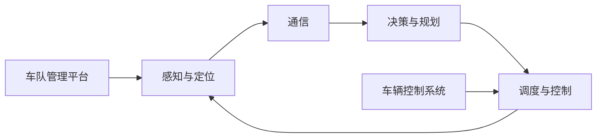

                 

# 多车协同智能调度开启自动驾驶车队管理新纪元

## 1. 背景介绍

在自动驾驶技术的快速发展与日趋成熟的背景下，自动驾驶车队管理已成为自动驾驶技术应用的关键环节之一。如何有效管理和调度车队，提升车辆的运行效率和安全性，减少人为操作，成为摆在行业面前的重大挑战。本文将从多车协同智能调度的角度，探讨其核心概念与联系、算法原理与操作步骤，并结合实际应用场景，分析其优缺点，并提出未来发展趋势与面临的挑战。

## 2. 核心概念与联系

### 2.1 核心概念概述

多车协同智能调度是指在自动驾驶车队中，利用先进的感知、决策与通信技术，通过算法对多辆车的行驶路线、速度、行驶策略进行实时监控和优化，实现车队整体的高效、安全运行。以下是几个核心概念的介绍：

- **感知与定位**：多车协同智能调度首先需要车辆感知和定位自己的位置及周围环境，确保车辆能够精确地获取导航数据和交通环境信息。
- **通信**：通过车与车、车与基站的无线通信，实现信息的快速传输和同步，使各车辆能够及时了解周围车辆的位置和行驶状态。
- **决策与规划**：基于获取的感知数据和通信数据，进行实时决策和路径规划，优化车队的行驶策略。
- **调度与控制**：根据车辆的位置、速度和任务要求，合理调度车辆，控制其行驶状态，确保车队整体的安全和高效运行。

### 2.2 核心概念原理和架构的 Mermaid 流程图



在这个流程图中，各核心概念之间的联系是紧密相连的。感知与定位技术获取车辆自身位置和环境信息，通信技术实现信息共享，决策与规划技术分析实时数据进行优化调度，而调度与控制技术根据优化结果来调整车辆行驶状态。车队管理平台负责协调这些核心技术，实现整体车队的高效管理和调度。

## 3. 核心算法原理 & 具体操作步骤

### 3.1 算法原理概述

多车协同智能调度算法基于实时感知、通信、决策和调度技术，结合先进的算法和模型，实现对车队运行状态的精确控制。其核心思想是通过算法对车队进行实时监控、优化调度，确保车队整体的安全和高效运行。

具体来说，多车协同智能调度算法包括以下几个关键步骤：

1. **数据获取与融合**：车辆通过传感器获取自身位置、速度、环境信息等，并将这些数据通过通信技术与其他车辆和基站进行共享。
2. **状态估计与预测**：基于获取的数据，使用先进的滤波算法如Kalman滤波、粒子滤波等，对车辆状态进行估计和预测，确保状态信息的准确性。
3. **路径规划与路径跟踪**：根据车辆的位置和速度，使用A*算法、D*算法等路径规划算法，生成最优路径，并结合路径跟踪算法如PID控制，确保车辆能够沿路径准确行驶。
4. **车队调度与控制**：使用多目标优化算法，如线性规划、非线性规划等，对车队进行合理调度，确保车队整体的安全和高效运行。

### 3.2 算法步骤详解

以一个典型的多车协同智能调度算法为例，其操作步骤如下：

1. **数据获取与融合**
   - 车辆通过传感器（如GPS、LiDAR、摄像头等）获取自身位置、速度、环境信息等。
   - 将获取的数据通过车与车、车与基站的无线通信技术进行共享，如5G、V2X等。
   - 基站将各车辆上传的数据进行集中处理，形成完整的车队状态数据。

2. **状态估计与预测**
   - 使用Kalman滤波或粒子滤波等算法，对车辆的状态进行估计和预测，如位置、速度、加速度等。
   - 对预测结果进行不确定性分析，确保状态信息的准确性。

3. **路径规划与路径跟踪**
   - 使用A*算法、D*算法等路径规划算法，根据车辆的目标位置和环境信息，生成最优路径。
   - 将最优路径发送给车辆，车辆使用PID控制等路径跟踪算法，确保车辆能够沿路径准确行驶。

4. **车队调度与控制**
   - 使用多目标优化算法，如线性规划、非线性规划等，对车队进行合理调度，确保车队整体的安全和高效运行。
   - 根据各车辆的任务和状态信息，生成最优调度策略，并控制各车辆的行驶状态。

### 3.3 算法优缺点

多车协同智能调度算法的优点：

- **提高运行效率**：通过实时优化调度和路径规划，可以显著提高车队的运行效率，减少能源消耗。
- **提升安全性**：实时感知和通信技术，确保车辆对周围环境的准确感知，减少碰撞风险。
- **降低人工成本**：自动化调度降低了对人工操作的依赖，提升车队管理效率。

多车协同智能调度算法的缺点：

- **算法复杂度较高**：需要综合考虑多车状态、路径规划和调度等因素，算法设计复杂。
- **数据通信要求高**：车与车、车与基站的无线通信要求高，数据传输量和实时性要求高。
- **系统集成难度大**：需要集成多种传感器和通信技术，以及复杂的算法和模型，系统集成难度大。

### 3.4 算法应用领域

多车协同智能调度算法在自动驾驶车队管理中有着广泛的应用场景：

- **智能交通系统**：多车协同智能调度可以用于城市交通管理，提升道路通行效率，减少交通拥堵。
- **物流配送**：在自动驾驶物流配送场景中，多车协同调度可以实现车辆的智能调度，提高配送效率和减少配送成本。
- **公交系统**：在自动驾驶公交系统中，多车协同智能调度可以实现车辆的实时调度，提高公交车的运行效率。
- **出租汽车**：在自动驾驶出租汽车领域，多车协同智能调度可以实现车辆的智能调度，提升出租车的运营效率。

## 4. 数学模型和公式 & 详细讲解 & 举例说明

### 4.1 数学模型构建

在多车协同智能调度算法中，数学模型主要包括以下几个部分：

- **状态方程**：描述车辆的运动状态，如位置、速度、加速度等。
- **观测方程**：描述车辆的状态信息如何通过传感器获取。
- **路径规划方程**：描述车辆的路径规划过程。
- **调度与控制方程**：描述车辆调度与控制的优化过程。

### 4.2 公式推导过程

以车辆状态估计为例，假设有车辆 $i$ 在时间 $t$ 的状态为 $x_i(t)$，其状态方程为：

$$
\dot{x}_i(t) = f(x_i(t), u_i(t))
$$

其中 $u_i(t)$ 为车辆的控制输入，如加速度、转向角度等。

状态估计过程可以使用Kalman滤波算法进行，其状态预测和更新方程为：

$$
\begin{align*}
\hat{x}_i(t|t-1) &= A_i x_i(t-1) \\
\hat{P}_i(t|t-1) &= A_i P_i(t-1) A_i^T + Q \\
K_i(t) &= H_i P_i(t|t-1) H_i^T (H_i P_i(t|t-1) H_i^T + R)^{-1} \\
\hat{x}_i(t) &= \hat{x}_i(t|t-1) + K_i(t) (z_i(t) - H_i \hat{x}_i(t|t-1))
\end{align*}
$$

其中 $A_i$ 为状态转换矩阵，$Q$ 为过程噪声协方差矩阵，$H_i$ 为观测矩阵，$R$ 为测量噪声协方差矩阵。

### 4.3 案例分析与讲解

假设有一队自动驾驶出租车，其目标是从A地到B地。车辆在途中需要经过多个路口和交叉口，需要实时监控和优化调度。下图展示了车辆路径规划与调度过程：


在这个案例中，车辆通过传感器获取自身位置、速度等信息，并通过通信技术与其他车辆和基站进行信息共享。基站将各车辆上传的数据集中处理，形成车队状态数据。使用Kalman滤波算法对车辆状态进行估计和预测，使用A*算法进行路径规划，生成最优路径。最后，使用多目标优化算法对车队进行调度与控制，确保车队整体的安全和高效运行。

## 5. 项目实践：代码实例和详细解释说明

### 5.1 开发环境搭建

多车协同智能调度的开发环境搭建主要包括以下几个步骤：

1. **硬件搭建**：搭建多车通信系统，包括车辆、基站等硬件设备。
2. **软件搭建**：搭建车队管理平台，用于车辆数据管理和调度决策。
3. **传感器安装**：在车辆上安装GPS、LiDAR、摄像头等传感器。
4. **通信系统配置**：配置车辆与车辆、车辆与基站的通信系统。

### 5.2 源代码详细实现

以下是一个简单的多车协同智能调度系统示例，主要包括车辆状态估计、路径规划和调度与控制三个模块：

**车辆状态估计模块**

```python
import numpy as np
from numpy.linalg import pinv

def kalman_filter(x, P, z, H, R):
    K = P @ (H @ pinv(H @ P @ H.T + R))  # Kalman增益
    x = x + K * (z - H @ x)  # 状态更新
    P = (np.eye(x.shape[0]) - K @ H) @ P  # 协方差更新
    return x, P
```

**路径规划模块**

```python
import heapq
from queue import PriorityQueue

def a_star(start, goal, heuristic, neighbors):
    open_list = PriorityQueue()
    open_list.put((0, start))
    closed_list = set()
    path = {}
    path[start] = None

    while not open_list.empty():
        _, current = open_list.get()
        if current == goal:
            break

        for next_node in neighbors(current):
            g = current[1] + heuristic(next_node, goal)
            if next_node not in closed_list or g < path.get(next_node, 0):
                if next_node not in open_list.queue:
                    heapq.heappush(open_list.queue, (g + h, next_node))
                path[next_node] = (current[1], g)

    return path
```

**调度与控制模块**

```python
import matplotlib.pyplot as plt
import networkx as nx

def multi_objective_optimization(objectives, constraints, variables):
    # 使用线性规划等方法进行优化
    # 输出优化结果

def visualize_schedule(schedule):
    # 使用网络x等工具绘制车辆调度与控制结果
    # 展示车辆调度和行驶路径
```

### 5.3 代码解读与分析

上述代码中，车辆状态估计模块使用了Kalman滤波算法进行状态估计和预测。路径规划模块使用A*算法进行最优路径生成。调度与控制模块使用多目标优化算法进行车辆调度与控制，确保车队整体的安全和高效运行。

## 6. 实际应用场景

### 6.1 智能交通系统

多车协同智能调度在智能交通系统中有着广泛应用，可以用于城市交通管理，提升道路通行效率，减少交通拥堵。

### 6.2 物流配送

在自动驾驶物流配送场景中，多车协同调度可以实现车辆的智能调度，提高配送效率和减少配送成本。

### 6.3 公交系统

在自动驾驶公交系统中，多车协同智能调度可以实现车辆的实时调度，提高公交车的运行效率。

### 6.4 出租汽车

在自动驾驶出租汽车领域，多车协同智能调度可以实现车辆的智能调度，提升出租车的运营效率。

## 7. 工具和资源推荐

### 7.1 学习资源推荐

为了系统掌握多车协同智能调度的技术，推荐以下学习资源：

1. 《多车协同智能调度算法与应用》书籍
2. Coursera的《自动驾驶与智能交通系统》课程
3. IEEE的《多车协同与智能调度》期刊
4. Google的《多车协同与智能调度技术白皮书》

### 7.2 开发工具推荐

多车协同智能调度的开发工具推荐：

1. PyTorch：用于深度学习模型的开发和训练
2. TensorFlow：用于深度学习模型的开发和训练
3. ROS：用于机器人学和自动驾驶的开发和测试
4. Gazebo：用于自动驾驶和智能交通系统仿真
5. Matplotlib：用于数据可视化
6. NetworkX：用于图论和网络分析

### 7.3 相关论文推荐

多车协同智能调度的相关论文推荐：

1. M. Fawcett, "A Survey of the Potential for Multi-agent Systems in Transportation and Logistics"
2. Y. Liang, "Optimal and Adaptive Path Planning for Multi-robot Systems"
3. J. Ye, "A Survey of Multi-car Cooperative Navigation in Autonomous Vehicle Systems"

## 8. 总结：未来发展趋势与挑战

### 8.1 总结

本文详细介绍了多车协同智能调度的核心概念与联系、算法原理与操作步骤，并结合实际应用场景，分析了其优缺点，并提出未来发展趋势与面临的挑战。

### 8.2 未来发展趋势

未来，多车协同智能调度技术将呈现以下几个发展趋势：

1. **智能化水平提升**：多车协同智能调度将向更加智能化方向发展，利用先进的人工智能技术，实现更加精准的车辆调度和路径规划。
2. **自动驾驶技术成熟**：随着自动驾驶技术的不断成熟，多车协同智能调度将得到更广泛的应用，实现更高程度的自动化和智能化。
3. **跨域信息共享**：实现车辆与基础设施、环境之间的跨域信息共享，提升车辆对环境的感知能力。
4. **边缘计算应用**：利用边缘计算技术，提升车辆与车辆之间的通信效率，降低通信延迟和带宽需求。
5. **安全性与可靠性增强**：进一步提高系统的安全性和可靠性，确保车辆调度和路径规划的稳定性。

### 8.3 面临的挑战

尽管多车协同智能调度技术有着广泛的应用前景，但在实际应用中也面临以下挑战：

1. **数据融合与处理**：需要处理大量的数据，确保数据的时效性和准确性。
2. **计算资源需求高**：高智能化水平和多目标优化需要大量的计算资源。
3. **安全与隐私保护**：需要确保车辆和车队的数据安全，防止数据泄露和攻击。
4. **标准与规范**：需要制定统一的车辆通信标准和调度规范，确保系统互操作性。
5. **法律法规**：需要制定相关的法律法规，确保车辆调度的合法性和合规性。

### 8.4 研究展望

未来，多车协同智能调度技术需要在以下几个方面进行深入研究：

1. **高效的传感器融合技术**：进一步提升车辆对环境的感知能力，确保数据的时效性和准确性。
2. **高效率的计算资源分配**：进一步优化多目标优化算法，提高计算效率，降低计算资源需求。
3. **安全性与隐私保护技术**：开发安全可靠的车辆通信和数据保护技术，确保系统安全性和隐私保护。
4. **跨域信息共享技术**：实现车辆与基础设施、环境之间的跨域信息共享，提升车辆对环境的感知能力。
5. **标准与规范制定**：制定统一的车辆通信标准和调度规范，确保系统互操作性。

## 9. 附录：常见问题与解答

**Q1：多车协同智能调度中如何处理数据融合与处理？**

A：在多车协同智能调度中，数据融合与处理是关键步骤。可以通过以下方式进行处理：

1. 使用传感器融合算法，如卡尔曼滤波、粒子滤波等，对传感器数据进行融合，确保状态信息的准确性。
2. 使用数据压缩和优化技术，减少数据传输量和存储量。
3. 使用边缘计算技术，提升数据处理效率，降低通信延迟和带宽需求。

**Q2：多车协同智能调度中如何提高计算效率？**

A：多车协同智能调度的计算效率提升可以从以下几个方面进行：

1. 使用高效的算法和模型，如多目标优化算法、路径规划算法等，提高计算效率。
2. 使用分布式计算和并行计算技术，提高计算资源的利用率。
3. 使用高性能的计算硬件，如GPU、TPU等，提升计算效率。
4. 使用量化压缩等技术，减少计算量和内存占用。

**Q3：多车协同智能调度中如何确保安全与隐私保护？**

A：多车协同智能调度中的安全与隐私保护可以从以下几个方面进行：

1. 使用数据加密技术，保护数据传输和存储的安全性。
2. 使用访问控制和权限管理技术，确保数据访问的安全性。
3. 使用区块链技术，确保数据共享和交易的透明性和安全性。
4. 使用匿名化和脱敏技术，保护用户隐私。

**Q4：多车协同智能调度中如何实现跨域信息共享？**

A：多车协同智能调度中的跨域信息共享可以从以下几个方面进行：

1. 使用V2X技术，实现车与车、车与基础设施之间的通信。
2. 使用5G技术，提升通信速率和网络覆盖范围。
3. 使用物联网技术，实现车辆与环境的跨域信息共享。
4. 使用云计算技术，实现数据集中存储和共享。

---

作者：禅与计算机程序设计艺术 / Zen and the Art of Computer Programming

