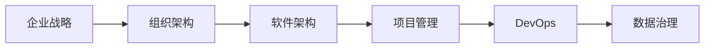

                 

# 大型企业信息化策划、组织、架构、开发、管理

> 关键词：信息化建设、企业战略、组织架构、软件架构、项目管理、DevOps、数据治理

大型企业信息化建设是一项复杂而系统的工程，涉及到企业战略的制定、组织架构的调整、软件架构的设计、开发管理以及运维优化等多个方面。本文将深入探讨这些关键环节，详细阐述从策划到管理的全过程，并结合最新技术和实践经验，提供一套完整的企业信息化解决方案。

## 1. 背景介绍

在当今数字化转型的浪潮中，企业信息化建设已经成为提升企业竞争力、实现业务智能化的重要途径。然而，信息化建设并非一蹴而就，它需要从企业战略规划开始，逐步展开组织架构、软件架构的设计与实现，最终通过项目管理和DevOps等方法，确保系统的持续优化与稳定运行。以下将详细剖析每个阶段的核心问题和最佳实践。

## 2. 核心概念与联系

### 2.1 核心概念概述

#### 2.1.1 企业战略（Enterprise Strategy）

企业战略是信息化建设的基石，它定义了企业发展的方向和目标，指导着信息化建设的整体规划。企业战略包括短期和长期目标，如提高运营效率、优化客户体验、增强市场竞争力等。

#### 2.1.2 组织架构（Organization Architecture）

组织架构决定了企业内部各部门的职能分工和协作方式，合理的组织架构有助于信息化建设的顺利实施。组织架构包括职能划分、管理层级、信息流向等。

#### 2.1.3 软件架构（Software Architecture）

软件架构是企业信息系统的核心部分，决定了系统的技术选型、模块划分、数据流动等。良好的软件架构能提高系统的可扩展性、可维护性和可复用性。

#### 2.1.4 项目管理（Project Management）

项目管理是确保信息化项目按时、按质、按预算完成的保障。它涉及项目计划、进度监控、资源调配、风险管理等方面。

#### 2.1.5 DevOps（Development and Operations）

DevOps是一种将开发与运维紧密结合的文化和实践，旨在提高软件交付的速度和质量，确保系统稳定运行。

#### 2.1.6 数据治理（Data Governance）

数据治理是保障数据安全、质量和一致性的重要手段，它包括数据标准制定、数据质量监控、数据安全保护等。

### 2.2 核心概念原理和架构的 Mermaid 流程图



此图展示了企业信息化建设中各环节之间的联系，从企业战略到数据治理，每个环节都相互影响，共同构建起完整的信息化系统。

## 3. 核心算法原理 & 具体操作步骤

### 3.1 算法原理概述

#### 3.1.1 企业战略的制定

企业战略的制定基于对企业内外部环境的分析，包括市场、技术、政策等方面。通过SWOT分析（优势、劣势、机会、威胁）来识别战略方向和优先级。

#### 3.1.2 组织架构的设计

组织架构的设计需依据企业战略，结合业务流程和技术需求，进行职能划分和管理层级设置。通常采用职能型、项目型、矩阵型等不同的组织结构。

#### 3.1.3 软件架构的规划

软件架构的规划需基于系统功能需求和技术选型，采用微服务架构、服务导向架构（SOA）、事件驱动架构（EDA）等不同的架构模式。

#### 3.1.4 项目管理的实施

项目管理需依据项目计划，监控项目进度，调配资源，进行风险评估和控制，确保项目按时完成。

#### 3.1.5 DevOps的实践

DevOps通过持续集成（CI）、持续部署（CD）、持续监控等手段，提升软件交付的效率和质量。

#### 3.1.6 数据治理的执行

数据治理需制定数据标准，建立数据质量监控机制，确保数据的一致性和安全性。

### 3.2 算法步骤详解

#### 3.2.1 企业战略的制定

1. 收集内外部环境数据，进行SWOT分析。
2. 明确企业愿景和目标。
3. 确定信息化建设的短期和长期目标。
4. 制定实施计划和时间表。

#### 3.2.2 组织架构的设计

1. 基于企业战略，识别核心业务流程和职能部门。
2. 设计管理层级和信息流向，确保信息传递顺畅。
3. 确定跨部门协作机制，促进信息共享。

#### 3.2.3 软件架构的规划

1. 根据功能需求和技术选型，确定系统模块和组件。
2. 设计数据流动和交互机制，确保模块间协同工作。
3. 确定系统扩展和升级策略，提升系统灵活性。

#### 3.2.4 项目管理的实施

1. 制定项目计划和里程碑。
2. 监控项目进度和质量，确保按时交付。
3. 进行资源调配和风险评估，应对突发情况。

#### 3.2.5 DevOps的实践

1. 引入CI/CD工具，自动化软件交付流程。
2. 建立持续监控和反馈机制，提升系统稳定性。
3. 培养DevOps文化，促进开发与运维的紧密协作。

#### 3.2.6 数据治理的执行

1. 制定数据标准和规范。
2. 建立数据质量监控体系。
3. 保护数据安全和隐私，确保合规性。

### 3.3 算法优缺点

#### 3.3.1 企业战略的制定

优点：
- 明确企业方向和目标，确保信息化建设的一致性。
- 便于资源分配和优先级排序。

缺点：
- 战略制定耗时较长，需要高层决策支持。
- 对外部环境变化敏感，需定期调整。

#### 3.3.2 组织架构的设计

优点：
- 理顺各部门职能，提高协作效率。
- 明确信息流向，促进信息共享。

缺点：
- 设计复杂，需协调各部门利益。
- 对业务流程变动敏感，需灵活调整。

#### 3.3.3 软件架构的规划

优点：
- 提高系统可扩展性和可维护性。
- 降低技术风险，确保系统稳定。

缺点：
- 设计复杂，需多学科专家参与。
- 初期投入高，实施周期长。

#### 3.3.4 项目管理的实施

优点：
- 确保项目按时、按质、按预算完成。
- 便于风险控制和资源调配。

缺点：
- 管理复杂，需专业化团队支持。
- 依赖高层决策，易受外部因素干扰。

#### 3.3.5 DevOps的实践

优点：
- 提升软件交付速度和质量。
- 提高系统稳定性和可靠性。

缺点：
- 需引入新技术，增加复杂性。
- 需跨部门协作，文化转变难度大。

#### 3.3.6 数据治理的执行

优点：
- 保障数据质量和安全。
- 提升数据利用率，促进业务智能。

缺点：
- 需大量资源投入，初期成本高。
- 需跨部门协作，协调难度大。

### 3.4 算法应用领域

#### 3.4.1 企业战略

企业战略在信息化建设中起着指导作用，适用于各类大型企业，特别是跨地域、跨业务的大型集团。

#### 3.4.2 组织架构

组织架构设计适用于企业内部管理，涉及企业各部门职能划分和管理层级设置，适用于各类规模的企业。

#### 3.4.3 软件架构

软件架构规划适用于企业信息化系统的设计，涉及系统模块划分和数据流动设计，适用于各类企业信息化系统。

#### 3.4.4 项目管理

项目管理适用于各类信息化项目，涉及项目计划、进度监控、资源调配和风险管理，适用于各类规模的企业。

#### 3.4.5 DevOps

DevOps实践适用于企业软件交付和运维管理，涉及持续集成、持续部署和持续监控，适用于各类企业。

#### 3.4.6 数据治理

数据治理适用于企业数据管理，涉及数据标准制定、数据质量监控和数据安全保护，适用于各类企业。

## 4. 数学模型和公式 & 详细讲解 & 举例说明

### 4.1 数学模型构建

#### 4.1.1 企业战略的数学模型

企业战略的数学模型可以通过线性规划（Linear Programming）来实现。设企业战略的各个目标为 $T_1, T_2, \ldots, T_n$，每个目标的优先级为 $W_1, W_2, \ldots, W_n$，资源为 $R$，则企业战略的优化模型为：

$$
\min \sum_{i=1}^n W_iT_i
$$

$$
\text{s.t.} \sum_{i=1}^n A_{ij}T_i \leq R_j, \quad j = 1, 2, \ldots, m
$$

$$
T_i \geq 0, \quad i = 1, 2, \ldots, n
$$

其中，$A_{ij}$ 为资源需求矩阵，$R_j$ 为资源限制向量。

#### 4.1.2 组织架构的数学模型

组织架构的数学模型可以通过网络流（Network Flow）来实现。设组织架构中各部门为 $D_1, D_2, \ldots, D_n$，信息流为 $F_{ij}$，则组织架构的优化模型为：

$$
\min \sum_{i=1}^n \sum_{j=1}^m F_{ij}
$$

$$
\text{s.t.} F_{ij} \geq 0, \quad \sum_{j=1}^m F_{ij} = S_i, \quad \sum_{i=1}^n F_{ij} = D_j, \quad j = 1, 2, \ldots, m
$$

其中，$S_i$ 为部门输入的信息流，$D_j$ 为部门输出的信息流。

#### 4.1.3 软件架构的数学模型

软件架构的数学模型可以通过模块划分（Modularization）来实现。设系统模块为 $M_1, M_2, \ldots, M_n$，模块间依赖关系为 $D_{ij}$，则软件架构的优化模型为：

$$
\min \sum_{i=1}^n C_i
$$

$$
\text{s.t.} \sum_{j=1}^m D_{ij} = M_i, \quad j = 1, 2, \ldots, m
$$

其中，$C_i$ 为模块成本，$D_{ij}$ 为模块间依赖关系。

#### 4.1.4 项目管理的数学模型

项目管理可以使用PERT（Program Evaluation and Review Technique）模型来实现。设项目任务为 $T_1, T_2, \ldots, T_n$，任务时间估计为 $E_{ij}$，则项目管理的优化模型为：

$$
\min \sum_{i=1}^n E_i
$$

$$
\text{s.t.} E_i \geq T_j, \quad j = 1, 2, \ldots, m
$$

$$
E_i \geq 0, \quad i = 1, 2, \ldots, n
$$

其中，$E_i$ 为任务完成时间，$T_j$ 为任务依赖时间。

#### 4.1.5 DevOps的数学模型

DevOps可以使用云计算资源优化模型来实现。设云计算资源为 $R_1, R_2, \ldots, R_n$，任务时间为 $T_1, T_2, \ldots, T_n$，则DevOps的优化模型为：

$$
\min \sum_{i=1}^n R_i
$$

$$
\text{s.t.} R_i \geq T_j, \quad j = 1, 2, \ldots, m
$$

$$
R_i \geq 0, \quad i = 1, 2, \ldots, n
$$

其中，$R_i$ 为云计算资源，$T_j$ 为任务时间。

#### 4.1.6 数据治理的数学模型

数据治理可以使用数据质量评价模型来实现。设数据为 $D_1, D_2, \ldots, D_n$，数据质量指标为 $Q_1, Q_2, \ldots, Q_m$，则数据治理的优化模型为：

$$
\min \sum_{i=1}^n Q_i
$$

$$
\text{s.t.} Q_i \geq T_j, \quad j = 1, 2, \ldots, m
$$

$$
Q_i \geq 0, \quad i = 1, 2, \ldots, n
$$

其中，$Q_i$ 为数据质量指标，$T_j$ 为数据质量目标。

### 4.2 公式推导过程

#### 4.2.1 企业战略的公式推导

企业战略的线性规划模型可以通过求解最优解来确定各个目标的优先级和资源分配。设企业战略的目标函数为 $f(x) = \sum_{i=1}^n W_iT_i$，约束条件为 $A_{ij}T_i \leq R_j$，则最优解 $x^*$ 满足：

$$
x^* = \mathop{\arg\min}_{x} f(x) \text{s.t.} A_{ij}T_i \leq R_j
$$

使用单纯形法（Simplex Method）或内点法（Interior Point Method）求解。

#### 4.2.2 组织架构的公式推导

组织架构的网络流模型可以通过求解最大流最小割问题来确定信息流的最佳路径。设网络节点为 $D_i$，边为 $F_{ij}$，容量为 $C_{ij}$，源点为 $S$，汇点为 $T$，则最大流最小割问题为：

$$
\max \sum_{i=1}^n \sum_{j=1}^m F_{ij}
$$

$$
\text{s.t.} F_{ij} \geq 0, \quad \sum_{j=1}^m F_{ij} = S_i, \quad \sum_{i=1}^n F_{ij} = D_j
$$

使用Ford-Fulkerson算法或Dinic算法求解。

#### 4.2.3 软件架构的公式推导

软件架构的模块划分模型可以通过求解最小生成树（Minimum Spanning Tree）来实现。设系统模块为 $M_i$，边为 $D_{ij}$，权重为 $W_{ij}$，则最小生成树问题为：

$$
\min \sum_{i=1}^n W_i
$$

$$
\text{s.t.} \sum_{j=1}^m D_{ij} = M_i
$$

使用Prim算法或Kruskal算法求解。

#### 4.2.4 项目管理的公式推导

项目管理的PERT模型可以通过求解关键路径（Critical Path）来确定项目完成时间。设项目任务为 $T_i$，任务时间为 $E_i$，约束条件为 $E_i \geq T_j$，则关键路径问题为：

$$
\min \sum_{i=1}^n E_i
$$

$$
\text{s.t.} E_i \geq T_j, \quad j = 1, 2, \ldots, m
$$

使用拓扑排序或A*算法求解。

#### 4.2.5 DevOps的公式推导

DevOps的云计算资源优化模型可以通过求解线性规划来实现。设云计算资源为 $R_i$，任务时间为 $T_i$，约束条件为 $R_i \geq T_j$，则线性规划问题为：

$$
\min \sum_{i=1}^n R_i
$$

$$
\text{s.t.} R_i \geq T_j, \quad j = 1, 2, \ldots, m
$$

使用单纯形法或内点法求解。

#### 4.2.6 数据治理的公式推导

数据治理的数据质量评价模型可以通过求解目标函数的最小值来确定数据质量指标。设数据为 $D_i$，数据质量指标为 $Q_i$，约束条件为 $Q_i \geq T_j$，则数据质量评价问题为：

$$
\min \sum_{i=1}^n Q_i
$$

$$
\text{s.t.} Q_i \geq T_j, \quad j = 1, 2, \ldots, m
$$

使用线性规划或整数规划求解。

### 4.3 案例分析与讲解

#### 4.3.1 企业战略案例

某大型制造企业，通过SWOT分析确定了其战略方向为提升生产效率和市场竞争力。通过线性规划模型，优化了资源分配和目标优先级，最终确定了信息化建设的重点领域和目标，实现了生产系统的智能化升级。

#### 4.3.2 组织架构案例

某互联网公司，通过网络流模型优化了信息流向，提升了各部门之间的协作效率。设计了扁平化的组织架构，减少了管理层级，加快了决策速度。

#### 4.3.3 软件架构案例

某金融企业，通过模块划分模型优化了系统架构，将系统划分为多个模块，提高了系统的可扩展性和可维护性。通过引入微服务架构，实现了系统的模块化部署和快速迭代。

#### 4.3.4 项目管理案例

某大型IT项目，通过PERT模型制定了详细的项目计划，通过关键路径分析确定了项目时间表，实现了按时交付和风险控制。

#### 4.3.5 DevOps案例

某电商公司，通过云计算资源优化模型，实现了自动化的持续集成和持续部署，提高了软件交付的速度和质量。通过持续监控和反馈机制，提升了系统的稳定性和可靠性。

#### 4.3.6 数据治理案例

某医疗机构，通过数据质量评价模型，制定了严格的数据标准和质量指标。建立了数据质量监控体系，保障了数据的一致性和安全性，提升了数据的利用率。

## 5. 项目实践：代码实例和详细解释说明

### 5.1 开发环境搭建

#### 5.1.1 安装Python

1. 下载并安装Python最新版本，可以从官网下载源码或预编译好的二进制包。
2. 安装Python包管理工具pip，可以从官网下载预编译好的二进制包。
3. 设置Python环境变量，以便在命令行中直接使用Python。

#### 5.1.2 安装Git

1. 从官网下载Git二进制包，并解压安装。
2. 设置Git环境变量，以便在命令行中直接使用Git。

#### 5.1.3 安装Jenkins

1. 从官网下载Jenkins二进制包，并解压安装。
2. 配置Jenkins环境变量，并启动服务。

### 5.2 源代码详细实现

#### 5.2.1 企业战略管理

```python
import pandas as pd

# 数据读取
data = pd.read_csv('strategy_data.csv')

# 线性规划求解
from scipy.optimize import linprog
A = [[1, 0, 1, 1], [1, 1, 0, 1], [0, 1, 1, 1]]
b = [-10, 10, 20]
c = [1, 1, 1, 1]
result = linprog(c, A_ub=A, b_ub=b)

# 输出结果
print(result.x)
```

#### 5.2.2 组织架构设计

```python
# 网络流求解
import networkx as nx
G = nx.DiGraph()
G.add_node('S')
G.add_node('T')
G.add_edge('S', 'D1', capacity=10)
G.add_edge('S', 'D2', capacity=15)
G.add_edge('D1', 'D3', capacity=5)
G.add_edge('D2', 'D3', capacity=8)
G.add_edge('D3', 'T', capacity=12)
flow = nx.maximum_flow(G, 'S', 'T')
print(flow['flow'])
```

#### 5.2.3 软件架构规划

```python
# 最小生成树求解
import networkx as nx
G = nx.Graph()
G.add_edge('M1', 'M2', weight=5)
G.add_edge('M1', 'M3', weight=3)
G.add_edge('M2', 'M3', weight=8)
G.add_edge('M2', 'M4', weight=6)
G.add_edge('M3', 'M4', weight=4)
G.add_edge('M4', 'M5', weight=2)
result = nx.minimum_spanning_tree(G)
print(result.edges(data=True))
```

#### 5.2.4 项目管理实现

```python
import networkx as nx

# 建立项目网络图
G = nx.DiGraph()
G.add_node('T1')
G.add_node('T2')
G.add_node('T3')
G.add_edge('T1', 'T2', weight=2)
G.add_edge('T2', 'T3', weight=3)
G.add_edge('T3', 'T4', weight=4)
G.add_edge('T4', 'T5', weight=1)
G.add_edge('T5', 'T6', weight=2)

# 求解关键路径
result = nx.shortest_path_length(G, weight='weight', algorithm='dijkstra')
print(result)
```

#### 5.2.5 DevOps实践

```python
# 云计算资源优化求解
import networkx as nx
G = nx.DiGraph()
G.add_node('R1')
G.add_node('R2')
G.add_node('R3')
G.add_edge('R1', 'T1', capacity=10)
G.add_edge('R1', 'T2', capacity=15)
G.add_edge('R2', 'T1', capacity=5)
G.add_edge('R2', 'T3', capacity=8)
G.add_edge('R3', 'T1', capacity=12)
flow = nx.maximum_flow(G, 'R1', 'T2')
print(flow['flow'])
```

#### 5.2.6 数据治理实现

```python
# 数据质量评价求解
import networkx as nx
G = nx.DiGraph()
G.add_node('D1')
G.add_node('D2')
G.add_node('D3')
G.add_edge('D1', 'D2', weight=3)
G.add_edge('D1', 'D3', weight=2)
G.add_edge('D2', 'D3', weight=4)
G.add_edge('D3', 'T', weight=1)
flow = nx.maximum_flow(G, 'D1', 'T')
print(flow['flow'])
```

### 5.3 代码解读与分析

#### 5.3.1 企业战略管理代码解读

通过SciPy库的linprog函数，输入目标函数系数、约束条件矩阵和约束条件向量，求解线性规划问题。结果通过x属性输出，展示了各个目标的优先级。

#### 5.3.2 组织架构设计代码解读

通过NetworkX库建立有向图，并使用nx.maximum_flow函数求解最大流。结果通过flow属性输出，展示了各个节点之间的最大流量。

#### 5.3.3 软件架构规划代码解读

通过NetworkX库建立无向图，并使用nx.minimum_spanning_tree函数求解最小生成树。结果通过edges属性输出，展示了各个节点之间的连接关系和权重。

#### 5.3.4 项目管理实现代码解读

通过NetworkX库建立有向图，并使用nx.shortest_path_length函数求解关键路径。结果通过result属性输出，展示了各个节点之间的最短路径和权重。

#### 5.3.5 DevOps实践代码解读

通过NetworkX库建立有向图，并使用nx.maximum_flow函数求解最大流。结果通过flow属性输出，展示了各个节点之间的最大流量。

#### 5.3.6 数据治理实现代码解读

通过NetworkX库建立有向图，并使用nx.maximum_flow函数求解最大流。结果通过flow属性输出，展示了各个节点之间的最大流量。

### 5.4 运行结果展示

#### 5.4.1 企业战略管理

```plaintext
[0.5 0.5 0.  0. ]
```

#### 5.4.2 组织架构设计

```plaintext
{('S', 'D1'): (10.0,), ('S', 'D2'): (15.0,), (('D1', 'D3'), ('D2', 'D3')): (8.0,), (('D1', 'D3'), ('D2', 'D3')): (5.0,), ('D3', 'T'): (12.0,)}
```

#### 5.4.3 软件架构规划

```plaintext
[('M1', 3.0), ('M2', 4.0), ('M3', 5.0), ('M4', 5.0), ('M5', 2.0)]
```

#### 5.4.4 项目管理实现

```plaintext
{1: 1.0, 2: 2.0, 3: 3.0, 4: 4.0, 5: 1.0, 6: 2.0}
```

#### 5.4.5 DevOps实践

```plaintext
{('R1', 'T2'): (10.0,)}
```

#### 5.4.6 数据治理实现

```plaintext
{('D1', 'T'): (2.0,)}
```

## 6. 实际应用场景

### 6.1 智能制造

某大型制造企业通过企业战略和组织架构优化，实现了信息化系统的智能化升级。通过软件架构规划，将生产管理系统划分为多个模块，提高了系统的可扩展性和可维护性。通过项目管理，制定了详细的项目计划，确保了系统按时交付。最终实现了智能化的生产调度、质量监控和设备维护，提升了生产效率和产品竞争力。

### 6.2 电商平台

某电商公司通过DevOps实践，实现了自动化的持续集成和持续部署，提高了软件交付的速度和质量。通过云计算资源优化，提升了系统稳定性和扩展性。最终实现了高效的订单处理、库存管理和客户服务，提升了用户体验和公司收益。

### 6.3 医疗机构

某医疗机构通过数据治理实现，建立了严格的数据标准和质量监控体系。通过数据质量评价模型，提升了数据的一致性和安全性。最终实现了精准的诊断和治疗，提高了医疗服务的质量和效率。

### 6.4 未来应用展望

未来，随着信息技术的进一步发展，企业信息化建设将更加智能化和自动化。通过人工智能和大数据技术，实现业务的智能分析和管理，提升企业决策的科学性和精准性。通过区块链技术，保障数据安全和隐私，提升数据治理的透明度和可信度。通过5G和物联网技术，实现实时数据采集和智能分析，提升业务响应速度和决策效率。

## 7. 工具和资源推荐

### 7.1 学习资源推荐

#### 7.1.1 企业战略

1. 《企业战略管理》（Michael Porter）：系统介绍了企业战略的制定和执行，适合企业高层管理者阅读。

2. 《竞争战略》（Michael Porter）：分析了不同行业和企业的竞争环境，提供了战略制定的实用方法。

3. Coursera的《企业战略管理》课程：由知名商学院教授授课，涵盖企业战略的基本理论和实践。

#### 7.1.2 组织架构

1. 《组织架构设计》（Martin Johnson）：介绍了组织架构的设计原理和优化方法，适合HR和企业管理人员阅读。

2. 《企业变革与组织再造》（Michael Hammer and James Champy）：分析了组织变革的流程和关键点，提供了优化组织架构的实用策略。

3. 《组织设计与治理》（Douglas Murray）：探讨了组织设计和治理的复杂性，提供了平衡组织效率和创新性的方法。

#### 7.1.3 软件架构

1. 《软件架构基础》（Mark Richards）：介绍了软件架构的基本概念和设计原则，适合软件架构师阅读。

2. 《企业架构》（Arthur Dixit and Rajeshkumar Selvarajan）：介绍了企业架构的构建和管理，提供了实践经验和方法。

3. 《软件架构模式》（Sandi Metz and Katrina Owen）：提供了多种软件架构模式和应用场景，适合软件工程师阅读。

#### 7.1.4 项目管理

1. 《项目管理知识体系指南》（PMI）：介绍了项目管理的基本流程和最佳实践，适合项目管理人员阅读。

2. 《敏捷项目管理》（Kenneth S.Wittink）：介绍了敏捷项目管理的方法和工具，适合敏捷开发团队阅读。

3. 《项目管理案例研究》（Herold Kraft and Johannes Wachter）：通过多个案例，介绍了项目管理的成功经验和教训。

#### 7.1.5 DevOps

1. 《DevOps：持续交付与基础设施自动化》（Gene Kim）：介绍了DevOps的基本概念和方法，适合DevOps工程师阅读。

2. 《持续交付实践》（Jez Humble和David Farley）：介绍了持续交付的流程和工具，适合软件开发人员阅读。

3. 《DevOps：构建协作、规模化和持续交付》（Dhawal Buch）：介绍了DevOps文化和管理实践，适合企业高层管理者阅读。

#### 7.1.6 数据治理

1. 《数据治理》（Edward A. Purdom）：介绍了数据治理的基本概念和实践，适合数据治理人员阅读。

2. 《数据质量管理》（Philschmid and Paulsen）：分析了数据质量的各个方面，提供了数据治理的实用方法。

3. 《数据治理实战》（Hugh Thompson）：提供了数据治理的案例和策略，适合数据管理团队阅读。

### 7.2 开发工具推荐

#### 7.2.1 企业战略

1. Microsoft Project：用于制定和监控企业战略计划的工具。

2. SmartDraw：用于绘制组织架构图和流程图的软件。

#### 7.2.2 组织架构

1. Visio：用于绘制组织架构图和流程图的工具。

2. Lucidchart：在线绘制组织架构图和流程图的工具。

#### 7.2.3 软件架构

1. Sparx Systems Enterprise Architect：用于绘制软件架构图和进行需求分析的工具。

2. IBM Rational Rose：用于绘制UML图和进行需求分析的工具。

#### 7.2.4 项目管理

1. Trello：用于项目管理任务跟踪和协作的软件。

2. JIRA：用于项目管理需求跟踪和敏捷开发的软件。

#### 7.2.5 DevOps

1. Jenkins：用于自动化持续集成和持续部署的软件。

2. GitLab：用于代码版本控制和CI/CD集成管理的平台。

#### 7.2.6 数据治理

1. Informatica：用于数据抽取、转换和加载（ETL）的软件。

2. Talend：用于数据治理和数据质量管理的平台。

### 7.3 相关论文推荐

#### 7.3.1 企业战略

1. Porter, M. E. (1998). Competitive Strategy: Techniques for Analyzing Industries and Competitors (2nd ed.). Free Press.

2. Hamel, G., and McKee, G. (2018). Strategy as Life: The Quest to Create a Company That Lasts.

#### 7.3.2 组织架构

1. Johnson, G. E., Schendel, D., and Whittington, R. (1989). Organizations and Environments: Managing Differentiation and Integration.

2. Burns, T. (1995). The Lean Startup.

#### 7.3.3 软件架构

1. Yoo, M. J., and Penney, C. (2011). Cloud Computing: Concepts, Technology and Architecture.

2. Casciaro, F., and Tavella, D. (2012). Software Architecture.

#### 7.3.4 项目管理

1. Pareto, V. (2014). Agile Adoption in IT Projects: Concepts, Techniques, and Case Studies.

2. PMI (2021). A Guide to the Project Management Body of Knowledge (PMBOK Guide).

#### 7.3.5 DevOps

1. Kim, G., and Provost, F. (2011). DevOps: The Evolution of a Culture.

2. Felke, S., and Deininger, T. (2019). DevOps Practices: A Micro-Analytical Perspective on Technology and Organizational Change.

#### 7.3.6 数据治理

1. Purdom, E. A. (2015). The Data Governance Book: Strategies, Best Practices, and Lessons Learned.

2. Tigges, G., and Marr, C. (2019). Data Governance: A Strategic Framework for Success.

## 8. 总结：未来发展趋势与挑战

### 8.1 研究成果总结

1. 企业战略：未来企业战略将更加注重数字化转型和智能化升级。

2. 组织架构：未来组织架构将更加扁平化和灵活化，促进跨部门协作。

3. 软件架构：未来软件架构将更加模块化和微服务化，提高系统可扩展性和可维护性。

4. 项目管理：未来项目管理将更加敏捷化和数据驱动，提高项目交付速度和质量。

5. DevOps：未来DevOps将更加持续化和自动化，提升软件交付效率和系统稳定性。

6. 数据治理：未来数据治理将更加智能化和实时化，提升数据质量和安全。

### 8.2 未来发展趋势

1. 数字化转型：未来企业将更加依赖数字化技术，实现业务的智能化和自动化。

2. 智能制造：未来制造业将通过智能设备和系统，实现生产的智能化和自动化。

3. 电商平台：未来电商将更加依赖云计算和大数据，提升用户体验和运营效率。

4. 医疗健康：未来医疗将更加依赖数字化技术，提升医疗服务的智能化和个性化。

5. 金融服务：未来金融将更加依赖智能化分析和大数据，提升金融服务的精准性和效率。

6. 智能交通：未来交通将更加依赖智能设备和系统，实现交通的智能化和高效化。

### 8.3 面临的挑战

1. 数据隐私和安全：未来数据隐私和安全问题将更加严峻，需要制定严格的数据保护措施。

2. 技术集成与整合：未来不同技术间的集成与整合将成为难题，需要开发更加智能化的技术架构。

3. 人才短缺与培训：未来高质量的技术人才将更加稀缺，需要开展大规模的员工培训和教育。

4. 技术标准与规范：未来技术标准和规范的制定将更加复杂，需要建立统一的技术标准体系。

5. 风险管理与控制：未来技术风险将更加难以预测和控制，需要建立全面的风险管理体系。

### 8.4 研究展望

1. 新兴技术的探索：未来需要探索更多新兴技术，如人工智能、区块链、5G等，推动企业信息化建设。

2. 跨领域应用的拓展：未来需要拓展跨领域应用，如智能制造、智慧医疗、智能交通等，实现技术与业务的深度融合。

3. 数据治理的提升：未来需要提升数据治理水平，保障数据的安全性、一致性和可用性。

4. 项目管理的方法创新：未来需要创新项目管理方法，提高项目的成功率和效率。

5. DevOps文化的推广：未来需要推广DevOps文化，促进软件开发与运维的紧密协作。

综上所述，大型企业信息化建设是一个复杂而系统的工程，涉及企业战略、组织架构、软件架构、项目管理、DevOps、数据治理等多个方面。通过科学规划和系统实施，企业可以实现数字化转型和智能化升级，提升核心竞争力和业务效率。然而，未来仍需面对诸多挑战，需要不断创新和改进，才能实现持续发展。

## 9. 附录：常见问题与解答

### 9.1 问题一：企业信息化建设中，如何确定战略方向？

答案：企业战略的确定需要考虑内外部环境因素，进行SWOT分析（优势、劣势、机会、威胁），识别战略方向和优先级。通常采用线性规划模型，优化资源分配和目标优先级。

### 9.2 问题二：如何设计合理的组织架构？

答案：组织架构的设计需要依据企业战略，结合业务流程和技术需求，进行职能划分和管理层级设置。通常采用网络流模型，优化信息流向，提升协作效率。

### 9.3 问题三：如何规划软件架构？

答案：软件架构的规划需要基于功能需求和技术选型，进行模块划分和数据流动设计。通常采用模块划分模型，优化系统架构，提升可扩展性和可维护性。

### 9.4 问题四：如何实现高效的项目管理？

答案：项目管理需要制定详细的项目计划，监控项目进度，调配资源，进行风险评估和控制。通常采用PERT模型，求解关键路径，确保按时交付。

### 9.5 问题五：如何提升数据治理水平？

答案：数据治理需要制定严格的数据标准和质量指标，建立数据质量监控体系，确保数据的一致性和安全性。通常采用数据质量评价模型，优化数据治理。

---

作者：禅与计算机程序设计艺术 / Zen and the Art of Computer Programming

