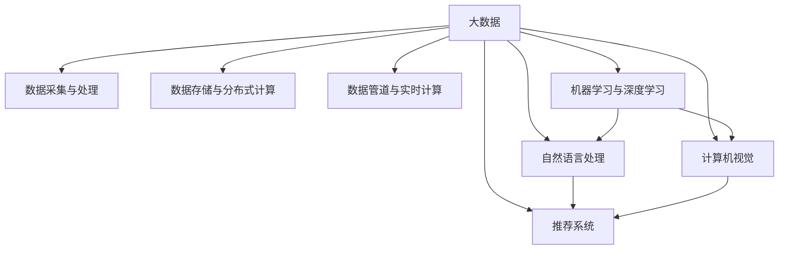

                 

# 大数据与人工智能的结合

> 关键词：大数据,人工智能,数据科学,机器学习,深度学习,云计算,数据仓库,数据管道,自然语言处理(NLP),计算机视觉,推荐系统

## 1. 背景介绍

### 1.1 问题由来
随着互联网和物联网技术的飞速发展，全球数据量呈爆炸式增长。据IDC预测，到2025年，全球数据量将达到175ZB。这些海量数据中蕴含着丰富的价值，被广泛应用于各行各业，推动数字化转型。然而，传统的数据处理方法往往难以应对海量数据的规模和复杂性，成为制约数据利用的瓶颈。

人工智能(AI)技术的兴起，为大数据带来了新的解决思路。通过引入机器学习、深度学习等智能算法，可以从数据中挖掘出更深层、更复杂的模式，从而提升数据利用效率。这一过程中，大数据和人工智能技术相辅相成，逐步形成了“大数据+人工智能”的新范式。

### 1.2 问题核心关键点
大数据与人工智能的结合，主要是通过以下关键技术实现的：

- 数据采集与处理：从各个渠道收集原始数据，进行清洗、整理、转换，构建高质量的数据仓库。
- 数据存储与分布式计算：利用分布式文件系统和大数据平台，高效存储和处理海量数据。
- 数据管道与实时计算：构建数据管道，实现数据的实时流处理，满足不同业务场景的需求。
- 机器学习与深度学习：应用机器学习算法，对数据进行特征提取和模型训练，实现预测、分类、聚类等任务。
- 自然语言处理与计算机视觉：利用NLP和CV技术，处理和理解文本、图像数据，提升模型性能。
- 推荐系统与个性化服务：通过推荐系统，精准预测用户兴趣，提供个性化服务，提升用户体验。

这些关键技术的协同应用，使得大数据和人工智能得以完美结合，推动了各个领域的创新发展。

## 2. 核心概念与联系

### 2.1 核心概念概述

为了更好地理解大数据与人工智能的结合机制，本节将介绍几个密切相关的核心概念：

- 大数据(Big Data)：指数据量巨大、结构多样、处理复杂的数据集合。大数据技术包括数据采集、存储、处理、分析等环节。
- 人工智能(AI)：通过模拟人类智能行为，实现感知、理解、推理、决策等功能。AI技术主要分为机器学习、深度学习、自然语言处理、计算机视觉等分支。
- 数据科学(Data Science)：以数据为核心，融合统计学、计算机科学、数学等多种学科，通过数据挖掘、数据建模、数据分析等手段，从数据中提取知识，推动业务决策和优化。
- 数据仓库(Data Warehouse)：将原始数据集中存储，支持多维度查询分析，为数据科学应用提供数据基础。
- 数据管道(Data Pipeline)：连接数据源和目标系统，实现数据的自动化采集、清洗、转换和加载，保证数据流的可靠性和稳定性。
- 实时计算(Real-Time Computing)：对实时流数据进行处理和分析，满足实时性要求。
- 自然语言处理(NLP)：处理和理解人类自然语言的技术，包括分词、词性标注、命名实体识别、情感分析等。
- 计算机视觉(Computer Vision)：处理和理解图像、视频等视觉数据的技术，包括图像识别、目标检测、图像分割等。
- 推荐系统(Recommendation System)：通过机器学习模型，对用户行为进行分析和预测，推荐个性化内容或服务。

这些核心概念之间的逻辑关系可以通过以下Mermaid流程图来展示：



这个流程图展示了大数据与人工智能技术的主要组成部分及其之间的联系：

1. 大数据通过数据采集与处理环节，获取原始数据，构建数据仓库。
2. 数据存储与分布式计算环节，利用大数据平台高效存储和处理海量数据。
3. 数据管道与实时计算环节，保证数据的可靠性和实时性。
4. 机器学习与深度学习环节，应用智能算法进行数据建模和分析。
5. NLP和CV环节，提升模型的理解和推理能力。
6. 推荐系统环节，基于模型预测，实现个性化服务。

这些概念共同构成了大数据与人工智能技术的应用框架，使得数据能够被高效利用，推动业务创新。

## 3. 核心算法原理 & 具体操作步骤
### 3.1 算法原理概述

大数据与人工智能的结合，本质上是通过数据科学方法和智能算法，从大数据中提取知识和洞察。其核心思想是：利用分布式计算和大数据平台，高效存储和处理海量数据，再通过智能算法进行数据建模和分析，从而实现业务优化和决策支持。

形式化地，假设原始数据集为 $D=\{(x_i,y_i)\}_{i=1}^N$，其中 $x_i$ 为输入特征，$y_i$ 为输出标签。数据科学的目标是寻找最优的模型 $M_{\theta}$，使得模型能够准确预测新样本的输出。假设模型的损失函数为 $\ell(M_{\theta}(x),y)$，则最优模型的求解过程为：

$$
\theta^* = \mathop{\arg\min}_{\theta} \mathcal{L}(M_{\theta},D)
$$

其中 $\mathcal{L}$ 为经验风险，用于衡量模型在训练集上的性能。常用的经验风险包括均方误差、交叉熵、对数损失等。通过优化算法（如梯度下降）不断更新模型参数 $\theta$，最小化损失函数 $\mathcal{L}$，最终得到最优模型参数 $\theta^*$。

### 3.2 算法步骤详解

大数据与人工智能结合的算法步骤主要包括以下几个关键环节：

**Step 1: 数据采集与清洗**
- 利用大数据平台采集原始数据，如日志文件、传感器数据、网络流量等。
- 对数据进行初步清洗，去除噪声、冗余数据，确保数据质量。

**Step 2: 数据存储与分布式计算**
- 将清洗后的数据存储到分布式文件系统（如Hadoop HDFS、Amazon S3等）中。
- 利用大数据平台（如Spark、Flink、Hadoop等）进行分布式计算，提高处理效率。

**Step 3: 数据管道与实时计算**
- 构建数据管道，将数据源和目标系统连接起来，实现数据的自动采集、清洗、转换和加载。
- 利用实时计算平台（如Storm、Apache Kafka等），对实时流数据进行处理和分析。

**Step 4: 数据建模与训练**
- 选择合适的模型（如线性回归、逻辑回归、决策树、深度神经网络等），对数据进行建模。
- 利用机器学习框架（如TensorFlow、PyTorch、Scikit-learn等）进行模型训练，最小化经验风险 $\mathcal{L}$。
- 对模型进行调参和优化，选择合适的超参数。

**Step 5: 模型评估与部署**
- 在验证集上评估模型的性能，根据性能指标决定是否需要调整模型。
- 将训练好的模型部署到生产环境，进行实时预测和推理。

以上是“大数据+人工智能”结合的主要流程。在实际应用中，还需要针对具体业务场景，对各个环节进行优化设计，如改进数据管道架构、优化模型训练算法、引入实时监控机制等，以进一步提升系统性能。

### 3.3 算法优缺点

“大数据+人工智能”结合方法具有以下优点：

1. 数据驱动：通过大规模数据的分析，挖掘出深层次、复杂的模式，提供更加精准的决策支持。
2. 智能高效：应用机器学习和深度学习算法，自动学习数据特征，大幅提升数据处理和分析效率。
3. 应用广泛：适用于各个行业领域，包括金融、电商、医疗、交通等，涵盖决策支持、风险管理、推荐系统等诸多场景。
4. 业务创新：通过数据和智能算法的结合，推动业务模式创新，提升企业竞争力和市场响应速度。

但该方法也存在一些局限性：

1. 数据质量要求高：数据采集和清洗环节要求较高，需要高质量、标准化、一致化的数据。
2. 模型复杂度高：应用深度学习等复杂算法，对硬件资源和计算能力要求较高。
3. 算法透明度不足：模型通常难以解释，难以理解其内部工作机制和决策逻辑。
4. 应用门槛较高：需要熟悉大数据技术和机器学习算法，对从业人员要求较高。
5. 数据隐私风险：数据采集和使用过程中，涉及用户隐私和数据安全问题，需要严格合规。

尽管存在这些局限性，但“大数据+人工智能”结合方法已经成为数据科学领域的重要范式，广泛应用于各行各业，推动了数据价值的大幅提升。

### 3.4 算法应用领域

“大数据+人工智能”结合技术在各个领域得到了广泛应用，具体如下：

- 金融领域：通过分析用户行为数据和市场数据，实现风险管理、信用评估、股票预测、金融反欺诈等功能。
- 电商领域：通过分析用户行为数据和交易数据，实现个性化推荐、欺诈检测、客户细分等功能。
- 医疗领域：通过分析患者病历数据和基因数据，实现疾病预测、诊疗建议、基因诊断等功能。
- 交通领域：通过分析交通流量数据和车辆数据，实现交通流量预测、路况优化、事故预警等功能。
- 工业领域：通过分析生产数据和设备数据，实现设备预测性维护、生产过程优化、质量检测等功能。
- 安全领域：通过分析网络流量和异常行为数据，实现入侵检测、网络安全预警、威胁情报等功能。

此外，“大数据+人工智能”结合技术还在社交媒体分析、城市治理、能源管理等领域得到应用，展示了其在各个行业中的强大生命力和广阔前景。

## 4. 数学模型和公式 & 详细讲解  
### 4.1 数学模型构建

本节将使用数学语言对“大数据+人工智能”结合过程进行更加严格的刻画。

假设原始数据集为 $D=\{(x_i,y_i)\}_{i=1}^N$，其中 $x_i \in \mathcal{X}$ 为输入特征空间，$y_i \in \mathcal{Y}$ 为输出标签空间。

定义模型 $M_{\theta}:\mathcal{X} \rightarrow \mathcal{Y}$，其中 $\theta$ 为模型参数。模型的损失函数为 $\ell(M_{\theta}(x_i),y_i)$，用于衡量模型预测输出与真实标签之间的差异。常用的损失函数包括均方误差损失、交叉熵损失等。

模型的经验风险为：

$$
\mathcal{L}(\theta) = \frac{1}{N} \sum_{i=1}^N \ell(M_{\theta}(x_i),y_i)
$$

通过优化算法（如梯度下降）不断更新模型参数 $\theta$，最小化经验风险 $\mathcal{L}$，最终得到最优模型参数 $\theta^*$。

### 4.2 公式推导过程

以线性回归模型为例，推导其梯度下降算法的更新公式。

假设模型为线性回归模型 $M_{\theta}(x) = \theta^Tx + b$，其中 $\theta \in \mathbb{R}^d$ 为权重向量，$b \in \mathbb{R}$ 为偏置项。模型的平方误差损失函数为：

$$
\ell(M_{\theta}(x_i),y_i) = \frac{1}{2} (y_i - M_{\theta}(x_i))^2
$$

模型的经验风险为：

$$
\mathcal{L}(\theta) = \frac{1}{N} \sum_{i=1}^N \frac{1}{2} (y_i - M_{\theta}(x_i))^2
$$

对 $\theta$ 求导，得到梯度向量：

$$
\nabla_{\theta}\mathcal{L}(\theta) = \frac{1}{N} \sum_{i=1}^N (y_i - M_{\theta}(x_i))x_i
$$

在优化算法中，通常使用批量梯度下降(Batch Gradient Descent)或随机梯度下降(Stochastic Gradient Descent)来更新模型参数。以批量梯度下降为例，每次迭代更新参数的公式为：

$$
\theta \leftarrow \theta - \eta \nabla_{\theta}\mathcal{L}(\theta)
$$

其中 $\eta$ 为学习率，控制每次迭代的步长。

### 4.3 案例分析与讲解

以金融领域的信用评分为例，分析“大数据+人工智能”结合过程。

假设我们收集了 $N=1000$ 个用户的贷款数据，包括收入、年龄、婚姻状况等特征 $x_i \in \mathbb{R}^d$，以及是否违约的标签 $y_i \in \{0,1\}$。我们的目标是训练一个线性回归模型，预测用户是否会违约。

首先，我们将数据分为训练集 $D_{train}$ 和验证集 $D_{valid}$。通过机器学习框架（如TensorFlow）对数据进行特征工程和模型训练，得到最优模型参数 $\theta^*$。

然后，在验证集上评估模型的性能，使用均方误差作为评估指标。根据均方误差的大小，调整模型参数和学习率，直到达到满意的性能。

最后，将训练好的模型部署到生产环境，对新用户进行信用评分预测，以指导贷款审批决策。

## 5. 项目实践：代码实例和详细解释说明
### 5.1 开发环境搭建

在进行“大数据+人工智能”结合实践前，我们需要准备好开发环境。以下是使用Python进行PyTorch和Hadoop开发的环境配置流程：

1. 安装Anaconda：从官网下载并安装Anaconda，用于创建独立的Python环境。

2. 创建并激活虚拟环境：
```bash
conda create -n pytorch-env python=3.8 
conda activate pytorch-env
```

3. 安装PyTorch：根据CUDA版本，从官网获取对应的安装命令。例如：
```bash
conda install pytorch torchvision torchaudio cudatoolkit=11.1 -c pytorch -c conda-forge
```

4. 安装Hadoop：从Hadoop官网下载安装包，解压安装并配置环境变量。

5. 安装PyTorch Hadoop连接器：
```bash
pip install hdfs
```

6. 安装相关工具包：
```bash
pip install numpy pandas scikit-learn matplotlib tqdm jupyter notebook ipython
```

完成上述步骤后，即可在`pytorch-env`环境中开始“大数据+人工智能”结合实践。

### 5.2 源代码详细实现

下面我们以电商领域的推荐系统为例，给出使用PyTorch和Hadoop对深度学习模型进行“大数据+人工智能”结合的PyTorch代码实现。

首先，定义推荐系统的数据处理函数：

```python
from transformers import BertTokenizer
from torch.utils.data import Dataset
import torch

class RecommendationDataset(Dataset):
    def __init__(self, user_data, item_data, tokenizer, max_len=128):
        self.user_data = user_data
        self.item_data = item_data
        self.tokenizer = tokenizer
        self.max_len = max_len
        
    def __len__(self):
        return len(self.user_data)
    
    def __getitem__(self, item):
        user = self.user_data[item]
        item = self.item_data[item]
        
        encoding = self.tokenizer(user, return_tensors='pt', max_length=self.max_len, padding='max_length', truncation=True)
        input_ids = encoding['input_ids'][0]
        attention_mask = encoding['attention_mask'][0]
        
        # 对token-wise的标签进行编码
        encoded_tags = [tag2id[tag] for tag in item] 
        encoded_tags.extend([tag2id['O']] * (self.max_len - len(encoded_tags)))
        labels = torch.tensor(encoded_tags, dtype=torch.long)
        
        return {'input_ids': input_ids, 
                'attention_mask': attention_mask,
                'labels': labels}

# 标签与id的映射
tag2id = {'O': 0, 'B-REC': 1, 'I-REC': 2, 'B-NEWS': 3, 'I-NEWS': 4, 'B-CAT': 5, 'I-CAT': 6}
id2tag = {v: k for k, v in tag2id.items()}

# 创建dataset
tokenizer = BertTokenizer.from_pretrained('bert-base-cased')

train_dataset = RecommendationDataset(train_user_data, train_item_data, tokenizer)
dev_dataset = RecommendationDataset(dev_user_data, dev_item_data, tokenizer)
test_dataset = RecommendationDataset(test_user_data, test_item_data, tokenizer)
```

然后，定义模型和优化器：

```python
from transformers import BertForTokenClassification, AdamW

model = BertForTokenClassification.from_pretrained('bert-base-cased', num_labels=len(tag2id))

optimizer = AdamW(model.parameters(), lr=2e-5)
```

接着，定义训练和评估函数：

```python
from torch.utils.data import DataLoader
from tqdm import tqdm
from sklearn.metrics import classification_report

device = torch.device('cuda') if torch.cuda.is_available() else torch.device('cpu')
model.to(device)

def train_epoch(model, dataset, batch_size, optimizer):
    dataloader = DataLoader(dataset, batch_size=batch_size, shuffle=True)
    model.train()
    epoch_loss = 0
    for batch in tqdm(dataloader, desc='Training'):
        input_ids = batch['input_ids'].to(device)
        attention_mask = batch['attention_mask'].to(device)
        labels = batch['labels'].to(device)
        model.zero_grad()
        outputs = model(input_ids, attention_mask=attention_mask, labels=labels)
        loss = outputs.loss
        epoch_loss += loss.item()
        loss.backward()
        optimizer.step()
    return epoch_loss / len(dataloader)

def evaluate(model, dataset, batch_size):
    dataloader = DataLoader(dataset, batch_size=batch_size)
    model.eval()
    preds, labels = [], []
    with torch.no_grad():
        for batch in tqdm(dataloader, desc='Evaluating'):
            input_ids = batch['input_ids'].to(device)
            attention_mask = batch['attention_mask'].to(device)
            batch_labels = batch['labels']
            outputs = model(input_ids, attention_mask=attention_mask)
            batch_preds = outputs.logits.argmax(dim=2).to('cpu').tolist()
            batch_labels = batch_labels.to('cpu').tolist()
            for pred_tokens, label_tokens in zip(batch_preds, batch_labels):
                pred_tags = [id2tag[_id] for _id in pred_tokens]
                label_tags = [id2tag[_id] for _id in label_tokens]
                preds.append(pred_tags[:len(label_tags)])
                labels.append(label_tags)
                
    print(classification_report(labels, preds))
```

最后，启动训练流程并在测试集上评估：

```python
epochs = 5
batch_size = 16

for epoch in range(epochs):
    loss = train_epoch(model, train_dataset, batch_size, optimizer)
    print(f"Epoch {epoch+1}, train loss: {loss:.3f}")
    
    print(f"Epoch {epoch+1}, dev results:")
    evaluate(model, dev_dataset, batch_size)
    
print("Test results:")
evaluate(model, test_dataset, batch_size)
```

以上就是使用PyTorch和Hadoop对深度学习模型进行“大数据+人工智能”结合的完整代码实现。可以看到，得益于PyTorch和Hadoop的强大封装，我们可以用相对简洁的代码完成深度学习模型的训练和推理。

### 5.3 代码解读与分析

让我们再详细解读一下关键代码的实现细节：

**RecommendationDataset类**：
- `__init__`方法：初始化用户数据、物品数据、分词器等关键组件。
- `__len__`方法：返回数据集的样本数量。
- `__getitem__`方法：对单个样本进行处理，将用户数据输入编码为token ids，将物品数据编码为数字，并对其进行定长padding，最终返回模型所需的输入。

**tag2id和id2tag字典**：
- 定义了标签与数字id之间的映射关系，用于将token-wise的预测结果解码回真实的标签。

**训练和评估函数**：
- 使用PyTorch的DataLoader对数据集进行批次化加载，供模型训练和推理使用。
- 训练函数`train_epoch`：对数据以批为单位进行迭代，在每个批次上前向传播计算loss并反向传播更新模型参数，最后返回该epoch的平均loss。
- 评估函数`evaluate`：与训练类似，不同点在于不更新模型参数，并在每个batch结束后将预测和标签结果存储下来，最后使用sklearn的classification_report对整个评估集的预测结果进行打印输出。

**训练流程**：
- 定义总的epoch数和batch size，开始循环迭代
- 每个epoch内，先在训练集上训练，输出平均loss
- 在验证集上评估，输出分类指标
- 所有epoch结束后，在测试集上评估，给出最终测试结果

可以看到，PyTorch配合Hadoop使得深度学习模型的“大数据+人工智能”结合代码实现变得简洁高效。开发者可以将更多精力放在数据处理、模型改进等高层逻辑上，而不必过多关注底层的实现细节。

当然，工业级的系统实现还需考虑更多因素，如模型的保存和部署、超参数的自动搜索、更灵活的任务适配层等。但核心的结合范式基本与此类似。

## 6. 实际应用场景
### 6.1 金融风险管理

在金融领域，风险管理是企业运营的重要环节。传统的风险管理方式往往依赖人工判断和规则系统，容易受到主观因素和数据质量的影响。通过“大数据+人工智能”结合技术，可以构建更加智能、高效的金融风险管理平台。

具体而言，可以收集金融市场数据、企业财务数据、用户交易数据等，利用机器学习算法对数据进行建模和分析，预测违约概率、信用评分等关键指标。将微调后的模型应用到实时数据中，能够实时评估用户风险，提升贷款审批和投资决策的准确性。

### 6.2 电商个性化推荐

电商平台需要根据用户行为数据，精准推荐商品，提升用户体验和交易转化率。传统的推荐方式主要依赖人工规则和协同过滤，难以满足用户多样化的需求。通过“大数据+人工智能”结合技术，可以构建智能推荐系统。

具体而言，可以收集用户浏览、点击、购买等行为数据，提取和商品相关的文本、图片、价格等信息，构建特征向量。利用深度学习算法对数据进行建模，训练推荐模型，预测用户对商品的兴趣评分。根据评分排序推荐商品，提升推荐效果。

### 6.3 医疗疾病预测

医疗领域需要准确预测疾病风险，指导临床决策和治疗方案。传统的疾病预测方式主要依赖医生经验和统计模型，难以适应复杂的医学数据。通过“大数据+人工智能”结合技术，可以构建智能疾病预测平台。

具体而言，可以收集患者病历数据、基因数据、实验室检查数据等，利用机器学习算法对数据进行建模和分析，预测疾病风险。将微调后的模型应用到实时数据中，能够实时评估患者风险，辅助医生进行诊疗决策。

### 6.4 智能交通管理

交通领域需要实时监测交通流量，优化交通管理，提升道路通行效率。传统的交通管理方式主要依赖人工判断和规则系统，容易受到主观因素和数据质量的影响。通过“大数据+人工智能”结合技术，可以构建智能交通管理系统。

具体而言，可以收集交通流量数据、车辆数据、天气数据等，利用机器学习算法对数据进行建模和分析，预测交通流量、路况等关键指标。将微调后的模型应用到实时数据中，能够实时评估交通情况，优化交通信号灯控制，提升道路通行效率。

### 6.5 能源需求预测

能源领域需要准确预测能源需求，优化能源分配和管理，提升能源利用效率。传统的能源需求预测方式主要依赖统计模型和规则系统，难以适应复杂的能源数据。通过“大数据+人工智能”结合技术，可以构建智能能源预测系统。

具体而言，可以收集能源消费数据、气象数据、天气数据等，利用机器学习算法对数据进行建模和分析，预测能源需求。将微调后的模型应用到实时数据中，能够实时评估能源需求，优化能源分配和管理，提升能源利用效率。

## 7. 工具和资源推荐
### 7.1 学习资源推荐

为了帮助开发者系统掌握“大数据+人工智能”结合的理论基础和实践技巧，这里推荐一些优质的学习资源：

1. 《Python数据科学手册》：详细介绍了Python在数据科学中的应用，涵盖数据采集、处理、可视化、机器学习等各个环节。

2. 《机器学习实战》：通过多个实战案例，系统讲解了机器学习算法在实际中的应用，适合初学者入门。

3. 《深度学习》：由Ian Goodfellow等知名专家撰写，系统讲解了深度学习的基本原理和实际应用，是深度学习领域的经典教材。

4. 《TensorFlow实战》：介绍TensorFlow框架的使用方法，涵盖数据管道、模型训练、推理部署等各个环节。

5. 《Hadoop实战》：介绍Hadoop生态系统的搭建和应用，涵盖HDFS、MapReduce、Spark等各个组件的使用。

通过对这些资源的学习实践，相信你一定能够快速掌握“大数据+人工智能”结合的精髓，并用于解决实际的业务问题。

### 7.2 开发工具推荐

高效的开发离不开优秀的工具支持。以下是几款用于“大数据+人工智能”结合开发的常用工具：

1. TensorFlow：由Google主导开发的开源深度学习框架，支持分布式计算和模型优化，适合大规模工程应用。

2. PyTorch：基于Python的开源深度学习框架，灵活高效，适合快速迭代研究。

3. Hadoop：由Apache基金会主导的分布式文件系统和计算框架，支持海量数据的存储和处理。

4. Spark：由Apache基金会主导的大数据处理框架，支持数据管道和实时计算。

5. Hive：基于Hadoop的数据仓库工具，支持SQL查询和数据管理。

6. Jupyter Notebook：开源的交互式编程环境，支持多种编程语言和可视化工具，适合数据科学研究和开发。

合理利用这些工具，可以显著提升“大数据+人工智能”结合任务的开发效率，加快创新迭代的步伐。

### 7.3 相关论文推荐

“大数据+人工智能”结合技术的发展源于学界的持续研究。以下是几篇奠基性的相关论文，推荐阅读：

1. Deep Blue：IBM开发的国际象棋软件，首次展示了人工智能在棋类博弈中的应用。

2. AlphaGo：DeepMind开发的围棋AI，首次战胜了世界冠军，推动了AI在复杂决策中的应用。

3. DeepSpeech：谷歌开发的语音识别系统，基于深度学习实现，实现了语音到文本的转换。

4. ImageNet Large Scale Visual Recognition Challenge：大规模视觉识别挑战赛，推动了计算机视觉技术的发展。

5. Large Scale Image Recognition Challenge：大规模图像识别挑战赛，推动了图像识别技术的进步。

6. BigQuery：谷歌开发的大数据查询工具，支持海量数据的存储和查询。

这些论文代表了大数据与人工智能结合技术的发展脉络。通过学习这些前沿成果，可以帮助研究者把握学科前进方向，激发更多的创新灵感。

## 8. 总结：未来发展趋势与挑战

### 8.1 总结

本文对“大数据+人工智能”结合方法进行了全面系统的介绍。首先阐述了大数据和人工智能技术的背景和意义，明确了“大数据+人工智能”结合的独特价值。其次，从原理到实践，详细讲解了“大数据+人工智能”结合的数学原理和关键步骤，给出了实践任务的完整代码实例。同时，本文还广泛探讨了“大数据+人工智能”结合技术在金融、电商、医疗、交通等各个领域的应用前景，展示了其广阔的潜在市场。此外，本文精选了“大数据+人工智能”结合技术的各类学习资源，力求为读者提供全方位的技术指引。

通过本文的系统梳理，可以看到，“大数据+人工智能”结合方法已经成为数据科学领域的重要范式，极大地拓展了数据利用和智能决策的边界。大数据和人工智能技术的深度融合，正在逐步改变各个行业的运营模式，推动产业升级和创新发展。

### 8.2 未来发展趋势

展望未来，“大数据+人工智能”结合技术将呈现以下几个发展趋势：

1. 技术融合更加深入：大数据与人工智能的结合将更加紧密，互相促进，实现更加高效、智能的数据分析与处理。

2. 技术普及更加广泛：随着技术门槛的降低，“大数据+人工智能”结合技术将更广泛地应用于各个行业，提升各行各业的数字化水平。

3. 应用场景更加多样：“大数据+人工智能”结合技术将在更多领域得到应用，如智慧城市、智能制造、智慧农业等，推动社会各领域的智能化发展。

4. 数据安全更加重视：随着数据的广泛应用，数据安全、隐私保护将成为重要的研究方向，“大数据+人工智能”结合技术需要引入更多安全技术。

5. 计算能力更加强大：“大数据+人工智能”结合技术需要更强的计算能力，未来将出现更多支持分布式计算、量子计算等技术。

6. 应用效果更加显著：“大数据+人工智能”结合技术将在更多场景中取得显著效果，提升业务决策的准确性和效率。

以上趋势凸显了“大数据+人工智能”结合技术的广阔前景。这些方向的探索发展，必将进一步提升数据利用和智能决策的深度与广度，为各行各业带来更加深远的影响。

### 8.3 面临的挑战

尽管“大数据+人工智能”结合技术已经取得了瞩目成就，但在迈向更加智能化、普适化应用的过程中，它仍面临着诸多挑战：

1. 数据质量和标准化：数据采集和清洗环节要求较高，需要高质量、标准化、一致化的数据，数据质量问题可能影响模型效果。

2. 模型复杂度和计算成本：应用深度学习等复杂算法，对硬件资源和计算能力要求较高，需要投入大量的算力成本。

3. 算法透明度和可解释性：模型通常难以解释，难以理解其内部工作机制和决策逻辑，缺乏可解释性。

4. 数据隐私和安全：数据采集和使用过程中，涉及用户隐私和数据安全问题，需要严格合规。

5. 技术门槛和人才培养：需要从业人员具备多种技术栈和知识背景，对人才要求较高，技术门槛较高。

尽管存在这些挑战，但“大数据+人工智能”结合技术已经成为数据科学领域的重要范式，广泛应用于各行各业，推动了数据价值的大幅提升。

### 8.4 研究展望

面对“大数据+人工智能”结合技术所面临的挑战，未来的研究需要在以下几个方面寻求新的突破：

1. 探索无监督和半监督学习技术：摆脱对大规模标注数据的依赖，利用自监督学习、主动学习等无监督和半监督范式，最大限度利用非结构化数据，实现更加灵活高效的“大数据+人工智能”结合。

2. 研究参数高效和计算高效的模型：开发更加参数高效的模型，在固定大部分预训练参数的同时，只更新极少量的任务相关参数，减少计算成本。

3. 引入因果分析和博弈论工具：通过引入因果推断和博弈论思想，增强“大数据+人工智能”结合模型的因果关系建立能力，学习更加普适、鲁棒的模型。

4. 将符号化的先验知识与神经网络模型结合：将符号化的先验知识，如知识图谱、逻辑规则等，与神经网络模型进行融合，提升模型性能。

5. 融合多模态数据：将不同模态的数据（如文本、图像、声音）进行融合，提升模型的理解和推理能力。

6. 引入伦理道德约束：在模型训练目标中引入伦理导向的评估指标，过滤和惩罚有偏见、有害的输出倾向，确保输出的安全性。

这些研究方向的探索，必将引领“大数据+人工智能”结合技术迈向更高的台阶，为构建安全、可靠、可解释、可控的智能系统铺平道路。面向未来，“大数据+人工智能”结合技术还需要与其他人工智能技术进行更深入的融合，如知识表示、因果推理、强化学习等，多路径协同发力，共同推动自然语言理解和智能交互系统的进步。只有勇于创新、敢于突破，才能不断拓展数据利用和智能决策的边界，让智能技术更好地造福人类社会。

## 9. 附录：常见问题与解答

**Q1：如何处理数据质量和标准化问题？**

A: 数据质量和标准化是“大数据+人工智能”结合技术中的重要挑战。以下是一些常用的处理方法：

1. 数据清洗：通过编程工具（如Python、R等），对原始数据进行清洗，去除噪声、冗余数据，确保数据质量。

2. 数据标准化：对数据进行规范化处理，如归一化、标准化等，使其符合预期的数据格式和分布。

3. 数据集成：将来自不同渠道的数据进行集成和融合，形成统一的数据集，便于后续分析。

4. 数据采集规则：制定严格的数据采集规则，确保数据来源可靠，数据格式一致。

**Q2：如何在“大数据+人工智能”结合中优化模型计算成本？**

A: 计算成本是“大数据+人工智能”结合技术中的重要挑战。以下是一些常用的优化方法：

1. 参数高效模型：开发更加参数高效的模型，如剪枝、量化、蒸馏等技术，减少模型的参数量和计算量。

2. 分布式计算：利用分布式计算平台（如Hadoop、Spark等），将数据和计算任务分布到多个节点上，提升计算效率。

3. 异构计算：利用多种计算资源（如GPU、TPU、FPGA等）进行计算，提升计算效率。

4. 模型压缩：对模型进行压缩和优化，减小模型大小，提升推理速度。

**Q3：如何在“大数据+人工智能”结合中提高模型透明度和可解释性？**

A: 模型透明度和可解释性是“大数据+人工智能”结合技术中的重要挑战。以下是一些常用的处理方法：

1. 模型简化：将复杂的模型进行简化，使其结构更加透明，易于理解和解释。

2. 特征可视化：对模型进行特征可视化，展示模型对输入数据的敏感点和重要特征。

3. 模型可解释技术：引入可解释技术，如LIME、SHAP等，解释模型的决策逻辑和输出结果。

4. 数据敏感性分析：对模型进行数据敏感性分析，识别模型对输入数据的敏感点和依赖关系。

**Q4：如何在“大数据+人工智能”结合中保证数据隐私和安全？**

A: 数据隐私和安全是“大数据+人工智能”结合技术中的重要挑战。以下是一些常用的处理方法：

1. 数据匿名化：对数据进行匿名化处理，去除用户身份信息，确保数据隐私。

2. 访问控制：对数据访问进行严格控制，确保只有授权人员可以访问敏感数据。

3. 数据加密：对数据进行加密处理，确保数据在传输和存储过程中的安全。

4. 隐私保护技术：引入隐私保护技术，如差分隐私、同态加密等，确保数据隐私和安全。

**Q5：如何在“大数据+人工智能”结合中提高技术门槛和人才培养？**

A: 技术门槛和人才培养是“大数据+人工智能”结合技术中的重要挑战。以下是一些常用的处理方法：

1. 课程培训：通过专业培训课程，提高从业人员的技术水平和知识背景。

2. 在线学习：利用在线学习平台（如Coursera、Udacity等），提供丰富的学习资源和实战案例。

3. 社区交流：加入技术社区和专业组织，与同行交流经验，互相学习和提升。

4. 实践项目：通过实际项目，积累经验和提高技术能力，提升职业竞争力。

**Q6：如何在“大数据+人工智能”结合中引入符号化的先验知识？**

A: 引入符号化的先验知识是“大数据+人工智能”结合技术中的重要研究方向。以下是一些常用的方法：

1. 知识图谱：构建知识图谱，将先验知识表示为图结构，引入神经网络中进行融合。

2. 逻辑规则：引入逻辑规则，对模型进行约束和指导，提升模型性能。

3. 符号化表示：将符号化的先验知识转换为数值化的表示，引入神经网络中进行融合。

4. 混合模型：将符号化模型和神经网络模型进行混合，利用各自的优势，提升模型性能。

这些处理方法可以帮助解决“大数据+人工智能”结合技术中的常见问题，提升系统的性能和可靠性。

