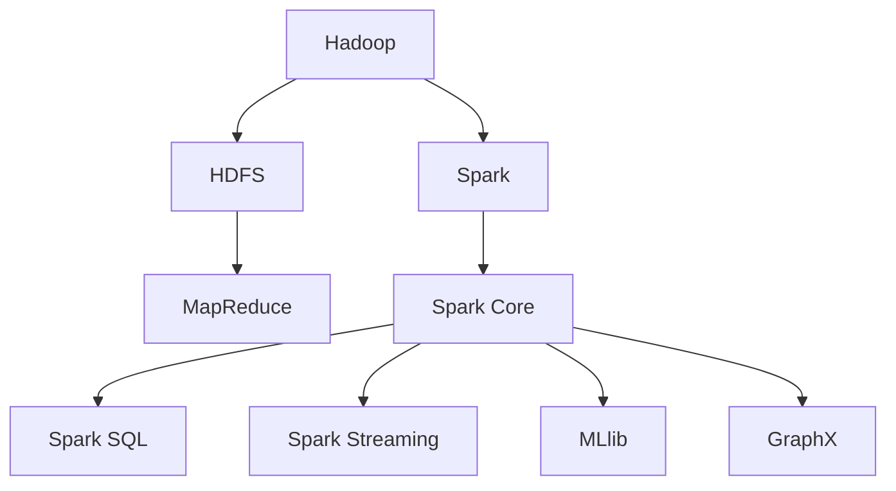

                 

## 1. 背景介绍

### 1.1 问题由来
随着互联网的迅猛发展，数据量呈现爆炸性增长，如何高效处理、分析和利用海量数据，成为各行各业亟需解决的问题。传统的单机数据处理方式已难以应对大规模数据的挑战，需要一种能处理海量数据，具备高可扩展性和高容错性的分布式计算框架。

### 1.2 问题核心关键点
目前业界应用最广泛的两大数据处理框架是Apache Hadoop和Apache Spark，它们均采用了分布式计算的思想，在处理大规模数据方面表现出色。

Hadoop是一个开源的分布式计算框架，由HDFS（Hadoop分布式文件系统）和MapReduce（一种分布式计算模型）组成。Spark是一个快速的通用分布式计算系统，基于内存计算，提供了更高效的数据处理能力。

### 1.3 问题研究意义
理解Hadoop和Spark的原理和应用，对于开发高效的大数据处理系统，优化大数据应用性能，具有重要意义。掌握这两大框架，有助于提升数据处理和分析的效率，支撑企业实现数字化转型，推进智慧城市、智能制造等新兴领域的创新发展。

## 2. 核心概念与联系

### 2.1 核心概念概述

为更好地理解Hadoop和Spark的工作原理和应用方法，本节将介绍几个密切相关的核心概念：

- Hadoop：一个开源的分布式计算框架，由HDFS和MapReduce组成。HDFS负责存储和管理大规模数据，MapReduce负责在大规模数据集上并行计算。
- Spark：一个快速的通用分布式计算系统，基于内存计算，支持多种编程语言和丰富的计算模型。Spark的核心组件包括Spark Core、Spark SQL、Spark Streaming、MLlib、GraphX等。
- MapReduce：一种分布式计算模型，由Map和Reduce两个步骤组成。Map负责将大规模数据集划分为小的子集并行处理，Reduce负责将Map的结果合并为一个全局结果。
- Spark Core：Spark的核心组件，提供通用的并行计算抽象。支持多种数据集操作和转换，包括RDD（弹性分布式数据集）和DataFrame。
- HDFS：Hadoop的分布式文件系统，提供高容错性、高可靠性的数据存储服务。HDFS通过多个数据节点存储数据，确保数据的冗余备份。
- Spark Streaming：Spark的数据流处理组件，支持实时数据处理和分析，适用于大规模流数据处理。
- MLlib：Spark的机器学习库，提供丰富的机器学习算法和工具，支持从数据预处理到模型训练的全流程。
- GraphX：Spark的图处理组件，支持图形数据集和图算法的操作。

这些核心概念之间的逻辑关系可以通过以下Mermaid流程图来展示：



这个流程图展示了大数据处理框架的核心概念及其之间的关系：

1. Hadoop通过HDFS存储数据，MapReduce处理数据。
2. Spark基于内存计算，提供了Spark Core、Spark SQL、Spark Streaming等组件，支持数据处理、流处理和机器学习等多种计算模型。
3. Spark Core提供弹性分布式数据集(RDD)和数据框架(DataFrame)，支持灵活的数据处理和转换。
4. Spark SQL提供SQL查询接口，简化数据处理过程。
5. Spark Streaming支持实时数据流处理，处理大规模流数据。
6. MLlib提供机器学习算法和工具，支持从数据预处理到模型训练的全流程。
7. GraphX支持图形数据集和图算法的操作，便于处理图结构数据。

这些核心概念共同构成了大数据处理框架的计算和存储基础，使得Hadoop和Spark能够高效处理大规模数据，支持各种计算任务。

## 3. 核心算法原理 & 具体操作步骤
### 3.1 算法原理概述

Hadoop和Spark的数据处理算法原理主要基于分布式计算和内存计算的思想。下面详细解释这两大框架的核心算法和具体操作步骤。

### 3.2 算法步骤详解

#### Hadoop的MapReduce模型

Hadoop的MapReduce模型由两个核心步骤组成：Map和Reduce。Map负责将大规模数据集划分为小的子集并行处理，Reduce负责将Map的结果合并为一个全局结果。

1. Map阶段：
   - 输入：大规模数据集，被拆分为多个小的子集。
   - 输出：Map函数对每个子集进行处理，产生若干个键值对(key-value pair)。

2. Shuffle阶段：
   - 对Map函数的输出进行排序和分组，以便Reduce函数能够正确地合并结果。

3. Reduce阶段：
   - 对Shuffle阶段产生的键值对进行汇总和合并，最终得到全局结果。

#### Spark的内存计算

Spark的内存计算基于弹性分布式数据集(RDD)，支持快速的迭代式计算。Spark Core提供了多种操作，支持从数据预处理到模型训练的全流程。

1. 数据存储和分布式计算：
   - RDD存储在Hadoop的分布式文件系统HDFS中，并支持分布式计算。

2. 内存计算和数据转换：
   - Spark使用内存计算，通过分布式缓存和延迟计算，减少了数据读写和网络传输的开销，提升了计算效率。

3. Spark SQL和DataFrame：
   - Spark SQL提供了SQL查询接口，支持使用SQL语言进行数据处理和分析。
   - DataFrame是Spark的核心数据结构，提供高效的数据处理和转换功能。

### 3.3 算法优缺点

Hadoop和Spark在数据处理方面各有优缺点：

#### Hadoop的优缺点

优点：
- 数据存储和分布式计算：Hadoop的HDFS提供高可靠性和高容错性的数据存储服务。
- 适用于批处理任务：MapReduce模型适用于大规模批处理任务，处理数据量大、处理时间较长。

缺点：
- 计算速度较慢：由于数据存储在磁盘上，MapReduce的计算速度较慢，难以处理实时数据。
- 资源管理复杂：Hadoop的资源管理依赖于YARN（Yet Another Resource Negotiator），配置和管理相对复杂。

#### Spark的优缺点

优点：
- 内存计算：Spark使用内存计算，提升数据处理速度。
- 实时数据处理：Spark Streaming支持实时数据流处理，适合处理流数据。

缺点：
- 数据存储和分布式计算：Spark的内存计算对内存资源要求较高，适用于小规模数据的处理。
- 成本较高：Spark需要较高的硬件资源和存储成本，特别是用于大规模数据处理时。

### 3.4 算法应用领域

Hadoop和Spark在数据处理和分析方面广泛应用，适用于各种行业和场景。

#### Hadoop的应用领域

- 大数据存储和处理：Hadoop的HDFS和MapReduce适用于大规模数据的存储和处理。
- 日志处理和分析：Hadoop可以处理企业日志数据，进行监控和分析。
- 批处理和数据挖掘：Hadoop适用于离线批处理和数据挖掘任务。

#### Spark的应用领域

- 实时数据处理：Spark Streaming适用于实时数据流处理，支持实时计算和分析。
- 机器学习和深度学习：Spark MLlib提供丰富的机器学习算法和工具，支持从数据预处理到模型训练的全流程。
- 图处理：GraphX支持图形数据集和图算法的操作，适用于图结构数据的处理。

## 4. 数学模型和公式 & 详细讲解  
### 4.1 数学模型构建

本节将使用数学语言对Hadoop和Spark的数据处理过程进行更加严格的刻画。

#### Hadoop的MapReduce模型

MapReduce模型的数学表达如下：

- Input：$D = \{(x_i, y_i)\}_{i=1}^N$，其中$x_i$为输入数据，$y_i$为输入数据的标签。
- Map函数：$f(x_i) = (x_i', y_i')$，其中$x_i'$为中间结果。
- Shuffle阶段：将Map函数的结果按照键(key)进行分组，得到新的中间结果。
- Reduce函数：$g(x_i', y_i') = (z_i, \hat{y}_i)$，其中$z_i$为合并后的结果，$\hat{y}_i$为合并后的标签。

#### Spark的内存计算

Spark的内存计算模型可以表示为：

- Input：$D = \{(x_i, y_i)\}_{i=1}^N$，其中$x_i$为输入数据，$y_i$为输入数据的标签。
- RDD：$RDD = D$，表示分布式数据集。
- Transformation：$\tilde{RDD} = \{(x_i', y_i')\}_{i=1}^N$，其中$x_i'$为中间结果。
- Action：$\{z_i, \hat{y}_i\}_{i=1}^N$，表示最终结果。

### 4.2 公式推导过程

#### Hadoop的MapReduce模型

MapReduce模型的推导过程如下：

1. Map函数：$f(x_i) = (x_i', y_i')$
2. Shuffle阶段：将Map函数的结果按照键(key)进行分组，得到新的中间结果。
3. Reduce函数：$g(x_i', y_i') = (z_i, \hat{y}_i)$

#### Spark的内存计算

Spark的内存计算模型推导过程如下：

1. RDD：$RDD = D$
2. Transformation：$\tilde{RDD} = \{(x_i', y_i')\}_{i=1}^N$
3. Action：$\{z_i, \hat{y}_i\}_{i=1}^N$

### 4.3 案例分析与讲解

#### Hadoop的案例分析

假设有一批电影评论数据，需要进行情感分析。可以按照Map函数将评论文本映射为情感标签，使用Reduce函数合并结果，得到整体情感分析结果。

- Input：$D = \{(x_i, y_i)\}_{i=1}^N$
- Map函数：$f(x_i) = (x_i', y_i')$
- Shuffle阶段：按照情感标签分组
- Reduce函数：$g(x_i', y_i') = (z_i, \hat{y}_i)$

#### Spark的案例分析

假设有一批实时流数据，需要进行流式处理。可以使用Spark Streaming处理实时数据流，提取关键字段进行计算和分析。

- Input：$D = \{(x_i, y_i)\}_{i=1}^N$
- RDD：$RDD = D$
- Transformation：$\tilde{RDD} = \{(x_i', y_i')\}_{i=1}^N$
- Action：$\{z_i, \hat{y}_i\}_{i=1}^N$

## 5. 项目实践：代码实例和详细解释说明
### 5.1 开发环境搭建

在进行Hadoop和Spark的开发和实验前，需要先搭建好开发环境。以下是搭建Hadoop和Spark开发环境的详细步骤：

1. 安装JDK：由于Hadoop和Spark都是基于Java开发的，需要先安装JDK。可以从Oracle官网下载安装包，并进行配置。
2. 安装Hadoop：可以从Apache官网下载安装包，并进行配置。
3. 安装Spark：可以从Apache官网下载安装包，并进行配置。
4. 安装Hive和HBase：Hive和HBase是Hadoop生态系统中的重要组件，可以从Apache官网下载安装包，并进行配置。
5. 配置环境变量：在.bashrc或.bash_profile中添加Hadoop和Spark的配置信息，以便系统能够找到相关工具和库。

完成以上步骤后，即可开始Hadoop和Spark的开发和实验。

### 5.2 源代码详细实现

下面以Hadoop的MapReduce模型为例，给出Hadoop代码实现。

```java
import java.io.IOException;
import org.apache.hadoop.io.*;
import org.apache.hadoop.mapreduce.*;

public class MapReduceExample extends MapReduceBase implements Mapper<LongWritable, Text, Text, IntWritable>, Reducer<Text, IntWritable, Text, IntWritable> {

    public void map(LongWritable key, Text value, Context context) throws IOException, InterruptedException {
        String line = value.toString();
        String[] fields = line.split(",");
        String word = fields[0];
        int count = 1;
        context.write(new Text(word), new IntWritable(count));
    }

    public void reduce(Text key, Iterable<IntWritable> values, Context context) throws IOException, InterruptedException {
        int sum = 0;
        for (IntWritable value : values) {
            sum += value.get();
        }
        context.write(new Text(key), new IntWritable(sum));
    }

    public static void main(String[] args) throws Exception {
        Configuration conf = new Configuration();
        Job job = Job.getInstance(conf, "MapReduce Example");
        job.setJarByClass(MapReduceExample.class);
        job.setMapperClass(MapReduceExample.class);
        job.setReducerClass(MapReduceExample.class);
        job.setOutputKeyClass(Text.class);
        job.setOutputValueClass(IntWritable.class);
        FileInputFormat.addInputPath(job, new Path(args[0]));
        FileOutputFormat.setOutputPath(job, new Path(args[1]));
        System.exit(job.waitForCompletion(true) ? 0 : 1);
    }
}
```

### 5.3 代码解读与分析

以上代码是一个简单的MapReduce例子，用于计算输入文件中每个单词出现的次数。具体实现如下：

- Mapper类：负责将输入数据分片，并根据自定义的业务逻辑进行Map处理。
- Reducer类：负责将Mapper的输出结果进行归并，得到最终的结果。
- main方法：设置作业的基本信息，包括作业名称、输入输出路径等。

可以看到，Hadoop的MapReduce框架使用Java语言编写，包括Mapper、Reducer和main方法等核心组件，具有高度的灵活性和可扩展性。

## 6. 实际应用场景
### 6.1 智能制造

智能制造是大数据应用的重要场景之一，Hadoop和Spark在其中扮演了关键角色。智能制造涉及多个环节的数据采集、存储、处理和分析，包括设备状态监测、工艺优化、生产调度等。

Hadoop和Spark可以高效处理这些大规模、多源异构的数据，提供实时数据流处理和批处理计算能力，支持智能制造系统的数据管理和分析。通过Hadoop的HDFS存储和管理数据，Spark进行数据分析和计算，可以实现生产设备和工艺的优化，提升生产效率和质量。

### 6.2 智慧城市

智慧城市是另一个大数据应用的重要场景，涉及城市交通、公共安全、环境监测等多个领域。Hadoop和Spark可以高效处理海量实时数据，支持智慧城市的各种应用。

例如，通过Hadoop的HDFS存储和管理城市交通数据，Spark进行数据分析和计算，可以实现交通流量监测、交通信号优化、城市安全预警等功能。Hadoop和Spark还可以支持城市数据的可视化分析，帮助城市管理者进行决策。

### 6.3 金融行业

金融行业是大数据应用的重要行业之一，涉及客户行为分析、风险管理、投资决策等多个环节。Hadoop和Spark可以高效处理金融行业的海量数据，支持金融行业的各种应用。

例如，通过Hadoop的HDFS存储和管理金融数据，Spark进行数据分析和计算，可以实现客户行为分析、信用评分、风险预警等功能。Hadoop和Spark还可以支持金融数据的可视化分析，帮助金融决策者进行决策。

### 6.4 未来应用展望

未来，随着数据量的不断增长和计算需求的日益多样化，Hadoop和Spark将继续发挥重要作用，支持各种行业和场景的大数据处理和分析。

- 边缘计算：未来，随着IoT设备的普及，边缘计算将越来越重要。Hadoop和Spark可以在边缘节点上进行数据处理和计算，提升计算效率和数据安全。
- 人工智能：未来，AI技术将与Hadoop和Spark深度融合，支持更复杂、更高效的数据处理和分析。例如，使用Spark MLlib进行机器学习和深度学习，实现数据挖掘和预测分析。
- 大数据平台：未来，Hadoop和Spark将与其他大数据技术深度融合，构建更高效、更易用的大数据平台。例如，使用Hive和Pig进行数据处理，使用HBase进行数据存储和管理。

## 7. 工具和资源推荐
### 7.1 学习资源推荐

为了帮助开发者系统掌握Hadoop和Spark的理论基础和实践技巧，这里推荐一些优质的学习资源：

1. Hadoop官方文档：Hadoop官方文档详细介绍了Hadoop的架构和用法，是Hadoop开发的必备资料。
2. Spark官方文档：Spark官方文档详细介绍了Spark的架构和用法，是Spark开发的必备资料。
3. Hadoop和Spark入门教程：众多在线平台提供了丰富的Hadoop和Spark入门教程，适合初学者学习。
4. Hadoop和Spark实战项目：诸多在线平台提供了丰富的Hadoop和Spark实战项目，适合进阶开发者学习。
5. Hadoop和Spark相关书籍：《Hadoop权威指南》、《Spark实战》等书籍，提供了详细的Hadoop和Spark开发实践经验。

通过对这些资源的学习实践，相信你一定能够快速掌握Hadoop和Spark的核心技术，并用于解决实际的大数据处理问题。

### 7.2 开发工具推荐

高效的开发离不开优秀的工具支持。以下是几款用于Hadoop和Spark开发的常用工具：

1. Hadoop CLI：Hadoop提供的命令行工具，可以方便地进行Hadoop的部署和管理。
2. Spark Shell：Spark提供的交互式命令行工具，方便进行Spark的开发和调试。
3. Hive：Hadoop的数据仓库工具，支持SQL查询和数据处理。
4. Pig：Hadoop的数据流处理工具，支持数据流的处理和分析。
5. Sqoop：Hadoop的数据导入导出工具，支持将数据从关系型数据库导入Hadoop，从Hadoop导出数据。
6. Zeppelin：Hadoop和Spark的可视化工具，支持Jupyter Notebook的开发和调试。

合理利用这些工具，可以显著提升Hadoop和Spark开发的效率，加快创新迭代的步伐。

### 7.3 相关论文推荐

Hadoop和Spark的研究始于学界的持续研究。以下是几篇奠基性的相关论文，推荐阅读：

1. MapReduce: Simplified Data Processing on Large Clusters：这篇论文提出了MapReduce模型，奠定了Hadoop的分布式计算基础。
2. Spark: Cluster Computing with Fault Tolerance：这篇论文介绍了Spark的核心组件和分布式计算模型，奠定了Spark的基础。
3. Hadoop: Simplified Data Processing on Large Clusters：这篇论文详细介绍了Hadoop的架构和用法，是Hadoop开发的必备资料。
4. Spark: Fast and Distributed Data Processing with Delay Scheduling：这篇论文介绍了Spark的内存计算和分布式调度，是Spark开发的必备资料。
5. Hive: A Hive of Bees for Apache Hadoop：这篇论文介绍了Hive的数据仓库功能和SQL查询，是Hive开发的必备资料。

这些论文代表了大数据处理框架的发展脉络。通过学习这些前沿成果，可以帮助研究者把握学科前进方向，激发更多的创新灵感。

## 8. 总结：未来发展趋势与挑战
### 8.1 总结

本文对Hadoop和Spark的原理和应用进行了全面系统的介绍。首先阐述了Hadoop和Spark的研究背景和意义，明确了这两大数据处理框架在处理大规模数据方面的独特价值。其次，从原理到实践，详细讲解了Hadoop和Spark的数学模型和核心算法，给出了代码实现和详细解释。同时，本文还广泛探讨了Hadoop和Spark在智能制造、智慧城市、金融行业等多个行业领域的应用前景，展示了大数据处理框架的广阔前景。

通过本文的系统梳理，可以看到，Hadoop和Spark已经成为大数据处理的重要范式，极大地拓展了数据处理和分析的边界，推动了各行各业的数字化转型。未来，伴随大数据技术的不断进步，Hadoop和Spark必将在更多行业和场景中发挥重要作用，成为构建智慧世界的关键基础设施。

### 8.2 未来发展趋势

展望未来，Hadoop和Spark在数据处理方面将呈现以下几个发展趋势：

1. 分布式计算和内存计算：未来的数据处理框架将继续采用分布式计算和内存计算，提升数据处理速度和效率。例如，使用Spark Streaming进行实时数据流处理，使用Spark Core进行快速迭代计算。
2. 云计算和边缘计算：未来的数据处理框架将继续支持云计算和边缘计算，支持分布式数据处理和计算。例如，使用云平台进行数据存储和管理，使用边缘节点进行数据处理和计算。
3. 数据湖和数据仓库：未来的数据处理框架将继续支持数据湖和数据仓库，支持大规模数据的存储、管理和分析。例如，使用Hive和Pig进行数据处理，使用HBase进行数据存储和管理。
4. 人工智能和大数据融合：未来的数据处理框架将继续支持人工智能和大数据融合，提升数据分析和处理能力。例如，使用Spark MLlib进行机器学习和深度学习，实现数据挖掘和预测分析。
5. 实时数据处理和流处理：未来的数据处理框架将继续支持实时数据处理和流处理，支持实时数据分析和计算。例如，使用Spark Streaming进行实时数据流处理，支持实时计算和分析。

以上趋势凸显了Hadoop和Spark在大数据处理中的重要地位。这些方向的探索发展，必将进一步提升大数据处理和分析的效率，支撑各行各业的数字化转型。

### 8.3 面临的挑战

尽管Hadoop和Spark在数据处理方面取得了巨大成功，但在迈向更加智能化、普适化应用的过程中，仍面临诸多挑战：

1. 计算资源瓶颈：大规模数据处理对计算资源的需求极高，Hadoop和Spark需要高效利用计算资源，避免资源浪费和瓶颈。
2. 数据存储和管理：大规模数据的存储和管理是Hadoop和Spark的重要挑战，需要高效的数据存储和管理策略，确保数据的可靠性和可用性。
3. 数据安全和隐私：大规模数据的处理和分析涉及数据安全和隐私问题，需要建立完善的数据安全和管理机制。
4. 应用场景复杂性：不同行业和场景的数据处理需求各不相同，Hadoop和Spark需要灵活应对各种复杂的业务需求。
5. 生态系统和工具链：Hadoop和Spark需要丰富的生态系统和工具链，支持各种业务场景和应用。

正视Hadoop和Spark面临的这些挑战，积极应对并寻求突破，将使其在大数据处理中发挥更大的作用，推动各行各业的数字化转型。相信随着学界和产业界的共同努力，这些挑战终将一一被克服，Hadoop和Spark必将在大数据处理中发挥更加重要的作用。

### 8.4 研究展望

未来的研究需要在以下几个方面寻求新的突破：

1. 分布式计算和内存计算：开发更加高效、灵活的分布式计算和内存计算模型，提升数据处理效率和性能。
2. 云计算和边缘计算：研究云计算和边缘计算的应用，提升数据处理和计算的灵活性和可扩展性。
3. 数据安全和隐私：研究数据安全和隐私保护技术，确保数据处理的安全性和隐私性。
4. 人工智能和大数据融合：研究人工智能和大数据融合技术，提升数据分析和处理能力。
5. 实时数据处理和流处理：研究实时数据处理和流处理技术，支持实时计算和分析。

这些研究方向将引领Hadoop和Spark的发展方向，推动大数据处理和分析技术的进步，为各行各业提供更加高效、可靠的数据处理服务。

## 9. 附录：常见问题与解答
### 9.1 Q1：Hadoop和Spark有什么区别？

A：Hadoop和Spark都是大数据处理框架，但它们的工作原理和应用场景有所不同。Hadoop使用MapReduce模型，支持大规模批处理计算，适用于大规模数据存储和处理。Spark使用内存计算，支持实时数据流处理和迭代式计算，适用于实时数据处理和机器学习。

### 9.2 Q2：Hadoop和Spark的优缺点是什么？

A：Hadoop和Spark在数据处理方面各有优缺点：

- Hadoop的优点：数据存储和分布式计算、适用于大规模批处理任务、开源社区活跃、生态系统完善。
- Hadoop的缺点：计算速度较慢、资源管理复杂、不适合实时数据处理。

- Spark的优点：内存计算、实时数据流处理、迭代式计算、适用于机器学习和深度学习。
- Spark的缺点：数据存储和分布式计算、适用于小规模数据的处理、资源消耗较大、成本较高。

### 9.3 Q3：Hadoop和Spark的典型应用场景是什么？

A：Hadoop和Spark在数据处理和分析方面广泛应用，适用于各种行业和场景：

- Hadoop的典型应用场景：大规模数据存储和处理、日志处理和分析、批处理和数据挖掘。
- Spark的典型应用场景：实时数据流处理、机器学习和深度学习、图形数据处理。

### 9.4 Q4：如何优化Hadoop和Spark的性能？

A：优化Hadoop和Spark的性能需要从多个方面进行：

- 数据本地性优化：优化数据的存储和分布，提高数据访问效率。
- 任务调度优化：优化任务的调度策略，提升任务的执行效率。
- 内存管理优化：优化内存的使用和管理，提升内存计算的效率。
- 资源管理优化：优化资源的分配和管理，提升计算资源的利用率。

### 9.5 Q5：如何应对Hadoop和Spark的挑战？

A：应对Hadoop和Spark的挑战需要从多个方面进行：

- 计算资源瓶颈：优化计算资源的使用和管理，避免资源浪费和瓶颈。
- 数据存储和管理：优化数据存储和管理策略，确保数据的可靠性和可用性。
- 数据安全和隐私：建立完善的数据安全和隐私保护机制，确保数据处理的安全性和隐私性。
- 应用场景复杂性：灵活应对各种复杂的业务需求，优化数据处理算法和模型。

---

作者：禅与计算机程序设计艺术 / Zen and the Art of Computer Programming

