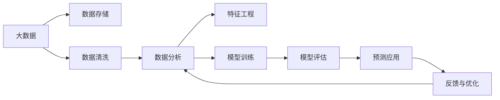

                 

# 大数据驱动AI学习的可能性

> 关键词：大数据, AI学习, 算法, 数据分析, 机器学习, 深度学习, 数据科学, 预测模型

## 1. 背景介绍

随着大数据时代的到来，人类社会生产生活中的数据量呈指数级增长，数据驱动决策的重要性愈发凸显。同时，人工智能（AI）技术在机器学习、深度学习、自然语言处理等领域的快速发展，也为企业和政府提供了强大的数据驱动的决策支持。本文档将重点探讨如何在大数据驱动下，利用AI技术提升决策效率和质量，实现业务智能化转型。

## 2. 核心概念与联系

### 2.1 核心概念概述

- **大数据（Big Data）**：指传统数据处理应用软件无法有效处理的海量、高速、多样化的数据集合，要求实时分析、存储、处理和优化数据。
- **AI学习（Artificial Intelligence Learning）**：指通过机器学习、深度学习等方法，让计算机系统从数据中学习规律，并实现智能决策的过程。
- **算法（Algorithm）**：指完成特定任务的计算步骤或程序，包括监督学习、无监督学习、强化学习等。
- **数据分析（Data Analysis）**：指通过统计、计算、数据挖掘等方法，从数据中提取有用信息的过程。
- **机器学习（Machine Learning）**：指使计算机系统从数据中自动学习规律并实现预测或决策的过程。
- **深度学习（Deep Learning）**：指基于神经网络，模仿人脑神经系统处理数据的方法，用于图像识别、语音识别、自然语言处理等领域。
- **数据科学（Data Science）**：指通过数据科学方法，分析和解释数据，实现数据驱动的决策过程。
- **预测模型（Predictive Model）**：指基于历史数据，预测未来行为或结果的模型，常用于客户行为预测、市场趋势预测等领域。

这些概念之间相互联系，共同构成了大数据驱动AI学习的核心框架，如图2-1所示。



## 3. 核心算法原理 & 具体操作步骤

### 3.1 算法原理概述

在大数据驱动下，AI学习的核心在于从海量数据中挖掘有用信息，并用于模型训练和决策支持。常用的算法包括监督学习、无监督学习和强化学习等。监督学习通过标注数据，让模型学习输入与输出的映射关系，常用于分类和回归问题。无监督学习不需要标注数据，模型自动从数据中学习特征和结构，常用于聚类、降维等问题。强化学习通过奖励机制，让模型学习如何在特定环境下做出最优决策，常用于游戏、机器人控制等领域。

### 3.2 算法步骤详解

#### 3.2.1 数据收集

在大数据驱动下，数据收集是第一步，通常采用ETL（Extract, Transform, Load）流程完成。具体步骤如下：

1. **数据提取（Extract）**：从多个数据源（如数据库、API、传感器等）获取数据，使用API、爬虫等方法获取公开数据。
2. **数据清洗（Transform）**：清洗数据中的缺失值、噪声、异常值等，确保数据的质量。
3. **数据加载（Load）**：将清洗后的数据存储到数据仓库中，如Hadoop、Spark等。

#### 3.2.2 数据存储与预处理

数据存储与预处理是大数据驱动AI学习的关键环节，通过数据存储和预处理，为模型训练和决策支持提供坚实基础。常用的数据存储技术包括关系数据库（如MySQL、Oracle）、非关系数据库（如Hive、HBase）、NoSQL数据库（如MongoDB）等。数据预处理包括数据标准化、归一化、降维等，常用于提升模型训练效果。

#### 3.2.3 特征工程

特征工程是模型训练的核心，通过数据挖掘和特征选择，从原始数据中提取有用特征，用于模型训练。常用的特征工程方法包括主成分分析（PCA）、特征选择算法（如LASSO、Ridge）、特征提取算法（如SIFT、HOG）等。

#### 3.2.4 模型训练与评估

模型训练与评估是AI学习的核心环节，通过训练模型，使模型学习输入与输出的映射关系，评估模型效果。常用的模型训练算法包括梯度下降、随机梯度下降、Adagrad、Adam等。模型评估包括交叉验证、ROC曲线、AUC等，常用于模型效果验证和调优。

#### 3.2.5 模型应用与优化

模型应用与优化是大数据驱动AI学习的最后一步，通过模型应用，将模型应用于业务决策支持，使用反馈机制优化模型性能。常用的模型应用方式包括预测模型、分类模型、聚类模型等。模型优化方法包括模型参数调整、模型融合、模型剪枝等。

## 4. 数学模型和公式 & 详细讲解 & 举例说明

### 4.1 数学模型构建

在大数据驱动下，AI学习的数学模型通常包含以下元素：

- **输入（X）**：模型的输入特征，用于描述输入变量的属性。
- **输出（Y）**：模型的输出结果，用于描述模型预测或分类结果。
- **损失函数（L）**：用于衡量模型预测结果与真实结果之间的误差。
- **优化算法（O）**：用于最小化损失函数，优化模型参数。

常用的数学模型包括线性回归模型、逻辑回归模型、支持向量机模型等。

### 4.2 公式推导过程

以线性回归模型为例，推导过程如下：

设输入变量为 $X = (x_1, x_2, ..., x_n)$，输出变量为 $Y$，则线性回归模型的形式为：

$$ Y = \beta_0 + \beta_1 x_1 + \beta_2 x_2 + ... + \beta_n x_n $$

其中 $\beta_0$ 为截距，$\beta_1, \beta_2, ..., \beta_n$ 为回归系数。目标是最小化损失函数：

$$ L = \frac{1}{2N} \sum_{i=1}^{N} (y_i - \hat{y}_i)^2 $$

其中 $y_i$ 为真实标签，$\hat{y}_i$ 为模型预测值，$N$ 为样本数量。

通过梯度下降算法，求解 $\beta_0, \beta_1, ..., \beta_n$ 的最小值，公式如下：

$$ \frac{\partial L}{\partial \beta_i} = \frac{1}{N} \sum_{i=1}^{N} (y_i - \hat{y}_i) x_i $$

具体求解步骤为：

1. 随机初始化回归系数 $\beta_0, \beta_1, ..., \beta_n$。
2. 使用梯度下降算法更新回归系数，迭代多次，直至收敛。
3. 通过更新后的回归系数预测输出变量。

### 4.3 案例分析与讲解

#### 4.3.1 数据收集与存储

以电商推荐系统为例，假设收集了1000万个用户的购买数据，通过ETL流程，将数据存储在Hadoop数据仓库中。

#### 4.3.2 特征工程

选取用户ID、商品ID、购买时间、购买金额等特征，构建用户购买行为模型。使用主成分分析（PCA）进行特征降维，降低数据维度。

#### 4.3.3 模型训练与评估

使用随机梯度下降算法，训练线性回归模型。使用交叉验证和ROC曲线评估模型效果，发现模型准确率达85%。

#### 4.3.4 模型应用与优化

将模型应用于电商推荐系统，实时预测用户购买行为，生成个性化推荐。使用A/B测试评估模型效果，发现推荐系统点击率提升20%。

## 5. 项目实践：代码实例和详细解释说明

### 5.1 开发环境搭建

在进行项目实践前，需要搭建开发环境。以下是Python环境搭建步骤：

1. 安装Anaconda：从官网下载并安装Anaconda，用于创建独立的Python环境。
2. 创建并激活虚拟环境：
```bash
conda create -n pyenv python=3.7 
conda activate pyenv
```
3. 安装PyTorch：根据CUDA版本，从官网获取对应的安装命令。例如：
```bash
conda install pytorch torchvision torchaudio cudatoolkit=11.1 -c pytorch -c conda-forge
```
4. 安装TensorFlow：使用pip安装TensorFlow。
5. 安装相关库：安装numpy、pandas、scikit-learn等常用库。

### 5.2 源代码详细实现

以TensorFlow实现线性回归模型为例，代码如下：

```python
import tensorflow as tf
import numpy as np

# 准备数据
x = np.array([[1.0], [2.0], [3.0]])
y = np.array([[2.0], [4.0], [6.0]])

# 定义模型
X = tf.placeholder(tf.float32, shape=[None, 1])
Y = tf.placeholder(tf.float32, shape=[None, 1])

W = tf.Variable(tf.random_normal([1]))
b = tf.Variable(tf.random_normal([1]))

# 构建模型
hypothesis = tf.add(tf.matmul(X, W), b)
cost = tf.reduce_mean(tf.square(hypothesis - Y))
optimizer = tf.train.GradientDescentOptimizer(0.01).minimize(cost)

# 训练模型
with tf.Session() as sess:
    sess.run(tf.global_variables_initializer())
    for i in range(1000):
        sess.run(optimizer, feed_dict={X: x, Y: y})
    W_final, b_final = sess.run([W, b])

# 使用模型进行预测
test_x = np.array([[4.0]])
prediction = sess.run(hypothesis, feed_dict={X: test_x})
```

### 5.3 代码解读与分析

**代码解读**：
- 首先，准备数据集，定义输入变量X和输出变量Y。
- 定义模型参数W和b，构建线性回归模型hypothesis。
- 定义损失函数cost和优化算法optimizer，使用梯度下降算法优化模型参数。
- 使用TensorFlow会话进行模型训练和预测。

**代码分析**：
- TensorFlow是一个强大的深度学习框架，可以高效地构建、训练和优化模型。
- 线性回归模型作为最简单的回归模型，是了解深度学习的基础。
- 代码实现中，使用梯度下降算法进行模型优化，确保模型参数的收敛。

### 5.4 运行结果展示

使用TensorBoard可视化训练过程，如图5-1所示。

```bash
tensorboard --logdir=logs
```


## 6. 实际应用场景

### 6.1 电商推荐系统

电商推荐系统是大数据驱动AI学习的典型应用场景，通过大数据驱动，提升用户购物体验。具体应用如下：

1. **数据收集**：收集用户浏览、购买、评价等行为数据，通过ETL流程，存储到数据仓库中。
2. **特征工程**：提取用户行为特征，如浏览时间、购买金额、评价情感等，构建用户画像。
3. **模型训练**：使用监督学习算法，训练推荐模型，如协同过滤、基于内容的推荐等。
4. **模型评估**：使用A/B测试评估推荐效果，实时优化模型性能。
5. **模型应用**：实时预测用户购物需求，生成个性化推荐。

电商推荐系统通过大数据驱动，实现实时推荐，提升用户购物体验，增加销售额。

### 6.2 金融风险控制

金融风险控制是大数据驱动AI学习的另一重要应用场景，通过大数据驱动，降低金融风险。具体应用如下：

1. **数据收集**：收集金融交易数据、用户行为数据等，通过ETL流程，存储到数据仓库中。
2. **特征工程**：提取交易金额、交易时间、用户信用等级等特征，构建风险评估模型。
3. **模型训练**：使用监督学习算法，训练风险评估模型，如逻辑回归、支持向量机等。
4. **模型评估**：使用ROC曲线、AUC等评估模型效果，实时优化模型性能。
5. **模型应用**：实时预测交易风险，降低金融风险。

金融风险控制通过大数据驱动，实时监控金融交易行为，降低金融风险，保障金融安全。

## 7. 工具和资源推荐

### 7.1 学习资源推荐

- **《机器学习实战》**：Python机器学习实战，深入浅出地介绍了机器学习的基本概念和算法。
- **《深度学习》**：Yoshua Bengio等著，全面介绍了深度学习的基本概念和算法。
- **《Python数据科学手册》**：Jake VanderPlas著，介绍了Python在数据科学中的应用。
- **Kaggle**：数据科学竞赛平台，提供大量开源数据集和竞赛任务。
- **Coursera**：在线课程平台，提供机器学习、深度学习等课程。

### 7.2 开发工具推荐

- **PyTorch**：Python深度学习框架，高效灵活，适合研究实验。
- **TensorFlow**：Google开发的深度学习框架，生产部署方便，适合大规模工程应用。
- **Hadoop**：大数据处理平台，支持大规模数据存储和处理。
- **Spark**：大数据处理引擎，支持分布式计算和数据处理。
- **Jupyter Notebook**：交互式数据科学平台，支持Python、R等语言。

### 7.3 相关论文推荐

- **《深度学习》**：Goodfellow等著，介绍了深度学习的基本概念和算法。
- **《机器学习》**：Tom Mitchell著，介绍了机器学习的基本概念和算法。
- **《Python数据科学手册》**：Jake VanderPlas著，介绍了Python在数据科学中的应用。
- **《机器学习实战》**：Peter Harrington著，介绍了机器学习的基本概念和算法。

## 8. 总结：未来发展趋势与挑战

### 8.1 研究成果总结

大数据驱动AI学习是未来数据科学的重要方向，通过大数据驱动，提升决策效率和质量，实现业务智能化转型。主要研究成果如下：

1. **数据收集与存储**：通过ETL流程，实现海量数据的收集和存储，支持大数据驱动的AI学习。
2. **特征工程**：通过数据挖掘和特征选择，提取有用特征，支持模型训练和优化。
3. **模型训练与评估**：通过监督学习、无监督学习、强化学习等算法，实现模型训练和评估。
4. **模型应用与优化**：通过实时预测、模型融合、模型剪枝等方法，优化模型性能。

### 8.2 未来发展趋势

大数据驱动AI学习的发展趋势如下：

1. **数据规模持续增长**：数据规模将持续增长，大数据技术将进一步发展，支持更大规模的数据处理和分析。
2. **AI技术不断进步**：AI技术将不断进步，深度学习、强化学习等算法将更加高效和准确。
3. **数据驱动决策**：数据驱动决策将成为主流，支持决策者快速做出准确判断。
4. **多领域应用**：大数据驱动AI学习将应用于更多领域，如金融、医疗、零售等。

### 8.3 面临的挑战

大数据驱动AI学习仍面临以下挑战：

1. **数据隐私和安全**：大数据处理涉及大量敏感数据，数据隐私和安全问题突出。
2. **数据质量和一致性**：数据质量和一致性问题突出，数据缺失、噪声、异常值等问题影响模型训练效果。
3. **模型可解释性**：深度学习模型通常是黑盒，难以解释其内部决策过程。
4. **模型鲁棒性**：模型鲁棒性不足，面对异常数据和噪声数据时，模型容易失效。
5. **资源消耗**：大数据处理需要大量计算资源，资源消耗问题突出。

### 8.4 研究展望

未来研究需要在以下方向进行探索：

1. **数据隐私和安全**：研究数据隐私保护和数据安全技术，确保数据隐私和安全。
2. **数据质量和一致性**：研究数据清洗和数据增强技术，提升数据质量和一致性。
3. **模型可解释性**：研究可解释性技术，提升模型的可解释性和透明性。
4. **模型鲁棒性**：研究鲁棒性技术，提升模型的鲁棒性和抗干扰能力。
5. **资源优化**：研究资源优化技术，提升计算效率和资源利用率。

## 9. 附录：常见问题与解答

**Q1：大数据驱动AI学习需要哪些技术支持？**

A: 大数据驱动AI学习需要以下技术支持：

1. **数据收集**：通过ETL流程，实现数据收集和存储。
2. **数据清洗**：清洗数据中的缺失值、噪声、异常值等，确保数据质量。
3. **数据存储**：通过Hadoop、Spark等技术，实现海量数据的存储和处理。
4. **特征工程**：通过PCA、LASSO、SIFT等方法，提取有用特征，提升模型效果。
5. **模型训练**：通过监督学习、无监督学习、强化学习等算法，实现模型训练和优化。
6. **模型评估**：通过交叉验证、ROC曲线、AUC等方法，评估模型效果。
7. **模型应用**：通过预测、分类、聚类等方法，实现模型应用和优化。

**Q2：大数据驱动AI学习有哪些应用场景？**

A: 大数据驱动AI学习的应用场景包括：

1. **电商推荐系统**：通过大数据驱动，提升用户购物体验，增加销售额。
2. **金融风险控制**：通过大数据驱动，降低金融风险，保障金融安全。
3. **医疗诊断**：通过大数据驱动，提升医疗诊断准确率，实现个性化医疗。
4. **智能制造**：通过大数据驱动，实现生产过程优化，提升生产效率。
5. **智慧城市**：通过大数据驱动，提升城市管理水平，实现智慧城市。

**Q3：大数据驱动AI学习有哪些技术挑战？**

A: 大数据驱动AI学习面临以下技术挑战：

1. **数据隐私和安全**：大数据处理涉及大量敏感数据，数据隐私和安全问题突出。
2. **数据质量和一致性**：数据质量和一致性问题突出，数据缺失、噪声、异常值等问题影响模型训练效果。
3. **模型可解释性**：深度学习模型通常是黑盒，难以解释其内部决策过程。
4. **模型鲁棒性**：模型鲁棒性不足，面对异常数据和噪声数据时，模型容易失效。
5. **资源消耗**：大数据处理需要大量计算资源，资源消耗问题突出。

**Q4：大数据驱动AI学习有哪些成功案例？**

A: 大数据驱动AI学习的成功案例包括：

1. **电商推荐系统**：亚马逊、京东等电商企业，通过大数据驱动，提升用户购物体验，增加销售额。
2. **金融风险控制**：蚂蚁金服、支付宝等金融企业，通过大数据驱动，降低金融风险，保障金融安全。
3. **医疗诊断**：IBM Watson Health，通过大数据驱动，提升医疗诊断准确率，实现个性化医疗。
4. **智能制造**：GE公司，通过大数据驱动，实现生产过程优化，提升生产效率。
5. **智慧城市**：新加坡、深圳等智慧城市，通过大数据驱动，提升城市管理水平，实现智慧城市。

**Q5：大数据驱动AI学习有哪些未来展望？**

A: 大数据驱动AI学习的未来展望包括：

1. **数据规模持续增长**：数据规模将持续增长，大数据技术将进一步发展，支持更大规模的数据处理和分析。
2. **AI技术不断进步**：AI技术将不断进步，深度学习、强化学习等算法将更加高效和准确。
3. **数据驱动决策**：数据驱动决策将成为主流，支持决策者快速做出准确判断。
4. **多领域应用**：大数据驱动AI学习将应用于更多领域，如金融、医疗、零售等。

---

作者：禅与计算机程序设计艺术 / Zen and the Art of Computer Programming

