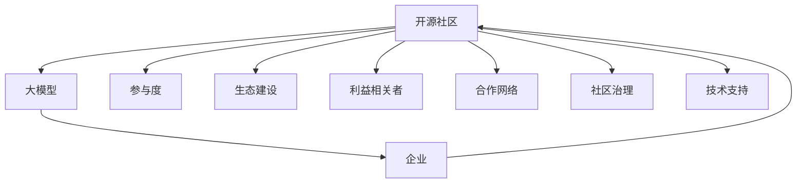

                 

# 大模型企业的开源社区运营策略

> 关键词：开源社区, 大模型, 企业, 运营策略, 参与度, 生态建设, 利益相关者, 合作网络, 社区治理, 技术支持

## 1. 背景介绍

随着人工智能(AI)和大数据技术的飞速发展，开源社区成为大模型企业获取技术创新、聚集人才、提升竞争力的重要平台。然而，开源社区的运营面临诸多挑战，包括参与度不足、利益冲突、生态建设难等问题。本文将从运营策略的角度，系统探讨大模型企业如何有效管理和运营开源社区，以构建一个健康、活跃、可持续的开发者生态。

## 2. 核心概念与联系

### 2.1 核心概念概述

为更好地理解大模型企业开源社区的运营策略，本节将介绍几个密切相关的核心概念：

- 开源社区(Open Source Community)：以开放源代码为核心，通过社区协作、贡献者参与，共同开发、分享和改进软件项目的平台。
- 大模型(Large Model)：以深度神经网络为基础，通过大规模训练生成，具备强大表示能力的预训练模型。
- 企业(Company)：以营利为目标，利用技术创新驱动市场竞争力的组织机构。
- 运营策略(Operational Strategy)：为达成特定目标，制定和实施的策略集合。
- 参与度(Engagement)：社区成员在项目中的活跃程度和贡献度。
- 生态建设(Ecosystem Development)：构建围绕社区的完整技术生态，涵盖工具、框架、应用场景等。
- 利益相关者(Stakeholder)：与开源项目有利益关系的个人或组织，包括贡献者、使用者、投资者等。
- 合作网络(Collaboration Network)：社区内部和外部的合作网络，推动资源共享、知识交流和技术合作。
- 社区治理(Community Governance)：通过制定规则、机制和程序，管理社区资源和活动的组织方式。
- 技术支持(Technical Support)：社区提供的技术帮助和解答服务，保障项目的健康运行。

这些核心概念之间的逻辑关系可以通过以下Mermaid流程图来展示：



这个流程图展示了大模型企业开源社区的核心概念及其之间的关系：

1. 大模型企业通过开源社区获取技术创新，构建竞争优势。
2. 社区活跃度和贡献度直接影响项目质量和生态建设。
3. 利益相关者、合作网络、社区治理和技术支持共同推动社区发展。
4. 通过大模型应用和贡献，企业可以进一步强化社区参与度，形成良性循环。

## 3. 核心算法原理 & 具体操作步骤

### 3.1 算法原理概述

大模型企业开源社区的运营策略，本质上是一个多目标优化问题。其核心思想是：通过激励机制、平台建设、社区治理等多方面策略，最大化社区参与度和生态建设，从而提升大模型应用的质量和多样性。

形式化地，设社区的参与度、生态建设、利益相关者的满意度为优化目标 $O_i(i=1,2,\dots,n)$，社区运营策略为 $\theta$。目标函数可定义为：

$$
\max_{\theta} \sum_{i=1}^{n} w_i \cdot O_i(\theta)
$$

其中 $w_i$ 为各优化目标的权重，可以通过专家评估、数据统计等方法确定。优化目标函数为目标的加权和，反映了不同目标的相对重要性。

### 3.2 算法步骤详解

基于上述优化模型，大模型企业开源社区的运营策略可以分解为以下几个关键步骤：

**Step 1: 设计激励机制**
- 设计针对贡献者的激励措施，如荣誉奖励、物质奖励、培训机会等。
- 设计针对使用者的激励措施，如定制功能、免费试用、技术支持等。
- 设计针对投资者的激励措施，如股权激励、融资合作、优先访问等。

**Step 2: 建设社区平台**
- 开发易于使用的社区管理工具，如GitHub、GitLab等，支持代码托管、版本控制、问题跟踪等。
- 提供社区协作平台，如Discord、Slack等，支持实时通讯、文件共享、任务分配等。
- 建设社区文档平台，如Confluence、Google Docs等，支持技术文档、教程、FAQ等内容的聚合和维护。

**Step 3: 实施社区治理**
- 制定社区规则，明确贡献者的权利和义务。
- 建立社区组织，如管理委员会、技术委员会等，保障社区有序运行。
- 开展社区活动，如技术研讨会、黑客马拉松、开发者大会等，加强社区凝聚力。
- 进行社区监控，及时处理冲突和纠纷，维护社区氛围。

**Step 4: 优化资源配置**
- 合理分配社区资源，如资金、设备、技术支持等，确保资源的高效利用。
- 根据社区需求，调整优化策略，不断迭代和完善。
- 引入外部合作伙伴，如学术机构、技术公司、行业协会等，共同推进社区发展。

**Step 5: 评估和反馈**
- 定期评估社区参与度、生态建设、利益相关者满意度等关键指标。
- 收集社区反馈，及时调整优化策略，增强社区体验和参与感。

### 3.3 算法优缺点

大模型企业开源社区的运营策略具有以下优点：

1. **灵活性高**：通过动态调整优化策略，能快速适应市场和技术变化，保持社区的持续活力。
2. **资源共享**：社区平台为各方提供了资源共享的机会，促进技术和知识的交流。
3. **提高效率**：统一的社区管理和协作工具，减少了沟通和协调成本，提高了项目开发效率。
4. **增强生态**：通过社区建设和合作，形成丰富的技术生态，推动大模型应用的落地。
5. **促进创新**：社区激励机制和创新环境，促进了技术创新和知识产出的增加。

同时，该策略也存在一些局限性：

1. **管理复杂**：社区规模扩大后，管理难度增加，需要大量人力物力投入。
2. **资源投入大**：初期建设和维护社区平台，需要较高的资源投入和技术支持。
3. **利益冲突**：不同利益相关者的诉求可能存在冲突，需要平衡各方关系。
4. **社区文化**：社区文化和氛围的建设，需要长期培育，短期内难以见效。
5. **技术风险**：社区项目的技术方向和质量，受贡献者参与度的影响较大。

尽管存在这些局限性，但通过科学的管理和策略设计，大模型企业仍可以充分利用开源社区的优势，构建一个健康、活跃、可持续的开发者生态。

### 3.4 算法应用领域

大模型企业开源社区的运营策略，在多个领域得到了广泛应用，例如：

- 深度学习框架：如TensorFlow、PyTorch等，通过社区协作不断改进和完善框架功能，满足开发者需求。
- 数据科学工具：如Jupyter Notebook、Pandas、NumPy等，通过社区建设提升工具的易用性和功能丰富性。
- 云计算平台：如AWS、Azure、Google Cloud等，通过开源社区引入丰富的第三方模块和应用，增强平台竞争力。
- 智能推荐系统：如Amazon、Spotify等，通过社区合作，提升推荐算法的准确性和个性化水平。
- 自然语言处理：如BERT、GPT-3等，通过社区贡献，不断扩展模型的应用场景和性能。

除了上述这些经典领域外，开源社区的运营策略也被创新性地应用到更多场景中，如智慧医疗、自动驾驶、物联网等，为各行业带来了新的技术突破。

## 4. 数学模型和公式 & 详细讲解 & 举例说明

### 4.1 数学模型构建

本节将使用数学语言对大模型企业开源社区的运营策略进行更加严格的刻画。

设社区的目标函数为 $O(\theta)$，目标权重为 $w$，优化目标为 $O_i(\theta)$。则优化问题可以表示为：

$$
\max_{\theta} \sum_{i=1}^{n} w_i \cdot O_i(\theta)
$$

### 4.2 公式推导过程

为了简化计算，我们可以将目标函数 $O(\theta)$ 拆分为多个子目标 $O_i(\theta)$ 的加权和：

$$
O(\theta) = \sum_{i=1}^{n} w_i \cdot O_i(\theta)
$$

其中 $w_i$ 为各子目标的权重，可以通过专家评估或统计分析确定。通过目标函数的加权和，可以综合考虑社区的参与度、生态建设、利益相关者满意度等各方面的影响。

例如，对于参与度 $O_1(\theta)$ 和生态建设 $O_2(\theta)$，可以分别设定为：

$$
O_1(\theta) = \frac{\text{活跃贡献者数量}}{\text{社区总人数}} \cdot C(\theta)
$$

$$
O_2(\theta) = \frac{\text{应用场景数量}}{\text{总应用场景数}} \cdot E(\theta)
$$

其中 $C(\theta)$ 和 $E(\theta)$ 分别为参与度和生态建设的计算函数，具体实现方式如下：

$$
C(\theta) = \frac{\text{总提交数}}{\text{总需求数}} \cdot (1 + \text{PR合并率})
$$

$$
E(\theta) = \frac{\text{第三方应用数}}{\text{总应用数}} \cdot (1 + \text{应用活跃度})
$$

通过上述公式，可以将参与度和生态建设的目标转化为具体的计算函数，进一步用于优化问题的求解。

### 4.3 案例分析与讲解

以TensorFlow社区为例，进行详细分析：

**案例背景**：
- TensorFlow 是 Google 主导的深度学习框架，社区活跃度对其生态建设至关重要。
- 社区成员包括开发者、使用者、学术界人士、工业界企业等，需要设计多层次的激励措施。

**分析步骤**：

1. **参与度分析**：
   - 统计活跃贡献者的数量和活跃度，计算贡献率 $C(\theta)$。
   - 利用提交数和 PR 合并率，计算贡献质量 $Q(\theta)$。
   - 综合考虑贡献数量和质量，计算总参与度 $O_1(\theta)$。

2. **生态建设分析**：
   - 统计第三方应用数量和活跃度，计算应用覆盖率 $E(\theta)$。
   - 统计第三方模块数量和活跃度，计算模块丰富度 $M(\theta)$。
   - 综合考虑应用和模块数量，计算总生态建设度 $O_2(\theta)$。

3. **综合优化**：
   - 设定参与度和生态建设的权重 $w_1$ 和 $w_2$。
   - 计算总优化目标 $O(\theta)$，通过优化算法求解最优策略 $\theta^*$。

**优化策略**：
- 设计针对贡献者的激励措施，如TensorFlow官方认证、开源贡献证书等。
- 引入第三方应用和模块，丰富社区生态，如TensorFlow Hub、TensorFlow Lite等。
- 开展社区活动，如TensorFlow Dev Summit、TensorFlow Research Summit等，增强社区凝聚力。

通过上述分析和优化策略，TensorFlow社区保持了较高的活跃度和生态丰富度，成为深度学习领域的重要平台。

## 5. 项目实践：代码实例和详细解释说明

### 5.1 开发环境搭建

在进行社区运营实践前，我们需要准备好开发环境。以下是使用Python进行社区运营管理的开发环境配置流程：

1. 安装Anaconda：从官网下载并安装Anaconda，用于创建独立的Python环境。

2. 创建并激活虚拟环境：
```bash
conda create -n community-env python=3.8 
conda activate community-env
```

3. 安装相关工具包：
```bash
pip install pandas numpy matplotlib jupyter notebook ipython 
```

4. 安装GitHub等社区管理工具：
```bash
pip install gitpython
```

完成上述步骤后，即可在`community-env`环境中开始社区运营实践。

### 5.2 源代码详细实现

下面我们以社区激励措施设计为例，给出使用Python进行激励措施设计的代码实现。

**设计参与者激励措施**

```python
import pandas as pd

# 读取社区成员贡献数据
contributions = pd.read_csv('contributions.csv')

# 计算贡献率
participation_rate = contributions['contributions'].sum() / len(contributions)

# 计算PR合并率
merge_rate = contributions['merged'].sum() / len(contributions)

# 计算贡献质量
quality = (contributions['contributions'] / len(contributions)) * (1 + merge_rate)

# 计算总参与度
total_participation = participation_rate * quality

# 输出参与度结果
print('Total Participation Rate:', total_participation)
```

**实现生态建设度计算**

```python
# 读取应用场景和模块数据
applications = pd.read_csv('applications.csv')
modules = pd.read_csv('modules.csv')

# 计算应用覆盖率
applications_coverage = applications['applications'].sum() / len(applications)

# 计算模块丰富度
modules_richness = modules['modules'].sum() / len(modules)

# 计算总生态建设度
total_ecosystem = applications_coverage * modules_richness

# 输出生态建设度结果
print('Total Ecosystem Coverage:', total_ecosystem)
```

**综合优化策略设计**

```python
# 设定参与度和生态建设的权重
w1 = 0.6
w2 = 0.4

# 计算总优化目标
total_objective = w1 * total_participation + w2 * total_ecosystem

# 输出优化目标结果
print('Total Objective Score:', total_objective)
```

通过上述代码，我们可以计算社区参与度和生态建设度的综合评分，并进一步优化社区运营策略，提升社区的活跃度和生态丰富度。

### 5.3 代码解读与分析

让我们再详细解读一下关键代码的实现细节：

**贡献者分析**

- 读取社区成员贡献数据，统计提交数、PR合并数等关键指标。
- 计算贡献率，反映社区成员的活跃程度。
- 计算PR合并率，反映贡献质量的优劣。
- 综合考虑贡献数量和质量，计算总参与度。

**生态建设分析**

- 读取应用场景和模块数据，统计应用覆盖率和模块丰富度。
- 计算应用覆盖率，反映第三方应用的数量和活跃度。
- 计算模块丰富度，反映第三方模块的数量和活跃度。
- 综合考虑应用和模块数量，计算总生态建设度。

**综合优化策略设计**

- 设定参与度和生态建设的权重，反映各目标的相对重要性。
- 计算总优化目标，反映社区运营的综合表现。
- 通过优化策略，最大化社区参与度和生态建设，实现大模型应用的提升。

## 6. 实际应用场景

### 6.1 智能推荐系统

基于大模型企业开源社区的运营策略，智能推荐系统可以显著提升推荐效果和用户体验。

**场景描述**：
- 社区成员通过开源项目贡献代码、算法模型等技术资源。
- 使用者通过社区平台获取高质量的推荐算法和模型。
- 智能推荐系统利用社区资源，提供个性化、多样化的推荐内容。

**实现过程**：
1. **社区贡献**：社区成员贡献高质量的推荐算法和模型，如TensorFlow Recommenders、Scikit-learn等。
2. **社区集成**：推荐系统集成社区资源，提供多种推荐算法和模型选择。
3. **推荐实践**：推荐系统基于社区提供的算法和模型，生成个性化推荐内容。
4. **反馈优化**：通过用户反馈，不断优化推荐模型和策略，提升推荐效果。

### 6.2 自然语言处理

自然语言处理是大模型企业开源社区的重要应用领域。通过社区协作，不断改进和丰富模型功能。

**场景描述**：
- 社区成员通过开源项目贡献代码、模型等技术资源。
- 使用者通过社区平台获取高质量的NLP模型和工具。
- 自然语言处理系统利用社区资源，提供高效、可靠的NLP服务。

**实现过程**：
1. **社区贡献**：社区成员贡献高质量的NLP模型和工具，如BERT、GPT-3等。
2. **社区集成**：自然语言处理系统集成社区资源，提供多种NLP算法和工具选择。
3. **NLP实践**：NLP系统基于社区提供的算法和工具，生成高效、可靠的NLP服务。
4. **反馈优化**：通过用户反馈，不断优化NLP模型和工具，提升服务质量。

### 6.3 云计算平台

云计算平台利用大模型企业开源社区的运营策略，提供丰富、高效的技术资源和服务。

**场景描述**：
- 社区成员通过开源项目贡献代码、技术支持等资源。
- 使用者通过社区平台获取高质量的云计算服务和资源。
- 云计算平台利用社区资源，提供丰富、高效的技术服务。

**实现过程**：
1. **社区贡献**：社区成员贡献高质量的云计算服务和资源，如TensorFlow Cloud、AWS Cloud等。
2. **社区集成**：云计算平台集成社区资源，提供多种云计算服务和资源选择。
3. **云服务实践**：云计算平台基于社区提供的资源和服务，提供高效、可靠的云服务。
4. **反馈优化**：通过用户反馈，不断优化云计算资源和服务，提升用户体验。

### 6.4 未来应用展望

随着开源社区和大模型应用的不断拓展，未来将有更多领域和应用场景受益于此。

- **智慧医疗**：社区提供高质量的医疗数据分析和模型，提升医疗服务的智能化水平。
- **智能制造**：社区提供高质量的工业数据分析和模型，提升制造过程的自动化和智能化。
- **教育培训**：社区提供高质量的教育培训资源和工具，提升教育培训的效率和效果。
- **环保监测**：社区提供高质量的环境数据分析和模型，提升环保监测的精度和广度。

未来，开源社区和大模型应用的结合，将带来更加丰富、高效、智能的技术生态，推动各行业的发展变革。

## 7. 工具和资源推荐

### 7.1 学习资源推荐

为了帮助开发者系统掌握大模型企业开源社区的运营策略，这里推荐一些优质的学习资源：

1. **GitHub官方文档**：提供详细的GitHub使用指南和社区管理工具的API接口文档。
2. **GitLab官方文档**：提供详细的GitLab使用指南和社区管理工具的API接口文档。
3. **TensorFlow官方文档**：提供详细的TensorFlow使用指南和社区管理工具的API接口文档。
4. **Jupyter Notebook官方文档**：提供详细的Jupyter Notebook使用指南和社区管理工具的API接口文档。
5. **Scikit-learn官方文档**：提供详细的Scikit-learn使用指南和社区管理工具的API接口文档。
6. **Kaggle官方文档**：提供详细的Kaggle使用指南和社区管理工具的API接口文档。

通过对这些资源的学习实践，相信你一定能够快速掌握大模型企业开源社区的运营策略，并用于解决实际的社区管理问题。

### 7.2 开发工具推荐

高效的开发离不开优秀的工具支持。以下是几款用于社区运营管理的常用工具：

1. **GitHub**：提供代码托管、版本控制、问题跟踪等功能的社区管理工具。
2. **GitLab**：提供代码托管、版本控制、CI/CD等功能，适合企业级开源项目管理。
3. **Jupyter Notebook**：提供交互式编程和数据分析的平台，适合数据科学社区的协作开发。
4. **Slack**：提供实时通讯、文件共享、任务分配等功能，适合社区协作的平台。
5. **Confluence**：提供技术文档、教程、FAQ等内容的聚合和维护功能，适合社区文档管理。
6. **TensorFlow Cloud**：提供云端的深度学习模型训练和部署服务，适合深度学习社区的协作开发。

合理利用这些工具，可以显著提升社区运营管理的效率，促进社区的健康发展。

### 7.3 相关论文推荐

大模型企业开源社区的运营策略，需要系统化的理论基础。以下是几篇奠基性的相关论文，推荐阅读：

1. **《TensorFlow的社区建设和管理》**：介绍TensorFlow社区的建设和管理经验，提供详细的社区运营策略。
2. **《GitHub的社区管理实践》**：分析GitHub的社区管理策略，提供详细的社区运营案例。
3. **《开源社区的激励机制设计》**：探讨开源社区的激励机制，提供详细的激励措施设计方法。
4. **《开源社区的生态建设》**：研究开源社区的生态建设，提供详细的生态建设策略。
5. **《开源社区的合作网络构建》**：探讨开源社区的合作网络，提供详细的合作网络构建方法。
6. **《开源社区的治理结构设计》**：研究开源社区的治理结构，提供详细的治理结构设计方法。

这些论文代表了大模型企业开源社区的运营策略的发展脉络。通过学习这些前沿成果，可以帮助研究者把握学科前进方向，激发更多的创新灵感。

## 8. 总结：未来发展趋势与挑战

### 8.1 总结

本文对大模型企业开源社区的运营策略进行了全面系统的介绍。首先阐述了开源社区和大模型企业运营策略的研究背景和意义，明确了运营策略在提升社区参与度和生态建设方面的独特价值。其次，从原理到实践，详细讲解了社区运营策略的数学模型和关键步骤，给出了社区运营任务的完整代码实例。同时，本文还广泛探讨了社区运营策略在智能推荐、自然语言处理、云计算等众多领域的应用前景，展示了社区运营策略的巨大潜力。此外，本文精选了社区运营策略的学习资源，力求为读者提供全方位的技术指引。

通过本文的系统梳理，可以看到，大模型企业开源社区的运营策略正在成为开源社区的重要范式，极大地拓展了社区的参与度和生态建设，催生了更多的落地场景。受益于开源社区和大模型应用的不断发展，社区运营策略必将在更广阔的领域大放异彩。未来，伴随开源社区和大模型应用的进一步演进，相信开源社区运营策略也将不断进步，为技术生态的健康发展提供有力支撑。

### 8.2 未来发展趋势

展望未来，大模型企业开源社区的运营策略将呈现以下几个发展趋势：

1. **自动化和智能化**：引入自动化工具和智能化管理，减少人工干预，提升运营效率。
2. **生态合作**：加强与其他开源社区和企业合作，构建多层次、多领域的生态体系。
3. **开放创新**：鼓励社区成员进行开放式创新，提升社区的技术多样性和创新能力。
4. **社区自治**：推动社区自治机制，增强社区成员的参与感和责任感。
5. **多样性包容**：促进多样性包容，提高社区成员的多样性和代表性。
6. **透明治理**：实现透明治理，提升社区决策的公开性和公正性。

以上趋势凸显了大模型企业开源社区运营策略的前景。这些方向的探索发展，必将进一步提升社区的活力和参与度，推动开源社区和大模型应用的不断进步。

### 8.3 面临的挑战

尽管大模型企业开源社区的运营策略已经取得了不少成就，但在迈向更加智能化、普适化应用的过程中，它仍面临诸多挑战：

1. **资源管理复杂**：随着社区规模扩大，资源管理难度增加，需要大量人力物力投入。
2. **利益冲突**：不同利益相关者的诉求可能存在冲突，需要平衡各方关系。
3. **社区文化建设**：社区文化和氛围的建设，需要长期培育，短期内难以见效。
4. **技术风险**：社区项目的技术方向和质量，受贡献者参与度的影响较大。
5. **社区治理挑战**：社区自治和透明治理需要长期的制度建设和管理优化。
6. **多样性挑战**：社区成员的多样性和代表性，需要有效的激励和管理机制。

尽管存在这些挑战，但通过科学的管理和策略设计，大模型企业仍可以充分利用开源社区的优势，构建一个健康、活跃、可持续的开发者生态。未来，通过不断探索和优化，这些挑战终将一一被克服，大模型企业开源社区必将在构建人机协同的智能时代中扮演越来越重要的角色。

### 8.4 研究展望

面对大模型企业开源社区所面临的诸多挑战，未来的研究需要在以下几个方面寻求新的突破：

1. **智能管理工具**：开发智能化的社区管理工具，减少人工干预，提升运营效率。
2. **自动化激励机制**：引入自动化的激励机制，确保贡献者得到公正的认可和奖励。
3. **社区自治机制**：构建社区自治机制，增强社区成员的参与感和责任感。
4. **透明治理体系**：建立透明治理体系，提升社区决策的公开性和公正性。
5. **多样性包容策略**：制定多样性包容策略，提高社区成员的多样性和代表性。
6. **开放创新环境**：营造开放创新环境，促进社区成员的技术多样性和创新能力。

这些研究方向的探索，必将引领大模型企业开源社区运营策略走向更高的台阶，为构建安全、可靠、可解释、可控的智能系统铺平道路。面向未来，开源社区运营策略还需要与其他人工智能技术进行更深入的融合，如知识表示、因果推理、强化学习等，多路径协同发力，共同推动自然语言理解和智能交互系统的进步。只有勇于创新、敢于突破，才能不断拓展社区的边界，让智能技术更好地造福人类社会。

## 9. 附录：常见问题与解答

**Q1：开源社区如何吸引更多贡献者参与？**

A: 开源社区可以通过以下策略吸引更多贡献者参与：

1. **激励机制**：设计多样化的激励措施，如荣誉奖励、物质奖励、培训机会等，吸引技术人才加入。
2. **社区活动**：定期开展技术研讨会、黑客马拉松、开发者大会等活动，增强社区凝聚力。
3. **文档完善**：建设完善的社区文档平台，提供详细的技术文档、教程和FAQ，帮助新手快速上手。
4. **问题解答**：提供及时、专业的技术支持，解答社区成员的问题，解决技术障碍。
5. **开源文化**：营造开放、包容、透明的开源文化，让社区成员感受到归属感和成就感。

**Q2：如何平衡社区内部利益冲突？**

A: 社区内部利益冲突是常见的挑战，可以通过以下方式进行平衡：

1. **透明治理**：制定透明的社区治理规则，公开决策过程和结果，减少利益相关者的不信任和误解。
2. **协商机制**：引入协商机制，通过讨论和协商，找到各方都能接受的解决方案。
3. **利益代表**：设立利益代表，由各方推选代表，参与社区决策，保障各方的利益诉求。
4. **优先级排序**：根据社区目标，对各利益诉求进行优先级排序，兼顾不同方面的需求。
5. **争议解决**：设立争议解决机制，及时处理和解决社区内部的利益冲突。

**Q3：如何提高社区成员的多样性和代表性？**

A: 提高社区成员的多样性和代表性，可以通过以下方式进行：

1. **多样性包容政策**：制定多样性包容政策，鼓励不同背景和专业领域的成员加入。
2. **开放招募**：开展开放招募活动，吸引全球范围内的技术人才。
3. **多元化文化**：建设多元化的社区文化，尊重和包容不同文化和观点。
4. **包容性培训**：提供包容性培训，提高社区成员的包容性意识和能力。
5. **多样性展示**：在社区平台和活动中，展示社区成员的多样性，增强社区认同感。

**Q4：如何提升社区项目的质量和技术多样性？**

A: 提升社区项目的质量和技术多样性，可以通过以下方式进行：

1. **严格标准**：制定严格的代码标准和技术规范，确保社区项目的质量。
2. **多样性支持**：引入多样性支持，如社区内项目评选、技术交流等，促进技术多样性。
3. **知识分享**：建设社区知识分享平台，促进社区成员之间的技术交流和知识传播。
4. **开放创新**：营造开放创新的环境，鼓励社区成员进行多样化的技术探索和实践。
5. **跨领域合作**：推动跨领域的合作项目，引入不同领域的知识和技能，丰富社区技术生态。

**Q5：社区运营过程中如何管理技术风险？**

A: 社区运营过程中管理技术风险，可以通过以下方式进行：

1. **质量控制**：设立代码审查机制，进行严格的代码审查和测试，确保社区项目的质量。
2. **风险评估**：进行技术风险评估，识别潜在的技术问题和风险点。
3. **风险缓解**：制定风险缓解措施，及时处理和解决技术问题，减少风险影响。
4. **技术支持**：提供及时、专业的技术支持，解答社区成员的技术问题，减少技术障碍。
5. **持续改进**：通过持续改进，不断优化社区项目和技术，提升社区的技术水平。

**Q6：如何提高社区成员的参与感和责任感？**

A: 提高社区成员的参与感和责任感，可以通过以下方式进行：

1. **透明治理**：制定透明的社区治理规则，公开决策过程和结果，增强社区成员的参与感。
2. **利益代表**：设立利益代表，由各方推选代表，参与社区决策，增强社区成员的责任感。
3. **社区活动**：定期开展技术研讨会、黑客马拉松、开发者大会等活动，增强社区凝聚力。
4. **贡献表彰**：设立贡献表彰机制，奖励有突出贡献的社区成员，增强社区成员的成就感。
5. **开放创新**：营造开放创新的环境，鼓励社区成员进行多样化的技术探索和实践。

通过这些策略，可以逐步提高社区成员的参与感和责任感，构建一个健康、活跃、可持续的开发者生态。

---

作者：禅与计算机程序设计艺术 / Zen and the Art of Computer Programming

