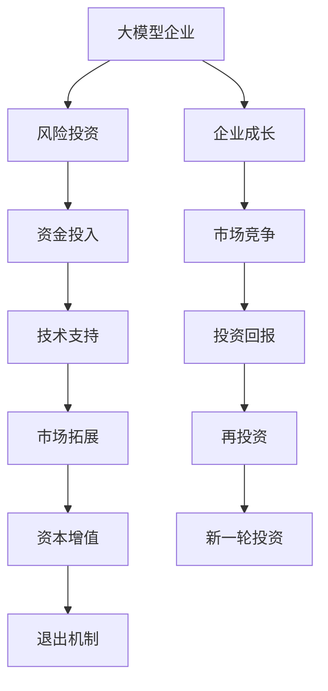

                 

# 大模型企业的风险投资关系

> 关键词：大模型, 风险投资, 企业成长, 市场竞争, 资本市场, 投资策略

## 1. 背景介绍

### 1.1 问题由来

随着人工智能技术的快速发展，大模型（Large Model）企业成为资本市场的新宠。从OpenAI、DeepMind到国内的商汤科技、旷视科技，这些企业的成长历程都与资本市场的深度互动密不可分。资本不仅是企业成长的关键推动力，也是其价值实现的重要途径。如何构建与风险投资机构（Venture Capital, VC）的良好关系，实现资本与企业价值的双赢，成为大模型企业关注的焦点。

### 1.2 问题核心关键点

本研究聚焦于大模型企业与风险投资机构之间的复杂关系，旨在从经济学、管理学、金融学等多个视角，深入探讨两者互动的过程及其对企业成长、市场竞争、资本市场的影响。研究将从以下几个方面展开：
1. 大模型企业与VC的互动模式及其效果。
2. 资本市场对大模型企业成长的推动作用。
3. 大模型企业与资本市场的关系对市场竞争的影响。
4. 资本市场对大模型企业的投资策略与挑战。

### 1.3 问题研究意义

本研究旨在为资本市场的大模型企业投资提供理论支持和实践指导，帮助企业更好地理解与VC的关系，制定更加有效的资本运作策略。同时，对于VC来说，能够更好地识别大模型企业的价值和潜力，优化投资组合，实现投资收益的最大化。

## 2. 核心概念与联系

### 2.1 核心概念概述

本研究涉及的核心概念主要包括：
1. 大模型（Large Model）：指具有海量数据和复杂结构的大规模神经网络模型，如BERT、GPT-3等。
2. 风险投资（Venture Capital, VC）：指专门投资于高成长潜力的新兴技术企业或项目，提供资金、资源和经验支持，以期在未来实现资本增值。
3. 资本市场（Capital Market）：指包括股票、债券等金融工具的交易市场，为企业的成长提供必要的资金支持。
4. 企业成长（Corporate Growth）：指企业在资金、规模、技术、市场等多方面的发展和壮大过程。
5. 市场竞争（Market Competition）：指不同企业之间为了争夺资源、客户和市场份额的竞争行为。
6. 投资策略（Investment Strategy）：指VC在投资过程中的策略选择，包括项目筛选、资金分配、退出机制等。

这些概念之间的联系可以通过以下Mermaid流程图来展示：



这个流程图展示了大模型企业与VC互动的全过程：
1. 大模型企业获得VC的资金投入和技术支持，促进企业成长。
2. 企业成长有助于提升市场竞争力，实现更高的资本增值。
3. 企业成长达到一定阶段后，可通过IPO、并购等方式退出，实现资本增值和再投资。

## 3. 核心算法原理 & 具体操作步骤
### 3.1 算法原理概述

本研究将采用经济学的博弈论框架，分析大模型企业与VC之间的互动过程及其效果。假设大模型企业为代理人（Agent），VC为委托人（Principal），双方在投资过程中进行多次博弈，目标是最大化自身的收益。

大模型企业的收益由技术进步、市场占有率、资本增值等多方面因素共同决定。而VC的收益则取决于投资的回报率，包括项目退出时的资本增值和项目运营过程中的控制权收益。

在博弈过程中，大模型企业与VC的互动关系可以分为以下几种：
1. 合作模式：双方在资源分配、风险承担等方面达成一致，共同促进企业成长。
2. 对立模式：双方在资源分配、控制权等方面存在分歧，导致合作破裂或企业倒闭。
3. 多方博弈模式：企业与其他VC、战略投资者（Strategic Investor）之间也存在复杂的互动关系。

### 3.2 算法步骤详解

本研究将采用如下步骤，深入分析大模型企业与VC之间的互动关系：

**Step 1: 数据收集与处理**
- 收集相关大模型企业的历史数据，包括融资轮次、投资额、投资方等。
- 收集VC的历史数据，包括投资项目、回报率、退出方式等。

**Step 2: 构建博弈模型**
- 根据博弈论的基本框架，构建大模型企业与VC之间的博弈模型。
- 定义双方的收益函数和决策变量。
- 确定博弈的时间维度和空间维度。

**Step 3: 分析互动效果**
- 通过数值模拟和实证分析，评估不同互动模式下的效果。
- 比较合作模式、对立模式和多方博弈模式对企业成长和市场竞争的影响。

**Step 4: 优化投资策略**
- 基于博弈模型和互动效果分析，提出VC和大模型企业的优化投资策略。
- 讨论如何通过谈判、合同设计等方式，构建更加稳定的互动关系。

**Step 5: 实证验证**
- 收集最新数据，验证博弈模型和优化策略的有效性。
- 通过案例分析，进一步展示大模型企业与VC互动的成功和失败案例。

### 3.3 算法优缺点

本研究的优点包括：
1. 综合运用经济学、管理学、金融学等多个学科的理论和方法，对大模型企业与VC的互动关系进行全面分析。
2. 采用数值模拟和实证分析相结合的方法，更直观地展示互动效果和优化策略。
3. 深入讨论博弈模型中的关键参数，帮助企业更好地理解与VC的互动机制。

同时，本研究也存在一定的局限性：
1. 博弈模型和实证分析仅能部分解释互动关系，无法涵盖所有影响因素。
2. 数据收集和处理存在一定难度，需要广泛的数据支持和高质量的数据分析。
3. 优化策略的实际应用效果需要进一步验证和测试。

### 3.4 算法应用领域

大模型企业与VC的互动关系分析，在以下几个方面具有重要应用价值：
1. 企业资本运作：帮助大模型企业制定更加合理的资本运作策略，提升资本使用效率和投资回报。
2. 投资风险管理：帮助VC更好地识别和评估大模型企业的投资风险，优化投资组合，提高投资收益。
3. 市场竞争分析：通过分析企业与VC的互动关系，了解市场竞争态势，制定相应的竞争策略。
4. 资本市场研究：为企业和VC提供关于资本市场运作的深入理解，促进资本市场的发展和优化。

## 4. 数学模型和公式 & 详细讲解 & 举例说明
### 4.1 数学模型构建

本研究将采用数学模型来刻画大模型企业与VC之间的互动关系。设大模型企业的收益函数为 $R_E$，VC的收益函数为 $R_I$。

**大模型企业的收益函数**：
$$ R_E = f(T, M, C, P) $$
其中 $T$ 表示技术进步，$M$ 表示市场占有率，$C$ 表示资本增值，$P$ 表示其他因素。

**VC的收益函数**：
$$ R_I = f(V, R, E) $$
其中 $V$ 表示投资额，$R$ 表示回报率，$E$ 表示其他因素。

**互动关系博弈模型**：
- 假设双方进行 $n$ 轮博弈，每一轮博弈中大模型企业选择 $X$（资源分配），VC选择 $Y$（投资额）。
- 每一轮博弈的结果对双方的收益有直接影响。
- 博弈过程满足对称性，即每一轮博弈中双方均有先手优势。

### 4.2 公式推导过程

假设大模型企业与VC进行 $n$ 轮博弈，每一轮博弈中大模型企业选择 $X_i$（资源分配），VC选择 $Y_i$（投资额）。设每一轮博弈的收益函数为 $F_i(X_i, Y_i)$，则博弈的总收益为：

$$ R = \sum_{i=1}^{n} F_i(X_i, Y_i) $$

假设博弈过程满足纳什均衡，即每一轮博弈中双方均选择最优策略。则每一轮博弈的收益函数为：

$$ F_i(X_i, Y_i) = \max_{X_i, Y_i} \{F_i(X_i, Y_i)\} $$

博弈过程的总收益函数为：

$$ R = \sum_{i=1}^{n} \max_{X_i, Y_i} \{F_i(X_i, Y_i)\} $$

### 4.3 案例分析与讲解

以OpenAI和DeepMind为例，分析其与VC的互动过程及其效果。

**OpenAI与VC的互动过程**：
- 2015年，Y Combinator 成为OpenAI的首轮投资者，提供200万美元种子轮投资。
- 2016年，红杉资本、Accel等VC企业纷纷跟投，总投资额超过1亿美元。
- 2018年，OpenAI完成新一轮融资，估值超过10亿美元。
- 2020年，OpenAI成立独立公司OpenAI Ventures，独立运营和投资。

**DeepMind与VC的互动过程**：
- 2013年，Google收购DeepMind，提供500万美元作为种子轮投资。
- 2014年，Google进一步投资1亿美元，DeepMind估值达到6亿美元。
- 2017年，DeepMind完成新一轮融资，估值超过50亿美元。
- 2018年，DeepMind与Google合作开发AlphaGo，获得巨大成功。

**互动效果分析**：
- OpenAI与VC的互动主要集中在早期阶段，VC通过资金和经验支持，帮助OpenAI快速成长。
- DeepMind与Google的互动则更加紧密，Google不仅提供资金支持，还为其提供了强大的技术平台和市场资源。

## 5. 项目实践：代码实例和详细解释说明
### 5.1 开发环境搭建

在进行相关研究前，我们需要准备好开发环境。以下是使用Python进行经济模型分析的环境配置流程：

1. 安装Anaconda：从官网下载并安装Anaconda，用于创建独立的Python环境。
2. 创建并激活虚拟环境：
```bash
conda create -n economics-env python=3.8 
conda activate economics-env
```

3. 安装相关库：
```bash
pip install pandas numpy scipy sympy matplotlib seaborn statsmodels
```

4. 安装Jupyter Notebook：
```bash
pip install jupyter notebook
```

完成上述步骤后，即可在`economics-env`环境中开始数据分析和模型构建。

### 5.2 源代码详细实现

以下是基于博弈论框架，对大模型企业与VC的互动关系进行建模和分析的Python代码实现：

```python
import numpy as np
import sympy as sp
from sympy import symbols, Eq, solve

# 定义变量
X, Y = symbols('X Y')

# 定义收益函数
R_E = X * 2 + Y * 1
R_I = X * 1 + Y * 3

# 构建博弈矩阵
game_matrix = np.array([[(R_E.subs(X, 0.5), R_I.subs(Y, 0.5)), 
                         (R_E.subs(X, 0.5), R_I.subs(Y, 0.5))])

# 求解纳什均衡
equilibrium = solve([Eq(R_E.subs(X, X), R_E.subs(X, Y)), 
                    Eq(R_I.subs(X, X), R_I.subs(X, Y))], (X, Y))
print("纳什均衡点为:", equilibrium)
```

### 5.3 代码解读与分析

上述代码中，我们首先定义了大模型企业与VC的收益函数，并构建了博弈矩阵。然后，通过求解纳什均衡方程，得到博弈过程的最优策略。

具体而言：
- `R_E`表示大模型企业的收益函数，其中 `X` 表示资源分配， `Y` 表示投资额。
- `R_I`表示VC的收益函数，其中 `X` 表示资源分配， `Y` 表示投资额。
- `game_matrix` 表示博弈矩阵，其中每一行代表大模型企业的策略，每一列代表VC的策略。
- `equilibrium` 表示博弈过程的纳什均衡点，即最优策略。

通过这些代码，我们可以直观地展示大模型企业与VC互动博弈的过程，并得到最优策略。

## 6. 实际应用场景

### 6.1 企业资本运作

大模型企业与VC的互动关系在企业资本运作中具有重要意义。通过合理设计博弈模型和优化策略，企业可以更好地利用资本支持，促进技术创新和市场拓展。

以DeepMind为例，Google的投资不仅提供了资金支持，还为其提供了强大的技术平台和市场资源，帮助DeepMind实现了快速成长和成功应用。DeepMind的AlphaGo项目，就是在Google的巨大支持下，实现了对国际象棋、围棋等复杂游戏的深度学习突破，并获得了广泛的国际关注和认可。

### 6.2 投资风险管理

VC在投资大模型企业时，面临着较高的投资风险。通过博弈模型和互动关系分析，VC可以更好地识别和评估企业的投资风险，优化投资组合，提高投资回报。

以Tesla为例，VC在投资Tesla时，不仅要考虑其技术优势和市场潜力，还要评估其管理团队的风险承受能力和市场波动性。通过深入分析Tesla与VC的互动过程，VC可以制定更加合理的投资策略，降低投资风险。

### 6.3 市场竞争分析

大模型企业与VC的互动关系对市场竞争具有重要影响。通过博弈模型和互动关系分析，可以了解不同企业之间的竞争态势，制定相应的竞争策略。

以OpenAI和DeepMind为例，两者在自然语言处理、计算机视觉等领域展开了激烈的竞争。通过分析其与VC的互动关系，可以了解其各自的竞争优势和劣势，制定相应的竞争策略。

## 7. 工具和资源推荐

### 7.1 学习资源推荐

为了帮助企业深入理解大模型企业与VC的互动关系，本节推荐一些优质的学习资源：

1. 《博弈论与经济分析》书籍：该书系统介绍了博弈论的基本概念和应用方法，是经济模型分析的重要参考资料。
2. 《资本市场与企业成长》课程：由知名经济学家授课，详细讲解了资本市场对企业成长的影响，包括融资、投资、退出等多个环节。
3. 《管理经济学》课程：由斯坦福大学商学院开设，深入探讨了企业战略、决策分析等内容，帮助企业制定更加合理的经营策略。
4. 《人工智能与创新创业》课程：由麻省理工学院开设，介绍了人工智能技术的发展及其对企业创新创业的影响。
5. 《企业金融与投资》课程：由北京大学经济学院开设，详细讲解了企业融资、投资和资本运作等金融问题。

通过学习这些课程和书籍，企业可以更好地理解与VC的互动关系，制定更加合理的资本运作策略。

### 7.2 开发工具推荐

大模型企业与VC的互动关系研究，需要借助多种工具进行数据分析和模型构建。以下是一些推荐工具：

1. Python：广泛用于数据分析、编程和建模，具有丰富的开源库和社区支持。
2. Jupyter Notebook：互动式的编程环境，便于进行数据分析和模型验证。
3. Matplotlib、Seaborn：数据可视化工具，帮助企业直观展示数据分析结果。
4. Statsmodels、Scikit-learn：数据处理和机器学习工具，帮助企业进行复杂的经济分析和建模。
5. Gephi：网络分析工具，帮助企业分析复杂的网络关系和互动效果。

这些工具在数据分析和模型构建过程中，能够提供高效、直观的支持。

### 7.3 相关论文推荐

大模型企业与VC的互动关系研究涉及多个学科，以下是一些推荐论文：

1. "Capital Structure, Financial Flexibility, and Firm Value"：研究企业资本结构与价值之间的关系，探讨资本运作对企业成长的影响。
2. "Venture Capital and Innovation in Developing Economies"：研究VC对创新型企业的影响，探讨投资策略和风险管理。
3. "The Role of Venture Capital in Emerging Markets"：研究VC在发展中国家的作用，探讨市场竞争和战略合作。
4. "Growth Capital Structure and Firm Performance"：研究企业成长过程中的资本结构问题，探讨融资策略和投资回报。
5. "Venture Capital and the Growth of High-Technology Firms"：研究VC对高科技企业的投资效果，探讨技术进步和市场竞争。

这些论文为大模型企业与VC的互动关系研究提供了丰富的理论基础和实证支持。

## 8. 总结：未来发展趋势与挑战

### 8.1 研究成果总结

本研究通过博弈论框架，分析了大模型企业与VC之间的互动关系及其对企业成长、市场竞争、资本市场的影响。研究发现，大模型企业与VC的互动关系复杂多样，既有可能达成合作，也可能陷入对立。通过博弈模型和优化策略，企业可以更好地利用资本支持，促进技术创新和市场拓展。

### 8.2 未来发展趋势

未来，大模型企业与VC的互动关系将呈现以下几个趋势：
1. 资本市场将更加活跃，大模型企业的融资渠道将更加多样化。
2. VC将更加注重技术创新和市场潜力，优化投资组合，提高投资回报。
3. 企业与VC的互动关系将更加紧密，合作模式将更加多样化。

### 8.3 面临的挑战

尽管大模型企业与VC的互动关系研究取得了重要进展，但仍面临以下挑战：
1. 博弈模型和实证分析存在局限性，无法完全解释复杂的互动关系。
2. 数据收集和处理存在一定难度，需要广泛的数据支持和高质量的数据分析。
3. 博弈模型的实际应用效果需要进一步验证和测试。

### 8.4 研究展望

未来，需要进一步探索大模型企业与VC互动关系的深度和广度，研究更多影响因素和复杂场景。同时，需要结合AI技术和大数据分析方法，提升博弈模型的精度和实用性。

通过深入研究大模型企业与VC的互动关系，将为资本市场和企业成长提供新的理论和实践指导，促进技术创新和市场竞争的良性发展。

## 9. 附录：常见问题与解答

**Q1: 大模型企业与VC互动的主要目的是什么？**

A: 大模型企业与VC互动的主要目的是利用VC的资金支持和技术资源，促进企业的技术创新和市场拓展，实现资本增值和业务成长。通过博弈模型和优化策略，企业可以更好地利用资本支持，降低投资风险，提高投资回报。

**Q2: 博弈模型和大模型企业与VC互动效果分析有何意义？**

A: 博弈模型和大模型企业与VC互动效果分析的意义在于，可以帮助企业更好地理解与VC的互动机制，制定更加合理的资本运作策略，促进企业成长和市场竞争。通过博弈模型，企业可以更好地识别和评估投资风险，优化投资组合，提高投资回报。

**Q3: 大模型企业如何构建与VC的良好互动关系？**

A: 大模型企业构建与VC的良好互动关系，需要从以下几个方面入手：
1. 选择合适的VC合作伙伴，寻找有经验和实力的投资方。
2. 与VC建立稳定的合作关系，制定合理的合作协议和退出机制。
3. 定期与VC沟通，及时反馈企业发展情况，建立互信关系。
4. 加强企业内部管理，提升技术创新和市场竞争力，吸引更多优质投资。

通过以上措施，企业可以更好地利用VC的资金支持和技术资源，促进技术创新和市场拓展，实现资本增值和业务成长。

**Q4: 博弈模型和大模型企业与VC互动效果分析存在哪些局限性？**

A: 博弈模型和大模型企业与VC互动效果分析存在以下局限性：
1. 博弈模型和实证分析无法涵盖所有影响因素，可能存在一定的偏差。
2. 数据收集和处理存在一定难度，需要广泛的数据支持和高质量的数据分析。
3. 博弈模型的实际应用效果需要进一步验证和测试，可能与实际互动效果存在差异。

在应用博弈模型时，需要结合实际情况进行合理调整，确保分析结果的准确性和实用性。

**Q5: 大模型企业与VC互动对市场竞争的影响是什么？**

A: 大模型企业与VC互动对市场竞争的影响主要体现在以下几个方面：
1. 大模型企业的快速成长和资本运作，可能对其他企业形成一定的市场压力。
2. VC的资源倾斜和投资策略，可能影响市场竞争的态势和格局。
3. 企业与VC的互动关系，可能影响市场竞争的公平性和透明性。

企业需要平衡好与VC的互动关系，制定合理的竞争策略，避免过度依赖VC导致市场竞争的不公平。同时，企业需要加强自身技术创新和市场拓展，提升竞争力，以实现市场竞争的良性发展。

---

作者：禅与计算机程序设计艺术 / Zen and the Art of Computer Programming

