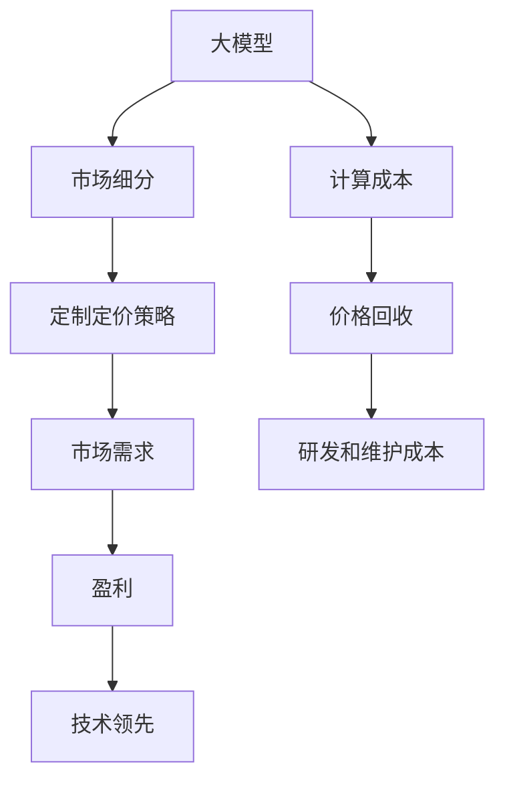

                 

# 大模型公司的定价策略探讨

## 1. 背景介绍

近年来，随着人工智能（AI）和深度学习技术的快速发展，大模型（Giant Models）在多个行业领域，如自然语言处理（NLP）、计算机视觉（CV）和语音识别等，取得了显著的突破。这些大模型由大量参数组成，可以执行复杂的任务，并在各领域的多个应用场景中实现显著的性能提升。然而，构建和维护这样的大模型需要巨额的投资，并且对于许多公司来说，这样的投资可能会超出其承受能力。因此，大模型的定价策略成为了一个重要的问题。

## 2. 核心概念与联系

### 2.1 核心概念概述

为了更好地理解大模型公司的定价策略，我们需要首先了解以下几个关键概念：

- **大模型（Giant Models）**：指的是具有亿级参数规模的深度学习模型，例如BERT、GPT-3、ViT等，这些模型可以通过大规模数据训练获得强大的泛化能力。
- **计算密集型（Computation-Intensive）**：构建和训练大模型需要大量的计算资源，包括GPU和TPU等硬件设施。
- **可扩展性（Scalability）**：大模型需要具备良好的可扩展性，以便在需要时能够快速增加计算资源。
- **定价策略（Pricing Strategies）**：公司用于确定其产品或服务价格的政策和做法。
- **市场分割（Market Segmentation）**：根据消费者的不同特征（如地理位置、行业、公司规模等）将市场分成不同的部分，以定制不同的定价策略。

### 2.2 核心概念联系

大模型公司的定价策略需要考虑以下几个核心概念：

- **计算成本**：构建和训练大模型需要投入大量计算资源，这些资源的成本需要通过定价策略回收。
- **市场细分**：不同的客户群体可能有不同的需求和预算，需要定制不同的定价策略来满足这些需求。
- **市场需求**：定价策略需要反映市场需求，以确保公司的盈利和竞争优势。
- **技术领先**：大模型的技术复杂性要求高昂的研发和维护成本，定价策略需要考虑这些成本。

这些概念之间的联系可以通过以下Mermaid流程图来展示：



这个流程图展示了构建大模型公司定价策略的关键步骤：

1. 首先，大模型需要高昂的计算成本。
2. 市场细分需要根据不同客户群体的特征进行定制。
3. 定制的定价策略需要反映市场需求，以实现盈利。
4. 盈利需要覆盖研发和维护成本。
5. 技术领先是大模型成功的关键，定价策略需要反映这一点。

## 3. 核心算法原理 & 具体操作步骤
### 3.1 算法原理概述

大模型公司的定价策略通常基于以下原理：

- **成本加成**：基于构建和维护大模型所需的总成本，加上一定的利润率来确定定价。
- **价值定价**：根据大模型为客户带来的实际价值（例如，提升效率、降低成本、提高生产力等）来确定价格。
- **竞争定价**：参考市场上其他提供类似解决方案的公司的定价，以保持竞争力。
- **动态定价**：根据市场需求、供应、季节性变化等因素，动态调整价格。

### 3.2 算法步骤详解

大模型公司的定价策略实施步骤包括以下几个关键步骤：

1. **成本估算**：计算构建和维护大模型所需的总成本，包括硬件、软件、人力资源、能源等成本。
2. **市场分析**：进行市场研究，了解目标市场的需求和竞争环境。
3. **价值评估**：评估大模型为客户带来的价值，例如通过A/B测试、用户调查等方式。
4. **定价模型构建**：根据成本、价值和市场分析结果，构建定价模型。
5. **定价策略实施**：根据定价模型确定定价策略，并进行市场测试。
6. **反馈调整**：根据市场反馈调整定价策略。

### 3.3 算法优缺点

大模型公司的定价策略有以下优点：

- **准确性**：基于成本和价值评估的定价更准确，能更好地反映市场价值。
- **灵活性**：动态定价和定制定价策略可以灵活应对市场变化和客户需求。
- **竞争优势**：合理的定价策略可以增强公司在市场上的竞争力。

但同时也存在以下缺点：

- **复杂性**：定价模型和策略的构建需要大量的市场分析和数据分析。
- **不确定性**：市场需求和竞争环境的变化可能导致定价策略失效。
- **成本高**：构建和维护定价模型需要高昂的投入。

### 3.4 算法应用领域

大模型公司的定价策略广泛应用于以下几个领域：

- **企业级市场**：如谷歌的云平台、亚马逊的AWS等，为企业客户提供定制化服务。
- **消费者市场**：如OpenAI的API访问，针对个人和小型企业提供服务。
- **学术研究**：大学和研究机构通过特定的定价策略，提供大模型供学术研究使用。

## 4. 数学模型和公式 & 详细讲解 & 举例说明

### 4.1 数学模型构建

假设大模型公司A提供了两种定价策略：成本加成和价值定价。假设构建和维护大模型的总成本为C，市场研究估计的大模型为客户带来的价值为V，公司希望获得的利润率为P。

**成本加成定价**：

$$
P_A = P + C
$$

**价值定价**：

$$
P_B = V \times P
$$

### 4.2 公式推导过程

- **成本加成定价**：
  - 总成本C包括硬件、软件、人力资源、能源等成本。
  - 利润率P是一个固定的百分比，通常为10%到30%之间。
  - 定价P_A为成本C加上利润P。

- **价值定价**：
  - 价值V是大模型为公司带来的实际价值，可以通过客户反馈、市场研究等方式评估。
  - 利润率P是公司希望获得的利润与市场价值的比例。
  - 定价P_B是市场价值V乘以利润率P。

### 4.3 案例分析与讲解

以谷歌的云平台为例，谷歌通过构建和维护大模型来提供各种AI服务。谷歌首先进行市场分析，了解客户对大模型的需求。然后，根据构建和维护大模型的成本，加上一定的利润率，确定定价。在实际操作中，谷歌会根据市场需求、客户反馈等因素，动态调整定价策略。

## 5. 项目实践：代码实例和详细解释说明

### 5.1 开发环境搭建

构建和维护大模型需要高昂的计算资源，因此在开发环境搭建时需要考虑以下几点：

1. **安装依赖**：安装必要的软件包和库，如TensorFlow、PyTorch、Jupyter Notebook等。
2. **设置计算资源**：使用GPU或TPU等高性能硬件设备，并确保足够的内存和存储空间。
3. **版本管理**：使用虚拟环境（如conda、pipenv等）进行依赖包管理。

### 5.2 源代码详细实现

假设我们开发了一个大模型A，用于自然语言处理。代码实现包括以下几个步骤：

1. **数据预处理**：
   ```python
   import pandas as pd

   # 加载数据
   data = pd.read_csv('data.csv')

   # 数据清洗
   data = data.dropna()
   ```

2. **模型训练**：
   ```python
   from transformers import BertForSequenceClassification, BertTokenizer

   # 初始化模型和tokenizer
   model = BertForSequenceClassification.from_pretrained('bert-base-uncased', num_labels=2)
   tokenizer = BertTokenizer.from_pretrained('bert-base-uncased')

   # 训练模型
   for epoch in range(epochs):
       model.train()
       for batch in train_loader:
           input_ids = batch['input_ids'].to(device)
           attention_mask = batch['attention_mask'].to(device)
           labels = batch['labels'].to(device)
           model.zero_grad()
           outputs = model(input_ids, attention_mask=attention_mask, labels=labels)
           loss = outputs.loss
           loss.backward()
           optimizer.step()
   ```

3. **模型保存与部署**：
   ```python
   # 保存模型
   model.save_pretrained('model')
   
   # 部署模型
   # 将模型部署到云平台，提供API服务
   ```

### 5.3 代码解读与分析

- **数据预处理**：使用pandas加载和清洗数据，确保数据质量。
- **模型训练**：使用Bert模型和tokenizer进行训练，确保模型能够处理大规模文本数据。
- **模型保存与部署**：使用PyTorch的保存和部署机制，确保模型能够快速部署到云平台。

## 6. 实际应用场景

### 6.1 智能客服

大模型公司在智能客服领域的定价策略可以通过以下步骤实现：

1. **成本估算**：计算构建和维护智能客服系统的总成本。
2. **市场分析**：分析市场需求，了解客户的痛点和需求。
3. **价值评估**：评估智能客服系统为客户带来的实际价值，例如提升客户满意度、降低人工成本等。
4. **定价模型构建**：根据成本和价值评估结果，构建定价模型。
5. **定价策略实施**：根据定价模型确定定价策略，并进行市场测试。
6. **反馈调整**：根据市场反馈调整定价策略。

### 6.2 医疗诊断

大模型公司在医疗诊断领域的定价策略可以通过以下步骤实现：

1. **成本估算**：计算构建和维护医疗诊断系统的总成本。
2. **市场分析**：分析市场需求，了解医疗机构的痛点和需求。
3. **价值评估**：评估医疗诊断系统为客户带来的实际价值，例如提高诊断准确率、减少误诊率等。
4. **定价模型构建**：根据成本和价值评估结果，构建定价模型。
5. **定价策略实施**：根据定价模型确定定价策略，并进行市场测试。
6. **反馈调整**：根据市场反馈调整定价策略。

### 6.3 金融风控

大模型公司在金融风控领域的定价策略可以通过以下步骤实现：

1. **成本估算**：计算构建和维护金融风控系统的总成本。
2. **市场分析**：分析市场需求，了解金融机构的痛点和需求。
3. **价值评估**：评估金融风控系统为客户带来的实际价值，例如降低欺诈率、减少损失等。
4. **定价模型构建**：根据成本和价值评估结果，构建定价模型。
5. **定价策略实施**：根据定价模型确定定价策略，并进行市场测试。
6. **反馈调整**：根据市场反馈调整定价策略。

### 6.4 未来应用展望

大模型公司的定价策略未来将有更大的发展潜力，主要体现在以下几个方面：

1. **自动化定价**：利用AI和机器学习技术，实现自动定价和动态调整。
2. **多维定价**：结合多个因素（如使用量、用户满意度、市场竞争等）进行综合定价。
3. **定制化服务**：根据客户的具体需求提供定制化定价方案。
4. **跨领域应用**：将定价策略应用于不同领域，提高整体市场竞争力。

## 7. 工具和资源推荐

### 7.1 学习资源推荐

- **Coursera**：提供AI和机器学习领域的在线课程，涵盖深度学习、大数据、自然语言处理等。
- **Kaggle**：数据科学竞赛平台，提供丰富的数据集和模型竞赛，有助于理解市场和技术趋势。
- **Google Cloud Learning**：谷歌提供的免费在线课程，涵盖云平台和AI技术。
- **Udacity**：提供专业的AI和数据科学课程，涵盖深度学习、计算机视觉、自然语言处理等。

### 7.2 开发工具推荐

- **TensorFlow**：谷歌开发的开源深度学习框架，支持分布式计算和动态图。
- **PyTorch**：Facebook开发的开源深度学习框架，支持动态图和静态图。
- **Jupyter Notebook**：交互式编程环境，支持Python、R、Julia等多种语言。
- **Google Colab**：谷歌提供的免费在线Jupyter Notebook环境，支持GPU和TPU计算。

### 7.3 相关论文推荐

- **Cost-Effective AI**：探讨如何构建低成本高效益的AI系统，实现资源利用最大化。
- **Market Segmentation for AI Services**：分析不同市场细分对AI服务定价的影响，提出定制化定价策略。
- **Value-Based Pricing in AI**：研究如何通过价值评估来确定AI服务的定价。
- **Dynamic Pricing in AI**：探讨动态定价策略在AI服务中的应用，实现市场竞争力提升。

## 8. 总结：未来发展趋势与挑战

### 8.1 总结

大模型公司的定价策略是大模型应用的重要组成部分，直接关系到公司的市场竞争力和盈利能力。本文从成本加成和价值定价两个角度探讨了大模型公司的定价策略，并结合实际应用场景进行了详细分析。通过构建和维护大模型，大模型公司能够提供高效的AI服务，提升客户体验，满足不同客户群体的需求，从而实现市场竞争优势。

### 8.2 未来发展趋势

大模型公司的定价策略未来将呈现以下几个发展趋势：

1. **自动化定价**：利用AI和机器学习技术，实现自动定价和动态调整。
2. **多维定价**：结合多个因素（如使用量、用户满意度、市场竞争等）进行综合定价。
3. **定制化服务**：根据客户的具体需求提供定制化定价方案。
4. **跨领域应用**：将定价策略应用于不同领域，提高整体市场竞争力。

### 8.3 面临的挑战

大模型公司的定价策略面临以下几个挑战：

1. **高昂成本**：构建和维护大模型需要高昂的成本，如何有效回收成本是关键问题。
2. **市场变化**：市场需求和竞争环境的变化可能导致定价策略失效。
3. **客户需求**：不同客户群体的需求差异较大，如何定制定价策略是难点。

### 8.4 研究展望

未来，大模型公司的定价策略需要从以下几个方面进行研究：

1. **成本管理**：优化成本结构，降低构建和维护大模型的成本。
2. **市场分析**：深入研究市场需求和竞争环境，制定有效的定价策略。
3. **价值评估**：建立全面的价值评估体系，准确反映大模型为客户带来的价值。
4. **动态定价**：结合市场反馈和客户需求，动态调整定价策略。

通过不断优化定价策略，大模型公司能够更好地适应市场变化，提升竞争力，实现长期的可持续发展。

## 9. 附录：常见问题与解答

**Q1：大模型公司的定价策略有哪些？**

A: 大模型公司的定价策略通常包括以下几种：
- **成本加成定价**：基于构建和维护大模型的总成本，加上一定的利润率来确定定价。
- **价值定价**：根据大模型为客户带来的实际价值（例如，提升效率、降低成本、提高生产力等）来确定价格。
- **竞争定价**：参考市场上其他提供类似解决方案的公司的定价，以保持竞争力。
- **动态定价**：根据市场需求、供应、季节性变化等因素，动态调整价格。

**Q2：如何构建定价模型？**

A: 构建定价模型需要以下步骤：
1. **成本估算**：计算构建和维护大模型的总成本。
2. **市场分析**：进行市场研究，了解目标市场的需求和竞争环境。
3. **价值评估**：评估大模型为客户带来的价值，例如通过A/B测试、用户调查等方式。
4. **定价模型构建**：根据成本、价值和市场分析结果，构建定价模型。
5. **定价策略实施**：根据定价模型确定定价策略，并进行市场测试。
6. **反馈调整**：根据市场反馈调整定价策略。

**Q3：如何优化定价策略？**

A: 优化定价策略需要以下步骤：
1. **成本管理**：优化成本结构，降低构建和维护大模型的成本。
2. **市场分析**：深入研究市场需求和竞争环境，制定有效的定价策略。
3. **价值评估**：建立全面的价值评估体系，准确反映大模型为客户带来的价值。
4. **动态定价**：结合市场反馈和客户需求，动态调整定价策略。

**Q4：如何应对定价策略的挑战？**

A: 应对定价策略的挑战需要以下方法：
1. **成本控制**：通过技术创新和资源优化，降低构建和维护大模型的成本。
2. **市场分析**：深入了解市场需求和竞争环境，制定合理的定价策略。
3. **客户需求**：根据客户的具体需求，提供定制化的定价方案。
4. **动态调整**：根据市场反馈和客户需求，动态调整定价策略。

---

作者：禅与计算机程序设计艺术 / Zen and the Art of Computer Programming

