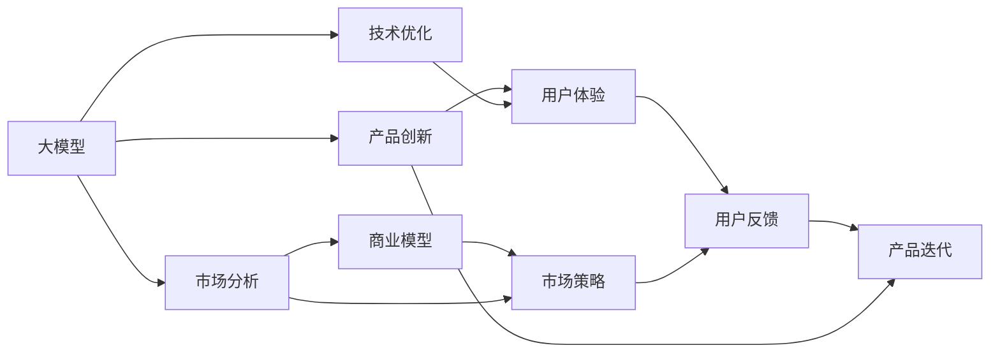

                 

# 大模型创业：产品创新与市场分析

## 1. 背景介绍

### 1.1 问题由来
随着人工智能技术的飞速发展，大模型（如GPT、BERT等）在自然语言处理（NLP）、计算机视觉（CV）等领域的突破，使得商业应用场景更加丰富。然而，如何将大模型产品化、商业化，使其在各垂直行业创造价值，成为各大企业的战略重点。

### 1.2 问题核心关键点
大模型创业的关键在于找到合适的商业切入点，并能够将技术优势转化为市场竞争力。具体而言，需要解决以下几个核心问题：
- 商业模型的选择与定位
- 技术优势的转化与优化
- 市场策略的制定与执行
- 用户体验的提升与迭代

本文将系统梳理大模型创业的创新路径，分析其市场趋势，并为有志于大模型创业的企业提供实用的策略建议。

### 1.3 问题研究意义
大模型创业不仅能够推动人工智能技术的落地应用，还能催生新的商业模式、提升社会生产力。其研究意义在于：
- 为技术型企业提供创业方向，加速人工智能技术的产业化进程。
- 为垂直行业提供创新应用，推动各行各业的数字化转型。
- 探索人工智能产品的市场化路径，推动技术与商业的深度融合。

## 2. 核心概念与联系

### 2.1 核心概念概述

为更好地理解大模型创业，本节将介绍几个关键概念及其相互关系：

- 大模型（Large Models）：指基于深度学习框架训练的大规模预训练模型，如GPT、BERT等。通过在大规模无标签数据上进行预训练，学习通用知识，具备强大的泛化能力。

- 产品创新（Product Innovation）：指通过技术突破和产品设计，实现新功能、新体验，满足用户需求的过程。在大模型创业中，产品创新是核心驱动力。

- 市场分析（Market Analysis）：指通过对市场环境的深入分析，识别机会与挑战，制定合理的市场策略。市场分析是大模型创业成功的关键环节。

- 用户体验（User Experience）：指用户在使用产品时的主观感受和满意度。在大模型创业中，提供卓越的用户体验是提升用户粘性和市场占有率的重要手段。

- 商业模型（Business Model）：指企业通过提供产品或服务实现收入的商业模式。在大模型创业中，商业模型决定了企业的盈利方式和市场扩展策略。

这些核心概念之间相互联系，构成了大模型创业的完整框架。通过理解这些概念及其相互作用，我们可以更好地把握大模型创业的脉络。

### 2.2 核心概念原理和架构的 Mermaid 流程图(Mermaid 流程节点中不要有括号、逗号等特殊字符)



## 3. 核心算法原理 & 具体操作步骤
### 3.1 算法原理概述

大模型创业的核心在于将大模型的技术优势转化为商业价值。主要包括以下几个关键步骤：

- **数据收集与预处理**：收集与业务相关的数据，并进行清洗、标注等预处理，为大模型的训练提供数据基础。

- **大模型训练**：使用大模型框架（如PyTorch、TensorFlow等）训练预训练模型，并在特定任务上进行微调，提升模型性能。

- **产品设计与开发**：基于训练好的模型，设计适合市场需求的产品原型，并进行开发和测试。

- **市场策略制定与执行**：制定市场推广策略，包括目标市场定位、定价策略、营销渠道等，并执行推广计划。

- **用户体验提升与迭代**：通过用户反馈不断优化产品功能和服务体验，形成良性循环。

### 3.2 算法步骤详解

**Step 1: 数据收集与预处理**
- 确定业务需求：分析目标市场的需求，选择合适的大模型训练任务。
- 数据收集：获取相关领域的数据，如文本、图像、音频等。
- 数据预处理：清洗数据，去除噪声和无用信息，并进行标注，形成有监督的数据集。

**Step 2: 大模型训练与微调**
- 选择大模型框架：根据项目需求选择合适的深度学习框架。
- 模型训练：在大规模数据集上进行预训练，学习通用知识。
- 任务适配：在特定任务上对预训练模型进行微调，提升模型性能。

**Step 3: 产品设计与开发**
- 用户需求分析：通过调研和访谈，了解用户需求和痛点。
- 产品设计：设计符合用户需求的产品原型，包括界面、功能、交互逻辑等。
- 原型开发：基于产品设计进行原型开发，并进行功能测试和用户测试。

**Step 4: 市场策略制定与执行**
- 市场定位：分析目标市场，确定产品的市场定位和竞争策略。
- 营销推广：制定营销推广计划，选择合适的营销渠道和工具。
- 销售执行：通过线上线下渠道进行产品推广，获取用户反馈。

**Step 5: 用户体验提升与迭代**
- 用户反馈收集：通过问卷、评价、客服等渠道收集用户反馈。
- 产品迭代：根据用户反馈优化产品功能和服务体验。
- 持续改进：持续收集用户反馈，进行产品迭代，提升用户体验。

### 3.3 算法优缺点

大模型创业的优势在于：
- 数据驱动：通过大数据和深度学习技术，能够高效处理海量数据，提取高价值信息。
- 技术领先：利用大模型的预训练优势，能够快速迭代产品，提升竞争力。
- 快速扩展：市场策略灵活，可以快速调整和优化，适应市场变化。

其缺点包括：
- 数据成本高：数据收集和标注成本较高，尤其在大规模数据集上。
- 技术门槛高：深度学习和大模型技术复杂，需要专业团队支持。
- 市场竞争激烈：人工智能领域竞争激烈，需要持续创新和优化。

### 3.4 算法应用领域

大模型创业广泛应用于以下领域：

- **医疗健康**：利用大模型进行疾病诊断、医学影像分析、健康管理等，提升医疗服务的智能化水平。
- **金融服务**：通过大模型进行风险评估、市场预测、客户服务分析等，提升金融服务的精准度和效率。
- **智能制造**：利用大模型进行工艺优化、设备维护、质量控制等，提升制造业的自动化水平。
- **零售电商**：通过大模型进行个性化推荐、商品描述生成、客服对话等，提升电商平台的用户体验。
- **智慧城市**：利用大模型进行交通管理、公共安全、环境监测等，提升城市治理的智能化水平。

## 4. 数学模型和公式 & 详细讲解 & 举例说明

### 4.1 数学模型构建

以大模型在自然语言处理（NLP）任务上的应用为例，构建数学模型。

设大模型为 $M_{\theta}$，输入为文本 $x$，输出为标签 $y$，则NLP任务的数学模型可表示为：

$$
M_{\theta}(x) = y
$$

其中，$\theta$ 为模型参数。

### 4.2 公式推导过程

以分类任务为例，假设模型的输出为 $y$ 的概率分布 $P(y|x)$，则分类损失函数可表示为：

$$
\mathcal{L}(\theta) = -\frac{1}{N}\sum_{i=1}^N \sum_{j=1}^C y_{ij}\log P(y_j|x_i)
$$

其中，$N$ 为样本数量，$C$ 为类别数。

### 4.3 案例分析与讲解

假设任务为情感分类，输入为一句话 "I love you"，输出为情感标签 "positive"。

- **模型训练**：在大规模情感数据集上进行预训练，学习情感分类知识。
- **任务适配**：在情感分类任务上对预训练模型进行微调，提升分类精度。
- **产品实现**：设计情感分析API接口，供开发者调用，实现产品化。

## 5. 项目实践：代码实例和详细解释说明

### 5.1 开发环境搭建

在进行大模型创业项目开发前，需要先搭建好开发环境。以下是使用Python进行PyTorch开发的常用环境配置流程：

1. 安装Anaconda：从官网下载并安装Anaconda，用于创建独立的Python环境。

2. 创建并激活虚拟环境：
```bash
conda create -n pytorch-env python=3.8 
conda activate pytorch-env
```

3. 安装PyTorch：根据CUDA版本，从官网获取对应的安装命令。例如：
```bash
conda install pytorch torchvision torchaudio cudatoolkit=11.1 -c pytorch -c conda-forge
```

4. 安装TensorFlow：安装TensorFlow，用于可视化工具TensorBoard和计算图优化工具TF-Slim。

5. 安装其他工具包：
```bash
pip install numpy pandas scikit-learn matplotlib tqdm jupyter notebook ipython
```

完成上述步骤后，即可在`pytorch-env`环境中开始开发实践。

### 5.2 源代码详细实现

下面以情感分析为例，给出使用PyTorch对BERT模型进行微调的代码实现。

首先，定义情感分类数据集：

```python
from torch.utils.data import Dataset
import torch

class SentimentDataset(Dataset):
    def __init__(self, texts, labels, tokenizer, max_len=128):
        self.texts = texts
        self.labels = labels
        self.tokenizer = tokenizer
        self.max_len = max_len
        
    def __len__(self):
        return len(self.texts)
    
    def __getitem__(self, item):
        text = self.texts[item]
        label = self.labels[item]
        
        encoding = self.tokenizer(text, return_tensors='pt', max_length=self.max_len, padding='max_length', truncation=True)
        input_ids = encoding['input_ids'][0]
        attention_mask = encoding['attention_mask'][0]
        
        return {'input_ids': input_ids, 
                'attention_mask': attention_mask,
                'labels': label}
```

然后，定义模型和优化器：

```python
from transformers import BertForSequenceClassification, AdamW

model = BertForSequenceClassification.from_pretrained('bert-base-cased', num_labels=2)

optimizer = AdamW(model.parameters(), lr=2e-5)
```

接着，定义训练和评估函数：

```python
from torch.utils.data import DataLoader
from tqdm import tqdm

device = torch.device('cuda') if torch.cuda.is_available() else torch.device('cpu')
model.to(device)

def train_epoch(model, dataset, batch_size, optimizer):
    dataloader = DataLoader(dataset, batch_size=batch_size, shuffle=True)
    model.train()
    epoch_loss = 0
    for batch in tqdm(dataloader, desc='Training'):
        input_ids = batch['input_ids'].to(device)
        attention_mask = batch['attention_mask'].to(device)
        labels = batch['labels'].to(device)
        model.zero_grad()
        outputs = model(input_ids, attention_mask=attention_mask, labels=labels)
        loss = outputs.loss
        epoch_loss += loss.item()
        loss.backward()
        optimizer.step()
    return epoch_loss / len(dataloader)

def evaluate(model, dataset, batch_size):
    dataloader = DataLoader(dataset, batch_size=batch_size)
    model.eval()
    preds, labels = [], []
    with torch.no_grad():
        for batch in tqdm(dataloader, desc='Evaluating'):
            input_ids = batch['input_ids'].to(device)
            attention_mask = batch['attention_mask'].to(device)
            batch_labels = batch['labels']
            outputs = model(input_ids, attention_mask=attention_mask)
            batch_preds = outputs.logits.argmax(dim=2).to('cpu').tolist()
            batch_labels = batch_labels.to('cpu').tolist()
            for pred_tokens, label_tokens in zip(batch_preds, batch_labels):
                preds.append(pred_tokens)
                labels.append(label_tokens)
                
    print(classification_report(labels, preds))
```

最后，启动训练流程并在测试集上评估：

```python
epochs = 5
batch_size = 16

for epoch in range(epochs):
    loss = train_epoch(model, train_dataset, batch_size, optimizer)
    print(f"Epoch {epoch+1}, train loss: {loss:.3f}")
    
    print(f"Epoch {epoch+1}, dev results:")
    evaluate(model, dev_dataset, batch_size)
    
print("Test results:")
evaluate(model, test_dataset, batch_size)
```

以上就是使用PyTorch对BERT进行情感分析任务微调的完整代码实现。可以看到，利用Transformers库，代码实现简洁高效。

### 5.3 代码解读与分析

让我们再详细解读一下关键代码的实现细节：

**SentimentDataset类**：
- `__init__`方法：初始化文本、标签、分词器等关键组件。
- `__len__`方法：返回数据集的样本数量。
- `__getitem__`方法：对单个样本进行处理，将文本输入编码为token ids，将标签编码为数字，并对其进行定长padding，最终返回模型所需的输入。

**训练和评估函数**：
- 使用PyTorch的DataLoader对数据集进行批次化加载，供模型训练和推理使用。
- 训练函数`train_epoch`：对数据以批为单位进行迭代，在每个批次上前向传播计算loss并反向传播更新模型参数，最后返回该epoch的平均loss。
- 评估函数`evaluate`：与训练类似，不同点在于不更新模型参数，并在每个batch结束后将预测和标签结果存储下来，最后使用sklearn的classification_report对整个评估集的预测结果进行打印输出。

**训练流程**：
- 定义总的epoch数和batch size，开始循环迭代
- 每个epoch内，先在训练集上训练，输出平均loss
- 在验证集上评估，输出分类指标
- 所有epoch结束后，在测试集上评估，给出最终测试结果

可以看到，PyTorch配合Transformers库使得BERT微调的代码实现变得简洁高效。开发者可以将更多精力放在数据处理、模型改进等高层逻辑上，而不必过多关注底层的实现细节。

当然，工业级的系统实现还需考虑更多因素，如模型的保存和部署、超参数的自动搜索、更灵活的任务适配层等。但核心的微调范式基本与此类似。

## 6. 实际应用场景

### 6.1 智能客服系统

基于大模型微调的对话技术，可以广泛应用于智能客服系统的构建。传统客服往往需要配备大量人力，高峰期响应缓慢，且一致性和专业性难以保证。而使用微调后的对话模型，可以7x24小时不间断服务，快速响应客户咨询，用自然流畅的语言解答各类常见问题。

在技术实现上，可以收集企业内部的历史客服对话记录，将问题和最佳答复构建成监督数据，在此基础上对预训练对话模型进行微调。微调后的对话模型能够自动理解用户意图，匹配最合适的答案模板进行回复。对于客户提出的新问题，还可以接入检索系统实时搜索相关内容，动态组织生成回答。如此构建的智能客服系统，能大幅提升客户咨询体验和问题解决效率。

### 6.2 金融舆情监测

金融机构需要实时监测市场舆论动向，以便及时应对负面信息传播，规避金融风险。传统的人工监测方式成本高、效率低，难以应对网络时代海量信息爆发的挑战。基于大语言模型微调的文本分类和情感分析技术，为金融舆情监测提供了新的解决方案。

具体而言，可以收集金融领域相关的新闻、报道、评论等文本数据，并对其进行主题标注和情感标注。在此基础上对预训练语言模型进行微调，使其能够自动判断文本属于何种主题，情感倾向是正面、中性还是负面。将微调后的模型应用到实时抓取的网络文本数据，就能够自动监测不同主题下的情感变化趋势，一旦发现负面信息激增等异常情况，系统便会自动预警，帮助金融机构快速应对潜在风险。

### 6.3 个性化推荐系统

当前的推荐系统往往只依赖用户的历史行为数据进行物品推荐，无法深入理解用户的真实兴趣偏好。基于大语言模型微调技术，个性化推荐系统可以更好地挖掘用户行为背后的语义信息，从而提供更精准、多样的推荐内容。

在实践中，可以收集用户浏览、点击、评论、分享等行为数据，提取和用户交互的物品标题、描述、标签等文本内容。将文本内容作为模型输入，用户的后续行为（如是否点击、购买等）作为监督信号，在此基础上微调预训练语言模型。微调后的模型能够从文本内容中准确把握用户的兴趣点。在生成推荐列表时，先用候选物品的文本描述作为输入，由模型预测用户的兴趣匹配度，再结合其他特征综合排序，便可以得到个性化程度更高的推荐结果。

### 6.4 未来应用展望

随着大语言模型和微调方法的不断发展，基于微调范式将在更多领域得到应用，为传统行业带来变革性影响。

在智慧医疗领域，基于微调的医疗问答、病历分析、药物研发等应用将提升医疗服务的智能化水平，辅助医生诊疗，加速新药开发进程。

在智能教育领域，微调技术可应用于作业批改、学情分析、知识推荐等方面，因材施教，促进教育公平，提高教学质量。

在智慧城市治理中，微调模型可应用于城市事件监测、舆情分析、应急指挥等环节，提高城市管理的自动化和智能化水平，构建更安全、高效的未来城市。

此外，在企业生产、社会治理、文娱传媒等众多领域，基于大模型微调的人工智能应用也将不断涌现，为经济社会发展注入新的动力。相信随着预训练模型和微调方法的持续演进，大模型微调必将在构建人机协同的智能时代中扮演越来越重要的角色。

## 7. 工具和资源推荐
### 7.1 学习资源推荐

为了帮助开发者系统掌握大模型微调的理论基础和实践技巧，这里推荐一些优质的学习资源：

1. 《Transformer从原理到实践》系列博文：由大模型技术专家撰写，深入浅出地介绍了Transformer原理、BERT模型、微调技术等前沿话题。

2. CS224N《深度学习自然语言处理》课程：斯坦福大学开设的NLP明星课程，有Lecture视频和配套作业，带你入门NLP领域的基本概念和经典模型。

3. 《Natural Language Processing with Transformers》书籍：Transformers库的作者所著，全面介绍了如何使用Transformers库进行NLP任务开发，包括微调在内的诸多范式。

4. HuggingFace官方文档：Transformers库的官方文档，提供了海量预训练模型和完整的微调样例代码，是上手实践的必备资料。

5. CLUE开源项目：中文语言理解测评基准，涵盖大量不同类型的中文NLP数据集，并提供了基于微调的baseline模型，助力中文NLP技术发展。

通过对这些资源的学习实践，相信你一定能够快速掌握大模型微调的精髓，并用于解决实际的NLP问题。
### 7.2 开发工具推荐

高效的开发离不开优秀的工具支持。以下是几款用于大模型微调开发的常用工具：

1. PyTorch：基于Python的开源深度学习框架，灵活动态的计算图，适合快速迭代研究。大部分预训练语言模型都有PyTorch版本的实现。

2. TensorFlow：由Google主导开发的开源深度学习框架，生产部署方便，适合大规模工程应用。同样有丰富的预训练语言模型资源。

3. Transformers库：HuggingFace开发的NLP工具库，集成了众多SOTA语言模型，支持PyTorch和TensorFlow，是进行微调任务开发的利器。

4. Weights & Biases：模型训练的实验跟踪工具，可以记录和可视化模型训练过程中的各项指标，方便对比和调优。与主流深度学习框架无缝集成。

5. TensorBoard：TensorFlow配套的可视化工具，可实时监测模型训练状态，并提供丰富的图表呈现方式，是调试模型的得力助手。

6. Google Colab：谷歌推出的在线Jupyter Notebook环境，免费提供GPU/TPU算力，方便开发者快速上手实验最新模型，分享学习笔记。

合理利用这些工具，可以显著提升大模型微调任务的开发效率，加快创新迭代的步伐。

### 7.3 相关论文推荐

大语言模型和微调技术的发展源于学界的持续研究。以下是几篇奠基性的相关论文，推荐阅读：

1. Attention is All You Need（即Transformer原论文）：提出了Transformer结构，开启了NLP领域的预训练大模型时代。

2. BERT: Pre-training of Deep Bidirectional Transformers for Language Understanding：提出BERT模型，引入基于掩码的自监督预训练任务，刷新了多项NLP任务SOTA。

3. Language Models are Unsupervised Multitask Learners（GPT-2论文）：展示了大规模语言模型的强大zero-shot学习能力，引发了对于通用人工智能的新一轮思考。

4. Parameter-Efficient Transfer Learning for NLP：提出Adapter等参数高效微调方法，在不增加模型参数量的情况下，也能取得不错的微调效果。

5. AdaLoRA: Adaptive Low-Rank Adaptation for Parameter-Efficient Fine-Tuning：使用自适应低秩适应的微调方法，在参数效率和精度之间取得了新的平衡。

这些论文代表了大语言模型微调技术的发展脉络。通过学习这些前沿成果，可以帮助研究者把握学科前进方向，激发更多的创新灵感。

## 8. 总结：未来发展趋势与挑战

### 8.1 总结

本文对大模型创业的创新路径进行了全面系统的介绍。首先，阐述了大模型创业的背景和核心关键点，明确了产品创新和市场分析在大模型创业中的重要性。其次，从原理到实践，详细讲解了大模型微调的方法和步骤，给出了实际应用的代码示例。同时，分析了大模型创业在多个行业领域的应用前景，并推荐了相关的学习资源和工具。

通过本文的系统梳理，可以看到，大模型创业不仅能够推动人工智能技术的落地应用，还能催生新的商业模式、提升社会生产力。未来，伴随预训练语言模型和微调方法的持续演进，大模型创业必将在更多领域得到应用，为人类认知智能的进化带来深远影响。

### 8.2 未来发展趋势

展望未来，大模型创业将呈现以下几个发展趋势：

1. **技术融合与创新**：大模型创业将与其他人工智能技术进行更深入的融合，如知识表示、因果推理、强化学习等，推动技术突破和应用创新。

2. **行业垂直化**：随着技术积累和市场扩展，大模型创业将从通用NLP应用扩展到垂直领域，如医疗、金融、零售等，形成行业特色和差异化竞争力。

3. **数据驱动与动态优化**：大模型创业将更加重视数据的驱动作用，通过持续收集和利用新数据，动态优化模型和产品，提升用户体验和市场适应性。

4. **全栈化与生态系统构建**：大模型创业将从单一产品向全栈解决方案转型，构建生态系统，提供端到端的智能服务，提升市场竞争力。

5. **国际合作与标准化**：大模型创业将加强国际合作，推动行业标准的制定和实施，提升产品和服务的国际竞争力。

### 8.3 面临的挑战

尽管大模型创业前景广阔，但在迈向更加智能化、普适化应用的过程中，它仍面临诸多挑战：

1. **数据成本与获取**：高质量标注数据的获取成本较高，尤其在大规模数据集上。如何降低数据成本，优化数据采集和标注流程，是大模型创业的重要课题。

2. **技术门槛与团队建设**：深度学习和自然语言处理技术复杂，需要专业团队支持。如何提升团队技术水平，构建高效的技术架构，是大模型创业的关键挑战。

3. **市场竞争与品牌建设**：人工智能领域竞争激烈，如何打造独特的品牌，提升市场影响力，是大模型创业的重要任务。

4. **用户教育与市场推广**：如何让更多用户接受和应用大模型产品，是大模型创业需要解决的重要问题。如何制定有效的市场推广策略，进行用户教育和培训，是大模型创业的重要环节。

5. **伦理与合规**：大模型创业需要关注伦理和合规问题，确保模型输出符合人类价值观和法律法规。如何设计合理的伦理约束机制，是大模型创业的重大课题。

### 8.4 研究展望

面对大模型创业所面临的挑战，未来的研究需要在以下几个方面寻求新的突破：

1. **数据增强与半监督学习**：探索基于无监督和半监督学习的数据增强技术，降低标注数据需求，提升模型泛化能力。

2. **多模态融合**：融合视觉、语音、文本等多模态数据，构建更全面、更智能的智能系统，提升用户体验和应用场景。

3. **个性化与动态优化**：通过个性化推荐、动态优化等技术，提升大模型产品的定制化程度和市场适应性。

4. **解释性与透明度**：提升大模型产品的可解释性和透明度，帮助用户理解和信任模型决策，推动模型应用的普及。

5. **跨领域知识融合**：将知识图谱、逻辑规则等先验知识与大模型结合，提升模型的知识整合能力和推理能力。

6. **泛化性与鲁棒性**：提升大模型的泛化能力和鲁棒性，使其在跨领域、跨任务中都能表现稳定。

这些研究方向将推动大模型创业向更加智能化、普适化和可持续化的方向发展，为人工智能技术在各垂直行业的落地应用奠定坚实基础。

## 9. 附录：常见问题与解答

**Q1：大模型创业是否需要大规模数据集？**

A: 大模型创业需要高质量的标注数据，但并不要求大规模数据集。对于垂直领域任务，如医疗、金融、零售等，可以针对具体需求收集相关数据，进行小规模、高精度的微调。

**Q2：大模型创业是否需要持续的资金投入？**

A: 大模型创业需要持续的资金投入，用于数据收集、模型训练、市场推广等环节。但随着模型的商业化应用，收入将逐渐覆盖成本，形成良性循环。

**Q3：大模型创业是否需要专业的技术团队？**

A: 大模型创业需要专业的技术团队，包括数据科学家、机器学习工程师、产品经理等。技术团队需要具备丰富的深度学习和大模型经验，能够快速迭代和优化模型和产品。

**Q4：大模型创业是否需要面对伦理和合规问题？**

A: 大模型创业需要关注伦理和合规问题，确保模型输出符合人类价值观和法律法规。如何设计合理的伦理约束机制，是大模型创业的重要课题。

**Q5：大模型创业是否需要关注用户教育和培训？**

A: 大模型创业需要关注用户教育和培训，让更多用户接受和应用大模型产品。如何制定有效的市场推广策略，进行用户教育和培训，是大模型创业的重要环节。

---

作者：禅与计算机程序设计艺术 / Zen and the Art of Computer Programming

