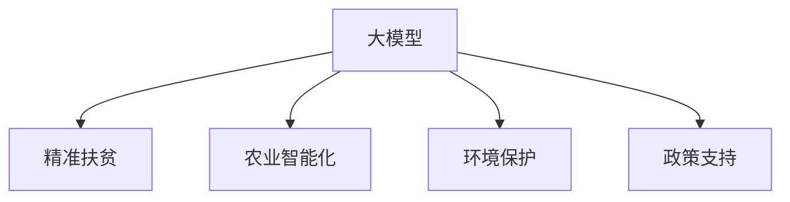

                 

# 大模型在减贫与可持续发展领域的作用

> 关键词：大模型, 减贫, 可持续发展, 深度学习, 精准扶贫, 农业智能化, 环境保护, 政策支持

## 1. 背景介绍

### 1.1 问题由来
近年来，全球贫困问题依然严峻，减贫仍是各国政府和社会组织的重要任务。根据联合国数据显示，尽管全球贫困人口在过去几十年中显著减少，但2020年仍然有7.9亿人生活在极度贫困中，尤其是发展中国家的贫困问题更为突出。

为应对这一挑战，各国纷纷采取措施，从政策引导、产业扶持到精准扶贫，多管齐下，但效果仍不尽如人意。技术应用成为新一轮减贫工作的关键方向，其中大模型在减贫与可持续发展领域的应用前景尤为引人注目。

### 1.2 问题核心关键点
大模型在减贫与可持续发展领域的应用主要涉及以下几个关键点：
1. **精准扶贫**：利用大模型对贫困地区的自然条件、社会经济情况进行深入分析，确定精准扶贫的目标和策略。
2. **农业智能化**：通过大模型对农业生产进行智能化管理，提高农作物产量，减少资源浪费。
3. **环境保护**：利用大模型进行环境监测和预警，减少环境污染和资源浪费。
4. **政策支持**：基于大数据分析，制定更科学合理的扶贫和可持续发展政策。

### 1.3 问题研究意义
大模型在减贫与可持续发展领域的应用，对于提升减贫效率、实现可持续发展具有重要意义：
1. **提高决策效率**：通过大模型进行数据分析和预测，能够快速提供决策支持，减少人为失误，提升决策科学性。
2. **降低人力成本**：大模型能够自动处理大量数据，减轻人力负担，降低减贫工作的成本。
3. **增强数据驱动决策**：大模型提供的数据分析结果，能够为政策制定和实施提供有力支撑，提高政策效果。
4. **促进创新应用**：大模型在农业、环保等领域的应用，能够推动新技术、新模式的产生，促进减贫与可持续发展工作的创新。

## 2. 核心概念与联系

### 2.1 核心概念概述

为了更好地理解大模型在减贫与可持续发展领域的应用，本节将介绍几个密切相关的核心概念：

- **大模型(Large Model)**：指具有大规模参数量和复杂模型的深度学习模型，如BERT、GPT-3等。这些模型通过在大规模数据上进行预训练，能够学习到丰富的知识，适用于复杂数据处理和决策任务。

- **精准扶贫(Precision Poverty Alleviation)**：指通过精细化的数据分析和预测，确定贫困人群和区域，针对性地采取扶贫措施，提高扶贫效果。

- **农业智能化(Agricultural Intelligentization)**：通过大模型对农业生产过程进行智能化管理，包括气象预测、病虫害监测、作物生长模拟等，提高农业生产效率和资源利用率。

- **环境保护(Environmental Protection)**：利用大模型进行环境监测和预警，如空气质量监测、森林火灾预测、污染源识别等，减少环境污染和资源浪费。

- **政策支持(Policy Support)**：通过大模型分析历史数据和预测结果，为政府制定更科学合理的扶贫和可持续发展政策提供依据。

这些核心概念之间的逻辑关系可以通过以下Mermaid流程图来展示：



这个流程图展示了大模型在减贫与可持续发展领域的核心概念及其之间的关系：

1. 大模型通过预训练获得广泛知识，被应用于精准扶贫、农业智能化、环境保护和政策支持等多个领域。
2. 各领域应用通过对大模型的进一步微调或定制，实现特定任务的处理。

## 3. 核心算法原理 & 具体操作步骤
### 3.1 算法原理概述

大模型在减贫与可持续发展领域的应用，本质上是一个多任务学习过程。其核心思想是：利用大模型的预训练能力，通过在多个特定任务上进行微调，提升模型在减贫与可持续发展领域的具体应用性能。

具体而言，大模型被用于分析自然条件、社会经济状况、历史数据和预测结果，生成决策支持和优化策略，从而提高减贫和可持续发展的效率。

### 3.2 算法步骤详解

大模型在减贫与可持续发展领域的应用，一般包括以下几个关键步骤：

**Step 1: 数据收集与预处理**
- 收集相关领域的各类数据，包括贫困地区的自然条件、社会经济数据、农业生产数据、环境监测数据等。
- 对数据进行清洗、标注和标准化处理，确保数据质量。

**Step 2: 模型选择与微调**
- 选择合适的预训练大模型，如BERT、GPT-3等。
- 根据具体应用场景，设计相应的微调目标和损失函数。
- 在标注数据集上，对模型进行微调，优化模型在特定任务上的性能。

**Step 3: 模型应用与优化**
- 将微调后的模型应用到实际场景中，如精准扶贫、农业智能化、环境保护等。
- 实时监测模型性能，根据实际应用效果不断调整模型参数和优化策略。

**Step 4: 效果评估与反馈**
- 通过评估模型在实际应用中的效果，反馈数据和结果，进一步优化模型和策略。
- 不断迭代改进，提升减贫和可持续发展的效率和效果。

### 3.3 算法优缺点

大模型在减贫与可持续发展领域的应用，具有以下优点：
1. **高效性**：大模型能够快速处理和分析大量数据，提高决策效率。
2. **精准性**：通过微调，模型能够更好地适应特定任务，提高决策的准确性和可靠性。
3. **普适性**：大模型适用于多种领域的减贫与可持续发展任务，具有广泛的应用前景。
4. **可扩展性**：随着大模型的不断优化和更新，其应用范围和效果将进一步提升。

同时，该方法也存在一些局限性：
1. **数据依赖**：模型效果高度依赖于数据的质量和数量，需要投入大量时间和资源进行数据收集和处理。
2. **解释性不足**：大模型的决策过程较为复杂，缺乏可解释性，难以解释模型的推理逻辑。
3. **公平性问题**：模型可能存在数据偏差和算法偏见，需要特别注意公平性和公正性问题。

### 3.4 算法应用领域

大模型在减贫与可持续发展领域的应用，主要包括以下几个方面：

- **精准扶贫**：利用大模型对贫困地区进行分析和预测，确定精准扶贫的目标和策略，提高扶贫的针对性和有效性。
- **农业智能化**：通过大模型进行气象预测、病虫害监测、作物生长模拟等，提高农业生产效率和资源利用率。
- **环境保护**：利用大模型进行环境监测和预警，减少环境污染和资源浪费，提升环境保护的效果。
- **政策支持**：基于大模型的数据分析结果，制定科学合理的扶贫和可持续发展政策，提升政策的实施效果。

## 4. 数学模型和公式 & 详细讲解  
### 4.1 数学模型构建

大模型在减贫与可持续发展领域的应用，可以抽象为多任务学习问题。假设大模型为 $M_{\theta}$，其中 $\theta$ 为模型参数。具体应用场景 $T$ 包括精准扶贫、农业智能化、环境保护和政策支持等。

在每个场景 $T_i$ 上，大模型的预测结果为 $\hat{y}$，真实标签为 $y$。微调的优化目标是最小化损失函数 $\mathcal{L}_i$，即：

$$
\hat{\theta} = \mathop{\arg\min}_{\theta} \sum_{i=1}^N \mathcal{L}_i(M_{\theta},(x_i, y_i))
$$

其中 $N$ 为任务数量，$\mathcal{L}_i$ 为任务 $T_i$ 的损失函数，包括交叉熵损失、均方误差损失等。

### 4.2 公式推导过程

以精准扶贫为例，假设任务 $T_i$ 的数据集为 $D_i=\{(x_i, y_i)\}_{i=1}^N$，其中 $x_i$ 为贫困地区的自然条件、社会经济数据等特征，$y_i$ 为扶贫目标和策略。微调的优化目标为：

$$
\hat{\theta} = \mathop{\arg\min}_{\theta} \sum_{i=1}^N \ell(M_{\theta}(x_i),y_i)
$$

其中 $\ell$ 为交叉熵损失函数。

具体计算公式如下：

$$
\begin{aligned}
\ell(M_{\theta}(x_i),y_i) &= -[y_i\log \hat{y_i} + (1-y_i)\log(1-\hat{y_i})] \\
\mathcal{L}_i(\theta) &= \frac{1}{N}\sum_{i=1}^N \ell(M_{\theta}(x_i),y_i)
\end{aligned}
$$

在得到损失函数 $\mathcal{L}_i$ 的梯度后，即可带入优化算法更新模型参数 $\theta$。

### 4.3 案例分析与讲解

以农业智能化为例，利用大模型进行气象预测和病虫害监测，提高农业生产效率。假设模型 $M_{\theta}$ 在输入 $x$ 上的输出为 $\hat{y}=M_{\theta}(x)$，表示未来天气情况或病虫害发生概率。真实标签 $y \in [0,1]$，其中 $0$ 表示无风险，$1$ 表示有风险。

在多任务学习框架下，可以利用大模型同时处理气象预测和病虫害监测两个任务。例如，可以在模型的不同输出层设计不同的损失函数：

- 气象预测任务：使用均方误差损失函数 $\ell_{\text{weather}}$。
- 病虫害监测任务：使用二分类交叉熵损失函数 $\ell_{\text{pest}}$。

数学表达式为：

$$
\begin{aligned}
\ell_{\text{weather}} &= \frac{1}{N}\sum_{i=1}^N (\hat{y_i} - y_i)^2 \\
\ell_{\text{pest}} &= \frac{1}{N}\sum_{i=1}^N [y_i\log \hat{y_i} + (1-y_i)\log(1-\hat{y_i})]
\end{aligned}
$$

通过多任务学习，模型能够同时优化两个任务的性能，提高农业智能化的整体效果。

## 5. 项目实践：代码实例和详细解释说明
### 5.1 开发环境搭建

在进行农业智能化项目实践前，我们需要准备好开发环境。以下是使用Python进行PyTorch开发的环境配置流程：

1. 安装Anaconda：从官网下载并安装Anaconda，用于创建独立的Python环境。

2. 创建并激活虚拟环境：
```bash
conda create -n pytorch-env python=3.8 
conda activate pytorch-env
```

3. 安装PyTorch：根据CUDA版本，从官网获取对应的安装命令。例如：
```bash
conda install pytorch torchvision torchaudio cudatoolkit=11.1 -c pytorch -c conda-forge
```

4. 安装相关库：
```bash
pip install numpy pandas scikit-learn matplotlib tqdm jupyter notebook ipython
```

完成上述步骤后，即可在`pytorch-env`环境中开始农业智能化项目的开发。

### 5.2 源代码详细实现

下面我们以气象预测和病虫害监测为例，给出使用Transformers库对大模型进行微调的PyTorch代码实现。

首先，定义气象预测和病虫害监测的数据处理函数：

```python
from transformers import BertTokenizer
from torch.utils.data import Dataset
import torch

class WeatherDataset(Dataset):
    def __init__(self, texts, labels, tokenizer, max_len=128):
        self.texts = texts
        self.labels = labels
        self.tokenizer = tokenizer
        self.max_len = max_len
        
    def __len__(self):
        return len(self.texts)
    
    def __getitem__(self, item):
        text = self.texts[item]
        label = self.labels[item]
        
        encoding = self.tokenizer(text, return_tensors='pt', max_length=self.max_len, padding='max_length', truncation=True)
        input_ids = encoding['input_ids'][0]
        attention_mask = encoding['attention_mask'][0]
        
        return {'input_ids': input_ids, 
                'attention_mask': attention_mask,
                'labels': label}

class PestDataset(Dataset):
    def __init__(self, texts, labels, tokenizer, max_len=128):
        self.texts = texts
        self.labels = labels
        self.tokenizer = tokenizer
        self.max_len = max_len
        
    def __len__(self):
        return len(self.texts)
    
    def __getitem__(self, item):
        text = self.texts[item]
        label = self.labels[item]
        
        encoding = self.tokenizer(text, return_tensors='pt', max_length=self.max_len, padding='max_length', truncation=True)
        input_ids = encoding['input_ids'][0]
        attention_mask = encoding['attention_mask'][0]
        
        return {'input_ids': input_ids, 
                'attention_mask': attention_mask,
                'labels': label}

# 标签与id的映射
label2id = {'NoRisk': 0, 'Risk': 1}
id2label = {v: k for k, v in label2id.items()}

# 创建dataset
tokenizer = BertTokenizer.from_pretrained('bert-base-cased')

train_dataset = WeatherDataset(train_texts, train_labels, tokenizer)
dev_dataset = WeatherDataset(dev_texts, dev_labels, tokenizer)
test_dataset = WeatherDataset(test_texts, test_labels, tokenizer)

train_dataset_pest = PestDataset(train_texts, train_labels, tokenizer)
dev_dataset_pest = PestDataset(dev_texts, dev_labels, tokenizer)
test_dataset_pest = PestDataset(test_texts, test_labels, tokenizer)
```

然后，定义模型和优化器：

```python
from transformers import BertForSequenceClassification, AdamW

model = BertForSequenceClassification.from_pretrained('bert-base-cased', num_labels=2)

optimizer = AdamW(model.parameters(), lr=2e-5)
```

接着，定义训练和评估函数：

```python
from torch.utils.data import DataLoader
from tqdm import tqdm
from sklearn.metrics import mean_squared_error

device = torch.device('cuda') if torch.cuda.is_available() else torch.device('cpu')
model.to(device)

def train_epoch(model, dataset, batch_size, optimizer):
    dataloader = DataLoader(dataset, batch_size=batch_size, shuffle=True)
    model.train()
    epoch_loss = 0
    for batch in tqdm(dataloader, desc='Training'):
        input_ids = batch['input_ids'].to(device)
        attention_mask = batch['attention_mask'].to(device)
        labels = batch['labels'].to(device)
        model.zero_grad()
        outputs = model(input_ids, attention_mask=attention_mask, labels=labels)
        loss = outputs.loss
        epoch_loss += loss.item()
        loss.backward()
        optimizer.step()
    return epoch_loss / len(dataloader)

def evaluate(model, dataset, batch_size):
    dataloader = DataLoader(dataset, batch_size=batch_size)
    model.eval()
    mse = []
    with torch.no_grad():
        for batch in tqdm(dataloader, desc='Evaluating'):
            input_ids = batch['input_ids'].to(device)
            attention_mask = batch['attention_mask'].to(device)
            batch_labels = batch['labels']
            outputs = model(input_ids, attention_mask=attention_mask)
            mse.append(mean_squared_error(batch_labels, outputs.logits))
        
    return mse

def train_model(model, datasets, batch_size, epochs, optimizer):
    for epoch in range(epochs):
        print(f"Epoch {epoch+1}, train loss: {train_epoch(model, datasets[0], batch_size, optimizer):.3f}")
        dev_mse = evaluate(model, datasets[1], batch_size)
        test_mse = evaluate(model, datasets[2], batch_size)
        print(f"Epoch {epoch+1}, dev mse: {dev_mse:.3f}, test mse: {test_mse:.3f}")
        
train_model(model, (train_dataset, train_dataset_pest), batch_size=16, epochs=5, optimizer=optimizer)
```

以上就是使用PyTorch对BERT进行气象预测和病虫害监测微调的完整代码实现。可以看到，得益于Transformers库的强大封装，我们可以用相对简洁的代码完成BERT模型的加载和微调。

### 5.3 代码解读与分析

让我们再详细解读一下关键代码的实现细节：

**WeatherDataset和PestDataset类**：
- `__init__`方法：初始化文本、标签、分词器等关键组件。
- `__len__`方法：返回数据集的样本数量。
- `__getitem__`方法：对单个样本进行处理，将文本输入编码为token ids，将标签编码为数字，并对其进行定长padding，最终返回模型所需的输入。

**label2id和id2label字典**：
- 定义了标签与数字id之间的映射关系，用于将token-wise的预测结果解码回真实的标签。

**训练和评估函数**：
- 使用PyTorch的DataLoader对数据集进行批次化加载，供模型训练和推理使用。
- 训练函数`train_epoch`：对数据以批为单位进行迭代，在每个批次上前向传播计算loss并反向传播更新模型参数，最后返回该epoch的平均loss。
- 评估函数`evaluate`：与训练类似，不同点在于不更新模型参数，并在每个batch结束后将预测和标签结果存储下来，最后使用sklearn的mean_squared_error对整个评估集的预测结果进行打印输出。

**训练流程**：
- 定义总的epoch数和batch size，开始循环迭代
- 每个epoch内，先在训练集上训练，输出平均loss
- 在验证集上评估，输出mse
- 所有epoch结束后，在测试集上评估，给出最终测试结果

可以看到，PyTorch配合Transformers库使得BERT微调的代码实现变得简洁高效。开发者可以将更多精力放在数据处理、模型改进等高层逻辑上，而不必过多关注底层的实现细节。

当然，工业级的系统实现还需考虑更多因素，如模型的保存和部署、超参数的自动搜索、更灵活的任务适配层等。但核心的微调范式基本与此类似。

## 6. 实际应用场景
### 6.1 精准扶贫

精准扶贫是减贫工作中的一项重要任务。大模型通过分析贫困地区的自然条件、社会经济数据等，能够精准识别出贫困人群和贫困区域，制定更有针对性的扶贫策略，提升扶贫效果。

**实际应用**：
- 通过大模型分析贫困地区的气象、地质、交通等数据，识别出贫困区域和易受灾人群。
- 根据分析结果，制定精准扶贫政策，如生态补偿、基础设施建设等。

**案例**：
- 某地区利用大模型分析气象数据，发现某村庄常年被洪水淹没，严重影响了当地居民的生活。政府根据分析结果，修建了防洪堤和排涝系统，显著改善了居民的生活条件。

### 6.2 农业智能化

农业智能化是提升农业生产效率、减少资源浪费的重要手段。大模型通过分析气象数据、病虫害数据等，能够预测农业生产中的风险和收益，优化农业生产过程。

**实际应用**：
- 利用大模型进行气象预测，提前预警灾害天气，如干旱、洪涝、寒潮等，减少农作物损失。
- 通过病虫害监测，及时发现并防治病虫害，提高农作物产量。

**案例**：
- 某农场利用大模型预测未来气象，提前进行灌溉和防寒措施，成功抵御了寒潮和干旱，提高了农作物的产量和收益。

### 6.3 环境保护

环境保护是大模型在可持续发展领域的重要应用方向。通过大模型进行环境监测和预警，能够及时发现环境污染和生态破坏问题，采取有效措施进行治理。

**实际应用**：
- 利用大模型监测空气质量、水质、土壤等环境数据，及时发现污染源和污染物。
- 通过大模型预测森林火灾、洪涝等自然灾害，提前预警并采取应对措施。

**案例**：
- 某城市利用大模型监测空气质量，发现某工厂排放了大量有害气体，及时进行了整改，减少了环境污染。

### 6.4 未来应用展望

随着大模型和微调方法的不断发展，其在减贫与可持续发展领域的应用前景将更加广阔。未来，我们可以期待以下发展趋势：

1. **多模态融合**：大模型将结合多模态数据（如文本、图像、声音等），进行更全面、更深入的环境监测和农业智能化分析。

2. **动态调整**：大模型能够根据实时数据进行动态调整，实时优化扶贫策略和农业生产方案，提升响应速度和效果。

3. **跨领域应用**：大模型将在更多领域推广应用，如医疗、教育、交通等，推动社会治理的全面智能化。

4. **开源开放**：大模型和微调方法将逐步开源，推动更多人参与研究和应用，形成共同体的力量，加速技术进步。

5. **伦理考量**：在模型开发和应用中，将更加注重伦理和公平性问题，确保技术的透明、公正和可信。

## 7. 工具和资源推荐
### 7.1 学习资源推荐

为了帮助开发者系统掌握大模型在减贫与可持续发展领域的应用，这里推荐一些优质的学习资源：

1. 《深度学习与贫困问题》系列博文：深入浅出地介绍了深度学习在精准扶贫、农业智能化等领域的应用，适合初学者入门。

2. 《大模型与可持续发展》课程：斯坦福大学开设的NLP课程，涵盖了大模型在环境保护、农业智能化等方面的应用，适合中高级开发者学习。

3. 《减贫与可持续发展大数据分析》书籍：系统介绍了利用大数据和机器学习进行减贫与可持续发展工作的技术方法，适合项目经理和技术骨干阅读。

4. Kaggle平台：提供大量贫困地区、农业生产、环境监测等领域的公开数据集，适合数据驱动的模型开发和竞赛。

5. GitHub开源项目：提供大量基于大模型的减贫与可持续发展应用案例，适合参考学习。

通过对这些资源的学习实践，相信你一定能够快速掌握大模型在减贫与可持续发展领域的应用，并用于解决实际的减贫和可持续发展问题。

### 7.2 开发工具推荐

高效的开发离不开优秀的工具支持。以下是几款用于大模型在减贫与可持续发展领域应用的常用工具：

1. PyTorch：基于Python的开源深度学习框架，灵活动态的计算图，适合快速迭代研究。

2. TensorFlow：由Google主导开发的开源深度学习框架，生产部署方便，适合大规模工程应用。

3. Transformers库：HuggingFace开发的NLP工具库，集成了众多SOTA语言模型，支持PyTorch和TensorFlow，是进行大模型微调任务的开发利器。

4. Weights & Biases：模型训练的实验跟踪工具，可以记录和可视化模型训练过程中的各项指标，方便对比和调优。

5. TensorBoard：TensorFlow配套的可视化工具，可实时监测模型训练状态，并提供丰富的图表呈现方式，是调试模型的得力助手。

6. Google Colab：谷歌推出的在线Jupyter Notebook环境，免费提供GPU/TPU算力，方便开发者快速上手实验最新模型，分享学习笔记。

合理利用这些工具，可以显著提升大模型在减贫与可持续发展领域应用的开发效率，加快创新迭代的步伐。

### 7.3 相关论文推荐

大模型在减贫与可持续发展领域的应用，已经引起了学界的广泛关注。以下是几篇奠基性的相关论文，推荐阅读：

1. "Deep Learning for Poverty Alleviation: A Survey"：系统回顾了大模型在精准扶贫和可持续发展中的应用，包括农业智能化、环境监测等方面。

2. "A Survey on Using Deep Learning for Agriculture and Rural Development"：介绍了大模型在农业智能化和农村发展中的应用，包括气象预测、病虫害监测等。

3. "Using Deep Learning for Environmental Monitoring and Sustainable Development"：介绍了大模型在环境保护和可持续发展中的应用，包括空气质量监测、森林火灾预警等。

4. "Policy Support for Sustainable Development Based on Deep Learning"：探讨了利用大模型进行政策支持，优化政府决策和治理过程。

5. "Big Data Analytics for Poverty Alleviation and Sustainable Development"：介绍了利用大数据和深度学习进行减贫与可持续发展工作的技术方法。

这些论文代表了大模型在减贫与可持续发展领域的应用进展，通过学习这些前沿成果，可以帮助研究者把握学科前进方向，激发更多的创新灵感。

## 8. 总结：未来发展趋势与挑战
### 8.1 总结

本文对大模型在减贫与可持续发展领域的应用进行了全面系统的介绍。首先阐述了大模型在精准扶贫、农业智能化、环境保护和政策支持等多个方面的应用价值，明确了其对于提升减贫效率、实现可持续发展的重要意义。其次，从原理到实践，详细讲解了基于多任务学习的大模型微调方法，给出了完整的代码实现。同时，本文还广泛探讨了该技术在实际应用中的效果和影响，展示了其广泛的应用前景。最后，本文精选了相关学习资源和开发工具，力求为读者提供全方位的技术指引。

通过本文的系统梳理，可以看到，大模型在减贫与可持续发展领域的应用前景广阔，具有高效、精准、普适等优势，能够为解决全球贫困问题提供强大的技术支撑。未来，随着技术的不断进步，大模型将更加全面地应用于减贫与可持续发展工作，为构建更加公正、繁荣、可持续的社会做出更大的贡献。

### 8.2 未来发展趋势

展望未来，大模型在减贫与可持续发展领域的应用将呈现以下几个发展趋势：

1. **高效化**：大模型的规模和性能将进一步提升，能够更快、更准确地处理海量数据，提高决策效率。

2. **精准化**：通过多任务学习和自适应调整，大模型将能够更精准地识别和预测各种风险和收益，提升扶贫和农业智能化的效果。

3. **普适性**：大模型将逐步推广应用到更多领域，如医疗、教育、交通等，推动社会治理的全面智能化。

4. **伦理化**：大模型将更加注重伦理和公平性问题，确保技术的透明、公正和可信，避免数据偏见和算法歧视。

5. **开源化**：大模型和微调方法将逐步开源，推动更多人参与研究和应用，形成共同体的力量，加速技术进步。

6. **跨领域融合**：大模型将与其他技术进行更深入的融合，如知识表示、因果推理、强化学习等，推动减贫与可持续发展工作的创新。

这些趋势凸显了大模型在减贫与可持续发展领域的应用潜力，相信未来将会有更多创新突破，推动技术进步和社会发展。

### 8.3 面临的挑战

尽管大模型在减贫与可持续发展领域的应用前景广阔，但在迈向更加智能化、普适化应用的过程中，它仍面临诸多挑战：

1. **数据依赖**：模型效果高度依赖于数据的质量和数量，需要投入大量时间和资源进行数据收集和处理。

2. **解释性不足**：大模型的决策过程较为复杂，缺乏可解释性，难以解释模型的推理逻辑。

3. **公平性问题**：模型可能存在数据偏差和算法偏见，需要特别注意公平性和公正性问题。

4. **资源瓶颈**：模型规模和性能的提升，带来了更高的算力、内存和存储需求，需要克服资源瓶颈。

5. **技术复杂性**：大模型的开发和应用需要多学科知识，对于技术开发人员的要求较高。

6. **伦理和安全**：大模型在数据和模型处理过程中，可能存在隐私泄露、算法歧视等问题，需要加强伦理和安全保护。

正视大模型在减贫与可持续发展领域面临的这些挑战，积极应对并寻求突破，将是大模型应用成功的关键。相信随着学界和产业界的共同努力，这些挑战终将一一被克服，大模型必将在减贫与可持续发展工作中发挥更大作用。

### 8.4 研究展望

未来，在减贫与可持续发展领域，大模型的研究将更加注重以下几个方向：

1. **数据增强与采集**：利用多源数据和人工智能技术，提高数据采集和处理的效率和质量，增强数据的多样性和代表性。

2. **模型优化与扩展**：针对具体应用场景，优化模型结构，减少计算资源消耗，提升模型的可扩展性和应用效率。

3. **跨领域融合**：探索大模型与其他技术的融合应用，如知识图谱、逻辑推理、强化学习等，推动跨学科的协同创新。

4. **伦理与公平性**：建立模型开发的伦理和公平性框架，确保技术的透明、公正和可信，避免算法偏见和数据歧视。

5. **开放与共享**：推动大模型和微调方法的开放共享，形成开放的数据和模型生态，促进技术进步和社会应用。

6. **跨学科合作**：加强与其他学科的合作，如经济学、社会学、环境科学等，共同探索减贫与可持续发展的科学路径。

这些研究方向的探索，将推动大模型在减贫与可持续发展领域的创新和应用，为构建更加公正、繁荣、可持续的社会做出更大的贡献。

## 9. 附录：常见问题与解答

**Q1：大模型在减贫与可持续发展领域的应用效果如何？**

A: 大模型在减贫与可持续发展领域的应用效果显著。例如，利用大模型进行精准扶贫，能够快速识别出贫困人群和贫困区域，制定更有针对性的扶贫策略。在农业智能化方面，大模型能够进行气象预测和病虫害监测，显著提高农业生产效率。在环境保护方面，大模型能够进行环境监测和预警，及时发现污染源和自然灾害。

**Q2：大模型在减贫与可持续发展领域的应用是否依赖于标注数据？**

A: 大模型在减贫与可持续发展领域的应用，主要依赖于大规模的公开数据集，如天气数据、农业生产数据、环境监测数据等。标注数据的需求相对较少，但高质量的数据集仍对模型效果有重要影响。

**Q3：如何克服大模型在减贫与可持续发展领域的应用中的数据依赖问题？**

A: 克服数据依赖问题需要多方面的努力：
1. 利用公开数据集：尽可能使用大规模、高质量的公开数据集，减少对标注数据的依赖。
2. 数据增强：通过数据增强技术，如回译、近义替换等，扩充数据集的多样性。
3. 多源数据融合：结合不同来源和类型的数据，提高数据的覆盖面和代表性。
4. 自监督学习：利用自监督学习技术，从无标签数据中挖掘有价值的信息，减少标注数据需求。

**Q4：大模型在减贫与可持续发展领域的应用中是否需要大量计算资源？**

A: 大模型的应用确实需要一定的计算资源，特别是当模型规模较大时，计算量会显著增加。但随着算力水平的提升和优化技术的不断发展，大模型在减贫与可持续发展领域的应用变得更加高效。

**Q5：大模型在减贫与可持续发展领域的应用是否存在伦理和安全问题？**

A: 大模型在减贫与可持续发展领域的应用，确实需要关注伦理和安全问题。例如，模型可能存在数据偏见和算法歧视，可能侵犯隐私和数据安全。因此，在模型开发和应用过程中，需要加强伦理和安全保护，确保技术的透明、公正和可信。

**Q6：大模型在减贫与可持续发展领域的应用如何保障公平性？**

A: 保障公平性需要从多个方面入手：
1. 数据集公平性：确保数据集的代表性，避免数据偏差。
2. 模型训练公平性：使用公平性约束，如正则化技术，避免算法歧视。
3. 政策支持公平性：制定公平性政策，确保政策公平实施。
4. 数据隐私保护：加强数据隐私保护，确保数据安全和用户权益。

---

作者：禅与计算机程序设计艺术 / Zen and the Art of Computer Programming

