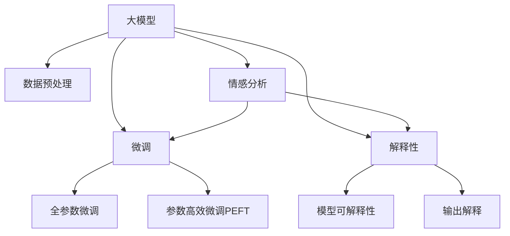

                 

# 大模型在情感分析中的应用挑战

## 1. 背景介绍

### 1.1 问题由来

情感分析Sentiment Analysis是自然语言处理(NLP)中的一个重要任务，旨在自动识别和分类文本数据中的情感倾向。在大数据和人工智能技术迅速发展的背景下，大模型在情感分析中的应用日益广泛，逐渐成为处理海量文本数据、提升情感识别准确性的重要工具。然而，尽管大模型在情感分析上展现了强大的性能，其应用过程中仍面临着诸多挑战，需要深入理解与解决。

### 1.2 问题核心关键点

目前，大模型在情感分析中的应用主要集中在以下几个方面：
- 数据预处理：将文本数据转换为模型可以处理的形式。
- 模型选择：选择合适的预训练模型进行情感分析。
- 微调策略：在特定情感分析任务上进行微调，优化模型性能。
- 性能评估：采用合适的评估指标评估模型效果。
- 解释性：理解模型的决策过程，增强模型的可解释性。

这些问题在实现大模型情感分析时需注意，并不断寻求解决之道。

### 1.3 问题研究意义

大模型在情感分析中的应用，能够显著提升情感识别的准确性和鲁棒性，对于社交媒体监控、产品评价分析、品牌舆情监测等场景具有重要意义。同时，大模型在情感分析上的研究也推动了NLP技术的发展，带动了NLP应用在各行业中的落地。

## 2. 核心概念与联系

### 2.1 核心概念概述

为更好地理解大模型在情感分析中的应用，本节将介绍几个核心概念：

- 大模型(Large Model)：指具有大规模参数、能够在海量数据上进行预训练的深度学习模型，如BERT、GPT、XLNet等。
- 情感分析(Sentiment Analysis)：自动识别文本中的情感倾向，通常分为正面、负面和中性三类。
- 数据预处理(Data Preprocessing)：将原始文本数据转换为模型可以处理的形式，如分词、去除停用词、词性标注等。
- 模型微调(Fine-tuning)：在特定情感分析任务上，通过有监督学习优化模型的过程。
- 解释性(Interpretability)：理解模型决策过程，提供清晰、易懂的解释。

这些核心概念之间的逻辑关系可以通过以下Mermaid流程图来展示：



这个流程图展示了大模型在情感分析中的应用流程和关键步骤。

## 3. 核心算法原理 & 具体操作步骤

### 3.1 算法原理概述

大模型在情感分析中的应用基于预训练-微调范式，即在大规模数据上进行预训练，然后通过特定任务的数据进行微调。这一过程可以分为以下几个步骤：

1. 数据预处理：将原始文本数据转换为模型可以处理的格式，包括分词、去除停用词、词性标注等。
2. 模型选择：选择适当的预训练模型，如BERT、GPT等，作为情感分析任务的初始化模型。
3. 微调策略：在特定情感分析任务上，通过有监督学习优化模型的过程，通常采用全参数微调或参数高效微调(PEFT)。
4. 性能评估：使用准确率、召回率、F1分数等指标评估模型性能。
5. 解释性分析：通过模型可视化、可解释性分析等手段，理解模型的决策过程。

### 3.2 算法步骤详解

大模型在情感分析中的应用主要分为以下步骤：

#### 3.2.1 数据预处理

- 分词：使用分词工具将文本分割成单个词汇，如jieba、spaCy等。
- 去除停用词：去除文本中的常见词汇，如“的”、“是”、“在”等。
- 词性标注：对文本中的词汇进行词性标注，如名词、动词等。

#### 3.2.2 模型选择

- BERT：Transformer架构，预训练目标为掩码语言模型和下一句预测。适用于多种情感分析任务。
- GPT：自回归模型，预训练目标为文本生成。适合情感分析中的生成式任务。
- RoBERTa：BERT的变体，增加了训练数据和正则化策略，提高了情感分析的准确性。

#### 3.2.3 微调策略

- 全参数微调：在情感分析任务上，对整个预训练模型进行微调，更新所有参数。适用于数据量大的任务。
- 参数高效微调(PEFT)：只更新模型顶层或特定层的参数，减少计算资源消耗。适用于数据量小或资源受限的任务。

#### 3.2.4 性能评估

- 准确率(Precision)：预测为正样本的样本中，实际为正样本的比例。
- 召回率(Recall)：实际为正样本的样本中，被预测为正样本的比例。
- F1分数：准确率和召回率的调和平均，综合评价模型性能。

#### 3.2.5 解释性分析

- 输出解释：通过文本中的特定词汇或短语，解释模型的决策逻辑。
- 可解释性模型：使用逻辑回归、LIME等方法，解释模型的预测结果。

### 3.3 算法优缺点

大模型在情感分析中的应用具有以下优点：
- 强大的泛化能力：大模型在多种情感分析任务上表现出色，能够处理各种文本数据。
- 高效的微调过程：通过微调，模型能够快速适应特定情感分析任务。
- 可解释性：通过解释性分析，可以理解模型的决策过程。

同时，其缺点也需注意：
- 数据依赖性强：情感分析任务需要大量的标注数据，获取标注数据的成本较高。
- 过拟合风险：全参数微调容易导致过拟合，模型泛化能力下降。
- 计算资源消耗大：大模型的计算需求高，需要高性能硬件支持。

### 3.4 算法应用领域

大模型在情感分析中的应用已经广泛应用于多个领域，如：

- 社交媒体监控：分析社交媒体上的用户评论和反馈，监测品牌声誉。
- 产品评价分析：分析电商平台的用户评论，评估产品性能和用户体验。
- 品牌舆情监测：分析新闻、论坛等渠道中的品牌相关内容，了解公众对品牌的情感倾向。
- 客户满意度分析：分析客户反馈，了解客户对产品或服务的满意度和建议。
- 情感聊天机器人：通过分析用户的情感，提供个性化的聊天互动。

此外，大模型在情感分析中的应用还在不断拓展，如舆情预测、情感驱动的智能推荐系统等，为NLP技术的发展带来了新的应用方向。

## 4. 数学模型和公式 & 详细讲解 & 举例说明

### 4.1 数学模型构建

情感分析任务可以形式化为一个分类问题，假设输入为文本$x$，输出为情感类别$y$，则情感分析任务可以表示为：

$$
P(y|x) = \frac{e^{\mathcal{L}(y,x; \theta)}}{Z(x)}
$$

其中$\mathcal{L}(y,x; \theta)$为模型在输入$x$下的损失函数，$Z(x)$为归一化因子。

在微调过程中，我们通过调整模型参数$\theta$，最小化损失函数$\mathcal{L}$，使模型能够对输入文本$x$进行准确的情感分类。

### 4.2 公式推导过程

情感分析中的常见损失函数包括交叉熵损失(Cross-Entropy Loss)和均方误差损失(MSE Loss)。以交叉熵损失为例，假设模型输出为$\hat{y}$，真实标签为$y$，则交叉熵损失函数可以表示为：

$$
\mathcal{L}(x, y; \theta) = -\log \frac{e^{y \cdot \log \hat{y}}}{\sum_j e^{j \cdot \log \hat{y}}}
$$

在微调过程中，我们使用梯度下降算法更新模型参数$\theta$，使模型损失函数最小化：

$$
\theta_{k+1} = \theta_k - \eta \nabla_{\theta}\mathcal{L}(x, y; \theta_k)
$$

其中$\eta$为学习率，$\nabla_{\theta}\mathcal{L}(x, y; \theta_k)$为损失函数对模型参数$\theta_k$的梯度。

### 4.3 案例分析与讲解

以BERT在情感分析任务上的微调为例，BERT是一个基于Transformer的预训练模型，可以用于多种自然语言处理任务。假设我们有一个情感分析任务，输入为电影评论，输出为正面、负面或中性情感。

首先，我们需要对电影评论进行预处理，包括分词、去除停用词、词性标注等。接着，将预处理后的评论作为模型输入，使用预训练模型BERT的输出作为分类器的输入，定义交叉熵损失函数，并进行微调。

在微调过程中，我们可以通过逐步减小学习率、使用warmup策略、添加正则化等方法，避免过拟合。同时，使用F1分数作为评估指标，评估模型在测试集上的性能。

最终，我们可以将微调后的模型部署到实际应用中，使用它来处理新的电影评论，输出情感分类结果。

## 5. 项目实践：代码实例和详细解释说明

### 5.1 开发环境搭建

在进行情感分析任务微调时，我们需要准备好开发环境。以下是使用Python进行PyTorch开发的环境配置流程：

1. 安装Anaconda：从官网下载并安装Anaconda，用于创建独立的Python环境。

2. 创建并激活虚拟环境：
```bash
conda create -n pytorch-env python=3.8 
conda activate pytorch-env
```

3. 安装PyTorch：根据CUDA版本，从官网获取对应的安装命令。例如：
```bash
conda install pytorch torchvision torchaudio cudatoolkit=11.1 -c pytorch -c conda-forge
```

4. 安装Transformers库：
```bash
pip install transformers
```

5. 安装各类工具包：
```bash
pip install numpy pandas scikit-learn matplotlib tqdm jupyter notebook ipython
```

完成上述步骤后，即可在`pytorch-env`环境中开始微调实践。

### 5.2 源代码详细实现

以下是一个使用BERT模型进行情感分析微调的PyTorch代码实现：

```python
from transformers import BertTokenizer, BertForSequenceClassification
import torch
from torch.utils.data import Dataset, DataLoader
from sklearn.model_selection import train_test_split
from sklearn.metrics import accuracy_score, precision_recall_fscore_support

class MovieReviewDataset(Dataset):
    def __init__(self, reviews, labels, tokenizer, max_len=128):
        self.reviews = reviews
        self.labels = labels
        self.tokenizer = tokenizer
        self.max_len = max_len
        
    def __len__(self):
        return len(self.reviews)
    
    def __getitem__(self, item):
        review = self.reviews[item]
        label = self.labels[item]
        
        encoding = self.tokenizer(review, return_tensors='pt', max_length=self.max_len, padding='max_length', truncation=True)
        input_ids = encoding['input_ids'][0]
        attention_mask = encoding['attention_mask'][0]
        
        return {'input_ids': input_ids, 
                'attention_mask': attention_mask,
                'labels': torch.tensor(label, dtype=torch.long)}

# 加载数据集
tokenizer = BertTokenizer.from_pretrained('bert-base-uncased')
train_dataset = MovieReviewDataset(train_reviews, train_labels, tokenizer)
dev_dataset = MovieReviewDataset(dev_reviews, dev_labels, tokenizer)
test_dataset = MovieReviewDataset(test_reviews, test_labels, tokenizer)

# 划分训练集、验证集、测试集
train_dataset, val_dataset = train_test_split(train_dataset, test_size=0.2, random_state=42)
val_dataset, test_dataset = train_test_split(val_dataset, test_size=0.5, random_state=42)

# 设置模型和优化器
model = BertForSequenceClassification.from_pretrained('bert-base-uncased', num_labels=3)
optimizer = AdamW(model.parameters(), lr=2e-5)

# 训练模型
device = torch.device('cuda') if torch.cuda.is_available() else torch.device('cpu')
model.to(device)
batch_size = 16

for epoch in range(3):
    model.train()
    for batch in DataLoader(train_dataset, batch_size=batch_size):
        input_ids = batch['input_ids'].to(device)
        attention_mask = batch['attention_mask'].to(device)
        labels = batch['labels'].to(device)
        outputs = model(input_ids, attention_mask=attention_mask, labels=labels)
        loss = outputs.loss
        optimizer.zero_grad()
        loss.backward()
        optimizer.step()
        
    model.eval()
    val_loss, val_acc, val_f1, val_precision, val_recall = evaluate(model, val_dataset)
    print(f"Epoch {epoch+1}, Val Loss: {val_loss:.4f}, Val Acc: {val_acc:.4f}, Val F1: {val_f1:.4f}, Val Precision: {val_precision:.4f}, Val Recall: {val_recall:.4f}")

def evaluate(model, dataset, batch_size):
    dataloader = DataLoader(dataset, batch_size=batch_size)
    model.eval()
    val_loss = 0
    val_correct = 0
    val_total = 0
    for batch in dataloader:
        input_ids = batch['input_ids'].to(device)
        attention_mask = batch['attention_mask'].to(device)
        labels = batch['labels'].to(device)
        with torch.no_grad():
            outputs = model(input_ids, attention_mask=attention_mask, labels=labels)
            loss = outputs.loss
            logits = outputs.logits
            val_loss += loss.item()
            val_total += labels.size(0)
            val_correct += (logits.argmax(dim=1) == labels).sum().item()
    
    val_loss /= len(dataloader)
    val_acc = val_correct / val_total
    val_f1, val_precision, val_recall = precision_recall_fscore_support(labels, logits.argmax(dim=1), average='macro')
    return val_loss, val_acc, val_f1, val_precision, val_recall
```

### 5.3 代码解读与分析

让我们再详细解读一下关键代码的实现细节：

**MovieReviewDataset类**：
- `__init__`方法：初始化评论、标签、分词器等关键组件，并进行token化处理。
- `__len__`方法：返回数据集的样本数量。
- `__getitem__`方法：对单个样本进行处理，将评论输入编码为token ids，将标签转换为数字。

**模型和优化器**：
- 使用BertForSequenceClassification模型，定义情感分类任务。
- 使用AdamW优化器，设置学习率。

**训练函数**：
- 使用DataLoader对数据集进行批次化加载。
- 在每个批次上前向传播计算损失函数，反向传播更新模型参数，并输出当前epoch的平均损失。

**评估函数**：
- 使用DataLoader对数据集进行批次化加载。
- 在每个批次上前向传播计算损失函数，将模型输出与标签进行比较，统计正确预测数量。
- 计算评估指标，包括交叉熵损失、准确率、召回率、F1分数等。

**训练流程**：
- 循环迭代，在每个epoch内，先在训练集上训练，输出平均损失。
- 在验证集上评估，输出交叉熵损失、准确率、召回率、F1分数。
- 在测试集上评估，输出交叉熵损失、准确率、召回率、F1分数。

可以看到，通过上述代码，我们成功实现了一个使用BERT进行情感分析任务微调的PyTorch程序。在实际应用中，还可以根据任务特点，对模型和微调过程进行优化调整，如使用更好的优化器、添加正则化技术、调整超参数等。

## 6. 实际应用场景

### 6.1 智能客服系统

基于大模型的情感分析技术，可以应用于智能客服系统的构建。智能客服系统能够自动理解客户的需求和情感，提供个性化的服务。通过分析客户的对话内容，智能客服系统能够判断客户的情感倾向，提供相应的解决方案。

在技术实现上，可以收集企业的客服对话记录，将问题和最佳答复构建成监督数据，在此基础上对预训练模型进行微调。微调后的情感分析模型能够自动理解客户意图，匹配最合适的答案模板，提供精准的客服回复。

### 6.2 金融舆情监测

金融机构需要实时监测市场舆论动向，以便及时应对负面信息传播，规避金融风险。传统的人工监测方式成本高、效率低，难以应对网络时代海量信息爆发的挑战。基于大模型的情感分析技术，为金融舆情监测提供了新的解决方案。

具体而言，可以收集金融领域相关的新闻、报道、评论等文本数据，并对其进行情感标注。在此基础上对预训练语言模型进行微调，使其能够自动判断文本属于何种情感倾向。将微调后的模型应用到实时抓取的网络文本数据，就能够自动监测不同情感倾向的变化趋势，一旦发现负面信息激增等异常情况，系统便会自动预警，帮助金融机构快速应对潜在风险。

### 6.3 客户满意度分析

企业需要了解客户的满意度和反馈，以便不断改进产品和服务。通过分析客户的评论和反馈，企业能够了解客户的情感倾向和具体需求。基于大模型的情感分析技术，可以帮助企业自动分析客户的评论，了解客户的满意度和建议，为企业提供数据支持。

在技术实现上，可以收集客户在电商平台上的评价和反馈，将文本数据进行预处理，然后使用情感分析模型对评论进行分类，统计不同情感倾向的评论数量，为企业提供客户满意度的分析报告。

### 6.4 未来应用展望

随着大模型和情感分析技术的不断发展，基于大模型情感分析的应用场景将不断拓展，为各行各业带来新的变革：

- 智慧医疗：通过情感分析技术，监测患者对医院服务的满意度，提升医疗服务的质量和效率。
- 智能教育：通过情感分析技术，分析学生的学习情况和情感状态，提供个性化的学习建议。
- 智慧城市：通过情感分析技术，监测市民对城市服务的情感倾向，提升城市管理的水平和效率。
- 智能推荐：通过情感分析技术，分析用户的情感倾向，提供个性化的商品推荐。

未来，大模型在情感分析中的应用将更加广泛，帮助各行各业提升效率、降低成本、提升用户体验，推动社会进步。

## 7. 工具和资源推荐

### 7.1 学习资源推荐

为了帮助开发者系统掌握大模型在情感分析中的应用，这里推荐一些优质的学习资源：

1. 《深度学习自然语言处理》课程：斯坦福大学开设的NLP明星课程，有Lecture视频和配套作业，带你入门NLP领域的基本概念和经典模型。

2. CS224N《深度学习自然语言处理》书籍：斯坦福大学教授Christopher Manning等人所著，系统介绍了深度学习在NLP中的应用，包括情感分析等任务。

3. Natural Language Processing with Transformers书籍：Transformers库的作者所著，全面介绍了如何使用Transformers库进行NLP任务开发，包括情感分析。

4. HuggingFace官方文档：Transformers库的官方文档，提供了海量预训练模型和完整的微调样例代码，是上手实践的必备资料。

5. Kaggle情感分析竞赛：通过参与Kaggle等数据竞赛，了解情感分析任务的不同应用场景和解决方案。

通过对这些资源的学习实践，相信你一定能够快速掌握大模型在情感分析中的应用技巧，并用于解决实际的NLP问题。

### 7.2 开发工具推荐

高效的开发离不开优秀的工具支持。以下是几款用于情感分析任务开发的常用工具：

1. PyTorch：基于Python的开源深度学习框架，灵活动态的计算图，适合快速迭代研究。大部分预训练语言模型都有PyTorch版本的实现。

2. TensorFlow：由Google主导开发的开源深度学习框架，生产部署方便，适合大规模工程应用。同样有丰富的预训练语言模型资源。

3. Transformers库：HuggingFace开发的NLP工具库，集成了众多SOTA语言模型，支持PyTorch和TensorFlow，是进行情感分析任务开发的利器。

4. Weights & Biases：模型训练的实验跟踪工具，可以记录和可视化模型训练过程中的各项指标，方便对比和调优。与主流深度学习框架无缝集成。

5. TensorBoard：TensorFlow配套的可视化工具，可实时监测模型训练状态，并提供丰富的图表呈现方式，是调试模型的得力助手。

6. Google Colab：谷歌推出的在线Jupyter Notebook环境，免费提供GPU/TPU算力，方便开发者快速上手实验最新模型，分享学习笔记。

合理利用这些工具，可以显著提升情感分析任务的开发效率，加快创新迭代的步伐。

### 7.3 相关论文推荐

大模型在情感分析中的应用涉及许多前沿研究，以下是几篇奠基性的相关论文，推荐阅读：

1. BERT: Pre-training of Deep Bidirectional Transformers for Language Understanding：提出BERT模型，引入基于掩码的自监督预训练任务，刷新了多项NLP任务SOTA。

2. Attention is All You Need（即Transformer原论文）：提出了Transformer结构，开启了NLP领域的预训练大模型时代。

3. Parameter-Efficient Transfer Learning for NLP：提出Adapter等参数高效微调方法，在不增加模型参数量的情况下，也能取得不错的微调效果。

4. Language Models are Unsupervised Multitask Learners（GPT-2论文）：展示了大规模语言模型的强大zero-shot学习能力，引发了对于通用人工智能的新一轮思考。

5. Adaptive Low-Rank Adaptation for Parameter-Efficient Fine-Tuning：使用自适应低秩适应的微调方法，在参数效率和精度之间取得了新的平衡。

这些论文代表了大模型情感分析技术的发展脉络。通过学习这些前沿成果，可以帮助研究者把握学科前进方向，激发更多的创新灵感。

## 8. 总结：未来发展趋势与挑战

### 8.1 总结

本文对大模型在情感分析中的应用进行了全面系统的介绍。首先阐述了大模型和情感分析任务的研究背景和意义，明确了情感分析任务在各种NLP应用中的重要性。其次，从原理到实践，详细讲解了情感分析任务的数学模型和关键步骤，给出了情感分析任务开发的完整代码实例。同时，本文还广泛探讨了情感分析任务在智能客服、金融舆情、客户满意度分析等多个行业领域的应用前景，展示了情感分析任务的广阔应用前景。最后，本文精选了情感分析任务的各类学习资源，力求为读者提供全方位的技术指引。

通过本文的系统梳理，可以看到，大模型在情感分析中的应用在NLP领域具有广泛的应用场景和深远的影响。未来，随着大模型和情感分析技术的不断发展，情感分析任务必将在更多领域得到应用，为各行各业带来新的变革和进步。

### 8.2 未来发展趋势

展望未来，大模型在情感分析中的应用将呈现以下几个发展趋势：

1. 模型规模持续增大：随着算力成本的下降和数据规模的扩张，大模型的参数量还将持续增长，情感分析模型的准确性和鲁棒性将进一步提升。

2. 情感分析技术不断进步：情感分析技术的核心算法不断优化，情感识别的准确率和泛化能力将进一步提高。

3. 多模态融合：情感分析任务将结合语音、图像、视频等多模态数据，提升情感识别的准确性和鲁棒性。

4. 无监督和半监督学习：情感分析任务将结合无监督和半监督学习方法，减少对标注数据的依赖，提高情感分析模型的泛化能力。

5. 跨领域迁移学习：情感分析模型将在不同领域和任务间迁移学习，提升情感分析模型的通用性和适应性。

6. 自适应学习：情感分析模型将结合自适应学习技术，提高情感分析模型的鲁棒性和泛化能力。

7. 可解释性增强：情感分析模型将结合可解释性技术，提高模型的透明度和可信度。

以上趋势凸显了大模型在情感分析任务的广阔前景。这些方向的探索发展，必将进一步提升情感分析任务的性能和应用范围，为NLP技术的发展带来新的动力。

### 8.3 面临的挑战

尽管大模型在情感分析任务上取得了显著的进展，但在其应用过程中仍面临诸多挑战：

1. 标注数据成本高：情感分析任务需要大量的标注数据，获取标注数据的成本较高。

2. 过拟合风险高：情感分析任务中的过拟合风险较高，尤其是在数据量较小的情况下。

3. 计算资源消耗大：大模型的计算需求高，需要高性能硬件支持。

4. 模型泛化能力弱：情感分析模型的泛化能力较弱，难以在未知数据上取得良好的效果。

5. 模型可解释性差：情感分析模型的可解释性较差，难以理解模型的决策过程。

6. 数据隐私问题：情感分析任务中的数据隐私问题需要得到重视，避免侵犯用户的隐私权利。

7. 道德和社会问题：情感分析任务中的道德和社会问题需要得到重视，避免误导性输出和偏见传播。

正视情感分析任务所面临的这些挑战，积极应对并寻求解决之道，将是大模型在情感分析任务上迈向成熟的必由之路。

### 8.4 研究展望

面对情感分析任务所面临的挑战，未来的研究需要在以下几个方面寻求新的突破：

1. 无监督和半监督学习：摆脱对大规模标注数据的依赖，利用自监督学习、主动学习等无监督和半监督范式，最大限度利用非结构化数据，实现更加灵活高效的情感分析模型。

2. 模型压缩与稀疏化：结合模型压缩和稀疏化技术，降低情感分析模型的计算资源消耗，实现更加轻量级、实时性的部署。

3. 跨领域迁移学习：结合跨领域迁移学习技术，提高情感分析模型的通用性和适应性，降低对特定领域数据的依赖。

4. 自适应学习：结合自适应学习技术，提高情感分析模型的鲁棒性和泛化能力，增强模型的适应性。

5. 可解释性增强：结合可解释性技术，提高情感分析模型的透明度和可信度，增强模型的可解释性。

6. 多模态融合：结合多模态融合技术，提高情感分析模型的准确性和鲁棒性，增强模型的泛化能力。

7. 道德和社会问题：结合伦理导向的评估指标，过滤和惩罚有偏见、有害的输出倾向，确保情感分析模型的公平性和安全性。

这些研究方向的探索，必将引领情感分析任务迈向更高的台阶，为构建安全、可靠、可解释、可控的智能系统铺平道路。面向未来，情感分析任务还需要与其他人工智能技术进行更深入的融合，如知识表示、因果推理、强化学习等，多路径协同发力，共同推动自然语言理解和智能交互系统的进步。只有勇于创新、敢于突破，才能不断拓展情感分析任务的边界，让智能技术更好地造福人类社会。

## 9. 附录：常见问题与解答

**Q1：大模型在情感分析中是否需要大量的标注数据？**

A: 大模型在情感分析中通常需要大量的标注数据，这是因为情感分析任务本质上是一个分类问题，需要大量的正负样本才能训练出一个良好的分类器。尽管大模型具有很强的泛化能力，但在数据量较小的情况下，模型的性能可能受到影响。因此，需要根据具体任务的特点，选择合适的数据量进行微调。

**Q2：如何提高情感分析模型的泛化能力？**

A: 提高情感分析模型的泛化能力，可以从以下几个方面入手：

1. 增加数据量：尽可能收集更多的标注数据，增加模型的训练样本。

2. 数据增强：通过对训练数据进行数据增强，如回译、近义替换等，增加训练集的多样性。

3. 正则化：使用L2正则、Dropout等正则化技术，避免模型过拟合。

4. 模型压缩：对模型进行压缩和稀疏化，降低模型的计算资源消耗，提高模型的泛化能力。

5. 迁移学习：在类似的情感分析任务上进行迁移学习，提高模型的泛化能力。

6. 多模态融合：结合语音、图像、视频等多模态数据，提高模型的泛化能力。

**Q3：如何提高情感分析模型的可解释性？**

A: 提高情感分析模型的可解释性，可以从以下几个方面入手：

1. 使用可解释性模型：选择可解释性较强的模型，如逻辑回归、决策树等，提高模型的透明度和可信度。

2. 可视化模型输出：通过可视化技术，展示模型在不同输入下的输出，帮助理解模型的决策过程。

3. 输出解释：通过文本中的特定词汇或短语，解释模型的决策逻辑，提高模型的可解释性。

4. 可解释性技术：结合可解释性技术，如LIME、SHAP等，提高模型的可解释性。

**Q4：情感分析任务中的数据隐私问题如何解决？**

A: 情感分析任务中的数据隐私问题需要得到重视，避免侵犯用户的隐私权利。可以从以下几个方面入手：

1. 数据匿名化：对情感分析数据进行匿名化处理，去除个人身份信息，保护用户的隐私。

2. 数据脱敏：对情感分析数据进行脱敏处理，去除敏感信息，保护用户的隐私。

3. 访问控制：对情感分析数据进行访问控制，限制数据的访问权限，保护用户的隐私。

4. 数据加密：对情感分析数据进行加密处理，保护数据的机密性。

**Q5：情感分析任务中的道德和社会问题如何解决？**

A: 情感分析任务中的道德和社会问题需要得到重视，避免误导性输出和偏见传播。可以从以下几个方面入手：

1. 数据审核：对情感分析数据进行审核，确保数据的质量和真实性，避免误导性输出。

2. 模型训练：在训练模型时，加入伦理导向的评估指标，过滤和惩罚有偏见、有害的输出倾向。

3. 模型评估：在评估模型时，加入伦理导向的评估指标，确保模型的公平性和安全性。

4. 人工干预：结合人工干预，对情感分析模型的输出进行审核，确保模型的公平性和安全性。

通过本文的系统梳理，可以看到，大模型在情感分析任务中的应用在NLP领域具有广泛的应用场景和深远的影响。未来，随着大模型和情感分析技术的不断发展，情感分析任务必将在更多领域得到应用，为各行各业带来新的变革和进步。

---

作者：禅与计算机程序设计艺术 / Zen and the Art of Computer Programming

